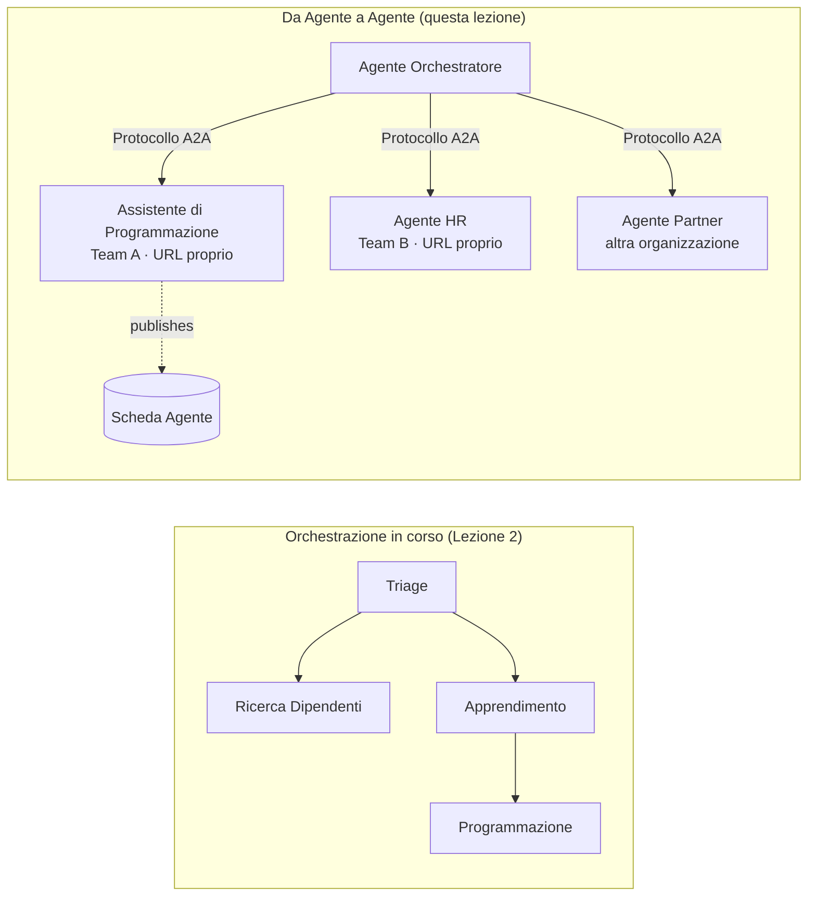

# Lezione 7: Orchestrazione Multi-Agente & Agente-a-Agente (A2A)

Con [Lezione 6](../lesson-6-toolbox/README.md) puoi costruire strumenti governati e agenti ospitati.
Ma i sistemi reali usano raramente **un solo** agente. Man mano che cresci, componi **molti** agenti — alcuni che
possiedi, alcuni di proprietà di altri team, altri che operano in altre organizzazioni completamente diverse. Questa lezione riguarda
come gli agenti lavorano **insieme**.

Hai già incontrato una forma di design multi-agente in
[‘agent-orchestration.py’ della Lezione 2](../lesson-2-agent-development/README.md): il pattern **handoff**
, dove un agente di triage indirizza a specialisti **all'interno di un singolo processo**. Questa lezione si spinge
a un livello superiore — verso **Agente-a-Agente (A2A)**, il protocollo aperto per agenti che operano come
**servizi in rete** indipendenti e si chiamano tra loro attraverso i confini di processo, team e organizzazioni.

## Obiettivi di Apprendimento

Al termine di questa lezione sarai in grado di:

- Spiegare la differenza tra **orchestrazione in-process** (handoff/workflow) e
  comunicazione **Agente-a-Agente (A2A)**, e scegliere quella giusta.
- Descrivere i blocchi costitutivi di A2A: **Scheda Agente**, **competenze**, **attività**, e **scoperta**.
- **Esporre** un agente del Microsoft Agent Framework come un servizio A2A con `A2AExecutor`.
- **Consumare** un agente remoto come pari in rete con `A2AAgent`.
- Applicare considerazioni aziendali ad A2A: **sicurezza, identità, governance, osservabilità e costo**.

---

## Prerequisiti

1. Aver completato la [Lezione 2](../lesson-2-agent-development/README.md) (sviluppo agenti & orchestrazione).
2. Un progetto **Microsoft Foundry** con un modello attualmente distribuito (per esempio `gpt-5.1`, e
   `gpt-5-codex` per l'esempio di codice). Evitare GPT-4o / GPT-4.1 ritirati.
3. **Azure CLI** autenticata: `az login`.
4. **Python 3.12+** con le dipendenze del corso installate (`pip install -r ../requirements.txt`).
   La Lezione 7 aggiunge i pacchetti in anteprima `agent-framework-a2a`, `a2a-sdk`, e `uvicorn`.
5. `FOUNDRY_PROJECT_ENDPOINT` e `FOUNDRY_MODEL` impostati nel tuo `.env` (vedi il README del corso).

---

## 1. Due modi in cui gli agenti lavorano insieme

Non esiste un unico pattern "multi-agente". Scegli quello che corrisponde al tuo **confine**:

| Pattern | Dove gli agenti operano | Come si connettono | Da usare quando |
|---------|-------------------------|-------------------|-----------------|
| **Handoff / Workflow** (Lezione 2) | Un processo, un codebase | Grafo in-memory (`HandoffBuilder`, `WorkflowBuilder`) | Possiedi tutti gli agenti e li distribuisci insieme. |
| **Agente-a-Agente (A2A)** (questa lezione) | Servizi separati, cicli di vita separati | Protocollo **A2A** aperto su HTTP, scoperto tramite **Schede Agente** | Gli agenti sono posseduti da diversi team/organizzazioni, scalano indipendentemente, o sono scritti in framework diversi. |

Handoff riguarda il **routing interno a un’applicazione**. A2A riguarda la **composizione di agenti come

servizi indipendenti** — l'equivalente dell'agente per il passaggio da chiamate di funzione a microservizi.



> **Si compongono.** Un orchestratore che costruisci con `HandoffBuilder` può avere **agenti A2A remoti**
> come partecipanti — instradamento in-process verso servizi che a loro volta possono essere eseguiti ovunque.

---

## 2. I blocchi di costruzione A2A

A2A è un **protocollo aperto** (non specifico di Microsoft), quindi un agente A2A può essere utilizzato da Microsoft
Agent Framework, LangGraph, codice personalizzato, o lo stack di un'altra azienda. Quattro concetti sono importanti:

- **Agent Card** — un piccolo documento JSON, pubblicato in
  `/.well-known/agent-card.json`, che pubblicizza il **nome, descrizione, URL, versione,
  competenze e capacità** dell'agente. Questo è il modo in cui un client **scopre** cosa può fare un agente remoto.
- **Competenze** — le cose dichiarate che l'agente può fare (`id`, `name`, `description`, `tags`,
  `examples`). I client (e i modelli) le usano per decidere se chiamarlo.
- **Attività** — una chiamata a un agente A2A è una **attività** con un ciclo di vita (inviata → in corso →
  completata/fallita). Il server traccia le attività in un **archivio attività**; sono supportati aggiornamenti in streaming.
- **Discovery** — un client dato solo un URL recupera la Agent Card e sa come chiamare l'agente.

---

## 3. Esporre un agente come servizio A2A — `a2a_server.py`

Il lato **Build/serve** incapsula qualsiasi agente Microsoft Agent Framework con `A2AExecutor` e lo monta
su un'applicazione HTTP A2A. Vedi [`a2a_server.py`](../../../lesson-7-multi-agent-a2a/a2a_server.py). Il collegamento chiave:

```python
from agent_framework.a2a import A2AExecutor
from a2a.server.apps import A2AStarletteApplication
from a2a.server.request_handlers import DefaultRequestHandler
from a2a.server.tasks import InMemoryTaskStore
from a2a.types import AgentCapabilities, AgentCard, AgentSkill

agent = client.as_agent(name="coding-assistant", instructions="...")

agent_card = AgentCard(
    name="Coding Assistant",
    description="Generates runnable code samples...",
    url="http://localhost:9000/",
    version="1.0.0",
    capabilities=AgentCapabilities(streaming=True),
    default_input_modes=["text"],
    default_output_modes=["text"],
    skills=[AgentSkill(id="generate-code", name="Generate code",
                       description="Write a runnable code snippet.", tags=["code"])],
)

request_handler = DefaultRequestHandler(
    agent_executor=A2AExecutor(agent),
    task_store=InMemoryTaskStore(),
)
app = A2AStarletteApplication(agent_card=agent_card, http_handler=request_handler).build()
# servito con uvicorn sulla porta 9000
```

Nota che il codice dell'agente è **immutato** — `A2AExecutor` adatta il tuo agente esistente al protocollo.
La Agent Card è ciò che lo rende **scoperto** da qualsiasi client A2A.

---

## 4. Consumare un agente remoto — `a2a_client.py`

Il lato **Consume** si connette a un agente remoto **tramite URL**, recupera la sua Agent Card, e la chiama
esattamente come un agente locale. Vedi [`a2a_client.py`](../../../lesson-7-multi-agent-a2a/a2a_client.py):

```python
from agent_framework.a2a import A2AAgent

remote_agent = A2AAgent(name="remote-coding-assistant", url="http://localhost:9000")
result = await remote_agent.run("Write a Python function that reverses a string.")
print(result.text)
```

Questo è tutto il senso di A2A: dal lato chiamante un agente remoto si comporta come qualsiasi altro
agente `agent_framework`, così puoi inserirlo in un flusso di lavoro o passare il controllo a esso — anche se viene eseguito
in un processo differente, su una macchina differente, posseduta da un team differente.

### Eseguilo end to end

```bash
# Terminal 1 — avvia il servizio A2A
python a2a_server.py

# Terminal 2 — chiamalo
python a2a_client.py "Write a Python function that reverses a string."
```

Vedrai la risposta dell'assistente alla codifica arrivare tramite il protocollo A2A. Apri
`http://localhost:9000/.well-known/agent-card.json` in un browser per vedere la Agent Card pubblicata.

---

## 5. Questioni aziendali

Trasformare gli agenti in servizi di rete introduce le stesse preoccupazioni di qualsiasi sistema distribuito —
più alcune specifiche per l'AI:


- **Identità e autenticazione.** Non esporre mai un agente A2A non autenticato. La Scheda Agente contiene
  `security` / `security_schemes`, e `A2AAgent` accetta un `auth_interceptor` così i chiamanti possono allegare
  credenziali (token bearer OAuth, chiavi API). Usa Entra ID / identità gestite per
  l'autenticazione servizio a servizio in produzione; metti il servizio dietro un gateway.
- **Governance.** Combina A2A con la [Cassetta degli Attrezzi della Lezione 6](../lesson-6-toolbox/README.md): un agente remoto
  può essere pubblicato come **strumento A2A** all'interno di una cassetta degli attrezzi governata così si applicano
  RBAC, iniezione credenziali, e politiche di vincolo centralizzate.
- **Osservabilità.** Ora una richiesta attraversa i confini dei processi, quindi propaga il tracciamento
  lungo la chiamata. Abilita [Foundry Observability / OpenTelemetry](../lesson-3-agent-evals/README.md) sia sull'
  orchestratore che su ogni agente remoto così ottieni una traccia end-to-end unica.
- **Versioning.** La Scheda Agente ha una `version`. Trattala come un'API: cambiamenti additivi sono sicuri;
  interrompere il contratto di una skill richiede una nuova versione e una finestra di migrazione per i consumatori.
- **Affidabilità.** Gli agenti remoti falliscono indipendentemente. Imposta timeout (`A2AAgent(timeout=...)`), gestisci
  fallimenti parziali, e non lasciare che un peer lento blocchi tutta l'orchestrazione.
- **Costo.** Ogni chiamata a un agente remoto è una propria invocazione di modello. Il fan-out moltiplica il consumo di token —
  pianifica di conseguenza, e preferisci indirizzare a **un** agente migliore piuttosto che fare broadcasting a molti.

---

## Esercizi pratici

1. **Aggiungi un secondo servizio.** Copia `a2a_server.py` per esporre l'agente **employee-search** sulla porta
   9001 con la sua Scheda Agente e le sue skill. Esegui entrambi e fai in modo che un client chiami entrambi.
2. **Orchestra peer remoti.** Costruisci un piccolo `HandoffBuilder` (o un semplice router) i cui partecipanti
   includono due `A2AAgent` che puntano ai tuoi due servizi. Indirizza una query a quello giusto.
3. **Rendilo sicuro.** Aggiungi un `auth_interceptor` al client e richiedi un token bearer sul server.
   Cosa si rompe se manca il token? Dove conserveresti il token in produzione?
4. **Handoff vs A2A.** Scrivi due brevi paragrafi: quando manterresti il handoff in-process della Lezione 2,
   e quando è giustificata la complessità aggiuntiva di A2A? Fornisci un esempio concreto per ciascuno.

---

## Risorse

- [Agent-to-Agent (A2A) — Microsoft Agent Framework](https://learn.microsoft.com/agent-framework/user-guide/agent-orchestration/a2a)
- [Orchestrazione multi-agente — Microsoft Agent Framework](https://learn.microsoft.com/agent-framework/user-guide/agent-orchestration/)
- [Specifiche del protocollo A2A](https://a2a-protocol.org/)
- [SDK Python A2A (`a2a-sdk`)](https://github.com/a2aproject/a2a-python)
- [Foundry Agent Service — pattern multi-agente](https://learn.microsoft.com/azure/ai-foundry/agents/concepts/connected-agents)

---

**Precedente:** [Lezione 6 — Microsoft Toolbox](../lesson-6-toolbox/README.md)

---

<!-- CO-OP TRANSLATOR DISCLAIMER START -->
**Disclaimer**:
Questo documento è stato tradotto utilizzando il servizio di traduzione AI [Co-op Translator](https://github.com/Azure/co-op-translator). Sebbene ci impegniamo per garantire la precisione, si prega di notare che le traduzioni automatizzate possono contenere errori o imprecisioni. Il documento originale nella sua lingua nativa deve essere considerato la fonte autorevole. Per informazioni critiche, si raccomanda una traduzione professionale effettuata da un essere umano. Non siamo responsabili per eventuali malintesi o interpretazioni errate derivanti dall’uso di questa traduzione.
<!-- CO-OP TRANSLATOR DISCLAIMER END -->