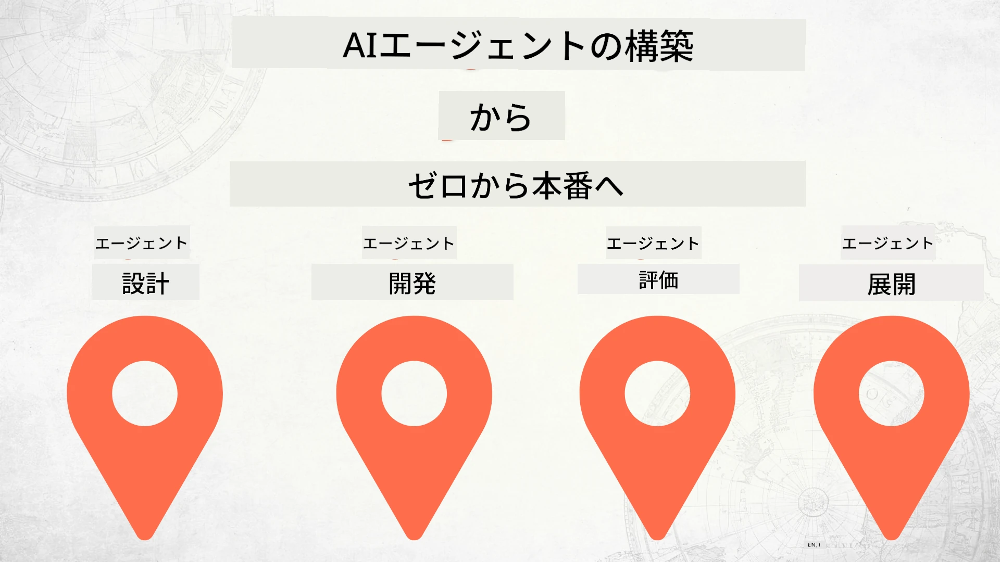

# ゼロから製品化へ：AIエージェント構築



### 🌐 多言語対応

#### GitHub Actionによるサポート（自動化＆常に最新）

<!-- CO-OP TRANSLATOR LANGUAGES TABLE START -->
[アラビア語](../ar/README.md) | [ベンガル語](../bn/README.md) | [ブルガリア語](../bg/README.md) | [ビルマ語（ミャンマー）](../my/README.md) | [中国語（簡体字）](../zh-CN/README.md) | [中国語（繁体字、香港）](../zh-HK/README.md) | [中国語（繁体字、マカオ）](../zh-MO/README.md) | [中国語（繁体字、台湾）](../zh-TW/README.md) | [クロアチア語](../hr/README.md) | [チェコ語](../cs/README.md) | [デンマーク語](../da/README.md) | [オランダ語](../nl/README.md) | [エストニア語](../et/README.md) | [フィンランド語](../fi/README.md) | [フランス語](../fr/README.md) | [ドイツ語](../de/README.md) | [ギリシャ語](../el/README.md) | [ヘブライ語](../he/README.md) | [ヒンディー語](../hi/README.md) | [ハンガリー語](../hu/README.md) | [インドネシア語](../id/README.md) | [イタリア語](../it/README.md) | [日本語](./README.md) | [カンナダ語](../kn/README.md) | [韓国語](../ko/README.md) | [リトアニア語](../lt/README.md) | [マレー語](../ms/README.md) | [マラヤーラム語](../ml/README.md) | [マラーティー語](../mr/README.md) | [ネパール語](../ne/README.md) | [ナイジェリア・ピジン語](../pcm/README.md) | [ノルウェー語](../no/README.md) | [ペルシャ語（ファールシー）](../fa/README.md) | [ポーランド語](../pl/README.md) | [ポルトガル語（ブラジル）](../pt-BR/README.md) | [ポルトガル語（ポルトガル）](../pt-PT/README.md) | [パンジャブ語（グルムキー）](../pa/README.md) | [ルーマニア語](../ro/README.md) | [ロシア語](../ru/README.md) | [セルビア語（キリル文字）](../sr/README.md) | [スロバキア語](../sk/README.md) | [スロベニア語](../sl/README.md) | [スペイン語](../es/README.md) | [スワヒリ語](../sw/README.md) | [スウェーデン語](../sv/README.md) | [タガログ語（フィリピン）](../tl/README.md) | [タミル語](../ta/README.md) | [テルグ語](../te/README.md) | [タイ語](../th/README.md) | [トルコ語](../tr/README.md) | [ウクライナ語](../uk/README.md) | [ウルドゥー語](../ur/README.md) | [ベトナム語](../vi/README.md)

> **ローカルでクローンしたいですか？**

> このリポジトリには50以上の言語翻訳が含まれており、ダウンロードサイズが大幅に増加します。翻訳を含めずにクローンするには、スパースチェックアウトを使用してください：
> ```bash
> git clone --filter=blob:none --sparse https://github.com/microsoft/Building-AI-Agents-From-Zero-To-Production.git
> cd Building-AI-Agents-From-Zero-To-Production
> git sparse-checkout set --no-cone '/*' '!translations' '!translated_images'
> ```
> これにより、コース完了に必要なすべてがより速くダウンロードできます。
<!-- CO-OP TRANSLATOR LANGUAGES TABLE END -->

## AIエージェント開発ライフサイクルの基礎を学ぶコース

[](https://github.com/microsoft/Building-AI-Agents-From-Zero-To-Production/blob/master/LICENSE?WT.mc_id=academic-105485-koreyst)
[](https://GitHub.com/microsoft/Building-AI-Agents-From-Zero-To-Production/graphs/contributors/?WT.mc_id=academic-105485-koreyst)
[](https://GitHub.com/microsoft/Building-AI-Agents-From-Zero-To-Production/issues/?WT.mc_id=academic-105485-koreyst)
[](https://GitHub.com/microsoft/Building-AI-Agents-From-Zero-To-Production/pulls/?WT.mc_id=academic-105485-koreyst)
[](http://makeapullrequest.com?WT.mc_id=academic-105485-koreyst)

[](https://discord.gg/Kuaw3ktsu6)

## 🌱 はじめに

このコースでは、AIエージェントの構築とデプロイの基礎を学ぶレッスンが用意されています。

各レッスンは前のレッスンを基にしているため、最初から順に進めていくことをおすすめします。

AIエージェントのトピックをさらに探求したい場合は、[初心者向けAIエージェントコース](https://aka.ms/ai-agents-beginners)もご覧ください。

### 他の学習者に出会い、質問に答えてもらう

AIエージェントの構築で困ったり質問がある場合は、[Microsoft Foundry Discord](https://discord.gg/Kuaw3ktsu6)の専用Discordチャンネルに参加してください。

### 必要なもの

各レッスンにはローカルで実行できるコードサンプルが含まれています。リポジトリを[フォーク](https://github.com/microsoft/Building-AI-Agents-From-Zero-To-Production/fork)して、自分のコピーを作成できます。

このコースでは次のものを使用しています：

- [Microsoft Agent Framework (MAF)](https://aka.ms/ai-agents-beginners/agent-framework)
- [Microsoft Foundry](https://azure.microsoft.com/products/ai-foundry)
- [Azure OpenAI Service](https://azure.microsoft.com/products/ai-foundry/models/openai)
- [Azure CLI](https://learn.microsoft.com/cli/azure/authenticate-azure-cli?view=azure-cli-latest)

開始する前にこれらのサービスへのアクセスをご確認ください。

今後、モデルホスティングやサービスのオプションも追加予定です。

## 🗃️ レッスン

| **レッスン**                        | **説明**                                                                                          |
|-----------------------------------|--------------------------------------------------------------------------------------------------|
| [エージェント設計](./lesson-1-agent-design/README.md)       | 「開発者オンボーディング」エージェントユースケースの紹介と効果的なエージェント設計方法              |
| [エージェント開発](./lesson-2-agent-development/README.md)  | Microsoft Agent Framework (MAF)を使い、新規開発者のオンボーディング支援のために3つのエージェントを作成 |
| [エージェント評価](./lesson-3-agent-evals/README.md)        | Microsoft Foundryを活用し、AIエージェントのパフォーマンス評価と改善方法を学ぶ                      |
| [エージェントデプロイメント](./lesson-4-agent-deployment/README.md) | ホスト型エージェントとOpenAI Chatkitを使い、AIエージェントを製品環境にデプロイする方法              |


## 🎒 その他のコース

私たちのチームは他にもコースを制作しています！ぜひご覧ください：

<!-- CO-OP TRANSLATOR OTHER COURSES START -->
### LangChain
[](https://aka.ms/langchain4j-for-beginners)
[](https://aka.ms/langchainjs-for-beginners?WT.mc_id=m365-94501-dwahlin)

---

### Azure / Edge / MCP / エージェント関連
[](https://github.com/microsoft/AZD-for-beginners?WT.mc_id=academic-105485-koreyst)
[](https://github.com/microsoft/edgeai-for-beginners?WT.mc_id=academic-105485-koreyst)
[](https://github.com/microsoft/mcp-for-beginners?WT.mc_id=academic-105485-koreyst)
[](https://github.com/microsoft/ai-agents-for-beginners?WT.mc_id=academic-105485-koreyst)

---
 
### 生成AIシリーズ
[](https://github.com/microsoft/generative-ai-for-beginners?WT.mc_id=academic-105485-koreyst)
[-9333EA?style=for-the-badge&labelColor=E5E7EB&color=9333EA)](https://github.com/microsoft/Generative-AI-for-beginners-dotnet?WT.mc_id=academic-105485-koreyst)
[-C084FC?style=for-the-badge&labelColor=E5E7EB&color=C084FC)](https://github.com/microsoft/generative-ai-for-beginners-java?WT.mc_id=academic-105485-koreyst)
[-E879F9?style=for-the-badge&labelColor=E5E7EB&color=E879F9)](https://github.com/microsoft/generative-ai-with-javascript?WT.mc_id=academic-105485-koreyst)

---
 
### 基礎学習
[](https://aka.ms/ml-beginners?WT.mc_id=academic-105485-koreyst)
[](https://aka.ms/datascience-beginners?WT.mc_id=academic-105485-koreyst)
[](https://aka.ms/ai-beginners?WT.mc_id=academic-105485-koreyst)
[](https://github.com/microsoft/Security-101?WT.mc_id=academic-96948-sayoung)
[](https://aka.ms/webdev-beginners?WT.mc_id=academic-105485-koreyst)
[](https://aka.ms/iot-beginners?WT.mc_id=academic-105485-koreyst)
[](https://github.com/microsoft/xr-development-for-beginners?WT.mc_id=academic-105485-koreyst)

---
 
### Copilotシリーズ
[](https://aka.ms/GitHubCopilotAI?WT.mc_id=academic-105485-koreyst)
[](https://github.com/microsoft/mastering-github-copilot-for-dotnet-csharp-developers?WT.mc_id=academic-105485-koreyst)
[](https://github.com/microsoft/CopilotAdventures?WT.mc_id=academic-105485-koreyst)
<!-- CO-OP TRANSLATOR OTHER COURSES END -->

## 貢献について

このプロジェクトでは、貢献や提案を歓迎します。ほとんどの貢献において、あなたが権利を有し、実際にその権利を当プロジェクトに付与することを宣言する
寄稿者ライセンス契約（CLA）への同意が必要です。詳細は<https://cla.opensource.microsoft.com>をご覧ください。

プルリクエストを提出すると、CLAボットが自動的にCLAの提出が必要かどうかを判断し、適切にプルリクエストに表示します（例：ステータスチェック、コメント）。
ボットの指示に従ってください。CLAを使用しているすべてのリポジトリで、一度だけ手続きすれば済みます。

このプロジェクトは[Microsoftオープンソース行動規範](https://opensource.microsoft.com/codeofconduct/)を採用しています。
詳細は[行動規範FAQ](https://opensource.microsoft.com/codeofconduct/faq/)をご覧いただくか、
ご質問やコメントは[opencode@microsoft.com](mailto:opencode@microsoft.com)までお問い合わせください。

## 商標について

このプロジェクトにはプロジェクト、製品、サービスの商標やロゴが含まれている場合があります。Microsoftの商標やロゴの正当な使用は、
[Microsoftの商標およびブランドのガイドライン](https://www.microsoft.com/legal/intellectualproperty/trademarks/usage/general)に従う必要があります。
このプロジェクトの改変版におけるMicrosoftの商標やロゴの使用は、混乱を招くことやMicrosoftのスポンサーシップを示唆することがあってはなりません。
第三者の商標やロゴの使用に関しては、それぞれの第三者のポリシーに従ってください。

## サポートを受ける

AIアプリの構築で行き詰まったり質問がある場合は、以下に参加してください：

[](https://discord.gg/Kuaw3ktsu6)

製品のフィードバックや構築中のエラーは以下でご報告ください：

[](https://aka.ms/foundry/forum)

---

<!-- CO-OP TRANSLATOR DISCLAIMER START -->
**免責事項**：
本書類はAI翻訳サービス「[Co-op Translator](https://github.com/Azure/co-op-translator)」を用いて翻訳されました。正確性には努めておりますが、自動翻訳には誤りや不正確な箇所が含まれる可能性があることをご了承ください。原文はその言語の正式な文書として扱われるべきです。重要な情報については、専門の翻訳者による人力翻訳を推奨します。本翻訳の利用に起因するいかなる誤解や解釈の相違についても、当方は責任を負いかねます。
<!-- CO-OP TRANSLATOR DISCLAIMER END -->
