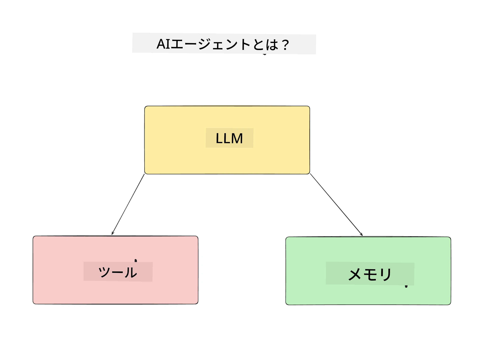
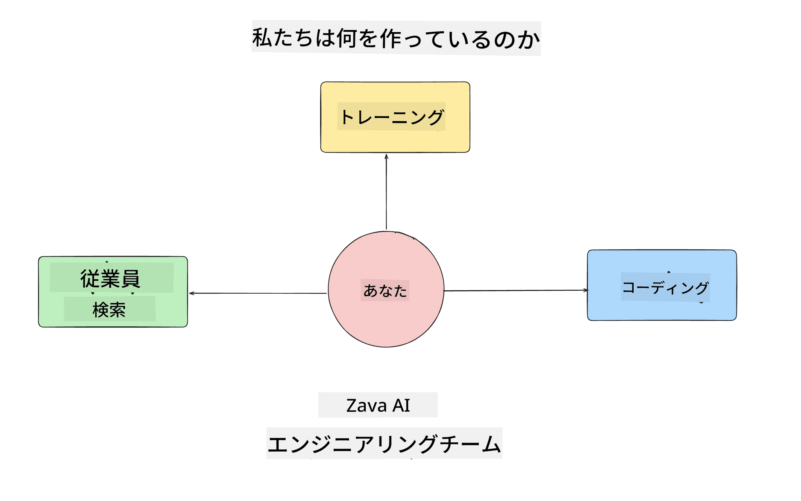
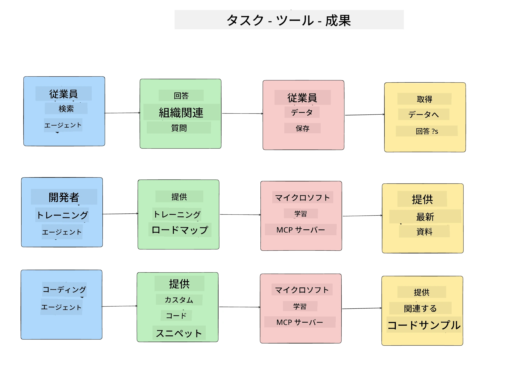
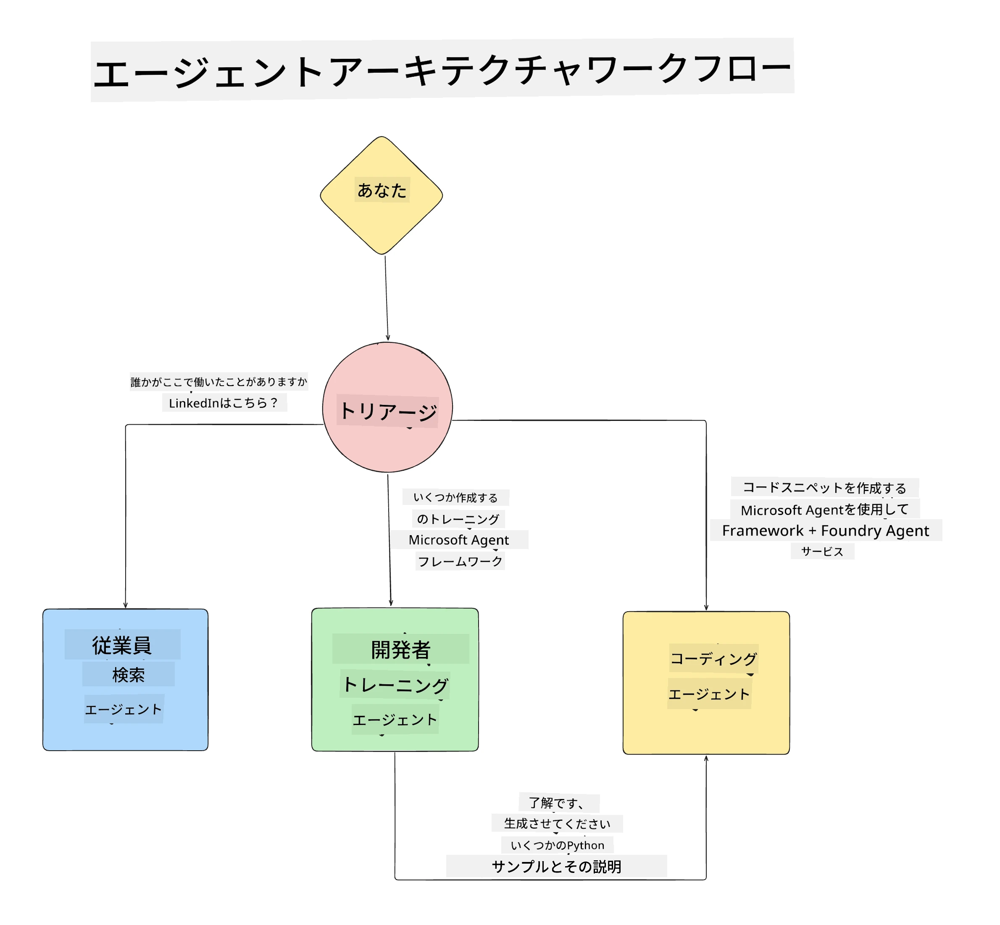

# レッスン 1: AI エージェント設計

「ゼロからプロダクションまでの AI エージェント構築コース」の最初のレッスンへようこそ！

このレッスンでは以下の内容をカバーします：

- AI エージェントとは何かを定義する
  
- 構築する AI エージェントアプリケーションについて議論する  

- 各エージェントに必要なツールとサービスを特定する
  
- エージェントアプリケーションの設計をする
  
まずはエージェントとは何か、そしてなぜアプリケーション内で使用するのかを定義することから始めましょう。

> **コースを始める前に。** この最初のレッスンは概念的な内容で、コードを実行する必要はありません。
> [レッスン 2](../lesson-2-agent-development/README.md) 以降では、**Microsoft Foundry** へのアクセス権を持つ **Azure サブスクリプション**、展開された **GPT-5 シリーズモデル**（例：`gpt-5.1` — 廃止された GPT-4o / GPT-4.1 は避けてください）、**Python 3.12+**、および **Azure CLI** (`az login`) が必要です。詳細やリンクはコースのREADMEの [What You Need](../README.md#what-you-need) を参照してください。

## AI エージェントとは？

AI エージェントの構築方法を初めて探る場合、AI エージェントを正確に定義する方法について疑問を持つかもしれません。

AI エージェントを構成する要素で簡単に定義すると：

**大規模言語モデル（LLM）** - LLM はユーザーからの自然言語を処理して、完了したいタスクを解釈する能力と、利用可能なツールの説明を解釈する能力の両方を提供します。

<strong>ツール</strong> - これらは関数、API、データストア、および LLM がユーザーの要望するタスクを完了するために利用できるその他のサービスです。

<strong>メモリ</strong> - これで AI エージェントとユーザー間の短期および長期のインタラクションを保存します。この情報の保存と取得は、時間をかけて改善を行い、ユーザーの好みを保持するために重要です。

## 当社の AI エージェント利用ケース

このコースでは、新しい開発者が AI エージェント開発チームに参加するのを支援する AI エージェントアプリケーションを構築します！

開発作業を始める前に、成功した AI エージェントアプリケーションを作成するための最初のステップは、ユーザーが AI エージェントとどのようにやりとりすることを期待するかという明確なシナリオを定義することです。

このアプリケーションのために、次のシナリオに取り組みます：

**シナリオ 1**：新しい従業員が組織に参加し、所属チームと接続方法について知りたい。

**シナリオ 2:** 新しい従業員が最初に取り組むべき最適なタスクを知りたい。

**シナリオ 3:** 新しい従業員がタスクを開始するのに役立つ学習リソースやコードサンプルを収集したい。

## ツールとサービスの特定

これらのシナリオが作成できたので、次のステップは AI エージェントがこれらのタスクを完了するために必要なツールとサービスをマップすることです。

このプロセスはコンテキストエンジニアリングに分類され、AI エージェントが適切なタイミングで適切なコンテキストを持ってタスクを完了できるように焦点を当てます。

シナリオごとに進め、各エージェントのタスク、ツールおよび望ましい成果をリストアップして優れたエージェント設計を行いましょう。

### シナリオ 1 - 従業員検索エージェント

<strong>タスク</strong> - 組織の従業員についての質問に答える（入社日、現在のチーム、勤務地、最終職位など）。

<strong>ツール</strong> - 現在の従業員リストと組織図のデータストア

<strong>成果</strong> - データストアから組織に関する一般的な質問や特定の従業員に関する質問に答えることができる。

### シナリオ 2 - タスク推奨エージェント

<strong>タスク</strong> - 新しい従業員の開発者経験に基づき、新従業員が取り組める1〜3の課題を提案する。

<strong>ツール</strong> - オープンイシューを取得し、開発者プロフィールを構築する GitHub MCP サーバー

<strong>成果</strong> - GitHub プロフィールの直近5つのコミットとGitHubプロジェクトのオープンイシューを読み取り、マッチングに基づいた推薦が可能。

### シナリオ 3 - コード支援エージェント

<strong>タスク</strong> - 「タスク推奨」エージェントが推奨したオープンイシューに基づき、リソースを調査し、コードスニペットを生成して従業員を支援する。

<strong>ツール</strong> - リソースを検索する Microsoft Learn MCP と、カスタムコードスニペットを生成する Code Interpreter。

<strong>成果</strong> - ユーザーが追加の助けを求めた場合、Learn MCP サーバーでリソースのリンクとスニペットを提供し、その後 Code Interpreter エージェントに小さなコードスニペットと解説の生成を引き継ぐワークフローを実現。

## エージェントアプリケーションの設計

各エージェントの定義ができたので、それぞれのエージェントがタスクに応じて連携しつつ別々に動作する様子を理解するためのアーキテクチャ図を作成しましょう：

## 次のステップ

各エージェントとエージェントシステムの設計ができたので、次のレッスンでこれらのエージェントを開発していきましょう！

---

<!-- CO-OP TRANSLATOR DISCLAIMER START -->
**免責事項**：
本書類は AI 翻訳サービス [Co-op Translator](https://github.com/Azure/co-op-translator) を使用して翻訳されています。正確性を期していますが、自動翻訳には誤りや不正確な部分が含まれる可能性があることをご承知おきください。原文の原語版が正式な情報源とみなされるべきです。重要な情報については、専門の人間による翻訳を推奨します。本翻訳の利用により生じたいかなる誤解や解釈違いについても、当方は責任を負いかねます。
<!-- CO-OP TRANSLATOR DISCLAIMER END -->