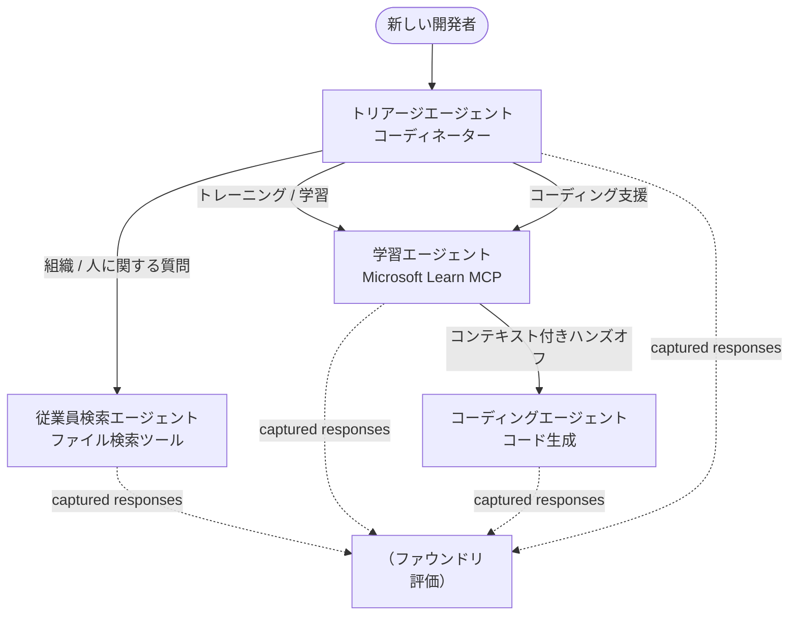

# レッスン3: Microsoft Foundryを使ったエージェント評価

**「ゼロからプロダクションまでのAIエージェント構築」** コースの第3回目のレッスンへようこそ！

[レッスン2](../lesson-2-agent-development/README.md)ではエージェントを構築しました。このレッスンでは、
もっと難しい問いに答える方法を学びます：**それらは本当に優れているのか？** エージェントを稼働させるのは簡単ですが、
正しくルーティングし、データに基づき、道具を正しく使っているかを知ることが、
デモと本番システムを分ける決定的な要素です。

このレッスンで扱う内容は以下の通りです：

- なぜエージェント評価が重要か、従来のテストとどのように異なるか
- <strong>オブザーバビリティ</strong>、<strong>スモークテスト</strong>、<strong>評価</strong>の違い
- 測定するマルチエージェントワークフロー
- 内蔵の **Microsoft Foundry 評価者**（関連性、適合性、ツール呼び出し精度、ツール出力利用度）
- [`agent-evals.py`](../../../lesson-3-agent-evals/agent-evals.py) による評価パイプラインのステップバイステップの説明
- 実行方法と結果の読み方

---

## なぜエージェントを評価するのか？

従来のユニットテストは `add(2, 2) == 4` と断言しますが、エージェントはそうではありません — 同じ
プロンプトでも毎回異なる表現を返し、ツールの呼び出し順も異なり得て、
「正しい」はしばしば真偽値ではなく度合いの問題です。正確な文字列を断言できません。

代わりにモデルベースの <em>評価者</em>（「LLMを審査員として使う」とも呼ばれる）やツール使用の決定的なチェックを使い、
エージェントを <strong>品質の軸</strong> に沿って評価します。これにより次のようなことがわかります：

- 答えは実際に質問に答えているか？（<strong>関連性</strong>）
- 答えは取得したデータに基づいているか、それともエージェントが幻覚を見たか？（<strong>適合性</strong>）
- エージェントは正しいツールを正しい引数で呼び出したか？（<strong>ツール呼び出し精度</strong>）
- エージェントはツールの返却値を実際に利用したか？（<strong>ツール出力利用度</strong>）

### 三つの補完的な品質レイヤー

これらは競合する技術ではありません — プロダクションで動くエージェントは三つとも使います：

| レイヤー | 解決する問い | コスト | 実行タイミング | 本レッスンでの説明 |
|-------|--------------------|------|--------------|------------|
| **オブザーバビリティ / トレース** | *エージェントは何をしたか、一歩ずつ？* | 無料 (常時オン) | プロダクションで継続的に | 本レッスン |
| <strong>スモークテスト</strong> | *エージェントは到達可能で基本プロンプトに従っているか？* | 安価、数秒 | デプロイ毎 | [レッスン4](../lesson-4-agentdeployment/README.md#smoke-testing-the-hosted-agent-ci-gate) |
| <strong>評価</strong> | *応答はどれほど<strong>良い</strong>か？* | 遅め、モデル課金 | 要求時／夜間／リリース前 | 本レッスン |

スモークテストは「壊れたか？」に答え、評価は「良いか？」に答えます。両方必要です。

---

## 前提条件

1. [レッスン2](../lesson-2-agent-development/README.md)を終了していること（エージェントとベクターストア）。
2. **Microsoft Foundry** プロジェクトを持っていること。
3. **Azure CLI** にログイン済みであること：`az login`。
4. **Python 3.12+** と本コースの依存関係がインストール済みであること：

   ```bash
   pip install -r ../requirements.txt
   ```


5. 環境変数（このフォルダーに `.env` ファイルを作成するか、エクスポートしてください）:

   | 変数 | 用途 |
   |----------|---------|
   | `FOUNDRY_PROJECT_ENDPOINT` | あなたのFoundryプロジェクトのエンドポイント（`https://<account>.services.ai.azure.com/api/projects/<project>`）。エージェントの`FoundryChatClient` <strong>および</strong> 評価ヘルパーで読み取られます。 |
   | `FOUNDRY_MODEL` | <strong>エージェント</strong> が実行するモデルデプロイメント（例: `gpt-5.1`）。 |
   | `VECTOR_STORE_ID` | レッスン2で作成した従業員ディレクトリのベクトルストア |
   | `AZURE_AI_MODEL_DEPLOYMENT_NAME` | <strong>評価者が使用する</strong> モデルデプロイメント（デフォルトは `FOUNDRY_MODEL`、次に `gpt-5.1`） |

> エージェントは `FoundryChatClient` を使用しており、`FOUNDRY_`プレフィックスの
> 変数（`FOUNDRY_PROJECT_ENDPOINT`、`FOUNDRY_MODEL`）から設定を読み取ります。クラウド評価ヘルパーは
> `azure-ai-projects` SDK を使用し、`AZURE_AI_PROJECT_ENDPOINT` が設定されていない場合は
> `FOUNDRY_PROJECT_ENDPOINT` にフォールバックするため、2つの `FOUNDRY_` 変数だけで
> 全レッスンを実行可能です。
>
> 評価者自身もモデルによって動作しているため、`AZURE_AI_MODEL_DEPLOYMENT_NAME`
> で判定を行うデプロイメントを制御します。エージェントが使用するモデルと
> 同じモデルである必要はありません。

---

## 評価するワークフロー

何かを評価するには、まずそれを実行しなければなりません。このレッスンでは **Developer Onboarding** の
複数エージェントワークフローを再利用します：<strong>トリアージ</strong> コーディネーターが3人の専門家に引き継ぎます。



このワークフローはMicrosoft Agent Frameworkの **handoff** オーケストレーションで構築されています。評価の
キーとなる考え方は <strong>すべてのエージェントターンがサーバー側で永続化</strong> され、
`response_id` で識別されることです。これらのIDが評価サービスに渡されます。

---

## 評価パイプラインの各ステップ

[`agent-evals.py`](../../../lesson-3-agent-evals/agent-evals.py) では6段階のパイプラインを実装しています。各ステップの内容とその理由を説明します。


それぞれのエージェントによって生成された `response_id` と `conversation_id` を記録します。永続化されたレスポンスは評価の
生の素材であり、 <em>あらためて生成された</em> のではなく本物の本番形状のレスポンスを評価しています。


ワークフローが実際に評価しようとしているエージェントに対して正しく動いたかを確認できます。


### ステップ3 — 最終応答を取得

各エージェントについて、最後の `response_id` をプロジェクトのOpenAI互換クライアント
(`project_client.get_openai_client().responses.retrieve(...)`) から取得し、評価される
テキストをプレビューできます。

### ステップ4 — 評価を作成

評価は4つの **組み込みFoundry評価者** によって行われます：

| 評価者 | `evaluator_name` | 測定内容 |
|-----------|------------------|------------------|

| 関連性 | `builtin.relevance` | 応答はユーザーの要求に応えていますか？ |

| Groundedness | `builtin.groundedness` | 応答は取得したデータやツールデータで裏付けられているか（幻覚ではないか）？ |
| Tool-call accuracy | `builtin.tool_call_accuracy` | 正しいツールが正しい引数で呼び出されたか？ |
| Tool-output utilization | `builtin.tool_output_utilization` | エージェントは実際に回答にツールの結果を使ったか？ |

各評価器は `AZURE_AI_MODEL_DEPLOYMENT_NAME` で指定されたデプロイメントで初期化されます。

> **なぜこの4つ？** 関連性と根拠性は<em>回答の品質</em>を測定し、2つのツール評価器は<em>エージェントの行動</em>を測定します — これは従来のNLP指標が完全に見落とす部分です。ツールを使うマルチエージェントシステムでは、実際の性能劣化はツール指標に隠れていることが多いのです。


### ステップ5 — 評価の実行

取得された `response_id` はデータソースとして `evals.runs.create(...)` に渡されます。サービスは保存された各応答をすべての評価器にリプレイします。


### ステップ6 — 結果のモニターと確認

コードは実行が `completed` または `failed` になるまでポーリングし、その後、結果数と**`report_url`**（Foundryポータルへの詳細リンク：各指標のスコア、合否数、個別判定応答を検査可）を表示します。


---

## 実行してみる

```bash
cd lesson-3-agent-evals
python agent-evals.py
```

デフォルトでは最初の例のクエリ（`"I'm new here! Has anyone worked at Microsoft here?"`）を評価します。`run_evaluation_workflow()` にはさらに2つのマルチインテント例クエリが含まれています — `query` 変数を切り替えて、複数のエージェントが動作するルーティングシナリオを試せます。


期待されるコンソールの流れ：

```
Step 1: Running Developer Onboarding Workflow
Step 2: Response Data Summary
Step 3: Fetching Agent Responses
Step 4: Creating Evaluation
Step 5: Running Evaluation
Step 6: Monitoring Evaluation
  Status: running ...
  Evaluation completed successfully
  Report URL: https://...   <-- open this in the Foundry portal
```

---

## オブザーバビリティとトレーシング

評価は応答の<em>質</em>を教えてくれますが、<strong>オブザーバビリティ</strong>はそれらの応答がどうやって生成されたか — すべてのエージェントの経路、ツール呼び出し、トークン数、レイテンシーを示します。Microsoft Foundryでは、エージェントの実行はポータルで確認可能なOpenTelemetryトレースを出力し、Agent Frameworkは単一の呼び出しでこれらをAzure Monitor / Application Insightsにエクスポートできます：

```python
from agent_framework.foundry import FoundryChatClient

client = FoundryChatClient()
client.configure_azure_monitor()   # Application Insightsにトレースとメトリクスをエクスポートする
```


トレーシングを使って、評価スコアが悪い原因を<strong>デバッグ</strong>しましょう：例えば、groundedness が低下したときは、トレースでファイル検索ツールが何も返さなかったか、エージェントが返されたデータを無視したか（これが tool-output utilization のスコア付け内容）を確認できます。


---

## 「実行」から「良い」へ：実際の使い方

- **プレリリースゲート。** 新しいプロンプトやモデルを公開する前に、固定された代表的なクエリセットに対して評価を実行します。スコアを前バージョンと比較し、低下をリグレッションとして扱います。
- **毎晩の品質シグナル。** データや依存関係の変化によるドリフトを検知するために評価をスケジュールします。
- **スモークテストとの併用。** [Lesson 4のスモークテスト](../lesson-4-agentdeployment/README.md#smoke-testing-the-hosted-agent-ci-gate) は迅速なデプロイゲートであり、評価はより遅く深い品質ゲートです。コストの低い方は毎マージで、コストの高い方はスケジュールまたはリリース前に実行します。


---

## モダナイゼーション ノート

このサンプルは現在の Microsoft Agent Framework Foundry API 表面 (`agent_framework.foundry`) への移行中です。コードを更新する場合は、リポジトリのルートにある[`MIGRATION-GUIDE.md`](../MIGRATION-GUIDE.md) を参照してください。そこには検証済みのインポートとクライアントマッピング（例：`AzureAIClient` -> `FoundryChatClient`、`client.get_file_search_tool(...)` / `client.get_mcp_tool(...)` でのホストツール構築）が記載されています。評価の概念と上述の6ステップパイプラインはこの移行で変更されません。


---

## リソース

- [生成AIモデルとアプリケーションの評価 (Microsoft Learn)](https://learn.microsoft.com/en-us/azure/ai-foundry/concepts/evaluation-approach-gen-ai)
- [生成AIの組み込み評価器](https://learn.microsoft.com/en-us/azure/ai-foundry/concepts/evaluation-evaluators/agent-evaluators)
- [Microsoft Foundryのオブザーバビリティ](https://learn.microsoft.com/en-us/azure/ai-foundry/concepts/observability)
- [Microsoft Agent Framework](https://github.com/microsoft/agent-framework)
- [エージェントのハンドオフ オーケストレーション](https://learn.microsoft.com/en-us/agent-framework/workflows/orchestrations/handoff)

---

<!-- CO-OP TRANSLATOR DISCLAIMER START -->
**免責事項**：
本書類は AI 翻訳サービス [Co-op Translator](https://github.com/Azure/co-op-translator) を使用して翻訳されています。正確性を期していますが、自動翻訳には誤りや不正確な部分が含まれる可能性があることをご承知おきください。原文の原語版が正式な情報源とみなされるべきです。重要な情報については、専門の人間による翻訳を推奨します。本翻訳の利用により生じたいかなる誤解や解釈違いについても、当方は責任を負いかねます。
<!-- CO-OP TRANSLATOR DISCLAIMER END -->