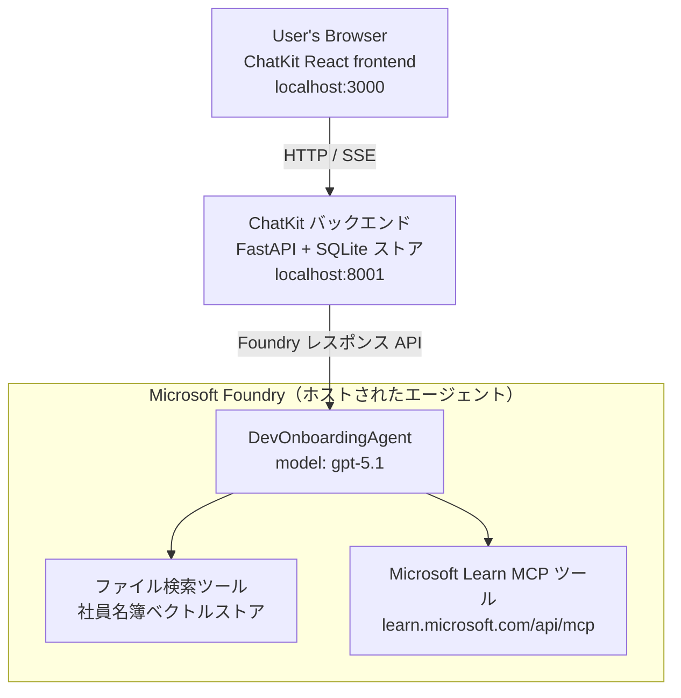

# レッスン 4: Microsoft Foundry ホストエージェント + ChatKit を使ったエージェントのデプロイ

このレッスンでは、ツールを使うエージェントを Microsoft Foundry にホストエージェントとしてデプロイし、それと対話する ChatKit ベースのフロントエンドを作成する方法を示します。

## アーキテクチャ

ホストエージェントは、**単一の `DevOnboardingAgent`**（`gpt-5.1` 上で動作）が、社員ディレクトリのベクトルストアを使った <strong>ファイル検索</strong> ツールと **Microsoft Learn MCP** ツールという 2 つのホストツールを利用して、開発者オンボーディングの質問に回答します。ChatKit の React フロントエンドが FastAPI バックエンドと通信し、バックエンドが Foundry の **Responses API** 経由でエージェントを呼び出します。



## 前提条件

1. 北中部米国リージョンの **Microsoft Foundry プロジェクト**
2. 認証済みの **Azure CLI** (`az login`)
3. インストール済みの **Azure Developer CLI** (`azd`)
4. **Python 3.12+** と **Node.js 18+**
5. 社員データで作成された <strong>ベクトルストア</strong>

## クイックスタート

### 1. 環境変数の設定

```bash
cd lesson-4-agentdeployment
cp .env.example .env
# Microsoft Foundry プロジェクトの詳細を含む .env を編集してください
```

### 2. ホストエージェントのデプロイ

**オプション A: Azure Developer CLI を使用（推奨）**

```bash
cd hosted-agent
azd auth login
azd agent deploy
```

**オプション B: Docker + Azure Container Registry を使用**

```bash
cd hosted-agent

# コンテナをビルドする
docker build -t developer-onboarding-agent:latest .

# ACR のタグ
docker tag developer-onboarding-agent:latest <your-acr>.azurecr.io/developer-onboarding-agent:latest

# ACR にプッシュする
az acr login --name <your-acr>
docker push <your-acr>.azurecr.io/developer-onboarding-agent:latest

# Microsoft Foundry ポータルまたは SDK を介してデプロイする
```

### 3. ChatKit バックエンドの起動

```bash
cd chatkit-server
python -m venv .venv
source .venv/bin/activate  # Windowsの場合：.venv\Scripts\activate
pip install -r requirements.txt
python app.py
```

サーバーは `http://localhost:8001` で起動します

### 4. ChatKit フロントエンドの起動

```bash
cd chatkit-server/frontend
npm install
npm run dev
```

フロントエンドは `http://localhost:3000` で起動します

### 5. アプリケーションのテスト

`http://localhost:3000` をブラウザーで開き、以下のクエリを試してください:

**社員検索:**
- 「私は新しく入りました！Microsoft で働いたことがある人はいますか？」
- 「Azure Functions の経験がある人は誰ですか？」

**学習リソース:**
- 「Kubernetes の学習パスを作成してください」
- 「クラウドアーキテクチャのためにどの資格を取るべきですか？」

**コーディング支援:**
- 「CosmosDB に接続する Python コードの作成を手伝って」
- 「Azure Function を作成する方法を教えて」

**マルチエージェントクエリ:**
- 「クラウドエンジニアとして始めます。誰と繋がり、何を学ぶべきですか？」

## プロジェクト構成

```
lesson-4-agentdeployment/
├── .env.example                 # Environment variables template
├── implementation-plan.md       # Detailed implementation guide
├── README.md                    # This file
├── hosted-agent/               # Microsoft Foundry hosted agent
│   ├── main.py                 # Multi-agent workflow implementation
│   ├── requirements.txt        # Python dependencies
│   ├── Dockerfile              # Container definition
│   └── agent.yaml              # Agent deployment configuration
└── chatkit-server/             # ChatKit server application
    ├── app.py                  # FastAPI backend
    ├── store.py                # SQLite persistence layer
    ├── requirements.txt        # Python dependencies
    └── frontend/               # React frontend
        ├── package.json
        ├── vite.config.ts
        ├── tsconfig.json
        ├── index.html
        └── src/
            ├── main.tsx
            ├── App.tsx
            ├── App.css
            └── index.css
```

## エージェントとそのツール

ホストエージェントは、<strong>単一のエージェント</strong>（`hosted-agent/main.py` に定義された `DevOnboardingAgent`）で、3 つのオンボーディング領域を扱います。複数のサブエージェントを調整するのではなく、それぞれの機能をツールとして開示（またはモデルを直接利用）しています:

| 機能 | 処理方法 | ツール |
|-----------|------------------|------|
| **社員検索＆コネクション** | 社員ディレクトリのベクトルストア上の Foundry ホストのファイル検索 | `client.get_file_search_tool(vector_store_ids=[...])` |
| **学習＆トレーニング** | Microsoft Learn MCP サーバー（ホストされた MCP ツール） | `client.get_mcp_tool(url="https://learn.microsoft.com/api/mcp")` |
| <strong>コーディング支援</strong> | `gpt-5.1` モデルが直接処理 — 外部ツールなし | — |


エージェントは `client.as_agent(name="DevOnboardingAgent", instructions=..., tools=[file_search_tool, learn_mcp_tool])` で作成され、`from_agent_framework(agent).run()` で提供されます。

> **設計ノート.** このレッスンの初期の草案では `HandoffBuilder` を使ったマルチエージェントワークフロー（トリアージ → スペシャリスト）を使用していました。出荷されたエージェントは単一のツール使用エージェントであり、オンボーディングスタイルのQ&Aに対してデプロイや理解が簡単です。マルチエージェントのオーケストレーションと引き継ぎの例については、Lesson 2 と Lesson 3 を参照してください。

## ホスト型エージェントのスモークテスト（CIゲート）

ホスト型エージェントの「正常な」デプロイは、コントロールプレーンが定義を受け入れたことを示すだけであり、
エージェントが実際に応答することを保証しません。依存関係の欠如や、
モデルルーティングの不具合、接続の期限切れにより、見た目は正常だが応答しないエージェントになることがあります。

このレッスンでは、軽量の<strong>スモークテスト</strong>を出荷しており、デプロイ後の迅速で低コストなゲートとして機能します。
GitHub Actions の [AI Smoke Test](https://github.com/marketplace/actions/ai-smoke-test)
を利用し、エージェントの Foundry の **Responses** エンドポイントにプロンプトをPOSTして、
(`POST {project_endpoint}/agents/{agent_name}/endpoint/protocols/openai/responses`)
返されたテキストを検証します。これにより、破損したデプロイメント、認証の退行、
システムプロンプトのずれ、スレッド処理の破損を数秒で検出できます。

> スモークテストは [Lesson 3](../lesson-3-agent-evals/README.md) の完全な評価の代わりには<strong>なりません</strong>。補完するものです。スモークテストは、
> *「エージェントは到達可能で応答し、基本的なプロンプトの期待に沿っているか？」* に答えます。
> 評価は *「応答の質はどれほどよいか？」* に答えます。安価なゲートをすべてのデプロイで実行してください。


### テスト内容

カタログは [`hosted-agent/tests/smoke-tests.json`](../../../lesson-4-agentdeployment/hosted-agent/tests/smoke-tests.json)
にあり、エージェントの三つのドメインおよびプロンプトの順守、多段会話を検証します：

| テスト          | 検証内容                                      |
|---------------|----------------------------------------------|
| `reachability` | エージェントが空でない、スコープ内のテキストで応答するか |
| `employee-search` | ファイル検索ドメインが正常な `200` を返す（返信はデータ依存） |
| `learning-path` | 学習ドメインがトピックを反映し、パス形式の回答を生成する |
| `coding-assistance` | コーディングドメインがコード形式のPython回答を返す |
| `prompt-adherence-offtopic` | トピック外のリクエストがリダイレクトされ、詳細には応答しない |
| `threading-turn-1/2` | 会話の状態が `previous_response_id` によってターン間で保持される |

### CIでの実行

ワークフローは [`.github/workflows/smoke-test-hosted-agent.yml`](../../../.github/workflows/smoke-test-hosted-agent.yml)
にあり、二つのジョブがあります：

- **`static`** — 高速でAzureを使わないゲート。すべてのプルリクエストとプッシュで実行されます：
  Pythonソース全体をコンパイル（`py_compile`）し、Markdownリンクをチェック。秘密情報は不要で、
  フォークのPRでも動作します。
- **`smoke`** — 下記のAzure連携スモークテスト。必要に応じて
  （Actions → **Agent CI (static + smoke)** → Run workflow）で実行でき、デプロイ後の連結も可能です。


スモークジョブ用にこのリポジトリの<strong>変数</strong>と<strong>シークレット</strong>を設定してください：


| 種類 | 名前 | 値 |
|------|------|-------|

| 変数 | `FOUNDRY_PROJECT_ENDPOINT` | `https://<account>.services.ai.azure.com/api/projects/<project>` |
| 変数 | `HOSTED_AGENT_NAME` | デプロイされたエージェント名（例：`dev-onboarding` — デプロイと一致する必要があります） |
| シークレット | `AZURE_CLIENT_ID` / `AZURE_TENANT_ID` / `AZURE_SUBSCRIPTION_ID` | `azure/login` 用の OIDC フェデレーティッド ID |

ランナーIDには **Foundry プロジェクト スコープ** で **`Azure AI User`** ロールが必要です。これにより、
Responses（および会話）データプレーンのエンドポイントを呼び出すことができます。以下で付与してください：

```bash
az role assignment create \
  --assignee <object-id-or-appId-of-runner-identity> \
  --role "Azure AI User" \
  --scope "/subscriptions/<sub>/resourceGroups/<rg>/providers/Microsoft.CognitiveServices/accounts/<account>/projects/<project>"
```

### ローカルで実行する

プッシュ前に同じカタログを実行できます。スコープが `https://ai.azure.com/` のデータプレーントークンを取得し、
ランナーを自分のデプロイメントに向けてください：

```bash
# Audience は https://ai.azure.com/ でなければなりません（cognitiveservices.azure.com のトークンは拒否されます）
export FOUNDRY_TOKEN=$(az account get-access-token --resource https://ai.azure.com/ --query accessToken -o tsv)

git clone https://github.com/JFolberth/ai-smoketest && cd ai-smoketest
python runner.py \
  --project-endpoint "https://<account>.services.ai.azure.com/api/projects/<project>" \
  --agent-name dev-onboarding \
  --tests-file ../lesson-4-agentdeployment/hosted-agent/tests/smoke-tests.json
```

終了コード：`0` すべて成功、`1` いずれかのアサーション失敗、`2` ランナーエラー（カタログ／トークン不正）。

## トラブルシューティング

### エージェントが応答しない場合
- Microsoft Foundry でホステッドエージェントがデプロイおよび起動していることを確認する
- `HOSTED_AGENT_NAME` と `HOSTED_AGENT_VERSION` がデプロイメントと一致していることを確認する

### ベクトルストアのエラー
- `VECTOR_STORE_ID` が正しく設定されていることを確認する
- ベクトルストアに社員データが含まれていることを確認する

### 認証エラー
- `az login` を実行して認証情報を更新する
- Microsoft Foundry プロジェクトにアクセス権があることを確認する

## リソース

- [Microsoft Foundry Hosted Agents Documentation](https://learn.microsoft.com/en-us/azure/ai-foundry/agents/concepts/hosted-agents)
- [Microsoft Agent Framework](https://github.com/microsoft/agent-framework)
- [ChatKit Integration Sample](https://github.com/microsoft/agent-framework/tree/main/python/samples/demos/chatkit-integration)
- [Azure Developer CLI](https://learn.microsoft.com/en-us/azure/developer/azure-developer-cli/overview)
- [AI Smoke Test GitHub Action](https://github.com/marketplace/actions/ai-smoke-test)
- [Smoke Test Microsoft Foundry Agents with GitHub Actions (blog)](https://techcommunity.microsoft.com/blog/azuredevcommunityblog/smoke-test-microsoft-foundry-agents-with-github-actions/4531912)

---

## 次のステップ

あなたのエージェントは Microsoft 管理のインフラ上で動作します。企業の本番環境へ進めるには—
データの所在管理（データ主権、プライベート ネットワーキング、BYO Azure Cosmos DB / Storage / AI Search）やツールのガバナンスを
制御するために、続けて
**[Lesson 5: Production Hosted Agents](../lesson-5-hosted-agents-production/README.md)** を参照ください。ここでは
**Hosted Agents** と **Capability Hosts** の重要な違いを説明しています。

---

<!-- CO-OP TRANSLATOR DISCLAIMER START -->
**免責事項**：
本書類は AI 翻訳サービス [Co-op Translator](https://github.com/Azure/co-op-translator) を使用して翻訳されています。正確性を期していますが、自動翻訳には誤りや不正確な部分が含まれる可能性があることをご承知おきください。原文の原語版が正式な情報源とみなされるべきです。重要な情報については、専門の人間による翻訳を推奨します。本翻訳の利用により生じたいかなる誤解や解釈違いについても、当方は責任を負いかねます。
<!-- CO-OP TRANSLATOR DISCLAIMER END -->