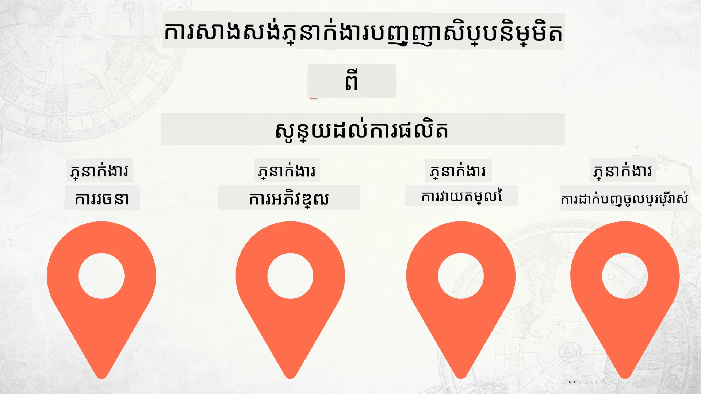

# ការបង្កើតភ្នាក់ងារបញ្ញាសិប្បនិម្មិតពីចូរ​ដល់ផលិតកម្ម



### 🌐 ការគាំទ្រភាសាច្រើន

#### គាំទ្រដោយ GitHub Action (ស្វ័យប្រវត្តិ & តែងតែទាន់សម័យ)

<!-- CO-OP TRANSLATOR LANGUAGES TABLE START -->
[អារ៉ាប់](../ar/README.md) | [បង់្គាលី](../bn/README.md) | [ប៊ូលគារីយ៉ាន់](../bg/README.md) | [ភាសាប៊ឺម៉ាស្ស៊ែរ (ភូមា)](../my/README.md) | [ចិន (សាមញ្ញ)](../zh-CN/README.md) | [ចិន (ប្រពៃណី ហុងកុង)](../zh-HK/README.md) | [ចិន (ប្រពៃណី ម៉ាកាវ)](../zh-MO/README.md) | [ចិន (ប្រពៃណី តៃវ៉ាន់)](../zh-TW/README.md) | [ក្រូអាត](../hr/README.md) | [ឆេក](../cs/README.md) | [ដាណីស](../da/README.md) | [ហូឡង់](../nl/README.md) | [អេស្តូន្យា](../et/README.md) | [ហ្វាំងឡែន](../fi/README.md) | [បារាំង](../fr/README.md) | [អាល្លឺម៉ង់](../de/README.md) | [ក្រិក](../el/README.md) | [ហេប្រ៊ូ](../he/README.md) | [ហិណ្ឌី](../hi/README.md) | [ហុងគ្រី](../hu/README.md) | [ឥណ្ឌូនេស៊ី](../id/README.md) | [អ៊ីតាលី](../it/README.md) | [ជប៉ុន](../ja/README.md) | [កណ្ណាដា](../kn/README.md) | [ខ្មែរ](./README.md) | [កូរ៉េ](../ko/README.md) | [លីទូវ៉ានី](../lt/README.md) | [ម៉ាឡេ](../ms/README.md) | [ម៉ាឡាឡម](../ml/README.md) | [ម៉ារ៉ាត៊ី](../mr/README.md) | [ណេប៉ាល](../ne/README.md) | [ភីឌហ្ស៊ីន នីហ្សេរី](../pcm/README.md) | [ន័រវេ](../no/README.md) | [បាស្ស៊ី (ហ្វារីស៊ី)](../fa/README.md) | [ប៉ូឡូញ](../pl/README.md) | [ព័រទុយហ្កាល់ (ប្រេស៊ីល)](../pt-BR/README.md) | [ព័រទុយហ្កាល់ (ព័រទុយហ្កាល់)](../pt-PT/README.md) | [ប៉ុនជាអ៊ី (គួមុខី)](../pa/README.md) | [រូម៉ានី](../ro/README.md) | [រុស្ស៊ី](../ru/README.md) | [ស៊ើប៊ី (ស៊ីរីលីច)](../sr/README.md) | [ស្គូវ៉ាក់](../sk/README.md) | [ស្លូវ៉ានី](../sl/README.md) | [អេស្ប៉ាញ](../es/README.md) | [ស្វាហ៊ីលី](../sw/README.md) | [ស្វែឌិន](../sv/README.md) | [តាឡាហូក (ហ្វីលីពីន)](../tl/README.md) | [តាមីល](../ta/README.md) | [តេលូហ្គូ](../te/README.md) | [ថៃ](../th/README.md) | [ទួរគី](../tr/README.md) | [អ៊ុយក្រែន](../uk/README.md) | [អ៊៊ួដូ](../ur/README.md) | [វៀតណាម](../vi/README.md)

> **ចូលចិត្តក្លូននៅក្នុងម៉ាស៊ីនថេបតไหม?**
>
> ឃ្លាំងនេះរួមមានការបកប្រែភាសាជាង ៥០ ដែលបង្កើនទំហំទាញយកយ៉ាងខ្លាំង។ ដើម្បីក្លូនដោយមិនមានការបកប្រែ អ្នកអាចប្រើ sparse checkout:
>
> **Bash / macOS / Linux:**
> ```bash
> git clone --filter=blob:none --sparse https://github.com/microsoft/Building-AI-Agents-From-Zero-To-Production.git
> cd Building-AI-Agents-From-Zero-To-Production
> git sparse-checkout set --no-cone '/*' '!translations' '!translated_images'
> ```
>
> **CMD (Windows):**
> ```cmd
> git clone --filter=blob:none --sparse https://github.com/microsoft/Building-AI-Agents-From-Zero-To-Production.git
> cd Building-AI-Agents-From-Zero-To-Production
> git sparse-checkout set --no-cone "/*" "!translations" "!translated_images"
> ```
>
> នេះនឹងផ្តល់អ្វីគ្រប់យ៉ាងដែលអ្នកត្រូវការ ដើម្បីបញ្ចប់វគ្គសិក្សា ជាមួយការទាញយកលឿនជាង។
<!-- CO-OP TRANSLATOR LANGUAGES TABLE END -->

## វគ្គសិក្សាមួយបង្រៀនអ្នកអំពីមូលដ្ឋាននៃជីវចរណ៍ការអភិវឌ្ឍភ្នាក់ងារបញ្ញាសិប្បនិម្មិត

[](https://github.com/microsoft/Building-AI-Agents-From-Zero-To-Production/blob/master/LICENSE?WT.mc_id=academic-105485-koreyst)
[](https://GitHub.com/microsoft/Building-AI-Agents-From-Zero-To-Production/graphs/contributors/?WT.mc_id=academic-105485-koreyst)
[](https://GitHub.com/microsoft/Building-AI-Agents-From-Zero-To-Production/issues/?WT.mc_id=academic-105485-koreyst)
[](https://GitHub.com/microsoft/Building-AI-Agents-From-Zero-To-Production/pulls/?WT.mc_id=academic-105485-koreyst)
[](http://makeapullrequest.com?WT.mc_id=academic-105485-koreyst)

[](https://discord.gg/Kuaw3ktsu6)

## 🌱 ចាប់ផ្តើម

វគ្គសិក្សានេះមានមេរៀនគ្របដណ្តប់មូលដ្ឋាននៃការបង្កើត និងចេញផ្សាយភ្នាក់ងារបញ្ញាសិប្បនិម្មិត។

មេរៀននីមួយៗសាងសង់លើមេរៀនមុន ហើយយើងផ្តល់អនុសាសន៍ឱ្យចាប់ផ្តើមពីដើម ហើយធ្វើការដល់ចប់។

បើអ្នកចង់ស្វែងយល់បន្ថែមអំពីប្រធានបទភ្នាក់ងារបញ្ញាសិប្បនិម្មិត អ្នកអាចពិនិត្យមើល [វគ្គសិក្សាភ្នាក់ងារបញ្ញាសម្រាប់អ្នកចាប់ផ្តើម](https://aka.ms/ai-agents-beginners)។

### ជួបជាមួយអ្នកសិក្សាពីម្ខាងទៀត ទទួលបានការឆ្លើយតបសំណួររបស់អ្នក

បើអ្នកមានបញ្ហា ឬមានសំណួរអំពីការបង្កើតភ្នាក់ងារបញ្ញាសិប្បនិម្មិត ចូលរួមឆានែល Discord ផ្តាច់មុខរបស់យើងនៅ [Microsoft Foundry Discord](https://discord.gg/Kuaw3ktsu6)។

### អ្វីដែលអ្នកត្រូវការ

មេរៀននីមួយៗមានគំរូកូដផ្ទាល់ខ្លួនដែលអ្នកអាចរត់នៅក្នុងម៉ាស៊ីនផ្ទាល់។ អ្នកអាច [fork ឃ្លាំងនេះ](https://github.com/microsoft/Building-AI-Agents-From-Zero-To-Production/fork) ដើម្បីបង្កើតច្បាប់ផ្ទាល់ខ្លួនរបស់អ្នក។

វគ្គសិក្សានេះប្រើប្រាស់បច្ចុប្បន្ន៖

- [Microsoft Agent Framework (MAF)](https://aka.ms/ai-agents-beginners/agent-framework)
- [Microsoft Foundry](https://azure.microsoft.com/products/ai-foundry)
- [Azure OpenAI Service](https://azure.microsoft.com/products/ai-foundry/models/openai)
- [Azure CLI](https://learn.microsoft.com/cli/azure/authenticate-azure-cli?view=azure-cli-latest)

សូមធានាថាអ្នកមានការចូលប្រើប្រាស់សេវាកម្មទាំងនេះ មុនការចាប់ផ្តើម។

ជម្រើសបន្ថែមសម្រាប់បម្រើម៉ូដែលនិងសេវាកម្មនានា កំពុងមកដល់ក្នុងពេលឆាប់ៗនេះ។

## 🗃️ មេរៀន

| **មេរៀន**         | **ការពិពណ៌នា**                                                                                  |
|--------------------|--------------------------------------------------------------------------------------------------|
| [ការរចនាភ្នាក់ងារ](./lesson-1-agent-design/README.md)       | ការណែនាំពីករណីប្រើប្រាស់ "អ្នកអភិវឌ្ឍន៍លើកដំបូង" របស់យើង និងរបៀបរចនាភ្នាក់ងារដែលមានប្រសិទ្ធភាព  |
| [ការអភិវឌ្ឍភ្នាក់ងារ](./lesson-2-agent-development/README.md)  | ប្រើ Microsoft Agent Framework (MAF) ដើម្បីបង្កើតភ្នាក់ងារ ៣ រូប ជួយអ្នកអភិវឌ្ឍថ្មីចាប់ផ្តើមបានយ៉ាងលឿន។       |
| [ការវាយតម្លៃភ្នាក់ងារ](./lesson-3-agent-evals/README.md)  | ប្រើ Microsoft Foundry ដើម្បីស្វែងរកថាភ្នាក់ងារបញ្ញាសិប្បនិម្មិតរបស់យើងធ្វើបានយ៉ាងដូចម្តេច និងត្រូវធ្វើបែបណាឲ្យប្រសើរឡើង។ |
| [ការចេញផ្សាយភ្នាក់ងារ](./lesson-4-agent-deployment/README.md)   | ប្រើភ្នាក់ងារចាប់ផ្តើមទុកលើម៉ាស៊ីន និង OpenAI Chatkit ដើម្បីឲ្យឃើញរបៀបចេញផ្សាយភ្នាក់ងារបញ្ញាសិប្បនិម្មិតទៅផលិតកម្ម។       |


## 🎒 វគ្គសិក្សាផ្សេងៗទៀត

ក្រុមរបស់យើងផលិតវគ្គសិក្សាផ្សេងទៀតផងដែរ! សូមពិនិត្យមើល៖

<!-- CO-OP TRANSLATOR OTHER COURSES START -->
### LangChain
[](https://aka.ms/langchain4j-for-beginners)
[](https://aka.ms/langchainjs-for-beginners?WT.mc_id=m365-94501-dwahlin)
[](https://github.com/microsoft/langchain-for-beginners?WT.mc_id=m365-94501-dwahlin)
---

### Azure / Edge / MCP / Agents
[](https://github.com/microsoft/AZD-for-beginners?WT.mc_id=academic-105485-koreyst)
[](https://github.com/microsoft/edgeai-for-beginners?WT.mc_id=academic-105485-koreyst)
[](https://github.com/microsoft/mcp-for-beginners?WT.mc_id=academic-105485-koreyst)
[](https://github.com/microsoft/ai-agents-for-beginners?WT.mc_id=academic-105485-koreyst)

---
 
### ជំនួស Generative AI
[](https://github.com/microsoft/generative-ai-for-beginners?WT.mc_id=academic-105485-koreyst)
[-9333EA?style=for-the-badge&labelColor=E5E7EB&color=9333EA)](https://github.com/microsoft/Generative-AI-for-beginners-dotnet?WT.mc_id=academic-105485-koreyst)
[-C084FC?style=for-the-badge&labelColor=E5E7EB&color=C084FC)](https://github.com/microsoft/generative-ai-for-beginners-java?WT.mc_id=academic-105485-koreyst)
[-E879F9?style=for-the-badge&labelColor=E5E7EB&color=E879F9)](https://github.com/microsoft/generative-ai-with-javascript?WT.mc_id=academic-105485-koreyst)

---
 
### ការរៀនមូលដ្ឋាន
[](https://aka.ms/ml-beginners?WT.mc_id=academic-105485-koreyst)
[](https://aka.ms/datascience-beginners?WT.mc_id=academic-105485-koreyst)
[](https://aka.ms/ai-beginners?WT.mc_id=academic-105485-koreyst)
[](https://github.com/microsoft/Security-101?WT.mc_id=academic-96948-sayoung)
[](https://aka.ms/webdev-beginners?WT.mc_id=academic-105485-koreyst)
[](https://aka.ms/iot-beginners?WT.mc_id=academic-105485-koreyst)
[](https://github.com/microsoft/xr-development-for-beginners?WT.mc_id=academic-105485-koreyst)

---

### ស៊េរី Copilot
[](https://aka.ms/GitHubCopilotAI?WT.mc_id=academic-105485-koreyst)
[](https://github.com/microsoft/mastering-github-copilot-for-dotnet-csharp-developers?WT.mc_id=academic-105485-koreyst)
[](https://github.com/microsoft/CopilotAdventures?WT.mc_id=academic-105485-koreyst)
<!-- CO-OP TRANSLATOR OTHER COURSES END -->

## ការចូលរួម

គម្រោងនេះស្វាគមន៍ការចូលរួម និងមតិយោបល់។ ការចូលរួមភាគច្រើនត្រូវការឲ្យអ្នកយល់ព្រមលើ
កិច្ចសន្យាអ្នកចូលរួម (Contributor License Agreement - CLA) ដែលបញ្ជាក់ថាអ្នកមានសិទ្ធិ និងពិតជាផ្តល់
សិទ្ធិដល់យើងក្នុងការប្រើប្រាស់ការចូលរួមរបស់អ្នក។ សម្រាប់ព័ត៌មានលម្អិត សូមចូលមើល <https://cla.opensource.microsoft.com>។

ពេលអ្នកដាក់ស្នើ pull request, បុត CLA នឹងកំណត់ដោយស្វ័យប្រវត្តិថាតើអ្នកត្រូវផ្តល់ CLA ឬអត់
ហើយតំណាងសម្រាប់ PR ឲ្យសមរម្យ (ឧ. ចន្លោះទម្រង់ស្ថានភាព, មតិយោបល់)។ តម្រូវឲ្យអ្នកអនុវត្តបញ្ជា
ដែលគ្រប់គ្រងដោយបុត។ អ្នកត្រូវធ្វើរឿងនេះលើកដំបូងតែម្ដងសម្រាប់គ្រប់ repositories ដែលប្រើ CLA នេះ។

គម្រោងនេះបានអនុម័ត៣នយោបាយ [Microsoft Open Source Code of Conduct](https://opensource.microsoft.com/codeofconduct/)។
សម្រាប់ព័ត៌មានបន្ថែម សូមមើល [Code of Conduct FAQ](https://opensource.microsoft.com/codeofconduct/faq/) ឬ
ទំនាក់ទំនង [opencode@microsoft.com](mailto:opencode@microsoft.com) ប្រសិនបើមានសំណួរឬមតិយោបល់បន្ថែម។

## រចនាសញ្ញា

គម្រោងនេះអាចមានរចនាសញ្ញា ឬរូបតំណាងសម្រាប់គម្រោង ពាណិជ្ជកម្ម ឬសេវាកម្ម។ ការប្រើប្រាស់យ៉ាងត្រឹមត្រូវ
នៃរចនាសញ្ញា ឬរូបតំណាង Microsoft ត្រូវបានគោរព និងតម្រូវឲ្យគោរព
[Microsoft's Trademark & Brand Guidelines](https://www.microsoft.com/legal/intellectualproperty/trademarks/usage/general)។
ការប្រើរចនាសញ្ញា ឬរូបតំណាង Microsoft ក្នុងកំណែបានបន្ថែមឬកែប្រែគម្រោងនេះមិនគួរធ្វើឲ្យមានការភាន់ច្រឡំ
ឬអោយមានន័យថា Microsoft គាំទ្រ។ ការប្រើប្រាស់រចនាសញ្ញា ឬរូបតំណាងបុគ្គលទីបី ត្រូវបានគោរពតាមគោលការណ៍របស់ពួកគេ។

## ជំនួយរបស់យើង

បើអ្នករងចាំ ឬមានសំណួរអំពីការថែទាំកម្មវិធី AI សូមចូលរួម៖

[](https://discord.gg/Kuaw3ktsu6)

បើអ្នកមានមតិយោបល់ដល់ផលិតផល ឬកំហុសពេលកំពុងបង្កើត កុំឲ្យខកខានចូលរួម៖

[](https://aka.ms/foundry/forum)

---

<!-- CO-OP TRANSLATOR DISCLAIMER START -->
**ការបដិសេធ**៖  
ឯកសារនេះត្រូវបានបកប្រែដោយប្រើសេវាកម្មបកប្រែ AI [Co-op Translator](https://github.com/Azure/co-op-translator)។ ខណៈពេលយើងខិតខំសម្រាប់ភាពត្រឹមត្រូវ សូមយល់អំពីថាបកប្រែដោយស្វ័យប្រវត្តិនោះអាចមានកំហុសឬការខ្វះខាត។ ឯកសារដើមជាភាសាមែនត្រូវបានគេចាត់ទុកជាមូលដ្ឋានដែលទុកចិត្តបាន។ សម្រាប់ព័ត៌មានសំខាន់ៗ សូមណែនាំឱ្យប្រើការបកប្រែដោយមនុស្សជំនាញវិជ្ជាជីវៈ។ យើងមិនទទួលបន្ទុកចំពោះការយល់ច្រឡំ ឬការបកស្រាយខុសបណ្តាលមកពីការប្រើប្រាស់ការបកប្រែនេះនោះឡើយ។
<!-- CO-OP TRANSLATOR DISCLAIMER END -->