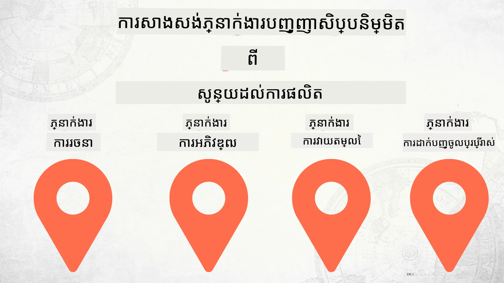

# ការបង្កើតភ្នាក់ងារតន្ត្រីករពីសូន្យដល់ផលិតកម្ម



### 🌐 ការគាំទ្រភាសាច្រើន

#### គាំទ្រដោយ GitHub Action (ដោយស្វ័យប្រវត្តិ & មានការធ្វើបច្ចុប្បន្នភាពជានិរន្ត)

<!-- CO-OP TRANSLATOR LANGUAGES TABLE START -->
[Arabic](../ar/README.md) | [Bengali](../bn/README.md) | [Bulgarian](../bg/README.md) | [Burmese (Myanmar)](../my/README.md) | [Chinese (Simplified)](../zh-CN/README.md) | [Chinese (Traditional, Hong Kong)](../zh-HK/README.md) | [Chinese (Traditional, Macau)](../zh-MO/README.md) | [Chinese (Traditional, Taiwan)](../zh-TW/README.md) | [Croatian](../hr/README.md) | [Czech](../cs/README.md) | [Danish](../da/README.md) | [Dutch](../nl/README.md) | [Estonian](../et/README.md) | [Finnish](../fi/README.md) | [French](../fr/README.md) | [German](../de/README.md) | [Greek](../el/README.md) | [Hebrew](../he/README.md) | [Hindi](../hi/README.md) | [Hungarian](../hu/README.md) | [Indonesian](../id/README.md) | [Italian](../it/README.md) | [Japanese](../ja/README.md) | [Kannada](../kn/README.md) | [Khmer](./README.md) | [Korean](../ko/README.md) | [Lithuanian](../lt/README.md) | [Malay](../ms/README.md) | [Malayalam](../ml/README.md) | [Marathi](../mr/README.md) | [Nepali](../ne/README.md) | [Nigerian Pidgin](../pcm/README.md) | [Norwegian](../no/README.md) | [Persian (Farsi)](../fa/README.md) | [Polish](../pl/README.md) | [Portuguese (Brazil)](../pt-BR/README.md) | [Portuguese (Portugal)](../pt-PT/README.md) | [Punjabi (Gurmukhi)](../pa/README.md) | [Romanian](../ro/README.md) | [Russian](../ru/README.md) | [Serbian (Cyrillic)](../sr/README.md) | [Slovak](../sk/README.md) | [Slovenian](../sl/README.md) | [Spanish](../es/README.md) | [Swahili](../sw/README.md) | [Swedish](../sv/README.md) | [Tagalog (Filipino)](../tl/README.md) | [Tamil](../ta/README.md) | [Telugu](../te/README.md) | [Thai](../th/README.md) | [Turkish](../tr/README.md) | [Ukrainian](../uk/README.md) | [Urdu](../ur/README.md) | [Vietnamese](../vi/README.md)

> **ចូលចិត្តចម្លងក្នុងកុំព្យូទ័រផ្ទាល់ខ្លួន?**
>
> ឃ្លាំងរបស់នេះមានការប្រែប្រាស់ជាភាសាជាង ៥០ ដែលបង្កើនទំហំទាញយកយ៉ាងខ្លាំង។ ដើម្បីចម្លងដោយគ្មានការប្រែប្រាស់ សូមប្រើ sparse checkout:
>
> **Bash / macOS / Linux:**
> ```bash
> git clone --filter=blob:none --sparse https://github.com/microsoft/Building-AI-Agents-From-Zero-To-Production.git
> cd Building-AI-Agents-From-Zero-To-Production
> git sparse-checkout set --no-cone '/*' '!translations' '!translated_images'
> ```
>
> **CMD (Windows):**
> ```cmd
> git clone --filter=blob:none --sparse https://github.com/microsoft/Building-AI-Agents-From-Zero-To-Production.git
> cd Building-AI-Agents-From-Zero-To-Production
> git sparse-checkout set --no-cone "/*" "!translations" "!translated_images"
> ```
>
> នេះផ្តល់ឲ្យអ្នកមានអ្វីៗទាំងអស់ដែលអ្នកត្រូវការដើម្បីបញ្ចប់វគ្គសិក្សាជាមួយនឹងការទាញយកលឿនជាងមុន។
<!-- CO-OP TRANSLATOR LANGUAGES TABLE END -->

## វគ្គសិក្សាដែលបង្រៀនអ្នកពីមូលដ្ឋាននៃជីវចក្រអភិវឌ្ឍន៍ភ្នាក់ងារតន្ត្រីករ

[](https://github.com/microsoft/Building-AI-Agents-From-Zero-To-Production/blob/master/LICENSE?WT.mc_id=academic-105485-koreyst)
[](https://GitHub.com/microsoft/Building-AI-Agents-From-Zero-To-Production/graphs/contributors/?WT.mc_id=academic-105485-koreyst)
[](https://GitHub.com/microsoft/Building-AI-Agents-From-Zero-To-Production/issues/?WT.mc_id=academic-105485-koreyst)
[](https://GitHub.com/microsoft/Building-AI-Agents-From-Zero-To-Production/pulls/?WT.mc_id=academic-105485-koreyst)
[](http://makeapullrequest.com?WT.mc_id=academic-105485-koreyst)

[](https://discord.gg/Kuaw3ktsu6)

## 🌱 ការចាប់ផ្តើម

វគ្គសិក្សានេះមានមេរៀនគ្របដណ្តប់លើមូលដ្ឋាននៃការបង្កើត និងដាក់ឲ្យដំណើរការ ភ្នាក់ងារតន្ត្រីករ។

មេរៀនមួយៗបង្កើតលើមេរៀនមុន ដូច្នេះយើងសូមណែនាំឲ្យចាប់ផ្តើមពីដើម និងដំណើរការតាមដំណាក់កាលរហូតដល់ចុង។

ប្រសិនបើអ្នកចង់ស្វែងយល់បន្ថែមអំពីប្រធានបទភ្នាក់ងារតន្ត្រីករ អ្នកអាចពិនិត្យមើល [វគ្គសិក្សាអ្នកចាប់ផ្តើមសម្រាប់ភ្នាក់ងារតន្ត្រីករ](https://aka.ms/ai-agents-beginners)។

### ជួបជាមួយអ្នករៀនផ្សេងទៀត សួរឆ្លើយសំណួររបស់អ្នក

ប្រសិនបើអ្នកជាប់ឬមានសំណួរអំពីការបង្កើតភ្នាក់ងារតន្ត្រីករ សូមចូលរួមចំណែកនៅក្នុងឆានែល Discord ពិសេសរបស់យើងនៅ [Microsoft Foundry Discord](https://discord.gg/Kuaw3ktsu6)។

### អ្វីដែលអ្នកត្រូវការប្រើប្រាស់

មេរៀននីមួយៗមានកូដឧទាហរណ៍ផ្ទាល់ខ្លួនដែលអ្នកអាចរត់នៅក្នុងកុំព្យូទ័រផ្ទាល់ខ្លួន។ អ្នកអាច [fork ឃ្លាំងនេះ](https://github.com/microsoft/Building-AI-Agents-From-Zero-To-Production/fork) ដើម្បីបង្កើតច្បាប់ផ្ទាល់ខ្លួន។

វគ្គសិក្សានេះប្រើប្រាស់អ្វីខ្លះ:

- [Microsoft Agent Framework (MAF)](https://aka.ms/ai-agents-beginners/agent-framework)
- [Microsoft Foundry](https://azure.microsoft.com/products/ai-foundry) — គម្រោងដែលមានម៉ូដែល **ជួរដំណើរការ GPT-5** (ឧទាហរណ៍ `gpt-5.1`) រត់ហើយ។ សូមកុំប្រើម៉ូដែល GPT-4o / GPT-4.1 ដែលបានផ្អាក។
- [Azure OpenAI Service](https://azure.microsoft.com/products/ai-foundry/models/openai)
- [Azure CLI](https://learn.microsoft.com/cli/azure/authenticate-azure-cli?view=azure-cli-latest) — ចូលប្រើជាមួយ `az login` មុននឹងរត់គំរូណាមួយ
- **Python 3.12 ឬកំណែថ្មីជាងនេះ**

សូមប្រាកដថាអ្នកមានការចូលប្រើសេវាកម្មទាំងនេះមុនចាប់ផ្តើម។

> **💰 ការចំណាយ និងការលុបចោល។** មេរៀនអនុវត្តបង្កើតធនធាន Azure ពិតប្រាកដ — គម្រោង Microsoft Foundry
> ការដាក់ម៉ូដែល, ហាងទិន្នន័យវ៉ិចទ័រ, និង (នៅក្នុងមេរៀនទី៤-៦) ភ្នាក់ងារហូសទីភ្នាក់ងារ និងប្រអប់ឧបករណ៍។
> ធនធានទាំងនេះអាចបង្កការចំណាយសមាហរណៈនៅពេលមានវា។ ពេលអ្នកបញ្ចប់មេរៀន — ឬវគ្គសិក្សា — សូមលុប
> ធនធានដែលអ្នកមិនចាំបាច់ប្រើបន្ថែមទៀត។ វិធីសាស្រ្តសាមញ្ញជាងគេគឺដាក់អ្វីៗគ្រប់យ៉ាងនៅក្នុងក្រុមធនធានពិសេសមួយ
> ហើយលុបក្រុមទាំងមូលពេលដែលអ្នកបញ្ចប់:
>
> ```bash
> az group delete --name <your-resource-group> --yes --no-wait
> ```
>
> អ្នកក៏អាចលុបភ្នាក់ងារផ្ទាល់ខ្លួន, ហាងទិន្នន័យវ៉ិចទ័រ, និងប្រអប់ឧបករណ៍ពីទ្វារចូល Foundry ផងដែរ។

> **មតិយោបល់អំពីម៉ូដែល។** វគ្គសិក្សានេះផ្តល់ម៉ូដែលទាំងអស់តាមរយៈ **Microsoft Foundry** ។ វាមិនប្រើ
> *GitHub Models* ទេ ដែលនឹងផ្អាកនៅថ្ងៃទី **៣០ ខែកក្កដា ឆ្នាំ ២០២៦** — Microsoft Foundry គឺ
> ផ្លូវការសម្រាប់ផ្លាស់ទី។ ប្រសិនបើអ្នកមានកូដចាស់ដែលហៅប្រើ GitHub Models សូមបញ្ជូនទៅកាន់
> ការដាក់ម៉ូដែល Foundry ជំនួស។

ជម្រើសផ្សេងទៀតអំពីការផ្តល់ម៉ូដែល និងសេវាកម្មនឹងមកនាពេលខាងមុខ។

## 🗃️ មេរៀន

| **មេរៀន**         | **ការពិពណ៌នា**                                                                                  |
|--------------------|--------------------------------------------------------------------------------------------------|
| [រចនាភ្នាក់ងារ](./lesson-1-agent-design/README.md)       | ការណែនាំអំពីករណីប្រើប្រាស់ភ្នាក់ងារ "ការចូលរួមអភិវឌ្ឍករ" និងរបៀបរចនាភ្នាក់ងារដែលមានប្រសិទ្ធភាព  |
| [អភិវឌ្ឍភ្នាក់ងារ](./lesson-2-agent-development/README.md)  | ប្រើ Microsoft Agent Framework (MAF) ដើម្បីបង្កើតក្រុមភ្នាក់ងារប្រក специализирован មួយសម្រាប់ជួយអភិវឌ្ឍករថ្មីៗចូលរួម។       |
| [ការវាយតម្លៃភ្នាក់ងារ](./lesson-3-agent-evals/README.md)  | ប្រើ Microsoft Foundry ដើម្បីរកឃើញរបៀបដែលភ្នាក់ងារតន្ត្រីករយើងដំណើរការល្អ និងរបៀបធ្វើឲ្យប្រសើរឡើង។ |
| [ការដាក់ភ្នាក់ងារតន្ត្រីករ](./lesson-4-agentdeployment/README.md)   | ប្រើ Microsoft Foundry ភ្នាក់ងារហូសទីភ្នាក់ងារ និង OpenAI ChatKit ដើម្បីមើលរបៀបដាក់ភ្នាក់ងារតន្ត្រីករចូលផលិតកម្ម។       |
| [ភ្នាក់ងារនៅផលិតកម្ម](./lesson-5-hosted-agents-production/README.md)   | យកភ្នាក់ងារ Hosted agent ទៅផលិតកម្មសម្រាប់សហគ្រាស: Hosted Agents ជាមួយ Capability Hosts, ប្រើដាក់ទុកផ្ទាល់ខ្លួន, ការចងចាំ និងការគ្រប់គ្រង។       |
| [ប្រអប់ឧបករណ៍ Microsoft](./lesson-6-toolbox/README.md)   | កំណត់ឧបករណ៍មួយដង និងគ្រប់គ្រងពួកវាតាមកណ្តាល: បង្កើតប្រអប់ឧបករណ៍, ប្រើវាពីភ្នាក់ងារតាមផ្លូវចូល MCP តែមួយ និងបង្កប់ការផ្លាស់ប្តូរឧបករណ៍យ៉ាងសុវត្ថិភាព។       |
| [ភ្នាក់ងារច្រើន & A2A](./lesson-7-multi-agent-a2a/README.md)   | បង្កើតភ្នាក់ងារជាសេវាកម្មបណ្តាញ: បង្ហាញភ្នាក់ងារមួយតាមរយៈពិធីករណ៍ Agent-to-Agent (A2A) បើក និងប្រើភ្នាក់ងារពីចម្ងាយជាដៃគូ។       |


## 🎒 វគ្គសិក្សាផ្សេងទៀត

ក្រុមការងារយើងបង្កើតវគ្គសិក្សាផ្សេងទៀត! សូមពិនិត្យមើល:

<!-- CO-OP TRANSLATOR OTHER COURSES START -->
### LangChain
[](https://aka.ms/langchain4j-for-beginners)
[](https://aka.ms/langchainjs-for-beginners?WT.mc_id=m365-94501-dwahlin)
[](https://github.com/microsoft/langchain-for-beginners?WT.mc_id=m365-94501-dwahlin)
---

### Azure / Edge / MCP / Agents
[](https://github.com/microsoft/AZD-for-beginners?WT.mc_id=academic-105485-koreyst)
[](https://github.com/microsoft/edgeai-for-beginners?WT.mc_id=academic-105485-koreyst)
[](https://github.com/microsoft/mcp-for-beginners?WT.mc_id=academic-105485-koreyst)
[](https://github.com/microsoft/ai-agents-for-beginners?WT.mc_id=academic-105485-koreyst)

---
 
### ស៊េរី AI បង្កើតច្នៃ

[](https://github.com/microsoft/generative-ai-for-beginners?WT.mc_id=academic-105485-koreyst)
[-9333EA?style=for-the-badge&labelColor=E5E7EB&color=9333EA)](https://github.com/microsoft/Generative-AI-for-beginners-dotnet?WT.mc_id=academic-105485-koreyst)
[-C084FC?style=for-the-badge&labelColor=E5E7EB&color=C084FC)](https://github.com/microsoft/generative-ai-for-beginners-java?WT.mc_id=academic-105485-koreyst)
[-E879F9?style=for-the-badge&labelColor=E5E7EB&color=E879F9)](https://github.com/microsoft/generative-ai-with-javascript?WT.mc_id=academic-105485-koreyst)

---
 
### ការសិក្សាផ្នែកមូលដ្ឋាន
[](https://aka.ms/ml-beginners?WT.mc_id=academic-105485-koreyst)
[](https://aka.ms/datascience-beginners?WT.mc_id=academic-105485-koreyst)
[](https://aka.ms/ai-beginners?WT.mc_id=academic-105485-koreyst)
[](https://github.com/microsoft/Security-101?WT.mc_id=academic-96948-sayoung)
[](https://aka.ms/webdev-beginners?WT.mc_id=academic-105485-koreyst)
[](https://aka.ms/iot-beginners?WT.mc_id=academic-105485-koreyst)
[](https://github.com/microsoft/xr-development-for-beginners?WT.mc_id=academic-105485-koreyst)

---
 
### ស៊េរី Copilot
[](https://aka.ms/GitHubCopilotAI?WT.mc_id=academic-105485-koreyst)
[](https://github.com/microsoft/mastering-github-copilot-for-dotnet-csharp-developers?WT.mc_id=academic-105485-koreyst)
[](https://github.com/microsoft/CopilotAdventures?WT.mc_id=academic-105485-koreyst)
<!-- CO-OP TRANSLATOR OTHER COURSES END -->

## ការរួមចំណែក

គម្រោងនេះត្រូវបានស្វាគមន៍ការរួមចំណែក និងយោបល់។ ការរួមចំណែកភាគច្រើនតម្រូវឱ្យអ្នកយល់ព្រមនឹង
កិច្ចព្រមព្រៀងអាជ្ញាប័ណ្ណអ្នករួមចំណែក (CLA) ដែលបញ្ជាក់ថាអ្នកមានសិទ្ធិ និងពិតជាបានផ្តល់សិទ្ធិដល់យើង
ក្នុងការប្រើប្រាស់ការរួមចំណែករបស់អ្នក។ សម្រាប់ព័ត៌មានលម្អិត អ្នកអាចចូលទៅ <https://cla.opensource.microsoft.com>។

នៅពេលអ្នកដាក់ស្នើសំណើបញ្ចូលទិន្នន័យ (pull request) ប្រព័ន្ធ CLA bot នឹងកំណត់ដោយស្វ័យប្រវត្តិនៅតើអ្នកត្រូវតែផ្តល់
CLA ដែរឬទេ ហើយតែងតាំងស្ទីកเกอร์សម្រាប់ PR (ឧ. ការត្រួតពិនិត្យស្ថានភាព, យោបល់)។ តែត្រូវគោរពតាមការណែនាំ
ដែលប្រព័ន្ធ bot ផ្តល់។ អ្នកត្រូវធ្វើបែបនេះតែម្តងនៅក្នុងគ្រប់ repo ដែលប្រើ CLA របស់យើង។

គម្រោងនេះបានអនុម័ត [Microsoft Open Source Code of Conduct](https://opensource.microsoft.com/codeofconduct/)។
សម្រាប់ព័ត៌មានបន្ថែមមើល [Code of Conduct FAQ](https://opensource.microsoft.com/codeofconduct/faq/) ឬ
សូមទាក់ទង [opencode@microsoft.com](mailto:opencode@microsoft.com) ប្រសិនបើមានសំណួរឬយោបល់បន្ថែមណាមួយ។

## សញ្ញាសម្គាល់ពាណិជ្ជកម្ម

គម្រោងនេះអាចមានសញ្ញាសម្គាល់ពាណិជ្ជកម្ម ឬរូបសញ្ញាសម្រាប់គម្រោង ផលិតផល ឬសេវាកម្ម។ ការប្រើប្រាស់ដោយមានអាជ្ញាប័ណ្ណលើ
សញ្ញាសម្គាល់ពាណិជ្ជកម្ម របស់ Microsoft ឬរូបសញ្ញា ត្រូវតែគោរពនិងតាមដាន
[Microsoft's Trademark & Brand Guidelines](https://www.microsoft.com/legal/intellectualproperty/trademarks/usage/general)។
ការប្រើប្រាស់សញ្ញាសម្គាល់ពាណិជ្ជកម្ម ឬរូបសញ្ញារបស់ Microsoft នៅក្នុងកំណែដែលបានកែប្រែរបស់គម្រោងនេះ មិនត្រូវបង្កើតភាពច្របូកច្របល់ ឬជាក់ស្តែងថា Microsoft គាំទ្រ។
ការប្រើប្រាស់សញ្ញាសម្គាល់ពាណិជ្ជកម្ម ឬរូបសញ្ញារបស់ខាងក្រៅ គឺត្រូវគោរពតាមគោលនយោបាយរបស់ភាគីទាំងនោះ។

## ទទួលបានជំនួយ

ប្រសិនបើអ្នកជួបបញ្ហា ឬមានសំណួរអំពីការបង្កើតកម្មវិធី AI សូមចូលរួម:

[](https://discord.gg/Kuaw3ktsu6)

ប្រសិនបើអ្នកមានមតិយោបល់ផលិតផល ឬកំហុសនៅពេលកំពុងសាងសង់ សូមចូលមើលៈ

[](https://aka.ms/foundry/forum)

---

<!-- CO-OP TRANSLATOR DISCLAIMER START -->
**ការបដិសេធ**:
ឯកសារនេះត្រូវបានបម្លែងភាសា ដោយប្រើសេវាបម្លែងភាសា AI [Co-op Translator](https://github.com/Azure/co-op-translator)។ ទោះយើងខ្ញុំមានក្តីប្រាថ្នាឱ្យបានច្បាស់លាស់ តែសូមយល់ដឹងថាការបម្លែងដោយស្វ័យប្រវត្តិក៏អាចមានកំហុសឬភាពមិនត្រឹមត្រូវ។ ឯកសារដើមជាភាសាទីតាំងគួរត្រូវបានគេប្រើជាប្រភពច្បាស់លាស់។ សម្រាប់ព័ត៌មានសំខាន់ៗ សូមណែនាំឱ្យប្រើប្រាស់ការប្រែដោយមនុស្សជំនាញ។ យើងខ្ញុំមិនទទួលខុសត្រូវចំពោះការយល់ច្រឡំ ឬការបកស្រាយខុសបន្ទាប់ពីការប្រើប្រាស់ការបម្លែងនេះនោះទេ។
<!-- CO-OP TRANSLATOR DISCLAIMER END -->