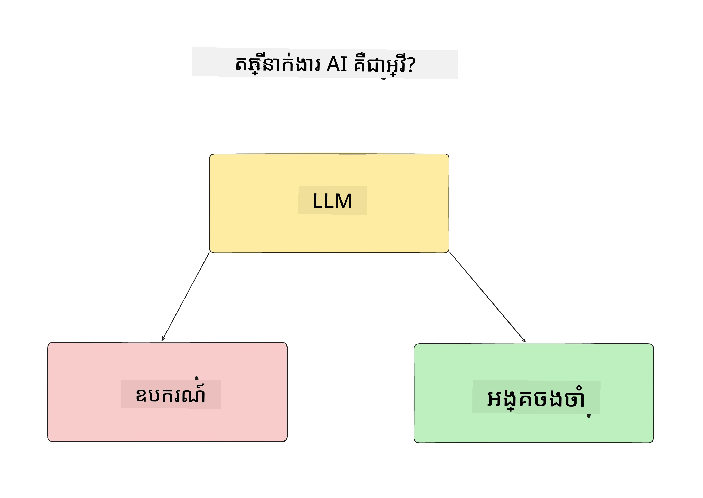
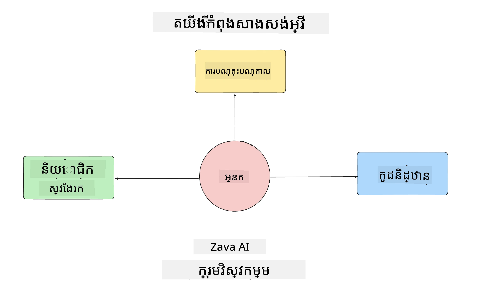
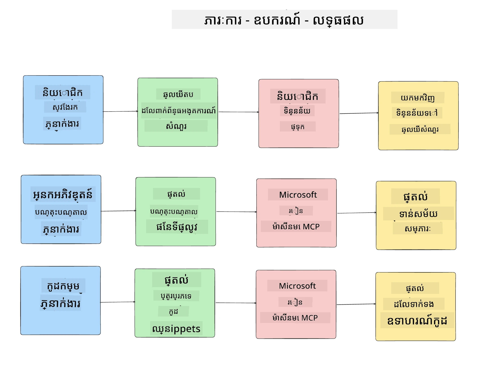
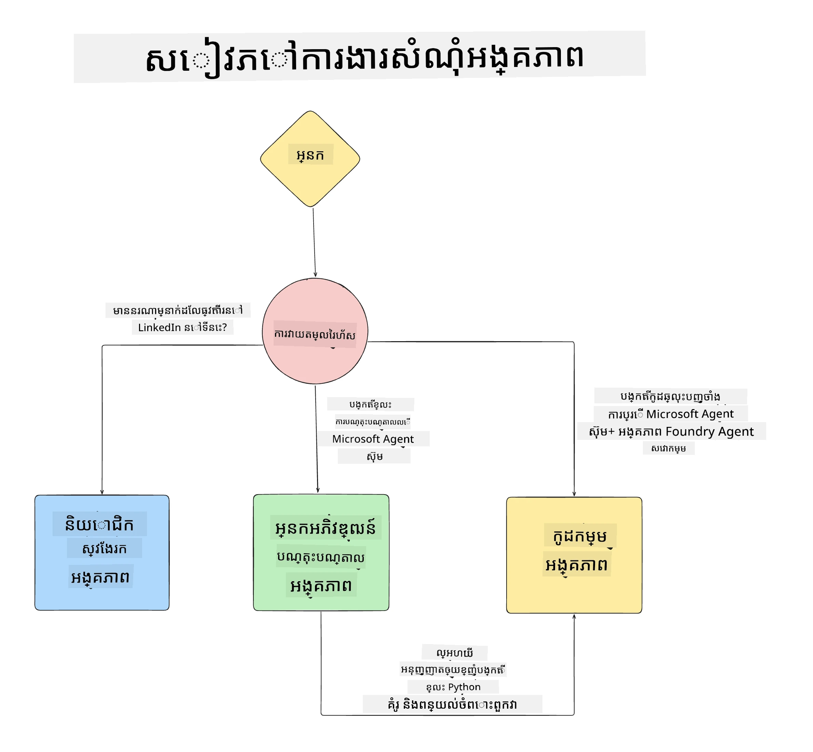

# ចំណងជើង 1៖ ការរចនាកម្មវិធីភ្នាក់ងារ AI

សូមស្វាគមន៍មកកាន់មេរៀនទីមួយនៃ "វគ្គសិក្សាការសាងសង់កម្មវិធីភ្នាក់ងារ AI ពីគ្មានដល់ផលិតកម្ម"!

នៅក្នុងមេរៀននេះ យើងនឹងគ្របដណ្តប់៖

- កំណត់ន័យពីអ្វីទៅជាកម្មវិធីភ្នាក់ងារ AI
  
- ពិភាក្សាអំពីកម្មវិធីភ្នាក់ងារ AI ដែលយើងកំពុងសាងសង់

- កំណត់ឧបករណ៍ និងសេវាកម្មត្រូវការសម្រាប់ភ្នាក់ងារ រៀងៗខ្លួន

- រចនាសម្ព័ន្ធកម្មវិធីភ្នាក់ងារ របស់យើង
  
ចាប់ផ្តើមដោយកំណត់ន័យថា ភ្នាក់ងារជាអ្វី និងហេតុអ្វីយើងត្រូវប្រើពួកវា នៅក្នុងកម្មវិធីមួយ។

## ភ្នាក់ងារ AI គឺជាអ្វី?

បើនេះជាប្រសិនបើអញ្ញើបដំបូងរបស់អ្នកក្នុងការស្វែងយល់ពីរបៀបសាងសង់កម្មវិធីភ្នាក់ងារ AI អ្នកអាចមានសំណួរអំពីរបៀបកំណត់ន័យពិតប្រាកដថា ភ្នាក់ងារ AI គឺជាអ្វី។

សម្រាប់វិធីសាមញ្ញក្នុងការកំណត់ន័យថា ភ្នាក់ងារ AI គឺជាអ្វីដោយផ្អែកលើផ្នែកផ្សំដែលបង្កើតវា៖

**គំរូភាសាធំ (Large Language Model)** - LLM នឹងផ្តល់ថាមពលទាំងភាពអាចដំណើរការភាសាធម្មជាតិនៃអ្នកប្រើ ដើម្បីបកស្រាយភារកិច្ចដែលពួកគេចង់បញ្ចប់មួយ និងបកស្រាយការពិពណ៌នាអំពីឧបករណ៍ដែលមានសម្រាប់បញ្ចប់ភារកិច្ច។

**ឧបករណ៍** - ទាំងនេះនឹងជាអនុគ្រាធ, APIs, ប្រព័ន្ធផ្ទុកទិន្នន័យ និងសេវាកម្មផ្សេងៗដែល LLM អាចជ្រើសរើសប្រើ ដើម្បីបញ្ចប់ភារកិច្ចដែលអ្នកប្រើបានស្នើ។

**ចងចាំ** - វាជាវិធីដែលយើងរក្សាទុកទាំងការប្រើប្រាស់រយៈពេលខ្លី និងរយៈពេលវែង រវាងភ្នាក់ងារ AI និងអ្នកប្រើ។ ការផ្ទុក និងទាញយកព័ត៌មាននេះមានសារៈសំខាន់ក្នុងការធ្វើការកែលម្អ និងការរក្សាទុកចំណូលចិត្តអ្នកប្រើឲ្យបានប្រសើរឡើងជារៀងរាល់ពេល។

## ករណីប្រើប្រាស់កម្មវិធីភ្នាក់ងារ AI របស់យើង

សម្រាប់វគ្គសិក្សានេះ យើងនឹងសាងសង់កម្មវិធីភ្នាក់ងារ AI ដែលជួយឱ្យអ្នកអភិវឌ្ឍន៍ថ្មីអាចចូលរួមជាមួយក្រុមអភិវឌ្ឍន៍ភ្នាក់ងារ AI របស់យើង!

មុនពេលយើងធ្វើការអភិវឌ្ឍន៍ណាមួយ ជំហានដំបូងក្នុងការបង្កើតកម្មវិធីភ្នាក់ងារ AI ដ៏ជោគជ័យ គឺការកំណត់សិនារីយ៉ូម៉ាដែលច្បាស់លាស់ពីរបៀបដែលយើងរំពឹងថាអ្នកប្រើប្រាស់នឹងធ្វើការជាមួយភ្នាក់ងារ AI របស់យើង។

សម្រាប់កម្មវិធីនេះ យើងនឹងធ្វើការជាមួយសិនារីយ៉ូទាំងនេះ៖

**សិនារីយ៉ូ ១**៖ បុគ្គលិកថ្មីចូលរួមនៅក្នុងអង្គភាពរបស់យើង ហើយចង់ដឹងព័ត៌មានបន្ថែមអំពីក្រុមដែលពួកគេបានចូលរួម និងរបៀបក្នុងការតភ្ជាប់ជាមួយក្រុម។

**សិនារីយ៉ូ ២**៖ បុគ្គលិកថ្មីចង់ដឹងពីភារកិច្ចដំបូងល្អបំផុត ដែលពួកគេអាចចាប់ផ្តើមធ្វើការបាន។

**សិនារីយ៉ូ ៣**៖ បុគ្គលិកថ្មីចង់ប្រមូលធនធានរៀនសូត្រ និងគំរូកូដ ដើម្បីជួយពួកគេចាប់ផ្តើមបញ្ចប់ភារកិច្ចនេះ។

## ការកំណត់ឧបករណ៍ និងសេវាកម្ម

ឥឡូវនេះដែលយើងមានសិនារីយ៉ូទាំងនេះហើយ ជំហានបន្ទាប់គឺផ្គូរផ្គងវាទៅរកឧបករណ៍ និងសេវាកម្ម ដែលភ្នាក់ងារ AI របស់យើងត្រូវការ ដើម្បីបញ្ចប់ភារកិច្ចទាំងអស់។

ដំណើរការនេះស្ថិតក្រោមប្រភេទវិស្វកម្មបរិបទ (Context Engineering) ពីព្រោះយើងនឹងផ្តោតធ្វើឱ្យប្រាកដថា ភ្នាក់ងារ AI របស់យើងមានបរិបទត្រឹមត្រូវនៅពេលត្រឹមត្រូវ ដើម្បីបញ្ចប់ភារកិច្ច។

ចូរធ្វើវាសិនារីយ៉ូតាមសិនារីយ៉ូនិងអនុវត្តន៍ការរចនាភ្នាក់ងារល្អ ដោយរាយបញ្ជីភារកិច្ចឧបករណ៍ និងលទ្ធផលដែលចង់បានសម្រាប់ភ្នាក់ងារ  រៀងៗខ្លួន។

### សិនារីយ៉ូ ១ - ភ្នាក់ងារស្វែងរកបុគ្គលិក

**ភារកិច្ច** - ឆ្លើយសំណួរអំពីបុគ្គលិកនៅក្នុងអង្គភាព ដូចជា ថ្ងៃចូលរួម ក្រុមបច្ចុប្បន្ន បរិយាកាស និងមុខតំណែងចុងក្រោយ។

**ឧបករណ៍** - ប្រព័ន្ធផ្ទុកបញ្ជីបុគ្គលិកបច្ចុប្បន្ន និងតារាងសម្រុកអង្គភាព។

**លទ្ធផល** - អាចទាញយកព័ត៌មានពីប្រព័ន្ធផ្ទុកដើម្បីឆ្លើយសំណួរទូទៅអំពីអង្គភាព និងសំណួរពិសេសអំពីបុគ្គលិក។

### សិនារីយ៉ូ ២ - ភ្នាក់ងារផ្តល់អនុសាសន៍ភារកិច្ច

**ភារកិច្ច** - ដោយផ្អែកលើបទពិសោធន៍អ្នកអភិវឌ្ឍន៍ថ្មី សូមផ្តល់ 1-3 ចំណុចដែលបុគ្គលិកថ្មីអាចធ្វើការ។

**ឧបករណ៍** - រត់ម៉ាស៊ីន MCP GitHub ដើម្បីទាញយកចំណុចបើក និងបង្កើតប្រវត្តិរូបអ្នកអភិវឌ្ឍន៍

**លទ្ធផល** - អាចអានចំណុចបន្សល់ 5 ចុងក្រោយនៃប្រវត្តិរូប GitHub និងចំណុចបើកលើគម្រោង GitHub ហើយផ្តល់អនុសាសន៍ដោយផ្អែកលើការប្រកួតប្រជែង

### សិនារីយ៉ូ ៣ - ភ្នាក់ងារជំនួយកូដ

**ភារកិច្ច** - ដោយផ្អែកលើចំណុចបើកដែលបានផ្តល់ដោយ "ភ្នាក់ងារផ្តល់អនុសាសន៍ភារកិច្ច" ស្រាវជ្រាវ និងផ្តល់ធនធាន និងបង្កើតឈុតកូដដើម្បីជួយបុគ្គលិក។

**ឧបករណ៍** - Microsoft Learn MCP ដើម្បីស្វែងរកធនធាន និង Code Interpreter សម្រាប់បង្កើតឈុតកូដផ្ទាល់ខ្លួន។

**លទ្ធផល** - ប្រសិនបើអ្នកប្រើស្នើសុំជំនួយបន្ថែម វិធីសាស្ត្រនេះគួរប្រើម៉ាស៊ីន Learn MCP ដើម្បីផ្តល់តំណភ្ជាប់ និងឈុតកូដទៅធនធាន ហើយបន្ទាប់មកផ្ទេរទៅភ្នាក់ងារ Code Interpreter ដើម្បីបង្កើតឈុតកូដតូចៗជាមួយនឹងការពន្យល់។

## រចនាសម្ព័ន្ធកម្មវិធីភ្នាក់ងារ របស់យើង

ឥឡូវនេះដែលយើងបានកំណត់ន័យពីភ្នាក់ងាររាល់យុទ្ធសាស្រ្តរួចហើយ ចូរបង្កើតគំនូសការរចនាសម្ព័ន្ធដែលជួយយើងយល់ថា ភ្នាក់ងារ រាល់គ្នានឹងដំណើរការជាមួយគ្នាប្រក្រតី និងបែកបាក់ដោយផ្អែកលើភារកិច្ច៖

## ជំហានបន្ទាប់

ឥឡូវនេះដែលយើងបានរចនាភ្នាក់ងារ និងប្រព័ន្ធភ្នាក់ងាររបស់យើងរួចហើយ ចូរចាប់ផ្តើមទៅមេរៀនបន្ទាប់ ដែលយើងនឹងអភិវឌ្ឍភ្នាក់ងារ ទាំងនេះ!

---

<!-- CO-OP TRANSLATOR DISCLAIMER START -->
**ការធ្វើច្បាប់**៖  
ឯកសារនេះត្រូវបានបកប្រែដោយប្រើសេវាកម្មបកប្រែ AI [Co-op Translator](https://github.com/Azure/co-op-translator)។ ខណៈពេលដែលយើងព្យាយាមឲ្យមានភាពត្រឹមត្រូវ សូមយកចិត្តទុកដាក់ថាបកប្រែដោយស្វ័យ​ប្រវត្តិនោះអាចមានកំហុស ឬភាពមិនត្រឹមត្រូវ។ ឯកសារដើមក្នុងភាសាមាតុភូមិនោះគួរត្រូវបានគេសង្ស័យថាជាប្រភពសុំនៃព្រឹត្តិការណ៍។ សម្រាប់ព័ត៌មានសំខាន់ៗ និយោជកបកប្រែដោយមនុស្សវិជ្ជាជីវៈត្រូវបានណែនាំ។ យើងមិនទទួលខុសត្រូវចំពោះការយល់ច្រឡំ ឬការបកប្រែកំហុសណាមួយដែលកើតមានពីការប្រើប្រាស់ការបកប្រែនេះឡើយ។
<!-- CO-OP TRANSLATOR DISCLAIMER END -->