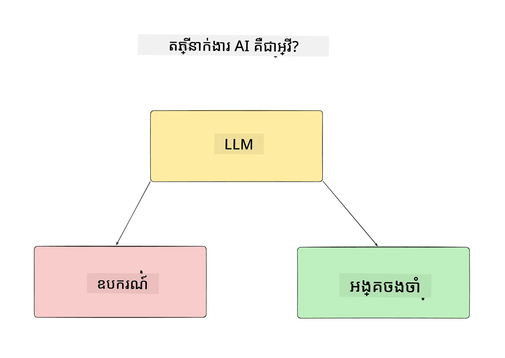
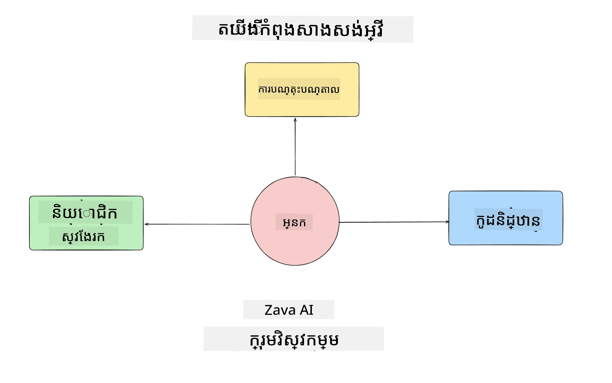
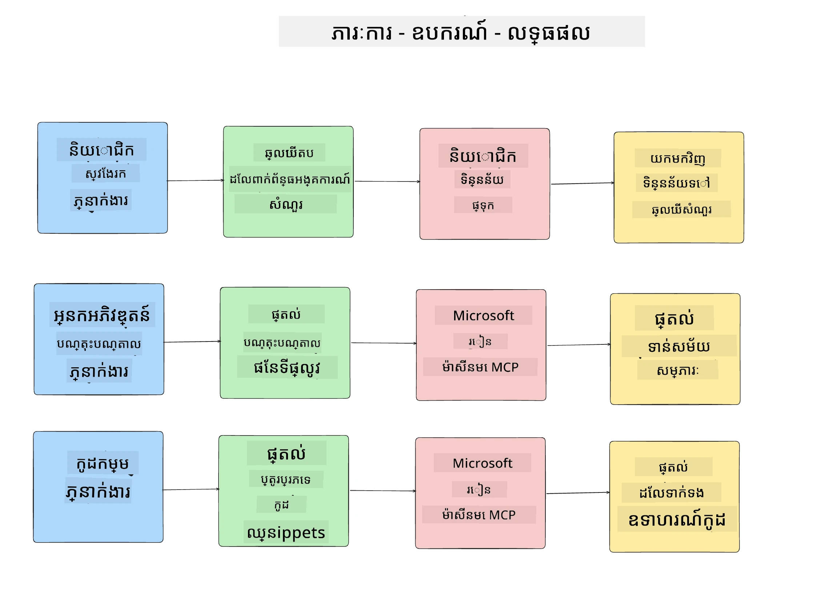
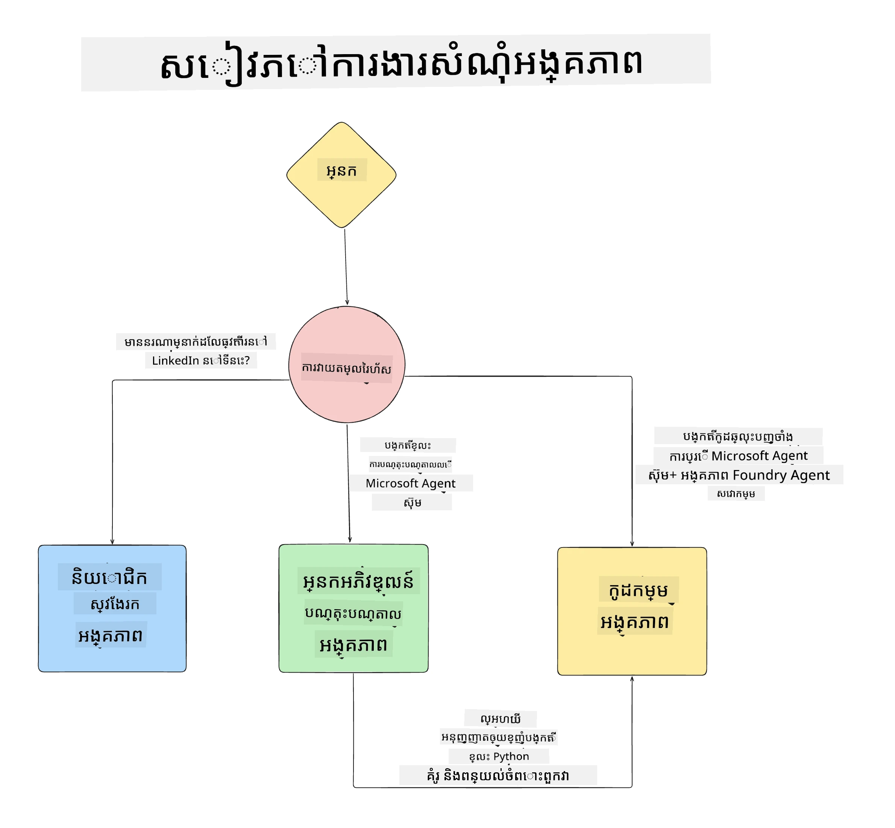

# មេរៀន ១៖ ការរចនាភ្នាក់ងារ AI

សូមស្វាគមន៍មកកាន់មេរៀនទីមួយនៃ "វគ្គសិក្សា ស្ថាបនាភ្នាក់ងារ AI ពីសូន្យទៅការផលិត"!

នៅក្នុងមេរៀននេះ យើងនឹងបណ្តុះបណ្តាល៖

- ការបកស្រាយថាភ្នាក់ងារ AI ជាអ្វី
  
- ពិភាក្សាអំពីកម្មវិធីភ្នាក់ងារ AI ដែលយើងកំពុងស្ថាបនា  

- កំណត់ឧបករណ៍ និងសេវាកម្មដែលត្រូវការសម្រាប់ភ្នាក់ងារនីមួយៗ
  
- រចនាស្ថាបត្យកម្មកម្មវិធីភ្នាក់ងារ
  
ចាប់ផ្តើមដោយកំណត់ថាភ្នាក់ងារជាអ្វី និងហេតុអ្វីយើងប្រើពួកវាក្នុងកម្មវិធីមួយ។

> **មុនចាប់ផ្តើមវគ្គសិក្សា។** មេរៀនទីមួយនេះគឺជាមេរៀនគំនិត — មិនមានកូដដើម្បីរត់ទេ។
> ចាប់ពី [មេរៀន ២](../lesson-2-agent-development/README.md) ទៅមុខ អ្នកនឹងត្រូវការមាន៖ **ជាវជាន់ Azure** ដែលមានចូលដំណើរការទៅកាន់ **Microsoft Foundry**, ម៉ូដែល **ស៊េរី GPT-5** ដែលបានដាក់ឲ្យប្រើ (ឧទាហរណ៍ `gpt-5.1` — គេចចាក់រហែក GPT-4o / GPT-4.1), **Python 3.12+**, ហើយ **Azure CLI** (`az login`)។ សូមមើល [តើអ្នកត្រូវការអ្វីខ្លះ](../README.md#what-you-need) ក្នុង README វគ្គសិក្សាដើម្បី និងបញ្ជីពេញលេញ។

## ភ្នាក់ងារ AI ជាអ្វី?

បើនេះជាលើកដំបូងអ្នកស្វែងយល់ពីរបៀបបង្កើតភ្នាក់ងារ AI អ្នកអាចមានសំណួរពីរបៀបកំណត់ថាភ្នាក់ងារ AI គឺជាអ្វីយ៉ាងត្រឹមត្រូវ។

វិធីសាមញ្ញក្នុងការបកស្រាយថាភ្នាក់ងារ AI ជា​ដោយផ្អែកលើ​អង្គភាពដែលបង្កើតវា៖

**ម៉ូដែលភាសាធំ** - LLM នឹងផ្គត់ផ្គង់សមត្ថភាពក្នុងការបំលែងភាសាធម្មជាតិនៃអ្នកប្រើប្រាស់ ដើម្បីបកស្រាយការងារដែលពួកគេចង់បញ្ចប់ និងការបកស្រាយនូវការពិពណ៌នាទៅលើឧបករណ៍ដែលអាចប្រើបានសម្រាប់បំពេញការងារទាំងនោះ។

**ឧបករណ៍** - ប្រព័ន្ធមុខងារ API, ទិន្នន័យទីតាំង និងសេវាកម្មផ្សេងទៀតដែល LLM អាចជ្រើសរើសប្រើដើម្បីបញ្ចប់ការងារដែលបានស្នើសុំដោយអ្នកប្រើ។

**ចងចាំ** - វាជាប្រព័ន្ធដែលយើងហៅថាជាផ្ទុកទាំងអស់ទំនាក់ទំនងស្តុកបណ្ដោះអាសន្ន និងរយៈពេលវែងរវាងភ្នាក់ងារ AI និងអ្នកប្រើ។ ការផ្ទុក និងយកព័ត៌មាននេះចេញយ៉ាងសំខាន់ក្នុងការកែលម្អ និងរក្សាទុកចំណូលចិត្តរបស់អ្នកប្រើប្រាស់ជាថ្មីៗ។

## ករណីប្រើប្រាស់ភ្នាក់ងារ AI របស់យើង

សម្រាប់វគ្គសិក្សានេះ យើងនឹងបង្កើតកម្មវិធីភ្នាក់ងារ AI ដែលជួយអ្នកអភិវឌ្ឍន៍ថ្មីចូលរួមក្រុមអភិវឌ្ឍន៍ភ្នាក់ងារ AI របស់យើង!

មុនយើងធ្វើការអភិវឌ្ឍណាមួយ ជំហៀងដំបូងដើម្បីបង្កើតកម្មវិធីភ្នាក់ងារ AI ដែលជោគជ័យ គឺកំណត់សកម្មភាពច្បាស់លាស់មួយចំនួនពីរបៀបដែលយើងរំពឹងថាអ្នកប្រើរបស់យើងនឹងបន្តធ្វើការជាមួយភ្នាក់ងាររបស់យើង។

សម្រាប់កម្មវិធីនេះ យើងនឹងបောင်ការងារជាមួយសកម្មភាពទាំងនេះ៖

**សកម្មភាព ១**៖ បុគ្គលិកថ្មីចូលរួមអង្គការរបស់យើង ហើយចង់ដឹងព័ត៌មានបន្ថែមអំពីក្រុមដែលពួកគាត់បានចូល និងរបៀបដែលពួកគាត់អាចភ្ជាប់ទំនាក់ទំនងជាមួយពួកគេ។

**សកម្មភាព ២**៖ បុគ្គលិកថ្មីចង់ដឹងថាការងារដំបូងល្អបំផុតសម្រាប់ពួកគាត់ក្នុងការចាប់ផ្តើមធ្វើការជាអ្វី។

**សកម្មភាព ៣**៖ បុគ្គលិកថ្មីចង់ប្រមូលសរសេរ និងគំរូកូដដើម្បីជួយពួកគាត់ចាប់ផ្តើមបំពេញការងារនេះ។

## ការកំណត់ឧបករណ៍ និងសេវាកម្ម

ឥឡូវនេះយើងមានសកម្មភាពទាំងនេះ យើងត្រូវផ្គូផ្គងវានឹងឧបករណ៍ និងសេវាកម្មដែលភ្នាក់ងារ AI របស់យើងនឹងត្រូវការដើម្បីបញ្ចប់ការងារទាំងនេះ។

ដំណើរការនេះត្រូវបានចាត់ទុកថាជាវិស័យសំណង់បរិបទ ដោយយើងនឹងផ្ដោតលើការធ្វើឲ្យប្រាកដថា ភ្នាក់ងារ AI របស់យើងមានបរិបទត្រឹមត្រូវនៅពេលវាល្ងង់ដើម្បីបញ្ចប់ការងារ។

ចូរធ្វើវាតាមសកម្មភាពនីមួយៗ ហើយអនុវត្តន៍ការរចនាភ្នាក់ងារល្អ ដោយបញ្ជីរបៀបការងារនីមួយៗឧបករណ៍ និងផលលទ្ធផលដែលចង់បាន។

### សកម្មភាព ១ - ភ្នាក់ងារស្វែងរកបុគ្គលិក

**ការងារ** - ឆ្លើយសំណួរអំពីបុគ្គលិកនៅក្នុងអង្គការ ដូចជា ថ្ងៃចូលរួមក្រុម បច្ចុប្បន្នក្រុម ទីតាំង និងមុខតំណែងចុងក្រោយ។

**ឧបករណ៍** - ទិន្នន័យបញ្ជីបុគ្គលិកបច្ចុប្បន្ន និងផែនទីអង្គការ

**ផលប្រយោជន៍** - អាចយកព័ត៌មានពីកន្លែងទិន្នន័យដើម្បីឆ្លើយសំណួរទូទៅអំពីអង្គការនិងសំនួរពិសេសអំពីបុគ្គលិក។

### សកម្មភាព ២ - ភ្នាក់ងារផ្តល់អនុសាសន៍ការងារ

**ការងារ** - ពិចារណាតាមបទពិសោធន៍អភិវឌ្ឍន៍របស់បុគ្គលិកថ្មី ជួយជ្រើសរើស ១-៣ បញ្ហាដែលបុគ្គលិកថ្មីអាចធ្វើការលើវា។

**ឧបករណ៍** - ម៉ាស៊ីនបម្រើ GitHub MCP ដើម្បីទទួលបញ្ហាកំពុងបើក និងបង្កើតប្រវត្តិរូបអភិវឌ្ឍន៍

**ផលប្រយោជន៍** - អាចអានបញ្ចូលចុងក្រោយ ៥ កំណត់ត្រានៃប្រវត្តិរូប GitHub និងបញ្ហាកំពុងបើកនៅលើគម្រោង GitHub ហើយផ្តល់អនុសាសន៍ដោយផ្អែកលើការចំរូងគ្នា

### សកម្មភាព ៣ - ភ្នាក់ងារជំនួយកូដ

**ការងារ** - ភ្ជាប់ទៅនឹងបញ្ហាបើកដែលត្រូវបានផ្តល់អនុសាសន៍ដោយភ្នាក់ងារផ្តល់អនុសាសន៍ការងារ ស្វែងយល់ និងផ្តល់ធនធាន និងបង្កើតបំណែកកូដដើម្បីជួយបុគ្គលិក។

**ឧបករណ៍** - Microsoft Learn MCP សម្រាប់ស្វែងរកធនធាន និង Code Interpreter សម្រាប់បង្កើតបំណែកកូដផ្ទាល់ខ្លួន។

**ផលប្រយោជន៍** - បើអ្នកប្រើស្នើសុំជំនួយបន្ថែម និយោគនីប្រតិបត្តិការនេះគួរតែនាំឲ្យLearn MCP ផ្តល់តំណភ្ជាប់ និងបំណែកកូដទៅនូវធនធាន ហើយបន្ទាប់មកផ្ញើទៅភ្នាក់ងារ Code Interpreter ដើម្បីបង្កើតបំណែកកូដតូចៗជាមួយនឹងការពន្យល់។

## ការរចនាស្ថាបត្យកម្មកម្មវិធីភ្នាក់ងារ

ឥឡូវនេះដែលយើងបានកំណត់ព័ត៍មានសម្រាប់ភ្នាក់ងារនីមួយៗ រឹតបន្តឹងផែនទីស្ថាបត្យកម្មដែលជួយយើងយល់ពីរបៀបដែលភ្នាក់ងារនីមួយៗនឹងធ្វើការប្រកបដោយសហប្រតិបត្តិការ និងបញ្ច្រាសបានដោយឡែកឡើយតាមការងារ៖

## ជំហានបន្ទាប់

ឥឡូវនេះដែលយើងបានរចនាភ្នាក់ងារ និងប្រព័ន្ធភ្នាក់ងាររបស់យើង សូមបន្តទៅមេរៀនបន្ទាប់ ដែលយើងនឹងអភិវឌ្ឍន៏ភ្នាក់ងារទាំងនេះ!

---

<!-- CO-OP TRANSLATOR DISCLAIMER START -->
**ការបដិសេធ**:
ឯកសារនេះត្រូវបានបម្លែងភាសា ដោយប្រើសេវាបម្លែងភាសា AI [Co-op Translator](https://github.com/Azure/co-op-translator)។ ទោះយើងខ្ញុំមានក្តីប្រាថ្នាឱ្យបានច្បាស់លាស់ តែសូមយល់ដឹងថាការបម្លែងដោយស្វ័យប្រវត្តិក៏អាចមានកំហុសឬភាពមិនត្រឹមត្រូវ។ ឯកសារដើមជាភាសាទីតាំងគួរត្រូវបានគេប្រើជាប្រភពច្បាស់លាស់។ សម្រាប់ព័ត៌មានសំខាន់ៗ សូមណែនាំឱ្យប្រើប្រាស់ការប្រែដោយមនុស្សជំនាញ។ យើងខ្ញុំមិនទទួលខុសត្រូវចំពោះការយល់ច្រឡំ ឬការបកស្រាយខុសបន្ទាប់ពីការប្រើប្រាស់ការបម្លែងនេះនោះទេ។
<!-- CO-OP TRANSLATOR DISCLAIMER END -->