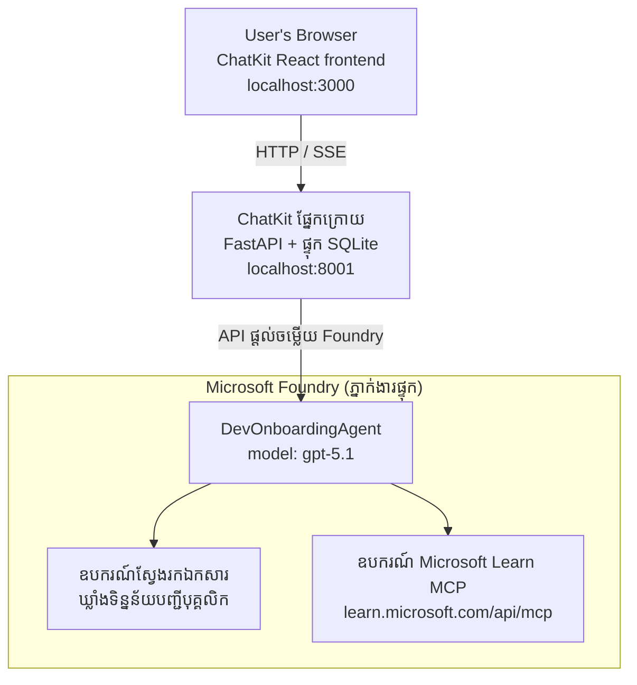

# មេរៀនទី 4 ៖ ការដាក់ចេញភ្នាក់ងារជាមួយ Microsoft Foundry Hosted Agents + ChatKit

មេរៀននេះបង្ហាញពីវិធីដាក់ចេញភ្នាក់ងារដែលប្រើឧបករណ៍ទៅ Microsoft Foundry ក្នុងនាមជា hosted agent ហើយបង្កើតផ្នែកមុខជាមួយ ChatKit ដើម្បីធ្វើអន្តរកម្មជាមួយវា។

## រៀបចំរចនាសម្ព័ន្ធ

hosted agent គឺជាភ្នាក់ងារតែមួយ `DevOnboardingAgent` (រត់លើ `gpt-5.1`) ដែលឆ្លើយសំណួរអំពីការផ្តល់សេវាកម្មអ្នកអភិវឌ្ឍន៍ដោយប្រើឧបករណ៍ពិសេសពីរដែល hosted: ឧបករណ៍ស្វែងរកឯកសារ File Search លើកន្លែងរកឯកសារជាមួយ employee-directory vector store និងឧបករណ៍ Microsoft Learn MCP ។ ផ្នែកមុខ React របស់ ChatKit និយាយជាមួយ backend FastAPI ដែលហៅភ្នាក់ងារ តាមរយៈ Foundry Responses API។



## អ្វីដែលត្រូវមានជាមុន

1. **Microsoft Foundry Project** ក្នុងតំបន់ North Central US
2. **Azure CLI** បាន Authenticate (`az login`)
3. **Azure Developer CLI** (`azd`) បានដំឡើង
4. **Python 3.12+** និង **Node.js 18+**
5. **Vector Store** បានបង្កើតជាមួយទិន្នន័យនិយោជិក

## ចាប់ផ្តើមរហ័ស

### 1. កំណត់អថេរបរិយាកាស

```bash
cd lesson-4-agentdeployment
cp .env.example .env
# កែសម្រួល .env ជាមួយព័ត៌មានលម្អិតគម្រោង Microsoft Foundry របស់អ្នក
```

### 2. ដាក់ចេញ hosted agent

**ជម្រើស A ៖ ប្រើ Azure Developer CLI (ណែនាំ)**

```bash
cd hosted-agent
azd auth login
azd agent deploy
```

**ជម្រើស B ៖ប្រើ Docker + Azure Container Registry**

```bash
cd hosted-agent

# បង្កើត container
docker build -t developer-onboarding-agent:latest .

# ស្លាកសម្រាប់ ACR
docker tag developer-onboarding-agent:latest <your-acr>.azurecr.io/developer-onboarding-agent:latest

# ដាក់ទៅ ACR
az acr login --name <your-acr>
docker push <your-acr>.azurecr.io/developer-onboarding-agent:latest

# ប្រើ Microsoft Foundry portal ឬ SDK ដើម្បីដាក់ឲ្យដំណើរការ
```

### 3. ចាប់ផ្តើម ChatKit Backend

```bash
cd chatkit-server
python -m venv .venv
source .venv/bin/activate  # លើ Windows: .venv\Scripts\activate
pip install -r requirements.txt
python app.py
```

ម៉ាស៊ីនបម្រើនឹងចាប់ផ្តើមលើ `http://localhost:8001`

### 4. ចាប់ផ្តើម ChatKit Frontend

```bash
cd chatkit-server/frontend
npm install
npm run dev
```

ផ្នែកមុខនឹងចាប់ផ្តើមលើ `http://localhost:3000`

### 5. សាកល្បងកម្មវិធី

បើក `http://localhost:3000` ក្នុងកម្មវិធីរុករករបស់អ្នក ហើយសាកល្បងសំណួរទាំងនេះ៖

**ស្វែងរកនិយោជិក៖**
- "ខ្ញុំជាថ្មីនៅទីនេះ! តើមាននរណាដែលធ្លាប់ធ្វើការនៅ Microsoft ទេ?"
- "នរណាដែលមានបទពិសោធន៍ជាមួយ Azure Functions?"

**ធនធានការសិក្សា៖**
- "បង្កើតផ្លូវសិក្សាសម្រាប់ Kubernetes"
- "តើមានវិញ្ញាបនបត្រអ្វីខ្លះដែលខ្ញុំគួរតែស្វែងរកសម្រាប់ស្ថាបត្យកម្មពពក?"

**ជំនួយភាសាកូដ៖**
- "ជួយខ្ញុំសរសេរកូដ Python សម្រាប់ភ្ជាប់ទៅ CosmosDB"
- "បង្ហាញខ្ញុំពីរបៀបបង្កើត Azure Function"

**សំណួរជាច្រើនភ្នាក់ងារ៖**
- "ខ្ញុំចាប់ផ្តើមជាវិស្វករពពក។ តើខ្ញុំគួរតែភ្ជាប់ជាមួយនរណា ហើយគួរតែមើលសិក្សាអ្វី?"

## រចនាសម្ព័ន្ធគម្រោង

```
lesson-4-agentdeployment/
├── .env.example                 # Environment variables template
├── implementation-plan.md       # Detailed implementation guide
├── README.md                    # This file
├── hosted-agent/               # Microsoft Foundry hosted agent
│   ├── main.py                 # Multi-agent workflow implementation
│   ├── requirements.txt        # Python dependencies
│   ├── Dockerfile              # Container definition
│   └── agent.yaml              # Agent deployment configuration
└── chatkit-server/             # ChatKit server application
    ├── app.py                  # FastAPI backend
    ├── store.py                # SQLite persistence layer
    ├── requirements.txt        # Python dependencies
    └── frontend/               # React frontend
        ├── package.json
        ├── vite.config.ts
        ├── tsconfig.json
        ├── index.html
        └── src/
            ├── main.tsx
            ├── App.tsx
            ├── App.css
            └── index.css
```

## ភ្នាក់ងារ និងឧបករណ៍របស់វា

hosted agent គឺជាភ្នាក់ងារតែមួយ៖ `DevOnboardingAgent` (បានកំណត់នៅ `hosted-agent/main.py`) ដែលដោះស្រាយចំណុចបីនៃការផ្តល់សេវាកម្ម onboarding។ វាមិនរៀបចំ sub-agents ផ្សេងទេ ជំនួសវា បង្ហាញរាល់សមត្ថភាពក្នុងនាមឧបករណ៍មួយ (ឬផ្អែកលើម៉ូដែលដោយផ្ទាល់)៖

| សមត្ថភាព | របៀបដោះស្រាយ | ឧបករណ៍ |
|-----------|------------------|------|
| **ស្វែងរកនិងភ្ជាប់និយោជិក** | Foundry hosted File Search លើ employee-directory vector store | `client.get_file_search_tool(vector_store_ids=[...])` |
| **ការសិក្សា និងបណ្តុះបណ្តាល** | ម៉ាស៊ីនមេ Microsoft Learn MCP (hosted MCP tool) | `client.get_mcp_tool(url="https://learn.microsoft.com/api/mcp")` |
| **ជំនួយផ្នែកភាសាកូដ** | បានដោះស្រាយដោយម៉ូដែល `gpt-5.1` ដោយផ្ទាល់ — គ្មានឧបករណ៍ខាងក្រៅ | — |

ភ្នាក់ងារត្រូវបានបង្កើតជាមួយ `client.as_agent(name="DevOnboardingAgent", instructions=..., tools=[file_search_tool, learn_mcp_tool])` ហើយបម្រើជាមួយ `from_agent_framework(agent).run()`

> **កំណត់សម្គាល់រចនា។** ម៉ូដែលមុនៗនៃមេរៀននេះបានប្រើ workflow មួយ `HandoffBuilder` អ្នកប្រើប្រាស់ Multi-agent (Triage → ជំនាញជាក់លាក់)។ ភ្នាក់ងារដែលបានដាក់ចេញគឺជាភ្នាក់ងារតែមួយដែលប្រើឧបករណ៍ ដែលមានភាពសាមញ្ញក្នុងការដាក់ចេញ និងអាចយល់បានសម្រាប់សំណួរ Q&A រចនាប្រភេទ onboarding ។ សម្រាប់ឧទាហរណ៍នៃការរៀបចំ multi-agent ហើយនិងការផ្ទេរ, សូមមើលមេរៀនទី 2 និង មេរៀនទី 3។

## ការធ្វើតេស្ត Smoke លើ hosted agent (CI Gate)

ការដាក់ចេញ hosted agent "ដោយជោគជ័យ" គឺបង្ហាញតែថា control plane ទទួលយកនូវ 
ការកំណត់ — តែ **មិន** បញ្ជាក់ថា agent ពិតជាចម្លើយ។ ការអវត្តមាននៃការអាស្រ័យ,
ការបញ្ជូនម៉ូដែលខូច ឬការតភ្ជាប់ផុតកំណត់អាចទុក agent មានស្ថានភាពភ្លឺ (green) ប៉ុន្តែឈប់ស្ងាត់។

មេរៀននេះផ្តល់នូវការធ្វើតេស្ត **smoke test** ខ្សោយមួយ ដែលដំណើរការជាហ្វាស្ត៍ និងថ្លៃក្រោយការដាក់ចេញ។
វាប្រើឯកសារ [AI Smoke Test](https://github.com/marketplace/actions/ai-smoke-test)
GitHub Action ដើម្បីបញ្ជូន POST prompts ទៅកាន់ ដីកា Foundry **Responses** របស់ agent
(`POST {project_endpoint}/agents/{agent_name}/endpoint/protocols/openai/responses`)
ហើយបញ្ជាក់លើអត្ថបទដែលបានតប ។ វាចាប់បានការដាក់ចេញបាក់បែក ការបរាជ័យសញ្ញាអនុញ្ញាត,
ការប្រែប្រួលរបស់ system-prompt និងការខូចខាត threading ក្នុងរយៈពេលវេលានៃការរត់។

> ការធ្វើតេស្ត smoke មិនមែនជាការជំនួសសម្រាប់ការវាយតម្លៃពេញលេញ
> នៅ [Lesson 3](../lesson-3-agent-evals/README.md) — វា​ជា ការបន្ថែមបន្ត ។ ការធ្វើតេស្ត smoke
> ចម្លើយ "*តើ agent អាចប្រើបាន, ឆ្លើយតប និងគោរពតាមការស្នើរសុំបឋមមែនទេ?*";
> ការវាយតម្លៃផ្តល់ចម្លើយ "*តើចម្លើយល្អប៉ុណ្ណា?*". ដំណើរការខ្ពស់ថ្លៃមួយ គួរត្រូវចាប់ផ្តើមនៅរាល់ការដាក់ចេញ។

### អ្វីដែលត្រូវបានសាកល្បង

បញ្ជីរសមាជិកនៅ [`hosted-agent/tests/smoke-tests.json`](../../../lesson-4-agentdeployment/hosted-agent/tests/smoke-tests.json)
ហើយប្រើនៅលើចំណុចបីនៃ agent ព្រមជាមួយការគោរពរបស់ prompt និងការជជែកពហុជាន់:

| តេស្ត | វាសរសើរអ្វី |
|------|------------------|
| `reachability` | Agent ឆ្លើយតបជាមួយអត្ថបទមិនទទេ និងស្របតាមចំណុច |
| `employee-search` | ដែន File-search ឆ្លើយតបជាមួយកូដសំណួរ 200 (ចម្លើយអាស្រ័យលើទិន្នន័យ) |
| `learning-path` | ដែនសិក្សាតបតាមប្រធានបទ និងបង្កើតចម្លើយបែបផ្លូវ |
| `coding-assistance` | ដែនកូដ ផ្គត់ផ្គង់ចម្លើយឡើងជាភាសា Python |
| `prompt-adherence-offtopic` | សំណើដែលមិនទាក់ទង ត្រូវបានបញ្ជូនបន្ត មិនបានឆ្លើយលម្អិត |
| `threading-turn-1/2` | រក្សាស្ថានភាពការជជែកនៅតាមជុំវិញជាមួយ `previous_response_id` |

### ប្រតិបត្តិការនៅលើ CI

workflow នៅ [`.github/workflows/smoke-test-hosted-agent.yml`](../../../.github/workflows/smoke-test-hosted-agent.yml)
មានការងារចំនួនពីរ៖

- **`static`** — ការត្រួតពិនិត្យរហ័ស ដែលមិនប្រើ Azure ដំណើរការតាមរាល់ pull request និង push:
  វាបំបែកSource Python ទាំងអស់ (`py_compile`) និងពិនិត្យ តំណ Markdown។ គ្មានការស្នើសុំសម្ងាត់
  ទេ ដូច្នេះវាធ្វើការលើ fork PRs បាន។
- **`smoke`** — សាកល្បង smoke ដំណាក់កាលដែលភ្ជាប់ Azure ខាងក្រោម។ វាធ្វើការតាមការស្នើ
  (Actions → **Agent CI (static + smoke)** → Run workflow) ហើយអាចភ្ជាប់បន្ត workflow 
  deploy របស់អ្នក។

កំណត់អថេរ **variables** និង **secrets** របស់ repository សម្រាប់ការងារ smoke ៖

| ប្រភេទ | ឈ្មោះ | តម្លៃ |
|------|------|-------|

| អថេរ | `FOUNDRY_PROJECT_ENDPOINT` | `https://<account>.services.ai.azure.com/api/projects/<project>` |
| អថេរ | `HOSTED_AGENT_NAME` | ឈ្មោះភ្នាក់ងារដែលបានចេញផ្សាយ (ឧ. `dev-onboarding` — ត្រូវតែលំហែ័ឹងនឹងការចេញផ្សាយរបស់អ្នក) |
| សម្ងាត់ | `AZURE_CLIENT_ID` / `AZURE_TENANT_ID` / `AZURE_SUBSCRIPTION_ID` | អត្តសញ្ញាណ OIDC រួមគ្នាសម្រាប់ `azure/login` |

អត្តសញ្ញាណរត់កម្មវិធីត្រូវការតួនាទី **`Azure AI User`** នៅ **សហក្នុងគម្រោង Foundry** ដើម្បីវា​អាច
ហៅច្រកទិន្នន័យ Responses (និងសន្ទទួល)។ ផ្ដល់អោយវាជាមួយ៖

```bash
az role assignment create \
  --assignee <object-id-or-appId-of-runner-identity> \
  --role "Azure AI User" \
  --scope "/subscriptions/<sub>/resourceGroups/<rg>/providers/Microsoft.CognitiveServices/accounts/<account>/projects/<project>"
```

### រត់វាដោយហៅនៅក្នុងកុំព្យូទ័រខ្លួនឯង

អ្នកអាចរត់កាតាឡុកដូចគ្នាមុនពេលជូនព័ត៌មក។ ទទួលចំបងទិន្នន័យដែលមានវាលទិន្នន័យ
`https://ai.azure.com/` ហើយបញ្ជូនរត់ការ នៅកាន់ការចេញផ្សាយរបស់អ្នក៖

```bash
# ទីផ្សារត្រូវតែ https://ai.azure.com/ (តោគែន cognitiveservices.azure.com ត្រូវបានបដិសេធ)
export FOUNDRY_TOKEN=$(az account get-access-token --resource https://ai.azure.com/ --query accessToken -o tsv)

git clone https://github.com/JFolberth/ai-smoketest && cd ai-smoketest
python runner.py \
  --project-endpoint "https://<account>.services.ai.azure.com/api/projects/<project>" \
  --agent-name dev-onboarding \
  --tests-file ../lesson-4-agentdeployment/hosted-agent/tests/smoke-tests.json
```

កូដចេញ៖ `0` ទទួលបានគ្រប់យ៉ាង, `1` ការត្រួតពិនិត្យមួយបរាជ័យ, `2` កំហុសរត់ (កាតាឡុក / ចំបងខុស)។

## ជំនួយដោះស្រាយបញ្ហា

### ភ្នាក់ងារមិនឆ្លើយតប
- ត្រួតពិនិត្យភ្នាក់ងារដែលបានផ្ដល់សេវាថាត្រូវបានបញ្ចេញនិងរត់នៅក្នុង Microsoft Foundry
- ពិនិត្យមើលថា `HOSTED_AGENT_NAME` និង `HOSTED_AGENT_VERSION` ត្រូវនឹងការចេញផ្សាយរបស់អ្នក

### កំហុស ហាងស្តុកវ៉ិចទ័រ
- ប្រាកដថា `VECTOR_STORE_ID` ត្រូវបានកំណត់ត្រឹមត្រូវ
- ពិនិត្យមើលថា ហាងស្តុកវ៉ិចទ័រមានទិន្នន័យនិយោជិក

### កំហុសផ្នែកសក្ដានុពល
- រត់ `az login` ដើម្បីបច្ចុប្បន្នភាពសញ្ញាប័ត្រ
- ប្រាកដថាអ្នកមានការចូលប្រើគម្រោង Microsoft Foundry

## បង្ហាញធនធាន

- [ឯកសារភ្នាក់ងារ Microsoft Foundry Hosted Agents](https://learn.microsoft.com/en-us/azure/ai-foundry/agents/concepts/hosted-agents)
- [Microsoft Agent Framework](https://github.com/microsoft/agent-framework)
- [គំរូបញ្ចូល ChatKit](https://github.com/microsoft/agent-framework/tree/main/python/samples/demos/chatkit-integration)
- [Azure Developer CLI](https://learn.microsoft.com/en-us/azure/developer/azure-developer-cli/overview)
- [សកម្មភាព GitHub សាកល្បង AI Smoke Test](https://github.com/marketplace/actions/ai-smoke-test)
- [សាកល្បងភ្នាក់ងារ Microsoft Foundry ដោយ GitHub Actions (ប្លុក)](https://techcommunity.microsoft.com/blog/azuredevcommunityblog/smoke-test-microsoft-foundry-agents-with-github-actions/4531912)

---

## ជំហានបន្ទាប់

ភ្នាក់ងាររបស់អ្នករត់លើហេដ្ឋារចនាសម្ព័ន្ធដែលគ្រប់គ្រងដោយ Microsoft។ ដើម្បីយកវាទៅកាន់ផលិតកម្មសហគ្រាស —
គ្រប់គ្រងទីតាំងទិន្នន័យរបស់វា (អំណាចលើទិន្នន័យ, បណ្តាញឯកជន, នាំយក Azure របស់អ្នកផ្ទាល់
Cosmos DB / ស្តុក / ស្វែងរក AI) និងគ្រប់គ្រងឧបករណ៍របស់វា — បន្តទៅ
**[មេរៀន 5: ភ្នាក់ងារចុះផ្សាយក្នុងផលិតកម្ម](../lesson-5-hosted-agents-production/README.md)** ដែល
ធ្វើអោយយល់ខុសគ្នាសំខាន់រវាង **ភ្នាក់ងារចុះផ្សាយ** និង **វេទិកាសមត្ថភាព**។

---

<!-- CO-OP TRANSLATOR DISCLAIMER START -->
**ការបដិសេធ**:
ឯកសារនេះត្រូវបានបម្លែងភាសា ដោយប្រើសេវាបម្លែងភាសា AI [Co-op Translator](https://github.com/Azure/co-op-translator)។ ទោះយើងខ្ញុំមានក្តីប្រាថ្នាឱ្យបានច្បាស់លាស់ តែសូមយល់ដឹងថាការបម្លែងដោយស្វ័យប្រវត្តិក៏អាចមានកំហុសឬភាពមិនត្រឹមត្រូវ។ ឯកសារដើមជាភាសាទីតាំងគួរត្រូវបានគេប្រើជាប្រភពច្បាស់លាស់។ សម្រាប់ព័ត៌មានសំខាន់ៗ សូមណែនាំឱ្យប្រើប្រាស់ការប្រែដោយមនុស្សជំនាញ។ យើងខ្ញុំមិនទទួលខុសត្រូវចំពោះការយល់ច្រឡំ ឬការបកស្រាយខុសបន្ទាប់ពីការប្រើប្រាស់ការបម្លែងនេះនោះទេ។
<!-- CO-OP TRANSLATOR DISCLAIMER END -->