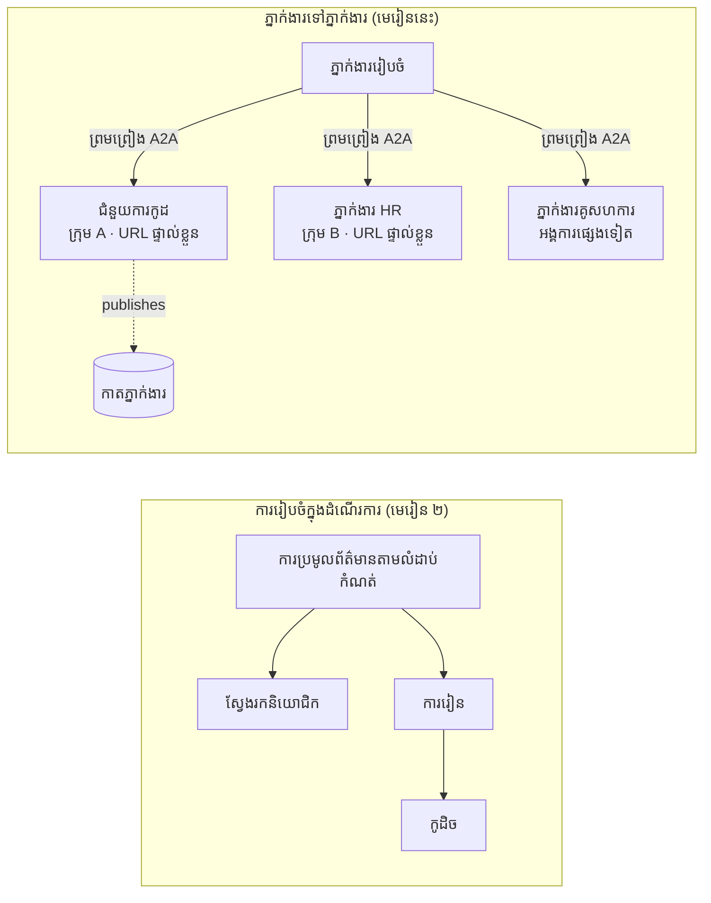

# មេរៀនទី 7៖ ការរៀបចំភាសាជាអ្នកជាច្រើន និង អ្នកទៅអ្នក (A2A)

ដោយ [មេរៀនទី 6](../lesson-6-toolbox/README.md) អ្នកអាចបង្កើតឧបករណ៍គ្រប់គ្រង និងភ្នាក់ងារជាប់ផ្ទះ។
ប៉ុន្តែប្រព័ន្ធពិតតិចណាស់ប្រើភ្នាក់ងារតែមួយប៉ុណ្ណោះ។ នៅពេលអ្នកពង្រីក អ្នកប្រមាណបានភ្នាក់ងារច្រើនៗ — មានខ្លះដែលអ្នក
គ្រប់គ្រង មានខ្លះដែលគេគ្រប់គ្រងដោយក្រុមផ្សេងៗ មានខ្លះរត់នៅក្នុងអង្គការផ្សេងទៀត។ មេរៀននេះគឺអំពី
របៀបដែលភ្នាក់ងារដំណើរការជាមួយគ្នា។

អ្នកបានជួបប្រទះនូវទម្រង់ការរចនាភ្នាក់ងារជាច្រើនមួយក្នុង
[សោហ៊ុត៖ agent-orchestration.py របស់មេរៀនទី 2](../lesson-2-agent-development/README.md)៖ លំនាំ **handoff**
ដែលភ្នាក់ងារត្រីអាជីមួយចេញដឹកនាំទៅអ្នកជំនាញបន្ទាប់ **នៅក្នុងដំណើរការតែមួយ**។ មេរៀននេះធ្វើ
លម្អិតទៅកាន់កម្រិតមួយទៀត — ទៅកាន់ **Agent-to-Agent (A2A)** ដែលជាគន្លងបើកសម្រាប់ភ្នាក់ងារដែលដំណើរការ
ជា **សេវាស្ថិតនៅបណ្តាប្រព័ន្ធ​បណ្ដាញ​ឯករាជ្យ** ហើយហៅគ្នាតាមដំណាក់កាល ដោយមានដែនកំណត់រវាងដំណើរការ ក្រុម និងអង្គការ។

## គោលបំណងសិក្សា

នៅចុងបញ្ចប់មេរៀននេះ អ្នកនឹងអាច:

- ពន្យល់ពីភាពខុសគ្នារវាង **ការរៀបចំក្នុងដំណើរការ** (handoff/workflows) និង
  ការទំនាក់ទំនង **Agent-to-Agent (A2A)** ហើយជ្រើសយកពីរបៀបនេះត្រឹមត្រូវ។
- ពណ៌នា និងសមាសធាតុរចនារបស់ A2A៖ **កាតភ្នាក់ងារ**, **ជំនាញ**, **ការងារ**, និង **ការស្វែងរក**។
- **បង្ហាញ** ភ្នាក់ងាររបស់ Microsoft Agent Framework ជាសេវា A2A ដោយប្រើ `A2AExecutor`។
- **ប្រើប្រាស់** ភ្នាក់ងារពីចម្ងាយជាដៃគូបណ្តាញជាមួយ `A2AAgent`។
- អនុវត្តបញ្ហារឿងអាជីពទៅ A2A: **សុវត្ថិភាព, អត្តសញ្ញាណ, អាជ្ញាបណ្ណ, ការត្រួតពិនិត្យ, និងថ្លៃដើម**។

---

## លក្ខខណ្ឌបន្តទៀត

1. បានបញ្ចប់ [មេរៀនទី 2](../lesson-2-agent-development/README.md) (ការអភិវឌ្ឍភ្នាក់ងារនិងការរៀបចំ)។
2. មានគម្រោង **Microsoft Foundry** ជាមួយការបញ្ចេញម៉ូឌែលបច្ចុប្បន្ន (ឧទាហរណ៍ `gpt-5.1`, និង
   `gpt-5-codex` សម្រាប់គំរូកូដ)។ ជៀសវាង GPT-4o / GPT-4.1 ដែលបានដកចេញ។
3. **Azure CLI** បានបញ្ជាក់身份: `az login`។
4. **Python 3.12+** ជាមួយជំនួយមុខងារ (dependencies) បានតំឡើង (`pip install -r ../requirements.txt`)។
   មេរៀនទី 7 បន្ថែមកញ្ចប់ពិនិត្យមើល `agent-framework-a2a`, `a2a-sdk` និង `uvicorn`។
5. បានកំណត់ `FOUNDRY_PROJECT_ENDPOINT` និង `FOUNDRY_MODEL` ក្នុង `.env` របស់អ្នក (មើល README របស់វគ្គសិក្សា)។

---

## 1. របៀបពីរ ដែលភ្នាក់ងារដំណើរការជាមួយគ្នា

មិនមានលំនាំ "multi-agent" តែមួយទេ។ ជ្រើសរើសលំនាំដែលសមនឹង **ដែនកំណត់** របស់អ្នក៖

| លំនាំ | ភ្នាក់ងាររត់នៅទីណា | របៀបភ្ជាប់ | ប្រើនៅពេលណា |
|---------|------------------|------------------|----------|
| **Handoff / Workflow** (មេរៀន 2) | កម្មវិធីតែមួយ ដោយកូដមួយ | ក្រាបក្នុងម៉ោន ( `HandoffBuilder`, `WorkflowBuilder`) | អ្នកគ្រប់គ្រងភ្នាក់ងារទាំងអស់ និងចែកចាយវាជាមួយគ្នា។ |
| **Agent-to-Agent (A2A)** (មេរៀននេះ) | សេវាផ្សេងៗ ជីវិតខុសគ្នា | បទដ្ឋានបើក **A2A protocol** លើ HTTP ដែលរកឃើញតាម **Agent Cards** | ភ្នាក់ងារជារបស់ក្រុមផ្សេងៗ/អង្គការ, មានសេរីភាពលើការពង្រីក, ឬសរសេរជា framework ផ្សេងៗ។ |

Handoff គឺអំពី **ការបញ្ជូនក្នុងកម្មវិធីមួយ**។ A2A គឺអំពី **ការប្រុងបង្ហាញភ្នាក់ងារជាសេវាឯករាជ្យ** — សមាសភាគភ្នាក់ងារដូចជាការផ្លាស់ប្តូរពីការហៅសមាសភាពទៅសេវាកម្មតូចៗ។




> **ពួកគេរួមបញ្ចូលគ្នា។** អ្នករៀបចំដែលអ្នកបង្កើតជាមួយ `HandoffBuilder` អាចមាន **ភ្នាក់ងារ A2A ពីចម្ងាយ**
> ជាអ្នកចូលរួម — នាំផ្លូវក្នុងដំណើរការទៅកាន់សេវាដែលរត់នៅកន្លែងណាក៏ដោយ។

---

## 2. សមាសធាតុំ A2A

A2A ជា **គន្លងបើក** (មិនមែនផ្ទាល់ Microsoft) ដូច្នេះភ្នាក់ងារ A2A អាចយកទៅប្រើដោយ Microsoft
Agent Framework, LangGraph, កូដផ្ទាល់ខ្លួន ឬស្ដាក់របស់ក្រុមហ៊ុនផ្សេងទៀត។ មានយល់ដឹងអ្វីបួន៖

- **Agent Card** — ឯកសារ JSON តូចមួយ ដែលបោះពុម្ពនៅ
  `/.well-known/agent-card.json` ប្រកាសឈ្មោះភ្នាក់ងារ **ពិពណ៌នា URL ទម្រង់កំណែ,
  ជំនាញ និងសមត្ថភាព**។ នេះជារបៀបម្ដងទិញស្វែងរកអ្វីដែលភ្នាក់ងារពីចម្ងាយអាចធ្វើបាន។
- **ជំនាញ** — អ្វីដែលបានប្រកាសថាជាជំនាញរបស់ភ្នាក់ងារ (`id`, `name`, `description`, `tags`,
  `examples`)។ អតិថិជន (និងម៉ូឌែល) ប្រើដើម្បីសម្រេចចិត្តក្នុងការហៅ។
- **ការងារ** — ការហៅភ្នាក់ងារ A2A គឺជាការងារមួយដែលមានជីវិតវដ្ត (បានដាក់ → កំពុងដំណើរ →
  បានបញ្ចប់ / បរាជ័យ)។ ម៉ាស៊ីនបម្រើតាមដានការងារនៅក្នុង **ឃ្លាំងការងារ**; មានការផ្សព្វផ្សាយបន្ត។
- **ការស្វែងរក** — អតិថិជនដែលមានតែ URL ទទួលបាន Agent Card ហើយដឹងរបៀបហៅភ្នាក់ងារ។

---

## 3. បង្ហាញភ្នាក់ងារជាសេវា A2A — `a2a_server.py`

ផ្នែក **បង្កើត/បម្រើ** បញ្ចូលភ្នាក់ងារណាមួយ Microsoft Agent Framework ជាមួយ `A2AExecutor` ហើយដាក់វា
នៅលើកម្មវិធី HTTP របស់ A2A។ មើល [`a2a_server.py`](../../../lesson-7-multi-agent-a2a/a2a_server.py)។ ការតភ្ជាប់សំខាន់៖

```python
from agent_framework.a2a import A2AExecutor
from a2a.server.apps import A2AStarletteApplication
from a2a.server.request_handlers import DefaultRequestHandler
from a2a.server.tasks import InMemoryTaskStore
from a2a.types import AgentCapabilities, AgentCard, AgentSkill

agent = client.as_agent(name="coding-assistant", instructions="...")

agent_card = AgentCard(
    name="Coding Assistant",
    description="Generates runnable code samples...",
    url="http://localhost:9000/",
    version="1.0.0",
    capabilities=AgentCapabilities(streaming=True),
    default_input_modes=["text"],
    default_output_modes=["text"],
    skills=[AgentSkill(id="generate-code", name="Generate code",
                       description="Write a runnable code snippet.", tags=["code"])],
)

request_handler = DefaultRequestHandler(
    agent_executor=A2AExecutor(agent),
    task_store=InMemoryTaskStore(),
)
app = A2AStarletteApplication(agent_card=agent_card, http_handler=request_handler).build()
# ដំណើរការជាមួយ uvicorn នៅលើកំពង់ 9000
```

សម្គាល់កូដភ្នាក់ងារមិនបានប្ដូរទេ — `A2AExecutor` បម្លែងភ្នាក់ងាររបស់អ្នកឲ្យត្រូវនឹងគន្លង។ 
កាតភ្នាក់ងារជាអ្វីដែលធ្វើឲ្យវាអាច **ស្វែងរកបាន** ដល់អតិថិជន A2A អ្នកណាមួយ។

---

## 4. ប្រើភ្នាក់ងារពីចម្ងាយ — `a2a_client.py`

ផ្នែក **ប្រើប្រាស់** តភ្ជាប់ទៅភ្នាក់ងារពីចម្ងាយ **តាម URL**, ទាញយកកាតភ្នាក់ងារ និងហៅវា
ដូចជា ភ្នាក់ងារប្រកបដោយជំនាញមួយ។ មើល [`a2a_client.py`](../../../lesson-7-multi-agent-a2a/a2a_client.py)៖

```python
from agent_framework.a2a import A2AAgent

remote_agent = A2AAgent(name="remote-coding-assistant", url="http://localhost:9000")
result = await remote_agent.run("Write a Python function that reverses a string.")
print(result.text)
```

នេះគឺជាចំណុចសំខាន់របស់ A2A៖ ពីសំណាក់អ្នកហៅភ្នាក់ងារពីចម្ងាយដូចជាភ្នាក់ងារផ្សេងៗ `agent_framework` ដូច្នេះអ្នកអាចដាក់វាទៅក្នុងចរន្តការងារឬផ្ទេរពីវា — ទោះបីវារត់នៅក្នុងដំណើរការផ្សេង របស់ម៉ាស៊ីនផ្សេង មានម្ចាស់ផ្សេង។


អ្នកនឹងមើលឃើញការឆ្លើយតបអ្នកជំនួយកូដប្រាប់មកតាមរយៈប្រព័ន្ធ A2A។ បើក
`http://localhost:9000/.well-known/agent-card.json` ក្នុងកម្មវិធីរុករកដើម្បីមើលកាតភ្នាក់ងារបានបោះពុម្ពផ្សាយ។


---

## 5. បញ្ហាអាជីវកម្ម

ការបម្លែងភ្នាក់ងារទៅជាសេវាបណ្តាញបង្កឲ្យមានបញ្ហាដូចជា ប្រព័ន្ធចែកចាយណាមួយ —
ជាបន្ថែមនូវបញ្ហាផ្ទាល់មុខ AI ផ្សេងៗ៖


- **អត្តសញ្ញាណ និងការផ្ទៀងផ្ទាត់។** មិនដែលបង្ហាញភ្នាក់ងារជាច្រើន A2A ដោយគ្មានការផ្ទៀងផ្ទាត់ឡើយ។ ក្ដារភ្នាក់ងារ មាន
  `security` / `security_schemes` ហើយ `A2AAgent` ទទួលយក `auth_interceptor` ដូច្នេះអ្នកហៅភ្ជាប់
  លិខិតសម្គាល់​សុវត្ថិភាព (និមិត្តសញ្ញា OAuth bearer tokens, កូនសោ API)។ ប្រើ Entra ID / managed identities សម្រាប់
  ការផ្ទៀងផ្ទាត់សេវាកម្មទៅសេវាកម្មក្នុងការដំណើរការពិត; ដាក់សេវាកម្មពីក្រោយទ្វារច្រក។
- **ការគ្រប់គ្រង។** លាយបញ្ចូល A2A ជាមួយ [ប្រអប់ឧបករណ៍មេរៀន 6](../lesson-6-toolbox/README.md): ភ្នាក់ងារពីចម្ងាយ
  អាចផ្សាយជាឧបករណ៍ **A2A tool** ក្នុងប្រអប់ឧបករណ៍ដែលគ្រប់គ្រងដោយរដ្ឋបាល ដូច្នេះ RBAC, ឧបត្ថម្ភសំណុំបញ្ជា,
  និងគោលនយោបាយ​ការពារ​ការពារ​ត្រូវអនុវត្ត​ចំកណ្តាល។
- **ការអាចមើលឃើញបាន។** សំណើឥឡូវនេះឆ្លងកាត់ព្រំដែនដំណើរការ ដូច្នេះផ្ទុកនាំការតាមដានទៅឆ្លងកាត់ការហៅ។
  បើក [Foundry Observability / OpenTelemetry](../lesson-3-agent-evals/README.md) នៅលើ **ទាំងពីរ**
  ក្រុមកម្មវិធីរៀបចំ និងភ្នាក់ងារពីចម្ងាយរាល់ម្នាក់ ដើម្បីទទួលបានតាមដានពីមួយចុងទៅចុង។
- **ការផ្លាស់ប្តូរជំនាន់។** ក្ដារភ្នាក់ងារមាន `version`។ រាប់បញ្ចូលវាដូចជា API: ការផ្លាស់ប្តូរលើកកើនបន្ថែមគឺមានសុវត្ថិភាព;
  បំបែកកិច្ចសន្យាបច្ចេកទេសត្រូវការជំនាន់ថ្មី និងចំហរពេលវេលាដល់អ្នកប្រើប្រាស់។
- **ភាពជឿជាក់។** ភ្នាក់ងារពីចម្ងាយបរាជ័យដោយឯករាជ្យ។ កំណត់ពេលវេលាចុងក្រោយ (`A2AAgent(timeout=...)`), ដោះស្រាយ
  ភាគហ៊ុនបរាជ័យ ហើយកុំឲ្យមិត្តរួមមួយដាច់ដាយធ្វើឲ្យការរៀបចំសរុបរបស់អ្នកឈប់។
- **ថ្លៃដើម។** ការហៅភ្នាក់ងារពីចម្ងាយរាល់មួយគឺជាការហៅគំរូផ្ទាល់។ ការរីកលូតលាស់ធ្វើឲ្យការចំណាយសញ្ញាតokens
  កំណត់ថវិកាសម្រាប់វា ហើយចូលចិត្តផ្ញើទៅ **ភ្នាក់ងារមួយ** ល្អជាងផ្ញើទៅច្រើន।

---

## ការហាត់និងអនុវត្តជាក់ស្តែង

1. **បន្ថែមសេវាកម្មទីពីរ។** ចម្លង `a2a_server.py` ដើម្បីបង្ហាញភ្នាក់ងារ **ស៊ែរកម្មករ** នៅលើអំពូត
   9001 ជាមួយក្ដារភ្នាក់ងារផ្ទាល់ខ្លួន និងជំនាញ។ រត់ទាំងពីរ ហើយអោយអតិថិជនហៅមួយៗ។
2. **រៀបចំព្យាករណ៍ពីចម្ងាយ។** បង្កើត `HandoffBuilder` តូច (ឬរុញចេញ) ដែលមានអ្នកចូលរួមពីរ
   រួមមានពីរ `A2AAgent`s ធ្វើសំរាប់សេវាកម្មទាំងពីរ។ ផ្ញើសំណួរទៅមិត្តរួមត្រឹមត្រូវ។
3. **ធ្វើឲ្យមានសុវត្ថិភាព។** បន្ថែម `auth_interceptor` ទៅ អតិថិជន ហើយទាមទារឲ្យមានសញ្ញាគាំទ្រនៅម៉ាស៊ីនបម្រើ។
   តើអ្វីខូចខាតបើសញ្ញាគាំទ្រមិនមាន? តើអ្នកនឹងរក្សាទុកសញ្ញាគាំទ្រនៅណាក្នុងការផលិត?
4. **Handoff ជียบ A2A។** សរសេរចំណុចខ្លីពីរ៖ ថាតើពេលណាអ្នករក្សាទុក handoff ក្នុងដំណើរការមេរៀន 2,
   ហើយពេលណារឿងបន្ថែមនៃ A2A ត្រូវបានបង្ហាញថាសមរម្យ? ផ្តល់ឧទាហរណ៍ជាក់លាក់នៃទាំងពីរ។

---

## ធនធាន

- [Agent-to-Agent (A2A) — Microsoft Agent Framework](https://learn.microsoft.com/agent-framework/user-guide/agent-orchestration/a2a)
- [Multi-agent orchestration — Microsoft Agent Framework](https://learn.microsoft.com/agent-framework/user-guide/agent-orchestration/)
- [A2A protocol specification](https://a2a-protocol.org/)
- [A2A Python SDK (`a2a-sdk`)](https://github.com/a2aproject/a2a-python)
- [Foundry Agent Service — multi-agent patterns](https://learn.microsoft.com/azure/ai-foundry/agents/concepts/connected-agents)

---

**មុននេះ:** [មេរៀន 6 — ប្រអប់ឧបករណ៍ Microsoft](../lesson-6-toolbox/README.md)

---

<!-- CO-OP TRANSLATOR DISCLAIMER START -->
**ការបដិសេធ**:
ឯកសារនេះត្រូវបានបម្លែងភាសា ដោយប្រើសេវាបម្លែងភាសា AI [Co-op Translator](https://github.com/Azure/co-op-translator)។ ទោះយើងខ្ញុំមានក្តីប្រាថ្នាឱ្យបានច្បាស់លាស់ តែសូមយល់ដឹងថាការបម្លែងដោយស្វ័យប្រវត្តិក៏អាចមានកំហុសឬភាពមិនត្រឹមត្រូវ។ ឯកសារដើមជាភាសាទីតាំងគួរត្រូវបានគេប្រើជាប្រភពច្បាស់លាស់។ សម្រាប់ព័ត៌មានសំខាន់ៗ សូមណែនាំឱ្យប្រើប្រាស់ការប្រែដោយមនុស្សជំនាញ។ យើងខ្ញុំមិនទទួលខុសត្រូវចំពោះការយល់ច្រឡំ ឬការបកស្រាយខុសបន្ទាប់ពីការប្រើប្រាស់ការបម្លែងនេះនោះទេ។
<!-- CO-OP TRANSLATOR DISCLAIMER END -->