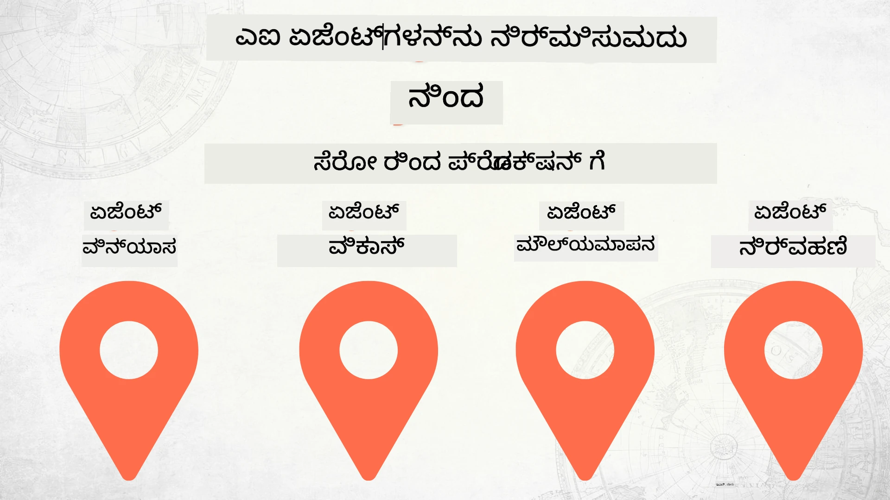

# ಶೂನ್ಯದಿಂದ ಉತ್ಪಾದನೆಗೆ AI ಏಜೆಂಟ್ಗಳ ನಿರ್ಮಾಣ



### 🌐 ಬಹುಭಾಷಾ ಬೆಂಬಲ

#### GitHub ಕ್ರಿಯೆಯಿಂದ ಬೆಂಬಲಿತ (ಸ್ವಯಂಚಾಲಿತ ಮತ್ತು ಸದಾ ನವೀಕರಣೆ)

<!-- CO-OP TRANSLATOR LANGUAGES TABLE START -->
[Arabic](../ar/README.md) | [Bengali](../bn/README.md) | [Bulgarian](../bg/README.md) | [Burmese (Myanmar)](../my/README.md) | [Chinese (Simplified)](../zh-CN/README.md) | [Chinese (Traditional, Hong Kong)](../zh-HK/README.md) | [Chinese (Traditional, Macau)](../zh-MO/README.md) | [Chinese (Traditional, Taiwan)](../zh-TW/README.md) | [Croatian](../hr/README.md) | [Czech](../cs/README.md) | [Danish](../da/README.md) | [Dutch](../nl/README.md) | [Estonian](../et/README.md) | [Finnish](../fi/README.md) | [French](../fr/README.md) | [German](../de/README.md) | [Greek](../el/README.md) | [Hebrew](../he/README.md) | [Hindi](../hi/README.md) | [Hungarian](../hu/README.md) | [Indonesian](../id/README.md) | [Italian](../it/README.md) | [Japanese](../ja/README.md) | [Kannada](./README.md) | [Khmer](../km/README.md) | [Korean](../ko/README.md) | [Lithuanian](../lt/README.md) | [Malay](../ms/README.md) | [Malayalam](../ml/README.md) | [Marathi](../mr/README.md) | [Nepali](../ne/README.md) | [Nigerian Pidgin](../pcm/README.md) | [Norwegian](../no/README.md) | [Persian (Farsi)](../fa/README.md) | [Polish](../pl/README.md) | [Portuguese (Brazil)](../pt-BR/README.md) | [Portuguese (Portugal)](../pt-PT/README.md) | [Punjabi (Gurmukhi)](../pa/README.md) | [Romanian](../ro/README.md) | [Russian](../ru/README.md) | [Serbian (Cyrillic)](../sr/README.md) | [Slovak](../sk/README.md) | [Slovenian](../sl/README.md) | [Spanish](../es/README.md) | [Swahili](../sw/README.md) | [Swedish](../sv/README.md) | [Tagalog (Filipino)](../tl/README.md) | [Tamil](../ta/README.md) | [Telugu](../te/README.md) | [Thai](../th/README.md) | [Turkish](../tr/README.md) | [Ukrainian](../uk/README.md) | [Urdu](../ur/README.md) | [Vietnamese](../vi/README.md)

> **ಸ್ಥಳೀಯವಾಗಿ ಕ್ಲೋನ್ ಮಾಡಲು ಪ್ರೀಫರ್ ಮಾಡುತ್ತೀರಾ?**
>
> ಈ ರೆಪೊ ಬಂದಿದೆ 50+ ಭಾಷಾ ಅನುವಾದಗಳನ್ನು ಒಳಗೊಂಡಿದ್ದು ಡೌನ್ಲೋಡ್ ಗಾತ್ರವನ್ನು ಬಹಳದೂವರೆಗೆ ಹೆಚ್ಚಿಸುತ್ತದೆ. ಅನುವಾದಗಳನ್ನು ಇಲ್ಲದೆ ಕ್ಲೋನ್ ಮಾಡಲು sparse checkout ಬಳಸಿ:
>
> **Bash / macOS / Linux:**
> ```bash
> git clone --filter=blob:none --sparse https://github.com/microsoft/Building-AI-Agents-From-Zero-To-Production.git
> cd Building-AI-Agents-From-Zero-To-Production
> git sparse-checkout set --no-cone '/*' '!translations' '!translated_images'
> ```
>
> **CMD (Windows):**
> ```cmd
> git clone --filter=blob:none --sparse https://github.com/microsoft/Building-AI-Agents-From-Zero-To-Production.git
> cd Building-AI-Agents-From-Zero-To-Production
> git sparse-checkout set --no-cone "/*" "!translations" "!translated_images"
> ```
>
> ಇದರಿಂದ ನೀವು ಕೋರ್ಸನ್ನು ಪೂರ್ಣಗೊಳಿಸಲು ಬೇಕಾದ ಎಲ್ಲಾ ಅಂಶಗಳನ್ನು ಹೆಚ್ಚು ವೇಗವಾಗಿ ಡೌನ್ಲೋಡ್ ಮಾಡಬಹುದು.
<!-- CO-OP TRANSLATOR LANGUAGES TABLE END -->

## AI ಏಜೆಂಟ್ ಡೆವಲಪ್‌ಮೆಂಟ್ ಲೈಫ್ಸೈಕಲ್ ಮೂಲಭೂತಗಳನ್ನು ಕಲಿಸುವ ಕೋರ್ಸ್

[](https://github.com/microsoft/Building-AI-Agents-From-Zero-To-Production/blob/master/LICENSE?WT.mc_id=academic-105485-koreyst)
[](https://GitHub.com/microsoft/Building-AI-Agents-From-Zero-To-Production/graphs/contributors/?WT.mc_id=academic-105485-koreyst)
[](https://GitHub.com/microsoft/Building-AI-Agents-From-Zero-To-Production/issues/?WT.mc_id=academic-105485-koreyst)
[](https://GitHub.com/microsoft/Building-AI-Agents-From-Zero-To-Production/pulls/?WT.mc_id=academic-105485-koreyst)
[](http://makeapullrequest.com?WT.mc_id=academic-105485-koreyst)

[](https://discord.gg/Kuaw3ktsu6)

## 🌱 ಪ್ರಾರಂಭಿಸುವುದು

ಈ ಕೋರ್ಸ್ AI ಏಜೆಂಟ್ಗಳ ನಿರ್ಮಾಣ ಮತ್ತು ನಿಯೋಜನೆಯ ಮೂಲಭೂತಗಳನ್ನು ಒಳಗೊಂಡ ಪಾಠಗಳನ್ನು ಹೊಂದಿದೆ.

ಪ್ರತಿ ಪಾಠ ಹಿಂದಿನದನ್ನು ಆಧರಿಸಿದೆ, ಆದ್ದರಿಂದ ಆರಂಭದಿಂದ ಪ್ರಾರಂಭಿಸಿ ಕೊನೆಯನ್ನು ತನಕ ಕೆಲಸ ಮಾಡಲು ನಾವು ಶಿಫಾರಸು ಮಾಡುತ್ತೇವೆ.

ನೀವು AI ಏಜೆಂಟ್ ವಿಷಯಗಳನ್ನು ಇನ್ನಷ್ಟು ಅನ್ವೇಷಿಸಲು ಬಯಸಿದರೆ, ನೀವು [AI Agents For Beginners ಕೋರ್ಸ್](https://aka.ms/ai-agents-beginners) ನೋಡಬಹುದು.

### ಇತರ ಪಾಠಶಾಲಾ ವಿದ್ಯಾರ್ಥಿಗಳನ್ನು ಭೇಟಿ ಮಾಡಿ, ನಿಮ್ಮ ಪ್ರಶ್ನೆಗಳಿಗೆ ಉತ್ತರ ಪಡೆಯಿರಿ

ನೀವು ಅಡ್ಡಿಪಡಿದರೆ ಅಥವಾ AI ಏಜೆಂಟ್ಗಳ ನಿರ್ಮಾಣದ ಬಗ್ಗೆ ಯಾವುದೇ ಪ್ರಶ್ನೆಗಳಿದ್ದರೆ, ನಮ್ಮ ನಿರ್ದಿಷ್ಟ ಡಿಸ್ಕೋರ್ಡ್ ಚಾನೆಲ್ ಅನ್ನು [Microsoft Foundry Discord](https://discord.gg/Kuaw3ktsu6) ನಲ್ಲಿ ಸೇರಿ.

### ನಿಮಗೆ ಬೇಕಾಗಿದ್ದು ಏನು

ಪ್ರತಿ ಪಾಠದ ತನ್ನದೇ ಆದ ಕೋಡ್ ಮಾದರಿ ಇದೆ, ಅದನ್ನು ನೀವು ಸ್ಥಳೀಯವಾಗಿ ನಡೆಸಬಹುದು. ನಿಮ್ಮ ಸ್ವಂತ ನಕಲಿಗಾಗಿ ನೀವು ಈ ರೆಪೊವನ್ನು [ಫೋರ್ಕ್ ಮಾಡಬಹುದು](https://github.com/microsoft/Building-AI-Agents-From-Zero-To-Production/fork).

ಈ ಕೋರ್ಸ್ ಈ ಕೆಳಗಿನವುಗಳನ್ನು ಬಳಸುತ್ತದೆ:

- [Microsoft Agent Framework (MAF)](https://aka.ms/ai-agents-beginners/agent-framework)
- [Microsoft Foundry](https://azure.microsoft.com/products/ai-foundry)
- [Azure OpenAI Service](https://azure.microsoft.com/products/ai-foundry/models/openai)
- [Azure CLI](https://learn.microsoft.com/cli/azure/authenticate-azure-cli?view=azure-cli-latest)

ಪ್ರಾರಂಭಿಸುವ ಮೊದಲು ಈ ಸೇವೆಗಳಿಗೆ ನೀವು ಪ್ರವೇಶ ಹೊಂದಿರುವುದಾಗಿ ಖಚಿತಪಡಿಸಿಕೊಳ್ಳಿ.

ಮಾದರಿ ಹೋಸ್ಟಿಂಗ್ ಮತ್ತು ಸೇವೆಗಳಿಗೆ ಇನ್ನಷ್ಟು ಆಯ್ಕೆಗಳು ಶೀಘ್ರದಲ್ಲೇ ಬರುತ್ತಿವೆ.

## 🗃️ ಪಾಠಗಳು

| **ಪಾಠ**             | **ವಿವರಣೆ**                                                                                      |
|--------------------|--------------------------------------------------------------------------------------------------|
| [ಏಜೆంట్ ವಿನ್ಯಾಸ](./lesson-1-agent-design/README.md)         | ನಮ್ಮ "ಡೆವಲಪರ್ ಒನ್‌ಬೋರ್ಡಿಂಗ್" ಏಜೆಂಟ್ ಉಪಯೋಗದ ಬಗ್ಗೆ ಪರಿಚಯ ಮತ್ತು ಪರಿಣಾಮಕಾರಿ ಏಜೆಂಟ್‌ಗಳನ್ನು ವಿನ್ಯಾಸ ಮಾಡುವ ರೀತಿಗಳು  |
| [ಏಜೆಂಟ್ ಅಭಿವೃದ್ಧಿ](./lesson-2-agent-development/README.md)    | Microsoft Agent Framework (MAF) ಬಳಸಿ, 3 ಏಜೆಂಟ್‌ಗಳನ್ನು ಸೃಷ್ಟಿಸಿ ಹೊಸ ಡೆವಲಪರ್‌ಗಳು ಒನ್‌ಬೋರ್ಡ್ ಆಗಲು ಸಹಾಯಮಾಡಿ.       |
| [ಏಜೆಂಟ್ ಮೌಲ್ಯಮಾಪನಗಳು](./lesson-3-agent-evals/README.md)    | Microsoft Foundry ಬಳಸಿ, ನಮ್ಮ AI ಏಜೆಂಟ್‌ಗಳು ಹೇಗೆ ಕಾರ್ಯನಿರ್ವಹಿಸುತ್ತಿವೆ ಮತ್ತು ಅವುಗಳನ್ನು ಹೇಗೆ ಸುಧಾರಿಸಬಹುದು ಎಂದು ಕಂಡುಹಿಡಿಯಿರಿ. |
| [ಏಜೆಂಟ್ ನಿಯೋಜನೆ](./lesson-4-agent-deployment/README.md)     | ಹೋಸ್ಟ್ ಮಾಡಲಾದ ಏಜೆಂಟ್‌ಗಳು ಮತ್ತು OpenAI Chatkit ಬಳಸಿ, AI ಏಜೆಂಟ್ ಅನ್ನು ಉತ್ಪಾದನೆಯಲ್ಲಿ ನಿಯೋಜಿಸುವ ವಿಧಾನವನ್ನು ನೋಡಿ.       |

## 🎒 ಇತರ ಕೋರ್ಸ್‌ಗಳು

ನಮ್ಮ ತಂಡ ಇತರ ಕೋರ್ಸ್‌ಗಳನ್ನು ನಿರ್ಮಿಸುತ್ತದೆ! ಪರಿಶೀಲಿಸಿ:

<!-- CO-OP TRANSLATOR OTHER COURSES START -->
### LangChain
[](https://aka.ms/langchain4j-for-beginners)
[](https://aka.ms/langchainjs-for-beginners?WT.mc_id=m365-94501-dwahlin)
[](https://github.com/microsoft/langchain-for-beginners?WT.mc_id=m365-94501-dwahlin)
---

### Azure / Edge / MCP / ಏಜೆಂಟ್‌ಗಳು
[](https://github.com/microsoft/AZD-for-beginners?WT.mc_id=academic-105485-koreyst)
[](https://github.com/microsoft/edgeai-for-beginners?WT.mc_id=academic-105485-koreyst)
[](https://github.com/microsoft/mcp-for-beginners?WT.mc_id=academic-105485-koreyst)
[](https://github.com/microsoft/ai-agents-for-beginners?WT.mc_id=academic-105485-koreyst)

---
 
### ರಚನಾತ್ಮಕ AI ಸರಣಿ
[](https://github.com/microsoft/generative-ai-for-beginners?WT.mc_id=academic-105485-koreyst)
[-9333EA?style=for-the-badge&labelColor=E5E7EB&color=9333EA)](https://github.com/microsoft/Generative-AI-for-beginners-dotnet?WT.mc_id=academic-105485-koreyst)
[-C084FC?style=for-the-badge&labelColor=E5E7EB&color=C084FC)](https://github.com/microsoft/generative-ai-for-beginners-java?WT.mc_id=academic-105485-koreyst)
[-E879F9?style=for-the-badge&labelColor=E5E7EB&color=E879F9)](https://github.com/microsoft/generative-ai-with-javascript?WT.mc_id=academic-105485-koreyst)

---
 
### ಮೂಲ ಅಧ್ಯಯನ
[](https://aka.ms/ml-beginners?WT.mc_id=academic-105485-koreyst)
[](https://aka.ms/datascience-beginners?WT.mc_id=academic-105485-koreyst)
[](https://aka.ms/ai-beginners?WT.mc_id=academic-105485-koreyst)
[](https://github.com/microsoft/Security-101?WT.mc_id=academic-96948-sayoung)
[](https://aka.ms/webdev-beginners?WT.mc_id=academic-105485-koreyst)
[](https://aka.ms/iot-beginners?WT.mc_id=academic-105485-koreyst)
[](https://github.com/microsoft/xr-development-for-beginners?WT.mc_id=academic-105485-koreyst)

---
 
### ಕೋಟ್ಪೈಲಟ್ ಸರಣಿ
[](https://aka.ms/GitHubCopilotAI?WT.mc_id=academic-105485-koreyst)
[](https://github.com/microsoft/mastering-github-copilot-for-dotnet-csharp-developers?WT.mc_id=academic-105485-koreyst)
[](https://github.com/microsoft/CopilotAdventures?WT.mc_id=academic-105485-koreyst)
<!-- CO-OP TRANSLATOR OTHER COURSES END -->

## ಕೊಡುಗೆ ನೀಡುವುದು

ಈ ಪ್ರಾಜೆಕ್ಟ್ ಕೊಡುಗೆಗಳು ಮತ್ತು ಸಲಹೆಗಳನ್ನು ಸ್ವಾಗತಿಸುತ್ತದೆ. ಹೆಚ್ಚಿನ ಕೊಡುಗೆಗಳಿಗೆ ನೀವು
ಕೃತ್ಯ ದಾಯಿತ್ವ ಒಪ್ಪಂದ (Contributor License Agreement - CLA) ಜೊತೆಗೆ ಒಪ್ಪಂದ ಹೊಂದಿರಬೇಕು,
ಂದರೆ ನೀವು ನಿಮ್ಮ ಕೊಡುಗೆಯನ್ನು ಬಳಕೆ ಮಾಡಲು ಹಕ್ಕು ಹೊಂದಿದ್ದೀರಿ ಮತ್ತು ನಿಜವಾಗಿಯೂ ಹಕ್ಕು ನೀಡುತ್ತಿದ್ದೀರಿ ಎಂಬುದನ್ನು ಘೋಷಿಸಬೇಕು. ವಿವರಗಳಿಗೆ, <https://cla.opensource.microsoft.com> ಅನ್ನು ನೋಡಿ.

ನೀವು ನಮ್ಮ CLA ಬಳಸಿ ಎಲ್ಲಾ ರೆಪೋಗಳಲ್ಲಿಯೂ ಇದನ್ನು ಒಂದುಮೇಲೆ ಮಾಡಬೇಕಾಗುತ್ತದೆ. 

ನೀವು ಒಂದು ಪುಲ್ ರಿಕ್ವೆಸ್ಟ್ ಸಲ್ಲಿಸಿದಾಗ, ಒಂದು CLA ಬಾಟ್ ಸ್ವತಃ ನಿರ್ಧರಿಸುತ್ತದೆ ನಿಮಗೆ CLA ನೀಡಬೇಕೇಂದು ಮತ್ತು ಪುಲ್ ರಿಕ್ವೆಸ್ಟ್ ಸರಿಹೊಂದಿಸಲಾಗುತ್ತದೆ (ಉದಾಹರಣೆಗೆ, ಸ್ಥಿತಿ ಪರಿಶೀಲನೆ, ಕಾಮೆಂಟ್). ಬಾಟ್ ನೀಡಿ ಇಟ್ಟ ಸೂಚನೆಗಳನ್ನು ಅನುಸರಿಸಿರಿ.

ಈ ಪ್ರಾಜೆಕ್ಟ್ [ಮೈಕ್ರೋಸಾಫ್ಟ್ ಓಪನ್ ಸೋರ್ಸ್ಗೆ ಸಂಬಂಧಿಸಿದ ನಡವಳಿಕೆ ನಿಯಮಾವಳಿ](https://opensource.microsoft.com/codeofconduct/)ಯನ್ನು ಅಳವಡಿಸಿದೆ.
ಹೆಚ್ಚಿನ ಮಾಹಿತಿಗೆ [ನಡವಳಿಕೆ ನಿಯಮಾವಳಿ FAQ](https://opensource.microsoft.com/codeofconduct/faq/) ಅಥವಾ ಯಾವುದೇ ಪ್ರಶ್ನೆಗಳಿಗೆ 
[opencode@microsoft.com](mailto:opencode@microsoft.com) ಸಂಪರ್ಕಿಸಿ.

## ಟ್ರೇಡ್‌ಮಾರ್ಕ್‌ಗಳು

ಈ ಪ್ರಾಜೆಕ್ಟ್ ಯೋಜನೆಗಳು, ಉತ್ಪನ್ನಗಳು ಅಥವಾ ಸೇವೆಗಳಿಗೆ ಸಂಬಂಧಿಸಿದ ಟ್ರೇಡ್‌ಮಾರ್ಕ್‌ಗಳು ಅಥವಾ ಲೋಗೋಗಳನ್ನು ಹೊಂದಿರಬಹುದು.
ಮೈಕ್ರೋಸಾಫ್ಟ್ ಟ್ರೇಡ್‌ಮಾರ್ಕ್‌ಗಳು ಅಥವಾ ಲೋಗೋಗಳ ವಿಧೇಯ ಬಳಕೆಗಾಗಿ ಮತ್ತು ಅನುಮತಿ ಪಡೆಯಲು
[Microsoft's Trademark & Brand Guidelines](https://www.microsoft.com/legal/intellectualproperty/trademarks/usage/general) ನ ನಿಯಮಾವಳಿಗಳನ್ನು ಅನುಸರಿಸಬೇಕಾಗುತ್ತದೆ.
ಬದಲಾಯಿಸಿದ ಆವೃತ್ತಿಗಳಲ್ಲಿ ಮೈಕ್ರೋಸಾಫ್ಟ್ ಟ್ರೇಡ್‌ಮಾರ್ಕ್‌ಗಳು ಅಥವಾ ಲೋಗೋಗಳನ್ನು ಬಳಕೆ ಮಾಡುವುದರಿಂದ ಧೂಳೆಬರುತ್ತದೆ ಅಥವಾ ಮೈಕ್ರೋಸಾಫ್ಟ್ ಹೋಲಿಕೆಯ ಅರ್ಥ ಹೊರಡುವಂತಿಲ್ಲ.
ಮೂರನೇ ಪಕ್ಷದ ಟ್ರೇಡ್‌ಮಾರ್ಕ್ ಅಥವಾ ಲೋಗೋಗಳ ಬಳಕೆ ಅವುಗಳ ಸ್ವಂತ ನಿಯಮಾವಳಿಗಳ ಅಧೀನದಲ್ಲಿದೆ.

## ಸಹಾಯ ಪಡೆಯುವುದು

ನೀವು ಅಡ್ಡಿಗಟ್ಟು ಅಥವಾ ಡಿಎಐ ಅಪ್ಲಿಕೇಶನ್‌ಗಳನ್ನು ನಿರ್ಮಿಸುವ ಕುರಿತು ಪ್ರಶ್ನೆಗಳಿದ್ದರೆ, ಸೇರ್ಪಡೆಯಾಗಿ:

[](https://discord.gg/Kuaw3ktsu6)

ನಿಮ್ಮ ಉತ್ಪನ್ನ ಪ್ರತಿಕ್ರಿಯೆಗಳು ಅಥವಾ ನಿರ್ಮಾಣದ ಸ್ಥಿತಿಯಲ್ಲಿ ಎಡವಟ್ಟುಗಳು ಇದ್ದರೆ ಭೇಟಿ ನೀಡಿ:

[](https://aka.ms/foundry/forum)

---

<!-- CO-OP TRANSLATOR DISCLAIMER START -->
**ನಿರಾಕರಣೆ**:  
ಈ ದಾಖಲೆ [Co-op Translator](https://github.com/Azure/co-op-translator) ಎಂಬ AI ಅನುವಾದ ಸೇವೆಯನ್ನು ಬಳಸಿಕೊಂಡು ಅನುವಾದಿಸಲಾಗಿದೆ. ನಾವು ಶುದ್ಧತೆಗಾಗಿ ಪ್ರಯತ್ನಿಸಿದರೂ ಸಹ, ಸ್ವಯಂಚಾಲಿತ ಅನುವಾದಗಳಲ್ಲಿ ತಪ್ಪುಗಳು ಅಥವಾ ಅಸ.receive ಕಾಮನು ಇರುವ ಸಾಧ್ಯತೆ ಇದೆ. ಮೂಲ ಭಾಷೆಯಲ್ಲಿನ ಮೂಲ ದಾಖಲೆ ಅಧಿಕಾರಪತ್ರಿತ ಮೂಲವಾಗಿ ಪರಿಗಣಿಸಬೇಕು. ಪ್ರಮುಖ ಮಾಹಿತಿಗಾಗಿ, ವೃತ್ತಿಪರ ಮಾನವ ಅನುವಾದವನ್ನು ಶಿಫಾರಸು ಮಾಡಲಾಗುತ್ತದೆ. ಈ ಅನುವಾದವನ್ನು ಬಳಸಿದುದರಿಂದ ಉಂಟಾಗುವ ಯಾವುದೇ ತಪ್ಪುಗೂ ಅಥವಾ ತಪ್ಪಾಗಿ ಅರ್ಥಮಾಡಿಕೊಳ್ಳುವುದಕ್ಕೂ ನಾವು ಹೊಣೆಗಾರರಾಗಿರುವುದಿಲ್ಲ.
<!-- CO-OP TRANSLATOR DISCLAIMER END -->