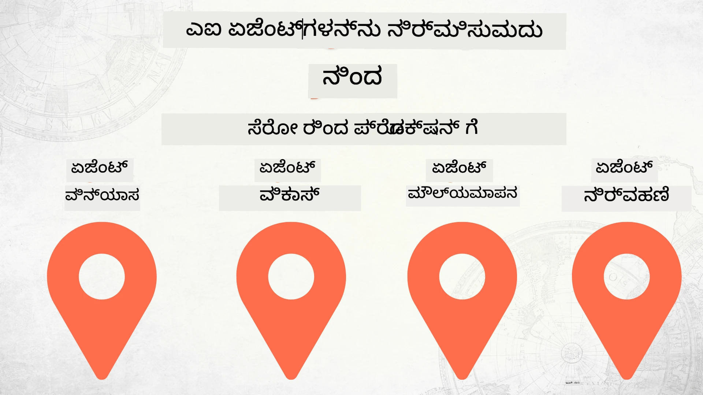

# ಶೂನ್ಯದಿಂದ ಉತ್ಪಾದನೆಗೆ AI ಏಜೆಂಟ್‌ಗಳನ್ನು ನಿರ್ಮಿಸುವುದು



### 🌐 ಬಹುಭಾಷಾ ಬೆಂಬಲ

#### GitHub ಕ್ರಿಯೆಯಿಂದ (ಸ್ವಯಂಚಾಲಿತ ಮತ್ತು ಯಾವಾಗಲೂ ನವೀಕರಿಸಲಾಗಿದೆ) ಬೆಂಬಲಿಸಲಾಗಿದ್ದು

<!-- CO-OP TRANSLATOR LANGUAGES TABLE START -->
[Arabic](../ar/README.md) | [Bengali](../bn/README.md) | [Bulgarian](../bg/README.md) | [Burmese (Myanmar)](../my/README.md) | [Chinese (Simplified)](../zh-CN/README.md) | [Chinese (Traditional, Hong Kong)](../zh-HK/README.md) | [Chinese (Traditional, Macau)](../zh-MO/README.md) | [Chinese (Traditional, Taiwan)](../zh-TW/README.md) | [Croatian](../hr/README.md) | [Czech](../cs/README.md) | [Danish](../da/README.md) | [Dutch](../nl/README.md) | [Estonian](../et/README.md) | [Finnish](../fi/README.md) | [French](../fr/README.md) | [German](../de/README.md) | [Greek](../el/README.md) | [Hebrew](../he/README.md) | [Hindi](../hi/README.md) | [Hungarian](../hu/README.md) | [Indonesian](../id/README.md) | [Italian](../it/README.md) | [Japanese](../ja/README.md) | [Kannada](./README.md) | [Khmer](../km/README.md) | [Korean](../ko/README.md) | [Lithuanian](../lt/README.md) | [Malay](../ms/README.md) | [Malayalam](../ml/README.md) | [Marathi](../mr/README.md) | [Nepali](../ne/README.md) | [Nigerian Pidgin](../pcm/README.md) | [Norwegian](../no/README.md) | [Persian (Farsi)](../fa/README.md) | [Polish](../pl/README.md) | [Portuguese (Brazil)](../pt-BR/README.md) | [Portuguese (Portugal)](../pt-PT/README.md) | [Punjabi (Gurmukhi)](../pa/README.md) | [Romanian](../ro/README.md) | [Russian](../ru/README.md) | [Serbian (Cyrillic)](../sr/README.md) | [Slovak](../sk/README.md) | [Slovenian](../sl/README.md) | [Spanish](../es/README.md) | [Swahili](../sw/README.md) | [Swedish](../sv/README.md) | [Tagalog (Filipino)](../tl/README.md) | [Tamil](../ta/README.md) | [Telugu](../te/README.md) | [Thai](../th/README.md) | [Turkish](../tr/README.md) | [Ukrainian](../uk/README.md) | [Urdu](../ur/README.md) | [Vietnamese](../vi/README.md)

> ** مقامي ಕ್ಲೋನ್ ಮಾಡಲು ಇಚ್ಛಿಸುವಿರಾ?**
>
> ಈ ಸಂಗ್ರಹ 50+ ಭಾಷಾ ಅನುವಾದಗಳನ್ನು ಒಳಗೊಂಡಿರುತ್ತದೆ, ಇದರಿಂದ ಡೌನ್‌ಲೋಡ್ ಗಾತ್ರವು ಗಮನಾರ್ಹವಾಗಿ ಹೆಚ್ಚಾಗುತ್ತದೆ. ಅನುವಾದಗಳಿಲ್ಲದೆ ಕ್ಲೋನ್ ಮಾಡಲು, spars checkout ಬಳಸಿ:
>
> **ಬಾಶ್ / ಮ್ಯಾಕ್‌ಒಎಸ್ / ಲಿನಕ್ಸ್:**
> ```bash
> git clone --filter=blob:none --sparse https://github.com/microsoft/Building-AI-Agents-From-Zero-To-Production.git
> cd Building-AI-Agents-From-Zero-To-Production
> git sparse-checkout set --no-cone '/*' '!translations' '!translated_images'
> ```
>
> **CMD (ವಿಂಡೋಸ್):**
> ```cmd
> git clone --filter=blob:none --sparse https://github.com/microsoft/Building-AI-Agents-From-Zero-To-Production.git
> cd Building-AI-Agents-From-Zero-To-Production
> git sparse-checkout set --no-cone "/*" "!translations" "!translated_images"
> ```
>
> ಇದರಿಂದ ಕೋರ್ಸ್ ಮುಗಿಸಲು ಬೇಕಾದ ಎಲ್ಲವನ್ನೂ ಹೆಚ್ಚು ವೇಗವಾಗಿ ಡೌನ್‌ಲೋಡ್ ಮಾಡಬಹುದು.
<!-- CO-OP TRANSLATOR LANGUAGES TABLE END -->

## AI ಏಜೆಂಟ್ ಅಭಿವೃದ್ಧಿ ಜೀವನಚಕ್ರದ ಮೂಲಭೂತಗಳ ಪಾಠ ನೀಡುವ ಕೋರ್ಸ್

[](https://github.com/microsoft/Building-AI-Agents-From-Zero-To-Production/blob/master/LICENSE?WT.mc_id=academic-105485-koreyst)
[](https://GitHub.com/microsoft/Building-AI-Agents-From-Zero-To-Production/graphs/contributors/?WT.mc_id=academic-105485-koreyst)
[](https://GitHub.com/microsoft/Building-AI-Agents-From-Zero-To-Production/issues/?WT.mc_id=academic-105485-koreyst)
[](https://GitHub.com/microsoft/Building-AI-Agents-From-Zero-To-Production/pulls/?WT.mc_id=academic-105485-koreyst)
[](http://makeapullrequest.com?WT.mc_id=academic-105485-koreyst)

[](https://discord.gg/Kuaw3ktsu6)

## 🌱 ಪ್ರಾರಂಭಿಸುವುದು

ಈ ಕೋರ್ಸ್ AI ಏಜೆಂಟ್‌ಗಳನ್ನು ನಿರ್ಮಿಸುವ ಮತ್ತು ನಿಯೋಜಿಸುವ ಮೂಲಭೂತಗಳನ್ನು ಒಳಗೊಂಡ ಪಾಠಗಳನ್ನು ಹೊಂದಿದೆ.

ಪ್ರತಿ ಪಾಠವು ಮೊದಲು ಯಿದ್ದ ಪಾಠದ ಮೇಲೆ ಕಟ್ಟಿಕೊಂಡಿರುತ್ತದೆ, ಆದದರಿಂದ ನಾವು ಪ್ರಾರಂಭದಿಂದಲೇ ಶುರುಮಾಡಿ ಕೊನೆಯವರೆಗೆ ತಲುಪುವುದನ್ನು ಶಿಫಾರಸು ಮಾಡುತ್ತೇವೆ.

ನೀವು AI ಏಜೆಂಟ್ ವಿಷಯಗಳನ್ನು ಇನ್ನಷ್ಟು ಅನ್ವೇಷಿಸಲು ಬಯಸಿದರೆ, ನೀವು [AI Agents For Beginners Course](https://aka.ms/ai-agents-beginners) ಅನ್ನು ಪರಿಶೀಲಿಸಬಹುದು.

### ಇತರ ಕಲಿಕಾರ್ಹರನ್ನು ಭೇಟಿ ಮಾಡಿ, ನಿಮ್ಮ ಪ್ರಶ್ನೆಗಳಿಗೆ ಉತ್ತರ ಪಡೆಯಿರಿ

ನೀವು ಸಡಿಲವಾಗಿದ್ದರೆ ಅಥವಾ AI ಏಜೆಂಟ್‌ಗಳನ್ನು ನಿರ್ಮಿಸುವ ಬಗ್ಗೆ ಯಾವುದೇ ಪ್ರಶ್ನೆಗಳಿದ್ದರೆ, ದಯವಿಟ್ಟು ನಮ್ಮ ವಿಶಿಷ್ಟ Discord ಚಾನೆಲ್‌ನಲ್ಲಿ ಸೇರಿಕೊಳ್ಳಿ [Microsoft Foundry Discord](https://discord.gg/Kuaw3ktsu6).

### ನಿಮಗೆ ಬೇಕಾಗಿರುವುದು


ಪ್ರತಿ ಪಾಠಕ್ಕೂ ಸ್ಥಳೀಯವಾಗಿ ಚಾಲನೆ ಮಾಡಬಹುದಾದ ತನ್ನದೇ ಆದ ಕೋಡ್ ಉದಾಹರಣೆಗಳಿವೆ. ನೀವು [ಈ ರೆಪೋವನ್ನು ಫೋರ್ಕ್ ಮಾಡಬಹುದು](https://github.com/microsoft/Building-AI-Agents-From-Zero-To-Production/fork) ನಿಮ್ಮ ಸ್ವಂತ ನಕಲು ಸೃಜಿಸಲು.

ಈ ಕೋರ್ಸ್ ಪ್ರಸ್ತುತ ಕೆಳಗಿನವನ್ನು ಬಳಸುತ್ತದೆ:

- [Microsoft ಏಜೆಂಟ್ ಫ್ರೇಮ್‌ವರ್ಕ್ (MAF)](https://aka.ms/ai-agents-beginners/agent-framework)
- [Microsoft Foundry](https://azure.microsoft.com/products/ai-foundry) — **GPT-5 ಸರಣಿಯ** ಮಾದರಿಯೊಂದನ್ನು (ಉದಾಹರಣೆಗೆ `gpt-5.1`) ಯೋಜಿಸಿದ್ದ ಒಂದು ಪ್ರಾಜೆಕ್ಟ್. ನಿವೃತ್ತಗೊಂಡ GPT-4o / GPT-4.1 ಮಾದರಿಗಳನ್ನು ಬಳಸುಬೇಡಿ.
- [ಆಝೂರ್ ಓಪನ್‌ಎಐ ಸೇವೆ](https://azure.microsoft.com/products/ai-foundry/models/openai)
- [ಆಝೂರ್ CLI](https://learn.microsoft.com/cli/azure/authenticate-azure-cli?view=azure-cli-latest) — ಯಾವುದೇ ಉದಾಹರಣೆಯನ್ನು ಚಾಲನೆಮಾಡುವ ಮೊದಲು `az login` ಮೂಲಕ ಸೈನ್ ಇನ್ ಆಗಿ
- **ಪೈಥಾನ್ 3.12 ಅಥವಾ ನಂತರದ ಆವೃತ್ತಿ**

ಪ್ರಾರಂಭಿಸುವ ಮೊದಲು ನೀವು ಈ ಸೇವೆಗಳಿಗೆ ಪ್ರವೇಶ ಹೊಂದಿರುವುದನ್ನು ಖಚಿತಪಡಿಸಿಕೊಳ್ಳಿ.

> **💰 ವೆಚ್ಚ ಮತ್ತು ಸ್ವಚ್ಚಪಡಿಸುವಿಕೆ.** ಹ್ಯಾಂಡ್ಸ್-ಆನ್ ಪಾಠಗಳು ನಿಜವಾದ ಆಝೂರಿನ ಸಂಪನ್ಮೂಲಗಳನ್ನು ಸೃಷ್ಟಿಸುತ್ತವೆ — Microsoft Foundry
> ಪ್ರಾಜೆಕ್ಟ್, ಮಾದರಿ ನಿಯೋಜನೆ, ವೆಕ್ಟರ್ ಸ್ಟೋರ್, ಮತ್ತು (ಪಾಠಗಳು 4–6 ರಲ್ಲಿ) ಹೋಸ್ಟ್ ಮಾಡಿದ ಏಜೆಂಟ್‌ಗಳು ಮತ್ತು ಉಪಕರಣಪೆಟ್ಟಿಗೆಗಳು.
> ಅವುಗಳೂ ಇರುತ್ತಿರುವ ಸಮಯದಲ್ಲಿ ವೆಚ್ಚ ಆಗಬಹುದು. ನೀವು ಪಾಠವನ್ನು — ಅಥವಾ ಕೋರ್ಸ್ ಅನ್ನು — ಮುಗಿಸಿದಾಗ
> ನೀವು ಅಗತ್ಯವಿಲ್ಲದ ಸಂಪನ್ಮೂಲಗಳನ್ನು ಅಳಿಸಿ. ಸಹಜ ವಿಧಾನವೆಂದರೆ ಎಲ್ಲವನ್ನೂ ಒಂದು ನಿಗದಿತ ಸಂಪನ್ಮೂಲ
> ಗುಂಪಿನಲ್ಲಿ ಇಟ್ಟು, ನೀವು ಮುಗಿಸಿದಾಗ ಆ ಸಂಪೂರ್ಣ ಗುಂಪನ್ನು ಅಳಿಸುವದು:
>
> ```bash
> az group delete --name <your-resource-group> --yes --no-wait
> ```
>
> ನೀವು Foundry ಪೋರ್ಟಲ್‌ನಿಂದ ವೈಯಕ್ತಿಕ ಏಜೆಂಟ್‌ಗಳು, ವೆಕ್ಟರ್ ಸ್ಟೋರ್‌ಗಳು ಮತ್ತು ಉಪಕರಣಪೆಟ್ಟಿಗೆಗಳನ್ನು ಕೂಡ ಅಳಿಸಬಹುದು.

> **ಮಾದರಿಗಳ ಕುರಿತಾಗಿ ಟಿಪ್ಪಣಿ.** ಈ ಕೋರ್ಸ್ ಎಲ್ಲಾ ಮಾದರಿಗಳನ್ನು **Microsoft Foundry** ಮೂಲಕ ಒದಗಿಸುತ್ತದೆ. ಇದು **GitHub ಮಾದರಿಗಳನ್ನು** ಬಳಸದಿರು
> *ಇವುಗಳನ್ನು 30 ಜುಲೈ, 2026 ರಂದು ನಿವೃತ್ತಗೊಳಿಸಲಾಗುವುದು* — Microsoft Foundry ಅಧಿಕೃತ ಹಜಾರಾತಿ ಮಾರ್ಗವಾಗಿದೆ.
> ನೀವು ಹಳೆಯ ಕೋಡ್‌ನಲ್ಲಿ GitHub ಮಾದರಿಗಳನ್ನು ಕರೆಸದಿದ್ದರೆ, ಅದನ್ನು Foundry
> ಮಾದರಿ ನಿಯೋಜನೆ ಕಡೆಗೆ ಸೂಚಿಸಿ.

ಮಾದರಿ ಹೋಸ್ಟಿಂಗ್ ಮತ್ತು ಸೇವೆಗಳ ಸುತ್ತಲೂ ಮತ್ತಷ್ಟು ಆಯ್ಕೆಗಳು ಶೀಘ್ರದಲ್ಲೇ ಬರುತ್ತಿವೆ.

## 🗃️ ಪಾಠಗಳು

| **ಪಾಠ**         | **ವಿವರಣೆ**                                                                                  |
|--------------------|--------------------------------------------------------------------------------------------------|
| [ಏಜೆಂಟ್ ವಿನ್ಯಾಸ](./lesson-1-agent-design/README.md)       | ನಮ್ಮ "ವಿಕಸಕನು ಸೇರಿಸುವಿಕೆ" ಏಜೆಂಟ್ ಉಪಯೋಗದ ಪರಿಚಯ ಮತ್ತು ಪರಿಣಾಮಕಾರಿ ಏಜೆಂಟ್‌ಗಳನ್ನು ವಿನ್ಯಾಸ ಮಾಡುವ ಕ್ರಮ  |
| [ಏಜೆಂಟ್ ಅಭಿವೃದ್ಧಿ](./lesson-2-agent-development/README.md)  | Microsoft ಏಜೆಂಟ್ ಫ್ರೇಮ್‌ವರ್ಕ್ (MAF) ಬಳಸಿ, ಹೊಸ ವಿಕಸಕರಿಗೆ ಸಹಾಯ ಮಾಡುವ ವಿಶೇಷ ಏಜೆಂಟ್‌ಗಳ ಸೆಟ್ ನಿರ್ಮಾಣ.       |
| [ಏಜೆಂಟ್ ಮೌಲ್ಯಮಾಪನ](./lesson-3-agent-evals/README.md)  | Microsoft Foundry ಬಳಸಿ, ನಮ್ಮ AI ಏಜೆಂಟ್‌ಗಳು ಎಷ್ಟು ಉತ್ತಮವಾಗಿ ಕಾರ್ಯನಿರ್ವಹಿಸುತ್ತಿವೆ ಮತ್ತು ಸುಧಾರಿಸುವ ಮಾರ್ಗಗಳ ವಿವರ. |
| [ಏಜೆಂಟ್ ನಿಯೋಜನೆ](./lesson-4-agentdeployment/README.md)   | Microsoft Foundry ಹೋಸ್ಟ್ ಮಾಡಿದ ಏಜೆಂಟ್‌ಗಳು ಮತ್ತು OpenAI ChatKit ಬಳಸಿ, AI ಏಜೆಂಟ್ ಅನ್ನು ಉತ್ಪಾದನೆಯಲ್ಲಿ ನಿಯೋಜಿಸುವ ವಿಧಾನ.       |
| [ಉತ್ಪಾದನಾ ಹೋಸ್ಟ್ ಏಜೆಂಟ್‌ಗಳು](./lesson-5-hosted-agents-production/README.md)   | ಹೋಸ್ಟ್ ಮಾಡಿದ ಏಜೆಂಟ್ ಅನ್ನು ಉದ್ಯಮಿಕ ಉತ್ಪಾದನೆಗೆ ಕರೆತರುವುದು: ಹೋಸ್ಟ್ ಮಾಡಿದ ಏಜೆಂಟ್ ಹಾಗೂ ಸಾಮರ್ಥ್ಯ ಹೋಸ್ಟ್‌ಗಳು, ನಿಮ್ಮ ಸ್ವಂತ ಸಂಗ್ರಹಣ, ಮೆಮೊರಿ ಮತ್ತು ಆಡಳಿತ.       |
| [Microsoft ಉಪಕರಣ ಪೆಟ್ಟಿಗೆ](./lesson-6-toolbox/README.md)   | ಉಪಕರಣಗಳನ್ನು ಒಂದೇ ಬಾರಿಗೆ ವ್ಯಾಖ್ಯಾನಿಸಿ ಮತ್ತು ಮಧ್ಯಸ್ಥಿತಿಯನ್ನು ನಿರ್ವಹಿಸಿ: toolbox ನಿರ್ಮಿಸಿ, ಅದನ್ನು ಏಜೆಂಟ್ ಮೂಲಕ ಒಂದೇ MCP ಎಂಡ್‌ಪಾಯಿಂಟ್ ಮೂಲಕ ಉಪಯೋಗಿಸಿ ಮತ್ತು ಉಪಕರಣಗಳ ಆವೃತ್ತಿಯನ್ನು ಸುರಕ್ಷಿತವಾಗಿ ನಿರ್ವಹಿಸಿ.       |
| [ಬಹು-ಏಜೆಂಟ್ & A2A](./lesson-7-multi-agent-a2a/README.md)   | ಏಜೆಂಟ್‌ಗಳನ್ನು ಜಾಲತಾಣ ಸೇವೆಗಳಾಗಿ ರಚಿಸಿ: ಏಜೆಂಟ್-ಟು-ಏಜೆಂಟ್ (A2A) ಪ್ರೋಟೋಕಾಲ್ ಮೂಲಕ ಏಜೆಂಟ್ ಅನ್ನು ಬಹಿರಂಗಗೊಳಿಸಿ ಮತ್ತು ದೂರದ ಏಜೆಂಟ್ ಅನ್ನು ಪೀಯರ್ ಆಗಿ ಉಪಯೋಗಿಸಿ.       |


## 🎒 ಇತರ ಕೋರ್ಸ್‌ಗಳು

ನಮ್ಮ ತಂಡ ಇತರ ಕೋರ್ಸ್‌ಗಳನ್ನು ಉತ್ಪಾದಿಸುತ್ತದೆ! ತೋಚಿಕೊಳ್ಳಿ:

<!-- CO-OP TRANSLATOR OTHER COURSES START -->
### ಲ್ಯಾಂಗ್‌ಚೈನ್
[](https://aka.ms/langchain4j-for-beginners)
[](https://aka.ms/langchainjs-for-beginners?WT.mc_id=m365-94501-dwahlin)
[](https://github.com/microsoft/langchain-for-beginners?WT.mc_id=m365-94501-dwahlin)
---

### ಆಝೂರ್ / ಎಡ್ಜ್ / MCP / ಏಜೆಂಟ್‌ಗಳು
[](https://github.com/microsoft/AZD-for-beginners?WT.mc_id=academic-105485-koreyst)
[](https://github.com/microsoft/edgeai-for-beginners?WT.mc_id=academic-105485-koreyst)
[](https://github.com/microsoft/mcp-for-beginners?WT.mc_id=academic-105485-koreyst)
[](https://github.com/microsoft/ai-agents-for-beginners?WT.mc_id=academic-105485-koreyst)

---
 
### ಜನರೇಟಿವ್ AI ಸರಣಿ

[](https://github.com/microsoft/generative-ai-for-beginners?WT.mc_id=academic-105485-koreyst)
[-9333EA?style=for-the-badge&labelColor=E5E7EB&color=9333EA)](https://github.com/microsoft/Generative-AI-for-beginners-dotnet?WT.mc_id=academic-105485-koreyst)
[-C084FC?style=for-the-badge&labelColor=E5E7EB&color=C084FC)](https://github.com/microsoft/generative-ai-for-beginners-java?WT.mc_id=academic-105485-koreyst)
[-E879F9?style=for-the-badge&labelColor=E5E7EB&color=E879F9)](https://github.com/microsoft/generative-ai-with-javascript?WT.mc_id=academic-105485-koreyst)

---
 
### ಮುಖ್ಯ ಅಧ್ಯಯನ
[](https://aka.ms/ml-beginners?WT.mc_id=academic-105485-koreyst)
[](https://aka.ms/datascience-beginners?WT.mc_id=academic-105485-koreyst)
[](https://aka.ms/ai-beginners?WT.mc_id=academic-105485-koreyst)
[](https://github.com/microsoft/Security-101?WT.mc_id=academic-96948-sayoung)
[](https://aka.ms/webdev-beginners?WT.mc_id=academic-105485-koreyst)
[](https://aka.ms/iot-beginners?WT.mc_id=academic-105485-koreyst)
[](https://github.com/microsoft/xr-development-for-beginners?WT.mc_id=academic-105485-koreyst)

---
 
### ಕೋಪೈಲೆಟ್ ಸರಣಿಗಳು
[](https://aka.ms/GitHubCopilotAI?WT.mc_id=academic-105485-koreyst)
[](https://github.com/microsoft/mastering-github-copilot-for-dotnet-csharp-developers?WT.mc_id=academic-105485-koreyst)
[](https://github.com/microsoft/CopilotAdventures?WT.mc_id=academic-105485-koreyst)
<!-- CO-OP TRANSLATOR OTHER COURSES END -->

## ಕೊಡುಗೆ ನೀಡುವಿಕೆ

ಈ ಯೋಜನೆ ಕೊಡುಗೆಗಳು ಮತ್ತು ಸಲಹೆಗಳನ್ನು ಸ್ವಾಗತಿಸುತ್ತದೆ. ಹೆಚ್ಚಿನ ಕೊಡುಗೆಗಳಿಗೆ ನೀವು ಒಪ್ಪಬೇಕಾಗುತ್ತದೆ
ಒಂದು ಕೊಡುಗೆದಾರ ಪರವಾನಗಿ ಒಪ್ಪಂದಕ್ಕೆ (CLA) ನೀವು ಹೊಂದಿರುವ ಹಕ್ಕುಗಳನ್ನು ಮತ್ತು ವಾಸ್ತವವಾಗಿ ಕೊಡುಗೆ ನೀಡುವ ಹಕ್ಕುಗಳನ್ನು ನಮಗೆ ನೀಡುತ್ತೀರಿ ಎಂದು ಘೋಷಿಸುವುದು. ವಿವರಗಳಿಗೆ, ಭೇಟಿ ನೀಡಿ <https://cla.opensource.microsoft.com>.


ನೀವು ಪುಲ್ ವಿನಂತಿಯನ್ನು ಸಲ್ಲಿಸಿದಾಗ, CLA ಬಾಟ್ ನಿಮ್ಮಿಗೆ CLA ನೀಡಬೇಕೆಂಬುದನ್ನು ಸ್ವಯಂಚಾಲಿತವಾಗಿ ನಿರ್ಧರಿಸುತ್ತದೆ ಮತ್ತು PR ಅನ್ನು ಸೂಕ್ತವಾಗಿ ಅಲಂಕರಿಸುತ್ತದೆ (ಉದಾಹರಣೆಗೆ, ಸ್ಥಿತಿ ಪರಿಶೀಲನೆ, ಕಾಮೆಂಟ್). ಬಾಟ್ ನೀಡುವ ಸೂಚನೆಗಳನ್ನು ಅನುಸರಿಸಿ. ನಮ್ಮ CLA ಅನ್ನು ಬಳಸಿ ಎಲ್ಲಾ ರೆಪೊಗಳಲ್ಲಿ ಈ ಪ್ರಕ್ರಿಯೆಯನ್ನು ನೀವು ಒಮ್ಮೆ ಮಾತ್ರ ಮಾಡಬೇಕಾಗುತ್ತದೆ.


ಈ ಯೋಜನೆ [Microsoft Open Source Code of Conduct](https://opensource.microsoft.com/codeofconduct/) ಅನ್ನು ಅಂಗೀಕರಿಸಿರುವುದು.
ಹೆಚ್ಚಿನ ಮಾಹಿತಿಗಾಗಿ [ನಡತ ಸಂಹಿತೆ ಪ್ರಶ್ನೋತ್ತರ](https://opensource.microsoft.com/codeofconduct/faq/) ಅನ್ನು ನೋಡಿ ಅಥವಾ
ಯಾವುದೇ ಹೆಚ್ಚುವರಿ ಪ್ರಶ್ನೆಗಳು ಅಥವಾ ಪ್ರತಿಕ್ರಿಯೆಗಾಗಿ [opencode@microsoft.com](mailto:opencode@microsoft.com) ಅನ್ನು ಸಂಪರ್ಕಿಸಿ.

## ಟ್ರೇಡ್‌ಮಾರ್ಕ್‌ಗಳ

ಈ ಯೋಜನೆಯು ಪ್ರಾಜೆಕ್ಟ್‌ಗಳು, ಉತ್ಪನ್ನಗಳು, ಅಥವಾ ಸೇವೆಗಳ ಟ್ರೇಡ್ಮಾರ್ಕ್‌ಗಳು ಅಥವಾ ಲೋಗೋಗಳನ್ನು ಹೊಂದಿರಬಹುದು.Microsoft ಟ್ರೇಡ್ಮಾರ್ಕ್‌ಗಳು ಅಥವಾ ಲೋಗೋಗಳನ್ನು ಅನುಮತಿಪತ್ರಿತವಾಗಿ ಬಳಸುವುದು ಮತ್ತು ಹೀಗಾಗಿ ಪ್ರಸೂತಿಯಾಗುತ್ತದೆ ಮತ್ತು ಅನುಸರಿಸಬೇಕು
[Microsoft's Trademark & Brand Guidelines](https://www.microsoft.com/legal/intellectualproperty/trademarks/usage/general).
ಪರಿಷ್ಕೃತ ಆವೃತ್ತಿಗಳಲ್ಲಿ Microsoft ಟ್ರೇಡ್ಮಾರ್ಕ್‌ಗಳು ಅಥವಾ ಲೋಗೋಗಳನ್ನು ಬಳಸುವುದು ಗೊಂದಲಕ್ಕೆ ಕಾರಣವಾಗಬಾರದು ಅಥವಾ Microsoft ಪ್ರಾಯೋಜನೆಯನ್ನು ಸೂಚಿಸಬಾರದು.
ಯಾವುದೇ ಮೂರನೇ ಪಕ್ಷದ ಟ್ರೇಡ್ಮಾರ್ಕ್‌ಗಳು ಅಥವಾ ಲೋಗೋಗಳ ಬಳಕೆ ಅವುಗಳಿಗೆ ಸಂಬಂಧಪಟ್ಟ ಮೂರನೇ ಪಕ್ಷದ ನೀತಿಗಳ ಅಗತ್ಯವಿದೆ.


## ಸಹಾಯ ಪಡೆಯುವುದು

ನೀವು ಅಡ್ಡಿಯಾಗಿದ್ದೀರಾ ಅಥವಾ AI ಆ್ಯಪ್ಗಳ ನಿರ್ಮಾಣದ बारेಲ್ಲ ಯಾವುದೇ ಪ್ರಶ್ನೆಗಳಿದೆಯೇ, ಸೇರಿ:

[](https://discord.gg/Kuaw3ktsu6)

ನಿರ್ಮಾಣ ಸಂದರ್ಭದಲ್ಲಿ ನಿಮ್ಮ ಉತ್ಪನ್ನ ಪ್ರತಿಕ್ರಿಯೆಗಳು ಅಥವಾ ದೋಷಗಳಿದ್ದರೆ ಭೇಟಿ ನೀಡಿ:

[](https://aka.ms/foundry/forum)

---

<!-- CO-OP TRANSLATOR DISCLAIMER START -->
**ಅಸ್ವೀಕಾರ**:
ಈ ದಸ್ತಾವೇಜು AI ಅನುವಾದ ಸೇವೆ [Co-op Translator](https://github.com/Azure/co-op-translator) ಬಳಸಿ ಅನುವಾದಿಸಲಾಗಿದೆ. ನಾವು ನಿಖರತೆಯನ್ನು ಸಾಧಿಸಲು ಪ್ರಯತ್ನಿಸುತ್ತಿದ್ದರೂ, ದಯವಿಟ್ಟು ಗಮನಿಸಿ, ಸ್ವಯಂಚಾಲಿತ ಅನುವಾದಗಳಲ್ಲಿ ದೋಷಗಳು ಅಥವಾ ಅಸಡ್ಡೆಗಳು ಇರಬಹುದು. ಮೂಲ ಭಾಷೆಯಲ್ಲಿರುವ ಮೂಲ ದಸ್ತಾವೇಜು ಪ್ರಾಮಾಣಿಕ ಮೂಲವೆಂದು ಪರಿಗಣಿಸಬೇಕು. ಪ್ರಮುಖ ಮಾಹಿತಿಗಾಗಿ, ವೃತ್ತಿಪರ ಮಾನವ ಅನುವಾದವನ್ನು ಶಿಫಾರಸು ಮಾಡಲಾಗುತ್ತದೆ. ಈ ಅನುವಾದವನ್ನು ಬಳಸುವ ಮೂಲಕ ಉಂಟಾಗುವ ಯಾವುದೇ ತಪ್ಪು ಅರ್ಥಗಳ ಅಥವಾ ತಪ್ಪು ವ್ಯಾಖ್ಯಾನಗಳ ಬಗ್ಗೆ ನಾವು ಹೊಣೆಗಾರರಲ್ಲ.
<!-- CO-OP TRANSLATOR DISCLAIMER END -->