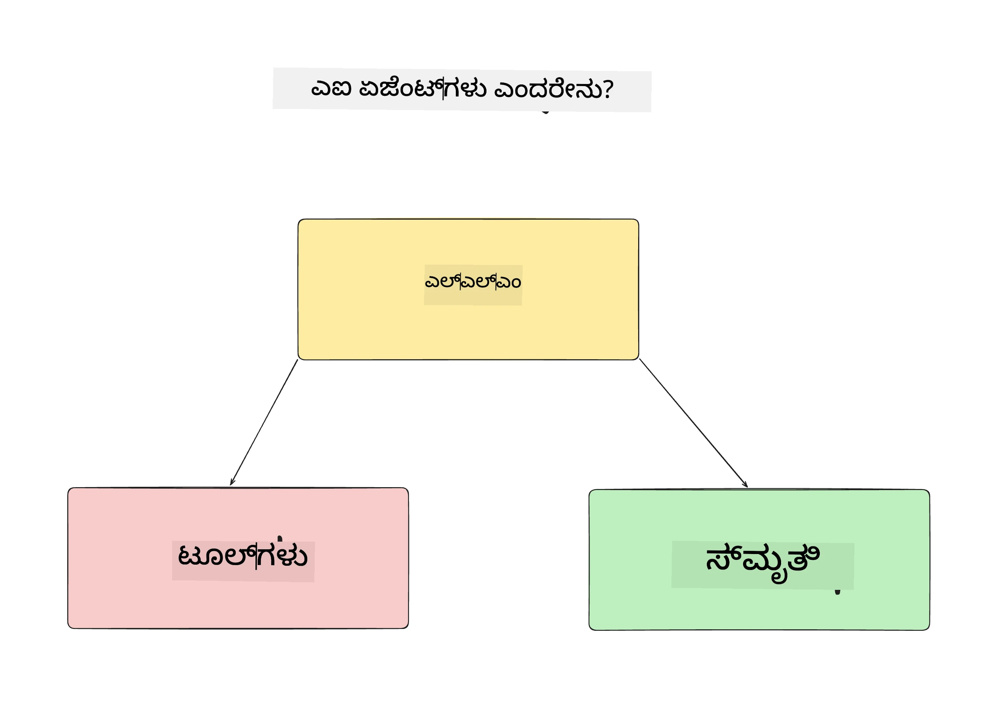
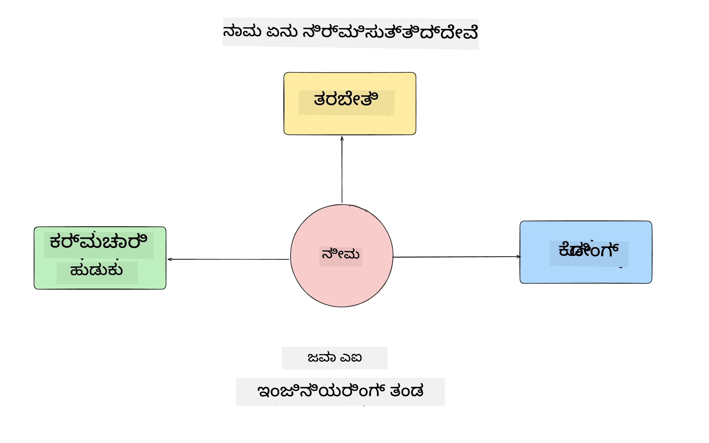
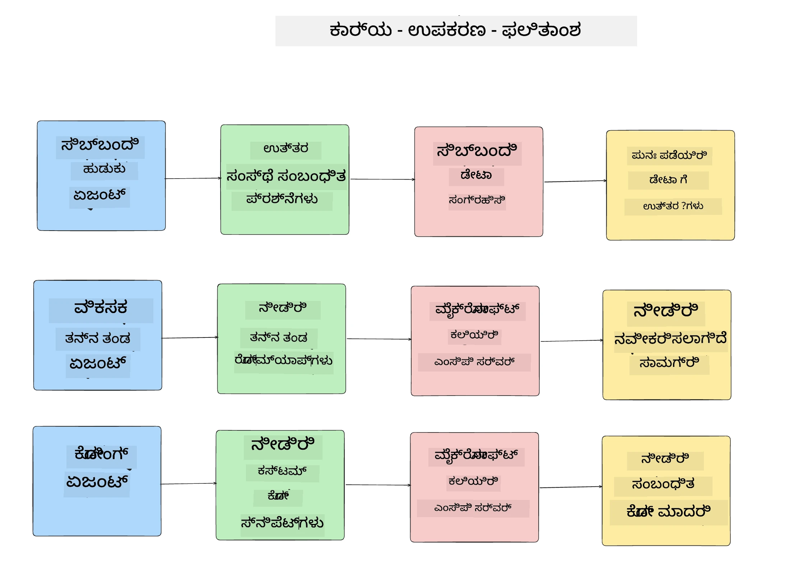
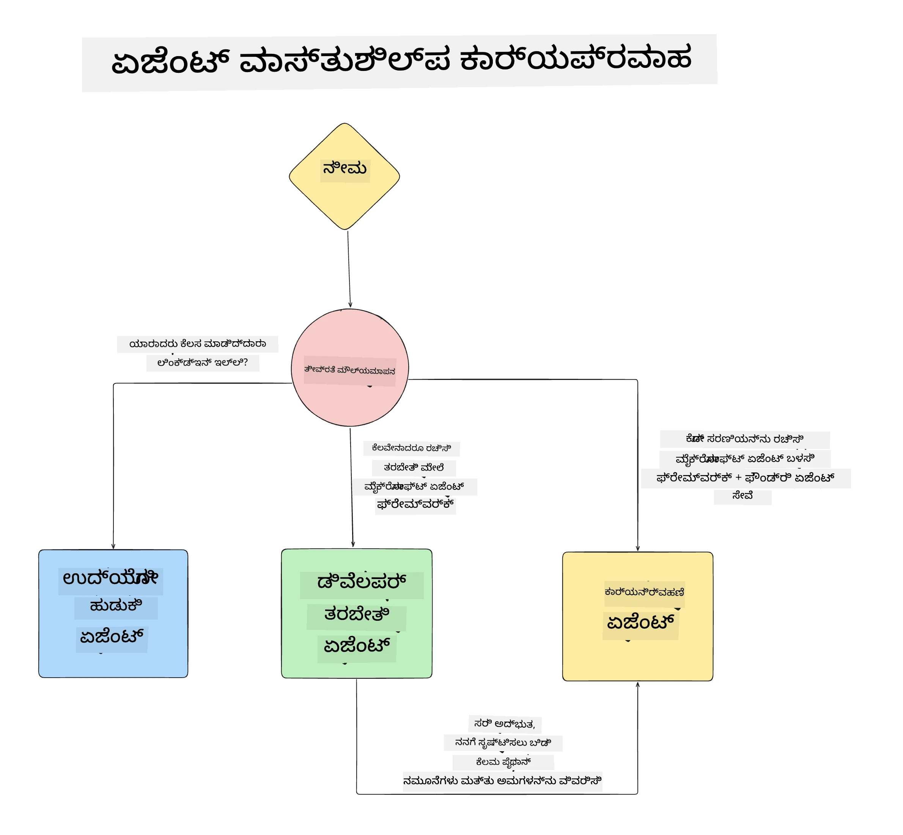

# ಪಾಠ 1: AI ಏಜೆಂಟ್ ವಿನ್ಯಾಸ

"ಶೂನ್ಯದಿಂದ ಉತ್ಪಾದನೆಗೆ AI ಏಜೆಂಟ್ ನಿರ್ಮಾಣ" ಕೋರ್ಸ್‌ನ ಮೊದಲ ಪಾಠಕ್ಕೆ ಸ್ವಾಗತ!

ಈ ಪಾಠದಲ್ಲಿ ನಾವು ಚರ್ಚಿಸುವುದು:

- AI ಏಜೆಂಟ್‌ಗಳು 무엇ೆಂದು ವ್ಯಾಖ್ಯಾನಿಸುವುದು
  
- ನಾವು ನಿರ್ಮಿಸುತ್ತಿರುವ AI ಏಜೆಂಟ್ ಅಪ್ಲಿಕೇಶನ್ ಕುರಿತು ಚರ್ಚೆ  

- ಪ್ರತಿ ಏಜೆಂಟ್‌ಗೆ ಅಗತ್ಯವಿರುವ ಉಪಕರಣಗಳು ಮತ್ತು ಸೇವೆಗಳ ಗುರುತಿಸುವುದು
  
- ನಮ್ಮ ಏಜೆಂಟ್ ಅಪ್ಲಿಕೇಶನ್ ವಿನ್ಯಾಸ ರೂಪಿಸುವುದು
  
ಏಜೆಂಟ್ ಎಂಬದು 무엇ೆ ಮತ್ತು ನಾವು ಅದನ್ನು ಅಪ್ಲಿಕೇಶನ್‌ನಲ್ಲಿ ಯಾಕೆ ಬಳಸಬೇಕು ಎಂಬುದನ್ನು ವ್ಯಾಖ್ಯಾನಿಸುವುದರಿಂದ ಪ್ರಾರಂಭಿಸೋಣ.

> **ನೀವು ಕೋರ್ಸ್ ಆರಂಭಿಸುವ ಮೊದಲು.** ಈ ಮೊದಲ ಪಾಠವು ತತ್ತ್ವಾತ್ಮಕವಾಗಿದೆ — ಯಾವುದೇ ಕೋಡ್ ರನ್ ಮಾಡಬೇಕಾಗಿಲ್ಲ.
> [ಪಾಠ 2](../lesson-2-agent-development/README.md) ನಿಂದ ಆರಂಭಿಸಿ ನೀವು ಬೇಕಾಗಿರುವುದು: **Azure
> ಸಬ್‌ಸ್ಕ್ರಿಪ್‌ಷನ್** ಮತ್ತು **Microsoft Foundry** ಗೆ ಪ್ರವೇಶ, ನಿಯೋಜಿತ **GPT-5 ಸರಣಿ ಮಾದರಿ** (ಉದಾಹರಣೆಗಾಗಿ `gpt-5.1` — ನಿವೃತ್ತಗೊಂಡ GPT-4o / GPT-4.1 ಅನ್ನು ತಪ್ಪಿಸಿ), **Python 3.12+**, ಹಾಗೂ **Azure CLI**
> (`az login`). ಪೂರ್ಣ ಪಟ್ಟಿ ಮತ್ತು ಲಿಂಕ್‍ಗಳಿಗಾಗಿ ಕೋರ್ಸ್ README中的 [ನಿಮಗೆ ಬೇಕಾಗಿರುವುದು](../README.md#what-you-need) ಅನ್ನು ನೋಡಿ.

## AI ಏಜೆಂಟ್‌ಗಳು ಎಂದರೆ 무엇ೆ?

ನೀವು ಮೊದಲಬಾರಿಗೆ AI ಏಜೆಂಟ್ ಹೇಗೆ ನಿರ್ಮಿಸಲು ಎಂದು ಅನ್ವೇಷಿಸುತ್ತಿದ್ದರೆ, ಏಜೆಂಟ್ ಅನ್ನು ನಿಖರವಾಗಿ ಹೇಗೆ ವ್ಯಾಖ್ಯಾನಿಸುವುದು ಎಂಬ ಪ್ರಶ್ನೆಗಳು ಇರಬಹುದು.

AI ಏಜೆಂಟ್ ಅನ್ನು ರಚಿಸುವ ಘಟಕಗಳ ಮೂಲಕ ಸರಳವಾಗಿ ವ್ಯಾಖ್ಯಾನಿಸುವುದು:

**ದೊಡ್ಡ ಭಾಷಾ ಮಾದರಿ (LLM)** - LLM ಬಳಕೆದಾರರಿಂದ ಸ್ವಾಭಾವಿಕ ಭಾಷೆಯನ್ನು ಪ್ರಕ್ರಿಯೆಮಾಡಿ ಅವರು ಮುಗಿಸಲು ಬಯಸುವ ಕಾರ್ಯಗಳನ್ನು ಅರ್ಥಮಾಡಿಕೊಳ್ಳಲಿದೆ, ಹಾಗೂ ಕಾರ್ಯಗಳನ್ನು ನಿಭಾಯಿಸಲು ಲಭ್ಯವಿರುವ ಉಪಕರಣಗಳ ವಿವರಣೆಗಳನ್ನು ಅರ್ಥಮಾಡಿಕೊಳ್ಳಲಿದೆ.

**ಉಪಕರಣಗಳು** - ಕಾರ್ಯಗಳನ್ನು ಪೂರ್ಣಗೊಳಿಸಲು LLM ಬಳಸಬಹುದಾದ ಕ್ರಿಯೆಗಳು, APIs, ಡೇಟಾ ಸಂಗ್ರಹಗಳು ಮತ್ತು ಇತರೆ ಸೇವೆಗಳು.

**ಜ್ಞಾನಸ್ಮೃತಿ** - AI ಏಜೆಂಟ್ ಮತ್ತು ಬಳಕೆದಾರರ ನಡುವೆ ತಾತ್ಕಾಲಿಕ ಮತ್ತು ದೀರ್ಘಕಾಲಿಕ ಸಂವಹನಗಳನ್ನು ಇಲ್ಲಿ ಸಂಗ್ರಹಿಸುತ್ತೇವೆ. ಮಾಹಿತಿ ಸಂಗ್ರಹಣೆ ಮತ್ತು ಹಿಂಪಡೆಯುವಿಕೆ ಸುಧಾರಣೆಗಳಿಗೆ ಹಾಗೂ ಬಳಕೆದಾರರ ಪ್ರಾಧಾನದಗಳನ್ನು ಉಳಿಸಲು ಮುಖ್ಯವಾಗಿದೆ.

## ನಮ್ಮ AI ಏಜೆಂಟ್ ಬಳಕೆ ಪ್ರಕರಣ

ಈ ಕೋರ್ಸ್‌ಗೆ, ನಾವು ಹೊಸ ಅಭಿವೃದ್ಧಿಗಾರರು ನಮ್ಮ AI ಏಜೆಂಟ್ ಅಭಿವೃದ್ಧಿ ತಂಡಕ್ಕೆ ಸೇರುವುದಕ್ಕೆ ಸಹಾಯ ಮಾಡುವ AI ಏಜೆಂಟ್ ಅಪ್ಲಿಕೇಶನ್ ನಿರ್ಮಿಸಲಿದ್ದೇವೆ!

ಯಾವುದೇ ಅಭಿವೃದ್ಧಿ ಕೆಲಸ ಮಾಡುವ ಮೊದಲು, ಯಶಸ್ವಿ AI ಏಜೆಂಟ್ ಅಪ್ಲಿಕೇಶನ್ ಸೃಷ್ಟಿಸುವ ಪ್ರಥಮ ಹೆಜ್ಜೆ ನಮ್ಮ ಬಳಕೆದಾರರು ನಮ್ಮ AI ಏಜೆಂಟ್‌ಗಳೊಂದಿಗೆ ಹೇಗೆ ಕೆಲಸ ಮಾಡುತ್ತಾರೆ ಎಂಬ ಸ್ಪಷ್ಟ ದೃಶ್ಯಗಳನ್ನು ನಿರ್ದಿಷ್ಟಪಡಿಸುವುದು.

ಈ ಅಪ್ಲಿಕೇಶನ್‌ನಿಗಾಗಿ, ನಾವು ಈ ದೃಶ್ಯಗಳೊಂದಿಗೆ ಕೆಲಸ ಮಾಡುತ್ತೇವೆ:

**ದೃಶ್ಯ 1**: ಹೊಸ ನೌಕರರು ನಮ್ಮ ಸಂಸ್ಥೆಗೆ ಸೇರಿ ಅವರನ್ನು ಸೇರ್ಪಡೆಯಾಗಿ ಸೇರಿದ ತಂಡದ ಬಗ್ಗೆ ಮತ್ತು ಅವರೊಂದಿಗೆ ಸಂಪರ್ಕ ಸಾಧಿಸುವ ರೀತಿಯ ಬಗ್ಗೆ ತಿಳಿಯಲು ಬಯಸುತ್ತಾರೆ.

**ದೃಶ್ಯ 2:** ಹೊಸ ನೌಕರರು ಅವರಿಗೆ ಪ್ರಾರಂಭಿಸಲು ಉತ್ತಮ ಮೊದಲ ಕರ್ಯ ಯಾವದು ಎಂದು ತಿಳಿಯಲು ಬಯಸುತ್ತಾರೆ.

**ದೃಶ್ಯ 3:** ಹೊಸ ನೌಕರರು ಈ ಕರ್ಯವನ್ನು ಪೂರ್ಣಗೊಳಿಸಲು ಸಹಾಯವಾಗುವ ಅಧ್ಯಯನ ಸಂಪನ್ಮೂಲಗಳು ಮತ್ತು ಕೋಡ್ ಉದಾಹರಣೆಗಳನ್ನು ಸಂಗ್ರಹಿಸಲು ಬಯಸುತ್ತಾರೆ.

## ಉಪಕರಣಗಳು ಮತ್ತು ಸೇವೆಗಳ ಗುರುತಿಸುವಿಕೆ

ಈಗ ನಾವು ಈ ದೃಶ್ಯಗಳನ್ನು ರಚಿಸಿದ್ದೇವೆ, ಮುಂದಿನ ಹೆಜ್ಜೆಯು ಅವುಗಳನ್ನು AI ಏಜೆಂಟ್‌ಗಳಿಗೆ ಅಗತ್ಯವಿರುವ ಉಪಕರಣಗಳು ಮತ್ತು ಸೇವೆಗಳೊಂದಿಗೆ ನಕ್ಷೆಗೊಳಿಸುವುದು.

ಈ ಪ್ರಕ್ರಿಯೆ ಅನ್ನು ಸಂಧರ್ಭ अभियಂತಿಕೆ ಎಂದು ಕರೆಯಲಾಗುತ್ತದೆ, ಏಕೆಂದರೆ ನಾವು AI ಏಜೆಂಟ್‌ಗಳಿಗೆ ಸರಿಯಾದ ಸಮಯದಲ್ಲಿ ಸರಿಯಾದ ಸಂಧರ್ಭವನ್ನು ಹೊಂದಿಸುವಂತೆ ಗಮನವಿರಿಸುತ್ತಿದ್ದೇವೆ.

ಈ ದೃಶ್ಯಗಳನ್ನು ಪ್ರತಿ ದೃಶ್ಯದಿಂದ ಕೈಗೊಂಡು ಪ್ರತಿ ಏಜೆಂಟ್‌ನ ಕಾರ್ಯ, ಉಪಕರಣಗಳು ಮತ್ತು ನಿರೀಕ್ಷಿತ ಫಲಿತಾಂಶಗಳನ್ನು ಪಟ್ಟಿ ಮಾಡುವಂತೆಯೇ ಉತ್ತಮ ಏಜೆಂಟಿಕ್ ವಿನ್ಯಾಸ ಮಾಡೋಣ.

### ದೃಶ್ಯ 1 - ನೌಕರರ ಹುಡುಕಾಟ ಏಜೆಂಟ್

**ಕಾರ್ಯ** - ಸಂಸ್ಥೆಯ ನೌಕರರ ಬಗ್ಗೆ, ಉದಾ: ಸೇರ್ಪಡೆ ದಿನಾಂಕ, ಪ್ರಸ್ತುತ ತಂಡ, ಸ್ಥಳ ಮತ್ತು ಕೊನೆ ಹುದ್ದೆ ಕುರಿತು ಪ್ರಶ್ನೆಗಳಿಗೆ ಉತ್ತರಿಸುವುದು.

**ಉಪಕರಣಗಳು** - ಪ್ರಸ್ತುತ ನೌಕರರ ಪಟ್ಟಿ ಮತ್ತು ಸಂಸ್ಥೆಯ ದೃಷ್ಟಿಚಾರ್ಟ್ ಡೇಟಾಸ್ಟೋರ್

**ಫಲಿತಾಂಶಗಳು** - ಸಾಮಾನ್ಯ ಸಂಸ್ಥೆಯ ಪ್ರಶ್ನೆಗಳು ಮತ್ತು ನೌಕರರ ಬಗ್ಗೆ ವಿಶೇಷ ಪ್ರಶ್ನೆಗಳಿಗೆ ಉತ್ತರಿಸಲು ಡೇಟಾಸ್ಟೋರ್‌ನಿಂದ ಮಾಹಿತಿ ಹಿಂಪಡೆಯಲು ಸಾಧ್ಯವಾಗುವುದು.

### ದೃಶ್ಯ 2 - ಕರ್ಯದ ಶಿಫಾರಸು ಏಜೆಂಟ್

**ಕಾರ್ಯ** - ಹೊಸ ನೌಕರರ ಅಭಿವೃದ್ಧಿ ಅನುಭವ ಆಧಾರವಾಗಿ, ಅವರು ಕೆಲಸ ಮಾಡಲು കഴിയುವ 1-3 ಸಮಸ್ಯೆಗಳನ್ನು ಆಯ್ಕೆ ಮಾಡುವುದು.

**ಉಪಕರಣಗಳು** - GitHub MCP ಸರ್ವರ್ ಮೂಲಕ ತೆರೆಯಲಾದ ಸಮಸ್ಯೆಗಳು ಮತ್ತು ಅಭಿವೃದ್ಧಿಗಾರರ ಪ್ರೊಫೈಲ್ ನಿರ್ಮಿಸುವುದು

**ಫಲಿತಾಂಶಗಳು** - GitHub ಪ್ರೊಫೈಲ್‌ನ ಹಿಂದಿನ 5 ಕಮಿಟ್‌ಗಳು ಮತ್ತು GitHub ಪ್ರಾಜೆಕ್ಟಿನ ತೆರೆಯಲಾದ ಸಮಸ್ಯೆಗಳನ್ನು ಓದಿ ಹೊಂದಿಕೆಯನ್ನು ಆಧರಿಸಿ ಶಿಫಾರಸುಗಳನ್ನು ನೀಡುವದು.

### ದೃಶ್ಯ 3 - ಕೋಡ್ ಸಹಾಯಕ ಏಜೆಂಟ್

**ಕಾರ್ಯ** - "ಕರ್ಯದ ಶಿಫಾರಸು" ಏಜೆಂಟ್ ಶಿಫಾರಸು ಮಾಡಿದ ತೆರೆಯಲಾದ ಸಮಸ್ಯೆಗಳ ಆಧಾರದಲ್ಲಿ, ಸಂಶೋಧನೆ ಮಾಡಿ ಸಂಪನ್ಮೂಲಗಳನ್ನು ಒದಗಿಸುವುದು ಮತ್ತು ಸಹಾಯಕ್ಕಾಗಿ ಕೋಡ್ ಸ್ನಿಪೆಟ್‌ಗಳನ್ನು ರಚಿಸುವುದು.

**ಉಪಕರಣಗಳು** - Microsoft Learn MCP ಸಂಪನ್ಮೂಲಗಳನ್ನು ಹುಡುಕಲು ಮತ್ತು Code Interpreter ಕಸ್ಟಮ್ ಕೋಡ್ ಸ್ನಿಪೆಟ್‌ಗಳನ್ನು ರಚಿಸಲು.

**ಫಲಿತಾಂಶಗಳು** - ಬಳಕೆದಾರರು ಹೆಚ್ಚುವರಿ ನೆರವು ಕೇಳಿದಾಗ, ಕಾರ್ಯಪ್ರವಾಹವು Learn MCP ಸರ್ವರ್ ಮೂಲಕ ಲಿಂಕ್‌ಗಳು ಮತ್ತು ಸ್ನಿಪೆಟ್‌ಗಳನ್ನು ಒದಗಿಸಿ ನಂತರ Code Interpreter ಏಜೆಂಟ್‌ಗೆ ಕೈಮತ್ತಿಸಲು ಮತ್ತು ಸ್ವಲ್ಪ ಕೋಡ್ ಸ್ನಿಪೆಟ್‌ಗಳನ್ನು ವಿವರಣೆಗಳೊಂದಿಗೆ ರಚಿಸಲು ಸಾಧ್ಯವಾಗಬೇಕು.

## ನಮ್ಮ ಏಜೆಂಟ್ ಅಪ್ಲಿಕೇಶನ್ ವಿನ್ಯಾಸ

ಪ್ರತಿಯೊಂದು ಏಜೆಂಟ್‌ನ ಕಾರ್ಯ, ಹಾಗೂ ಅವು ಬಾಡಿಸಿಕೊಂಡು ಮಾಡುತ್ತಿರುವ ವಿಧಾನಗಳನ್ನು ತಿಳಿಯಲು ವಿನ್ಯಾಸ ಚಲನಚಿತ್ರವನ್ನು ರಚಿಸೋಣ:

## ಮುಂದಿನ ಹಂತಗಳು

ಈಗ ನಾವು ಪ್ರತಿ ಏಜೆಂಟ್ ಮತ್ತು ನಮ್ಮ ಏಜೆಂಟಿಕ್ ವ್ಯವಸ್ಥೆಯನ್ನು ವಿನ್ಯಾಸಗೊಳಿಸಿದ್ದೇವೆ, ಮುಂದಿನ ಪಾಠಕ್ಕೆ ಹೋಗಿ, ನಾವು ಈ ಏಜೆಂಟ್‌ಗಳನ್ನು ಅಭಿವೃದ್ಧಿಪಡಿಸೋಣ!

---

<!-- CO-OP TRANSLATOR DISCLAIMER START -->
**ಅಸ್ವೀಕಾರ**:
ಈ ದಸ್ತಾವೇಜು AI ಅನುವಾದ ಸೇವೆ [Co-op Translator](https://github.com/Azure/co-op-translator) ಬಳಸಿ ಅನುವಾದಿಸಲಾಗಿದೆ. ನಾವು ನಿಖರತೆಯನ್ನು ಸಾಧಿಸಲು ಪ್ರಯತ್ನಿಸುತ್ತಿದ್ದರೂ, ದಯವಿಟ್ಟು ಗಮನಿಸಿ, ಸ್ವಯಂಚಾಲಿತ ಅನುವಾದಗಳಲ್ಲಿ ದೋಷಗಳು ಅಥವಾ ಅಸಡ್ಡೆಗಳು ಇರಬಹುದು. ಮೂಲ ಭಾಷೆಯಲ್ಲಿರುವ ಮೂಲ ದಸ್ತಾವೇಜು ಪ್ರಾಮಾಣಿಕ ಮೂಲವೆಂದು ಪರಿಗಣಿಸಬೇಕು. ಪ್ರಮುಖ ಮಾಹಿತಿಗಾಗಿ, ವೃತ್ತಿಪರ ಮಾನವ ಅನುವಾದವನ್ನು ಶಿಫಾರಸು ಮಾಡಲಾಗುತ್ತದೆ. ಈ ಅನುವಾದವನ್ನು ಬಳಸುವ ಮೂಲಕ ಉಂಟಾಗುವ ಯಾವುದೇ ತಪ್ಪು ಅರ್ಥಗಳ ಅಥವಾ ತಪ್ಪು ವ್ಯಾಖ್ಯಾನಗಳ ಬಗ್ಗೆ ನಾವು ಹೊಣೆಗಾರರಲ್ಲ.
<!-- CO-OP TRANSLATOR DISCLAIMER END -->