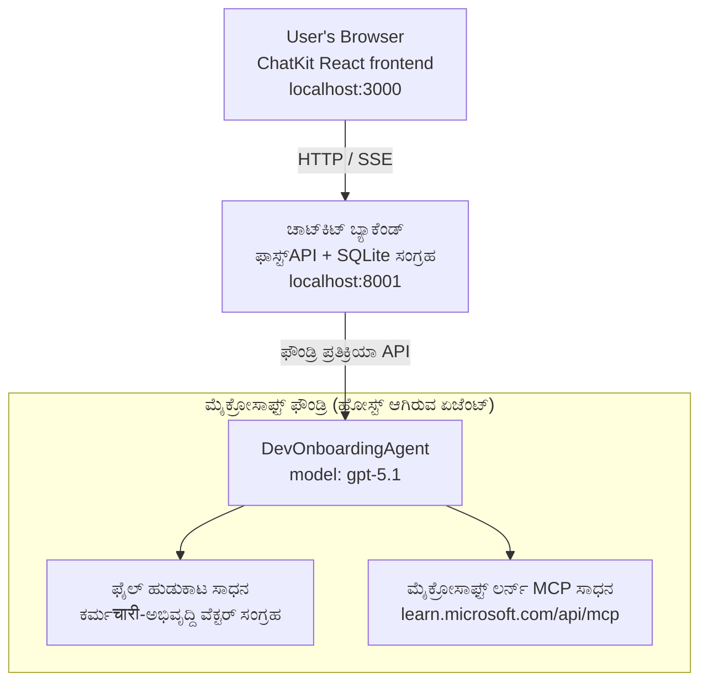

# ಪಾಠ 4: ಮೈಕ್ರೋಸಾಫ್ಟ್ ಫೌಂಡ್ರಿ ಹೋಸ್ಟೆಡ್ ಏಜಂಟ್ಸ್ + ಚಾಟ್ ಕಿಟ್ ಬಳಸಿ ಏಜಂಟ್ ನಿಯೋಜನೆ

ಈ ಪಾಠವು ಟುಲ್ ಬಳಕೆಯ ಏಜಂಟ್ನ್ನು ಮೈಕ್ರೋಸಾಫ್ಟ್ ಫೌಂಡ್ರಿಗೆ ಹೋಸ್ಟೆಡ್ ಏಜಂಟಾಗಿ ಹೇಗೆ ನಿಯೋಜಿಸಬೇಕೋ ಮತ್ತು ಅದಕ್ಕೆ ಸಂಭಾಷಣೆ ಮಾಡಲು ಚಾಟ್ ಕಿಟ್ ಆಧಾರಿತ ಫ್ರಂಟ್‌ಎಂಡ್ ಅನ್ನು ಹೇಗೆ ರಚಿಸಬೇಕೋ ತೋರಿಸುತ್ತದೆ.

## ವಾಸ್ತುಶಿಲ್ಪ

ಹೋಸ್ಟೆಡ್ ಏಜಂಟ್ ಎಂಬುದು **ಒಕ ಕಾರ್ಯಾಚರಣೆ 'DevOnboardingAgent'** (ಚಲಿಸಲಾಗುತ್ತಿದೆ `gpt-5.1` ನಲ್ಲಿ) ಆಗಿದ್ದು, ಇದು ಎರಡು ಹೋಸ್ಟೆಡ್ ಟೂಲ್ಸ್ ಅನ್ನು ಉಪಯೋಗಿಸಿ ಡೆವಲಪರ್-ಒನ್ಬೋರ್ಡಿಂಗ್ ಪ್ರಶ್ನೆಗಳಿಗೆ ಉತ್ತರ ನೀಡುತ್ತದೆ: ಉದ್ಯೋಗಿ-ಡೈರೆಕ್ಟರಿ ವೆಕ್ಟರ್ ಸ್ಟೋರ್ ಮೇಲೆ **ಫೈಲ್ ಸರ್ಚ್** ಟೂಲ್ ಮತ್ತು **ಮೈಕ್ರೋಸಾಫ್ಟ್ ಲರ್ನ್ MCP** ಟೂಲ್. ಚಾಟ್ ಕಿಟ್ ರಿಯಾಕ್ಟ್ ಫ್ರಂಟ್‌ಎಂಡ್ ಫ್ಯಾಸ್ಟ್ API ಬ್ಯಾಕೆಂಡ್ ಜೊತೆ ಸಂವಹನ ಮಾಡುತ್ತದೆ, ಅದು ಫೌಂಡ್ರಿ **ಪ್ರತ್ಯುತ್ತರಗಳು API** ಮೂಲಕ ಏಜಂಟ್ನ್ನು ಕರೆ ಮಾಡುತ್ತದೆ.



## ಅಗತ್ಯಪೂರ್ವತಗಳು

1. ಉತ್ತರ ಮಧ್ಯ ಅಮೆರಿಕ ದಕ್ಷಿಣ ಪ್ರಾಂತ್ಯದಲ್ಲಿ **ಮೈಕ್ರೋಸಾಫ್ಟ್ ಫೌಂಡ್ರಿ ಪ್ರಾಜೆಕ್ಟ್**
2. **ಏಜುರ್ CLI** ಮೂಲಕ ಪ್ರಾಮಾಣೀಕರಣ (`az login`)
3. **ಏಜುರ್ ಡೆವಲಪರ್ CLI** (`azd`) ಇನ್‌ಸ್ಟಾಲ್ ಮಾಡಿದೆ
4. **Python 3.12+** ಮತ್ತು **Node.js 18+**
5. ಉದ್ಯೋಗಿ ಡೇಟಾ ಜೊತೆಗೆ ನಿರ್ಮಿಸಲಾದ **ವೆಕ್ಟರ್ ಸ್ಟೋರ್**

## ವೇಗವಾಗಿ ಪ್ರಾರಂಭಿಸು

### 1. ಪರಿಸರ ಚರಗಳನ್ನು ಹೊಂದಿಸಿ

```bash
cd lesson-4-agentdeployment
cp .env.example .env
# ನಿಮ್ಮ Microsoft Foundry ಯೋಜನೆ ವಿವರಗಳೊಂದಿಗೆ .env ಅನ್ನು ಸಂಪಾದಿಸಿ
```

### 2. ಹೋಸ್ಟೆಡ್ ಏಜಂಟ್ನ್ನು ನಿಯೋಜಿಸಿ

**ಆಯ್ಕೆ A: ಏಜುರ್ ಡೆವಲಪರ್ CLI ಬಳಸಿ (ಶಿಫಾರಸು ಮಾಡಲಾಗಿದೆ)**

```bash
cd hosted-agent
azd auth login
azd agent deploy
```

**ಆಯ್ಕೆ B: ಡೊಕರ್ + ಏಜುರ್ ಕಂಟೈನರ್ ರೆಜಿಸ್ಟ್ರಿ ಬಳಸಿ**

```bash
cd hosted-agent

# ಕಂಟೈನರ್ ಬರೆಯಿರಿ
docker build -t developer-onboarding-agent:latest .

# ACR ಗೆ ಟ್ಯಾಗ್ ಮಾಡಿ
docker tag developer-onboarding-agent:latest <your-acr>.azurecr.io/developer-onboarding-agent:latest

# ACR ಗೆ ಪುಶ್ ಮಾಡಿ
az acr login --name <your-acr>
docker push <your-acr>.azurecr.io/developer-onboarding-agent:latest

# Microsoft Foundry ಪೋರ್ಟಲ್ ಅಥವಾ SDK ಮೂಲಕ ನಿಯೋಜಿಸಿ
```

### 3. ಚಾಟ್ ಕಿಟ್ ಬ್ಯಾಕೆಂಡ್ ಪ್ರಾರಂಭಿಸಿ

```bash
cd chatkit-server
python -m venv .venv
source .venv/bin/activate  # ವಿಂಡೋಸ್‌ನಲ್ಲಿ: .venv\Scripts\activate
pip install -r requirements.txt
python app.py
```

ಸರ್ವರ್ ಅನ್ನು `http://localhost:8001` ನಲ್ಲಿ ಪ್ರಾರಂಭಿಸಲಾಗುತ್ತದೆ

### 4. ಚಾಟ್ ಕಿಟ್ ಫ್ರಂಟ್‌ಎಂಡ್ ಪ್ರಾರಂಭಿಸಿ

```bash
cd chatkit-server/frontend
npm install
npm run dev
```

ಫ್ರಂಟ್‌ಎಂಡ್ `http://localhost:3000` ನಲ್ಲಿ ಪ್ರಾರಂಭವಾಗುತ್ತದೆ

### 5. ಅಪ್ಲಿಕೇಶನ್ ಪರೀಕ್ಷಿಸಿ

ನಿಮ್ಮ ಬ್ರೌಸರ್‌ನಲ್ಲಿ `http://localhost:3000` ತೆರೆಯಿರಿ ಮತ್ತು ಈ ಪ್ರಶ್ನೆಗಳನ್ನು ಪ್ರಯತ್ನಿಸಿ:

**ಉದ್ಯೋಗಿ ಹುಡುಕು:**
- "ನಾನು ಇಲ್ಲಿ ಹೊಸವನಿದ್ದೇನೆ! ಮೈಕ್ರೋಸಾಫ್ಟ್‌ನಲ್ಲಿ ಯಾರಾದರೂ ಕೆಲಸ ಮಾಡಿದ್ದಾರೆಯೇ?"
- "ಏಜೆಫ್ ಫಂಕ್ಷನ್ಸ್ ಜೊತೆ ಅನುಭವವಿರುವವರು ಯಾರು?"

**ಕಲಿಕೆ ಸಂಪನ್ಮೂಲಗಳು:**
- "ಕ್ಯೂಬರ್‌ನೇಟಿಸ್‌ಗಾಗಿ ಕಲಿಕೆಯ ಮಾರ್ಗವನ್ನು ರಚಿಸಿ"
- "ಕ್ಲೌಡ್ ವಾಸ್ತುಶಿಲ್ಪಕ್ಕಾಗಿ ನಾನು ಯಾವ ಪ್ರಮಾಣಪತ್ರಗಳನ್ನು ಪಡೆದುಕೊಳ್ಳಬೇಕು?"

**ಕೋಡಿಂಗ್ ಸಹಾಯ:**
- "ನನಗೆ Python ಕೋಡ್ ಬರೆಯಲು ಸಹಾಯ ಮಾಡಿ, CosmosDB ಗೆ ಸಂಪರ್ಕಿಸಲು"
- "ನನಗೆ ಏಜೆರ್ ಫಂಕ್ಷನ್ ರಚಿಸುವುದನ್ನು ತೋರಿಸಿ"

**ಬಹು ಏಜಂಟು ಪ್ರಶ್ನೆಗಳು:**
- "ನಾನು ಕ್ಲೌಡ್ ಎಂಜಿನಿಯರ್ ಆಗಿ ಪ್ರಾರಂಭಿಸುತ್ತಿದ್ದೇನೆ. ಯಾರೊಂದಿಗೆ ಸಂಪರ್ಕಿಸಬೇಕೆಂದು ಮತ್ತು ಏನು ಕಲಿಯಬೇಕೆಂದು ತಿಳಿಸಿ?"

## ಪ್ರಾಜೆಕ್ಟ್ ರಚನೆ

```
lesson-4-agentdeployment/
├── .env.example                 # Environment variables template
├── implementation-plan.md       # Detailed implementation guide
├── README.md                    # This file
├── hosted-agent/               # Microsoft Foundry hosted agent
│   ├── main.py                 # Multi-agent workflow implementation
│   ├── requirements.txt        # Python dependencies
│   ├── Dockerfile              # Container definition
│   └── agent.yaml              # Agent deployment configuration
└── chatkit-server/             # ChatKit server application
    ├── app.py                  # FastAPI backend
    ├── store.py                # SQLite persistence layer
    ├── requirements.txt        # Python dependencies
    └── frontend/               # React frontend
        ├── package.json
        ├── vite.config.ts
        ├── tsconfig.json
        ├── index.html
        └── src/
            ├── main.tsx
            ├── App.tsx
            ├── App.css
            └── index.css
```

## ಏಜಂಟ್ ಮತ್ತು ಅದರ ಟೂಲ್ಸ್

ಹೋಸ್ಟೆಡ್ ಏಜಂಟ್ ಒಂದು **ಒಂದು ಏಜಂಟ್** (`DevOnboardingAgent`, `hosted-agent/main.py` ನಲ್ಲಿ ವ್ಯಾಖ್ಯಾನಿಸಲಾಗಿದೆ) ಆಗಿದ್ದು, ಮೂರು ಒನ್ಬೋರ್ಡಿಂಗ್ ಕ್ಷೇತ್ರಗಳನ್ನು ನಿರ್ವಹಿಸುತ್ತದೆ. ಬೇರೆ ಉಪ-ಏಜಂಟುಗಳನ್ನು ನಿರ್ವಹಿಸುವ ಬದಲು, ಇದು ಪ್ರತಿ ಸಾಮರ್ಥ್ಯವನ್ನು ಟೂಲ್ನಾಗಿಯೇ ಅಥವಾ ನೇರವಾಗಿ ಮಾದರಿಯನ್ನು ಉಪಯೋಗಿಸುವ ಮೂಲಕ ಒದಗಿಸುತ್ತದೆ:

| ಸಾಮರ್ಥ್ಯ | ಇದು ಹೇಗೆ ನಿರ್ವಹಿಸಬಹುದು | ಟೂಲ್ |
|-----------|------------------|------|
| **ಉದ್ಯೋಗಿ ಹುಡುಕು ಮತ್ತು ಸಂಪರ್ಕಗಳು** | ಉದ್ಯೋಗಿ-ಡೈರೆಕ್ಟರಿ ವೆಕ್ಟರ್ ಸ್ಟೋರ್ ಮೇಲೆ ಫೌಂಡ್ರಿ ಹೋಸ್ಟೆಡ್ ಫೈಲ್ ಸರ್ಚ್ | `client.get_file_search_tool(vector_store_ids=[...])` |
| **ಕಲಿಕೆ ಮತ್ತು ತರಬೇತಿ** | ಮೈಕ್ರೋಸಾಫ್ಟ್ ಲರ್ನ್ MCP ಸರ್ವರ್ (ಹೋಸ್ಟೆಡ್ MCP ಟೂಲ್) | `client.get_mcp_tool(url="https://learn.microsoft.com/api/mcp")` |
| **ಕೋಡಿಂಗ್ ಸಹಾಯ** | `gpt-5.1` ಮಾದರಿಯಿಂದ ನೇರವಾಗಿ ನಿರ್ವಹಣೆ — ಹೊರಗಿನ ಟೂಲ್ ಇಲ್ಲ | — |

ಏಜಂಟ್ ಅನ್ನು `client.as_agent(name="DevOnboardingAgent", instructions=..., tools=[file_search_tool, learn_mcp_tool])` ಮೂಲಕ ರಚಿಸಲಾಗುತ್ತದೆ ಮತ್ತು `from_agent_framework(agent).run()` ಮೂಲಕ ಸೇವನೆ ಮಾಡಲಾಗುತ್ತದೆ.

> ** ವಿನ್ಯಾಸ ಟಿಪ್ಪಣಿ.** ಈ ಪಾಠದ ಪೂರ್ವಪ್ರತಿಗಳು `HandoffBuilder` ಬಹು ಏಜಂಟ್ ಕಾರ್ಯಪ್ರವಾಹವನ್ನು ಬಳಸಿಕೊಂಡಿದ್ದರು (ಟ್ರಿಯಾಜ್ → ತಜ್ಞರು). ವಿತರಿಸಲಾದ ಏಜಂಟ್ ಒಂದು ಒಬ್ಬ ಟೂಲ್ ಬಳಕೆಯ ಏಜಂಟ್ ಆಗಿದ್ದು, ಒನ್ಬೋರ್ಡಿಂಗ್ ಶೈಲಿಯ ಪ್ರಶ್ನೋತ್ತರ ಗೆ ಸರಳವಾಗಿ ನಿಯೋಜಿಸಬಹುದು ಮತ್ತು ವಿಚಾರಿಸಬಹುದು. ಬಹು ಏಜಂಟ್ ಸಂಯೋಜನೆ ಮತ್ತು ಹ್ಯಾಂಡ್ಫೋಫ್ ಉದಾಹರಣೆಗಾಗಿ, ಪಾಠ 2 ಮತ್ತು ಪಾಠ 3 ನೋಡಿ.

## ಹೋಸ್ಟೆಡ್ ಏಜಂಟ್ ಧೂಮಕೂಟ ಪರೀಕ್ಷೆ (CI ಗೇಟ್)

ಹೋಸ್ಟೆಡ್ ಏಜಂಟ್ "ಯಶಸ್ವಿಯಾಗಿ" ನಿಯೋಜಿಸುವುದು ನಿಯಂತ್ರಣ ಸಮತಲವುนิವೃತ್ತಿ
ಪಟ್ಟಿ ಸ್ವೀಕರಿಸಿದೆ ಎಂದು ಮಾತ್ರ ಸಾಬೀತುಮಾಡುತ್ತದೆ — ಇದರಿಂದ ಏಜಂಟ್ ನಿಜವಾಗಿಯೂ ಉತ್ತರಿಸುವುದಿಲ್ಲ ಎಂದು ಸಾಬೀತಾಗುವುದಿಲ್ಲ. ಒಂದು ಮಾದರಿ ದೋಷ,
ಅಥವಾ ಅವಧಿ ಮುಗಿದ ಸಂಪರ್ಕ ಯಾವುದಾದರೂ ಹಸಿರು ಆದರೆ ಮೌನ ಏಜಂಟ್ ಬಿಟ್ಟುಕೊಡಬಹುದು.

ಈ ಪಾಠವು ದ್ರುತ, ದುಬಾರಿ ಇಲ್ಲದ ನಿಯೋಜನೋತ್ತರ
ಗೇಟ್ ಆಗಿ ಕಾರ್ಯನಿರ್ವಹಿಸುವ ಅತ್ಯಲ್ಪ ತೂಕದ **ಧೂಮಕೂಟ ಪರೀಕ್ಷೆಯನ್ನು** ಒದಗಿಸುತ್ತದೆ. ಇದು [AI Smoke Test](https://github.com/marketplace/actions/ai-smoke-test)
ಗಿಟ್‌ಹಬ್ ಕ್ರಿಯೆಯನ್ನು ಉಪಯೋಗಿಸಿ ಏಜಂಟ್ ಫೌಂಡ್ರಿ **ಪ್ರತ್ಯುತ್ತರಗಳು** ಎಂಡ್‌ಪಾಯಿಂಟ್‌ಗೆ ಪ್ರಾಂಪ್ಟ್‌ಗಳನ್ನು POST ಮಾಡುತ್ತದೆ
(`POST {project_endpoint}/agents/{agent_name}/endpoint/protocols/openai/responses`)
ಮತ್ತು ಮರಳಿದ ಪಠ್ಯವನ್ನು ಸರಿಪಡಿಸುತ್ತದೆ. ಇದು ಕೆಡವಿದ ನಿಯೋಜನೆಗಳು, ಪ್ರಾಮಾಣೀಕರಣ ಹಿನ್ನಡೆಗಳು,
ವ್ಯವಸ್ಥೆಯ ಪ್ರಾಂಪ್ಟ್ ಬೆರಗು ಮತ್ತು ಥ್ರೆಡಿಂಗ್ ತಪ್ಪುಗಳನ್ನು ಕ್ಷಣಗಳಲ್ಲಿ ಹಿಡಿಯುತ್ತದೆ.

> ಧೂಮಕೂಟ ಪರೀಕ್ಷೆಗಳು ಸಂಪೂರ್ಣ ಮೌಲ್ಯಮಾಪನಗಳ ಸ್ಥಳಪೂರಕವಲ್ಲ
> [ಪಾಠ 3](../lesson-3-agent-evals/README.md) ನಲ್ಲಿ — ಅವುPar ಪರಿಪಾಲನೆ ರೂಪದಲ್ಲಿ. ಧೂಮಕೂಟ ಪರೀಕ್ಷೆಗಳು
> ಉತ್ತರಿಸುತ್ತವೆ *"ಏಜಂಟ್ ತಲುಪಬಹುದಾ, ಪ್ರತಿಕ್ರಿಯಿಸುತ್ತಿದೆಯಾ ಮತ್ತು ಮೂಲಭೂತ ಪ್ರಾಂಪ್ಟ್ ನಿರೀಕ್ಷೆಗಳನ್ನು ಪಾಲಿಸುತ್ತಿದೆಯಾ?"*;
> ಮೌಲ್ಯಮಾಪನಗಳು ಉತ್ತರಿಸುತ್ತವೆ *"ಉತ್ತರವು ಎಷ್ಟು ಉತ್ತಮ?"*. ಪ್ರತಿಯೊಂದು ನಿಯೋಜನದ ಮೇಲೆ ಈ ದುಬಾರಿ ಬಾಗಿಲನ್ನು ಓಡಿ.

### ಏನು ಪರೀಕ್ಷಿಸಲಾಗುತ್ತದೆ

ಕ್ಯಾಟಲಾಗ್ [`hosted-agent/tests/smoke-tests.json`](../../../lesson-4-agentdeployment/hosted-agent/tests/smoke-tests.json)
ನಲ್ಲಿ ಇರುತ್ತದೆ ಮತ್ತು ಏಜಂಟ್‌ನ ಮೂರು ಕ್ಷೇತ್ರಗಳು ಜೊತೆಗೆ ಪ್ರಾಂಪ್ಟ್ ಅನುಕರಣ ಮತ್ತು ಬಹು ತಿರುಗುಮುಖ ಥ್ರೆಡಿಂಗ್ ಅನ್ನು ಜಾಹೀರಾತು ಮಾಡುತ್ತದೆ:

| ಪರೀಕ್ಷೆ | ಇದರಿಂದ ಪರಿಶೀಲಿಸಲಾಗುತ್ತದೆ |
|------|------------------|
| `reachability` | ಏಜಂಟ್ ಖಾಲಿ ಅಲ್ಲದ, ವ್ಯಾಪ್ತಿಗೆ ಹೊಂದಿಕೆ ಮಾಡಲಾದ ಪಠ್ಯದಿಂದ ಪ್ರತಿಕ್ರಿಯಿಸುತ್ತದೆ |
| `employee-search` | ಫೈಲ್-ಸರ್ಚ್ ಕ್ಷೇತ್ರವು ಆರೋಗ್ಯಕರ `200` ವಿನಂತಿಯನ್ನು ಮರಳಿಸುತ್ತದೆ (ಪ್ರತಿಕ್ರಿಯೆ ಡೇಟಾ-ನಿರ್ಧರಿತ) |
| `learning-path` | ಕಲಿಕೆ ಕ್ಷೇತ್ರವು ವಿಷಯವನ್ನು ಪ್ರತಿಬಿಂಬಿಸುತ್ತದೆ ಮತ್ತು ಮಾರ್ಗ ಶೈಲಿಯ ಉತ್ತರವನ್ನು ತಯಾರಿಸುತ್ತದೆ |
| `coding-assistance` | ಕೋಡಿಂಗ್ ಕ್ಷೇತ್ರವು ಕೋಡ್ ಆಕಾರದ Python ಉತ್ತರವನ್ನು ನೀಡುತ್ತದೆ |
| `prompt-adherence-offtopic` | ವಿಷಯಕ್ಕಾಗಿ ಹೊರಗಿನ ವಿನಂತಿಯನ್ನು ಮಾರ್ಗದರ್ಶನ ಮಾಡುತ್ತದೆ, ವಿವರವಾಗಿ ಉತ್ತರಿಸುವುದಿಲ್ಲ |
| `threading-turn-1/2` | ಸಂವಾದ ಸ್ಥಿತಿಯನ್ನು `previous_response_id` ಮೂಲಕ ತಿರುಗುಮುಖಗಳಾದಲ್ಲಿ ಉಳಿಸಿಕೊಂಡಿದೆ |

### CI ನಲ್ಲಿ ನಡಿಸಿ

[`.github/workflows/smoke-test-hosted-agent.yml`](../../../.github/workflows/smoke-test-hosted-agent.yml) ನಲ್ಲಿ ಕೆಲಸ 2 ಕೆಲಸಗಳನ್ನು ಹೊಂದಿದೆ:


- **`static`** — ಪ್ರತಿ ಪುಲ್ ವಿನಂತಿ ಮತ್ತು ಪುಷ್‌ನಲ್ಲಿ ನಡೆಯುವ ತ್ವರಿತ, ಏಜುರ್ ಇಲ್ಲದ ಗೇಟ್:
  ಇದು ಎಲ್ಲಾ Python ಮೂಲಗಳನ್ನು (`py_compile`) ಸಂಯೋಜಿಸುತ್ತದೆ ಮತ್ತು ಮಾರ್ಕ್ಡೌನ್ ಲಿಂಕ್‌ಗಳ ಪರಿಶೀಲನೆ ಮಾಡುತ್ತದೆ. ಯಾವುದೇ ರಹಸ್ಯಗಳು ಅವಶ್ಯಕವೇನಲ್ಲ, ಆದ್ದರಿಂದ ಇದು ಫೋರ್ಕ್ PR ಗಳಲ್ಲಿಯೂ ಕೆಲಸ ಮಾಡುತ್ತದೆ.

- **`smoke`** — ಕೆಳಗಿನ ಏಜುರ್-ಸಂಪರ್ಕಿತ ಧೂಮಕೂಟ ಪರೀಕ್ಷೆ. ಇದು ವಿನಂತಿ ಮೇರೆಗೆ (ಕಾರ್ಯಗಳು → **Agent CI (static + smoke)** → ಕೆಲಸವನ್ನು ನಡೆಸಿ) ನಡೆಯುತ್ತದೆ ಮತ್ತು ನಿಮ್ಮ ನಿಯೋಜಣ ಕಾರ್ಯ ನಂತರ ಜೋಡಿಸಬಹುದು.


ಈ ರಿಪೊಸಿಟರಿ **ಚರಗಳು** ಮತ್ತು **ರಹಸ್ಯಗಳು**ನ್ನು ಧೂಮಕೂಟ ಕೆಲಸಕ್ಕೆ ಸಂರಚಿಸಿ:

| ಪ್ರಕಾರ | ಹೆಸರು | ಮೌಲ್ಯ |
|------|------|-------|

| ಬದಲಿಸುವುದು | `FOUNDRY_PROJECT_ENDPOINT` | `https://<account>.services.ai.azure.com/api/projects/<project>` |
| ಬದಲಿಸುವುದು | `HOSTED_AGENT_NAME` | ನಿಯೋಜಿತ ಏಜೆಂಟ್ ಹೆಸರು (ಉದಾ. `dev-onboarding` — ನಿಮ್ಮ ನಿಯೋಜನೆಯೊಂದಿಗೆ ಹೊಂದಿಕೊಳ್ಳಬೇಕು) |
| ರಹಸ್ಯ | `AZURE_CLIENT_ID` / `AZURE_TENANT_ID` / `AZURE_SUBSCRIPTION_ID` | `azure/login` ಗೆ OIDC ಫೆಡರೆಟೆಡ್ ಗುರುತು |

ರನ್ನರ್ ಗುರುತು **`Azure AI User`** ಪಾತ್ರವನ್ನು **Foundry ಪ್ರಾಜೆಕ್ಟ್ ವ್ಯಾಪ್ತಿಯಲ್ಲಿ** ಹೊಂದಿರಬೇಕು ताकि ಅದು 
ಪ್ರತಿಕ್ರಿಯೆಗಳು (ಮತ್ತು ಸಂಭಾಷಣೆಗಳು) ಡೇಟಾ-ಪ್ಲೇನ್ ಎಂಡ್‌ಪಾಯಿಂಟ್‌ಗಳು ಕರೆ ಮಾಡಬಹುದು. ಇದು ಅನುಮತಿಸಿ:

```bash
az role assignment create \
  --assignee <object-id-or-appId-of-runner-identity> \
  --role "Azure AI User" \
  --scope "/subscriptions/<sub>/resourceGroups/<rg>/providers/Microsoft.CognitiveServices/accounts/<account>/projects/<project>"
```

### ಅದನ್ನು ಸ್ಥಳೀಯವಾಗಿ ಚಲಾಯಿಸಿ

ನೀವು ಅದೇ ಕ್ಯಾಟಲಾಗ್ ಅನ್ನು ಪುಶ್ ಮಾಡುವ ಮುನ್ನ ನಡೆಸಬಹುದು. ಡೇಟಾ-ಪ್ಲೇನ್ ಟೋಕನ್ ಅನ್ನು ಪಡೆದು
`https://ai.azure.com/` ಗೆ ವ್ಯಾಪ್ತಿ ಹೊಂದಿಸಿ ಮತ್ತು ರನ್ನರ್ ಅನ್ನು ನಿಮ್ಮ ನಿಯೋಜನೆ ಕಡೆ ತಿರುಗಿಸಿ:

```bash
# ಪ್ರೇಕ್ಷಕ https://ai.azure.com/ ಆಗಿರಬೇಕಾಗಿದೆ (cognitiveservices.azure.com ಟೋಕನ್ಗಳು ನಿರಾಕರಿಸಲಾಗುತ್ತದೆ)
export FOUNDRY_TOKEN=$(az account get-access-token --resource https://ai.azure.com/ --query accessToken -o tsv)

git clone https://github.com/JFolberth/ai-smoketest && cd ai-smoketest
python runner.py \
  --project-endpoint "https://<account>.services.ai.azure.com/api/projects/<project>" \
  --agent-name dev-onboarding \
  --tests-file ../lesson-4-agentdeployment/hosted-agent/tests/smoke-tests.json
```

ನಿರ್ಗಮನ ಕೋಡ್ಗಳು: `0` ಎಲ್ಲವೂ успешно, `1` ಒಂದು ನಿರ್ಧಾರ ವಿಫಲ, `2` ರನ್ನರ್ ದೋಷ (ತಪ್ಪಾದ ಕ್ಯಾಟಲಾಗ್ / ಟೋಕನ್).

## ಸಮಸ್ಯೆ ಪರಿಹಾರ

### ಏಜೆಂಟ್ ಪ್ರತಿಕ್ರಿಯೆ ನೀಡುತ್ತಿಲ್ಲ
- ಉಪಯುಕ್ತ ಏಜೆಂಟ್ ಮೈಸಕ್ರೋಸಾಫ್ಟ್ ಫೌಂಡ್ರಿಯಲ್ಲಿ ನಿಯೋಜಿಸಲ್ಪಟ್ಟಿದೆ ಮತ್ತು ಚಲಿಸುತ್ತಿದೆ ಎಂಬುದನ್ನು ಪರಿಶೀಲಿಸಿ
- `HOSTED_AGENT_NAME` ಮತ್ತು `HOSTED_AGENT_VERSION` ನಿಮ್ಮ ನಿಯೋಜನೆಯೊಂದಿಗೆ ಹೊಂದಿಕೊಂಡಿವೆ ಎಂದು ಪರಿಶೀಲಿಸಿ

### ವೆಕ್ಟರ್ ಸ್ಟೋರ್ ದೋಷಗಳು
- `VECTOR_STORE_ID` ಸರಿಯಾಗಿ ಹೊಂದಿಸಲಾಗಿದೆ ಎಂದು ಖಚಿತಪಡಿಸಿಕೊಳ್ಳಿ
- ವೆಕ್ಟರ್ ಸ್ಟೋರ್ ಉದ್ಯೋಗಿ ಡೇಟಾವನ್ನು ಒಳಗೊಂಡಿದೆ ಎಂದು ಪರಿಶೀಲಿಸಿ

### ಪ್ರಾಮಾಣೀಕರಣ ದೋಷಗಳು
- ಪ್ರಮಾಣಪತ್ರಗಳನ್ನು ನವೀಕರಿಸಲು `az login` ಅನ್ನು ಚಲಾಯಿಸಿ
- ನಿಮಗೆ ಮೈಸಕ್ರೋಸಾಫ್ಟ್ ಫೌಂಡ್ರಿ ಪ್ರಾಜೆಕ್ಟ್ ಗೆ ಪ್ರವೇಶವಿದೆ ಎಂದು ಖಚಿತಪಡಿಸಿಕೊಳ್ಳಿ

## ಸಂಪನ್ಮೂಲಗಳು

- [Microsoft Foundry Hosted Agents Documentation](https://learn.microsoft.com/en-us/azure/ai-foundry/agents/concepts/hosted-agents)
- [Microsoft Agent Framework](https://github.com/microsoft/agent-framework)
- [ChatKit Integration Sample](https://github.com/microsoft/agent-framework/tree/main/python/samples/demos/chatkit-integration)
- [Azure Developer CLI](https://learn.microsoft.com/en-us/azure/developer/azure-developer-cli/overview)
- [AI Smoke Test GitHub Action](https://github.com/marketplace/actions/ai-smoke-test)
- [Smoke Test Microsoft Foundry Agents with GitHub Actions (blog)](https://techcommunity.microsoft.com/blog/azuredevcommunityblog/smoke-test-microsoft-foundry-agents-with-github-actions/4531912)

---

## ಮುಂದಿನ ಹಂತಗಳು

ನಿಮ್ಮ ಏಜೆಂಟ್ ಮೈಸಕ್ರೋಸಾಫ್ಟ್ ನಿರ್ವಹಿತ инф್ರಾಸ್ಟ್ರಕ್ಚರ್‌ನಲ್ಲಿ ಚಾಲನೆಗೊಳ್ಳುತ್ತದೆ. ಅದನ್ನು ಎಂಟರ್‌ಪ್ರೈಸ್ ಉತ್ಪಾದನೆಗೆ ತಂದೊಯ್ಯಲು —
ಅದರ ಡೇಟಾ ಎಲ್ಲಿ ಇರುತ್ತದೆ ಎಂಬುದನ್ನು ನಿಯಂತ್ರಿಸುವುದು (ಡೇಟಾ ಪ್ರತ್ಯುತ್ಥಾನ, ಖಾಸಗಿ ನೆಟ್ವರ್ಕಿಂಗ್,bring-your-own Azure 
Cosmos DB / Storage / AI Search) ಮತ್ತು ಅದರ ಸಾಧನಗಳನ್ನು ಆಡಳಿತ ಮಾಡುವುದು — ಮುಂದುವರಿಯಿರಿ 
**[ಪಾಠ 5: ಉತ್ಪಾದನಾ ನಿರ್ವಹಿತ ಏಜೆಂಟ್ಗಳು](../lesson-5-hosted-agents-production/README.md)**, ಇದು 
**ನಿರ್ವಹಿತ ಏಜೆಂಟ್ಗಳು** ಮತ್ತು **ಸಾಮರ್ಥ್ಯದ ಹೋಸ್ಟ್‌ಗಳು** ನಡುವಿನ ಪ್ರಮುಖ ಭೇದವನ್ನು ವಿವರಿಸುತ್ತದೆ.

---

<!-- CO-OP TRANSLATOR DISCLAIMER START -->
**ಅಸ್ವೀಕಾರ**:
ಈ ದಸ್ತಾವೇಜು AI ಅನುವಾದ ಸೇವೆ [Co-op Translator](https://github.com/Azure/co-op-translator) ಬಳಸಿ ಅನುವಾದಿಸಲಾಗಿದೆ. ನಾವು ನಿಖರತೆಯನ್ನು ಸಾಧಿಸಲು ಪ್ರಯತ್ನಿಸುತ್ತಿದ್ದರೂ, ದಯವಿಟ್ಟು ಗಮನಿಸಿ, ಸ್ವಯಂಚಾಲಿತ ಅನುವಾದಗಳಲ್ಲಿ ದೋಷಗಳು ಅಥವಾ ಅಸಡ್ಡೆಗಳು ಇರಬಹುದು. ಮೂಲ ಭಾಷೆಯಲ್ಲಿರುವ ಮೂಲ ದಸ್ತಾವೇಜು ಪ್ರಾಮಾಣಿಕ ಮೂಲವೆಂದು ಪರಿಗಣಿಸಬೇಕು. ಪ್ರಮುಖ ಮಾಹಿತಿಗಾಗಿ, ವೃತ್ತಿಪರ ಮಾನವ ಅನುವಾದವನ್ನು ಶಿಫಾರಸು ಮಾಡಲಾಗುತ್ತದೆ. ಈ ಅನುವಾದವನ್ನು ಬಳಸುವ ಮೂಲಕ ಉಂಟಾಗುವ ಯಾವುದೇ ತಪ್ಪು ಅರ್ಥಗಳ ಅಥವಾ ತಪ್ಪು ವ್ಯಾಖ್ಯಾನಗಳ ಬಗ್ಗೆ ನಾವು ಹೊಣೆಗಾರರಲ್ಲ.
<!-- CO-OP TRANSLATOR DISCLAIMER END -->