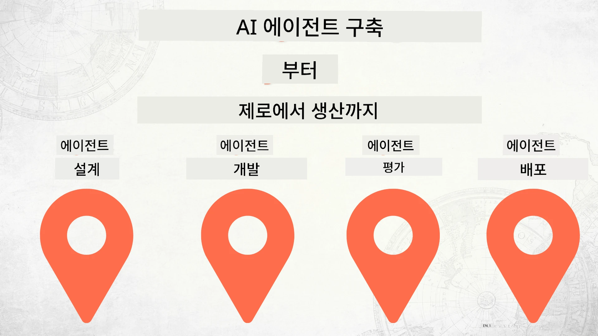

# 처음부터 프로덕션까지 AI 에이전트 구축하기



### 🌐 다국어 지원

#### GitHub 액션을 통한 지원 (자동화 및 항상 최신 상태 유지)

<!-- CO-OP TRANSLATOR LANGUAGES TABLE START -->
[Arabic](../ar/README.md) | [Bengali](../bn/README.md) | [Bulgarian](../bg/README.md) | [Burmese (Myanmar)](../my/README.md) | [Chinese (Simplified)](../zh-CN/README.md) | [Chinese (Traditional, Hong Kong)](../zh-HK/README.md) | [Chinese (Traditional, Macau)](../zh-MO/README.md) | [Chinese (Traditional, Taiwan)](../zh-TW/README.md) | [Croatian](../hr/README.md) | [Czech](../cs/README.md) | [Danish](../da/README.md) | [Dutch](../nl/README.md) | [Estonian](../et/README.md) | [Finnish](../fi/README.md) | [French](../fr/README.md) | [German](../de/README.md) | [Greek](../el/README.md) | [Hebrew](../he/README.md) | [Hindi](../hi/README.md) | [Hungarian](../hu/README.md) | [Indonesian](../id/README.md) | [Italian](../it/README.md) | [Japanese](../ja/README.md) | [Kannada](../kn/README.md) | [Korean](./README.md) | [Lithuanian](../lt/README.md) | [Malay](../ms/README.md) | [Malayalam](../ml/README.md) | [Marathi](../mr/README.md) | [Nepali](../ne/README.md) | [Nigerian Pidgin](../pcm/README.md) | [Norwegian](../no/README.md) | [Persian (Farsi)](../fa/README.md) | [Polish](../pl/README.md) | [Portuguese (Brazil)](../pt-BR/README.md) | [Portuguese (Portugal)](../pt-PT/README.md) | [Punjabi (Gurmukhi)](../pa/README.md) | [Romanian](../ro/README.md) | [Russian](../ru/README.md) | [Serbian (Cyrillic)](../sr/README.md) | [Slovak](../sk/README.md) | [Slovenian](../sl/README.md) | [Spanish](../es/README.md) | [Swahili](../sw/README.md) | [Swedish](../sv/README.md) | [Tagalog (Filipino)](../tl/README.md) | [Tamil](../ta/README.md) | [Telugu](../te/README.md) | [Thai](../th/README.md) | [Turkish](../tr/README.md) | [Ukrainian](../uk/README.md) | [Urdu](../ur/README.md) | [Vietnamese](../vi/README.md)

> **로컬에 클론하여 사용하시겠습니까?**

> 이 저장소에는 50개 이상의 언어 번역이 포함되어 있어 다운로드 크기가 크게 증가합니다. 번역 없이 클론하려면 sparse checkout을 사용하세요:
> ```bash
> git clone --filter=blob:none --sparse https://github.com/microsoft/Building-AI-Agents-From-Zero-To-Production.git
> cd Building-AI-Agents-From-Zero-To-Production
> git sparse-checkout set --no-cone '/*' '!translations' '!translated_images'
> ```
> 이 방법으로 과정 완료에 필요한 모든 것을 훨씬 빠른 다운로드로 받을 수 있습니다.
<!-- CO-OP TRANSLATOR LANGUAGES TABLE END -->

## AI 에이전트 개발 생명주기의 기본을 가르치는 과정

[](https://github.com/microsoft/Building-AI-Agents-From-Zero-To-Production/blob/master/LICENSE?WT.mc_id=academic-105485-koreyst)
[](https://GitHub.com/microsoft/Building-AI-Agents-From-Zero-To-Production/graphs/contributors/?WT.mc_id=academic-105485-koreyst)
[](https://GitHub.com/microsoft/Building-AI-Agents-From-Zero-To-Production/issues/?WT.mc_id=academic-105485-koreyst)
[](https://GitHub.com/microsoft/Building-AI-Agents-From-Zero-To-Production/pulls/?WT.mc_id=academic-105485-koreyst)
[](http://makeapullrequest.com?WT.mc_id=academic-105485-koreyst)

[](https://discord.gg/Kuaw3ktsu6)

## 🌱 시작하기

이 과정은 AI 에이전트를 구축하고 배포하는 기본을 다룬 수업들로 구성되어 있습니다.

각 수업은 이전 수업을 기반으로 하므로 처음부터 시작하여 끝까지 차례대로 진행하는 것을 권장합니다.

AI 에이전트 주제에 대해 더 탐색하고 싶다면 [AI Agents For Beginners Course](https://aka.ms/ai-agents-beginners)를 확인하세요.

### 다른 학습자 만나기, 질문하기

AI 에이전트 구축 중 막히거나 궁금한 점이 있으면 [Microsoft Foundry Discord](https://discord.gg/Kuaw3ktsu6)의 전용 Discord 채널에 참여하세요.

### 필요한 사항

각 수업에는 로컬에서 실행할 수 있는 코드 샘플이 있습니다. 이 저장소를 [포크](https://github.com/microsoft/Building-AI-Agents-From-Zero-To-Production/fork)하여 자신의 복사본을 만들 수 있습니다.

현재 이 과정은 다음을 사용합니다:

- [Microsoft Agent Framework (MAF)](https://aka.ms/ai-agents-beginners/agent-framework)
- [Microsoft Foundry](https://azure.microsoft.com/products/ai-foundry)
- [Azure OpenAI Service](https://azure.microsoft.com/products/ai-foundry/models/openai)
- [Azure CLI](https://learn.microsoft.com/cli/azure/authenticate-azure-cli?view=azure-cli-latest)

시작하기 전에 이 서비스에 대한 접근 권한이 있는지 확인하세요.

모델 호스팅 및 서비스 관련 더 많은 옵션이 곧 제공될 예정입니다.

## 🗃️ 수업 목록

| **수업**              | **설명**                                                                                       |
|-----------------------|-----------------------------------------------------------------------------------------------|
| [에이전트 설계](./lesson-1-agent-design/README.md)          | "개발자 온보딩" 에이전트 사용 사례 소개 및 효과적인 에이전트 설계 방법                 |
| [에이전트 개발](./lesson-2-agent-development/README.md)      | Microsoft Agent Framework (MAF)를 사용하여 신규 개발자 온보딩을 돕는 3개의 에이전트 생성   |
| [에이전트 평가](./lesson-3-agent-evals/README.md)            | Microsoft Foundry를 이용해 AI 에이전트 성능 평가 및 개선 방법 알아보기                   |
| [에이전트 배포](./lesson-4-agent-deployment/README.md)       | Hosted Agents와 OpenAI Chatkit을 사용하여 AI 에이전트를 프로덕션에 배포하는 방법         |

## 🎒 다른 과정

우리 팀이 만든 다른 과정도 있습니다! 확인해 보세요:

<!-- CO-OP TRANSLATOR OTHER COURSES START -->
### LangChain
[](https://aka.ms/langchain4j-for-beginners)
[](https://aka.ms/langchainjs-for-beginners?WT.mc_id=m365-94501-dwahlin)

---

### Azure / Edge / MCP / 에이전트
[](https://github.com/microsoft/AZD-for-beginners?WT.mc_id=academic-105485-koreyst)
[](https://github.com/microsoft/edgeai-for-beginners?WT.mc_id=academic-105485-koreyst)
[](https://github.com/microsoft/mcp-for-beginners?WT.mc_id=academic-105485-koreyst)
[](https://github.com/microsoft/ai-agents-for-beginners?WT.mc_id=academic-105485-koreyst)

---
 
### 생성 AI 시리즈
[](https://github.com/microsoft/generative-ai-for-beginners?WT.mc_id=academic-105485-koreyst)
[-9333EA?style=for-the-badge&labelColor=E5E7EB&color=9333EA)](https://github.com/microsoft/Generative-AI-for-beginners-dotnet?WT.mc_id=academic-105485-koreyst)
[-C084FC?style=for-the-badge&labelColor=E5E7EB&color=C084FC)](https://github.com/microsoft/generative-ai-for-beginners-java?WT.mc_id=academic-105485-koreyst)
[-E879F9?style=for-the-badge&labelColor=E5E7EB&color=E879F9)](https://github.com/microsoft/generative-ai-with-javascript?WT.mc_id=academic-105485-koreyst)

---
 
### 핵심 학습
[](https://aka.ms/ml-beginners?WT.mc_id=academic-105485-koreyst)
[](https://aka.ms/datascience-beginners?WT.mc_id=academic-105485-koreyst)
[](https://aka.ms/ai-beginners?WT.mc_id=academic-105485-koreyst)
[](https://github.com/microsoft/Security-101?WT.mc_id=academic-96948-sayoung)
[](https://aka.ms/webdev-beginners?WT.mc_id=academic-105485-koreyst)
[](https://aka.ms/iot-beginners?WT.mc_id=academic-105485-koreyst)
[](https://github.com/microsoft/xr-development-for-beginners?WT.mc_id=academic-105485-koreyst)

---
 
### 코파일럿 시리즈
[](https://aka.ms/GitHubCopilotAI?WT.mc_id=academic-105485-koreyst)
[](https://github.com/microsoft/mastering-github-copilot-for-dotnet-csharp-developers?WT.mc_id=academic-105485-koreyst)
[](https://github.com/microsoft/CopilotAdventures?WT.mc_id=academic-105485-koreyst)
<!-- CO-OP TRANSLATOR OTHER COURSES END -->

## 기여하기

이 프로젝트는 기여와 제안을 환영합니다. 대부분의 기여는 여러분이 여러분의 기여물을 사용할 권한을 실제로 가지고 있음을 선언하는
기여자 라이선스 계약서(CLA)에 동의해야 합니다. 자세한 내용은 <https://cla.opensource.microsoft.com>을 참조하세요.

풀 리퀘스트를 제출할 때 CLA 봇이 여러분이 CLA를 제출해야 하는지 자동으로 판단하고 적절하게 표시합니다(예: 상태 검사, 댓글).
봇에서 제공하는 안내에 따라 진행하세요. 이 절차는 모든 저장소에서 한 번만 수행하면 됩니다.

이 프로젝트는 [Microsoft 오픈 소스 행동 강령](https://opensource.microsoft.com/codeofconduct/)을 채택했습니다.
자세한 내용은 [행동 강령 FAQ](https://opensource.microsoft.com/codeofconduct/faq/)를 참조하거나
추가 질문이나 의견이 있으면 [opencode@microsoft.com](mailto:opencode@microsoft.com)으로 문의하세요.

## 상표

이 프로젝트에는 프로젝트, 제품 또는 서비스의 상표나 로고가 포함될 수 있습니다. Microsoft 상표 또는 로고의 허가된 사용은
[Microsoft 상표 및 브랜드 지침](https://www.microsoft.com/legal/intellectualproperty/trademarks/usage/general)에 따르며 이를 준수해야 합니다.
수정된 버전의 프로젝트에서 Microsoft 상표나 로고를 사용할 경우 혼동을 야기하거나 Microsoft 후원을 암시해서는 안 됩니다.
제3자 상표나 로고 사용은 해당 제3자의 정책에 따릅니다.

## 도움 받기

AI 앱 개발 중에 막히거나 질문이 있으면 다음에 참여하세요:

[](https://discord.gg/Kuaw3ktsu6)

제품 피드백이나 오류 신고는 다음에서 확인하세요:

[](https://aka.ms/foundry/forum)

---

<!-- CO-OP TRANSLATOR DISCLAIMER START -->
**면책 조항**:  
이 문서는 AI 번역 서비스 [Co-op Translator](https://github.com/Azure/co-op-translator)를 사용하여 번역되었습니다. 정확성을 위해 최선을 다하고 있지만, 자동 번역에는 오류나 부정확성이 포함될 수 있음을 유의하시기 바랍니다. 원문 문서는 해당 언어의 권위 있는 자료로 간주되어야 합니다. 중요한 정보의 경우, 전문적인 인간 번역을 권장합니다. 본 번역 사용으로 인해 발생하는 오해나 잘못된 해석에 대해 당사는 책임을 지지 않습니다.
<!-- CO-OP TRANSLATOR DISCLAIMER END -->