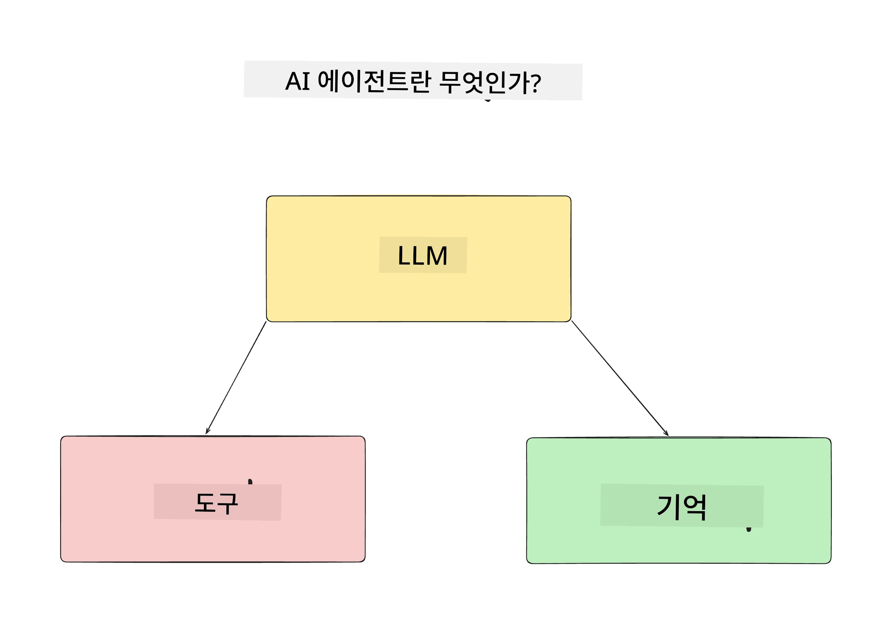
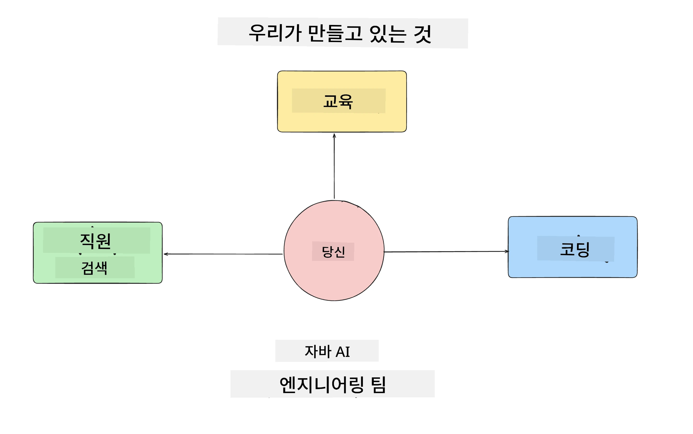
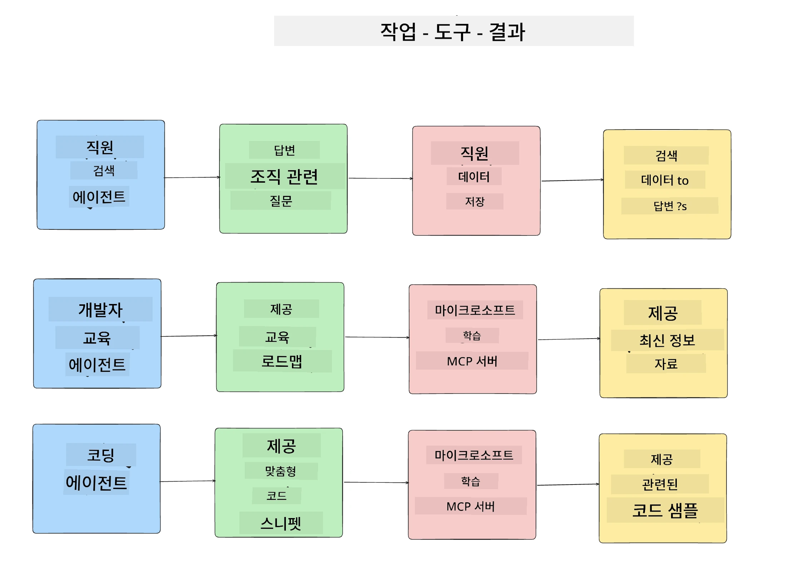
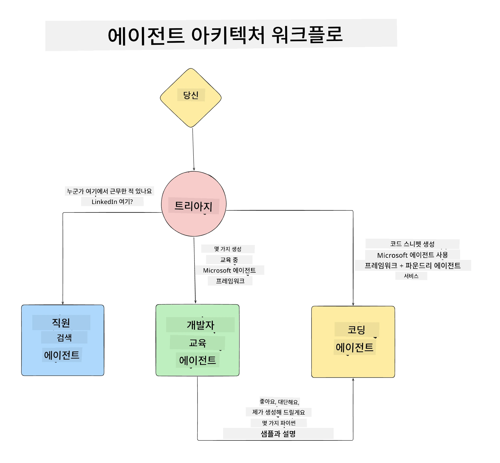

# 레슨 1: AI 에이전트 설계

"제로에서 프로덕션까지 AI 에이전트 구축 과정" 첫 번째 수업에 오신 것을 환영합니다!

이번 수업에서는 다음 내용을 다룹니다:

- AI 에이전트란 무엇인지 정의하기
  
- 우리가 구축할 AI 에이전트 애플리케이션 논의  

- 각 에이전트에 필요한 도구와 서비스 식별하기
  
- 에이전트 애플리케이션 아키텍처 설계
  
이제 에이전트가 무엇인지, 그리고 애플리케이션 안에서 왜 사용하는지 정의하는 것부터 시작합시다.

> **과정을 시작하기 전에.** 첫 번째 수업은 개념적인 내용으로, 실행할 코드가 없습니다.
> [레슨 2](../lesson-2-agent-development/README.md)부터는 <strong>Microsoft Foundry</strong>에 접근할 수 있는 **Azure 구독**, 배포된 **GPT-5 시리즈 모델** (예: `gpt-5.1` — 사용 중단된 GPT-4o / GPT-4.1은 피해주세요), **Python 3.12+**, 그리고 **Azure CLI** (`az login`)가 필요합니다. 전체 목록과 링크는 코스 README의 [필요한 것들](../README.md#what-you-need)을 참고하세요.

## AI 에이전트란 무엇인가?

AI 에이전트를 처음 접하는 분이라면 AI 에이전트를 정확히 어떻게 정의해야 할지 의문이 들 수 있습니다.

AI 에이전트를 구성 요소별로 간단히 정의하면 다음과 같습니다:

**대형 언어 모델** - LLM은 사용자가 완료하려는 작업을 자연어로 처리하는 능력과 이 작업을 수행하기 위해 사용 가능한 도구 설명을 해석하는 역할을 모두 수행합니다.

<strong>도구</strong> - 사용자가 요청한 작업을 완료하기 위해 LLM이 선택하여 사용할 수 있는 함수, API, 데이터 저장소 및 기타 서비스입니다.

<strong>메모리</strong> - AI 에이전트와 사용자 간의 단기 및 장기 상호작용을 저장하는 방식입니다. 이 정보를 저장하고 검색하는 것은 시간이 지남에 따라 개선하고 사용자 선호도를 저장하는 데 중요합니다.

## 우리의 AI 에이전트 사용 사례

이 과정에서는 새로운 개발자가 AI 에이전트 개발 팀에 온보딩하는 데 도움을 주는 AI 에이전트 애플리케이션을 구축할 것입니다!

개발 작업을 시작하기 전에, 성공적인 AI 에이전트 애플리케이션을 만들기 위한 첫 번째 단계는 사용자가 AI 에이전트와 어떻게 상호작용할지 명확한 시나리오를 정의하는 것입니다.

이 애플리케이션에서는 다음 시나리오들을 다룹니다:

**시나리오 1**: 새로운 직원이 조직에 합류했고, 그가 속한 팀과 그 팀과 연결하는 방법을 알기를 원합니다.

**시나리오 2:** 새로운 직원이 어떤 첫 번째 작업을 시작하는 게 가장 좋을지 알고 싶어합니다.

**시나리오 3:** 새로운 직원이 이 작업을 완료하는 데 도움이 될 학습 자료와 코드 샘플을 모으고자 합니다.

## 도구 및 서비스 식별하기

이제 이런 시나리오가 정의되었으니, 다음 단계는 각 AI 에이전트가 이 작업들을 완료하는 데 필요한 도구와 서비스를 매핑하는 것입니다.

이 과정은 '컨텍스트 엔지니어링' 범주에 속하며, AI 에이전트가 작업을 완료하는 데 적합한 컨텍스트를 적시에 갖도록 하는 것에 집중합니다.

시나리오별로 진행하며 각 에이전트의 작업, 도구, 원하는 결과를 나열하며 좋은 에이전틱 디자인을 수행해봅시다.

### 시나리오 1 - 직원 검색 에이전트

<strong>작업</strong> - 조직 내 직원에 관한 질문에 답변 (입사일, 현재 팀, 위치, 마지막 직책 등)

<strong>도구</strong> - 현재 직원 목록과 조직도 데이터 저장소

<strong>결과</strong> - 데이터 저장소에서 정보를 검색하여 일반 조직 질문과 특정 직원 관련 질문에 답할 수 있음

### 시나리오 2 - 작업 추천 에이전트

<strong>작업</strong> - 새 직원의 개발자 경험을 바탕으로 1-3개의 작업 문제를 찾아내어 추천

<strong>도구</strong> - GitHub MCP 서버를 사용하여 오픈 이슈 확인 및 개발자 프로필 구축

<strong>결과</strong> - GitHub 프로필의 마지막 5개 커밋과 프로젝트의 오픈 이슈를 읽고 매칭된 작업을 추천할 수 있음

### 시나리오 3 - 코드 지원 에이전트

<strong>작업</strong> - "작업 추천" 에이전트가 제안한 오픈 이슈를 바탕으로 학습 자료 조사 및 코드 스니펫 생성

<strong>도구</strong> - Microsoft Learn MCP를 사용해 자원을 찾고, 코드 인터프리터로 맞춤 코드 스니펫을 생성

<strong>결과</strong> - 사용자가 추가 지원을 요청하면 Learn MCP 서버가 관련 자원 링크와 스니펫을 제공하고, 코드 인터프리터 에이전트에게 소규모 코드 스니펫과 설명 생성을 넘겨줌

## 에이전트 애플리케이션 아키텍처 설계

각 에이전트를 정의했으니, 이제 각 에이전트가 작업에 따라 어떻게 함께 또는 개별적으로 작동하는지 이해하는 데 도움이 될 아키텍처 다이어그램을 만듭시다:

## 다음 단계

각 에이전트와 에이전틱 시스템 설계를 완료했으니, 다음 수업에서 각 에이전트를 개발하는 단계로 넘어갑시다!

---

<!-- CO-OP TRANSLATOR DISCLAIMER START -->
**면책 조항**:
이 문서는 AI 번역 서비스 [Co-op Translator](https://github.com/Azure/co-op-translator)를 사용하여 번역되었습니다. 정확성을 기하기 위해 노력하고 있으나, 자동 번역은 오류나 부정확한 부분이 있을 수 있음을 유의하시기 바랍니다. 원본 문서의 원어본이 권위 있는 자료로 간주되어야 합니다. 중요한 정보의 경우, 전문가의 인간 번역을 권장합니다. 이 번역 사용으로 인해 발생하는 오해나 잘못된 해석에 대해 당사는 책임을 지지 않습니다.
<!-- CO-OP TRANSLATOR DISCLAIMER END -->