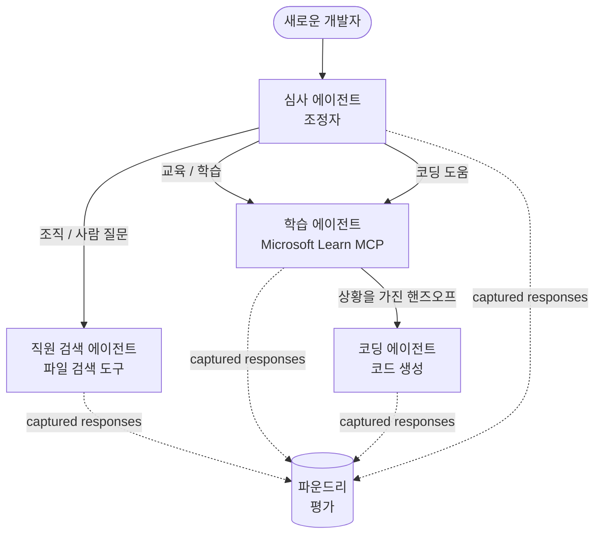

# 레슨 3: Microsoft Foundry를 사용한 에이전트 평가

**"제로부터 프로덕션까지 AI 에이전트 구축"** 코스의 세 번째 레슨에 오신 것을 환영합니다!

[레슨 2](../lesson-2-agent-development/README.md)에서 에이전트를 만들었습니다. 이번 레슨에서는
훨씬 더 어려운 질문에 답하는 방법을 배웁니다: **에이전트가 제대로 작동하는가?** 에이전트를 배포하는 것은 쉽습니다;
에이전트가 올바르게 경로를 찾고, 데이터에 기반하며 도구를 제대로 사용하는지 아는 것이 데모와 프로덕션 시스템을 구분합니다.


이번 레슨에서는 다음 내용을 다룹니다:

- 에이전트 평가가 중요한 이유와 전통적인 테스트와의 차이점
- <strong>관찰성</strong>, **스모크 테스트**, 그리고 <strong>평가</strong>의 차이점
- 우리가 측정할 멀티 에이전트 워크플로우
- 내장된 **Microsoft Foundry 평가자** (적합성, 근거성, 도구 호출 정확도, 도구 출력 활용도)
- [`agent-evals.py`](../../../lesson-3-agent-evals/agent-evals.py)에서 평가 파이프라인을 단계별로 살펴보기
- 실행 방법과 결과 읽기

---

## 왜 에이전트를 평가해야 하는가?

전통적인 단위 테스트는 `add(2, 2) == 4`를 단언합니다. 에이전트는 그렇게 작동하지 않습니다 — 같은
프롬프트라도 실행할 때마다 다른 표현을 생성하고, 도구는 다른 순서로 호출될 수 있으며,
"정확함"은 종종 불리언이 아닌 정도의 문제입니다. 정확한 문자열을 단언할 수 없습니다.

대신, 에이전트는 모델 기반 <em>평가자</em> (또는 "판사 역할의 LLM")와 도구 사용에 대한 결정적 검사로 <strong>품질 차원</strong>에서 평가합니다.
이로써 다음과 같은 것을 알 수 있습니다:

- 답변이 실제로 질문에 응답했는가? (<strong>적합성</strong>)
- 답변이 가져온 데이터에 기반하는가, 아니면 에이전트가 환각을 일으켰는가? (<strong>근거성</strong>)
- 에이전트가 올바른 도구를 올바른 인수로 호출했는가? (**도구 호출 정확도**)
- 에이전트가 도구가 반환한 결과를 실제로 활용했는가? (**도구 출력 활용도**)

### 세 가지 보완적 품질 계층

이것들은 경쟁하는 기술이 아닙니다 — 프로덕션 에이전트는 세 가지 모두를 사용합니다:

| 계층 | 답변하는 질문 | 비용 | 실행 시점 | 포함된 레슨 |
|-------|--------------------|------|--------------|------------|
| **관찰성 / 추적** | *에이전트가 단계별로 무엇을 했는가?* | 무료(항상 켜짐) | 프로덕션에서 연속 실행 | 이 레슨 |
| **스모크 테스트** | *에이전트에 접근 가능하고 기본 프롬프트를 따르는가?* | 저렴, 몇 초 | 매 배포 시 | [레슨 4](../lesson-4-agentdeployment/README.md#smoke-testing-the-hosted-agent-ci-gate) |
| <strong>평가</strong> | *응답은 얼마나 <strong>좋은가</strong>?* | 느림, 모델 사용량에 의존 | 요청 시 / 야간 / 사전 출시 | 이 레슨 |

스모크 테스트는 "작동이 중단되었는가?"에 답하고, 평가는 "좋은가?"에 답합니다. 둘 다 필요합니다.

---

## 사전 준비 사항

1. [레슨 2](../lesson-2-agent-development/README.md) 완료 (에이전트 + 벡터 스토어).
2. **Microsoft Foundry** 프로젝트.
3. **Azure CLI** 인증: `az login`.
4. **Python 3.12+** 및 코스 의존성 설치:

   ```bash
   pip install -r ../requirements.txt
   ```

5. 환경 변수 (이 폴더에 `.env` 파일을 생성하거나 환경변수로 설정):

   | 변수 | 용도 |
   |----------|---------|
   | `FOUNDRY_PROJECT_ENDPOINT` | Foundry 프로젝트 엔드포인트 (`https://<account>.services.ai.azure.com/api/projects/<project>`) 입니다. 에이전트의 `FoundryChatClient` <strong>및</strong> 평가 도우미가 읽습니다. |
   | `FOUNDRY_MODEL` | <strong>에이전트</strong>가 사용하는 모델 배포 (예: `gpt-5.1`). |
   | `VECTOR_STORE_ID` | 레슨 2에서 생성한 직원 디렉토리 벡터 스토어 |
   | `AZURE_AI_MODEL_DEPLOYMENT_NAME` | <strong>평가자가</strong> 사용하는 모델 배포 (기본값은 `FOUNDRY_MODEL`, 그 다음 `gpt-5.1`) |

> 에이전트는 `FoundryChatClient`를 사용하며, 이 클라이언트는 `FOUNDRY_` 접두사가 붙은
> 변수들 (`FOUNDRY_PROJECT_ENDPOINT`, `FOUNDRY_MODEL`)을 읽습니다. 클라우드 평가 도우미는
> `azure-ai-projects` SDK를 사용하며, `AZURE_AI_PROJECT_ENDPOINT`가 설정되지 않으면
> `FOUNDRY_PROJECT_ENDPOINT`로 대체하므로 두 개의 `FOUNDRY_` 변수만으로
> 전체 레슨을 실행할 수 있습니다.
>
> 평가자는 자체적으로 모델에 의해 구동되므로 `AZURE_AI_MODEL_DEPLOYMENT_NAME`
> 은 평가를 담당하는 배포를 제어합니다 — 이것이 에이전트가 사용하는 모델과 다를 수 있습니다.


---

## 우리가 평가할 워크플로우

무언가를 평가하려면 먼저 실행해야 합니다. 이번 레슨은 **개발자 온보딩**
멀티 에이전트 워크플로우를 재사용합니다: <strong>트리아지</strong> 코디네이터가 세 명의 전문가에게 작업을 넘깁니다.



이 워크플로우는 Microsoft Agent Framework의 **handoff** 오케스트레이션으로 구축됩니다. 평가의 핵심
아이디어는 <strong>모든 에이전트 턴을 서버 측에 저장</strong>하고 `response_id`로 식별하는 것입니다.
이 ID를 평가 서비스에 넘깁니다.

---

## 평가 파이프라인, 단계별 설명

[`agent-evals.py`](../../../lesson-3-agent-evals/agent-evals.py)는 6단계 파이프라인을 구현합니다. 각 단계가 무엇을 하고 왜 하는지 소개합니다.


### 1단계 — 워크플로우 실행 및 응답 ID 추적

워크플로우는 `run_stream(...)`로 실행되고, 이벤트가 스트리밍되면서 코드가 각 에이전트가 생성한
`response_id`와 `conversation_id`를 기록합니다. 저장된 응답은 평가의 원자료입니다 — 재생성된 것이 아니라 <em>실제</em> 프로덕션 형태의 응답을 평가합니다.


워크플로우가 평가할 에이전트를 실제로 사용했는지 확인할 수 있습니다.


### 3단계 — 최종 응답 가져오기

각 에이전트의 마지막 `response_id`를 프로젝트의 OpenAI 호환 클라이언트
(`project_client.get_openai_client().responses.retrieve(...)`)를 통해 가져와 평가할 텍스트를 미리 볼 수 있습니다.


### 4단계 — 평가 생성

평가는 네 가지 <strong>내장된 Foundry 평가자</strong>로 생성됩니다:

| 평가자 | `evaluator_name` | 측정 내용 |
|-----------|------------------|------------------|
| 적합성 | `builtin.relevance` | 응답이 사용자의 요청에 부합하는가? |

| 근거 기반 여부 | `builtin.groundedness` | 응답이 검색된/도구 데이터에 의해 뒷받침되었나요(환각이 아닌가요)? |
| 도구 호출 정확도 | `builtin.tool_call_accuracy` | 올바른 도구가 올바른 인수와 함께 호출되었나요? |
| 도구 출력 활용도 | `builtin.tool_output_utilization` | 에이전트가 실제로 도구 결과를 답변에 사용했나요? |

각 평가자는 `AZURE_AI_MODEL_DEPLOYMENT_NAME`으로 명명된 배포로 초기화됩니다.

> **왜 이 네 가지인가요?** 관련성과 근거 기반 여부는 <em>답변의 질</em>을 측정합니다; 두 가지 도구
> 평가자는 <em>에이전트 행동성</em>을 측정합니다 — 이는 기존 NLP 지표들이 전혀 잡아내지 못하는 부분입니다. 도구를 사용하는
> 다중 에이전트 시스템에서 도구 지표는 종종 실제 성능 저하가 숨겨져 있는 곳입니다.

### 5단계 — 평가 실행

캡처된 `response_id`들이 데이터 소스로 `evals.runs.create(...)`에 전달됩니다. 서비스는 저장된 각 응답을 모든 평가자에 다시 재생합니다.


### 6단계 — 결과 모니터링 및 확인

코드는 실행이 `completed` 또는 `failed` 상태가 될 때까지 폴링한 다음 결과 카운트와
**`report_url`** — 메트릭별 점수, 합격/불합격 수, 개별 평가된 응답을 확인할 수 있는 Foundry 포털의 깊은 링크를 출력합니다.


---

## 실행하기

```bash
cd lesson-3-agent-evals
python agent-evals.py
```

기본값으로 첫 번째 예제 쿼리
(`"저는 여기 처음입니다! 여기 Microsoft에서 일해본 사람이 있나요?"`)를 평가합니다. 더 많은 다중 의도 예제 쿼리 두 개가
`run_evaluation_workflow()`에 포함되어 있습니다 — `query` 변수를 바꿔서
한 번의 실행으로 더 많은 에이전트를 사용하는 라우팅 시나리오를 시험해 보세요.

예상 콘솔 흐름:

```
Step 1: Running Developer Onboarding Workflow
Step 2: Response Data Summary
Step 3: Fetching Agent Responses
Step 4: Creating Evaluation
Step 5: Running Evaluation
Step 6: Monitoring Evaluation
  Status: running ...
  Evaluation completed successfully
  Report URL: https://...   <-- open this in the Foundry portal
```

---

## 관찰 가능성과 추적

평가는 응답이 *얼마나 좋은지* 알려줍니다; <strong>관찰 가능성</strong>은 그 응답을 만들기 위해 *무슨 일이 일어났는지* 알려줍니다 — 모든 에이전트 홉, 도구 호출, 토큰 수, 지연 시간까지. Microsoft Foundry에서,
에이전트 실행은 포털에서 볼 수 있는 OpenTelemetry 추적을 방출하며, Agent Framework는 단일 호출로 Azure Monitor / Application Insights에
추적을 내보낼 수 있습니다:


평가 점수가 낮을 때 추적을 사용해 <strong>디버그</strong> 해보세요: 근거 기반 점수가 떨어지면, 추적이 파일 검색 도구가 아무 것도 반환하지 않았는지, 아니면 데이터를 반환했으나 에이전트가 무시했는지 보여줍니다(이것이 바로 도구 출력 활용도가 점수화하는 부분입니다).


---

## "실행"에서 "좋음"으로: 실제 사용 방법

- **사전 릴리스 게이트.** 새로운 프롬프트나 모델을 승격하기 전에 대표 쿼리 고정 세트를 대상으로 평가를 실행하세요. 점수를 이전 버전과 비교하고 하락은
  회귀로 간주하세요.
- **야간 품질 신호.** 데이터나 의존성 변경으로 인한 드리프트를 잡기 위해 평가를 예약하세요.
- **스모크 테스트와 함께 사용.** [레슨 4 스모크 테스트](../lesson-4-agentdeployment/README.md#smoke-testing-the-hosted-agent-ci-gate)
  는 빠른 배포별 게이트 역할을 합니다; 평가는 느리지만 더 깊은 품질 게이트입니다. 저렴한 테스트는 모든 머지마다, 고비용 테스트는 일정에 따라 또는 릴리스 전에 실행하세요.


---

## 현대화 참고 사항

이 샘플은 현재 Microsoft Agent Framework Foundry API 표면(`agent_framework.foundry`)로 마이그레이션 중입니다. 코드를 업데이트하는 경우, 저장소 루트의
[`MIGRATION-GUIDE.md`](../MIGRATION-GUIDE.md)를 참조하여 검증된 이전/이후 import 및 클라이언트 매핑(예: `AzureAIClient` -> `FoundryChatClient`, 각종 호스팅 도구 구성 시
`client.get_file_search_tool(...)` / `client.get_mcp_tool(...)` 사용)을 확인하세요. 평가 개념과 위의 6단계 파이프라인은 해당 마이그레이션에 영향을 받지 않습니다.


---

## 자료

- [생성형 AI 모델 및 애플리케이션 평가 (Microsoft Learn)](https://learn.microsoft.com/en-us/azure/ai-foundry/concepts/evaluation-approach-gen-ai)
- [생성형 AI 용 내장 평가자](https://learn.microsoft.com/en-us/azure/ai-foundry/concepts/evaluation-evaluators/agent-evaluators)
- [Microsoft Foundry의 관찰 가능성](https://learn.microsoft.com/en-us/azure/ai-foundry/concepts/observability)
- [Microsoft Agent Framework](https://github.com/microsoft/agent-framework)
- [에이전트 인계 오케스트레이션](https://learn.microsoft.com/en-us/agent-framework/workflows/orchestrations/handoff)

---

<!-- CO-OP TRANSLATOR DISCLAIMER START -->
**면책 조항**:
이 문서는 AI 번역 서비스 [Co-op Translator](https://github.com/Azure/co-op-translator)를 사용하여 번역되었습니다. 정확성을 기하기 위해 노력하고 있으나, 자동 번역은 오류나 부정확한 부분이 있을 수 있음을 유의하시기 바랍니다. 원본 문서의 원어본이 권위 있는 자료로 간주되어야 합니다. 중요한 정보의 경우, 전문가의 인간 번역을 권장합니다. 이 번역 사용으로 인해 발생하는 오해나 잘못된 해석에 대해 당사는 책임을 지지 않습니다.
<!-- CO-OP TRANSLATOR DISCLAIMER END -->