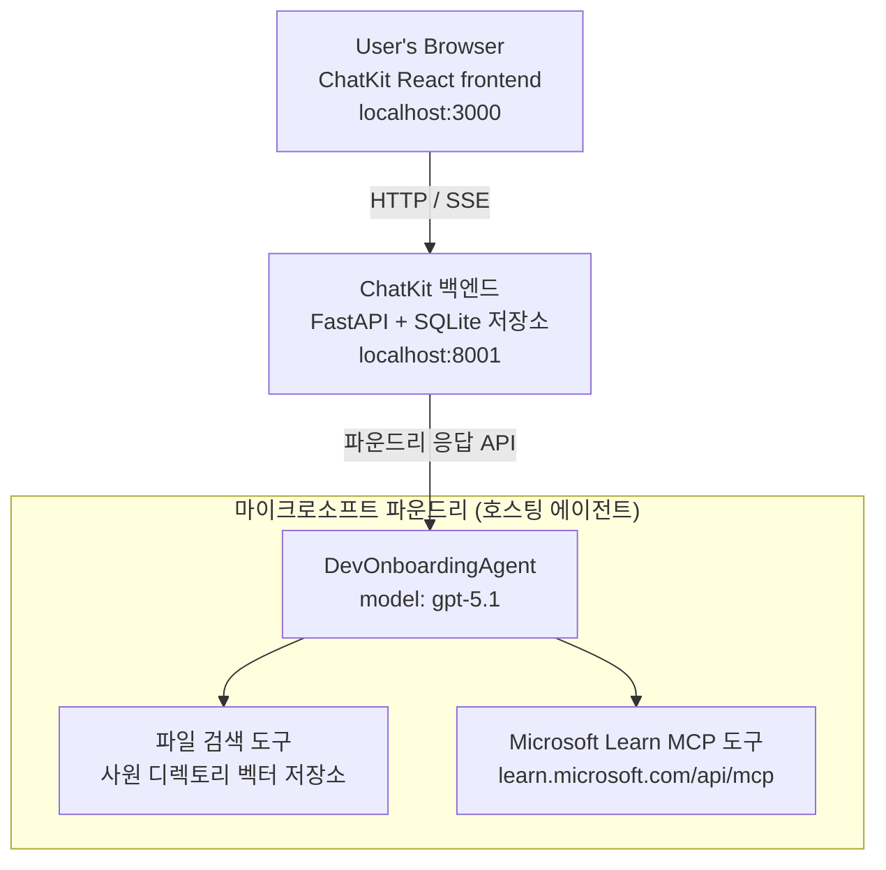

# 4과: Microsoft Foundry 호스팅 에이전트 및 ChatKit을 이용한 에이전트 배포

이 강의에서는 도구를 사용하는 에이전트를 Microsoft Foundry에 호스팅 에이전트로 배포하고, 이를 조작할 ChatKit 기반 프런트엔드를 만드는 방법을 설명합니다.

## 아키텍처

호스팅 에이전트는 **단일 `DevOnboardingAgent`** (`gpt-5.1`에서 실행됨)로, 직원 디렉터리 벡터 스토어 위의 **파일 검색** 도구와 **Microsoft Learn MCP** 도구 두 가지 호스팅 도구를 사용하여 개발자 온보딩 질문에 답변합니다. ChatKit React 프런트엔드는 FastAPI 백엔드와 통신하며, 백엔드는 Foundry의 <strong>Responses API</strong>를 통해 에이전트와 연결됩니다.



## 전제 조건

1. 북중부 미국 지역에 위치한 **Microsoft Foundry 프로젝트**
2. 인증된 **Azure CLI** (`az login`)
3. 설치된 **Azure Developer CLI** (`azd`)
4. **Python 3.12+**, **Node.js 18+**
5. 직원 데이터로 생성된 **벡터 스토어**

## 빠른 시작

### 1. 환경 변수 설정

```bash
cd lesson-4-agentdeployment
cp .env.example .env
# Microsoft Foundry 프로젝트 세부 정보를 사용하여 .env를 수정하세요
```

### 2. 호스팅 에이전트 배포

**옵션 A: Azure Developer CLI 사용 (권장)**

```bash
cd hosted-agent
azd auth login
azd agent deploy
```

**옵션 B: Docker + Azure Container Registry 사용**

```bash
cd hosted-agent

# 컨테이너 빌드
docker build -t developer-onboarding-agent:latest .

# ACR용 태그
docker tag developer-onboarding-agent:latest <your-acr>.azurecr.io/developer-onboarding-agent:latest

# ACR로 푸시
az acr login --name <your-acr>
docker push <your-acr>.azurecr.io/developer-onboarding-agent:latest

# Microsoft Foundry 포털 또는 SDK를 통해 배포
```

### 3. ChatKit 백엔드 시작

```bash
cd chatkit-server
python -m venv .venv
source .venv/bin/activate  # 윈도우에서: .venv\Scripts\activate
pip install -r requirements.txt
python app.py
```

서버가 `http://localhost:8001` 에서 시작됩니다

### 4. ChatKit 프런트엔드 시작

```bash
cd chatkit-server/frontend
npm install
npm run dev
```

프런트엔드가 `http://localhost:3000` 에서 시작됩니다

### 5. 애플리케이션 테스트

브라우저에서 `http://localhost:3000` 을 열고 다음 쿼리를 시도해보세요:

**직원 검색:**
- "저는 신입입니다! 마이크로소프트에서 일한 사람이 있나요?"
- "Azure Functions 경험이 있는 사람은 누구인가요?"

**학습 자료:**
- "Kubernetes 학습 경로를 만들어 주세요"
- "클라우드 아키텍처를 위한 어떤 자격증을 취득해야 하나요?"

**코딩 도움말:**
- "CosmosDB 연결을 위한 Python 코드 작성 도와주세요"
- "Azure Function 만드는 방법을 보여주세요"

**다중 에이전트 쿼리:**
- "클라우드 엔지니어로 시작하는데 누구와 연결해야 하고 무엇을 배워야 하나요?"

## 프로젝트 구조

```
lesson-4-agentdeployment/
├── .env.example                 # Environment variables template
├── implementation-plan.md       # Detailed implementation guide
├── README.md                    # This file
├── hosted-agent/               # Microsoft Foundry hosted agent
│   ├── main.py                 # Multi-agent workflow implementation
│   ├── requirements.txt        # Python dependencies
│   ├── Dockerfile              # Container definition
│   └── agent.yaml              # Agent deployment configuration
└── chatkit-server/             # ChatKit server application
    ├── app.py                  # FastAPI backend
    ├── store.py                # SQLite persistence layer
    ├── requirements.txt        # Python dependencies
    └── frontend/               # React frontend
        ├── package.json
        ├── vite.config.ts
        ├── tsconfig.json
        ├── index.html
        └── src/
            ├── main.tsx
            ├── App.tsx
            ├── App.css
            └── index.css
```

## 에이전트와 도구

호스팅 에이전트는 세 가지 온보딩 도메인을 처리하는 **단일 에이전트** (`DevOnboardingAgent`, `hosted-agent/main.py`에 정의됨)입니다. 별도의 하위 에이전트를 조율하는 대신, 각 기능을 도구로 노출하거나 (또는 모델에 직접 의존) 합니다:

| 기능 | 처리 방식 | 도구 |
|-----------|------------------|------|
| **직원 검색 및 연결** | 직원 디렉터리 벡터 스토어에 대한 Foundry 호스팅 파일 검색 | `client.get_file_search_tool(vector_store_ids=[...])` |
| **학습 및 교육** | Microsoft Learn MCP 서버 (호스팅 MCP 도구) | `client.get_mcp_tool(url="https://learn.microsoft.com/api/mcp")` |
| **코딩 지원** | `gpt-5.1` 모델이 직접 처리 — 외부 도구 없음 | — |

에이전트는 `client.as_agent(name="DevOnboardingAgent", instructions=..., tools=[file_search_tool, learn_mcp_tool])` 로 생성되고 `from_agent_framework(agent).run()` 으로 제공됩니다.

> **설계 노트.** 이전 강의 초안은 `HandoffBuilder` 다중 에이전트 워크플로우(분류 → 전문가) 방식을 사용했습니다. 현재 배포된 에이전트는 단일 도구 사용 에이전트로, 온보딩 스타일 Q&A에 대해 배포와 이해가 더 쉽습니다. 다중 에이전트 조율 및 핸드오프 예시는 2과와 3과를 참고하세요.

## 호스팅 에이전트 스모크 테스트 (CI 게이트)

호스팅 에이전트를 "성공적으로" 배포했다는 것은 제어 평면이 정의를 수락했다는 것뿐이며,
에이전트가 실제로 응답한다는 것을 증명하지는 않습니다. 누락된 종속성,
잘못된 모델 라우팅 또는 만료된 연결이 침묵하는 녹색 상태의 에이전트를 만들 수 있습니다.

이 강의에서는 경량의 <strong>스모크 테스트</strong>를 제공하여 배포 후 빠르고 저렴한 게이트 역할을 합니다.
이 테스트는 GitHub Action인 [AI Smoke Test](https://github.com/marketplace/actions/ai-smoke-test)를 사용하여 에이전트의 Foundry **Responses** 엔드포인트
(`POST {project_endpoint}/agents/{agent_name}/endpoint/protocols/openai/responses`) 에 프롬프트를 POST하고
반환된 텍스트를 검증합니다. 손상된 배포, 인증 회귀,
시스템 프롬프트 변이 및 쓰레딩 오류를 몇 초 내에 잡아냅니다.


> 스모크 테스트는 [Lesson 3](../lesson-3-agent-evals/README.md)의 전체 평가를
> 대신하지 않습니다 — 보완용입니다. 스모크 테스트는 *"에이전트가 도달 가능하고, 응답하며, 기본 프롬프트 기대를 따르는가?"* 를 답하며;
> 평가는 *"응답의 질은 어떠한가?"* 를 평가합니다. 모든 배포마다 저렴한 게이트를 실행하세요.


### 테스트 항목

테스트 카탈로그는 [`hosted-agent/tests/smoke-tests.json`](../../../lesson-4-agentdeployment/hosted-agent/tests/smoke-tests.json)에 있으며
세 도메인과 프롬프트 준수 및 다중 턴 쓰레딩을 다룹니다:

| 테스트 | 검증 내용 |
|------|------------------|
| `reachability` | 에이전트가 비어 있지 않고 적절한 텍스트로 응답 |
| `employee-search` | 파일 검색 도메인이 건강한 `200` 응답 반환 (`reply`는 데이터 종속) |
| `learning-path` | 학습 도메인이 주제를 되풀이하고 경로 스타일 답변 생성 |
| `coding-assistance` | 코딩 도메인이 코드 형태의 Python 답변 반환 |
| `prompt-adherence-offtopic` | 주제와 벗어난 요청은 자세히 답변하지 않고 리디렉션 됨 |
| `threading-turn-1/2` | 이전 응답 ID를 통해 대화 상태가 턴마다 유지됨 |

### CI에서 실행하기

[`.github/workflows/smoke-test-hosted-agent.yml`](../../../.github/workflows/smoke-test-hosted-agent.yml) 워크플로우는 두 개의 잡을 포함합니다:


- **`static`** — 각 풀 리퀘스트와 푸시에 실행되는 빠르고 Azure 연결이 필요 없는 게이트:
  모든 Python 소스를 컴파일(`py_compile`)하고 Markdown 링크를 검사합니다. 비밀 정보가 필요 없어 포크 PR에서도 동작합니다.
- **`smoke`** — Azure 연결이 된 아래 스모크 테스트입니다. 필요할 때 실행하며
  (Actions → **Agent CI (static + smoke)** → Run workflow) 배포 워크플로우 뒤에 연쇄 실행할 수도 있습니다.


스모크 잡을 위해 다음 저장소 <strong>변수</strong> 및 <strong>시크릿</strong>을 설정하세요:

| 유형 | 이름 | 값 |
|------|------|-------|

| 변수 | `FOUNDRY_PROJECT_ENDPOINT` | `https://<account>.services.ai.azure.com/api/projects/<project>` |
| 변수 | `HOSTED_AGENT_NAME` | 배포된 에이전트 이름 (예: `dev-onboarding` — 배포와 일치해야 함) |
| 비밀 | `AZURE_CLIENT_ID` / `AZURE_TENANT_ID` / `AZURE_SUBSCRIPTION_ID` | `azure/login` 용 OIDC 연동 아이덴티티 |

런너 아이덴티티에는 Responses(및 대화) 데이터 평면 엔드포인트를 호출할 수 있도록 <strong>Foundry 프로젝트 범위</strong>에서 **`Azure AI User`** 역할이 필요합니다. 다음 권한을 부여하세요:


```bash
az role assignment create \
  --assignee <object-id-or-appId-of-runner-identity> \
  --role "Azure AI User" \
  --scope "/subscriptions/<sub>/resourceGroups/<rg>/providers/Microsoft.CognitiveServices/accounts/<account>/projects/<project>"
```

### 로컬에서 실행하기

푸시하기 전에 동일한 카탈로그를 실행할 수 있습니다. `https://ai.azure.com/` 범위의 데이터 평면 토큰을 획득하고 런너를 배포 위치에 지정하세요:


```bash
# Audience는 반드시 https://ai.azure.com/ 이어야 합니다 (cognitiveservices.azure.com 토큰은 거부됩니다)
export FOUNDRY_TOKEN=$(az account get-access-token --resource https://ai.azure.com/ --query accessToken -o tsv)

git clone https://github.com/JFolberth/ai-smoketest && cd ai-smoketest
python runner.py \
  --project-endpoint "https://<account>.services.ai.azure.com/api/projects/<project>" \
  --agent-name dev-onboarding \
  --tests-file ../lesson-4-agentdeployment/hosted-agent/tests/smoke-tests.json
```

종료 코드: `0` 모두 통과, `1` 어설션 실패, `2` 런너 오류(잘못된 카탈로그/토큰).

## 문제 해결

### 에이전트가 응답하지 않는 경우
- Microsoft Foundry에 호스팅된 에이전트가 배포되어 실행 중인지 확인하세요
- `HOSTED_AGENT_NAME`과 `HOSTED_AGENT_VERSION`이 배포와 일치하는지 확인하세요

### 벡터 저장소 오류
- `VECTOR_STORE_ID`가 정확히 설정되었는지 확인하세요
- 벡터 저장소에 직원 데이터가 포함되어 있는지 확인하세요

### 인증 오류
- 자격 증명을 갱신하려면 `az login`을 실행하세요
- Microsoft Foundry 프로젝트에 접근 권한이 있는지 확인하세요

## 참고 자료

- [Microsoft Foundry 호스팅 에이전트 문서](https://learn.microsoft.com/en-us/azure/ai-foundry/agents/concepts/hosted-agents)
- [Microsoft 에이전트 프레임워크](https://github.com/microsoft/agent-framework)
- [ChatKit 통합 샘플](https://github.com/microsoft/agent-framework/tree/main/python/samples/demos/chatkit-integration)
- [Azure 개발자 CLI](https://learn.microsoft.com/en-us/azure/developer/azure-developer-cli/overview)
- [AI 스모크 테스트 GitHub 액션](https://github.com/marketplace/actions/ai-smoke-test)
- [GitHub Actions를 이용한 Microsoft Foundry 에이전트 스모크 테스트 (블로그)](https://techcommunity.microsoft.com/blog/azuredevcommunityblog/smoke-test-microsoft-foundry-agents-with-github-actions/4531912)

---

## 다음 단계

귀하의 에이전트는 Microsoft가 관리하는 인프라에서 실행됩니다. 이를 엔터프라이즈 프로덕션 환경으로 확장하려면 —
데이터 위치 통제(데이터 주권, 프라이빗 네트워킹, 직접 Azure Cosmos DB / Storage / AI Search 사용) 및 도구 관리를 위하여 —
계속해서 **[Lesson 5: Production Hosted Agents](../lesson-5-hosted-agents-production/README.md)** 을 진행하시기 바랍니다.

이 강의는 <strong>Hosted Agents</strong>와 **Capability Hosts** 간의 중요한 차이를 설명합니다.

---

<!-- CO-OP TRANSLATOR DISCLAIMER START -->
**면책 조항**:
이 문서는 AI 번역 서비스 [Co-op Translator](https://github.com/Azure/co-op-translator)를 사용하여 번역되었습니다. 정확성을 기하기 위해 노력하고 있으나, 자동 번역은 오류나 부정확한 부분이 있을 수 있음을 유의하시기 바랍니다. 원본 문서의 원어본이 권위 있는 자료로 간주되어야 합니다. 중요한 정보의 경우, 전문가의 인간 번역을 권장합니다. 이 번역 사용으로 인해 발생하는 오해나 잘못된 해석에 대해 당사는 책임을 지지 않습니다.
<!-- CO-OP TRANSLATOR DISCLAIMER END -->