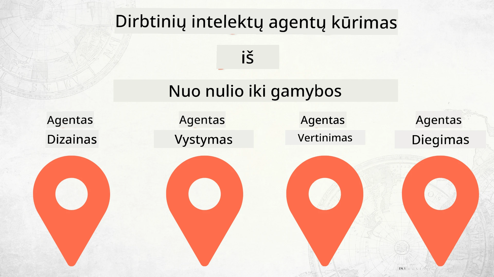

# AI agentų kūrimas nuo nulio iki produkcijos



### 🌐 Daugialypė kalbų palaikymas

#### Palaikoma per GitHub Action (automatiškai ir visada atnaujinta)

<!-- CO-OP TRANSLATOR LANGUAGES TABLE START -->
[Arabic](../ar/README.md) | [Bengali](../bn/README.md) | [Bulgarian](../bg/README.md) | [Burmese (Myanmar)](../my/README.md) | [Chinese (Simplified)](../zh-CN/README.md) | [Chinese (Traditional, Hong Kong)](../zh-HK/README.md) | [Chinese (Traditional, Macau)](../zh-MO/README.md) | [Chinese (Traditional, Taiwan)](../zh-TW/README.md) | [Croatian](../hr/README.md) | [Czech](../cs/README.md) | [Danish](../da/README.md) | [Dutch](../nl/README.md) | [Estonian](../et/README.md) | [Finnish](../fi/README.md) | [French](../fr/README.md) | [German](../de/README.md) | [Greek](../el/README.md) | [Hebrew](../he/README.md) | [Hindi](../hi/README.md) | [Hungarian](../hu/README.md) | [Indonesian](../id/README.md) | [Italian](../it/README.md) | [Japanese](../ja/README.md) | [Kannada](../kn/README.md) | [Korean](../ko/README.md) | [Lithuanian](./README.md) | [Malay](../ms/README.md) | [Malayalam](../ml/README.md) | [Marathi](../mr/README.md) | [Nepali](../ne/README.md) | [Nigerian Pidgin](../pcm/README.md) | [Norwegian](../no/README.md) | [Persian (Farsi)](../fa/README.md) | [Polish](../pl/README.md) | [Portuguese (Brazil)](../pt-BR/README.md) | [Portuguese (Portugal)](../pt-PT/README.md) | [Punjabi (Gurmukhi)](../pa/README.md) | [Romanian](../ro/README.md) | [Russian](../ru/README.md) | [Serbian (Cyrillic)](../sr/README.md) | [Slovak](../sk/README.md) | [Slovenian](../sl/README.md) | [Spanish](../es/README.md) | [Swahili](../sw/README.md) | [Swedish](../sv/README.md) | [Tagalog (Filipino)](../tl/README.md) | [Tamil](../ta/README.md) | [Telugu](../te/README.md) | [Thai](../th/README.md) | [Turkish](../tr/README.md) | [Ukrainian](../uk/README.md) | [Urdu](../ur/README.md) | [Vietnamese](../vi/README.md)

> **Norite klonuoti lokaliai?**
>
> Šis saugykla apima daugiau nei 50 kalbų vertimų, kurie žymiai padidina atsisiuntimo dydį. Jei norite klonuoti be vertimų, naudokite sparse checkout:
>
> **Bash / macOS / Linux:**
> ```bash
> git clone --filter=blob:none --sparse https://github.com/microsoft/Building-AI-Agents-From-Zero-To-Production.git
> cd Building-AI-Agents-From-Zero-To-Production
> git sparse-checkout set --no-cone '/*' '!translations' '!translated_images'
> ```
>
> **CMD (Windows):**
> ```cmd
> git clone --filter=blob:none --sparse https://github.com/microsoft/Building-AI-Agents-From-Zero-To-Production.git
> cd Building-AI-Agents-From-Zero-To-Production
> git sparse-checkout set --no-cone "/*" "!translations" "!translated_images"
> ```
>
> Tai suteiks jums viską, ko reikia kursui įvykdyti, su daug greitesniu atsisiuntimu.
<!-- CO-OP TRANSLATOR LANGUAGES TABLE END -->

## Kursas, mokantis AI agentų kūrimo pagrindų

[](https://github.com/microsoft/Building-AI-Agents-From-Zero-To-Production/blob/master/LICENSE?WT.mc_id=academic-105485-koreyst)
[](https://GitHub.com/microsoft/Building-AI-Agents-From-Zero-To-Production/graphs/contributors/?WT.mc_id=academic-105485-koreyst)
[](https://GitHub.com/microsoft/Building-AI-Agents-From-Zero-To-Production/issues/?WT.mc_id=academic-105485-koreyst)
[](https://GitHub.com/microsoft/Building-AI-Agents-From-Zero-To-Production/pulls/?WT.mc_id=academic-105485-koreyst)
[](http://makeapullrequest.com?WT.mc_id=academic-105485-koreyst)

[](https://discord.gg/Kuaw3ktsu6)

## 🌱 Pradžia

Šiame kurse yra pamokos, apimančios AI agentų kūrimo ir diegimo pagrindus.

Kiekviena pamoka remiasi ankstesne, todėl rekomenduojame pradėti nuo pradžios ir žingsnis po žingsnio eiti iki pabaigos.

Jei norite daugiau sužinoti apie AI agentų temas, galite peržiūrėti [AI agentų pradedantiesiems kursą](https://aka.ms/ai-agents-beginners).

### Susipažinkite su kitais besimokančiais, gaukite atsakymus į klausimus

Jei užstrigote ar turite klausimų apie AI agentų kūrimą, prisijunkite prie mūsų specialaus Discord kanalo [Microsoft Foundry Discord](https://discord.gg/Kuaw3ktsu6).

### Ko jums reikia

Kiekviena pamoka turi savo kodo pavyzdį, kurį galite paleisti lokaliai. Galite [padaryti fork’ą šių saugyklos](https://github.com/microsoft/Building-AI-Agents-From-Zero-To-Production/fork) ir sukurti savo kopiją.

Šis kursas šiuo metu naudoja šias priemones:

- [Microsoft Agent Framework (MAF)](https://aka.ms/ai-agents-beginners/agent-framework)
- [Microsoft Foundry](https://azure.microsoft.com/products/ai-foundry)
- [Azure OpenAI Service](https://azure.microsoft.com/products/ai-foundry/models/openai)
- [Azure CLI](https://learn.microsoft.com/cli/azure/authenticate-azure-cli?view=azure-cli-latest)

Prašome prieš pradėdami įsitikinti, kad turite prieigą prie šių paslaugų.

Netolimoje ateityje bus siūlomos papildomos galimybės modelių talpinimui ir paslaugoms. 

## 🗃️ Pamokos

| **Pamoka**         | **Aprašymas**                                                                                  |
|--------------------|--------------------------------------------------------------------------------------------------|
| [Agentų dizainas](./lesson-1-agent-design/README.md)       | Įvadas į mūsų „Vystymo pradžios“ AI agentų naudojimo atvejį ir kaip kurti efektyvius agentus  |
| [Agentų kūrimas](./lesson-2-agent-development/README.md)  | Naudojant Microsoft Agent Framework (MAF), sukurkite 3 agentus, padedančius naujiems kūrėjams.       |
| [Agentų vertinimai](./lesson-3-agent-evals/README.md)  | Naudojant Microsoft Foundry sužinokite, kaip gerai veikia mūsų AI agentai ir kaip juos patobulinti. |
| [Agentų diegimas](./lesson-4-agent-deployment/README.md)   | Naudojant talpinamus agentus ir OpenAI Chatkit, sužinokite, kaip įdiegti AI agentą į produkciją.       |


## 🎒 Kiti kursai

Mūsų komanda kuria ir kitus kursus! Pažiūrėkite:

<!-- CO-OP TRANSLATOR OTHER COURSES START -->
### LangChain
[](https://aka.ms/langchain4j-for-beginners)
[](https://aka.ms/langchainjs-for-beginners?WT.mc_id=m365-94501-dwahlin)
[](https://github.com/microsoft/langchain-for-beginners?WT.mc_id=m365-94501-dwahlin)
---

### Azure / Edge / MCP / Agentai
[](https://github.com/microsoft/AZD-for-beginners?WT.mc_id=academic-105485-koreyst)
[](https://github.com/microsoft/edgeai-for-beginners?WT.mc_id=academic-105485-koreyst)
[](https://github.com/microsoft/mcp-for-beginners?WT.mc_id=academic-105485-koreyst)
[](https://github.com/microsoft/ai-agents-for-beginners?WT.mc_id=academic-105485-koreyst)

---
 
### Generatyvioji AI serija
[](https://github.com/microsoft/generative-ai-for-beginners?WT.mc_id=academic-105485-koreyst)
[-9333EA?style=for-the-badge&labelColor=E5E7EB&color=9333EA)](https://github.com/microsoft/Generative-AI-for-beginners-dotnet?WT.mc_id=academic-105485-koreyst)
[-C084FC?style=for-the-badge&labelColor=E5E7EB&color=C084FC)](https://github.com/microsoft/generative-ai-for-beginners-java?WT.mc_id=academic-105485-koreyst)
[-E879F9?style=for-the-badge&labelColor=E5E7EB&color=E879F9)](https://github.com/microsoft/generative-ai-with-javascript?WT.mc_id=academic-105485-koreyst)

---
 
### Pagrindinis mokymasis
[](https://aka.ms/ml-beginners?WT.mc_id=academic-105485-koreyst)
[](https://aka.ms/datascience-beginners?WT.mc_id=academic-105485-koreyst)
[](https://aka.ms/ai-beginners?WT.mc_id=academic-105485-koreyst)
[](https://github.com/microsoft/Security-101?WT.mc_id=academic-96948-sayoung)
[](https://aka.ms/webdev-beginners?WT.mc_id=academic-105485-koreyst)
[](https://aka.ms/iot-beginners?WT.mc_id=academic-105485-koreyst)
[](https://github.com/microsoft/xr-development-for-beginners?WT.mc_id=academic-105485-koreyst)

---
 
### „Copilot“ serija
[](https://aka.ms/GitHubCopilotAI?WT.mc_id=academic-105485-koreyst)
[](https://github.com/microsoft/mastering-github-copilot-for-dotnet-csharp-developers?WT.mc_id=academic-105485-koreyst)
[](https://github.com/microsoft/CopilotAdventures?WT.mc_id=academic-105485-koreyst)
<!-- CO-OP TRANSLATOR OTHER COURSES END -->

## Prisidėjimas

Šis projektas laukią indėlio ir pasiūlymų. Dauguma indėlių reikalauja, kad sutiktumėte su
Indėlio licencijos sutartimi (CLA), kurioje pareiškiate, kad turite teisę ir iš tikrųjų suteikiate mums
teisę naudoti jūsų indėlį. Daugiau informacijos rasite <https://cla.opensource.microsoft.com>.

Kai pateikiate užklausą įtraukimui (pull request), CLA robotas automatiškai nustatys, ar turite pateikti
CLA ir atitinkamai pažymės PR (pvz., būsenos patikrinimas, komentaras). Tiesiog vykdykite roboto pateiktas instrukcijas.
Tai turėsite padaryti tik vieną kartą visose mūsų CLA naudojančiose saugyklose.

Šis projektas priėmė [Microsoft atvirojo kodo elgesio kodeksą](https://opensource.microsoft.com/codeofconduct/).
Daugiau informacijos rasite [Elgesio kodekso DUK](https://opensource.microsoft.com/codeofconduct/faq/) arba
kreipkitės į [opencode@microsoft.com](mailto:opencode@microsoft.com) jei turite papildomų klausimų ar pastabų.

## Prekių ženklai

Šis projektas gali turėti prekių ženklus ar logotipus, skirtus projektams, produktams ar paslaugoms. Leidžiama naudoti Microsoft
prekių ženklus ar logotipus tik laikantis ir pagal
[Microsoft prekių ženklų ir prekės ženklo taisykles](https://www.microsoft.com/legal/intellectualproperty/trademarks/usage/general).
Microsoft prekių ženklų ar logotipų naudojimas modifikuotose šio projekto versijose neturi sukelti painiavos ar rodyti Microsoft remiamą.
Trečiųjų šalių prekių ženklų ar logotipų naudojimas priklauso jų politikoms.

## Pagalba

Jei įstringate arba turite klausimų apie DI programėlių kūrimą, prisijunkite:

[](https://discord.gg/Kuaw3ktsu6)

Jei turite produkto atsiliepimų arba radote klaidų kūrimo metu, apsilankykite:

[](https://aka.ms/foundry/forum)

---

<!-- CO-OP TRANSLATOR DISCLAIMER START -->
**Atsakomybės apribojimas**:  
Šis dokumentas buvo išverstas naudojant dirbtinio intelekto vertimo paslaugą [Co-op Translator](https://github.com/Azure/co-op-translator). Nors siekiame tikslumo, prašome atkreipti dėmesį, kad automatiniai vertimai gali turėti klaidų arba netikslumų. Originalus dokumentas jo gimtąja kalba turėtų būti laikomas autoritetingu šaltiniu. Kritinei informacijai rekomenduojamas profesionalus žmogaus vertimas. Mes neatsakome už bet kokius nesusipratimus ar neteisingus aiškinimus, kilusius dėl šio vertimo naudojimo.
<!-- CO-OP TRANSLATOR DISCLAIMER END -->