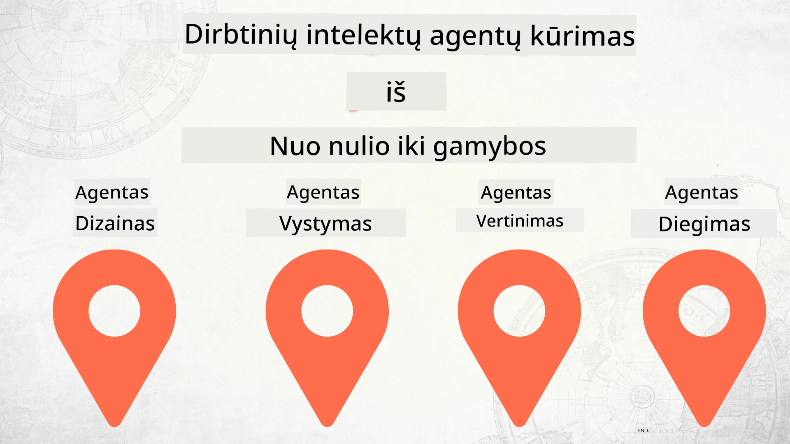

# AI agentų kūrimas nuo nulio iki gamybos



### 🌐 Daugiakalbė palaikymas

#### Palaikoma per GitHub Action (automatizuota ir visada atnaujinama)

<!-- CO-OP TRANSLATOR LANGUAGES TABLE START -->
[Arabic](../ar/README.md) | [Bengali](../bn/README.md) | [Bulgarian](../bg/README.md) | [Burmese (Myanmar)](../my/README.md) | [Chinese (Simplified)](../zh-CN/README.md) | [Chinese (Traditional, Hong Kong)](../zh-HK/README.md) | [Chinese (Traditional, Macau)](../zh-MO/README.md) | [Chinese (Traditional, Taiwan)](../zh-TW/README.md) | [Croatian](../hr/README.md) | [Czech](../cs/README.md) | [Danish](../da/README.md) | [Dutch](../nl/README.md) | [Estonian](../et/README.md) | [Finnish](../fi/README.md) | [French](../fr/README.md) | [German](../de/README.md) | [Greek](../el/README.md) | [Hebrew](../he/README.md) | [Hindi](../hi/README.md) | [Hungarian](../hu/README.md) | [Indonesian](../id/README.md) | [Italian](../it/README.md) | [Japanese](../ja/README.md) | [Kannada](../kn/README.md) | [Khmer](../km/README.md) | [Korean](../ko/README.md) | [Lithuanian](./README.md) | [Malay](../ms/README.md) | [Malayalam](../ml/README.md) | [Marathi](../mr/README.md) | [Nepali](../ne/README.md) | [Nigerian Pidgin](../pcm/README.md) | [Norwegian](../no/README.md) | [Persian (Farsi)](../fa/README.md) | [Polish](../pl/README.md) | [Portuguese (Brazil)](../pt-BR/README.md) | [Portuguese (Portugal)](../pt-PT/README.md) | [Punjabi (Gurmukhi)](../pa/README.md) | [Romanian](../ro/README.md) | [Russian](../ru/README.md) | [Serbian (Cyrillic)](../sr/README.md) | [Slovak](../sk/README.md) | [Slovenian](../sl/README.md) | [Spanish](../es/README.md) | [Swahili](../sw/README.md) | [Swedish](../sv/README.md) | [Tagalog (Filipino)](../tl/README.md) | [Tamil](../ta/README.md) | [Telugu](../te/README.md) | [Thai](../th/README.md) | [Turkish](../tr/README.md) | [Ukrainian](../uk/README.md) | [Urdu](../ur/README.md) | [Vietnamese](../vi/README.md)

> **Norite vietoje klonuoti?**
>
> Ši saugykla apima daugiau nei 50 kalbų vertimus, kurie ženkliai padidina atsisiuntimo dydį. Norėdami klonuoti be vertimų, naudokite sparčiosios peržiūros checkout:
>
> **Bash / macOS / Linux:**
> ```bash
> git clone --filter=blob:none --sparse https://github.com/microsoft/Building-AI-Agents-From-Zero-To-Production.git
> cd Building-AI-Agents-From-Zero-To-Production
> git sparse-checkout set --no-cone '/*' '!translations' '!translated_images'
> ```
>
> **CMD (Windows):**
> ```cmd
> git clone --filter=blob:none --sparse https://github.com/microsoft/Building-AI-Agents-From-Zero-To-Production.git
> cd Building-AI-Agents-From-Zero-To-Production
> git sparse-checkout set --no-cone "/*" "!translations" "!translated_images"
> ```
>
> Tai suteikia viską, ko reikia kursui baigti, su daug greitesniu atsisiuntimu.
<!-- CO-OP TRANSLATOR LANGUAGES TABLE END -->

## Kursas, mokantis AI agentų kūrimo ciklo pagrindų

[](https://github.com/microsoft/Building-AI-Agents-From-Zero-To-Production/blob/master/LICENSE?WT.mc_id=academic-105485-koreyst)
[](https://GitHub.com/microsoft/Building-AI-Agents-From-Zero-To-Production/graphs/contributors/?WT.mc_id=academic-105485-koreyst)
[](https://GitHub.com/microsoft/Building-AI-Agents-From-Zero-To-Production/issues/?WT.mc_id=academic-105485-koreyst)
[](https://GitHub.com/microsoft/Building-AI-Agents-From-Zero-To-Production/pulls/?WT.mc_id=academic-105485-koreyst)
[](http://makeapullrequest.com?WT.mc_id=academic-105485-koreyst)

[](https://discord.gg/Kuaw3ktsu6)

## 🌱 Pradžia

Šiame kurse yra pamokos, apimančios AI agentų kūrimo ir diegimo pagrindus.

Kiekviena pamoka remiasi ankstesne, todėl rekomenduojame pradėti nuo pradžios ir žengti žingsnis po žingsnio iki pabaigos.

Jei norite gilintis į AI agentų temas, peržiūrėkite [AI agentų pradedančiųjų kursą](https://aka.ms/ai-agents-beginners).

### Susipažinkite su kitais besimokančiais, gaukite atsakymus į savo klausimus

Jei užstrigsite ar turėsite klausimų apie AI agentų kūrimą, prisijunkite prie mūsų skirto Discord kanalo [Microsoft Foundry Discord](https://discord.gg/Kuaw3ktsu6).

### Ko Jums Reikia

Kiekviena pamoka turi savo kodo pavyzdį, kurį galite paleisti vietoje. Galite [forkinti šią saugyklą](https://github.com/microsoft/Building-AI-Agents-From-Zero-To-Production/fork) ir sukurti savo kopiją.

Šiame kurse šiuo metu naudojama:

- [Microsoft Agent Framework (MAF)](https://aka.ms/ai-agents-beginners/agent-framework)
- [Microsoft Foundry](https://azure.microsoft.com/products/ai-foundry) — projektas su paleista **GPT-5 serijos** modeliu (pvz., `gpt-5.1`). Nenaudokite nutrauktų GPT-4o / GPT-4.1 modelių.
- [Azure OpenAI Service](https://azure.microsoft.com/products/ai-foundry/models/openai)
- [Azure CLI](https://learn.microsoft.com/cli/azure/authenticate-azure-cli?view=azure-cli-latest) — prisijunkite su `az login` prieš paleisdami bet kokį pavyzdį
- **Python 3.12 arba naujesnė versija**

Prašome užtikrinti, kad turite prieigą prie šių paslaugų prieš pradėdami.

> **💰 Kainos ir valymas.** Praktinės pamokos sukuria tikrus Azure išteklius — Microsoft Foundry
> projektą, modelio diegimą, vektorinę saugyklą ir (4–6 pamokose) talpinamus agentus ir įrankių dėžutes.
> Tai gali generuoti išlaidas tol, kol egzistuoja. Baigę pamoką ar kursą — ištrinkite
> toliau nereikalingus išteklius. Paprasčiausias būdas – viską sudėti į atskirą išteklių grupę
> ir ištrinti visą grupę, kai baigsite:
>
> ```bash
> az group delete --name <your-resource-group> --yes --no-wait
> ```
>
> Taip pat galite ištrinti atskirus agentus, vektorinę saugyklą ir įrankių dėžutes per Foundry portalą.

> **Pastaba apie modelius.** Šis kursas aptarnauja visus modelius per **Microsoft Foundry**. Nenaudoja
> *GitHub Modelių*, kurie bus nutraukti **2026 m. liepos 30 d.** — Microsoft Foundry yra
> oficialus migracijos kelias. Jei turite senesnį kodą, kuris kviečia GitHub modelius, nukreipkite jį į Foundry
> modelio diegimą vietoj to.

Greitu metu bus daugiau galimybių dėl modelių talpinimo ir paslaugų.

## 🗃️ Pamokos

| **Pamoka**         | **Aprašymas**                                                                                  |
|--------------------|--------------------------------------------------------------------------------------------------|
| [Agentų projektavimas](./lesson-1-agent-design/README.md)       | Įvadas į mūsų "Vystytojų įvedimo" agentų naudojimo atvejį ir kaip kurti efektyvius agentus  |
| [Agentų kūrimas](./lesson-2-agent-development/README.md)  | Naudojant Microsoft Agent Framework (MAF), sukurkite specializuotų agentų rinkinį, padedantį naujiems kūrėjams prisijungti.       |
| [Agentų vertinimai](./lesson-3-agent-evals/README.md)  | Naudojant Microsoft Foundry, sužinokite, kaip gerai veikia mūsų AI agentai ir kaip juos patobulinti. |
| [Agentų diegimas](./lesson-4-agentdeployment/README.md)   | Naudojant Microsoft Foundry talpinamus agentus ir OpenAI ChatKit, pamatykite, kaip diegti AI agentą į gamybą.       |
| [Gamybos talpinami agentai](./lesson-5-hosted-agents-production/README.md)   | Perkelkite talpinamą agentą į įmonės gamybą: talpinami agentai prieš galimybių talpinimą, naudokite savo saugyklą, atmintį ir valdymą.       |
| [Microsoft įrankių dėžė](./lesson-6-toolbox/README.md)   | Apibrėžkite įrankius vieną kartą ir valdykite juos centralizuotai: sukurkite įrankių dėžę, naudokite ją agento per vieną MCP galinį tašką ir saugiai versijuokite įrankius.       |
| [Daugiagentė ir agentų tarpusavio sąveika](./lesson-7-multi-agent-a2a/README.md)   | Sudarykite agentus kaip tinklo paslaugas: atverkite agentą per atvirą Agentas-Agentui (A2A) protokolą ir naudokite nuotolinį agentą kaip partnerį.       |


## 🎒 Kiti kursai

Mūsų komanda rengia ir kitus kursus! Pažiūrėkite:

<!-- CO-OP TRANSLATOR OTHER COURSES START -->
### LangChain
[](https://aka.ms/langchain4j-for-beginners)
[](https://aka.ms/langchainjs-for-beginners?WT.mc_id=m365-94501-dwahlin)
[](https://github.com/microsoft/langchain-for-beginners?WT.mc_id=m365-94501-dwahlin)
---

### Azure / Edge / MCP / Agentai
[](https://github.com/microsoft/AZD-for-beginners?WT.mc_id=academic-105485-koreyst)
[](https://github.com/microsoft/edgeai-for-beginners?WT.mc_id=academic-105485-koreyst)
[](https://github.com/microsoft/mcp-for-beginners?WT.mc_id=academic-105485-koreyst)
[](https://github.com/microsoft/ai-agents-for-beginners?WT.mc_id=academic-105485-koreyst)

---
 
### Generatyviosios AI serijos

[](https://github.com/microsoft/generative-ai-for-beginners?WT.mc_id=academic-105485-koreyst)
[-9333EA?style=for-the-badge&labelColor=E5E7EB&color=9333EA)](https://github.com/microsoft/Generative-AI-for-beginners-dotnet?WT.mc_id=academic-105485-koreyst)
[-C084FC?style=for-the-badge&labelColor=E5E7EB&color=C084FC)](https://github.com/microsoft/generative-ai-for-beginners-java?WT.mc_id=academic-105485-koreyst)
[-E879F9?style=for-the-badge&labelColor=E5E7EB&color=E879F9)](https://github.com/microsoft/generative-ai-with-javascript?WT.mc_id=academic-105485-koreyst)

---
 
### Pagrindinis mokymasis
[](https://aka.ms/ml-beginners?WT.mc_id=academic-105485-koreyst)
[](https://aka.ms/datascience-beginners?WT.mc_id=academic-105485-koreyst)
[](https://aka.ms/ai-beginners?WT.mc_id=academic-105485-koreyst)
[](https://github.com/microsoft/Security-101?WT.mc_id=academic-96948-sayoung)
[](https://aka.ms/webdev-beginners?WT.mc_id=academic-105485-koreyst)
[](https://aka.ms/iot-beginners?WT.mc_id=academic-105485-koreyst)
[](https://github.com/microsoft/xr-development-for-beginners?WT.mc_id=academic-105485-koreyst)

---
 
### Copilot serija
[](https://aka.ms/GitHubCopilotAI?WT.mc_id=academic-105485-koreyst)
[](https://github.com/microsoft/mastering-github-copilot-for-dotnet-csharp-developers?WT.mc_id=academic-105485-koreyst)
[](https://github.com/microsoft/CopilotAdventures?WT.mc_id=academic-105485-koreyst)
<!-- CO-OP TRANSLATOR OTHER COURSES END -->

## Prisidėjimas

Šis projektas laukia indėlių ir pasiūlymų. Dauguma indėlių reikalauja, kad sutiktumėte su
Bendradarbio licencijos sutartimi (CLA), deklaruojančia, kad turite teisę ir iš tiesų suteikiate mums
teises naudoti jūsų indėlį. Išsamesnė informacija: <https://cla.opensource.microsoft.com>.

Kai pateikiate prašymą sujungti pokyčius, CLA bot automatiškai nustatys, ar reikia pateikti
CLA ir atitinkamai pažymės PR (pvz., būsenos patikrinimas, komentaras). Paprasčiausiai sekite bota pateiktas instrukcijas.
Tai reikės padaryti tik vieną kartą visuose mūsų CLA naudojamuose saugyklose.

Šis projektas priėmė [Microsoft atvirojo kodo elgesio taisykles](https://opensource.microsoft.com/codeofconduct/).
Daugiau informacijos rasite [Elgesio taisyklių DUK](https://opensource.microsoft.com/codeofconduct/faq/) arba
susisiekite: [opencode@microsoft.com](mailto:opencode@microsoft.com) jei turite papildomų klausimų ar pastebėjimų.

## Prekių ženklai

Šiame projekte gali būti prekių ženklų ar logotipų, skirtų projektams, produktams ar paslaugoms. Leidžiamas Microsoft
prekių ženklų ar logotipų naudojimas yra reglamentuojamas ir turi atitikti
[Microsoft prekių ženklų ir prekės ženklų naudojimo gairių](https://www.microsoft.com/legal/intellectualproperty/trademarks/usage/general).
Keičiant šio projekto versijas naudojami Microsoft prekių ženklai ar logotipai negali sukelti painiavos ar reikšti Microsoft rėmimą.
Bet koks kitų šalių prekių ženklų ar logotipų naudojimas priklauso tų šalių politikai.

## Pagalba

Jei užstrigote arba turite klausimų apie DI programų kūrimą, prisijunkite:

[](https://discord.gg/Kuaw3ktsu6)

Jei turite atsiliepimų ar pastebite klaidų kūrimo metu, apsilankykite:

[](https://aka.ms/foundry/forum)

---

<!-- CO-OP TRANSLATOR DISCLAIMER START -->
**Atsakomybės apribojimas**:
Šis dokumentas buvo išverstas naudojant dirbtinio intelekto vertimo paslaugą [Co-op Translator](https://github.com/Azure/co-op-translator). Nors siekiame tikslumo, prašome atkreipti dėmesį, kad automatiniai vertimai gali turėti klaidų ar netikslumų. Originalus dokumentas jo gimtąja kalba laikomas autoritetingu šaltiniu. Svarbiai informacijai rekomenduojama naudoti profesionalų žmogiškąjį vertimą. Mes neatsakome už jokius nesusipratimus ar neteisingą interpretaciją, kilusią naudojantis šiuo vertimu.
<!-- CO-OP TRANSLATOR DISCLAIMER END -->