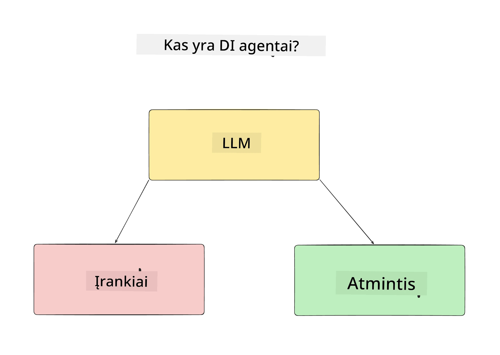
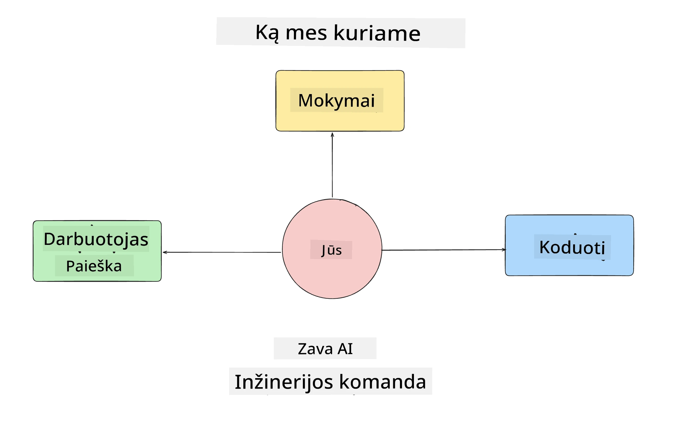
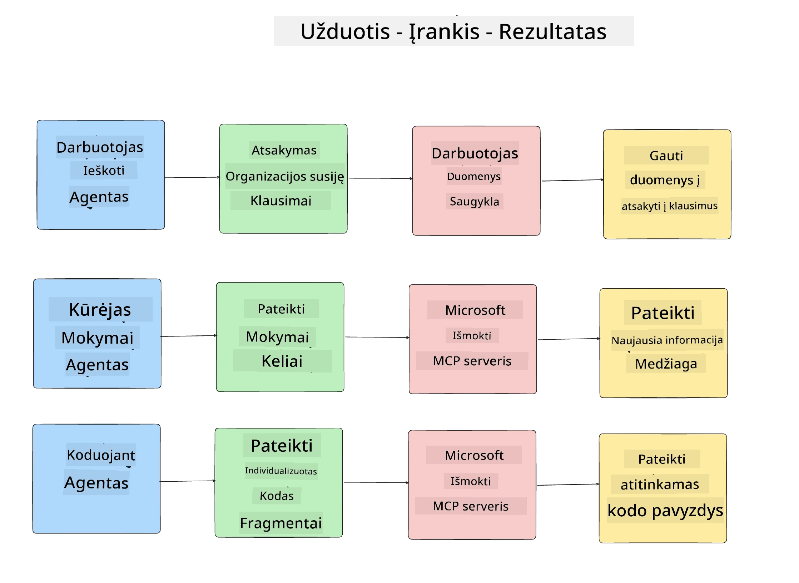
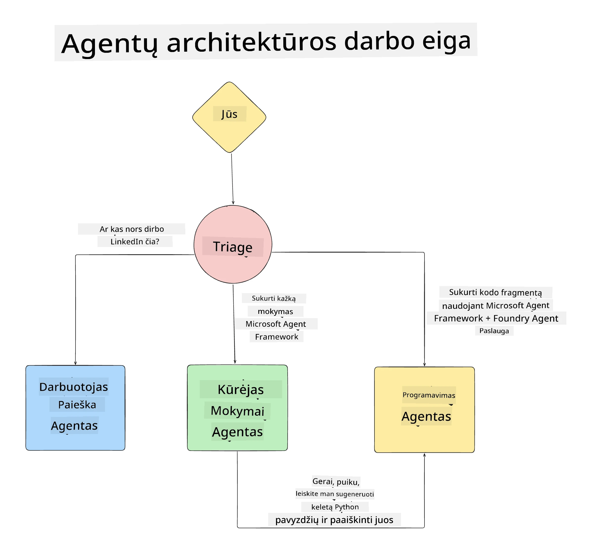

# 1 pamoka: DI agentų projektavimas

Sveiki atvykę į pirmąją "DI agentų kūrimo nuo nulio iki produkcijos" kurso pamoką!

Šioje pamokoje aptarsime:

- Ką reiškia DI agentai
  
- Aptarsime DI agentų programą, kurią kuriame  

- Nustatysime reikalingus įrankius ir paslaugas kiekvienam agentui
  
- Suplanuosime agentų programos architektūrą
  
Pradėkime nuo to, kas yra agentas ir kodėl juos naudotume programoje.

> **Prieš pradėdami kursą.** Ši pirmoji pamoka yra konceptualinė — kodo vykdyti nereikia.
> Nuo [2 pamokos](../lesson-2-agent-development/README.md) reikės: **Azure prenumeratos** su prieiga prie **Microsoft Foundry**, išdiegto **GPT-5 serijos modelio** (pvz., `gpt-5.1` — venkite pensininkų GPT-4o / GPT-4.1), **Python 3.12+** ir **Azure CLI**
> (`az login`). Visą reikalingų dalykų sąrašą ir nuorodas rasite kurso README [Ką jums reikia](../README.md#what-you-need) skyriuje.

## Kas yra DI agentai?

Jei pirmą kartą tyrinėjate, kaip sukurti DI agentą, galite turėti klausimų, kaip tiksliai apibrėžti, kas yra DI agentas.

Paprastas DI agento apibrėžimas pagal jo komponentus:

**Didelis kalbos modelis** – LLM palaikys tiek vartotojo natūralios kalbos apdorojimą suprasti užduotį, kurią norima atlikti, tiek įrankių aprašymų, skirtų užduotims atlikti, interpretavimą.

**Įrankiai** – Tai bus funkcijos, API, duomenų saugyklos ir kitos paslaugos, kurias LLM gali pasirinkti naudoti vartotojo prašomoms užduotims atlikti.

**Atmintis** – Tai, kaip saugome tiek trumpalaikius, tiek ilgalaikius sąveikos tarp DI agento ir vartotojo duomenis. Šios informacijos saugojimas ir atgavimas svarbus gerinti paslaugą ir išsaugoti vartotojo nuostatas laikui bėgant.

## Mūsų DI agento naudojimo atvejis

Šiam kursui kursime DI agentų programą, kuri padės naujiems kūrėjams prisijungti prie mūsų DI agentų kūrimo komandos!

Prieš pradedant dirbti su kūrimu, svarbiausias žingsnis kuriant sėkmingą DI agentų programą yra aiškiai apibrėžti scenarijus, kaip tikimės, kad vartotojai dirbs su mūsų DI agentais.

Šiai programai naudosime šiuos scenarijus:

**1 scenarijus:** Naujas darbuotojas prisijungia prie mūsų organizacijos ir nori sužinoti daugiau apie komandą, kurioje dirbs, ir kaip su ja susisiekti.

**2 scenarijus:** Naujas darbuotojas nori sužinoti, kokia būtų geriausia pirmoji užduotis pradėti darbą.

**3 scenarijus:** Naujas darbuotojas nori surinkti mokymosi medžiagą ir kodo pavyzdžius, padedančius pradėti šią užduotį vykdyti.

## Reikalingų įrankių ir paslaugų nustatymas

Kadangi turime scenarijus, kitas žingsnis – priskirti juos įrankiams ir paslaugoms, kurios bus reikalingos mūsų DI agentams užduotims atlikti.

Šis procesas patenka į konteksto inžinerijos sritį, kadangi susikoncentruosime į tai, kad mūsų DI agentai turėtų tinkamą kontekstą tinkamu laiku užduotims atlikti.

Atlikime scenarijų po vieną ir sukurkime gerą agentų dizainą, išvardydami kiekvieno agente užduotis, įrankius ir pageidaujamus rezultatus.

### 1 scenarijus – darbuotojų paieškos agentas

**Užduotis** – atsakyti į klausimus apie organizacijos darbuotojus, pavyzdžiui, prisijungimo datą, dabartinę komandą, vietą ir paskutinę pareigą.

**Įrankiai** – dabartinių darbuotojų sąrašų ir organizacinės struktūros duomenų saugykla

**Rezultatai** – galimybė gauti informaciją iš duomenų saugyklos, atsakant į bendruosius organizacijos klausimus ir konkrečius darbuotojų klausimus.

### 2 scenarijus – užduočių rekomendavimo agentas

**Užduotis** – atsižvelgiant į naujo darbuotojo kūrėjo patirtį, pasiūlyti 1–3 užduotis, kuriomis jis galėtų pradėti dirbti.

**Įrankiai** – GitHub MCP serveris atvirų užduočių gavimui ir kūrėjo profilio kūrimui

**Rezultatai** – galimybė perskaityti paskutinius 5 įsipareigojimus GitHub profilyje ir atviras užduotis GitHub projekte bei pateikti rekomendacijas pagal atitikimą

### 3 scenarijus – kodo pagalbos agentas

**Užduotis** – remiantis „užduočių rekomendavimo“ agento pasiūlytomis atvirais klausimais ieškoti šaltinių, generuoti kodo fragmentus padedant darbuotojui.

**Įrankiai** – Microsoft Learn MCP ieškant resursų ir Kodo interpretatorius generuoti pritaikytus kodo fragmentus.

**Rezultatai** – jei vartotojas prašo papildomos pagalbos, darbo eiga naudos Learn MCP serverį teikdama nuorodas ir kodo fragmentus, o tada perduos Kodo interpretatoriaus agentui sugeneruoti mažus kodo fragmentus su paaiškinimais.

## Agentų programos architektūra

Kadangi apibrėžėme kiekvieną agentą, sukurkime architektūros diagramą, kuri padės suprasti, kaip kiekvienas agentas dirbs kartu ir atskirai, priklausomai nuo užduoties:

## Kiti žingsniai

Kadangi suprojektavome kiekvieną agentą ir agentinę sistemą, pereikime prie kitos pamokos, kurioje kursime šiuos agentus!

---

<!-- CO-OP TRANSLATOR DISCLAIMER START -->
**Atsakomybės apribojimas**:
Šis dokumentas buvo išverstas naudojant dirbtinio intelekto vertimo paslaugą [Co-op Translator](https://github.com/Azure/co-op-translator). Nors siekiame tikslumo, prašome atkreipti dėmesį, kad automatiniai vertimai gali turėti klaidų ar netikslumų. Originalus dokumentas jo gimtąja kalba laikomas autoritetingu šaltiniu. Svarbiai informacijai rekomenduojama naudoti profesionalų žmogiškąjį vertimą. Mes neatsakome už jokius nesusipratimus ar neteisingą interpretaciją, kilusią naudojantis šiuo vertimu.
<!-- CO-OP TRANSLATOR DISCLAIMER END -->