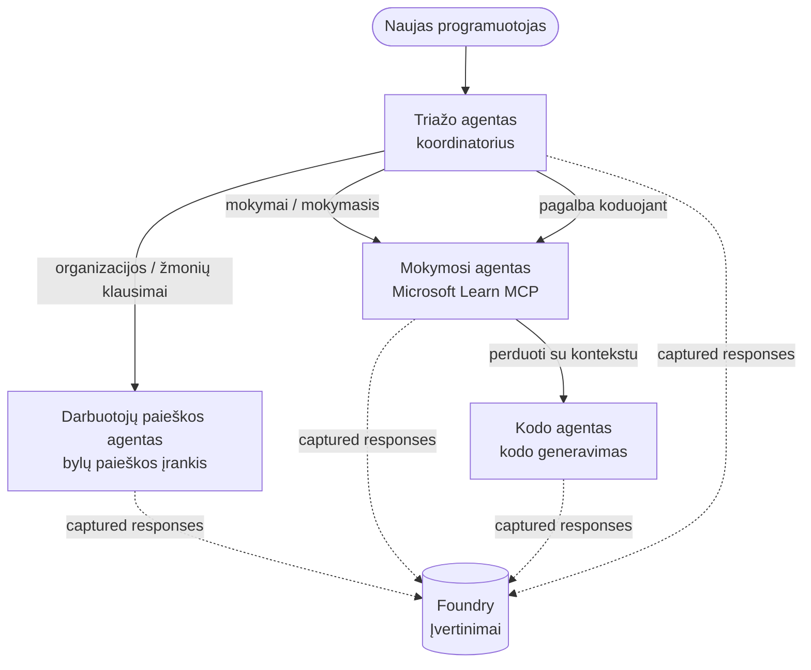

# 3 pamoka: Agentų vertinimas naudojant Microsoft Foundry

Sveiki atvykę į trečią **„AI agentų kūrimas nuo nulio iki gamybos“** kurso pamoką!

Antroje pamokoje [Pamoka 2](../lesson-2-agent-development/README.md) kūrėte agentus. Šioje pamokoje
sužinosite, kaip atsakyti į kur kas sudėtingesnį klausimą: **ar jie yra geri?** Išleisti agentą,
kuris veikia, yra paprasta; tačiau žinoti, ar jis teisingai nukreipia, remiasi jūsų duomenimis ir tinkamai
naudoja savo įrankius – štai ką skiria demonstraciją nuo gamybos sistemos.

Šioje pamokoje aptarsime:

- Kodėl agentų vertinimas yra svarbus ir kuo jis skiriasi nuo tradicinio testavimo
- Skirtumus tarp **stebėjimo**, **dūmų testų** ir **vertinimų**
- Daugiagentį darbo procesą, kurį mes matuosime
- Įtaisytus **Microsoft Foundry vertintojus** (aktualumą, pagrįstumą, įrankių kvietimo tikslumą, įrankių rezultatų naudojimą)
- Išsamų vertinimo srauto apžvalgą faile [`agent-evals.py`](../../../lesson-3-agent-evals/agent-evals.py)
- Kaip jį paleisti ir kaip skaityti rezultatus

---

## Kodėl reikia vertinti agentus?

Tradicinis vieneto testas teigia, kad `add(2, 2) == 4`. Agentai neveikia taip – ta pati
užklausa gali kiekvieną kartą generuoti skirtingus žodinius variantus, įrankiai gali būti kviečiami
skirtinga tvarka, o "teisingumas" dažnai yra laipsnio klausimas, o ne loginė reikšmė. Tiksliai


Vietoje to agentus vertinate pagal **kokybės dimensijas** naudodami modeliais pagrįstus *vertintojus* (dar vadinamus "LLM kaip teisėju") bei deterministinius tikrinimus dėl įrankių naudojimo. Tai leidžia jums sužinoti tokius dalykus:

- Ar atsakymas iš tikrųjų atsakė į klausimą? (**aktualumas**)
- Ar atsakymas paremta gauta informacija, ar agentas "halucinojo"? (**pagrįstumas**)
- Ar agentas panaudojo tinkamą įrankį su tinkamais argumentais? (**įrankių kvietimo tikslumas**)
- Ar agentas tikrai panaudojo tai, ką grąžino įrankis? (**įrankių rezultatų panaudojimas**)

### Trys papildomos kokybės sluoksniai

Tai nėra konkuruojančios technikos – gamybos agentas naudoja visas tris:

| Sluoksnis | Klausimas, į kurį atsako | Kaina | Kada vyksta | Apžvelgiama |
|----------|---------------------------|-------|------------|------------|
| **Stebėjimas / sekimas** | *Ką agentas darė, žingsnis po žingsnio?* | Nemokamai (visada įjungta) | Nuolat gamyboje | Šioje pamokoje |
| **Dūmų testai** | *Ar agentas pasiekiamas ir seka pagrindinę užklausą?* | Pigu, kelios sekundės | Kiekvienas diegimas | [Pamoka 4](../lesson-4-agentdeployment/README.md#smoke-testing-the-hosted-agent-ci-gate) |
| **Vertinimai** | *Kaip **geri** yra atsakymai?* | Lėčiau, pagal modelio naudojimą | Pagal poreikį / naktimis / prieš leidimą | Šioje pamokoje |

Dūmų testai atsako į klausimą „ar sugriuvo?“; vertinimai atsako į klausimą „ar yra geri?“. Abu yra reikalingi.

---

## Išankstinės sąlygos

1. Užbaigta [Pamoka 2](../lesson-2-agent-development/README.md) (agentai + vektorinė saugykla).
2. Turėti **Microsoft Foundry** projektą.
3. Autentifikuotas naudojant **Azure CLI**: `az login`.
4. Įdiegta **Python 3.12+** ir kursų priklausomybės:

   ```bash
   pip install -r ../requirements.txt
   ```


5. Aplinkos kintamieji (sukurkite `.env` failą šiame aplanke arba eksportuokite juos):

   | Kintamasis | Paskirtis |
   |----------|---------|
   | `FOUNDRY_PROJECT_ENDPOINT` | Jūsų Foundry projekto galinis taškas (`https://<account>.services.ai.azure.com/api/projects/<project>`). Perskaitoma agentų `FoundryChatClient` **ir** vertinimo pagalbininko. |
   | `FOUNDRY_MODEL` | Modelio diegimas, kuriuo veikia **agentai** (pvz., `gpt-5.1`). |
   | `VECTOR_STORE_ID` | Darbuotojų katalogo vektorinė saugykla, sukurta 2 pamokoje |
   | `AZURE_AI_MODEL_DEPLOYMENT_NAME` | Modelio diegimas, naudojamas **vertintojų** (numatytasis `FOUNDRY_MODEL`, tada `gpt-5.1`) |

> Agentai naudoja `FoundryChatClient`, kuris skaito konfigūraciją iš `FOUNDRY_` prefiksuotų
> kintamųjų (`FOUNDRY_PROJECT_ENDPOINT`, `FOUNDRY_MODEL`). Debesies vertinimo pagalbininkas
> naudoja `azure-ai-projects` SDK ir jei `AZURE_AI_PROJECT_ENDPOINT` nėra nustatyta, jis naudos
> `FOUNDRY_PROJECT_ENDPOINT` — todėl pakanka dviejų `FOUNDRY_` kintamųjų
> paleisti visai pamokai.
>
> Vertintojai patys yra varomi modelio, todėl `AZURE_AI_MODEL_DEPLOYMENT_NAME`
> kontroliuoja, kuris diegimas atlieka vertinimą — nebūtinai turi būti tas pats modelis, kokį
> naudoja jūsų agentai.

---

## Vertinamas darbo srautas

Norėdami ką nors įvertinti, pirmiausia turite tai paleisti. Ši pamoka pakartotinai naudoja **Developer Onboarding**
kelių agentų darbo srautą: **triage** koordinatorius perduoda užduotis trims specialistams.



Darbo srautas sukurtas naudojant Microsoft Agent Framework **handoff** orkestraciją. Pagrindinė
vertinimo idėja yra ta, kad **kiekviena agento eilė serverio pusėje išsaugoma** ir identifikuojama per
`response_id`. Šie ID perduodami vertinimo paslaugai.

---

## Vertinimo procesas žingsnis po žingsnio

[`agent-evals.py`](../../../lesson-3-agent-evals/agent-evals.py) įgyvendina šešių žingsnių procesą. Štai ką kiekvienas žingsnis atlieka
ir kodėl.

### 1 žingsnis — paleiskite darbo srautą ir sekite atsakymų ID

Darbo srautas vykdomas su `run_stream(...)`, ir kai atvyksta įvykiai, kodas įrašo
kiekvieno agento sugeneruotus `response_id` ir `conversation_id`. Išsaugoti atsakymai yra žaliava
vertinimui — jūs vertinate *tikrus* produktinius atsakymus, o ne iš naujo sugeneruotus.


### 2 žingsnis — santrauka to, kas buvo užfiksuota

Trumpa santrauka parodo, kiek atsakymų sugeneravo kiekvienas agentas, kad galėtumėte patvirtinti,
jog darbo srautas iš tikrųjų apima tuos agentus, kuriuos ketinate vertinti.

### 3 žingsnis — gauti galutinius atsakymus

Kiekvienam agentui paskutinysis `response_id` gaunamas per projekto OpenAI suderinamą
klientą (`project_client.get_openai_client().responses.retrieve(...)`), kad galėtumėte peržiūrėti
tekstą, kuris bus vertinamas.

### 4 žingsnis — sukurkite vertinimą

Vertinimas kuriamas su keturiais **Built-in Foundry vertintojais**:

| Vertintojas | `evaluator_name` | Ką matuoja |
|-----------|------------------|------------------|

| Reikšmingumas | `builtin.relevance` | Ar atsakymas atitinka vartotojo užklausą? |

| Pagrįstumas | `builtin.groundedness` | Ar atsakymas pagrįstas surinktais/įrankio duomenimis (ne išgalvotas)? |
| Įrankio iškvietimo tikslumas | `builtin.tool_call_accuracy` | Ar teisingi įrankiai buvo iškviesti su teisingais argumentais? |
| Įrankio išvesties panaudojimas | `builtin.tool_output_utilization` | Ar agentas iš tikrųjų naudojo įrankio rezultatus savo atsakyme? |

Kiekvienas vertintojas inicijuojamas naudojant diegimą, pavadintą `AZURE_AI_MODEL_DEPLOYMENT_NAME`.

> **Kodėl šie keturi?** Relevancija ir pagrįstumas matuoja *atsakymo kokybę*; du įrankių
> vertintojai matuoja *agentinį elgesį* — tą dalį, kurią tradiciniai NLP metrikos visiškai praleidžia. Įrankių
> naudojančioje, daugiaagentinėje sistemoje, įrankių metrikos dažnai atskleidžia tikrus regresus.

### 5 žingsnis — Vykdyti vertinimą

Užfiksuoti `response_id` perduodami į `evals.runs.create(...)` kaip duomenų šaltinis. Paslauga pakartoja
kiekvieną saugomą atsakymą per visus vertintojus.

### 6 žingsnis — Stebėti ir skaityti rezultatus

Kode laukiamas paleidimo užbaigimas arba klaida (`completed` arba `failed`), tada išspausdinami rezultatų kiekiai ir
**`report_url`** — gilus nuorodos į Foundry portalą, kur galite apžiūrėti metrikų įvertinimus,
praėjimo/nepavykimo skaičius ir atskirus vertintus atsakymus.

---

## Vykdykite tai

```bash
cd lesson-3-agent-evals
python agent-evals.py
```

Pagal nutylėjimą vertinamas pirmasis pavyzdinis užklausimas
(`"Aš čia naujas! Ar čia kas nors dirbo Microsoft?"`). Du papildomi daugiatikslaus pavyzdžiai
įtraukti `run_evaluation_workflow()` — pakeiskite `query` kintamąjį, kad išbandytumėte maršruto scenarijus,
kuriuose viename paleidime dalyvauja daugiau agentų.

Tikėtinas konsolės veikimo srautas:

```
Step 1: Running Developer Onboarding Workflow
Step 2: Response Data Summary
Step 3: Fetching Agent Responses
Step 4: Creating Evaluation
Step 5: Running Evaluation
Step 6: Monitoring Evaluation
  Status: running ...
  Evaluation completed successfully
  Report URL: https://...   <-- open this in the Foundry portal
```

---

## Stebėjimas ir sekimas

Vertinimai nurodo *kokie geri* buvo atsakymai; **stebėjimas** pasako *kas įvyko*,
kad juos pagamintų — kiekvienas agente persijungimas, įrankio kvietimas, žodžių skaičius ir delsos laikas. Microsoft Foundry
agentų paleidimai generuoja OpenTelemetry sekimus, kuriuos galite peržiūrėti portale, o Agentų sistema gali
eksportuoti juos į Azure Monitor / Application Insights vienu kvietimu:

```python
from agent_framework.foundry import FoundryChatClient

client = FoundryChatClient()
client.configure_azure_monitor()   # eksportuoti sekimus + metrikas į Application Insights
```

Naudokite sekimą **klaidų atsekimui** blogam vertinimo rezultatui: kai pagrįstumas krenta, sekoje matote,
ar failų paieškos įrankis nieko negrąžino, ar grąžino duomenis, kurių agentas tada ignoravo (tai yra
būtent ko vertina įrankio išvesties panaudojimas).

---

## Nuo „paleidimų“ iki „geri“: kaip tai naudoti praktiškai

- **Išankstinio leidimo filtro.** Vykdykite vertinimus su fiksuotu reprezentatyvių užklausų rinkiniu prieš
  paskelbdami naują užklausą arba modelį. Palyginkite įvertinimus su ankstesne versija — kritimas laikomas
  regresija.
- **Naktinis kokybės signalas.** Suplanuokite vertinimą, kad aptiktumėte duomenų ar priklausomybių
  pasikeitimus.
- **Derinkite su pirmojo patikrinimo testais.** [4 pamokos pirmojo patikrinimo testas](../lesson-4-agentdeployment/README.md#smoke-testing-the-hosted-agent-ci-gate)
  yra jūsų greitasis kiekvieno diegimo filtras; vertinimai — lėtesnis, giluminis kokybės filtras. Vykdykite
  pigųjį prie kiekvieno sujungimo, o brangųjį pagal grafiką arba prieš išleidimą.

---

## Modernizacijos pastaba

Šis pavyzdys perkeltas į naujausią Microsoft Agent Framework Foundry API paviršių
(`agent_framework.foundry`). Jei atnaujinate kodą, žiūrėkite pagrindinėje saugykloje esantį
[`MIGRATION-GUIDE.md`](../MIGRATION-GUIDE.md), kuriame pateikti patvirtinti prieš/po importo ir kliento
susiejimai (pvz., `AzureAIClient` -> `FoundryChatClient`, ir įrankių kūrimas per
`client.get_file_search_tool(...)` / `client.get_mcp_tool(...)`). Vertinimo koncepcijos ir
šešių žingsnių procesas išliko nepakitę per šį perkėlimą.

---

## Ištekliai

- [Vertinkite generatyviuosius AI modelius ir programas (Microsoft Learn)](https://learn.microsoft.com/en-us/azure/ai-foundry/concepts/evaluation-approach-gen-ai)
- [Integruoti vertintojai generatyviam AI](https://learn.microsoft.com/en-us/azure/ai-foundry/concepts/evaluation-evaluators/agent-evaluators)
- [Stebėjimas Microsoft Foundry](https://learn.microsoft.com/en-us/azure/ai-foundry/concepts/observability)
- [Microsoft Agent Framework](https://github.com/microsoft/agent-framework)
- [Agentų perdavimo orkestracija](https://learn.microsoft.com/en-us/agent-framework/workflows/orchestrations/handoff)

---

<!-- CO-OP TRANSLATOR DISCLAIMER START -->
**Atsakomybės apribojimas**:
Šis dokumentas buvo išverstas naudojant dirbtinio intelekto vertimo paslaugą [Co-op Translator](https://github.com/Azure/co-op-translator). Nors siekiame tikslumo, prašome atkreipti dėmesį, kad automatiniai vertimai gali turėti klaidų ar netikslumų. Originalus dokumentas jo gimtąja kalba laikomas autoritetingu šaltiniu. Svarbiai informacijai rekomenduojama naudoti profesionalų žmogiškąjį vertimą. Mes neatsakome už jokius nesusipratimus ar neteisingą interpretaciją, kilusią naudojantis šiuo vertimu.
<!-- CO-OP TRANSLATOR DISCLAIMER END -->