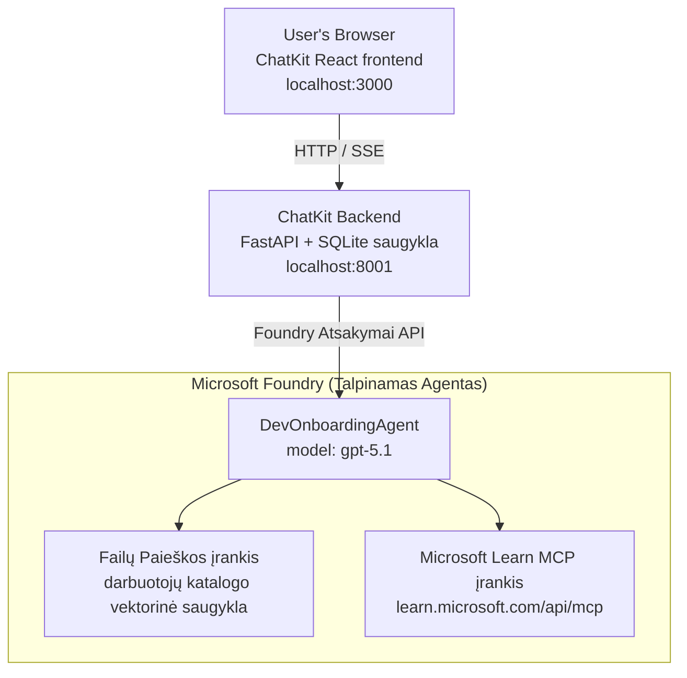

# 4 pamoka: Agentų diegimas naudojant Microsoft Foundry talpinamus agentus + ChatKit

Šioje pamokoje pademonstruojama, kaip įdiegti įrankiais naudojamą agentą į Microsoft Foundry kaip talpinamą agentą ir sukurti ChatKit pagrindu veikiantį frontendą, kad su juo bendrautumėte.

## Architektūra

Talpinamas agentas yra **vienas `DevOnboardingAgent`** (veikiantis `gpt-5.1`), kuris atsako į kūrėjo įsisotinimo klausimus naudodamas du talpinamus įrankius: **Failų paieškos** įrankį per darbuotojų katalogo vektorinę saugyklą ir **Microsoft Learn MCP** įrankį. ChatKit React frontendas kalbasi su FastAPI backendu, kuris kreipiasi į agentą per Foundry **Atsakymų API**.



## Pradiniai reikalavimai

1. **Microsoft Foundry projektas** North Central US regione
2. Autentifikuotas **Azure CLI** (`az login`)
3. Įdiegtas **Azure Developer CLI** (`azd`)
4. **Python 3.12+** ir **Node.js 18+**
5. Sukurta **vektorinė saugykla** su darbuotojų duomenimis

## Greitas pradėjimas

### 1. Nustatykite aplinkos kintamuosius

```bash
cd lesson-4-agentdeployment
cp .env.example .env
# Redaguokite .env su savo Microsoft Foundry projekto duomenimis
```

### 2. Įdiekite talpinamą agentą

**Variantas A: naudojant Azure Developer CLI (Rekomenduojama)**

```bash
cd hosted-agent
azd auth login
azd agent deploy
```

**Variantas B: naudojant Docker + Azure Container Registry**

```bash
cd hosted-agent

# Sukurkite konteinerį
docker build -t developer-onboarding-agent:latest .

# Žymė ACR
docker tag developer-onboarding-agent:latest <your-acr>.azurecr.io/developer-onboarding-agent:latest

# Siųsti į ACR
az acr login --name <your-acr>
docker push <your-acr>.azurecr.io/developer-onboarding-agent:latest

# Diegti per Microsoft Foundry portalą arba SDK
```

### 3. Paleiskite ChatKit backendą

```bash
cd chatkit-server
python -m venv .venv
source .venv/bin/activate  # Windows sistemoje: .venv\Scripts\activate
pip install -r requirements.txt
python app.py
```

Serveris pradės veikti adresu `http://localhost:8001`

### 4. Paleiskite ChatKit frontendą

```bash
cd chatkit-server/frontend
npm install
npm run dev
```

Frontendas pradės veikti adresu `http://localhost:3000`

### 5. Išbandykite programą

Atidarykite `http://localhost:3000` naršyklėje ir išbandykite šiuos užklausimus:

**Darbuotojų paieška:**
- "Esu naujas! Ar kas nors dirbo Microsoft?"
- "Kas turi patirties su Azure Functions?"

**Mokymosi ištekliai:**
- "Sukurkite mokymosi kelią Kubernetes tema"
- "Kokius sertifikatus turėčiau siekti debesų architektūroje?"

**Programavimo pagalba:**
- "Padėkite parašyti Python kodą prisijungimui prie CosmosDB"
- "Parodykite, kaip sukurti Azure Function"

**Daugelio agentų užklausos:**
- "Pradedu kaip debesų inžinierius. Su kuo turėčiau susisiekti ir ką turėčiau išmokti?"

## Projekto struktūra

```
lesson-4-agentdeployment/
├── .env.example                 # Environment variables template
├── implementation-plan.md       # Detailed implementation guide
├── README.md                    # This file
├── hosted-agent/               # Microsoft Foundry hosted agent
│   ├── main.py                 # Multi-agent workflow implementation
│   ├── requirements.txt        # Python dependencies
│   ├── Dockerfile              # Container definition
│   └── agent.yaml              # Agent deployment configuration
└── chatkit-server/             # ChatKit server application
    ├── app.py                  # FastAPI backend
    ├── store.py                # SQLite persistence layer
    ├── requirements.txt        # Python dependencies
    └── frontend/               # React frontend
        ├── package.json
        ├── vite.config.ts
        ├── tsconfig.json
        ├── index.html
        └── src/
            ├── main.tsx
            ├── App.tsx
            ├── App.css
            └── index.css
```

## Agentas ir jo įrankiai

Talpinamas agentas yra **vienas agentas** (`DevOnboardingAgent`, apibrėžtas faile `hosted-agent/main.py`), kuris tvarko tris įsisotinimo sritis. Vietoj atskirų pogrupių agentų jis kiekvieną funkcionalumą pateikia kaip įrankį (arba tiesiogiai naudoja modelį):

| Funkcija | Kaip tvarkoma | Įrankis |
|-----------|------------------|------|
| **Darbuotojų paieška ir ryšiai** | Foundry talpinama failų paieška per darbuotojų katalogo vektorinę saugyklą | `client.get_file_search_tool(vector_store_ids=[...])` |
| **Mokymasis ir mokymai** | Microsoft Learn MCP serveris (talpinamas MCP įrankis) | `client.get_mcp_tool(url="https://learn.microsoft.com/api/mcp")` |
| **Programavimo pagalba** | Tiesiogiai tvarko `gpt-5.1` modelis — nėra išorinio įrankio | — |

Agentas sukuriamas naudojant `client.as_agent(name="DevOnboardingAgent", instructions=..., tools=[file_search_tool, learn_mcp_tool])` ir paleidžiamas su `from_agent_framework(agent).run()`.

> **Dizaino pastaba.** Ankstesnės šios pamokos versijos naudojo `HandoffBuilder` daugelio agentų darbų srautą (atranka → specialistai). Šiuo metu diegiamas agentas yra vienas agentas, naudojantis įrankius, kuris paprasčiau diegiamas ir suprantamas klausimų-atsakymų įsisotinimui. Pavyzdžiui, daugelio agentų kooperaciją ir perdavimus žr. 2 ir 3 pamokose.

## Talpinamo agento pagrindinis testavimas (CI vartai)

Sėkmingas talpinamo agente diegimas įrodo tik tai, kad valdymo sritis priėmė
apibrėžimą — tai **nereiškia**, kad agentas iš tikrųjų atsako. Trūkstama priklausomybė,
klaidingas maršruto nustatymas ar pasibaigęs ryšys gali palikti žalią, bet tylią agentą.

Šioje pamokoje pateikiamas lengvas **pagrindinis testas**, kuris veikia kaip greitas ir pigus testas po diegimo.
Jis naudoja GitHub veiksmą [AI Smoke Test](https://github.com/marketplace/actions/ai-smoke-test)
ir siunčia užklausas agentui per Foundry **Atsakymų** galinį tašką
(`POST {project_endpoint}/agents/{agent_name}/endpoint/protocols/openai/responses`) ir
tikrina gautą tekstą. Tai leidžia per kelias sekundes aptikti neveikiančius diegimus, autentifikavimo regressus,
sistemos prompt&#39;o pasikeitimą ar daugiasrieginį pažeidimą.

> Pagrindiniai testai **nėra** visiškų vertinimų pakaitalas
> [3 pamokoje](../lesson-3-agent-evals/README.md) — jie yra papildymas. Pagrindiniai testai
> atsako į klausimą *"ar agentas pasiekiamas, reaguoja ir atitinka pagrindinius promptų lūkesčius?"*;
> vertinimai atsako į klausimą *"kaip geras yra atsakymas?"*. Vykdykite paprastą testą po kiekvieno diegimo.

### Kas testuojama

Katalogas yra faile [`hosted-agent/tests/smoke-tests.json`](../../../lesson-4-agentdeployment/hosted-agent/tests/smoke-tests.json)
ir apima agento tris sritis bei promptų laikymąsi ir daugiapakopį pokalbį:

| Testas | Ką patikrina |
|------|------------------|
| `reachability` | Agentas atsako ne tuščiu, temai tinkamu tekstu |
| `employee-search` | Failų paieškos sritis grąžina sveiką `200` atsakymą (atsakymas priklauso nuo duomenų) |
| `learning-path` | Mokymosi sritis atkartoja temą ir pateikia atsakymą keliu |
| `coding-assistance` | Programavimo sritis pateikia Python programiškai formatuotą atsakymą |
| `prompt-adherence-offtopic` | Ne tematikos užklausa nukreipiama, neatsakoma išsamiai |
| `threading-turn-1/2` | Pokalbio būsena išlaikoma per užklausas per `previous_response_id` |

### Paleiskite jį CI aplinkoje

Darbo eiga failas [`.github/workflows/smoke-test-hosted-agent.yml`](../../../.github/workflows/smoke-test-hosted-agent.yml)
turi du darbus:

- **`static`** — greitas, be Azure vartai, kurie paleidžiami kiekviename pull request'e ir push'e:
  jis kompiliuoja visus Python šaltinius (`py_compile`) ir tikrina Markdown nuorodas. Nereikia jokių slaptažodžių,
  todėl veikia ir fork PR atvejais.
- **`smoke`** — žemiau aprašytas Azure susietas pagrindinis testas. Jis paleidžiamas pagal poreikį
  (Actions → **Agent CI (static + smoke)** → Run workflow) ir gali būti pajungtas po diegimo darbo eigos.


Konfigūruokite šiuos saugyklos **kintamuosius** ir **slaptažodžius** pagrindiniam darbui:

| Tipas | Pavadinimas | Reikšmė |
|------|------|-------|
| Kintamasis | `FOUNDRY_PROJECT_ENDPOINT` | `https://<account>.services.ai.azure.com/api/projects/<project>` |
| Kintamasis | `HOSTED_AGENT_NAME` | Įdiegto agento pavadinimas (pvz., `dev-onboarding` — turi sutapti su jūsų diegimu) |
| Slaptažodis | `AZURE_CLIENT_ID` / `AZURE_TENANT_ID` / `AZURE_SUBSCRIPTION_ID` | OIDC federuota tapatybė `azure/login` |

Vykdytojo tapatybei reikalinga **`Azure AI User`** rolė **Foundry projekto ribose**, kad galėtų
kreiptis į Atsakymų (ir pokalbių) duomenų srities galinius taškus. Suteikite ją naudodami:

```bash
az role assignment create \
  --assignee <object-id-or-appId-of-runner-identity> \
  --role "Azure AI User" \
  --scope "/subscriptions/<sub>/resourceGroups/<rg>/providers/Microsoft.CognitiveServices/accounts/<account>/projects/<project>"
```

### Paleiskite vietoje

Tą patį katalogą galite paleisti ir prieš push. Įsigykite duomenų srities žetoną, nukreiptą į
`https://ai.azure.com/` ir nukreipkite vykdytoją į savo diegimą:

```bash
# Auditorija TURI būti https://ai.azure.com/ (cognitiveservices.azure.com žetonai yra atmesti)
export FOUNDRY_TOKEN=$(az account get-access-token --resource https://ai.azure.com/ --query accessToken -o tsv)

git clone https://github.com/JFolberth/ai-smoketest && cd ai-smoketest
python runner.py \
  --project-endpoint "https://<account>.services.ai.azure.com/api/projects/<project>" \
  --agent-name dev-onboarding \
  --tests-file ../lesson-4-agentdeployment/hosted-agent/tests/smoke-tests.json
```

Išėjimo kodai: `0` visi testai praeiti, `1` nepavyko patikrinimas, `2` vykdytojo klaida (neteisingas katalogas / žetonas).

## Gedimų šalinimas

### Agentas neatsako
- Patikrinkite, ar talpinamas agentas įdiegtas ir veikia Microsoft Foundry
- Įsitikinkite, kad `HOSTED_AGENT_NAME` ir `HOSTED_AGENT_VERSION` atitinka jūsų diegimą

### Vektorinės saugyklos klaidos
- Įsitikinkite, kad `VECTOR_STORE_ID` nustatytas teisingai
- Patikrinkite, ar vektorinė saugykla turi darbuotojų duomenis

### Autentifikavimo klaidos
- Paleiskite `az login` atnaujinti kredencialus
- Įsitikinkite, kad turite prieigą prie Microsoft Foundry projekto

## Ištekliai

- [Microsoft Foundry talpinamų agentų dokumentacija](https://learn.microsoft.com/en-us/azure/ai-foundry/agents/concepts/hosted-agents)
- [Microsoft Agent Framework](https://github.com/microsoft/agent-framework)
- [ChatKit integracijos pavyzdys](https://github.com/microsoft/agent-framework/tree/main/python/samples/demos/chatkit-integration)
- [Azure Developer CLI](https://learn.microsoft.com/en-us/azure/developer/azure-developer-cli/overview)
- [AI Smoke Test GitHub veiksmas](https://github.com/marketplace/actions/ai-smoke-test)
- [Smoke test Microsoft Foundry agentams su GitHub Actions (tinklaraštis)](https://techcommunity.microsoft.com/blog/azuredevcommunityblog/smoke-test-microsoft-foundry-agents-with-github-actions/4531912)

---

## Tolimesni veiksmai

Jūsų agentas veikia Microsoft valdomoje infrastruktūroje. Norint pereiti prie verslo lygio gamybos —
kontroliuojant, kur saugomi duomenys (duomenų suverenitetas, privatus tinklas, savas Azure
Cosmos DB / Storage / AI Search) ir valdyti jo įrankius — tęskite
**[5 pamoką: Verslo lygio talpinami agentai](../lesson-5-hosted-agents-production/README.md)**, kurioje
paaiškinama esminė skirtis tarp **talpinamų agentų** ir **funkcijų talpyklų**.

---

<!-- CO-OP TRANSLATOR DISCLAIMER START -->
**Atsakomybės apribojimas**:
Šis dokumentas buvo išverstas naudojant dirbtinio intelekto vertimo paslaugą [Co-op Translator](https://github.com/Azure/co-op-translator). Nors siekiame tikslumo, prašome atkreipti dėmesį, kad automatiniai vertimai gali turėti klaidų ar netikslumų. Originalus dokumentas jo gimtąja kalba laikomas autoritetingu šaltiniu. Svarbiai informacijai rekomenduojama naudoti profesionalų žmogiškąjį vertimą. Mes neatsakome už jokius nesusipratimus ar neteisingą interpretaciją, kilusią naudojantis šiuo vertimu.
<!-- CO-OP TRANSLATOR DISCLAIMER END -->