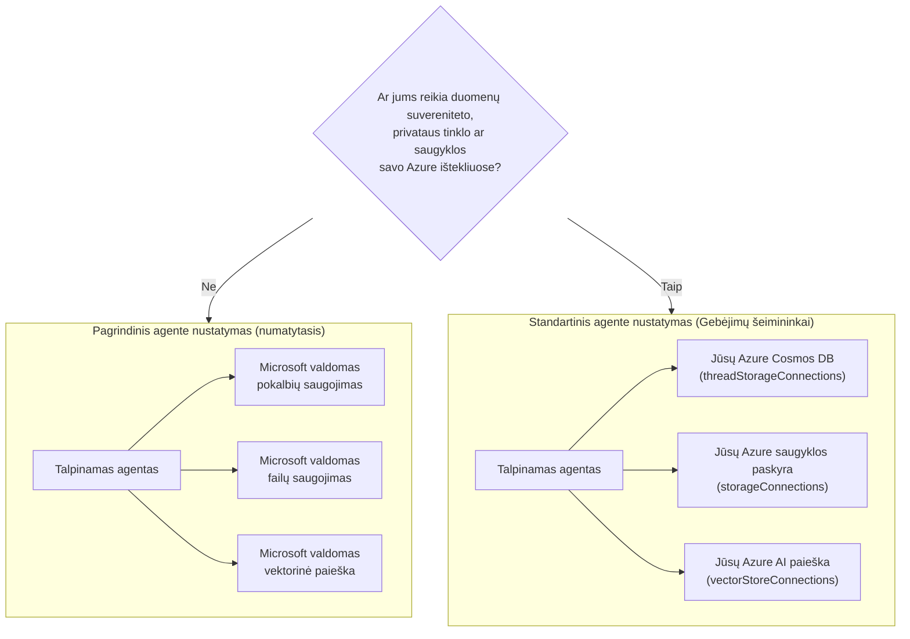

# 5 pamoka: Produkcijoje talpinami agentai — saugykla, atmintis ir valdymas

Pamokoje [4](../lesson-4-agentdeployment/README.md) jūs išdiegėte Developer Onboarding
Agentą kaip **Microsoft Foundry talpinamą agentą** ir prieš jį pastatėte ChatKit frontendą. Ši
pamoka atsakė į klausimą *„kaip išsiųsti agentą?“*. Ši pamoka atsako į kitus klausimus,
kurie kyla įmonėje: **Kur saugomi mano agentei priklausantys duomenys? Kas juos valdo? Kaip užtikrinti atitiktį,
tinklų tvarkymą ir valdymo reikalavimus?**

Svarbiausia šios pamokos idėja yra skirtumas tarp **talpinamo agente** ir
**galimybių talpyklos** — dviejų koncepcijų, kurias lengva supainioti, bet kurios sprendžia visiškai skirtingas
problemas.

## Mokymosi tikslai

Pabaigę šią pamoką galėsite:

- Paaiškinti, ką suteikia **talpinamas agentas** (Microsoft valdomas vykdymas) ir ko jis **nesuteikia**.
- Paaiškinti, kas yra **galimybių talpykla** ir tiksliai kada ji reikalinga.
- Pasirinkti tarp **pagrindinio agento nustatymo** (Microsoft valdoma saugykla) ir **standartinio agento nustatymo**
  (naudojant savo Azure išteklius).
- Suprasti, kaip išsaugoma **pokalbių istorija, failų įkėlimai ir vektorinės saugyklos**, ir kaip
  jas nukreipti į savo Azure Cosmos DB, Azure Storage ir Azure AI Search.
- Taikyti valdymo priemones: duomenų suverenitetą, privačius tinklus ir **Talpinamo MCP įrankio patvirtinimą**.

---

## Išankstinės sąlygos

1. Baigta [4 pamoka](../lesson-4-agentdeployment/README.md) — turite talpinamą agentą.
2. Turite **Microsoft Foundry** projektą ir Azure paskyrą su teisėmis kurti išteklius
   (Cosmos DB, Storage, Azure AI Search) ir priskirti roles prenumeratai / išteklių grupei.
3. **Azure CLI** autentifikavimas: `az login` (ir `az account set --subscription <id>`, jei turite
   daugiau nei vieną prenumeratą).
4. Įdiegta **Azure Developer CLI** (`azd`) — naudojama standartiniam diegimo srautui.
5. Įdiegta **Python 3.12+** su kurso priklausomybėmis (`pip install -r ../requirements.txt`).
6. Veikianti, ne pasenusi modelio diegimo versija (pavyzdžiui `gpt-5.1`). Venkite pasenusių GPT-4o / GPT-4.1.

> Ši pamoka daugiausia yra konceptuali ir susijusi su valdymo sluoksniu. Ją galite perskaityti visą
> nepradėję diegimo, o praktinius pratimus atlikti tada, kai būsite pasiruošę konfigūruoti
> standartinį nustatymą.

---

## 1. Talpinami agentai: ką Foundry už jus tvarko

**Talpinamas agentas** yra agentas, kurio *vykdymo aplinka* yra visiškai valdoma Microsoft
Foundry Agent Service. Kai diegiate talpinamą agentą (kaip darėte 4 pamokoje), Foundry suteikia:

- **Skaičiavimus** — vykdymo aplinką, kuri vykdo jūsų agento kodą ir įrankius.
- **Masto keitimą** — replikos keičia mastą pagal apkrovą (žr. `agent.yaml` `scale` 4 pamokoje).
- **Tapatybę** — valdomą agento tapatybę, kad jis galėtų autentifikuotis Azure be slaptų duomenų.
- **Stebėjimą** — sekimą ir telemetriją (žr. 3 pamokos stebėjimo skyrių).
- **Sesijų valdymą** — pokalbių gijas, kad daugiažingsniai pokalbiai „atsimintų“ ankstesnius žingsnius.


> **Pagrindinė mintis:** Jums **nereikia** konfigūruoti Capabililty Host tiesiog norint *paleisti* talpinamą
> Agentą. Talpinamas agentas veikia iš karto „Microsoft“ valdomoje infrastruktūroje.

---

## 2. Talpinami agentai vs Capability Hosts

**Talpinami agentai ir Capability Hosts sprendžia skirtingas problemas.**

**Talpinami agentai** teikia „Microsoft“ valdoma vykdymo aplinką, įskaitant skaičiavimą, mastelį,
tapatybę, stebėjimo ir sesijos valdymą. Jums **nereikia** Capability Hosts tiesiog paleisti
Talpinamą agentą.

**Capability Hosts** reikalingi tik tada, kai norite, kad Agent Service naudotų **kliento valdytus
išteklius** vietoje „Microsoft“ valdomos saugyklos. Jei jus tenkina numatytoji
Microsoft valdoma saugykla, vektorinė paieška ir pokalbių tęstinumas, **Capability Host
nustatyti nereikia.**

Jei jūsų organizacija reikalauja **duomenų suvereniteto, privatų tinklą, atitikties kontrolę arba
saugyklą savo Azure Cosmos DB, Azure Storage Account ir Azure AI Search ištekliuose**, tuomet
konfigūruojate Capability Hosts, kad prijungtumėte Agent Service prie tų išteklių.

Vienu sakiniu:

> **Talpinamas agentas** yra apie *kur jūsų agentas veikia*. **Capability Host** yra apie *kur gyvena jūsų
> agente duomenys*.

| Sunkumas | Talpinamas agentas | Capability Host |
|---------|--------------------|-----------------|
| Skaičiavimas / mastelis / tapatybė | ✅ Teikiama | — |
| Stebėjimas / sekimas | ✅ Teikiama | — |
| Pokalbio ir gijos sesijos valdymas | ✅ Teikiama | Peradresuoja *kur saugoma* |
| Kur saugoma pokalbio istorija | Pagal numatytuosius nustatymus valdo Microsoft | Jūsų Azure Cosmos DB |
| Kur saugomi įkelti failai | Pagal numatytuosius nustatymus valdo Microsoft | Jūsų Azure Storage Account |
| Kur saugomos vektorinės įrašų reprezentacijos | Pagal numatytuosius nustatymus valdo Microsoft | Jūsų Azure AI Search |
| Reikalinga agento paleidimui? | ✅ Taip (tai *yra* agento šeimininkas) | ❌ Ne — pasirinktinai |
| Reikalinga duomenų suverenitetui / BYO saugyklai? | ❌ Vien tik nepakanka | ✅ Taip |

---

## 3. Pagrindinis vs Standartinis agento nustatymas

„Foundry“ apibūdina du duomenų konfigūracijos tipus kaip **pagrindinį** ir **standartinį** agento nustatymą.



### Kada likti prie pagrindinio nustatymo (be Capability Host)

- Vystymui, prototipų kūrimui ir testavimui.
- Vidiniams įrankiams, kai „Microsoft“ valdoma saugykla atitinka jūsų duomenų tvarkymo politiką.
- Kai norite greičiausio kelio prie veikiamo agento su kuo mažesniais infrastruktūros reikalavimais.

### Kada reikia standartinio nustatymo (Capability Hosts)

- **Duomenų suverenitetas** — visi agento duomenys turi likti jūsų Azure prenumeratoje/regionuose.
- **Saugumo kontrolė** — turite naudoti savo saugyklų paskyras, duomenų bazes ir paieškos paslaugas.
- **Atitiktis** — turite reglamentinius arba organizacinius reikalavimus dėl duomenų saugojimo vietos.
- **Privatus tinklas** — srautas turi likti jūsų virtualiame tinkle (BYO virtualus tinklas).

> **Microsoft rekomendacija:** naudokite *atskirus* „Foundry“ paskyras/projektus standartiniam ir
> pagrindiniam nustatymui. Venkite abiejų nustatymų rūšių maišymo vienoje „Foundry“ paskyroje.

---

## 4. Kaip veikia Capability Hosts

**Capability Host** yra poresursas, kurį konfigūruojate **dviem lygmenimis**: „Foundry“ **paskyroje**
ir „Foundry“ **projekte**. Jis nurodo Agent Service, kur saugoti ir apdoroti agento duomenis:
pokalbio istoriją, failų įkėlimus ir vektorines saugyklas.

Du pagrindiniai taisyklės:

1. **Paskyra prieš projektą.** Negalite sukurti projekto Capability Host, jei nėra
   paskyros lygmens Capability Host.

2. **Nėra konfigūracijos paveldėjimo.** **Projekto** galimybių priegloba yra tai, ką Agent Service
   iš tiesų skaito, kad nuspręstų, kuriuos saugyklos/pokalbių/vektorių išteklius naudoti. Sąskaitos lygmens
   ryšiai *nėra* automatiškai naudojami projekte — projekto galimybių priegloba turi
   juos aiškiai nurodyti.

### Ryšiai, kurių reikia standartiniam nustatymui

Galimybių prieglobos nurodo **ryšius** (sukurtus jūsų Foundry sąskaitoje/projekte), kurie nurodo į
jūsų Azure išteklius:

| Galimybių prieglobos savybė | Saugo | Jūsų Azure išteklius |
|--------------------------|--------|---------------------|
| `threadStorageConnections` | Agentų apibrėžimai + pokalbių istorija | Azure Cosmos DB |
| `storageConnections` | Failų įkėlimai / blob saugykla | Azure Storage Account |
| `vectorStoreConnections` | Vektorių įterpimai paieškai/retrievaliui | Azure AI Search |
| `aiServicesConnections` *(neprivaloma)* | Jūsų modelių diegimai | Azure OpenAI |

Kiekviename ryšyje turi būti užpildyti `authType`, `category`, `target` (paslaugos **galo URL**, ne
ištekliaus ID) bei `metadata.ResourceId` (pilnas Azure ištekliaus ID), kitaip Agent Service
negalės vykdymo metu rasti išteklių.

### Galimybių prieglobų konfigūravimas (valdymo plokštuma)

Galimybių prieglobos šiuo metu valdomos per **Azure Resource Manager REST API** (kol kas nėra
SDK galimybių prieglobų valdymui). Pirmiausia sukurkite **sąskaitos** galimybių prieglobą:

```http
PUT https://management.azure.com/subscriptions/{subscriptionId}/resourceGroups/{rg}/providers/Microsoft.CognitiveServices/accounts/{account}/capabilityHosts/{name}?api-version=2025-06-01

{
  "properties": { "capabilityHostKind": "Agents" }
}
```

Tada sukurkite **projekto** galimybių prieglobą, kuri nurodo jūsų ryšius:

```http
PUT https://management.azure.com/subscriptions/{subscriptionId}/resourceGroups/{rg}/providers/Microsoft.CognitiveServices/accounts/{account}/projects/{project}/capabilityHosts/{name}?api-version=2025-06-01

{
  "properties": {
    "capabilityHostKind": "Agents",
    "threadStorageConnections": ["my-cosmosdb-connection"],
    "vectorStoreConnections":  ["my-ai-search-connection"],
    "storageConnections":      ["my-storage-connection"]
  }
}
```

> **Apribojimai, kuriuos reikia prisiminti:**
> - **Vienas galimybių priegloba kiekvienoje sferoje.** Antrasis toje pačioje sferoje grąžina `409 Conflict`.
> - **Atnaujinimų nėra.** Norint pakeisti konfigūraciją, turite **ištrinti ir sukurti iš naujo** galimybių prieglobą.
> - **Trinimas yra destruktyvus.** Ištrynus galimybių prieglobą, agentams prarandamas prieigos prie failų,
>   pokalbių ir vektorių saugyklų, į kurias jis nukreipė, galimybė.

### Patikrinkite, ar veikia

Po konfigūracijos paleiskite testinį pokalbį ir patvirtinkite, kad:

- Pokalbiai atsiranda **jūsų Azure Cosmos DB**.
- Įkelti failai atsiranda **jūsų Azure Storage sąskaitoje**.
- Vektorių duomenys atsiranda **jūsų Azure AI Search indekse**.

---

## 5. Atminties ir konteksto valdymas

„Sesijos valdymas“ (Hosted Agent funkcija) ir „kur saugomos gijos“ (Capability Host rūpestis)
sujungia, kad jūsų agentas turėtų **atmintį**:

- **Gija** (pokalbis) laiko sutvarkytas pokalbio užduotis. Responses API jungia skambučius per
  `previous_response_id` (tai matėte 4 pamokos bandymuose).
- **Paprastame nustatyme** gijos/pokalbio būsena gyvena Microsoft valdomoje saugykloje.
- **Standartiniame nustatyme** ta pati būsena saugoma **jūsų Azure Cosmos DB** per
  `threadStorageConnections` — suteikdama ilgaamžę, užklausomą, nepriklausomą pokalbių istoriją.

Tai yra skirtumas tarp agento, kuris „prisimena sesijos metu“, ir įmonės sistemos, kur kiekvienas
pokalbis saugomas jūsų atitikties ribose.

---

## 6. Valdymo ir saugumo kontrolinis sąrašas

Naudokite šį kontrolinį sąrašą, kai perkeliate talpinamą agentą iš prototipo į gamybą:

- [ ] **Pasirinkite paprastą arba standartinį nustatymą** pagal 3 sk. klausimus — dokumentuokite sprendimą.
- [ ] **Duomenų suverenitetas:** jei reikia, sukonfigūruokite Capability Hosts taip, kad pokalbių istorija
      (Cosmos DB), failai (Storage) ir vektoriai (AI Search) liktų jūsų prenumeratoje/regionuose.
- [ ] **Privatus tinklas:** standartiniam nustatymui ribokite eismą naudodami savo virtualų tinklą (Bring Your Own Virtual Network),
      kad duomenys neišeitų už tinklo ribų (padeda užkirsti kelią duomenų nutekėjimui).
- [ ] **RBAC:** suteikite minimalias privilegijas. Galimybių prieglobų kūrimui reikia **Contributor** prieigos
      Foundry sąskaitoje; prieigos prie Azure išteklių suteikimui reikia **User Access Administrator**
      arba **Owner** teisių.
- [ ] **Talpinamo MCP įrankio valdymas:** peržiūrėkite kiekvieną MCP serverį, kurį agentas gali kviesti, ir nustatykite
      **patvirtinimo režimą** (žr. 7 sk.). Niekada nepalikite neperžiūrėto išorinio įrankio prieigos gamybiniam agentui.
- [ ] **Stebėsena:** įsitikinkite, kad įjungtas sekimas/telemetrija (4 pamoka), kad galėtumėte tikrinti įrankių kvietimus.
- [ ] **Išlaidos:** BYO ištekliai (Cosmos DB, AI Search, Storage) apmokestinami pagal *jūsų* prenumeratą —
      stebėkite jų dydį ir naudojimą. Paprastas nustatymas įtraukia saugyklą į valdomą paslaugą.

---

## 7. Talpinami MCP įrankiai ir patvirtinimo srautai

4 pamokos Developer Onboarding Agent jau naudoja **Hosted MCP įrankį** — 
[Microsoft Learn MCP serverį](https://learn.microsoft.com/api/mcp) — pridėtą taip:

```python
client.get_mcp_tool(
    name="Microsoft Learn MCP",
    url="https://learn.microsoft.com/api/mcp",
    approval_mode="never_require",
)
```

**Model Context Protocol (MCP)** yra atviras standartas, leidžiantis agentui atrasti ir kviesti
išorinius įrankius per vieningą sąsają. **Talpinami MCP įrankiai** leidžia Foundry kviesti MCP serverį
agento vardu. Gamyboje svarbūs du valdymo svertai:

- **`approval_mode`** — kontroliuoja, ar kiekvienam įrankio kvietimui reikia žmogaus/skambinančiojo patvirtinimo.
  - `never_require` yra patogu patikimam, tik skaitymui skirtam serveriui kaip Microsoft Learn.
  - Serveriams, galintiems **rašyti** ar prieiti prie jautrių sistemų, reikia patvirtinimo, kad kvietimas būtų
    peržiūrėtas prieš vykdymą. Tai jūsų **patvirtinimo srautas**.
- **Serverių sąrašo ribojimas** — jungkitės tik prie MCP serverių, kuriuos peržiūrėjote ir kuriais pasitikite. MCP
  URL traktuokite kaip bet kokią kitą gamybinę priklausomybę.

> **Išbandykite:** pakeiskite 4 pamokos agento `approval_mode` į reikalaujantį patvirtinimo, perkraukite jį ir
> stebėkite, kaip įrankių kvietimai dabar sustoja patvirtinimui prieš vykdymą.

---

## Praktinės užduotys

1. **Klasifikuokite scenarijų.** Kiekvienam nuspręskite *paprastą* ar *standartinį* nustatymą ir pagrįskite sprendimą:
   (a) hakatono demonstraciją, (b) sveikatos priežiūros įdarbinimo asistentą, tvarkantį PII, (c) vidinį
   DUK botą, (d) banko agentą, kuris privalo saugoti visus duomenis regione.
2. **Susiekite saugyklą.** 4 pamokos agentui nurodykite, kuri galimybių prieglobos savybė saugo
   jo (a) pokalbių istoriją, (b) įkeltus darbuotojų failus, (c) vektorių įterpimus.
3. **Sukurkite patvirtinimo srautą.** Pridėkite hipotetinį „sukurti Jira užduotį“ MCP įrankį agentui.
   Kokį `approval_mode` naudotumėte ir kodėl?
4. **Išlaidų kompromisas.** Parašykite du tris sakinius apie išlaidų pasekmes pereinant nuo paprasto
   prie standartinio nustatymo aukšto srauto agentui.

---

## Šaltiniai

- [Galimybių prieglobos — Microsoft Foundry](https://learn.microsoft.com/azure/foundry/agents/concepts/capability-hosts)
- [Standartinis agento nustatymas (įtraukta į įmonės parengtį)](https://learn.microsoft.com/azure/foundry/agents/concepts/standard-agent-setup)

- [Naudokite savo išteklius](https://learn.microsoft.com/azure/foundry/agents/how-to/use-your-own-resources)

- [Nustatykite savo agentų aplinką (pagrindinė vs standartinė)](https://learn.microsoft.com/azure/foundry/agents/environment-setup)
- [Nustatykite privačią tinklo sąsają Foundry agentų tarnybai](https://learn.microsoft.com/azure/foundry/agents/how-to/virtual-networks)
- [Pridėkite ryšį prie savo projekto](https://learn.microsoft.com/azure/foundry/how-to/connections-add)
- [Microsoft Learn MCP serveris](https://learn.microsoft.com/training/support/mcp)
- [Model Context Protocol](https://modelcontextprotocol.io/)

---

**Ankstesnis:** [Pamoka 4 — Agentų diegimas](../lesson-4-agentdeployment/README.md) &nbsp;·&nbsp; **Kitas:** [Pamoka 6 — Microsoft Toolbox](../lesson-6-toolbox/README.md)

---

<!-- CO-OP TRANSLATOR DISCLAIMER START -->
**Atsakomybės apribojimas**:
Šis dokumentas buvo išverstas naudojant dirbtinio intelekto vertimo paslaugą [Co-op Translator](https://github.com/Azure/co-op-translator). Nors siekiame tikslumo, prašome atkreipti dėmesį, kad automatiniai vertimai gali turėti klaidų ar netikslumų. Originalus dokumentas jo gimtąja kalba laikomas autoritetingu šaltiniu. Svarbiai informacijai rekomenduojama naudoti profesionalų žmogiškąjį vertimą. Mes neatsakome už jokius nesusipratimus ar neteisingą interpretaciją, kilusią naudojantis šiuo vertimu.
<!-- CO-OP TRANSLATOR DISCLAIMER END -->