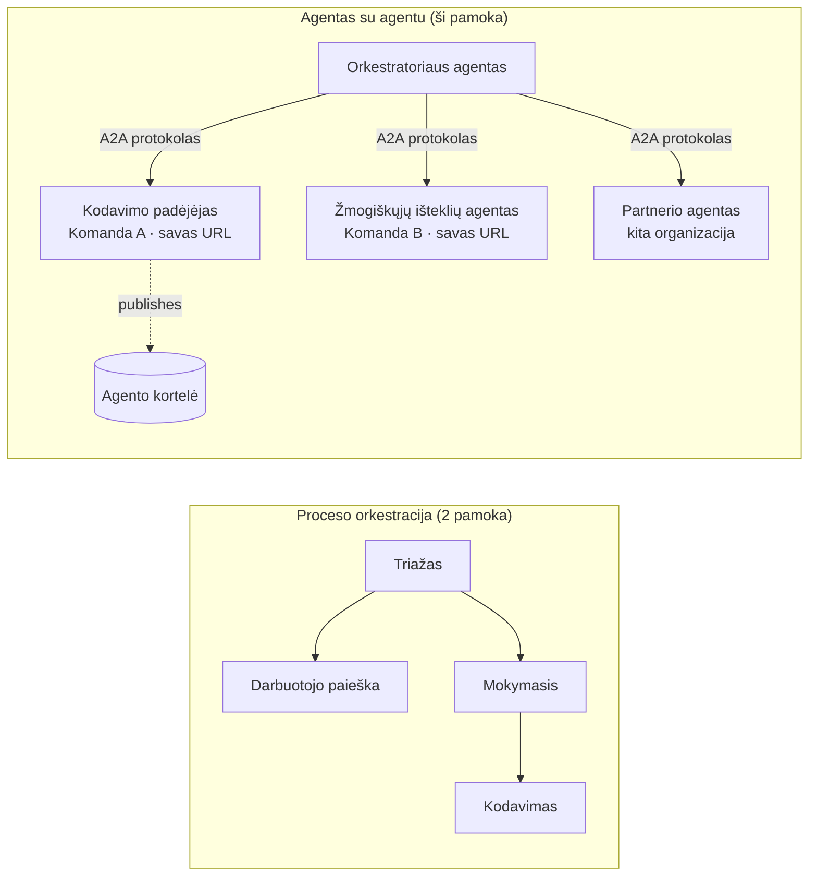

# 7 pamoka: Multiagentų orkestracija ir agentų tarpusavio sąveika (A2A)

Pamokoje [6](../lesson-6-toolbox/README.md) kurėjote valdomus įrankius ir talpinamus agentus.
Tačiau tikros sistemos retai naudoja tik **vieną** agentą. Didėjant mastui, sudėliojate **daug** agentų — kai kuriuos
valdote jūs, kai kuriuos kiti komandos nariai, o kai kurie veikia visiškai kitose organizacijose. Ši pamoka apie
tai, kaip agentai veikia **kartu**.

Jau susipažinote su viena multiagentinės sistemos forma
[PAMOKOS 2 `agent-orchestration.py`](../lesson-2-agent-development/README.md): su **perdavimu** (handoff)
modeliu, kur triage agentas nukreipia į specialistus **viename procese**. Ši pamoka kyla
lygiu aukščiau — į **Agentų tarpusavio sąveiką (A2A)**, atvirą protokolą agentams, kurie veikia kaip nepriklausomos
**tinklo paslaugos** ir kviečiasi vieni kitus per procesų, komandų ir organizacijų ribas.

## Mokymosi tikslai

Šios pamokos pabaigoje galėsite:

- Paaiškinti skirtumą tarp **in-process orkestracijos** (handoff/darbų srautai) ir
  **Agent-to-Agent (A2A)** komunikacijos, ir pasirinkti tinkamą.
- Apibūdinti A2A pagrindinius elementus: **Agent Card**, **įgūdžiai**, **užduotys** ir **atradimas**.
- **Eksponuoti** Microsoft Agent Framework agentą kaip A2A paslaugą su `A2AExecutor`.
- **Naudoti** nuotolinį agentą kaip tinklo kolegą per `A2AAgent`.
- Taikyti įmonės reikalavimus A2A ryšiui: **saugumą, tapatybę, valdymą, stebimumą ir kaštus**.

---

## Išankstiniai reikalavimai

1. Baigta [PAMOKA 2](../lesson-2-agent-development/README.md) (agentų kūrimas ir orkestracija).
2. **Microsoft Foundry** projektas su esamu modelio diegimu (pavyzdžiui, `gpt-5.1` ir
   `gpt-5-codex` programavimo pavyzdžiui). Venkite nebenaudojamų GPT-4o / GPT-4.1.
3. **Azure CLI** autentifikacija: `az login`.
4. **Python 3.12+** su įdiegtais kurso priklausomybėmis (`pip install -r ../requirements.txt`).
   Pamoka 7 prideda peržiūros paketus: `agent-framework-a2a`, `a2a-sdk` ir `uvicorn`.
5. `FOUNDRY_PROJECT_ENDPOINT` ir `FOUNDRY_MODEL` nustatyti jūsų `.env` faile (žr. kurso README).

---

## 1. Du būdai, kaip agentai veikia kartu

Nėra vieno „multi-agent“ modelio. Pasirinkite tą, kuris atitinka jūsų **ribas**:

| Modelis | Kur veikia agentai | Kaip jungiasi | Kada naudoti |
|---------|------------------|------------------|----------|
| **Perdavimas / Darbų srautai** (Pamoka 2) | Vienas procesas, viena kodo bazė | Atminties grafas (`HandoffBuilder`, `WorkflowBuilder`) | Jūs valdote visus agentus ir diegiate kartu. |
| **Agent-to-Agent (A2A)** (ši pamoka) | Atskiros paslaugos, atskiri gyvavimo ciklai | Atviras **A2A protokolas** per HTTP, atrandamas per **Agent Cards** | Agentai priklauso skirtingoms komandoms/organizacijoms, kai kurie veikia nepriklausomai, arba rašyti skirtingomis sistemomis. |

Perdavimas reiškia **maršrutizavimą programoje**. A2A reiškia **agentų sudėjimą kaip
nepriklausomas paslaugas** — agentų analogiją perėjimui nuo funkcijų kvietimų prie mikroservisų.



> **Jos sudaromos.** Orkestratorius, kurį kuriate su `HandoffBuilder`, gali turėti **nuotolinių A2A agentų**
> kaip dalyvius — vidinis maršrutizavimas į paslaugas, kurios veikia bet kur.

---

## 2. A2A pagrindiniai elementai

A2A yra **atviras protokolas** (ne tik Microsoft specifinis), todėl A2A agentą gali naudoti Microsoft
Agent Framework, LangGraph, kita programa arba kitos įmonės sprendimas. Svarbūs keturi konceptai:

- **Agent Card** — mažas JSON dokumentas, paskelbtas adresu
  `/.well-known/agent-card.json`, kuriame pateikiama agento **vardas, aprašymas, URL, versija,
  įgūdžiai ir gebėjimai**. Tai leidžia klientui **atrasti**, ką gali nuotolinis agentas.
- **Įgūdžiai** — deklaruoti dalykai, kuriuos agentas gali atlikti (`id`, `vardas`, `aprašymas`, žymos,
  `pavyzdžiai`). Klientai (ir modeliai) juos naudoja nuspręsti, ar kvieti agentą.
- **Užduotys** — skambutis A2A agentui yra **užduotis** su gyvavimo ciklu (pateikta → vykdoma →
  baigta / nepavyko). Serveris seka užduotis **užduočių saugykloje**; palaikomas srautas atnaujinimų.
- **Atradimas** — klientas, turėdamas tik URL, parsiunčia Agent Card ir žino, kaip kvieti agentą.

---

## 3. Eksponuoti agentą kaip A2A paslaugą — `a2a_server.py`

**Kūrimo/tarnybos** pusė supakuoja bet kurį Microsoft Agent Framework agentą su `A2AExecutor` ir įdiegia jį
į A2A HTTP programą. Žr. [`a2a_server.py`](../../../lesson-7-multi-agent-a2a/a2a_server.py). Svarbūs sujungimai:

```python
from agent_framework.a2a import A2AExecutor
from a2a.server.apps import A2AStarletteApplication
from a2a.server.request_handlers import DefaultRequestHandler
from a2a.server.tasks import InMemoryTaskStore
from a2a.types import AgentCapabilities, AgentCard, AgentSkill

agent = client.as_agent(name="coding-assistant", instructions="...")

agent_card = AgentCard(
    name="Coding Assistant",
    description="Generates runnable code samples...",
    url="http://localhost:9000/",
    version="1.0.0",
    capabilities=AgentCapabilities(streaming=True),
    default_input_modes=["text"],
    default_output_modes=["text"],
    skills=[AgentSkill(id="generate-code", name="Generate code",
                       description="Write a runnable code snippet.", tags=["code"])],
)

request_handler = DefaultRequestHandler(
    agent_executor=A2AExecutor(agent),
    task_store=InMemoryTaskStore(),
)
app = A2AStarletteApplication(agent_card=agent_card, http_handler=request_handler).build()
# tiekiama su uvicorn prievade 9000
```

Atkreipkite dėmesį, kad agento kodas **nepasikeitė** — `A2AExecutor` pritaiko jūsų esamą agentą protokolui.
Agent Card leidžia agentui būti **atrandamam** bet kuriam A2A klientui.

---

## 4. Naudoti nuotolinį agentą — `a2a_client.py`

**Naudojimo** pusė jungiasi prie nuotolinio agento **per URL**, parsiunčia jo Agent Card ir kviečia jį
lygiai kaip vietinį agentą. Žr. [`a2a_client.py`](../../../lesson-7-multi-agent-a2a/a2a_client.py):

```python
from agent_framework.a2a import A2AAgent

remote_agent = A2AAgent(name="remote-coding-assistant", url="http://localhost:9000")
result = await remote_agent.run("Write a Python function that reverses a string.")
print(result.text)
```

Štai koks A2A tikslas: nuotolinis agentas iš kviečiančiojo pusės elgiasi kaip bet kuris kitas
`agent_framework` agentas, todėl jį galite įterpti į darbų srautą arba perduoti — nors jis veikia
kitame procese, kitame kompiuteryje, priklauso kitai komandai.

### Vykdykite nuo pradžios iki pabaigos

```bash
# Terminalas 1 — pradėti A2A paslaugą
python a2a_server.py

# Terminalas 2 — paskambinkite jam
python a2a_client.py "Write a Python function that reverses a string."
```

Pamatysite programavimo asistento atsakymą ateinantį per A2A protokolą. Atidarykite
`http://localhost:9000/.well-known/agent-card.json` naršyklėje, kad pamatytumėte paskelbtą Agent Card.

---

## 5. Įmonės reikalavimai

Pavertus agentus tinklo paslaugomis atsiranda tokie patys iššūkiai kaip bet kurioje paskirstytoje sistemoje —
be to, keletas specifinių AI sričiai:

- **Tapatybė ir autentifikacija.** Niekada neeksponuokite A2A agento be autentifikacijos. Agent Card neša
  `security` / `security_schemes`, o `A2AAgent` priima `auth_interceptor`, kad kviečiantieji pridėtų
  kredencialus (OAuth nešėjų žetonus, API raktus). Produkcijoje naudokite Entra ID / valdomas tapatybes
  paslaugų paslaugoms autentifikacijoje; paslaugą pridėkite už vartų (gateway).
- **Valdymas.** Derinkite A2A su [6 pamokos Toolbox](../lesson-6-toolbox/README.md): nuotolinis
  agentas gali būti paskelbtas kaip **A2A įrankis** valdomame įrankių rinkinyje, kad RBAC, kredencialų injekcija
  ir apsauginės politikos taikytųsi centralizuotai.
- **Stebimumas.** Užklausa dabar kerta procesų ribas, todėl paskleiskite sekimą per kvietimą.
  Įjunkite [Foundry Observability / OpenTelemetry](../lesson-3-agent-evals/README.md) tiek
  orkestratoriui, tiek kiekvienam nuotoliniam agentui, kad turėtumėte vieną galutinį visos grandinės sekimą.
- **Versijavimas.** Agent Card turi `version`. Elkitės kaip su API: papildomi pakeitimai saugūs;
  įgūdžių sutarties pažeidimas reikalauja naujos versijos ir migracijos laikotarpio naudotojams.
- **Patikimumas.** Nuotoliniai agentai gali nepavykti atskirai. Nustatykite timeout’us (`A2AAgent(timeout=...)`),
  valdykite dalinį gedimą, neleiskite vienam lėtai veikiančiam kolegai blokuoti visą orkestraciją.
- **Kaštai.** Kiekvienas nuotolinio agento kvietimas yra atskiras modelio kvietimas. Išsisklaidymas padidina sąnaudas —
  planuokite biudžetą ir pasirinkite maršrutizavimą į **vieną** geriausią agentą, o ne transliavimą daugeliui.

---

## Praktinės užduotys

1. **Pridėkite antrą paslaugą.** Nukopijuokite `a2a_server.py`, kad eksponuotumėte agentą **employee-search** prievade
   9001 su savo Agent Card ir įgūdžiais. Paleiskite abu ir leiskite klientui kvieti kiekvieną.
2. **Orkestruokite nuotolinius kolegas.** Sukurkite mažą `HandoffBuilder` (arba paprastą maršrutizatorių), kurio
   dalyviai būtų du `A2AAgent` nurodantys jūsų dvi paslaugas. Nukreipkite užklausą tinkamam.
3. **Užtikrinkite saugumą.** Pridėkite `auth_interceptor` klientui ir reikalaukite nešėjo žetono serveryje.
   Kas nutrūksta, jei žetonas nepridedamas? Kur jį laikytumėte produkcijoje?
4. **Perdavimas vs A2A.** Parašykite du trumpus paragrafus: kada laikytumėte Pamokos 2 vidinio proceso
   perdavimą, o kada pateisinta papildoma A2A sudėtingumo ofsetas? Pateikite konkretų kiekvieno pavyzdį.

---

## Šaltiniai

- [Agent-to-Agent (A2A) — Microsoft Agent Framework](https://learn.microsoft.com/agent-framework/user-guide/agent-orchestration/a2a)
- [Multi-agent orchestration — Microsoft Agent Framework](https://learn.microsoft.com/agent-framework/user-guide/agent-orchestration/)
- [A2A protokolo specifikacija](https://a2a-protocol.org/)
- [A2A Python SDK (`a2a-sdk`)](https://github.com/a2aproject/a2a-python)
- [Foundry Agent Service — multi-agent modeliai](https://learn.microsoft.com/azure/ai-foundry/agents/concepts/connected-agents)

---

**Ankstesnė:** [6 pamoka — Microsoft Toolbox](../lesson-6-toolbox/README.md)

---

<!-- CO-OP TRANSLATOR DISCLAIMER START -->
**Atsakomybės apribojimas**:
Šis dokumentas buvo išverstas naudojant dirbtinio intelekto vertimo paslaugą [Co-op Translator](https://github.com/Azure/co-op-translator). Nors siekiame tikslumo, prašome atkreipti dėmesį, kad automatiniai vertimai gali turėti klaidų ar netikslumų. Originalus dokumentas jo gimtąja kalba laikomas autoritetingu šaltiniu. Svarbiai informacijai rekomenduojama naudoti profesionalų žmogiškąjį vertimą. Mes neatsakome už jokius nesusipratimus ar neteisingą interpretaciją, kilusią naudojantis šiuo vertimu.
<!-- CO-OP TRANSLATOR DISCLAIMER END -->