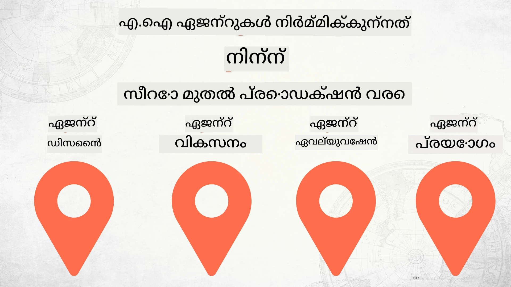

# പൂജ്യം മുതൽ ഉത്പാദനത്തിന് എഐ ഏജന്റുകൾ നിർമ്മിക്കൽ



### 🌐 ബഹു-ഭാഷാ പിന്തുണ

#### GitHub ആക്ഷനിലൂടെ പിന്തുണയ്ക്കുന്നു (സ്വയമേവയും എല്ലായ്പ്പോഴും പുതുക്കിയതും)

<!-- CO-OP TRANSLATOR LANGUAGES TABLE START -->
[Arabic](../ar/README.md) | [Bengali](../bn/README.md) | [Bulgarian](../bg/README.md) | [Burmese (Myanmar)](../my/README.md) | [Chinese (Simplified)](../zh-CN/README.md) | [Chinese (Traditional, Hong Kong)](../zh-HK/README.md) | [Chinese (Traditional, Macau)](../zh-MO/README.md) | [Chinese (Traditional, Taiwan)](../zh-TW/README.md) | [Croatian](../hr/README.md) | [Czech](../cs/README.md) | [Danish](../da/README.md) | [Dutch](../nl/README.md) | [Estonian](../et/README.md) | [Finnish](../fi/README.md) | [French](../fr/README.md) | [German](../de/README.md) | [Greek](../el/README.md) | [Hebrew](../he/README.md) | [Hindi](../hi/README.md) | [Hungarian](../hu/README.md) | [Indonesian](../id/README.md) | [Italian](../it/README.md) | [Japanese](../ja/README.md) | [Kannada](../kn/README.md) | [Khmer](../km/README.md) | [Korean](../ko/README.md) | [Lithuanian](../lt/README.md) | [Malay](../ms/README.md) | [Malayalam](./README.md) | [Marathi](../mr/README.md) | [Nepali](../ne/README.md) | [Nigerian Pidgin](../pcm/README.md) | [Norwegian](../no/README.md) | [Persian (Farsi)](../fa/README.md) | [Polish](../pl/README.md) | [Portuguese (Brazil)](../pt-BR/README.md) | [Portuguese (Portugal)](../pt-PT/README.md) | [Punjabi (Gurmukhi)](../pa/README.md) | [Romanian](../ro/README.md) | [Russian](../ru/README.md) | [Serbian (Cyrillic)](../sr/README.md) | [Slovak](../sk/README.md) | [Slovenian](../sl/README.md) | [Spanish](../es/README.md) | [Swahili](../sw/README.md) | [Swedish](../sv/README.md) | [Tagalog (Filipino)](../tl/README.md) | [Tamil](../ta/README.md) | [Telugu](../te/README.md) | [Thai](../th/README.md) | [Turkish](../tr/README.md) | [Ukrainian](../uk/README.md) | [Urdu](../ur/README.md) | [Vietnamese](../vi/README.md)

> **പ്രാദേശികമായി ക്ലോൺ ചെയ്യാൻ മുൻഗണനയുണ്ടോ?**
>
> ഈ റിപ്പോസിറ്ററിയിൽ 50-ത്തിലധികം ഭാഷാ പരിഭാഷകൾ ഉൾക്കൊള്ളുന്നുണ്ട്, ഇത് ഡൗൺലോഡ് വലുപ്പം ഗണ്യമായി വർധിപ്പിക്കുന്നു. പരിഭാഷകളില്ലാതെ ക്ലോൺ ചെയ്യാൻ sparse checkout ഉപയോഗിക്കാം:
>
> **Bash / macOS / Linux:**
> ```bash
> git clone --filter=blob:none --sparse https://github.com/microsoft/Building-AI-Agents-From-Zero-To-Production.git
> cd Building-AI-Agents-From-Zero-To-Production
> git sparse-checkout set --no-cone '/*' '!translations' '!translated_images'
> ```
>
> **CMD (Windows):**
> ```cmd
> git clone --filter=blob:none --sparse https://github.com/microsoft/Building-AI-Agents-From-Zero-To-Production.git
> cd Building-AI-Agents-From-Zero-To-Production
> git sparse-checkout set --no-cone "/*" "!translations" "!translated_images"
> ```
>
> ഇത് ഏറ്റവും വേഗത്തിലുള്ള ഡൗൺലോഡോടെ, പൂർണ്ണമായ കോഴ്‌സ് കണ്ടുപിടിക്കാൻ നിങ്ങളെ സഹായിക്കും.
<!-- CO-OP TRANSLATOR LANGUAGES TABLE END -->

## എഐ ഏജന്റ് വികസന ജീവിതചക്രത്തിന്റെ അടിസ്ഥാനങ്ങൾ പഠിപ്പിക്കുന്ന ഒരു കോഴ്‌സ്

[](https://github.com/microsoft/Building-AI-Agents-From-Zero-To-Production/blob/master/LICENSE?WT.mc_id=academic-105485-koreyst)
[](https://GitHub.com/microsoft/Building-AI-Agents-From-Zero-To-Production/graphs/contributors/?WT.mc_id=academic-105485-koreyst)
[](https://GitHub.com/microsoft/Building-AI-Agents-From-Zero-To-Production/issues/?WT.mc_id=academic-105485-koreyst)
[](https://GitHub.com/microsoft/Building-AI-Agents-From-Zero-To-Production/pulls/?WT.mc_id=academic-105485-koreyst)
[](http://makeapullrequest.com?WT.mc_id=academic-105485-koreyst)

[](https://discord.gg/Kuaw3ktsu6)

## 🌱 ആരംഭിക്കുന്നത്

ഈ കോഴ്‌സിൽ എഐ ഏജന്റുകൾ നിർമ്മിക്കുന്നതും വിന്യസിക്കേണ്ടതുമായ അടിസ്ഥാന കാര്യങ്ങൾ ഉൾക്കൊള്ളുന്ന പാഠങ്ങളുണ്ട്.

ഓരോ പാഠവും മുൻപത്തെ പാഠത്തെ അടിസ്ഥാനമാക്കി നിർമ്മിക്കുന്നതിനാൽ, ആദ്യം മുതൽ തുടക്കം വെച്ച് അവസാനം വരെ പഠിക്കണമെന്ന് ഞങ്ങൾ ശുപാർശ ചെയ്യുന്നു.

എഐ ഏജന്റ് വിഷയങ്ങളെ കുറിച്ച് കൂടുതൽ അന്വേഷിക്കാൻ നിങ്ങൾക്കുണ്ടെങ്കിൽ, [AI Agents For Beginners Course](https://aka.ms/ai-agents-beginners) പരിശോധിക്കാം.

### മറ്റ് പഠിതാക്കളുമായി പരിചയപ്പെടുക, നിങ്ങളുടെ ചോദ്യങ്ങൾ ഉത്തരം பெறുക

എഐ ഏജന്റുകൾ നിർമ്മിക്കുമ്പോൾ നിങ്ങൾക്ക് തടസ്സം ഉണ്ടെങ്കിൽ അല്ലെങ്കിൽ എന്തെങ്കിലും ചോദ്യങ്ങൾ ഉണ്ടെങ്കിൽ, നമ്മുടെ സമർപ്പിച്ചിട്ടുള്ള Discord ചാനലിൽ ചേരുക [Microsoft Foundry Discord](https://discord.gg/Kuaw3ktsu6).

### നിങ്ങൾക്കാവശ്യം ഉള്ളതെന്ത്

ഓരോ പാഠത്തിനും നിങ്ങളുടെ ലൊക്കൽ സിസ്റ്റത്തിലേക്ക് നടത്തിപ്പിക്കാൻ കഴിയുന്ന ഒരു കോഡ് സാമ്പിൾ ഉണ്ട്. നിങ്ങളുടെ സ്വന്തം പകർപ്പ് സൃഷ്ടിക്കാൻ [ഈ റിപ്പോ ഫോർക്കുചെയ്യാവുന്നതാണ്](https://github.com/microsoft/Building-AI-Agents-From-Zero-To-Production/fork).

ഈ കോഴ്‌സ് നിലവിൽ താഴെപ്പറയുന്നവ ഉപയോഗിക്കുന്നു:

- [Microsoft Agent Framework (MAF)](https://aka.ms/ai-agents-beginners/agent-framework)
- [Microsoft Foundry](https://azure.microsoft.com/products/ai-foundry)
- [Azure OpenAI Service](https://azure.microsoft.com/products/ai-foundry/models/openai)
- [Azure CLI](https://learn.microsoft.com/cli/azure/authenticate-azure-cli?view=azure-cli-latest)

ആരംഭിക്കുന്നതിന് മുമ്പ് ഈ സേവനങ്ങളിൽ പ്രവേശനം ഉറപ്പാക്കുക.

മോഡൽ ഹോസ്റ്റിംഗ്, മറ്റ് സേവനങ്ങൾ എന്നിവ സംബന്ധിച്ച കൂടുതൽ ഓപ്ഷനുകൾ ഉടൻ വരാനുണ്ട്.

## 🗃️ പാഠങ്ങൾ

| **പാഠം**         | **വിവരണം**                                                                                       |
|--------------------|--------------------------------------------------------------------------------------------------|
| [Agent Design](./lesson-1-agent-design/README.md)       | നമ്മുടെ "ഡവലപ്പർ ഓൺബോർഡിംഗ്" ഏജന്റ് ഉപയോഗകേസിൽ ഒരു പരിചയം, എങ്ങനെ ഫലപ്രദമായ ഏജന്റുകൾ രൂപകൽപ്പന ചെയ്യാം  |
| [Agent Development](./lesson-2-agent-development/README.md)  | Microsoft Agent Framework (MAF) ഉപയോഗിച്ച്, പുതിയ ഡവലപ്പർമാരെ സഹായിക്കുന്ന മൂന്ന് ഏജന്റുകൾ സൃഷ്ടിക്കുക.       |
| [Agent Evaluations](./lesson-3-agent-evals/README.md)  | Microsoft Foundry ഉപയോഗിച്ച്, നമ്മുടെ എഐ ഏജന്റുകൾ എത്രത്തോളം പ്രകടനം കാഴ്ചവച്ചുകൊണ്ടിരിക്കുന്നു എന്നും എങ്ങനെ മെച്ചപ്പെടുത്താമെന്നും കണ്ടെത്തുക. |
| [Agent Deployment](./lesson-4-agent-deployment/README.md)   | ഹോസ്റ്റുചെയ്ത ഏജന്റുകളും OpenAI Chatkit ഉം ഉപയോഗിച്ച് എഐ ഏജന്റ് ഉത്പാദനത്തിൽ എങ്ങനെ വിന്യസിക്കാമെന്ന് കാണുക.       |


## 🎒 മറ്റ് കോഴ്‌സുകൾ

ഞങ്ങൾ മറ്റു കോഴ്‌സുകളും ഒരുക്കുന്നു! പരിശോധിക്കൂ:

<!-- CO-OP TRANSLATOR OTHER COURSES START -->
### LangChain
[](https://aka.ms/langchain4j-for-beginners)
[](https://aka.ms/langchainjs-for-beginners?WT.mc_id=m365-94501-dwahlin)
[](https://github.com/microsoft/langchain-for-beginners?WT.mc_id=m365-94501-dwahlin)
---

### Azure / Edge / MCP / Agents
[](https://github.com/microsoft/AZD-for-beginners?WT.mc_id=academic-105485-koreyst)
[](https://github.com/microsoft/edgeai-for-beginners?WT.mc_id=academic-105485-koreyst)
[](https://github.com/microsoft/mcp-for-beginners?WT.mc_id=academic-105485-koreyst)
[](https://github.com/microsoft/ai-agents-for-beginners?WT.mc_id=academic-105485-koreyst)

---
 
### Generative AI Series
[](https://github.com/microsoft/generative-ai-for-beginners?WT.mc_id=academic-105485-koreyst)
[-9333EA?style=for-the-badge&labelColor=E5E7EB&color=9333EA)](https://github.com/microsoft/Generative-AI-for-beginners-dotnet?WT.mc_id=academic-105485-koreyst)
[-C084FC?style=for-the-badge&labelColor=E5E7EB&color=C084FC)](https://github.com/microsoft/generative-ai-for-beginners-java?WT.mc_id=academic-105485-koreyst)
[-E879F9?style=for-the-badge&labelColor=E5E7EB&color=E879F9)](https://github.com/microsoft/generative-ai-with-javascript?WT.mc_id=academic-105485-koreyst)

---
 
### കോർ ലേണിംഗ്
[](https://aka.ms/ml-beginners?WT.mc_id=academic-105485-koreyst)
[](https://aka.ms/datascience-beginners?WT.mc_id=academic-105485-koreyst)
[](https://aka.ms/ai-beginners?WT.mc_id=academic-105485-koreyst)
[](https://github.com/microsoft/Security-101?WT.mc_id=academic-96948-sayoung)
[](https://aka.ms/webdev-beginners?WT.mc_id=academic-105485-koreyst)
[](https://aka.ms/iot-beginners?WT.mc_id=academic-105485-koreyst)
[](https://github.com/microsoft/xr-development-for-beginners?WT.mc_id=academic-105485-koreyst)

---
 
### കോപൈലറ്റ് സീരീസ്
[](https://aka.ms/GitHubCopilotAI?WT.mc_id=academic-105485-koreyst)
[](https://github.com/microsoft/mastering-github-copilot-for-dotnet-csharp-developers?WT.mc_id=academic-105485-koreyst)
[](https://github.com/microsoft/CopilotAdventures?WT.mc_id=academic-105485-koreyst)
<!-- CO-OP TRANSLATOR OTHER COURSES END -->

## സംഭാവന ചെയ്യൽ

ഈ പ്രോജക്ട് സംഭാവനകളും നിർദ്ദേശങ്ങളും സ്വാഗതം ചെയ്യും. കൂടുതലായ സംഭാവനകൾ നിങ്ങൾക്ക് Contributor License Agreement (CLA) കരാറിന് സമ്മതിക്കണമെന്ന് ആവശ്യപ്പെടും, ഇത് നിങ്ങൾക്ക് നിങ്ങളുടെ സംഭാവന ഉപയോഗിക്കാൻ അവകാശമുണ്ടുള്ളതും ഉപയോഗിക്കാൻ തയാറാണെന്ന് വ്യക്തമാക്കുന്നു. വിശദാംശങ്ങൾക്ക്, <https://cla.opensource.microsoft.com> സന്ദർശിക്കുക.

നിങ്ങൾ ഒരു പുൾ റിക്വസ്റ്റ് സമർപ്പിക്കുമ്പോൾ, CLA ബോട്ട് സ്വയം നിങ്ങളുടെ CLA നൽകേണ്ടതുണ്ടോയെന്ന് നിർണയിച്ച് പ്രസംഗത്തെ അനുയോജ്യമായി ചിഹ്നീകരിക്കും (ഉദാഹരണത്തിന്, സ്റ്റാറ്റസ് ചെക്ക്, കമന്റ്). ബോട്ട് നൽകുന്ന നിർദ്ദേശങ്ങൾ മാത്രം പിന്തുടരുക. ഞങ്ങളുടെ CLA ഉപയോഗിക്കുന്ന എല്ലാ റിപ്പോസിടറികളിലും നിങ്ങൾക്ക് ഇത് ഒരിക്കൽ മാത്രമാകും ചെയ്യേണ്ടത്.

ഈ പ്രോജക്ട് [Microsoft Open Source Code of Conduct](https://opensource.microsoft.com/codeofconduct/) സ്വീകരിച്ചിട്ടുണ്ട്. കൂടുതൽ വിവരങ്ങൾക്ക് [Code of Conduct FAQ](https://opensource.microsoft.com/codeofconduct/faq/) കാണുക അല്ലെങ്കിൽ ചോദനകൾക്കോ അഭിപ്രായങ്ങൾക്കോ [opencode@microsoft.com](mailto:opencode@microsoft.com) എന്ന വിലാസത്തിൽ ബന്ധപ്പെടുക.

## ട്രേഡ് മാർക്കുകൾ

ഈ പ്രോജക്ടിൽ പദ്ധതികൾക്ക്, ഉൽപ്പന്നങ്ങൾക്കോ, സർവീസുകൾക്കോ ട്രേഡ് മാർക്കും ലോഗോകൾ അടങ്ങിയിരിക്കാം. Microsoft ട്രേഡ് മാർക്കും ലോഗോകളും അധികൃതമായി ഉപയോഗിക്കുന്നത് [Microsoft's Trademark & Brand Guidelines](https://www.microsoft.com/legal/intellectualproperty/trademarks/usage/general) പിന്തുടരേണ്ടതാണ്. ഈ പ്രോജക്ടിന്റെ വര്‍ധിപ്പിച്ച പതിപ്പുകളിൽ Microsoft ട്രേഡ് മാർക്കും ലോഗോകളും ഉപയോഗിക്കുന്നത് തെറ്റിദ്ധാരണക്ക് ഇടയായ് Microsoft സ്പോൺസർഷിപ്പ് സൂചിപ്പിക്കരുത്. മൂന്നാംകക്ഷി ട്രേഡ് മാർക്കും ലോഗോകളും ഉപയോഗിക്കുന്നത് ആ മൂന്നാം കക്ഷികളുടെ നയങ്ങളെ അനുസരിക്കുന്നു.

## സഹായം നേടൽ

നിങ്ങൾ ഉണ്ടാകുന്നതിൽ കുടുങ്ങുകയാണോ, AI ആപ്പുകൾ നിർമ്മിക്കുന്നതിനെക്കുറിച്ച് ഏതെല്ലാം ചോദ്യങ്ങളുണ്ടോ എങ്കിൽ, ചേരുക:

[](https://discord.gg/Kuaw3ktsu6)

ഉൽപ്പന്നത്തിന് ഫീഡ്ബാക്കോ പിഴവുകളോ ഉണ്ടെങ്കിൽ സന്ദർശിക്കുക:

[](https://aka.ms/foundry/forum)

---

<!-- CO-OP TRANSLATOR DISCLAIMER START -->
**അസ്വീകാര്യത**:  
ഈ രേഖ AI വിവർത്തന സേവനം [Co-op Translator](https://github.com/Azure/co-op-translator) ഉപയോഗിച്ച് വിവർത്തനം ചെയ്തതാണ്. നമുക്ക് കൃത്യത കൈവരിക്കാൻ ശ്രമിച്ചിരുന്നാലും, സ്വയം പ്രവർത്തിക്കുന്ന വിവർത്തനങ്ങളിൽ പിശകുകൾ അല്ലെങ്കിൽ അശുദ്ധികൾ ഉണ്ടാകാവുന്നതാണ്. അതിനാൽ, ആദ്യഭാഷയിലുള്ള اصلي രേഖ അധികാരപ്രദമായ ഉറവിടമായി കണക്കാക്കപ്പെടണം. നിർണായക വിവരങ്ങൾക്കായി, പ്രൊഫഷണൽ മനുഷ്യ വിവർത്തനം ശിപാർശ ചെയ്യപ്പെടുന്നു. ഈ വിവർത്തനത്തിന്റെ ഉപയോഗത്താൽ സൃഷ്ടമായ ഏതെങ്കിലും തെറ്റിദ്ധാരണകൾക്കോ ദുര്‍വ്വ്യാഖ്യാനങ്ങൾക്കോ ഞങ്ങൾ ഉത്തരവാദികളல்ல.
<!-- CO-OP TRANSLATOR DISCLAIMER END -->