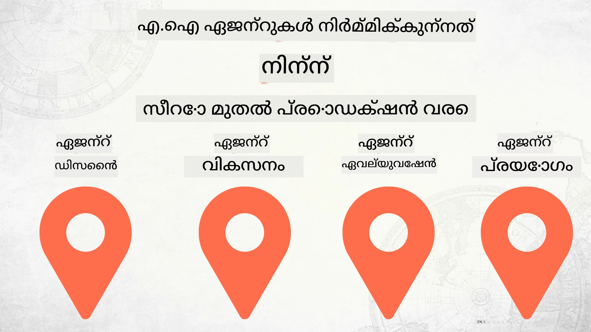

# зеро മുതൽ പ്രൊഡക്ഷന് വരെ എഐ ഏജന്റുകൾ നിർമ്മിക്കൽ



### 🌐 ബഹുഭാഷാ പിന്തുണ

#### GitHub Action മുഖേന പിന്തുണ (സ്വയം പ്രവർത്തിതവും എന്നും പുതുക്കുന്നതുമായത്)

<!-- CO-OP TRANSLATOR LANGUAGES TABLE START -->
[Arabic](../ar/README.md) | [Bengali](../bn/README.md) | [Bulgarian](../bg/README.md) | [Burmese (Myanmar)](../my/README.md) | [Chinese (Simplified)](../zh-CN/README.md) | [Chinese (Traditional, Hong Kong)](../zh-HK/README.md) | [Chinese (Traditional, Macau)](../zh-MO/README.md) | [Chinese (Traditional, Taiwan)](../zh-TW/README.md) | [Croatian](../hr/README.md) | [Czech](../cs/README.md) | [Danish](../da/README.md) | [Dutch](../nl/README.md) | [Estonian](../et/README.md) | [Finnish](../fi/README.md) | [French](../fr/README.md) | [German](../de/README.md) | [Greek](../el/README.md) | [Hebrew](../he/README.md) | [Hindi](../hi/README.md) | [Hungarian](../hu/README.md) | [Indonesian](../id/README.md) | [Italian](../it/README.md) | [Japanese](../ja/README.md) | [Kannada](../kn/README.md) | [Khmer](../km/README.md) | [Korean](../ko/README.md) | [Lithuanian](../lt/README.md) | [Malay](../ms/README.md) | [Malayalam](./README.md) | [Marathi](../mr/README.md) | [Nepali](../ne/README.md) | [Nigerian Pidgin](../pcm/README.md) | [Norwegian](../no/README.md) | [Persian (Farsi)](../fa/README.md) | [Polish](../pl/README.md) | [Portuguese (Brazil)](../pt-BR/README.md) | [Portuguese (Portugal)](../pt-PT/README.md) | [Punjabi (Gurmukhi)](../pa/README.md) | [Romanian](../ro/README.md) | [Russian](../ru/README.md) | [Serbian (Cyrillic)](../sr/README.md) | [Slovak](../sk/README.md) | [Slovenian](../sl/README.md) | [Spanish](../es/README.md) | [Swahili](../sw/README.md) | [Swedish](../sv/README.md) | [Tagalog (Filipino)](../tl/README.md) | [Tamil](../ta/README.md) | [Telugu](../te/README.md) | [Thai](../th/README.md) | [Turkish](../tr/README.md) | [Ukrainian](../uk/README.md) | [Urdu](../ur/README.md) | [Vietnamese](../vi/README.md)

> **പ്രാദേശികമായി ക്ലോൺ ചെയ്യാൻ ആഗ്രഹമുണ്ടോ?**
>
> ഈ റിപ്പോസിറ്ററിയിൽ 50-ലധികം ഭാഷാ പരിഭാഷകൾ ഉൾക്കൊള്ളുന്നു, ഇത് ഡൗൺലോഡ് വലുപ്പം വൻമാക്കി. ഭാഷാപരിഭാഷകളില്ലാതെ ക്ലോൺ ചെയ്യാൻ_sparse checkout_ ഉപയോഗിക്കുക:
>
> **Bash / macOS / Linux:**
> ```bash
> git clone --filter=blob:none --sparse https://github.com/microsoft/Building-AI-Agents-From-Zero-To-Production.git
> cd Building-AI-Agents-From-Zero-To-Production
> git sparse-checkout set --no-cone '/*' '!translations' '!translated_images'
> ```
>
> **CMD (Windows):**
> ```cmd
> git clone --filter=blob:none --sparse https://github.com/microsoft/Building-AI-Agents-From-Zero-To-Production.git
> cd Building-AI-Agents-From-Zero-To-Production
> git sparse-checkout set --no-cone "/*" "!translations" "!translated_images"
> ```
>
> ഇത് കോഴ്‌സ് പൂർത്തിയാക്കാൻ എല്ലാ ആവശ്യങ്ങളും ഉപയോഗിക്കാൻ സഹായിക്കുന്നു, കൂടാതെ ഡൗൺലോഡും വേഗത്തിലാണ്.
<!-- CO-OP TRANSLATOR LANGUAGES TABLE END -->

## എഐ ഏജന്റ് വികസന ജീവിതച്ചക്രത്തിന്റെ അടിസ്ഥാനങ്ങൾ പഠിപ്പിക്കുന്ന ഒരു കോഴ്‌സ്

[](https://github.com/microsoft/Building-AI-Agents-From-Zero-To-Production/blob/master/LICENSE?WT.mc_id=academic-105485-koreyst)
[](https://GitHub.com/microsoft/Building-AI-Agents-From-Zero-To-Production/graphs/contributors/?WT.mc_id=academic-105485-koreyst)
[](https://GitHub.com/microsoft/Building-AI-Agents-From-Zero-To-Production/issues/?WT.mc_id=academic-105485-koreyst)
[](https://GitHub.com/microsoft/Building-AI-Agents-From-Zero-To-Production/pulls/?WT.mc_id=academic-105485-koreyst)
[](http://makeapullrequest.com?WT.mc_id=academic-105485-koreyst)

[](https://discord.gg/Kuaw3ktsu6)

## 🌱 ആരംഭം

ഈ കോഴ്‌സിൽ എഐ ഏജന്റുകൾ നിർമ്മിക്കാനും പ്രയോഗിക്കാനും అవసരമായ അടിസ്ഥാന വിഷയങ്ങൾ ഉൾക്കൊള്ളുന്നു.

ഓരോ പാഠവും മുമ്പത്തെ പാഠത്തെ അടിസ്ഥാനമാക്കി നിർമ്മിച്ചിട്ടുണ്ട്, അതിനാൽ തുടക്കം മുതൽ തുടക്കം വരെ എടുക്കാൻ ശിപാർശ ചെയ്യുന്നു.

നിങ്ങൾക്ക് എഐ ഏജന്റ് വിഷയങ്ങൾ കൂടുതൽ ուսումնասիրിക്കാൻ ആഗ്രഹമുണ്ടെങ്കിൽ, നിങ്ങൾക്ക് [AI Agents For Beginners Course](https://aka.ms/ai-agents-beginners) പരിശോധിക്കാം.

### മറ്റു പഠിത്തക്കാർ 만나ുക, നിങ്ങളുടെ ചോദ്യങ്ങൾക്ക് ഉത്തരങ്ങൾ നേടുക

നിങ്ങൾക്ക് തടസ്സപ്പെടുകയോ എഐ ഏജന്റുകൾ നിർമ്മിക്കുന്നതു സംബന്ധിച്ച് ചോദ്യങ്ങൾ ഉണ്ടെങ്കിൽ, [Microsoft Foundry Discord](https://discord.gg/Kuaw3ktsu6) ലെ مخصوص Discord ചാനലിൽ ചേർന്നുകൊള്ളൂ.

### നിങ്ങൾക്ക് ആവശ്യം

ഓരോ പാഠത്തിനും സ്വന്തം ലോക്കൽ കോഡ് സാമ്പിൾ ഉണ്ടാകും. നിങ്ങൾക്ക് [ഈ റിപ്പൊ ഫോർക്ക് ചെയ്യാം](https://github.com/microsoft/Building-AI-Agents-From-Zero-To-Production/fork) നിങ്ങളുടെ പകർപ്പ് സൃഷ്ടിക്കാൻ.

ഈ കോഴ്‌സ് നിലവിൽ താഴെ പറയുന്നവ ഉപയോഗിക്കുന്നു:

- [Microsoft Agent Framework (MAF)](https://aka.ms/ai-agents-beginners/agent-framework)
- [Microsoft Foundry](https://azure.microsoft.com/products/ai-foundry) — പ്രത്യക്ഷപ്പെടുത്തി **GPT-5 സീരീസ്** മോഡൽ (ഉദാഹരണത്തിന് `gpt-5.1`). വിരമിച്ച GPT-4o / GPT-4.1 മോഡലുകൾ ഉപയോഗിക്കരുത്.
- [Azure OpenAI Service](https://azure.microsoft.com/products/ai-foundry/models/openai)
- [Azure CLI](https://learn.microsoft.com/cli/azure/authenticate-azure-cli?view=azure-cli-latest) — എല്ലാ സാമ്പിൾ പ്രവർത്തിപ്പിക്കുന്നതിന് മുമ്പ് `az login` ൽ സൈൻ ഇൻ ചെയ്യുക
- **Python 3.12 അല്ലെങ്കിൽ പുതിയത്**

തുടങ്ങുന്നതിന് മുമ്പ് ഈ സർവീസുകളിൽ പ്രവേശനമുണ്ട് എന്നു ഉറപ്പുവരുത്തുക.

> **💰 ചെലവും സംസ്‌കരണവും.** കയ്യിൽ നടത്തുന്ന പാഠങ്ങൾ യാഥാർത്ഥ്യ Azure റിസോഴ്‌സുകൾ സൃഷ്ടിക്കുന്നു — ഒരു Microsoft Foundry
> പ്രോജക്റ്റ്, ഒരു മോഡൽ ഡിപ്ലോയ്മെന്റ്, ഒരു വെക്ടർ സ്റ്റോർ, പാഠങ്ങൾ 4-6 ല്‍ ഹോസ്റ്റുചെയ്‌ത ഏജന്റുകളും ടൂള്ബോക്സുകളും.
> ഇവ നിലവിലുള്ളതുവരെ ചെലവ് വരുത്താം. നിങ്ങൾ ഒരു പാഠം — അല്ലെങ്കിൽ കോഴ്‌സ് — പൂർത്തിയാക്കിയാൽ ആവശ്യമില്ലാത്ത
> റിസോഴ്‌സുകൾ നിർമ്മൂല്യമാക്കുക. ഏറ്റവും സുലഭ മാർഗം എല്ലാ റിസോഴ്‌സുകളും ഒരു പ്രത്യേക
> ഗ്രൂപ്പിൽ വെച്ച് പൂർത്തിയായപ്പോൾ ആ ഗ്രൂപ്പ് മുഹൂരിക്കുക:
>
> ```bash
> az group delete --name <your-resource-group> --yes --no-wait
> ```
>
> നിങ്ങൾക്ക് ഫൗണ്ട്രി പോർട്ടലിൽ നിന്ന് വ്യക്തിഗത ഏജന്റുകൾ, വെക്ടർ സ്‌റ്റോറുകൾ, ടൂള്ബോക്സുകൾ കൈമാറ്റം ചെയ്യാം.

> **മോഡലുകൾക്കുറിച്ചുള്ള നോട്ട്.** ഈ കോഴ്‌സ് എല്ലാ മോഡലുകളും **Microsoft Foundry** മുഖേന നൽകുന്നു. ഇത് **GitHub മോഡലുകൾ**
> ഉപയോഗിക്കുന്നില്ല, അവ **ജൂലൈ 30, 2026** ന് വിരമിക്കുന്നു — Microsoft Foundry ആണ്
> ഔദ്യോഗിക മൈഗ്രേഷൻ മാർഗം. പഴയ കോഡ് GitHub മോഡലുകൾ വിളിക്കുന്നുണ്ടെങ്കിൽ, അത് ഫൗണ്ട്രി
> മോഡൽ ഡിപ്ലോയ്മെന്റിലേക്ക് സഞ്ചരിക്കുക.

മോഡൽ ഹോസ്റ്റിങ്ങ്, സർവീസുകൾ സംബന്ധിച്ച കൂടുതൽ ഓപ്ഷനുകൾ ഉടൻ വരുന്നു.

## 🗃️ പാഠങ്ങൾ

| **പാഠം**         | **വിവരണം**                                                                                  |
|--------------------|--------------------------------------------------------------------------------------------------|
| [Agent Design](./lesson-1-agent-design/README.md)       | നമ്മുടെ "Developer Onboarding" ഏജന്റ് ഉപയോഗസംഭവം പരിചയപ്പെടുക, ഫലപ്രദമായ ഏജന്റുകൾ രൂപരേഖാക്കുന്നത് എങ്ങനെ എന്നത്.  |
| [Agent Development](./lesson-2-agent-development/README.md)  | Microsoft Agent Framework (MAF) ഉപയോഗിച്ച്, പുതിയ ഡെവലപ്പർമാരെ സഹായിക്കുന്ന പ്രത്യേക ഏജന്റുകളുടെ സമാഹാരം നിർമ്മിക്കുക.       |
| [Agent Evaluations](./lesson-3-agent-evals/README.md)  | Microsoft Foundry ഉപയോഗിച്ച്, AI ഏജന്റുകളുടെ പ്രകടനം വിലയിരുത്തുകയും മെച്ചപ്പെടുത്തുന്നതിനുള്ള മാർഗ്ഗങ്ങൾ കണ്ടെത്തുക. |
| [Agent Deployment](./lesson-4-agentdeployment/README.md)   | Microsoft Foundry ഹോസ്റ്റുചെയ്‌ത ഏജന്റുകളും OpenAI ChatKit ഉപയോഗിച്ച്, എഐ ഏജന്റ് പ്രൊഡക്ഷനിലേക്കു കയറ്റുവെക്കുക.       |
| [Production Hosted Agents](./lesson-5-hosted-agents-production/README.md)   | ഹോസ്റ്റുചെയ്‌ത ഏജന്റിനെ എന്റർപ്രൈസ് പ്രൊഡക്ഷനിലേക്കു കൊണ്ടുപോകുക: ഹോസ്റ്റുചെയ്‌ത ഏജന്റുകൾ বনാമി കപ്പാസിറ്റി ഹോസ്റ്റുകൾ, സ്വന്തം സംഭരണിയും മെമ്മറിയും ഗവൺമെന്റും.       |
| [Microsoft Toolbox](./lesson-6-toolbox/README.md)   | ടൂളുകൾ ഒരിക്കല്‍ നിർദ്ദേശിച്ച് കേന്ദ്രമായി നിയന്ത്രിക്കുക: ഒരു ടൂള്ബോക്സ് നിർമ്മിക്കുക, ഏജന്റ് മുഖേന ഒന്ന് MCP എൻഡ്പോയിന്റിൽ നിന്നു ഉപയോഗിക്കുക, ടൂളുകളുടെ വെർഷൻ സുരക്ഷിതമാക്കുക.       |
| [Multi-Agent & A2A](./lesson-7-multi-agent-a2a/README.md)   | ഏജന്റുകളെ നെറ്റ്വർക്ക് സർവീസുകളായി രൂപപ്പെടുത്തുക: തുറന്ന ഏജന്റ്-ടു-ഏജന്റ് (A2A) പ്രോട്ടോക്കോൾ വഴി ഏജന്റ് പുറത്തിറക്കുക, ഒരു ദൂരെപഠിത ഏജന്റിനെ പെयरായി ഉപയോഗിക്കുക.       |


## 🎒 മറ്റു കോഴ്സുകൾ

ഞങ്ങളുടെ ടീം മറ്റ് കോഴ്സുകളും നിർമ്മിക്കുന്നു! ഇവിടെ കാണുക:

<!-- CO-OP TRANSLATOR OTHER COURSES START -->
### LangChain
[](https://aka.ms/langchain4j-for-beginners)
[](https://aka.ms/langchainjs-for-beginners?WT.mc_id=m365-94501-dwahlin)
[](https://github.com/microsoft/langchain-for-beginners?WT.mc_id=m365-94501-dwahlin)
---

### Azure / Edge / MCP / Agents
[](https://github.com/microsoft/AZD-for-beginners?WT.mc_id=academic-105485-koreyst)
[](https://github.com/microsoft/edgeai-for-beginners?WT.mc_id=academic-105485-koreyst)
[](https://github.com/microsoft/mcp-for-beginners?WT.mc_id=academic-105485-koreyst)
[](https://github.com/microsoft/ai-agents-for-beginners?WT.mc_id=academic-105485-koreyst)

---
 
### ജനനാത്മക AI പരമ്പര  

[](https://github.com/microsoft/generative-ai-for-beginners?WT.mc_id=academic-105485-koreyst)
[-9333EA?style=for-the-badge&labelColor=E5E7EB&color=9333EA)](https://github.com/microsoft/Generative-AI-for-beginners-dotnet?WT.mc_id=academic-105485-koreyst)
[-C084FC?style=for-the-badge&labelColor=E5E7EB&color=C084FC)](https://github.com/microsoft/generative-ai-for-beginners-java?WT.mc_id=academic-105485-koreyst)
[-E879F9?style=for-the-badge&labelColor=E5E7EB&color=E879F9)](https://github.com/microsoft/generative-ai-with-javascript?WT.mc_id=academic-105485-koreyst)

---
 
### കോർ പഠനം
[](https://aka.ms/ml-beginners?WT.mc_id=academic-105485-koreyst)
[](https://aka.ms/datascience-beginners?WT.mc_id=academic-105485-koreyst)
[](https://aka.ms/ai-beginners?WT.mc_id=academic-105485-koreyst)
[](https://github.com/microsoft/Security-101?WT.mc_id=academic-96948-sayoung)
[](https://aka.ms/webdev-beginners?WT.mc_id=academic-105485-koreyst)
[](https://aka.ms/iot-beginners?WT.mc_id=academic-105485-koreyst)
[](https://github.com/microsoft/xr-development-for-beginners?WT.mc_id=academic-105485-koreyst)

---
 
### കോപിലോട്ട് സീരീസ്
[](https://aka.ms/GitHubCopilotAI?WT.mc_id=academic-105485-koreyst)
[](https://github.com/microsoft/mastering-github-copilot-for-dotnet-csharp-developers?WT.mc_id=academic-105485-koreyst)
[](https://github.com/microsoft/CopilotAdventures?WT.mc_id=academic-105485-koreyst)
<!-- CO-OP TRANSLATOR OTHER COURSES END -->

## സംഭാവനകൾ

ഈ പ്രോജക്ട് സംഭാവനകളും നിർദ്ദേശങ്ങളും സ്വാഗതം ചെയ്യുന്നു.  അനേകം സംഭാവനകൾക്ക് അംഗീകാരം നേടേണ്ടതാണ്
ഒരു കോൺട്രിബ്യൂട്ടർ ലൈസൻസ് കരാർ (CLA) യിൽ നിങ്ങൾക്ക് അവകാശവുമുള്ളതും പ്രത്യക്തമായും നൽകുന്നതും പ്രഖ്യാപിച്ച് ഞങ്ങളോട് സമ്മതിക്കണം.
വിശദാംശങ്ങൾക്ക്, സന്ദർശിക്കുക <https://cla.opensource.microsoft.com>.

നിങ്ങൾ പുൾ_Request സമർപ്പിക്കുമ്പോൾ, CLA ബോട്ട് ഓട്ടോമാറ്റിക്കായി നിങ്ങളെ CLA നൽകണോ എന്നും പരിശോധിക്കും
പുൾ_Request مناسലായി (ഉദാ: സ്ഥിതി പരിശോധന, കമന്റ്) പ്രൊസസ് ചെയ്യും. ബോട്ടിന്റെ നിർദ്ദേശങ്ങൾ പിന്തുടരുക.
ഞങ്ങളുടെ CLA ഉപയോഗിക്കുന്ന എല്ലാ റീപ്പോസുകളിലും നിങ്ങൾക്ക് ഇത് ഒരിക്കൽ മാത്രം ചെയ്യേണ്ടതുണ്ട്.

ഈ പ്രോജക്ട് [Microsoft Open Source Code of Conduct](https://opensource.microsoft.com/codeofconduct/) ദത്തെടുത്തിരിക്കുന്നു.
കൂടുതൽ വിവരങ്ങൾക്ക് [Code of Conduct FAQ](https://opensource.microsoft.com/codeofconduct/faq/) സന്ദർശിക്കുക അല്ലെങ്കിൽ
[opencode@microsoft.com](mailto:opencode@microsoft.com) - എവിടെ വേണമെങ്കിലും ചോദ്യങ്ങൾക്കോ അഭിപ്രായങ്ങൾക്കോ ബന്ധപ്പെടുക.

## ട്രേഡ്മാർക്കുകൾ

ഈ പ്രോജക്ടിൽ പ്രോജക്ടുകൾ, ഉൽപ്പന്നങ്ങൾ, സേവനങ്ങൾ എന്നിവയുമായി ബന്ധപ്പെട്ട ട്രേഡ്മാർക്കുകൾ അല്ലെങ്കിൽ ലോഗോകൾ ഉണ്ടായിരിക്കാം. മൈക്രോസോഫ്‌റിന്റെ
ട്രേഡ്മാർക്കുകൾ അല്ലെങ്കിൽ ലോഗോകൾ ഉപയോഗിക്കുന്നത് [Microsoft's Trademark & Brand Guidelines](https://www.microsoft.com/legal/intellectualproperty/trademarks/usage/general) പാലിക്കണം.
മൈക്രോസോഫ്റ്റ് ട്രേഡ്മാർക്ക് അല്ലെങ്കിൽ ലോഗോകൾ ഈ പ്രോജക്ടിന്റെ മോദിഫൈഡ് പതിപ്പിലും ഉപയോഗിക്കുമ്പോൾ ഈ ഗൈഡ്‌ലൈനുകൾ പാലിക്കപ്പെട്ടിരിക്കണം,
മൈക്രോസോഫ്റ്റ് സ്പോൺസർഷിപ്പ് എന്ന് തെറ്റിദ്ധരിക്കാതെ.
മൂന്നാംപകുതി ട്രേഡ്മാർക്ക് അല്ലെങ്കിൽ ലോഗോകൾ ഉപയോഗിക്കുന്നത് ആ ട്രേഡ്മാർക്ക് ഉടമകളുടെ നയങ്ങളെ ആശ്രയിച്ചിരിക്കും.

## സഹായം നേടുക

നിങ്ങൾ തടസ്സപ്പെട്ടാൽ അല്ലെങ്കിൽ എഐ ആപ്പുകൾ നിർമ്മിക്കുന്നതിനുവേണ്ടി ചോദ്യങ്ങളുണ്ടെങ്കിൽ, ചേരുക:

[](https://discord.gg/Kuaw3ktsu6)

നിർമ്മാണത്തിൽ ഉൽപ്പന്ന പ്രതികരണം അല്ലെങ്കിൽ പിഴവുകൾ ഉണ്ടെങ്കിൽ സന്ദർശിക്കുക:

[](https://aka.ms/foundry/forum)

---

<!-- CO-OP TRANSLATOR DISCLAIMER START -->
**അറിയിപ്പ്**:
ഈ രേഖ AI പരിഭാഷാ സേവനം [Co-op Translator](https://github.com/Azure/co-op-translator) ഉപയോഗിച്ച് പരിഭാഷപ്പെടുത്തിയതാണ്. ഞങ്ങൾ കൃത്യതയ്ക്കായി ശ്രമിക്കുന്നുവെങ്കിലും, ഓട്ടോമേറ്റഡ് പരിഭാഷകളിൽ പിഴവുകൾ അല്ലെങ്കിൽ തെറ്റായ വിവരങ്ങൾ ഉണ്ടാകാൻ സാധ്യതയുണ്ട്. അതിന്റെ സ്വാഭാവിക ഭാഷയിലുള്ള അസൽ രേഖയാണ് പ്രാമാണികമായ ഉറവിടമായി പരിഗണിക്കേണ്ടത്. നിർണായകമായ വിവരങ്ങൾക്ക്, പ്രൊഫഷണൽ മനുഷ്യ പരിഭാഷ ശുപാർശ ചെയ്യുന്നു. ഈ പരിഭാഷ ഉപയോഗിച്ച് ഉണ്ടാകുന്ന തെറ്റിദ്ധാരണകൾ അല്ലെങ്കിൽ തെറ്റായ വ്യാഖ്യാനങ്ങൾക്കായി ഞങ്ങൾ ഉത്തരവാദികളല്ല.
<!-- CO-OP TRANSLATOR DISCLAIMER END -->