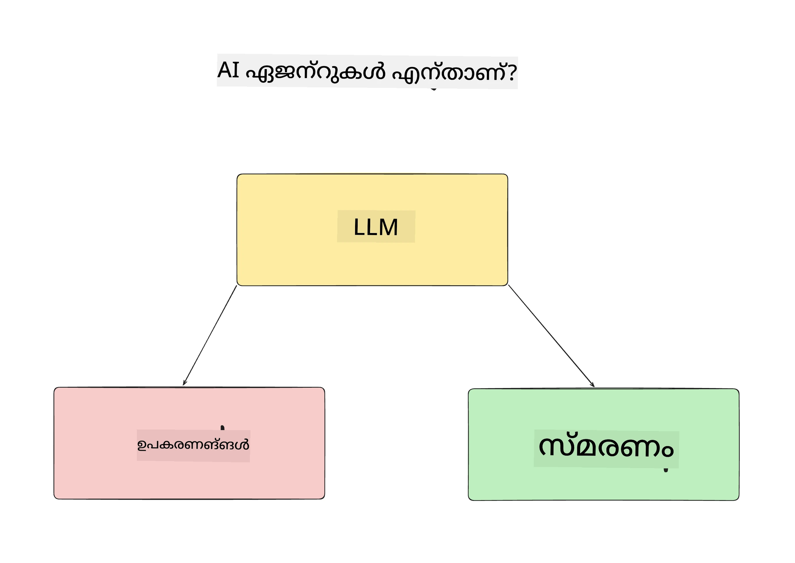
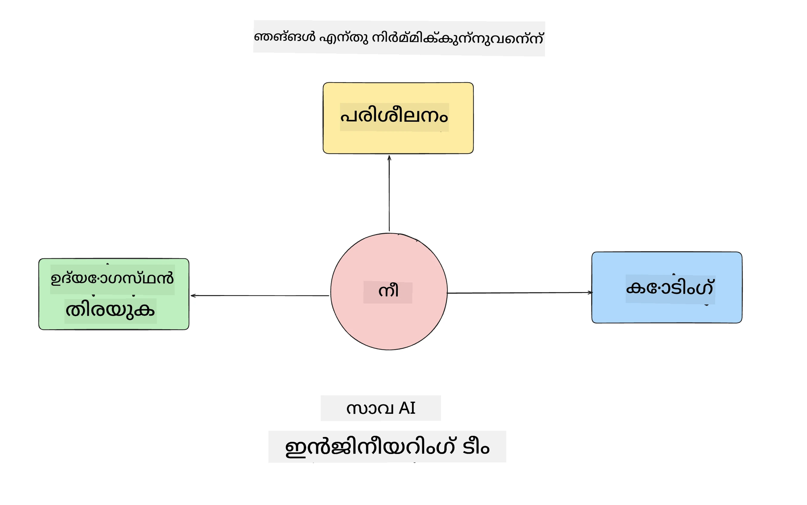
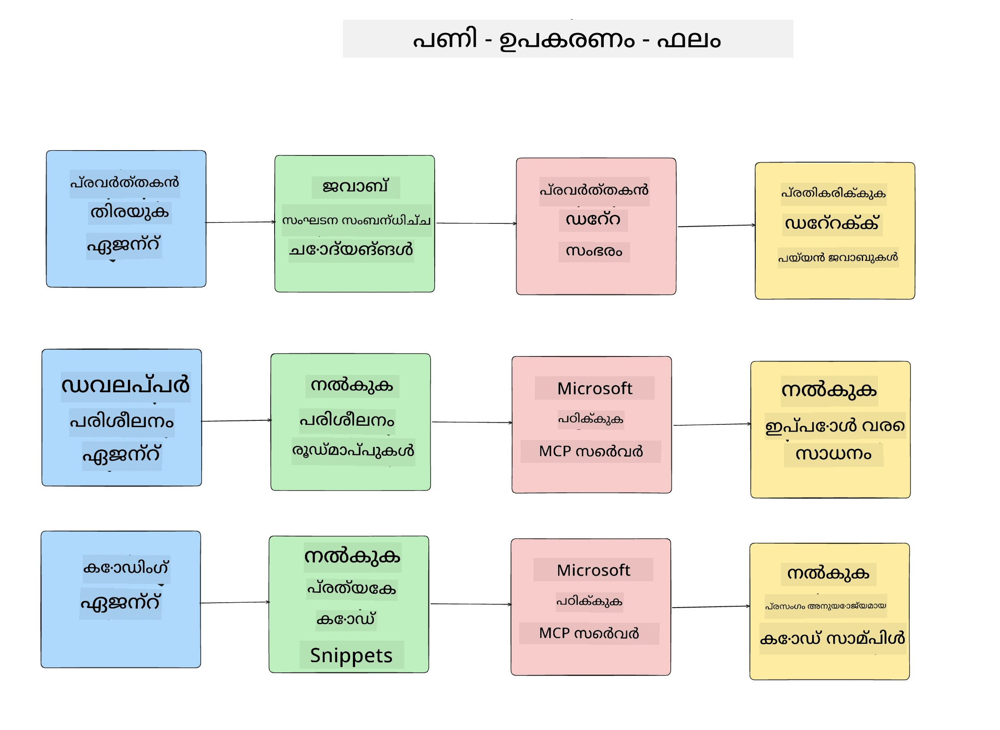
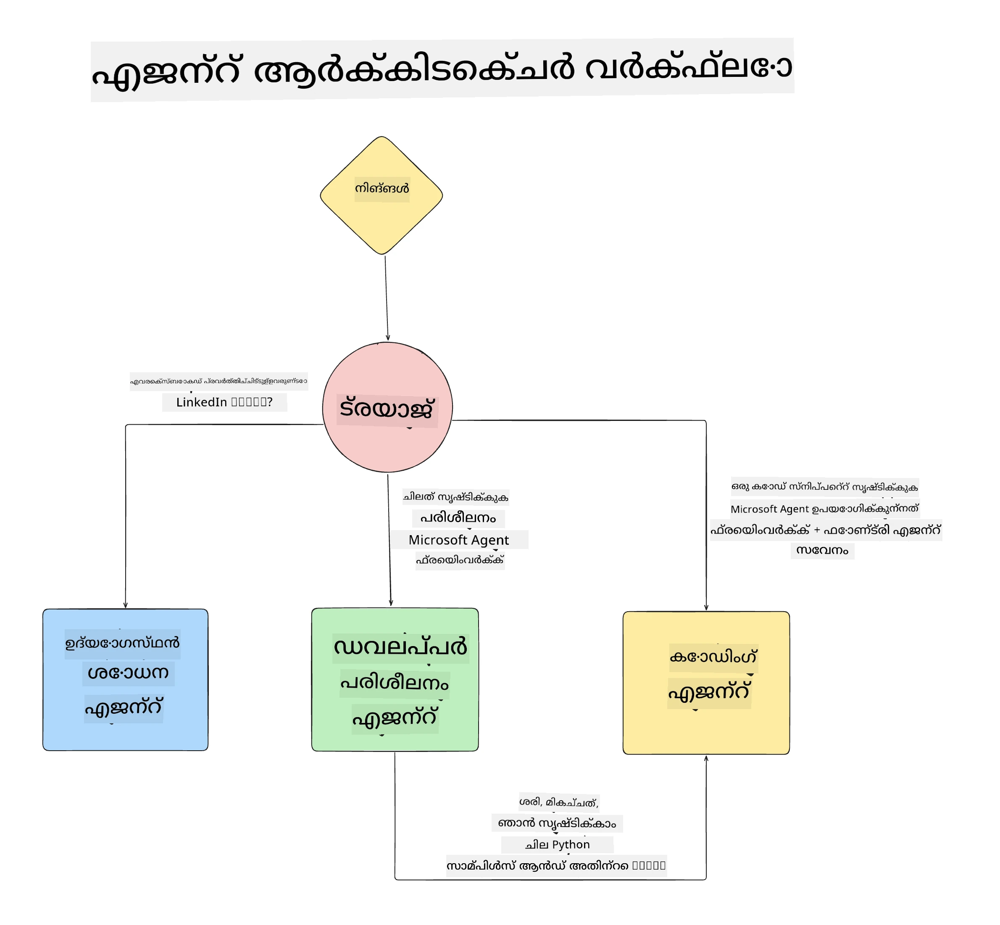

# പാഠം 1: AI ഏജന്റ് ഡിസൈൻ

"Building AI Agent from Zero to Production Course" ന്റെ ആദ്യ പാഠത്തിലേക്ക് സ്വാഗതം!

ഈ പാഠത്തില്‍ നാം തിരഞ്ഞെടുക്കുന്നത്:

- AI ഏജന്റുകൾ എന്റെയുള്ളത് ആകുന്നു എന്ന് നിർവചിക്കുക
  
- നാം നിർമ്മിക്കുന്ന AI ഏജന്റ് അപ്‌ളിക്കേഷൻ കുറിച്ച് ചർച്ച ചെയ്യുക  

- ഓരോ ഏജന്റിനും ആവശ്യമായ ഉപകരണങ്ങളും സേവനങ്ങളും തിരിച്ചറിയുക
  
- നമ്മുടെ ഏജന്റ് അപ്ലിക്കേഷന്റെ സംരചന നടത്തുക
  
ഏജന്റുകൾ എന്ത് ആണ് എന്നും അപ്ലിക്കേഷനിൽ അവയെ എന്തുകൊണ്ട് ഉപയോഗിക്കുമെന്ന് നമുക്ക് നിർവചിക്കാനാവാം.

> **കോഴ്‌സ് തുടങ്ങുന്നതിന് മുമ്പ്.** ഈ ആദ്യ പാഠം ആശയപരമാണ് — ഓടിക്കേണ്ട കോഡ് ഒന്നുമില്ല.
> [Lesson 2](../lesson-2-agent-development/README.md) നു ശേഷമുള്ളത്: **Azure സബ്‌സ്‌ക്രിപ്ഷൻ** കൂടാതെ **Microsoft Foundry** ലേക്കുള്ള ആക്‌സസ്, ഒരു നിർമ്മിതമായ **GPT-5 സീരീസ് മോഡൽ** (ഉദാഹരണത്തിന് `gpt-5.1` — വിരമിച്ച GPT-4o / GPT-4.1 ഒഴിവാക്കുക), **Python 3.12+**, കൂടാതെ **Azure CLI** (`az login`) ആവശ്യമാണ്. മുഴുവൻ പട്ടികയും ലിങ്കുകളും നോക്കാൻ കോഴ്സ് README യിൽ [What You Need](../README.md#what-you-need) കാണുക.

## AI ഏജന്റുകൾ എന്താണ്?

AI ഏജന്റ് എങ്ങനെ നിർമ്മിക്കണമെന്ന് ആദ്യമായി അന്വേഷിക്കുന്നവർക്ക്, AI ഏജന്റ് എന്താണെന്ന് ശരിയായി നിർവചിക്കാൻ ചോദ്യം തോന്നാം.

AI ഏജന്റ് എന്താണെന്ന് അതിനെ ഘടിപ്പിക്കുന്ന അവയവങ്ങളുടെ അടിസ്ഥാനത്തിൽ ലളിതമായി നിർവചിക്കാൻ:

**വലുതായ ഭാഷാ മോഡൽ** - ഉപയോഗക്കാരന്റെ ഭാഷയെ പ്രോസസ്സ് ചെയ്ത് അവർ പൂർത്തിയാക്കാൻ ആഗ്രഹിക്കുന്ന ടാസ്‌ക്കിനെ വ്യാഖ്യാനിക്കുന്നതും, ഈ ടാസ്‌കുകൾ പൂർത്തിയാക്കാൻ ലഭ്യമായ ഉപകരണങ്ങളുടെ വിവരണങ്ങൾ വ്യാഖ്യാനിക്കുന്നതും LLM ചെയുന്നു.

**ഉപകരണങ്ങൾ** - ഇവ ഫംഗ്ഷനുകൾ, APIs, ഡാറ്റാ സ്റ്റോറുകൾ, മറ്റ് സേവനങ്ങൾ എന്നിവയാണ്, LLM ഉപയോഗിച്ച് ഉപയോക്താവിന്റെ അപേക്ഷിച്ച ടാസ്‌കുകൾ പൂർത്തിയാക്കാൻ തിരഞ്ഞെടുക്കുന്നതും.

**മെമ്മറി** - AI ഏജന്റും ഉപയോക്താവും തമ്മിലുള്ള ചെറുകാലവും ദൈർഘ്യകാലവും ഇടപെടലുകൾ സംഗ്രഹിക്കാനുള്ള വഴിയാണ് ഇത്. ഈ വിവരങ്ങൾ സംഗ്രഹിക്കുക, പുനരുപയോഗിക്കുക എന്നത് മെച്ചപ്പെടുത്തലുകൾക്കും ഉപയോക്തൃ ഇഷ്ടാനുസരണം സംരക്ഷണത്തിനും ആവശ്യമാണ്.

## നമ്മുടെ AI ഏജന്റ് ഉപയോഗകേസ്

ഈ കോഴ്സിനായി, നാം പുതിയ ഡെവലപ്പർമാരെ നമ്മുടെ AI ഏജന്റ് വികസന ടീമിലേക്ക് ഓൺബോർഡ് ചെയ്യുന്നതിന് സഹായിക്കുന്ന ഒരു AI ഏജന്റ് അപ്‌ളിക്കേഷൻ നിർമ്മിക്കും!

ഏതെങ്കിലും വികസന ജോലി ചെയ്യുന്നതിന് മുമ്പ്, വിജയകരമായ AI ഏജന്റ് അപ്‌ളിക്കേഷൻ സൃഷ്ടിക്കുന്ന ആദ്യ പടി, നമ്മുടെ ഉപയോക്താക്കൾ എങ്ങനെ AI ഏജന്റുകളുമായി പ്രവർത്തിക്കുമെന്ന് വ്യക്തമായ സാഹചര്യങ്ങൾ നിർവചിക്കുകയാണ്.

ഈ അപ്ലിക്കേഷനിൽ, നാം ഈ സാഹചര്യങ്ങൾ ഉപയോഗിക്കും:

**സാഹചര്യ 1**: ഒരു പുതിയ ജീവനക്കാർ സംഘടനയിൽ ചേർന്നു, അവർ ചേർന്ന ടീമിനെക്കുറിച്ച് കൂടുതൽ അറിയാനും എങ്ങനെ ബന്ധപ്പെടാമെന്ന് അറിയാനും ആഗ്രഹിക്കുന്നു.

**സാഹചര്യ 2:** പുതിയ ജീവനക്കാരൻ ആരംഭിക്കാനുള്ള മികച്ച ആദ്യ ടാസ്‌ക്ക് എന്താണെന്ന് അറിയാൻ ആഗ്രഹിക്കുന്നു.

**സാഹചര്യ 3:** പുതിയ ജീവനക്കാരൻ പഠന വസ്തുക്കളും കോഡ് സാമ്പിളുകളും ശേഖരിച്ച്, ഈ ടാസ്‌ക് പൂർത്തിയാക്കാൻ സഹായം തേടുന്നു.

## ഉപകരണങ്ങളും സേവനങ്ങളും തിരിച്ചറിയുക

ഇപ്പോൾ ഈ സാഹചര്യങ്ങൾ സൃഷ്ടിച്ചതിനുശേഷം, അടുത്ത പടി ആ സ്ഥലങ്ങളിൽ ആവശ്യമായ ഉപകരണങ്ങളിലേക്കും സേവനങ്ങളിലേക്കും ജഡജാലിച്ച് കോടതി ഇറക്കേണ്ടതാണ്.

ഈ പ്രക്രിയ Context Engineering എന്ന വിഭാഗത്തിലുൾപ്പെടുന്നു, കാരണം നാം നോക്കുന്നത് AI ഏജന്റുകൾക്ക് ടാസ്കുകൾ പൂർത്തിയാക്കാൻ ശരിയായ സമയത്ത് ശരിയായ സാന്ദ്രത ലഭ്യമാകേണ്ടതാണ്.

നാം ഓരോ സാഹചര്യവും തുടർന്നുള്ള രീതിയിൽ പരിശോധിച്ച് ഏജന്റുകളിൽ ഓരോ ടാസ്കും, ഉപകരണങ്ങളും, പ്രതീക്ഷിക്കുന്ന ഫലങ്ങളും ആസൂത്രണം ചെയ്തുകൊള്ളാം.

### സാഹചര്യ 1 - ജീവനക്കാർ തിരയൽ ഏജന്റ്

**ടാസ്ക്** - സംഘടനയിലെ ജീവനക്കാരെക്കുറിച്ച് ചോദ്യങ്ങൾക്ക് ഉത്തരമുകൾ നൽകുക, ഉദാഹരണത്തിന് ജോയിൻ ചെയ്ത തീയതി, നിലവിലെ ടീം, സ്ഥലവും അവസാന പദവി.

**ഉപകരണങ്ങൾ** - നിലവിലുള്ള ജീവനക്കാരുടെ പട്ടികയും ഓർഗനൈസേഷൻ ചാർട്ടും ഉള്ള ഡാറ്റാ സ്റ്റോർ

**ഫലങ്ങൾ** - നിജപ്പെട്ട ഓർഗനൈസേഷണൽ ചോദ്യങ്ങൾക്കും ജീവനക്കാരെക്കുറിച്ചും വിവരങ്ങൾ ഡാറ്റാബേസിൽ നിന്നും തിരികെ കിട്ടാൻ കഴിയണം.

### സംഭവസ്ഥിതി 2 - ടാസ്‌ക്ക് ശിപാർശ ഏജന്റ്

**ടാസ്ക്** - പുതിയ ജീവനക്കാരന്റെ ഡെവലപ്പർ പരിചയത്തെ അടിസ്ഥാനമാക്കി, അവർക്ക് പ്രവർത്തിക്കാൻ കഴിയുന്ന 1-3 പ്രശ്നങ്ങൾ കണ്ടുപിടിക്കുക.

**ഉപകരണങ്ങൾ** - GitHub MCP Server ഉപയോഗിച്ച് തുറന്ന ഇഷ്യൂകളും ഡെവലപ്പർ പ്രൊഫൈലും കിട്ടിയെടുക്കുക

**ഫലങ്ങൾ** - GitHub പ്രൊഫൈലിലെ അവസാന 5 കമിറ്റ് വായിക്കുകയും GitHub പ്രൊജക്ടിലെ തുറന്ന് ഇഷ്യൂകൾ പരിശോധിക്കുകയും അവയിൽ പൊരുത്തപ്പെട്ട ശിപാർശകൾ നൽകുകയും ചെയ്യണം

### സാഹചര്യ 3 - കോഡ് അസിസ്റ്റന്റ് ഏജന്റ്

**ടാസ്ക്** - "ടാസ്‌ക്ക് ശിപാർശ" ഏജന്റ് ശുപാർശ ചെയ്ത തുറന്ന് ഇഷ്യൂകൾ അടിസ്ഥാനമാക്കി, പഠന വസ്തുക്കളും കോഡ് സ്നിപ്പറ്റുകളും ഒരുക്കുക

**ഉപകരണങ്ങൾ** - Microsoft Learn MCP വിഭവങ്ങൾ കണ്ടെത്തുന്നതിനും Code Interpreter ഉപയോഗിച്ച് ഇഷ്യൂ അടിസ്ഥാനമാക്കി കോഡ് സ്നിപ്പറ്റുകൾ സൃഷ്ടിക്കുന്നതിനും

**ഫലങ്ങൾ** - ഉപയോക്താവ് കൂടുതൽ സഹായം ആവശ്യപ്പെട്ടാൽ, Learn MCP Server ഉപയോഗിച്ച് ലിങ്കുകളും കോഡ് സ്നിപ്പറ്റുകളും നൽകിയത് ശേഷം Code Interpreter ഏജന്റിൽ കൈമാറി ചെറിയ കോഡ് സ്നിപ്പറ്റുകൾ വിശദീകരണങ്ങളോടുകൂടി സൃഷ്ടിക്കണം.

## നമ്മുടെ ഏജന്റ് അപ്‌ളിക്കേഷൻ ആർക്കിടെക്ചർ

ഓരോ ഏജന്റുമായും അവയുടെ പ്രത്യേക ടാസ്കുകൾക്കനുസരണം അവ തമ്മിൽ എങ്ങനെ പ്രവർത്തിക്കുന്നുവെന്ന് മനസ്സിലാക്കാൻ ഒരു ആർക്കിടെക്ചർ ചിത്രീകരണം സൃഷ്ടിക്കാം:

## അടുത്ത കടികള്‍

ഓരോ ഏജന്റും നമ്മുടെ ഏജന്റിക് സിസ്റ്റവും ഡിസൈൻ ചെയ്തു കഴിഞ്ഞാല്‍, അടുത്ത പാഠത്തിലേക്ക് പ്രവേശിച്ച് നാം ഈ ഏജന്റുകളെ വികസിപ്പിക്കാം!

---

<!-- CO-OP TRANSLATOR DISCLAIMER START -->
**അറിയിപ്പ്**:
ഈ രേഖ AI പരിഭാഷാ സേവനം [Co-op Translator](https://github.com/Azure/co-op-translator) ഉപയോഗിച്ച് പരിഭാഷപ്പെടുത്തിയതാണ്. ഞങ്ങൾ കൃത്യതയ്ക്കായി ശ്രമിക്കുന്നുവെങ്കിലും, ഓട്ടോമേറ്റഡ് പരിഭാഷകളിൽ പിഴവുകൾ അല്ലെങ്കിൽ തെറ്റായ വിവരങ്ങൾ ഉണ്ടാകാൻ സാധ്യതയുണ്ട്. അതിന്റെ സ്വാഭാവിക ഭാഷയിലുള്ള അസൽ രേഖയാണ് പ്രാമാണികമായ ഉറവിടമായി പരിഗണിക്കേണ്ടത്. നിർണായകമായ വിവരങ്ങൾക്ക്, പ്രൊഫഷണൽ മനുഷ്യ പരിഭാഷ ശുപാർശ ചെയ്യുന്നു. ഈ പരിഭാഷ ഉപയോഗിച്ച് ഉണ്ടാകുന്ന തെറ്റിദ്ധാരണകൾ അല്ലെങ്കിൽ തെറ്റായ വ്യാഖ്യാനങ്ങൾക്കായി ഞങ്ങൾ ഉത്തരവാദികളല്ല.
<!-- CO-OP TRANSLATOR DISCLAIMER END -->