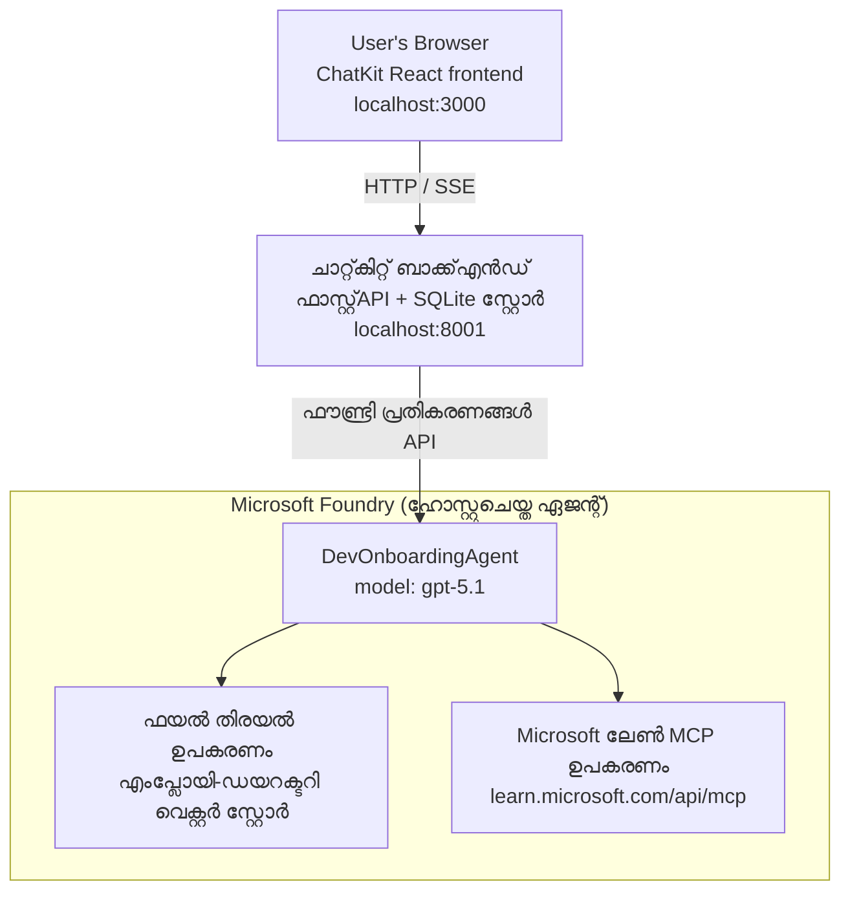

# പാഠം 4: Microsoft Foundry ഹോസ്റ്റുചെയ്ത ഏജന്റുകളുമായി ഏജന്റ് വിന്യസിക്കൽ + ChatKit

ഈ പാഠം ടൂൾ ഉപയോഗിക്കുന്ന ഒരു ഏജനെ Microsoft Foundry-ലേക്ക് ഹോസ്റ്റുചെയ്ത ഏജന്റായി വിന്യസിക്കുകയും അതുമായി സംവദിക്കാൻ ChatKit അടിസ്ഥാനമാക്കിയുള്ള ഒരു ഫ്രണ്ട്‌എൻഡ് രൂപകൽപ്പന ചെയ്യുകയും ചെയ്യുന്നതിനെ കാണിക്കുന്നു.

## വാസ്തുവിദ്യ

ഹോസ്റ്റുചെയ്ത ഏജന്റ് **ഏകദേശം `DevOnboardingAgent`** ആണ് (`gpt-5.1`-ൽ പ്രവർത്തിക്കുന്നു) ഇത് ഡവലപ്പർ-ഓൺബോർഡിംഗ് ചോദ്യങ്ങൾക്ക് രണ്ടുവിധം ഹോസ്റ്റുചെയ്ത ടൂളുകൾ ഉപയോഗിച്ച് ഉത്തരം നൽകുന്നു: ജീവനക്കാർ ഡയറക്ടറി വെക്ടർ സ്റ്റോർ മുകളിൽ പ്രവർത്തിക്കുന്ന **ഫയൽ സെർച്ച്** ടൂൾ, കൂടാതെ **Microsoft Learn MCP** ടൂൾ. ഒരു ChatKit React ഫ്രണ്ട്‌എൻഡ് ഒരു FastAPI ബാക്ക്‌എൻഡുമായി സംസാരിക്കുന്നു, അത് Foundry **Responses API** വഴി ഏജന്റിനെ വിളിക്കുന്നു.



## മുൻ‌വിധികളും ആവശ്യങ്ങളും

1. നോർത്ത് സെൻട്രൽ യു.എസ്. പ്രദേശത്ത് **Microsoft Foundry പ്രോജക്ട്**
2. പ്രാമാണീകൃത **Azure CLI** (`az login`)
3. ഇൻസ്റ്റാൾ ചെയ്ത **Azure Developer CLI** (`azd`)
4. **Python 3.12+** மற்றும் **Node.js 18+**
5. ജീവനക്കാരുടെ ഡാറ്റ ഉപയോഗിച്ച് സൃഷ്ടിച്ച **വെക്ടർ സ്റ്റോർ**

## വേഗം തുടങ്ങുക

### 1. പരിസ്ഥിതി വ്യത്യാസങ്ങൾ സജ്ജീകരിക്കുക

```bash
cd lesson-4-agentdeployment
cp .env.example .env
# നിങ്ങളുടെ Microsoft Foundry പ്രോജക്ട് വിവരങ്ങളുമായി .env എഡിറ്റ് ചെയ്യുക
```

### 2. ഹോസ്റ്റ് ഏജന്റ് വിന്യസിക്കുക

**ഓപ്ഷൻ A: Azure Developer CLI ഉപയോഗിച്ച് (പരിഗണന ശുപാർശ)**

```bash
cd hosted-agent
azd auth login
azd agent deploy
```

**ഓപ്ഷൻ B: Docker + Azure Container Registry ഉപയോഗിച്ച്**

```bash
cd hosted-agent

# കണ്ടെയ്‌നർ നിർമ്മിക്കുക
docker build -t developer-onboarding-agent:latest .

# ACRയ്ക്കുള്ള ടാഗ്
docker tag developer-onboarding-agent:latest <your-acr>.azurecr.io/developer-onboarding-agent:latest

# ACRലേക്ക് പുഷ് ചെയ്യുക
az acr login --name <your-acr>
docker push <your-acr>.azurecr.io/developer-onboarding-agent:latest

# Microsoft Foundry പോർട്ടലിലൂടെയും SDKയിലൂടെയും വിന്യസിക്കുക
```

### 3. ChatKit ബാക്ക്‌എൻഡ് ആരംഭിക്കുക

```bash
cd chatkit-server
python -m venv .venv
source .venv/bin/activate  # വിംഡോസിൽ: .venv\Scripts\activate
pip install -r requirements.txt
python app.py
```

സെർവർ `http://localhost:8001` ൽ ആരംഭിക്കും

### 4. ChatKit ഫ്രണ്ട്‌എൻഡ് ആരംഭിക്കുക

```bash
cd chatkit-server/frontend
npm install
npm run dev
```

ഫ്രണ്ട്‌എൻഡ് `http://localhost:3000` ൽ ആരംഭിക്കും

### 5. ആപ്ലിക്കഷൻ പരീക്ഷിക്കുക

നിങ്ങളുടെ ബ്രൗസറിൽ `http://localhost:3000` തുറന്ന് ഈ ചോദ്യങ്ങൾ പരീക്ഷിക്കുക:

**ജീവനക്കാരൻ സെർച്ച്:**
- "ഞാൻ പുതുതായി ഇവിടെ ചേർന്നിട്ടുണ്ട്! Microsoft-ൽ ആരെങ്കിലും പണിചെയ്തിട്ടുണ്ടോ?"
- "Azure Functions-നു അനുഭവമുള്ളവർ ആരൊക്കെയാണ്?"

**അധ്യാപന വിഭവങ്ങൾ:**
- "Kubernetes-നുള്ള ഒരു പഠന പാത സൃഷ്ടിക്കുക"
- "ക്ലൗഡ് ആർക്കിടെക്ചർ ചില സർട്ടിഫിക്കേഷനുകൾ ഞാൻ പിന്തുടരേണ്ടതുണ്ടോ?"

**കോഡിംഗ് സഹായം:**
- "CosmosDB-യുമായി ബന്ധിപ്പിക്കാൻ Python കോഡ് എഴുതാൻ സഹായിക്കൂ"
- "എങ്ങനെ Azure Function സൃഷ്ടിക്കാമെന്ന് കാണിക്കൂ"

**മൾട്ടി-ഏജന്റ് ചോദ്യങ്ങൾ:**
- "ഞാൻ ഒരു ക്ലൗഡ് എഞ്ചിനീയറായി തുടങ്ങുന്നു. ആരോടൊത്തുചേരണം? എന്ത് പഠിക്കണം?"

## പ്രോജക്ട് ഘടന

```
lesson-4-agentdeployment/
├── .env.example                 # Environment variables template
├── implementation-plan.md       # Detailed implementation guide
├── README.md                    # This file
├── hosted-agent/               # Microsoft Foundry hosted agent
│   ├── main.py                 # Multi-agent workflow implementation
│   ├── requirements.txt        # Python dependencies
│   ├── Dockerfile              # Container definition
│   └── agent.yaml              # Agent deployment configuration
└── chatkit-server/             # ChatKit server application
    ├── app.py                  # FastAPI backend
    ├── store.py                # SQLite persistence layer
    ├── requirements.txt        # Python dependencies
    └── frontend/               # React frontend
        ├── package.json
        ├── vite.config.ts
        ├── tsconfig.json
        ├── index.html
        └── src/
            ├── main.tsx
            ├── App.tsx
            ├── App.css
            └── index.css
```

## ഏജന്റ് നിലവിലുളള ടൂളുകൾ

ഹോസ്റ്റുചെയ്ത ഏജന്റ് **ഏക ഏജന്റ്** ആണ് (`DevOnboardingAgent`, `hosted-agent/main.py`-ൽ നിർവചിച്ചിരിക്കുന്നു) ഇത് മൂന്ന് ഓൺബോർഡിംഗ് ഡൊമെയ്ൻ കൈകാര്യം ചെയ്യുന്നു. വ്യത്യസ്ത ഉപഏജന്റുകൾ നിയന്ത്രിക്കുന്നതിന് പകരം, ഇത് ഓരോ കഴിവ് ഒരു ടൂളായി പ്രദർശിപ്പിക്കുന്നു (അഥവാ മോഡലിനെ നേരിട്ടു ആശ്രയിക്കുന്നു):

| കഴിവ് | എങ്ങനെ കൈകാര്യം ചെയ്യുന്നു | ടൂൾ |
|-----------|------------------|------|
| **ജീവനക്കാരൻ സെർച്ച് & ബന്ധങ്ങൾ** | ജീവനക്കാരുടെ ഡയറക്ടറി വെക്ടർ സ്റ്റോർ മുകളിലെ Foundry ഹോസ്റ്റുചെയ്ത ഫയൽ സെർച്ച് | `client.get_file_search_tool(vector_store_ids=[...])` |
| **അധ്യാപനം & പരിശീലനം** | Microsoft Learn MCP സെർവർ (ഹോസ്റ്റുചെയ്ത MCP ടൂൾ) | `client.get_mcp_tool(url="https://learn.microsoft.com/api/mcp")` |
| **കോഡിംഗ് സഹായം** | `gpt-5.1` മോഡൽ നേരിട്ട് കൈകാര്യം ചെയ്യുന്നു — യാതൊരു ബാഹ്യ ഉപകരണം ഇല്ല | — |


ഏജന്റ് `client.as_agent(name="DevOnboardingAgent", instructions=..., tools=[file_search_tool, learn_mcp_tool])` ഉപയോഗിച്ച് സൃഷ്‌ടിച്ചെടുക്കുന്നു, `from_agent_framework(agent).run()` ഉപയോഗിച്ച് സേവനം ചെയ്യുന്നു.

> **രൂപകൽപ്പന കുറിപ്പ്.** ഈ പാഠത്തിന്റെ മുൻപത്തെ ഡ്രാഫ്റ്റുകൾ `HandoffBuilder` മൾട്ടി-ഏജന്റ് വർക്ക്‌ഫ്ലോ (Triage → specialists) ഉപയോഗിച്ചിരുന്നു. വിതരണം ചെയ്ത ഏജന്റ് ഒറ്റ ടൂൾ ഉപയോഗിക്കുന്ന ഏജന്റ് ആണ്, ഇത് ഓൺബോർഡിംഗ് ശൈലിയിലെ Q&A ചോദ്യങ്ങൾക്കായി വിന്യസിക്കുന്നതും മനസിലാക്കുന്നതും എളുപ്പമാക്കുന്നു. മൾട്ടി-ഏജന്റ് ഓർക്കസ്ട്രേഷനും ഹാൻഡ് ഓഫ് ഉദാഹരണത്തിന്, പാഠം 2യും പാഠം 3യും കാണുക.

## ഹോസ്റ്റുചെയ്‌ത ഏജന്റിന് സ്മോക്ക് ടെസ്റ്റിംഗും (CI ഗേറ്റ്)

ഒരു ഹോസ്റ്റുചെയ്‌ത ഏജന്റ് "വിജയകരമായി" വിന്യസിക്കുന്നതുകൊണ്ട് മാത്രമേ
നിയന്ത്രണ പ്ലെയ്ൻ നിർവചനം സ്വീകരിച്ചിരിക്കുന്നത് തെളിയിക്കുകയുള്ളു — ഏജന്റ് യഥാർത്ഥത്തിൽ മറുപടി നൽകുന്നുവെന്നതിന് **അതല്ല** തെളിവ്. ഒരു നഷ്ടപ്പെട്ട ആശ്രിതം,
പാഴ് മോഡൽ റൗട്ടിംഗ്, അല്ലെങ്കിൽ കാലഹരണപ്പെട്ട ബന്ധം ഹരിതമെങ്കിലും മൗനമായ ഏജന്റ് ഉണ്ടാകാം.

ഈ പാഠം ഒരു ലഘുവായ **സ്മോക്ക് ടെസ്റ്റ്** വാഗ്ദാനം ചെയ്യുന്നു, ഇത് വേഗത്തിലുള്ള, കുറഞ്ഞ ചെലവുള്ള പോസ്റ്റ്-ഡിപ്പ്ലോയ്മെന്റ്
ഗേറ്റായി പ്രവർത്തിക്കുന്നു. ഇത് [AI Smoke Test](https://github.com/marketplace/actions/ai-smoke-test)
GitHub ആക്ഷൻ ഉപയോഗിച്ച് ഏജന്റിന്റെ Foundry **Responses** എന്റ്പോയിന്റിലേക്ക്
(`POST {project_endpoint}/agents/{agent_name}/endpoint/protocols/openai/responses`) പ്രോംപ്റ്റുകൾ പോസ്റ്റ് ചെയ്യുന്നു
കൂടാതെ മടക്കി കിട്ടുന്ന ടെക്സ്റ്റിൽ സ്ഥിരീകരണം നടത്തുന്നു. ഇത് തകരാറായ വിന്യസനം, ഓതന്റിക്കേഷൻ പിഴവ്,
സിസ്റ്റം-പ്രോംപ്റ്റ് ഡ്രിഫ്റ്റ്, ത്രെഡിംഗ് തകരारी എന്നിവയെ സെക്കൻഡുകൾക്കുള്ളിൽ പിടികൂടുന്നു.

> സ്മോക്ക് ടെസ്റ്റുകൾ [പൂർണ്ണമായ മൂല്യമിടലിനുള്ള](../lesson-3-agent-evals/README.md) പകരം **അല്ല** — അവ സമ്പൂർണ്ണമാക്കുന്നതാണ്. സ്മോക്ക് ടെസ്റ്റുകൾ
> *"ഏജന്റ് എത്തിക്കാൻ കഴിയും, മറുപടി നൽകുന്നു, അടിസ്ഥാന പ്രോംപ്റ്റ് പ്രതീക്ഷകൾ പാലിക്കുന്നു?"* എന്നു ഉത്തരം നൽകുന്നു;
> മൂല്യമിടലുകൾ *"മറുപടി എത്രത്തോളം നല്ലതാണ?"* എന്നു ഉത്തരമാവുന്നു. ഓരോ വിന്യസനത്തിലും ചെലവുകുറഞ്ഞ ഗേറ്റ് ഓടിക്കുക.


### എന്തൊക്കെ ടെസ്റ്റ് ചെയ്യുന്നു

കാറ്റലോഗ് [`hosted-agent/tests/smoke-tests.json`](../../../lesson-4-agentdeployment/hosted-agent/tests/smoke-tests.json)-ൽ നിലനിൽക്കുന്നു
ഏജന്റിന്റെ മൂന്ന് ഡൊമെയ്‌നുകളും പ്രോംപ്റ്റിന്റെ പാലനവും മൾട്ടി-ടേൺ ത്രെഡിങ്ങും പരീക്ഷിക്കുന്നു:

| ടെസ്റ്റ് | ഇത് സ്ഥിരീകരിക്കുന്നത് |
|------|------------------|
| `reachability` | ഏജന്റ് ശൂന്യമല്ലാത്ത, പരിധിക്കുള്ള ടെക്സ്റ്റോടെ മറുപടി നൽകുന്നു |
| `employee-search` | ഫയൽ-സർച്ച് ഡൊമെയ്ൻ ആരോഗ്യകരമായ `200` തിരിച്ചെത്തിക്കുന്നു (മറുപടി ഡാറ്റയെ ആശ്രയിച്ചിരിക്കും) |
| `learning-path` | ലേണിങ് ഡൊമെയ്ൻ വിഷയം അനുകരിക്കുകയും പാത-ശൈലിയുടെ ഉത്തരമുണ്ടാക്കുകയും ചെയ്യുന്നു |
| `coding-assistance` | കോഡിംഗ് ഡൊമെയ്ൻ കോഡ്-പോലെ ഉള്ള പൈതൺ മറുപടി നൽകുന്നു |
| `prompt-adherence-offtopic` | വിഷയത്തിന് അനുവദനീയമല്ലാത്ത അഭ്യർത്ഥന പുനർനിർദ്ദേശിക്കപ്പെടുന്നു, വിശദമായി മറുപടി നൽകുന്നില്ല |
| `threading-turn-1/2` | സംഭാഷണ നില `previous_response_id` വഴി ടേണുകളുടെ ഇടയിലായി നിലനിൽക്കുന്നു |

### CI-ൽ ഇത് இயக்கുക

[`.github/workflows/smoke-test-hosted-agent.yml`](../../../.github/workflows/smoke-test-hosted-agent.yml) എന്ന വർക്ക്‌ഫ്ലോയിൽ
രണ്ട് ജോബുകളുണ്ട്:

- **`static`** — എല്ലാ പുൾ അഭ്യർത്ഥനകൾക്കും പുഷ് പ്രവർത്തനങ്ങൾക്കും പ്രവർത്തിക്കുന്ന ഒരു വേഗതയുള്ള, നോ-ആസ്യൂർ ഗേറ്റ്:
  ഇത് എല്ലാ പൈതൺ സോഴ്സുകളും (`py_compile`) സംയോജിപ്പിക്കുകയും മാർക്ക്‌ഡൗൺ ലിങ്കുകൾ പരിശോധിക്കുകയും ചെയ്യുന്നു. രഹസ്യങ്ങൾ ആവശ്യമില്ല,
  അതുകൊണ്ട് ഇത് ഫോർക്ക് PR-കളിൽ പ്രവർത്തിക്കുന്നു.
- **`smoke`** — താഴെ കാണുന്ന ആസ്യൂർ-കണക്ടുചെയ്ത സ്മോക്ക് ടെസ്റ്റ്. ഇത് ആവശ്യത്തിനനുസരിച്ച് ഓടിക്കുന്നു
  (Actions → **Agent CI (static + smoke)** → Run workflow) അതുപോലെ നിങ്ങളുടെ
  വിന്യസന വർക്ക്‌ഫ്ലോയ്ക്ക് പിന്നാലെ ചങ്ങാതിയാക്കാം.

സ്മോക്ക് ജോബിനായി ഈ റിപ്പോസിറ്ററി **വേരിയബിളുകളും** **സിക്രെറ്റുകളും** ക്രമീകരിക്കുക:


| തരം | പേര് | മൂല്യം |
|------|------|-------|

| Variable | `FOUNDRY_PROJECT_ENDPOINT` | `https://<account>.services.ai.azure.com/api/projects/<project>` |
| Variable | `HOSTED_AGENT_NAME` | വിന്യസിച്ച ഏജന്റ് പേര് (ഉദാ. `dev-onboarding` — ഇത് നിങ്ങളുടെ വിന്യാസത്തിനു പൊരുത്തപ്പെട്ടിരിക്കണം) |
| Secret | `AZURE_CLIENT_ID` / `AZURE_TENANT_ID` / `AZURE_SUBSCRIPTION_ID` | `azure/login` എന്നതിനു വേണ്ടി OIDC എലൈൻ ആയി സംയോജിത തിരിച്ചറിയൽ |

റണ്ണറിന്റെ തിരിച്ചറിയലിന് **`Azure AI User`** റോൾ Foundry പ്രോജക്ട് സ്‌കോപ്പിൽ വേണം, അതുവഴി
സ്പന്ദനങ്ങൾ (ഉഴവുകൾ) ഡാറ്റ-പ്ലെയിൻ എൻഡ്‌പോയിന്റുകൾ വിളിക്കാൻ കഴിയും. അതിന് അനുവദിക്കുക:

```bash
az role assignment create \
  --assignee <object-id-or-appId-of-runner-identity> \
  --role "Azure AI User" \
  --scope "/subscriptions/<sub>/resourceGroups/<rg>/providers/Microsoft.CognitiveServices/accounts/<account>/projects/<project>"
```

### ഇത് ലളിതമായി പ്രവർത്തിപ്പിക്കുക

പുഷ് ചെയ്യുന്നതിനു മുമ്പ് അത് ഒരു സമാന കാറ്റലോഗ് ചെയ്യാം. `https://ai.azure.com/` എന്നതിൽ സ്‌കോപ്പ് ചെയ്ത
ഡാറ്റ-പ്ലാനിന് ടോക്കൺ നേടുക, റണ്ണറെ നിങ്ങളുടെ വിന്യാസത്തിലേക്ക് ലക്ഷ്യമിടുക:

```bash
# പ്രേക്ഷകരായവര്‍ https://ai.azure.com/ ആയിരിക്കണം (cognitiveservices.azure.com ടോക്കണുകള്‍ നിരസിക്കപ്പെടുന്നു)
export FOUNDRY_TOKEN=$(az account get-access-token --resource https://ai.azure.com/ --query accessToken -o tsv)

git clone https://github.com/JFolberth/ai-smoketest && cd ai-smoketest
python runner.py \
  --project-endpoint "https://<account>.services.ai.azure.com/api/projects/<project>" \
  --agent-name dev-onboarding \
  --tests-file ../lesson-4-agentdeployment/hosted-agent/tests/smoke-tests.json
```

ഏതാണ്ട് കോഡ്: `0` എല്ലാം പാസ്സ്, `1` ഒരു അസ്സേർഷൻ പരാജയം, `2` റണ്ണർ പിശക് (തെറ്റായ കാറ്റലോഗ് / ടോക്കൺ).

## പ്രശ്‌നപരിഹാരം

### ഏജന്റ് പ്രതികരിക്കുന്നില്ല
- ഹോസ്റ്റഡ് ഏജന്റ് Microsoft Foundryയിൽ വിന്യസിച്ചും പ്രവർത്തിച്ചും ഉണ്ടെന്ന് ഉറപ്പാക്കുക
- `HOSTED_AGENT_NAME` ഉം `HOSTED_AGENT_VERSION` ഉം നിങ്ങളുടെ വിന്യാസത്തിന് അനുയോജ്യമാണെന്ന് പരിശോധിക്കുക

### വെക്ടർ സ്റ്റോർ പിശകുകൾ
- `VECTOR_STORE_ID` ശരിയായി സജ്ജമാക്കിയിട്ടുണ്ട് എന്ന് ഉറപ്പാക്കുക
- വെക്ടർ സ്റ്റോർ ജീവനക്കാരുടെ ഡാറ്റ ഉൾപ്പെടുത്തുന്നുണ്ടെന്ന് പരിശോധിക്കുക

### ഓതന്റിക്കേഷൻ പിശകുകൾ
- ക്രെഡൻഷ്യലുകൾ പുതുക്കാൻ `az login` ഓടിക്കുക
- Microsoft Foundry പ്രോജക്ടിന്റെ പ്രവേശനം നിങ്ങൾക്കുള്ളതായി ഉറപ്പാക്കുക

## റിസോഴ്സുകൾ

- [Microsoft Foundry ഹോസ്റ്റഡ് ഏജന്റ്സ് ഡോക്യുമെന്റേഷൻ](https://learn.microsoft.com/en-us/azure/ai-foundry/agents/concepts/hosted-agents)
- [Microsoft ഏജന്റ് ഫ്രെയിംവർക്ക്](https://github.com/microsoft/agent-framework)
- [ChatKit ഇന്റഗ്രേഷൻ സാമ്പിൾ](https://github.com/microsoft/agent-framework/tree/main/python/samples/demos/chatkit-integration)
- [Azure ഡവലപ്പർ CLI](https://learn.microsoft.com/en-us/azure/developer/azure-developer-cli/overview)
- [AI സ്മോക്ക് ടെസ്റ്റ് GitHub ആക്ഷൻ](https://github.com/marketplace/actions/ai-smoke-test)
- [GitHub ആക്ഷൻസുമായുള്ള Microsoft Foundry ഏജന്റുകളെ സ്മോക്ക് ടെസ്റ്റ് ചെയ്യുക (ബ്ലോഗ്)](https://techcommunity.microsoft.com/blog/azuredevcommunityblog/smoke-test-microsoft-foundry-agents-with-github-actions/4531912)

---

## അടുത്ത ഘട്ടങ്ങൾ

നിങ്ങളുടെ ഏജന്റ് Microsoft ശാസനം നടത്തുന്നതായ പ്രസ്ഥാനങ്ങളിലാണ് ഓടുന്നത്. അതിനെ പ്രൊഡക്ഷൻ തലത്തിലേക്ക് കൊണ്ടുപോകാൻ—
അതിന്റെ ഡാറ്റ എവിടെ നിലനിൽക്കുന്നു എന്ന് നിയന്ത്രിക്കുക (ഡാറ്റയുടെ ആധിപത്യം, സ്വകാര്യ നെറ്റ്വർക്ക്, നിങ്ങളുടെ സ്വന്തം Azure
Cosmos DB / സ്റ്റോറേജ് / AI സെർച്ച്) അതും ഉപകരണങ്ങളുടെ നിയന്ത്രണം — തുടർന്നെഴുതുക
**[Lesson 5: Production Hosted Agents](../lesson-5-hosted-agents-production/README.md)**, അഹംകൃതമായി
**Hosted Agents** ഉം **Capability Hosts** ഉം തമ്മിലുള്ള നിർണായക വ്യത്യാസം വിശദീകരിക്കുന്നത്.

---

<!-- CO-OP TRANSLATOR DISCLAIMER START -->
**അറിയിപ്പ്**:
ഈ രേഖ AI പരിഭാഷാ സേവനം [Co-op Translator](https://github.com/Azure/co-op-translator) ഉപയോഗിച്ച് പരിഭാഷപ്പെടുത്തിയതാണ്. ഞങ്ങൾ കൃത്യതയ്ക്കായി ശ്രമിക്കുന്നുവെങ്കിലും, ഓട്ടോമേറ്റഡ് പരിഭാഷകളിൽ പിഴവുകൾ അല്ലെങ്കിൽ തെറ്റായ വിവരങ്ങൾ ഉണ്ടാകാൻ സാധ്യതയുണ്ട്. അതിന്റെ സ്വാഭാവിക ഭാഷയിലുള്ള അസൽ രേഖയാണ് പ്രാമാണികമായ ഉറവിടമായി പരിഗണിക്കേണ്ടത്. നിർണായകമായ വിവരങ്ങൾക്ക്, പ്രൊഫഷണൽ മനുഷ്യ പരിഭാഷ ശുപാർശ ചെയ്യുന്നു. ഈ പരിഭാഷ ഉപയോഗിച്ച് ഉണ്ടാകുന്ന തെറ്റിദ്ധാരണകൾ അല്ലെങ്കിൽ തെറ്റായ വ്യാഖ്യാനങ്ങൾക്കായി ഞങ്ങൾ ഉത്തരവാദികളല്ല.
<!-- CO-OP TRANSLATOR DISCLAIMER END -->