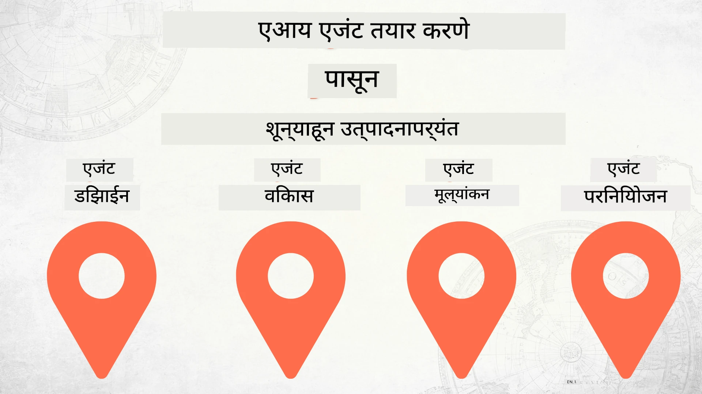

# शून्यापासून उत्पादनापर्यंत AI एजंट तयार करणे



### 🌐 बहुभाषिक समर्थन

#### GitHub Action द्वारे समर्थित (स्वयंचलित आणि नेहमी अद्ययावत)

<!-- CO-OP TRANSLATOR LANGUAGES TABLE START -->
[अरबी](../ar/README.md) | [बंगाली](../bn/README.md) | [बुल्गेरियन](../bg/README.md) | [बर्मीज (म्यानमार)](../my/README.md) | [चिनी (सोप्या)](../zh-CN/README.md) | [चिनी (परंपरागत, हाँग काँग)](../zh-HK/README.md) | [चिनी (परंपरागत, मकाऊ)](../zh-MO/README.md) | [चिनी (परंपरागत, तैवान)](../zh-TW/README.md) | [क्रोएशियन](../hr/README.md) | [चेक](../cs/README.md) | [डॅनिश](../da/README.md) | [डच](../nl/README.md) | [एस्टोनियन](../et/README.md) | [फिनिश](../fi/README.md) | [फ्रेंच](../fr/README.md) | [जर्मन](../de/README.md) | [ग्रीक](../el/README.md) | [हिब्रू](../he/README.md) | [हिंदी](../hi/README.md) | [हंगेरीयन](../hu/README.md) | [इंडोनेशियन](../id/README.md) | [इतालियन](../it/README.md) | [जपानी](../ja/README.md) | [कन्नड](../kn/README.md) | [कोरियन](../ko/README.md) | [लिथुआनियन](../lt/README.md) | [मलय](../ms/README.md) | [मलयाळम](../ml/README.md) | [मराठी](./README.md) | [नेपाली](../ne/README.md) | [नायजेरियन पिडगिन](../pcm/README.md) | [नॉर्वेजियन](../no/README.md) | [फारसी (पर्शियन)](../fa/README.md) | [पोलिश](../pl/README.md) | [पोर्तुगीज (ब्राझील)](../pt-BR/README.md) | [पोर्तुगीज (पोर्तुगाल)](../pt-PT/README.md) | [पंजाबी (गुरमुखी)](../pa/README.md) | [रोमानियन](../ro/README.md) | [रशियन](../ru/README.md) | [सर्बियन (सिरिलिक)](../sr/README.md) | [स्लोव्हाक](../sk/README.md) | [स्लोव्हेनियन](../sl/README.md) | [स्पॅनिश](../es/README.md) | [स्वाहिली](../sw/README.md) | [स्वीडिश](../sv/README.md) | [टॅगलॉग (फिलिपिनो)](../tl/README.md) | [तमिळ](../ta/README.md) | [तेलुगू](../te/README.md) | [थाई](../th/README.md) | [तुर्की](../tr/README.md) | [युक्रेनियन](../uk/README.md) | [उर्दू](../ur/README.md) | [व्हिएतनामी](../vi/README.md)

> **स्थानिकरित्या क्लोन करणे आवडेल?**

> या संकलनात ५०+ भाषा अनुवाद समाविष्ट आहेत ज्या डाउनलोड आकार लक्षणीय वाढवतात. अनुवादांशिवाय क्लोन करण्यासाठी sparse checkout वापरा:
> ```bash
> git clone --filter=blob:none --sparse https://github.com/microsoft/Building-AI-Agents-From-Zero-To-Production.git
> cd Building-AI-Agents-From-Zero-To-Production
> git sparse-checkout set --no-cone '/*' '!translations' '!translated_images'
> ```
> यामुळे तुम्हाला कोर्स पूर्ण करण्यासाठी आवश्यक सर्व काही अधिक वेगवान डाउनलोडसह मिळेल.
<!-- CO-OP TRANSLATOR LANGUAGES TABLE END -->

## AI एजंट विकास जीवनचक्राच्या मूलतत्त्वांची शिकवण देणारा कोर्स

[](https://github.com/microsoft/Building-AI-Agents-From-Zero-To-Production/blob/master/LICENSE?WT.mc_id=academic-105485-koreyst)
[](https://GitHub.com/microsoft/Building-AI-Agents-From-Zero-To-Production/graphs/contributors/?WT.mc_id=academic-105485-koreyst)
[](https://GitHub.com/microsoft/Building-AI-Agents-From-Zero-To-Production/issues/?WT.mc_id=academic-105485-koreyst)
[](https://GitHub.com/microsoft/Building-AI-Agents-From-Zero-To-Production/pulls/?WT.mc_id=academic-105485-koreyst)
[](http://makeapullrequest.com?WT.mc_id=academic-105485-koreyst)

[](https://discord.gg/Kuaw3ktsu6)

## 🌱 सुरूवात

या कोर्समध्ये AI एजंट तयार करणे आणि वितरित करण्याच्या मूलतत्त्वांची शिकवण आहे.

प्रत्येक धडा मागील धड्यावर आधारित आहे, त्यामुळे आम्ही शिफारस करतो की सुरुवातीपासून सुरू करा आणि शेवटपर्यंत काम करा.

तुम्हाला AI एजंट विषयांबद्दल अधिक जाणून घ्यायचे असल्यास, तुम्ही [AI Agents For Beginners Course](https://aka.ms/ai-agents-beginners) तपासू शकता.

### इतर शिकणाऱ्यांशी भेटा, तुमचे प्रश्न विचारून उत्तरं मिळवा

जर तुम्हाला अडचण आल्यास किंवा AI एजंट तयार करण्याबद्दल काही प्रश्न असतील तर, आमच्या समर्पित Discord चॅनेलमध्ये सहभागी व्हा, जो [Microsoft Foundry Discord](https://discord.gg/Kuaw3ktsu6) मध्ये आहे.

### तुम्हाला काय आवश्यक आहे

प्रत्येक धड्याचे स्वतःचे कोड नमुने आहेत जे तुम्ही स्थानिकरित्या चालवू शकता. तुम्ही [हा रेपो फोर्क](https://github.com/microsoft/Building-AI-Agents-From-Zero-To-Production/fork) करू शकता आणि स्वतःची प्रत तयार करू शकता.

हा कोर्स सध्या खालील गोष्टी वापरतो:

- [Microsoft Agent Framework (MAF)](https://aka.ms/ai-agents-beginners/agent-framework)
- [Microsoft Foundry](https://azure.microsoft.com/products/ai-foundry)
- [Azure OpenAI सेवा](https://azure.microsoft.com/products/ai-foundry/models/openai)
- [Azure CLI](https://learn.microsoft.com/cli/azure/authenticate-azure-cli?view=azure-cli-latest)

सुरू करण्यापूर्वी कृपया तुम्हाला या सेवांचा प्रवेश असल्याची खात्री करा.

मॉडेल होस्टिंग आणि सेवेबाबत अधिक पर्याय लवकरच येत आहेत.

## 🗃️ धडे

| **धडा**             | **वर्णन**                                                                                   |
|---------------------|--------------------------------------------------------------------------------------------|
| [एजंट डिझाईन](./lesson-1-agent-design/README.md)          | आमच्या "डेव्हलपर ऑनबोर्डिंग" एजंट वापर प्रकरणाची ओळख आणि प्रभावी एजंट डिझाईन कसे करायचे    |
| [एजंट विकास](./lesson-2-agent-development/README.md)      | Microsoft Agent Framework (MAF) वापरून, नवीन विकासकांना मदत करण्यासाठी 3 एजंट तयार करा.    |
| [एजंट मूल्यांकन](./lesson-3-agent-evals/README.md)         | Microsoft Foundry वापरून, आमचे AI एजंट कसे काम करत आहेत ते तपासा आणि सुधारणा कशी करायची ते शिका. |
| [एजंट वितरण](./lesson-4-agent-deployment/README.md)        | Hosted Agents आणि OpenAI Chatkit वापरून, AI एजंट उत्पादनात कसा तैनात करायचा ते पाहा.                |


## 🎒 इतर कोर्सेस

आमची टीम इतर कोर्सेस देखील तयार करते! पहा:

<!-- CO-OP TRANSLATOR OTHER COURSES START -->
### LangChain
[](https://aka.ms/langchain4j-for-beginners)
[](https://aka.ms/langchainjs-for-beginners?WT.mc_id=m365-94501-dwahlin)

---

### Azure / Edge / MCP / Agents
[](https://github.com/microsoft/AZD-for-beginners?WT.mc_id=academic-105485-koreyst)
[](https://github.com/microsoft/edgeai-for-beginners?WT.mc_id=academic-105485-koreyst)
[](https://github.com/microsoft/mcp-for-beginners?WT.mc_id=academic-105485-koreyst)
[](https://github.com/microsoft/ai-agents-for-beginners?WT.mc_id=academic-105485-koreyst)

---
 
### जनरेटिव AI सिरीज
[](https://github.com/microsoft/generative-ai-for-beginners?WT.mc_id=academic-105485-koreyst)
[-9333EA?style=for-the-badge&labelColor=E5E7EB&color=9333EA)](https://github.com/microsoft/Generative-AI-for-beginners-dotnet?WT.mc_id=academic-105485-koreyst)
[-C084FC?style=for-the-badge&labelColor=E5E7EB&color=C084FC)](https://github.com/microsoft/generative-ai-for-beginners-java?WT.mc_id=academic-105485-koreyst)
[-E879F9?style=for-the-badge&labelColor=E5E7EB&color=E879F9)](https://github.com/microsoft/generative-ai-with-javascript?WT.mc_id=academic-105485-koreyst)

---
 
### कोअर शिक्षण
[](https://aka.ms/ml-beginners?WT.mc_id=academic-105485-koreyst)
[](https://aka.ms/datascience-beginners?WT.mc_id=academic-105485-koreyst)
[](https://aka.ms/ai-beginners?WT.mc_id=academic-105485-koreyst)
[](https://github.com/microsoft/Security-101?WT.mc_id=academic-96948-sayoung)
[](https://aka.ms/webdev-beginners?WT.mc_id=academic-105485-koreyst)
[](https://aka.ms/iot-beginners?WT.mc_id=academic-105485-koreyst)
[](https://github.com/microsoft/xr-development-for-beginners?WT.mc_id=academic-105485-koreyst)

---
 
### Copilot मालिका
[](https://aka.ms/GitHubCopilotAI?WT.mc_id=academic-105485-koreyst)
[](https://github.com/microsoft/mastering-github-copilot-for-dotnet-csharp-developers?WT.mc_id=academic-105485-koreyst)
[](https://github.com/microsoft/CopilotAdventures?WT.mc_id=academic-105485-koreyst)
<!-- CO-OP TRANSLATOR OTHER COURSES END -->

## योगदान करणे

हा प्रकल्प योगदान आणि सूचना स्वागत करतो. बहुतेक योगदानांसाठी तुम्हाला Contributor License Agreement (CLA) सहमत व्हावे लागेल ज्यामध्ये तुम्ही घोषणा करता की तुम्हाला तुमचा योगदान वापरण्याचा अधिकार आहे आणि प्रत्यक्षात तो अधिकार आम्हाला पुरवता. तपशीलांसाठी भेट द्या <https://cla.opensource.microsoft.com>.

जेव्हा तुम्ही पुल विनंती सादर करता, तेव्हा CLA बोट आपोआप ठरवेल की तुम्हाला CLA प्रदान करावी लागेल का आणि पुल विनंती योग्य प्रकारे सजवेल (उदा., स्थिती तपासणी, टिप्पणी). फक्त बोटद्वारे दिलेल्या सूचना अनुसरा. आमचा CLA वापरणाऱ्या सर्व रिपॉजिटरीजमध्ये तुम्हाला हा एकदाच करणे आवश्यक आहे.

हा प्रकल्पाने [Microsoft Open Source Code of Conduct](https://opensource.microsoft.com/codeofconduct/) स्वीकारला आहे.
अधिक माहितीसाठी [Code of Conduct FAQ](https://opensource.microsoft.com/codeofconduct/faq/) पहा किंवा
[opencode@microsoft.com](mailto:opencode@microsoft.com) वर कोणतेही अतिरिक्त प्रश्न किंवा टिप्पण्या पाठवा.

## ट्रेडमार्क्स

हा प्रकल्प प्रकल्प, उत्पादने किंवा सेवा यांसाठी ट्रेडमार्क किंवा लोगो असू शकतो. Microsoft ट्रेडमार्क किंवा लोगोची अधिकृत वापर [Microsoft's Trademark & Brand Guidelines](https://www.microsoft.com/legal/intellectualproperty/trademarks/usage/general) नियम व शर्तींच्या अधीन आहे आणि त्यांचे पालन करणे आवश्यक आहे.
या प्रकल्पाच्या सुधारित आवृत्त्यांमध्ये Microsoft ट्रेडमार्क किंवा लोगो वापरणे गोंधळ निर्माण करू नये किंवा Microsoft ची प्रायोजकता सूचित करू नये.
तृतीय-पक्ष ट्रेडमार्क किंवा लोगो वापरणे त्या तृतीय-पक्षांच्या धोरणांच्या अधीन आहे.

## मदत मिळवा

जर तुम्ही अडकलात किंवा AI अॅप्स तयार करण्याबाबत कोणते प्रश्न असतील तर सामील व्हा:

[](https://discord.gg/Kuaw3ktsu6)

तुमच्याकडे उत्पादनावर अभिप्राय किंवा तयार करताना त्रुटी असतील तर भेट द्या:

[](https://aka.ms/foundry/forum)

---

<!-- CO-OP TRANSLATOR DISCLAIMER START -->
**हेतुवार्ता**:
हा दस्तऐवज AI भाषांतर सेवा [Co-op Translator](https://github.com/Azure/co-op-translator) वापरून भाषांतरित करण्यात आला आहे. आम्ही अचूकतेसाठी प्रयत्नशील असलो तरी, कृपया लक्षात घ्या की स्वयंचलित भाषांतरांमध्ये चुका किंवा अचूकतेत तफावत होऊ शकते. मूळ दस्तऐवज त्याच्या स्थानिक भाषेत अधिकृत स्रोत मानला जावा. महत्त्वाच्या माहितीसाठी व्यावसायिक मानवी भाषांतर करण्याची शिफारस केली आहे. या भाषांतराच्या वापरामुळे झालेल्या कोणत्याही गैरसमज अथवा चुकीच्या अर्थ लावण्याबद्दल आम्ही जबाबदार नाही.
<!-- CO-OP TRANSLATOR DISCLAIMER END -->