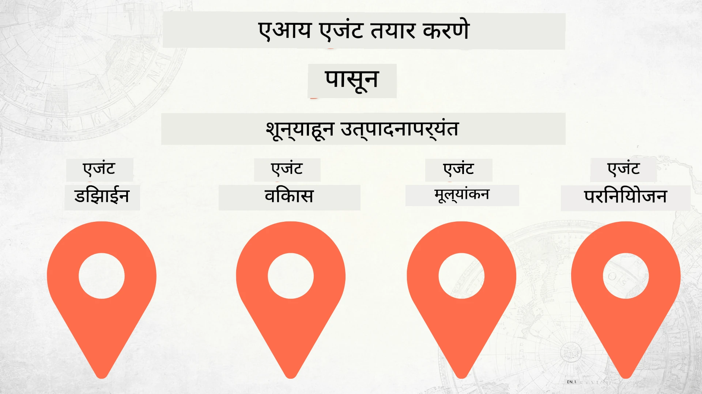

# शून्यापासून उत्पादनापर्यंत AI एजंट तयार करणे



### 🌐 बहुभाषिक समर्थन

#### GitHub Action द्वारे समर्थित (स्वयंचलित आणि नेहमी अद्ययावत)

<!-- CO-OP TRANSLATOR LANGUAGES TABLE START -->
[Arabic](../ar/README.md) | [Bengali](../bn/README.md) | [Bulgarian](../bg/README.md) | [Burmese (Myanmar)](../my/README.md) | [Chinese (Simplified)](../zh-CN/README.md) | [Chinese (Traditional, Hong Kong)](../zh-HK/README.md) | [Chinese (Traditional, Macau)](../zh-MO/README.md) | [Chinese (Traditional, Taiwan)](../zh-TW/README.md) | [Croatian](../hr/README.md) | [Czech](../cs/README.md) | [Danish](../da/README.md) | [Dutch](../nl/README.md) | [Estonian](../et/README.md) | [Finnish](../fi/README.md) | [French](../fr/README.md) | [German](../de/README.md) | [Greek](../el/README.md) | [Hebrew](../he/README.md) | [Hindi](../hi/README.md) | [Hungarian](../hu/README.md) | [Indonesian](../id/README.md) | [Italian](../it/README.md) | [Japanese](../ja/README.md) | [Kannada](../kn/README.md) | [Khmer](../km/README.md) | [Korean](../ko/README.md) | [Lithuanian](../lt/README.md) | [Malay](../ms/README.md) | [Malayalam](../ml/README.md) | [Marathi](./README.md) | [Nepali](../ne/README.md) | [Nigerian Pidgin](../pcm/README.md) | [Norwegian](../no/README.md) | [Persian (Farsi)](../fa/README.md) | [Polish](../pl/README.md) | [Portuguese (Brazil)](../pt-BR/README.md) | [Portuguese (Portugal)](../pt-PT/README.md) | [Punjabi (Gurmukhi)](../pa/README.md) | [Romanian](../ro/README.md) | [Russian](../ru/README.md) | [Serbian (Cyrillic)](../sr/README.md) | [Slovak](../sk/README.md) | [Slovenian](../sl/README.md) | [Spanish](../es/README.md) | [Swahili](../sw/README.md) | [Swedish](../sv/README.md) | [Tagalog (Filipino)](../tl/README.md) | [Tamil](../ta/README.md) | [Telugu](../te/README.md) | [Thai](../th/README.md) | [Turkish](../tr/README.md) | [Ukrainian](../uk/README.md) | [Urdu](../ur/README.md) | [Vietnamese](../vi/README.md)

> **स्थानिक क्लोन करणे प्राधान्य आहे?**
>
> या रेपॉजिटरीमध्ये ५०+ भाषांतील भाषांतर समाविष्ट आहे ज्यामुळे डाउनलोड आकार लक्षणीय वाढतो. भाषांतरांशिवाय क्लोन करण्यासाठी, sparse checkout वापरा:
>
> **Bash / macOS / Linux:**
> ```bash
> git clone --filter=blob:none --sparse https://github.com/microsoft/Building-AI-Agents-From-Zero-To-Production.git
> cd Building-AI-Agents-From-Zero-To-Production
> git sparse-checkout set --no-cone '/*' '!translations' '!translated_images'
> ```
>
> **CMD (Windows):**
> ```cmd
> git clone --filter=blob:none --sparse https://github.com/microsoft/Building-AI-Agents-From-Zero-To-Production.git
> cd Building-AI-Agents-From-Zero-To-Production
> git sparse-checkout set --no-cone "/*" "!translations" "!translated_images"
> ```
>
> यामुळे तुम्हाला कोर्स पूर्ण करण्यासाठी आवश्यक सर्वकाही मिळेल, पण डाउनलोड अधिक वेगाने होईल.
<!-- CO-OP TRANSLATOR LANGUAGES TABLE END -->

## AI एजंट विकास जीवनचक्राच्या मूलभूत गोष्टी शिकवणारा एक कोर्स

[](https://github.com/microsoft/Building-AI-Agents-From-Zero-To-Production/blob/master/LICENSE?WT.mc_id=academic-105485-koreyst)
[](https://GitHub.com/microsoft/Building-AI-Agents-From-Zero-To-Production/graphs/contributors/?WT.mc_id=academic-105485-koreyst)
[](https://GitHub.com/microsoft/Building-AI-Agents-From-Zero-To-Production/issues/?WT.mc_id=academic-105485-koreyst)
[](https://GitHub.com/microsoft/Building-AI-Agents-From-Zero-To-Production/pulls/?WT.mc_id=academic-105485-koreyst)
[](http://makeapullrequest.com?WT.mc_id=academic-105485-koreyst)

[](https://discord.gg/Kuaw3ktsu6)

## 🌱 सुरुवात करणे

या कोर्समध्ये AI एजंट तयार करण्याच्या आणि तैनात करण्याच्या मूलभूत गोष्टींचा अभ्यासक्रम आहे.

प्रत्येक धडा मागील धड्यावर आधारित आहे, त्यामुळे आम्ही तुम्हाला सुरुवातीपासून सुरू करून अखेरीपर्यंत वाचा करण्याची शिफारस करतो.

जर तुम्हाला AI एजंट विषयांबद्दल अधिक जाणून घ्यायचे असेल तर तुम्ही [AI Agents For Beginners Course](https://aka.ms/ai-agents-beginners) पाहू शकता.

### इतर शिकणाऱ्यांशी भेटा, तुमच्या प्रश्नांची उत्तरे मिळवा

जर तुम्हाला अडचण आली असेल किंवा AI एजंट तयार करण्याबद्दल काही प्रश्न असतील, तर आमच्या समर्पित Discord चॅनेलमध्ये सामील व्हा [Microsoft Foundry Discord](https://discord.gg/Kuaw3ktsu6).

### तुमच्याकडे काय असावे

प्रत्येक धड्यावर स्वतःचा कोड नमुना असतो जो तुम्ही स्थानिकरित्या चालवू शकता. तुम्ही [हे रेपॉजिटरी फोर्क करू शकता](https://github.com/microsoft/Building-AI-Agents-From-Zero-To-Production/fork) तुमची स्वतःची कॉपी तयार करण्यासाठी.

हा कोर्स सध्या खालील गोष्टी वापरतो:

- [Microsoft Agent Framework (MAF)](https://aka.ms/ai-agents-beginners/agent-framework)
- [Microsoft Foundry](https://azure.microsoft.com/products/ai-foundry) — एक प्रकल्प ज्यामध्ये तैनात **GPT-5 सीरीज** मॉडेल आहे (उदा. `gpt-5.1`). कृपया माघारीवलेल्या GPT-4o / GPT-4.1 मॉडेलांचा वापर करू नका.
- [Azure OpenAI Service](https://azure.microsoft.com/products/ai-foundry/models/openai)
- [Azure CLI](https://learn.microsoft.com/cli/azure/authenticate-azure-cli?view=azure-cli-latest) — कोणताही नमुना चालवण्यापूर्वी `az login` वापरून साइन इन करा
- **Python 3.12 किंवा नंतरचे आवृत्ती**

कृपया सुरुवात करण्यापूर्वी तुम्हाला या सेवा वापरण्याचा अधिकार आहे याची खात्री करा.

> **💰 खर्च आणि स्वच्छता.** ह्या हाताने करायच्या धड्यांमध्ये वास्तविक Azure संसाधने तयार केली जातात — एक Microsoft Foundry
> प्रकल्प, एक मॉडेल तैनाती, एक व्हेक्टर स्टोअर, आणि (धडे 4–6 मध्ये) होस्टेड एजंट्स आणि टूलबॉक्स.
> जे अस्तित्वात असताना खर्च होऊ शकतो. जेव्हा तुम्ही एखादा धडा किंवा कोर्स पूर्ण करता — तेव्हा
> तुम्हाला नको असलेली संसाधने हटवा. सगळ्यात सोपा मार्ग म्हणजे सर्व काही एका समर्पित संसाधन
> गटात ठेवा आणि जेव्हा पूर्ण होईल तेव्हा संपूर्ण गट हटवा:
>
> ```bash
> az group delete --name <your-resource-group> --yes --no-wait
> ```
>
> तुम्ही Foundry पोर्टलमधून वेगवेगळे एजंट्स, व्हेक्टर स्टोअर्स, आणि टूलबॉक्सही हटवू शकता.

> **मॉडेल्ससंदर्भातील टीप.** हा कोर्स सर्व मॉडेल्स **Microsoft Foundry** द्वारे पुरवतो. हा
> *GitHub Models* वापरत नाही, जे **30 जुलै, 2026** रोजी निवृत्त होणार आहेत — Microsoft Foundry हा
> अधिकृत स्थलांतर मार्ग आहे. जर तुमच्याकडे जुने कोड असतील जे GitHub Models कॉल करतात, तर ते Foundry
> मॉडेल तैनातीकडे निर्देशित करा.

लवकरच मॉडेल होस्टिंग आणि सेवांबाबत अधिक पर्याय उपलब्ध होतील.

## 🗃️ धडे

| **धडा**           | **वर्णन**                                                                                            |
|--------------------|----------------------------------------------------------------------------------------------------|
| [Agent Design](./lesson-1-agent-design/README.md)       | आमच्या "डेव्हलपर ऑनबोर्डिंग" एजंट वापर प्रकरणाची ओळख आणि प्रभावी एजंट कसे डिझाईन करायचे       |
| [Agent Development](./lesson-2-agent-development/README.md)  | Microsoft Agent Framework (MAF) वापरून नवीन विकासकांसाठी विशेष एजंट तयार करा आणि मदत करा.  |
| [Agent Evaluations](./lesson-3-agent-evals/README.md)  | Microsoft Foundry वापरून आमचे AI एजंट कसे कार्य करत आहेत ते शोधा आणि त्यांना कसे सुधारायचे ते शिका. |
| [Agent Deployment](./lesson-4-agentdeployment/README.md)   | Microsoft Foundry वर होस्टेड एजंट्स आणि OpenAI ChatKit वापरून AI एजंट उत्पादनात कसा तैनात करायचा ते पहा.   |
| [Production Hosted Agents](./lesson-5-hosted-agents-production/README.md)   | एक होस्टेड एजंट एंटरप्राइझ उत्पादनात आणा: होस्टेड एजंट्स विरुद्ध क्षमता होस्ट, स्वतःचे स्टोरेज, मेमरी, आणि प्रशासन.   |
| [Microsoft Toolbox](./lesson-6-toolbox/README.md)   | एकदा टूल्स व्याख्या करा आणि केंद्रितपणे प्रशासन करा: एक टूलबॉक्स तयार करा, एक MCP एंडपॉईंटद्वारे एजंटकडून वापरा, आणि टूल्सचा सुरक्षित आवृत्तीकरण करा. |
| [Multi-Agent & A2A](./lesson-7-multi-agent-a2a/README.md)   | एजंट्सना नेटवर्केड सेवा म्हणून तयार करा: मुक्त एजंट-टू-एजंट (A2A) प्रोटोकॉलवर एजंट एक्सपोज करा आणि दूरस्थ एजंटला सहकारी म्हणून वापरा.  |


## 🎒 इतर कोर्सेस

आमच्या टीमकडे इतरही कोर्सेस आहेत! पाहा:

<!-- CO-OP TRANSLATOR OTHER COURSES START -->
### LangChain
[](https://aka.ms/langchain4j-for-beginners)
[](https://aka.ms/langchainjs-for-beginners?WT.mc_id=m365-94501-dwahlin)
[](https://github.com/microsoft/langchain-for-beginners?WT.mc_id=m365-94501-dwahlin)
---

### Azure / Edge / MCP / Agents
[](https://github.com/microsoft/AZD-for-beginners?WT.mc_id=academic-105485-koreyst)
[](https://github.com/microsoft/edgeai-for-beginners?WT.mc_id=academic-105485-koreyst)
[](https://github.com/microsoft/mcp-for-beginners?WT.mc_id=academic-105485-koreyst)
[](https://github.com/microsoft/ai-agents-for-beginners?WT.mc_id=academic-105485-koreyst)

---
 
### जनरेटिव AI सिरीज

[](https://github.com/microsoft/generative-ai-for-beginners?WT.mc_id=academic-105485-koreyst)
[-9333EA?style=for-the-badge&labelColor=E5E7EB&color=9333EA)](https://github.com/microsoft/Generative-AI-for-beginners-dotnet?WT.mc_id=academic-105485-koreyst)
[-C084FC?style=for-the-badge&labelColor=E5E7EB&color=C084FC)](https://github.com/microsoft/generative-ai-for-beginners-java?WT.mc_id=academic-105485-koreyst)
[-E879F9?style=for-the-badge&labelColor=E5E7EB&color=E879F9)](https://github.com/microsoft/generative-ai-with-javascript?WT.mc_id=academic-105485-koreyst)

---
 
### मुख्य शिक्षण
[](https://aka.ms/ml-beginners?WT.mc_id=academic-105485-koreyst)
[](https://aka.ms/datascience-beginners?WT.mc_id=academic-105485-koreyst)
[](https://aka.ms/ai-beginners?WT.mc_id=academic-105485-koreyst)
[](https://github.com/microsoft/Security-101?WT.mc_id=academic-96948-sayoung)
[](https://aka.ms/webdev-beginners?WT.mc_id=academic-105485-koreyst)
[](https://aka.ms/iot-beginners?WT.mc_id=academic-105485-koreyst)
[](https://github.com/microsoft/xr-development-for-beginners?WT.mc_id=academic-105485-koreyst)

---
 
### Copilot मालिका
[](https://aka.ms/GitHubCopilotAI?WT.mc_id=academic-105485-koreyst)
[](https://github.com/microsoft/mastering-github-copilot-for-dotnet-csharp-developers?WT.mc_id=academic-105485-koreyst)
[](https://github.com/microsoft/CopilotAdventures?WT.mc_id=academic-105485-koreyst)
<!-- CO-OP TRANSLATOR OTHER COURSES END -->

## योगदान

हा प्रकल्प योगदान आणि सूचना स्वागत करतो. बहुतेक योगदानांसाठी तुम्हाला एक
Contributor License Agreement (CLA) सहमत व्हावे लागते ज्यात तुम्ही हे घोषित करतो की तुम्हाला हक्क आहेत, आणि प्रत्यक्षात आम्हाला
तुमचा योगदान वापरण्याचा हक्क दिला आहे. तपशीलांसाठी, येथे भेट द्या <https://cla.opensource.microsoft.com>.

जेव्हा तुम्ही पुल विनंती पाठवता, CLA बॉट स्वयंचलितपणे ठरवेल की तुम्हाला CLA आवश्यक आहे का
आणि PR योग्यरित्या चिन्हांकित करेल (उदा. स्थिती तपासणी, टिप्पणी). फक्त बॉटद्वारे दिलेल्या सूचनांचे पालन करा.
तुम्हाला हे एकदाच सर्व रेपोसाठी करावे लागेल ज्या आमच्या CLA वापरतात.

या प्रकल्पाने [मायक्रोसॉफ्ट ओपन सोर्स कोड ऑफ कॉन्डक्ट](https://opensource.microsoft.com/codeofconduct/) स्वीकारला आहे.
अधिक माहितीसाठी पाहा [कोड ऑफ कॉन्डक्ट FAQ](https://opensource.microsoft.com/codeofconduct/faq/) किंवा
[opencode@microsoft.com](mailto:opencode@microsoft.com) वर कोणतेही अतिरिक्त प्रश्न किंवा टिप्पणींसाठी संपर्क साधा.

## ट्रेडमार्क

या प्रकल्पात प्रकल्प, उत्पादने किंवा सेवा यासाठी ट्रेडमार्क किंवा लोगो असू शकतात. मायक्रोसॉफ्टच्या अधिकृत ट्रेडमार्क
किंवा लोगोचा वापर करण्यासाठी खालील नियम मान्य करणे आणि पालन करणे आवश्यक आहे:
[Microsoft's Trademark & Brand Guidelines](https://www.microsoft.com/legal/intellectualproperty/trademarks/usage/general).
या प्रकल्पाच्या सुधारित आवृत्त्यांमध्ये मायक्रोसॉफ्ट ट्रेडमार्क किंवा लोगोचा वापर केल्याने गोंधळ निर्माण होऊ नये किंवा मायक्रोसॉफ्टच्या प्रायोजकत्वाचा भास व्हावा अशी अपेक्षा नाही.

तृतीय-पक्ष ट्रेडमार्क किंवा लोगोचा कोणताही वापर त्या तृतीय-पक्षांच्या धोरणांनुसार असतो.

## मदत मिळवणे

तुम्ही अडकलात किंवा AI अ‍ॅप्स तयार करताना काही प्रश्न असल्यास, सामील व्हा:

[](https://discord.gg/Kuaw3ktsu6)

उत्पादनाबाबत अभिप्राय किंवा त्रुटी असल्यास येथे भेट द्या:

[](https://aka.ms/foundry/forum)

---

<!-- CO-OP TRANSLATOR DISCLAIMER START -->
**अस्वीकरण**:
हा दस्तऐवज AI भाषांतर सेवा [Co-op Translator](https://github.com/Azure/co-op-translator) चा वापर करून अनुवादित केला आहे. जरी आम्ही अचूकतेसाठी प्रयत्न करतो, तरी कृपया लक्षात घ्या की स्वयंचलित भाषांतरांमध्ये त्रुटी किंवा अचूकतेची कमतरता असू शकते. मूळ दस्तऐवज त्याच्या मूळ भाषेत अधिकृत स्रोत मानला पाहिजे. महत्त्वाची माहिती असल्यास, व्यावसायिक मानवी भाषांतराची शिफारस केली जाते. या भाषांतराच्या वापरामुळे उद्भवणाऱ्या कोणत्याही गैरसमज किंवा चुकीच्या अर्थलावणीसाठी आम्ही जबाबदार नाही.
<!-- CO-OP TRANSLATOR DISCLAIMER END -->