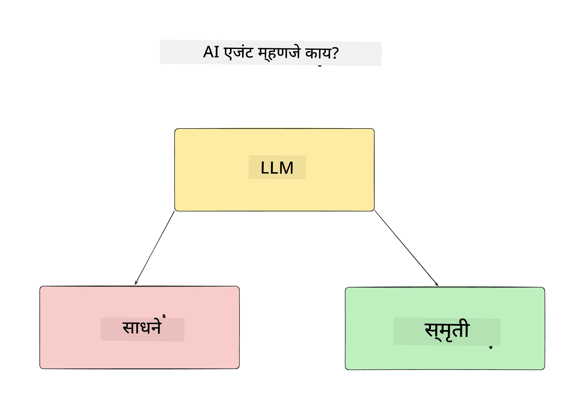
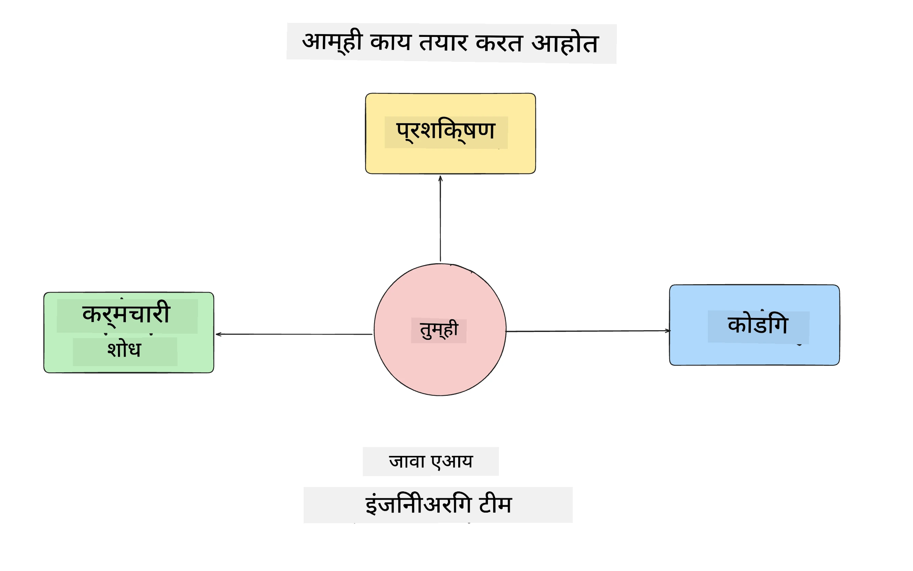
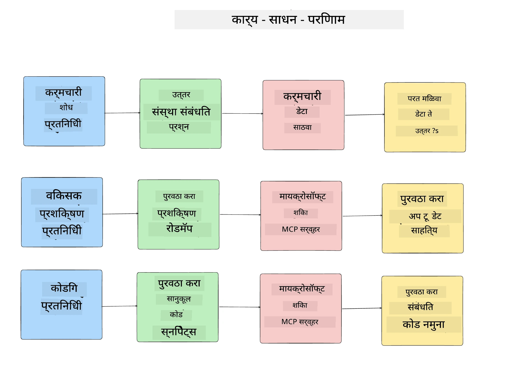
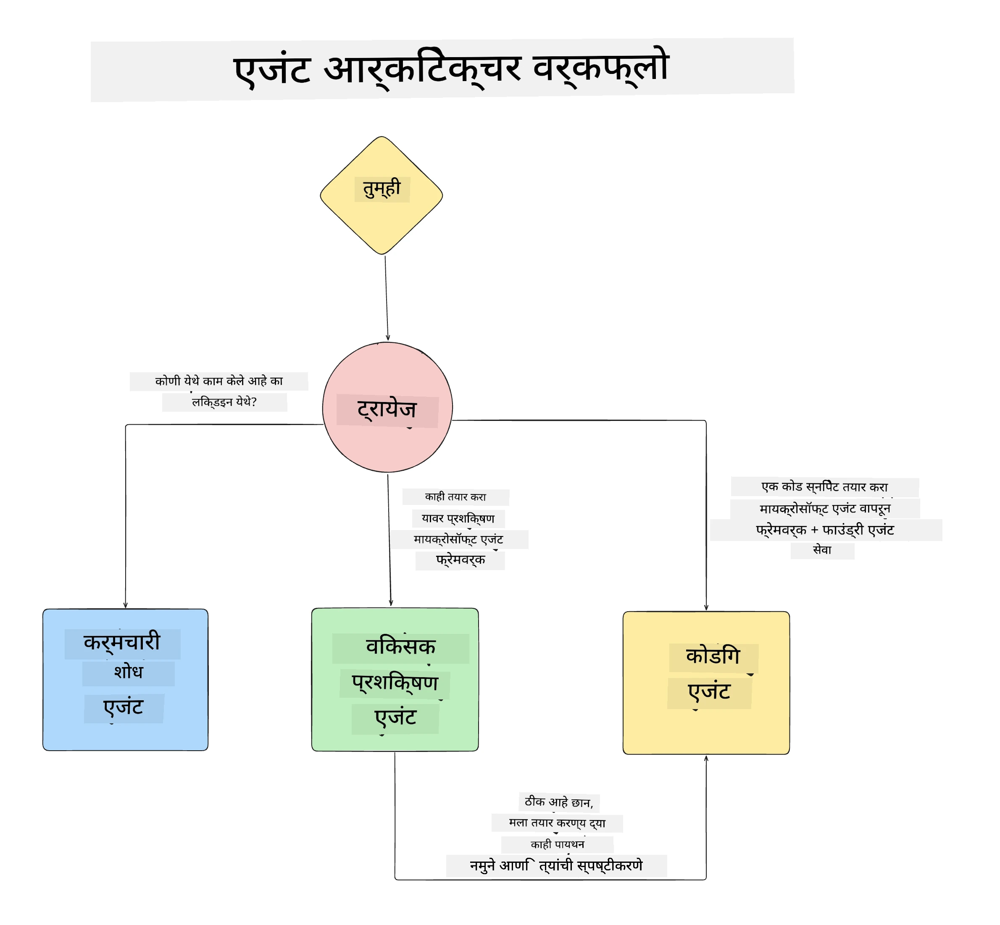

# धडा 1: एआय एजंट डिझाइन

"शून्यातून उत्पादनासाठी एआय एजंट तयार करणे" कोर्सच्या पहिल्या धड्यात आपले स्वागत आहे!

या धड्यात आपण खालील गोष्टींचा आढावा घेणार आहोत:

- एआय एजंट म्हणजे काय हे परिभाषित करणे
  
- आपण तयार करत असलेल्या एआय एजंट अनुप्रयोगावर चर्चा करणे  

- प्रत्येक एजंटसाठी आवश्यक साधने आणि सेवा ओळखणे
  
- आपला एजंट अनुप्रयोग आर्किटेक्ट करणे
  
चला सुरुवात करूया एजंट म्हणजे काय आणि आपण ते अनुप्रयोगाच्या आत का वापरतो हे परिभाषित करून.

> **कोर्स सुरू करण्यापूर्वी.** हा पहिला धडा संकल्पनात्मक आहे — येथे चालवायचा कोणताही कोड नाही.
> [धडा 2](../lesson-2-agent-development/README.md) पासून आपल्याला आवश्यकता असेल: **Microsoft Foundry** साठी प्रवेश असलेली **Azure
> सबस्क्रिप्शन**, तैनात केलेले **GPT-5 सिरीज मॉडेल** (उदाहरणार्थ `gpt-5.1` — निवृत्त झालेल्या GPT-4o / GPT-4.1 टाळा), **Python 3.12+**, आणि **Azure CLI**
> (`az login`). कोर्स README मधील [आपल्याला काय हवे](../README.md#what-you-need) येथे पूर्ण यादी आणि दुवे पाहा.

## एआय एजंट म्हणजे काय?

जर ही आपली पहिली वेळ असेल एआय एजंट कसा तयार करायचा हे एक्सप्लोर करताना, तर आपल्याला नक्कीच एआय एजंट म्हणजे काय हे कसे परिभाषित करावे याबाबत प्रश्न असू शकतात.

एआय एजंट म्हणजे काय हे सोप्या पद्धतीने सांगायचे झाले, तर त्याला बनवणाऱ्या घटकांद्वारे परिभाषित करूया:

**मोठे भाषा मॉडेल** - LLM वापरकर्त्यांकडून नैसर्गिक भाषा प्रक्रिया करण्याची क्षमता देतो जेणेकरून ते पूर्ण करायचे कार्य समजून घेण्यात येते तसेच उपलब्ध साधनांच्या वर्णनांचा अर्थ लावण्यात मदत करतो.

**साधने** - ही फंक्शन्स, API, डेटा स्टोअर्स आणि इतर सेवा असतील ज्याचा LLM निवड करून वापर करेल वापरकर्त्यांकडून मागितलेल्या कामांचे पूर्णत्व साधण्यासाठी.

**स्मृती** - हे AI एजंट आणि वापरकर्त्यांमधील दोन्ही अल्पकालीन आणि दीर्घकालीन संवाद कसे साठवला जातो हे दर्शवते. माहिती साठवणे आणि पुनर्प्राप्त करणे सुधारणा करण्यासाठी आणि वापरकर्त्याच्या पसंती जपण्यासाठी महत्त्वाचे आहे.

## आपला एआय एजंट वापर प्रकरण

या कोर्ससाठी, आपण एक एआय एजंट अनुप्रयोग तयार करणार आहोत जो नवीन विकासकांना आमच्या एआय एजंट विकास टीममध्ये सामील होण्यास मदत करतो!

काहीही विकास काम सुरू करण्यापूर्वी, यशस्वी एआय एजंट अनुप्रयोग तयार करण्याचा पहिला टप्पा म्हणजे आमच्या वापरकर्त्यांनी आमच्या एआय एजंट्स कशी वापरायची यावर स्पष्ट परिस्थिती निश्चित करणे.

या अनुप्रयोगासाठी, आपण खालील परिस्थितींवर काम करू:

**परिस्थिती 1:** नवीन कर्मचारी आमच्या संस्थेत सामील होतो आणि त्याने सामील झालेल्या टीमबद्दल अधिक जाणून घेऊ इच्छितो तसेच त्यांच्या संपर्काचा मार्ग शोधतो.

**परिस्थिती 2:** नवीन कर्मचारी काय हे ठरवू इच्छितो की सुरूवातीस त्याने कोणते सर्वोत्तम प्रथम कार्य करावे.

**परिस्थिती 3:** नवीन कर्मचारी शिकण्याचे स्त्रोत आणि कोड नमुने गोळा करू इच्छितो जे त्याला हा कार्य पूर्ण करण्यात मदत करतील.

## साधने आणि सेवा ओळखणे

आता जेव्हा आपल्याकडे हे परिस्थिती आहेत, पुढील टप्पा म्हणजे त्या साधने आणि सेवा शोधणे ज्या आपल्या एआय एजंट्सना ही कामे पूर्ण करण्यासाठी आवश्यक आहेत.

हा प्रक्रिया संदर्भ अभियांत्रिकी (Context Engineering) या श्रेणीत येते कारण आपण हे लक्ष केंद्रित करू की आपल्या एआय एजंट्सना योग्य वेळेत योग्य संदर्भ मिळू शकेल आणि ते काम पूर्ण करू शकतील.

चला ही परिस्थिती तशा पाहू आणि उत्तम एजंटिक डिझाइन करत प्रत्येक एजंटचे कार्य, साधने आणि अपेक्षित परिणामांची यादी करूया.

### परिस्थिती 1 - कर्मचारी शोध एजंट

**कार्य** - संस्थेतील कर्मचाऱ्यांविषयी प्रश्नांची उत्तरे द्यायची जसे सामील होण्याची तारीख, वर्तमान टीम, स्थान आणि शेवटच्या स्थानविषयी.

**साधने** - वर्तमान कर्मचारी यादी आणि संघटनेचा चार्ट यांचे डेटा स्टोर

**परिणाम** - डेटास्टोरमधून सामान्य संघटनात्मक प्रश्न आणि कर्मचाऱ्यांविषयी विशेष प्रश्नांची उत्तरे मिळवू शकणे.

### परिस्थिती 2 - कार्य शिफारस करणारा एजंट

**कार्य** - नवीन कर्मचाऱ्याच्या विकासक अनुभवावरून, 1 ते 3 समस्या शोधणे ज्या नवीन कर्मचारी काम करू शकतो.

**साधने** - GitHub MCP सर्व्हर उघडी समस्या आणण्यासाठी आणि विकासकर्ता प्रोफाइल तयार करण्यासाठी

**परिणाम** - GitHub प्रोफाइलमधील शेवटच्या 5 कमिट्स आणि GitHub प्रोजेक्टवरील उघडी असलेली मुद्दे वाचून जुळणीवर आधारित शिफारसी करू शकणे.

### परिस्थिती 3 - कोड सहाय्यक एजंट

**कार्य** - "कार्य शिफारस" एजंटने शिफारस केलेल्या उघड्या समस्यांवर आधारित, संशोधन करणे आणि संसाधने व कोड स्निपेट्स तयार करणे जे कर्मचारीला मदत करतील.

**साधने** - Microsoft Learn MCP संसाधने शोधण्यासाठी आणि Code Interpreter सानुकूल कोड स्निपेट्स तयार करण्यासाठी.

**परिणाम** - जर वापरकर्त्याने अतिरिक्त मदत मागितली, तर वर्कफ्लो Learn MCP सर्व्हर वापरून संसाधनांच्या दुवे आणि स्निपेट्स देईल आणि नंतर Code Interpreter एजंट कडे हस्तांतरित करून लहान कोड स्निपेट्स स्पष्टीकरणांसह तयार करेल.

## आपला एजंट अनुप्रयोग आर्किटेक्ट करणे

आता जेव्हा प्रत्येक एजंट निश्चित झाला आहे, तेव्हा एक आर्किटेक्चर डायग्राम तयार करू या जे आपल्याला कसे प्रत्येक एजंट काम करेल हे समजून घेण्यास मदत करेल, कामावर अवलंबून एकत्र आणि स्वतंत्रपणे:

## पुढील टप्पे

आता जेव्हा आपण प्रत्येक एजंट आणि आपली एजंटिक प्रणाली डिझाइन केल्यात, पुढील धड्यात आपण या प्रत्येक एजंटचे विकास करूया!

---

<!-- CO-OP TRANSLATOR DISCLAIMER START -->
**अस्वीकरण**:
हा दस्तऐवज AI भाषांतर सेवा [Co-op Translator](https://github.com/Azure/co-op-translator) चा वापर करून अनुवादित केला आहे. जरी आम्ही अचूकतेसाठी प्रयत्न करतो, तरी कृपया लक्षात घ्या की स्वयंचलित भाषांतरांमध्ये त्रुटी किंवा अचूकतेची कमतरता असू शकते. मूळ दस्तऐवज त्याच्या मूळ भाषेत अधिकृत स्रोत मानला पाहिजे. महत्त्वाची माहिती असल्यास, व्यावसायिक मानवी भाषांतराची शिफारस केली जाते. या भाषांतराच्या वापरामुळे उद्भवणाऱ्या कोणत्याही गैरसमज किंवा चुकीच्या अर्थलावणीसाठी आम्ही जबाबदार नाही.
<!-- CO-OP TRANSLATOR DISCLAIMER END -->