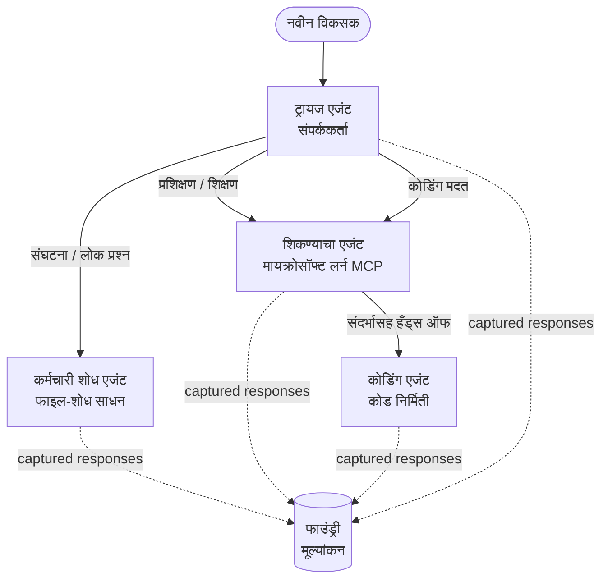

# धडा ३: मायक्रोसॉफ्ट फाउंड्रीसह एजंट मूल्यांकन

**"शून्यातून उत्पादनांपर्यंत AI एजंट तयार करणे"** या कोर्सच्या तिसर्या धड्यात आपले स्वागत आहे!

[धडा २](../lesson-2-agent-development/README.md) मध्ये आपण एजंट तयार केले. या धड्यात आपण अधिक कठीण प्रश्नाची उत्तरे शोधणार आहोत: **ते काही चांगले आहेत का?** चालवण्यायोग्य एजंट तयार करणे सोपे आहे; पण ते योग्य प्रकारे मार्गदर्शन करतात, आपल्या डेटावर आधारित राहतात आणि योग्य प्रकारे त्याच्या साधनांचा उपयोग करतात का हे जाणून घेणे म्हणजे डेमो आणि उत्पादन प्रणाली यामधील फरक आहे.


या धड्यात आपण पाहणार आहोत:

- एजंट मूल्यांकन का महत्त्वाचे आहे आणि ते पारंपरिक चाचण्यांपासून कसे वेगळे आहे
- **निरीक्षणीयता**, **स्मोक चाचण्या**, आणि **मूल्यांकन** यामधील फरक
- बहु-एजंट कार्यप्रवाह जो आपण मोजणार आहोत
- अंतर्निर्मित **मायक्रोसॉफ्ट फाउंड्री मूल्यांकन करणारे** (संबंधितता, आधारभूतता, साधन कॉल अचूकता, साधन आउटपुट वापर)
- [`agent-evals.py`](../../../lesson-3-agent-evals/agent-evals.py) मध्ये मूल्यांकन पाइपलाइनचा टप्पा-दर-टप्पा आढावा
- ते कसे चालवायचे आणि निकाल कसे वाचायचे

---

## एजंट का मूल्यांकन करावे?

पारंपरिक युनिट चाचणी मध्ये `add(2, 2) == 4` असे निश्चित केले जाते. एजंट तसे काम करत नाहीत — प्रत्येक वेळी एकाच प्रॉम्प्टमध्ये वेगवेगळ्या शब्दांत उत्तर येऊ शकते, साधनांचा वापर वेगळ्या क्रमाने होऊ शकतो, आणि "बरोबर" ही बूलियनपेक्षा प्रमाणानुसार ठरते. आपण अचूक स्ट्रिंगवर निश्चित जबाबदारी नाही घेऊ शकत.


त्याऐवजी, आपण एजंटला **गुणवत्तेच्या मापां**नुसार मूल्यांकन करता, मॉडेल-आधारित *मूल्यांकन करणारे* (ज्याला "LLM एक न्यायाधीश" देखील म्हणतात) व साधनांच्या वापरावर निश्चित तपासणीचा उपयोग करून. यामुळे आपण अशी माहिती प्राप्त करता:


- उत्तर प्रत्यक्षात प्रश्नाचे समाधान करते का? (**संबंधितता**)
- उत्तर पुनर्प्राप्त केलेल्या डेटावर आधारित आहे का, की एजंटने कल्पना केली (हॅलुसिनेट) का? (**आधारभूतता**)
- एजंटने योग्य साधन योग्य अर्गुमेंटसह कॉल केले का? (**साधन कॉल अचूकता**)
- एजंटने प्रत्यक्षात साधनाने दिलेले आउटपुट वापरले का? (**साधन आउटपुट वापर**)

### गुणवत्ता यांचे तीन पूरक स्तर

हे प्रतिस्पर्धी तंत्रे नाहीत — उत्पादन एजंट सर्व तीन वापरतो:

| स्तर | प्रश्न जे उत्तर देते | खर्च | कधी चालते | समाविष्ट |
|-------|--------------------|------|--------------|------------|
| **निरीक्षणीयता / ट्रेसिंग** | *एजंटने टप्प्याटप्प्याने काय केले?* | मोफत (नेहमी चालू) | उत्पादनात सातत्याने | हा धडा |
| **स्मोक चाचण्या** | *एजंट पोहोचण्यायोग्य आहे का आणि त्याचा मूलभूत प्रॉम्प्ट पाळत आहे का?* | स्वस्त, सेकंदात | प्रत्येक डिप्लॉयमेंटवर | [धडा ४](../lesson-4-agentdeployment/README.md#smoke-testing-the-hosted-agent-ci-gate) |
| **मूल्यांकन** | *उत्तरं किती **चांगली** आहेत?* | हळू, मॉडेल मिटर केलेले | मागणीवर / रात्री / प्री-रिलीज | हा धडा |

स्मोक चाचण्या "त्याने तुटले का?"; मूल्यांकन "ते चांगले आहे का?" या प्रश्नांची उत्तरे देतात. दोन्ही आवश्यक आहेत.

---

## पूर्वअटिका

1. [धडा २](../lesson-2-agent-development/README.md) पूर्ण केलेला असावा (एजंट + व्हेक्टर स्टोअर).
2. एक **मायक्रोसॉफ्ट फाउंड्री** प्रकल्प.
3. **अॅझ्योर CLI** प्रमाणीकृत: `az login`.
4. **Python 3.12+** आणि कोर्सच्या अवलंबित्वांची स्थापना:

   ```bash
   pip install -r ../requirements.txt
   ```


5. पर्यावरण चल (या फोल्डरमध्ये `.env` फाइल तयार करा किंवा त्यांना निर्यात करा):

   | चल | हेतू |
   |----------|---------|
   | `FOUNDRY_PROJECT_ENDPOINT` | तुमचा Foundry प्रकल्प अंतीम बिंदू (`https://<account>.services.ai.azure.com/api/projects/<project>`) . हे एजंटच्या `FoundryChatClient` **आणि** मूल्यांकन सहाय्यक द्वारे वाचले जाते. |
   | `FOUNDRY_MODEL` | मॉडेल डिप्लॉयमेंट ज्यावर **एजंट** चालतात (उदा. `gpt-5.1`). |
   | `VECTOR_STORE_ID` | कर्मचारी-निर्देशिका व्हेक्टर स्टोअर जी धडे 2 मध्ये तयार केली आहे |
   | `AZURE_AI_MODEL_DEPLOYMENT_NAME` | मूल्यांकन करणाऱ्यांनी वापरलेले मॉडेल डिप्लॉयमेंट (पूर्वनिर्धारित `FOUNDRY_MODEL`, नंतर `gpt-5.1`) |

> एजंट `FoundryChatClient` वापरतात, जे `FOUNDRY_`-पूर्वसर्ग असलेल्या
> चल (`FOUNDRY_PROJECT_ENDPOINT`, `FOUNDRY_MODEL`) मधून कॉन्फिग वाचतात. क्लाउड मूल्यांकन सहाय्यक
> `azure-ai-projects` SDK वापरतो आणि जर
> `AZURE_AI_PROJECT_ENDPOINT` सेट केलेले नसेल तर `FOUNDRY_PROJECT_ENDPOINT` ला बॅकअप म्हणून घेईल — त्यामुळे दोन `FOUNDRY_` चल पुरेसे आहेत
> संपूर्ण धडा चालवण्यासाठी.
>
> मूल्यांकन करणाऱ्यांना स्वतःला मॉडेलद्वारे चालना दिली जाते, म्हणून `AZURE_AI_MODEL_DEPLOYMENT_NAME`
> कोणत्या डिप्लॉयमेंटने निर्णय घेतला पाहिजे हे नियंत्रित करते — हे एजंट वापरलेल्या मॉडेलसारखे असण्याची गरज नाही.
> 

---

## आपण जे वर्कफ्लोचे मूल्यांकन करीत आहोत

काहीतरी मूल्यांकन करण्यासाठी, तुम्हाला प्रथम ते चालवावे लागते. हा धडा **डेव्हलपर ऑनबोर्डिंग**
मल्टी-एजंट वर्कफ्लो पुनरावृत्ती करतो: एक **ट्रायाज** समन्वयक तीन तज्ञांना काम हस्तांतरीत करतो.



वर्कफ्लो मायक्रोसॉफ्ट एजंट फ्रेमवर्कच्या **हँडऑफ** ऑर्केस्ट्रेशनसह तयार केला आहे. मूल्यांकनासाठी मुख्य
कल्पना म्हणजे **प्रत्येक एजंट टर्न सर्व्हर-साइडवर जतन केला जातो** आणि `response_id` ने ओळखला जातो.
हा आयडी आम्ही मूल्यांकन सेवेला देतो.

---

## मूल्यांकन पाइपलाइन, टप्प्याटप्प्याने

[`agent-evals.py`](../../../lesson-3-agent-evals/agent-evals.py) हे सहा टप्प्यांचे पाइपलाइन अंमलात आणते. प्रत्येक टप्पा काय करतो
आणि का करतो हे येथे आहे.

### टप्पा 1 — वर्कफ्लो चालवा आणि प्रतिसाद आयडी ट्रॅक करा

वर्कफ्लो `run_stream(...)` ने चालवला जातो, आणि घटनांच्या स्ट्रीमिंगमध्ये कोड प्रत्येक एजंटने तयार केलेले
`response_id` आणि `conversation_id` नोंदवतो. जतन केलेले प्रतिसाद मूल्यांकनासाठी मूळ
सामग्री आहेत — तुम्ही *खऱ्या* उत्पादन-आकाराच्या प्रतिसादांचे मूल्यांकन करत आहात, पुनर्निर्मित नाहीत.


### टप्पा 2 — काय टिपले ते सारांश करा

एक जलद सारांश प्रत्येक एजंटने किती प्रतिसाद तयार केले हे दर्शवितो, जेणेकरून तुम्ही पुष्टी करू शकता की वर्कफ्लोने
खरंच तुम्हाला ग्रेड देण्यासाठी इच्छित एजंट वापरले आहेत.

### टप्पा 3 — अंतिम प्रतिसाद मिळवा

प्रत्येक एजंटसाठी, शेवटचा `response_id` प्रकल्पाच्या OpenAI-सुसंगत
क्लायंटद्वारे (`project_client.get_openai_client().responses.retrieve(...)`) प्राप्त केला जातो जेणेकरून तुम्ही
दिलेली मजकूर पाहू शकता जो न्यायाधीश केला जाईल.

### टप्पा 4 — मूल्यांकन तयार करा

चार **बिल्ट-इन Foundry मूल्यांकन करणारे** वापरून एक मूल्यांकन तयार केले जाते:

| मूल्यांकन करणारा | `evaluator_name` | काय मोजतो |
|-----------|------------------|------------------|

| सान्दर्भिकता | `builtin.relevance` | प्रतिसाद वापरकर्त्याच्या विनंतीला उत्तर देतो का? |

| आधारभूतता | `builtin.groundedness` | प्रतिक्रिया पुनर्प्राप्त/टूल डेटाद्वारे समर्थित आहे का (कल्पनारम्य नाही)? |
| टूल-कॉल अचूकता | `builtin.tool_call_accuracy` | योग्य टूल योग्य अर्ग्युमेंटसह कॉल केले गेले का? |
| टूल-आउटपुट वापर | `builtin.tool_output_utilization` | एजंटने त्याच्या उत्तरात टूलच्या निकालाचा खरोखर वापर केला का? |

प्रत्येक मूल्यमापक `AZURE_AI_MODEL_DEPLOYMENT_NAME` द्वारा नाव असलेल्या डिप्लॉयमेंटसह प्रारंभ केला जातो.

> **हे चार का?** सुसंगतता आणि आधारभूतता *उत्तराची गुणवत्ता* मोजतात; दोन टूल मूल्यांकनकार *एजंटिक वर्तन* मोजतात — पारंपरिक NLP मेट्रिक्स पूर्णपणे चुकवतात. टूल वापरणाऱ्या, बहु-एजंट प्रणालीसाठी, टूल मेट्रिक्स म्हणजेच खरे अपक्षय जेथे दडलेले असतात.


### टप्पा ५ — मूल्यांकन चालवा

कॅप्चर केलेले `response_id`s `evals.runs.create(...)` मध्ये डेटा स्रोत म्हणून पाठवले जातात. सेवा प्रत्येक जतन केलेली प्रतिक्रिया दरमहा प्रत्येक मूल्यांकनकाराद्वारे पुनरावृत्ती करते.


### टप्पा ६ — देखरेख करा आणि निकाल वाचा

कोड चालू असलेली प्रक्रिया `completed` किंवा `failed` होईपर्यंत तपासत राहतो, मग निकाल मोजणी आणि एक **`report_url`** — Foundry पोर्टलमधील खोल दुवा देतो जिथे तुम्ही प्रति-मेट्रिक गुण, पास/फेल मोजणी, आणि व्यक्तिगत न्यायाधीशित प्रतिक्रिया तपासू शकता.


---

## याला चालवा

```bash
cd lesson-3-agent-evals
python agent-evals.py
```

डिफॉल्टनुसार हे पहिले उदाहरण क्वेरी मूल्यांकन करते
(`"मी येथे नवीन आहे! येथे कोणीतरी Microsoft मध्ये काम केले आहे का?"`). `run_evaluation_workflow()` मध्ये आणखी दोन मल्टी-इंटेंट उदाहरण क्वेरी समाविष्ट आहेत — `query` व्हेरिएबल बदलून एका सत्रात अधिक एजंट्स चालविणाऱ्या रूटिंग परिस्थितींची चाचणी करा.


अपेक्षित कन्सोल प्रवाह:

```
Step 1: Running Developer Onboarding Workflow
Step 2: Response Data Summary
Step 3: Fetching Agent Responses
Step 4: Creating Evaluation
Step 5: Running Evaluation
Step 6: Monitoring Evaluation
  Status: running ...
  Evaluation completed successfully
  Report URL: https://...   <-- open this in the Foundry portal
```

---

## देखरेखी व ट्रेसिंग

मूल्यमापन तुम्हाला *प्रतिक्रियांची गुणवत्ता कशी होती* हे सांगतात; **देखरेख** तुम्हाला *काय घडले* ते सांगते — प्रत्येक एजंटचा हॉप, टूल कॉल, टोकन गिनती, आणि विलंब. Microsoft Foundry मध्ये, एजंट रन OpenTelemetry ट्रेसेस प्रसारित करतात जे तुम्ही पोर्टलमध्ये पाहू शकता, आणि एजंट फ्रेमवर्क त्यांना Azure Monitor / Application Insights मध्ये एकच कॉल करून निर्यात करू शकतो:


```python
from agent_framework.foundry import FoundryChatClient

client = FoundryChatClient()
client.configure_azure_monitor()   # Application Insights ला ट्रेसेस + मेट्रिक्स निर्यात करा
```


---

## "चालू" ते "चांगले": प्रत्यक्ष वापर कसा करावा

- **प्रि-रिलीज गेट.** नवीन प्रॉम्प्ट किंवा मॉडेल प्रसारित करण्यापूर्वी प्रतिनिधी क्वेरीजच्या निश्चित संचाविरुद्ध मूल्यांकन चालवा. आधीच्या आवृत्तीशी गुण तुलना करा — कमी होणे अपक्षय समजून घ्या.
- **रात्र्रीत दर्जा सिग्नल.** मूल्यांकन वेळापत्रक करा जेणेकरून डेटा किंवा अवलंबित्वातील बदलांपासून ड्रीफ्ट पकडता येईल.
- **स्मोक चाचण्यांसोबत जोडा.** [Lesson 4 स्मोक चाचणी](../lesson-4-agentdeployment/README.md#smoke-testing-the-hosted-agent-ci-gate) ही तुमची वेगवान प्रति-डिप्लॉय गेट आहे; मूल्यांकन हे धीम्या, सखोल दर्जा गेट आहे. स्वस्त चाचणी प्रत्येक मर्जवर आणि महागडी वेळापत्रकावर किंवा प्रकाशनापूर्वी चालवा.


---

## आधुनिकतेबाबत सूचना

हा नमुना सध्याच्या Microsoft Agent Framework Foundry API पृष्ठभागावर (`agent_framework.foundry`) स्थलांतरित केला जात आहे. तुम्ही कोड अपडेट करत असाल तर रेपॉझिटरी-रूट [`MIGRATION-GUIDE.md`](../MIGRATION-GUIDE.md) पहा ज्यात सत्यापित केलेल्या आधी/नंतरच्या इम्पोर्ट व क्लायंट नकाशा असतात (उदाहरणार्थ `AzureAIClient` -> `FoundryChatClient`, आणि होस्टेड-टूल निर्मितीसाठी `client.get_file_search_tool(...)` / `client.get_mcp_tool(...)`). मूल्यांकन संकल्पना आणि वरील सहा-टप्प्यांची पाइपलाइन त्या स्थलांतरणामुळे बदलत नाही.


---

## संसाधने

- [उत्पादी AI मॉडेल्स आणि अनुप्रयोगांचे मूल्यमापन (Microsoft Learn)](https://learn.microsoft.com/en-us/azure/ai-foundry/concepts/evaluation-approach-gen-ai)
- [उत्पादी AI साठी अंगभूत मूल्यमापनकार](https://learn.microsoft.com/en-us/azure/ai-foundry/concepts/evaluation-evaluators/agent-evaluators)
- [Microsoft Foundry मध्ये देखरेख](https://learn.microsoft.com/en-us/azure/ai-foundry/concepts/observability)
- [Microsoft Agent Framework](https://github.com/microsoft/agent-framework)
- [एजंट हँडऑफ समन्वय](https://learn.microsoft.com/en-us/agent-framework/workflows/orchestrations/handoff)

---

<!-- CO-OP TRANSLATOR DISCLAIMER START -->
**अस्वीकरण**:
हा दस्तऐवज AI भाषांतर सेवा [Co-op Translator](https://github.com/Azure/co-op-translator) चा वापर करून अनुवादित केला आहे. जरी आम्ही अचूकतेसाठी प्रयत्न करतो, तरी कृपया लक्षात घ्या की स्वयंचलित भाषांतरांमध्ये त्रुटी किंवा अचूकतेची कमतरता असू शकते. मूळ दस्तऐवज त्याच्या मूळ भाषेत अधिकृत स्रोत मानला पाहिजे. महत्त्वाची माहिती असल्यास, व्यावसायिक मानवी भाषांतराची शिफारस केली जाते. या भाषांतराच्या वापरामुळे उद्भवणाऱ्या कोणत्याही गैरसमज किंवा चुकीच्या अर्थलावणीसाठी आम्ही जबाबदार नाही.
<!-- CO-OP TRANSLATOR DISCLAIMER END -->