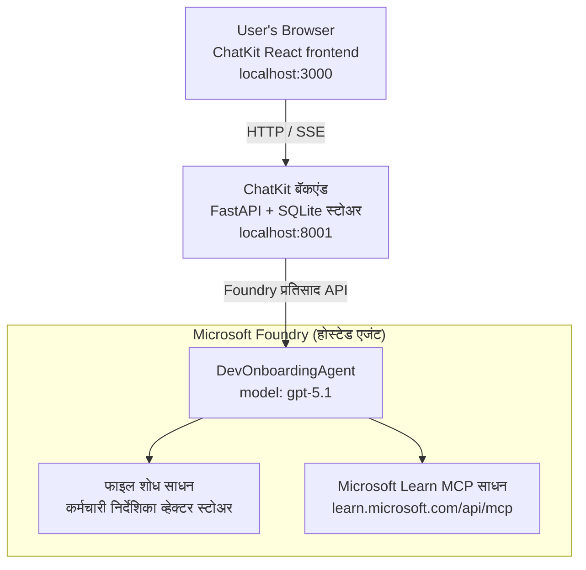

# धडा ४: Microsoft Foundry होस्ट केलेल्या एजंट्ससह एजंट तैनात करणे + ChatKit

हा धडा Microsoft Foundry वर एक टूल-उपयोग करणारा एजंट होस्टेड एजंट म्हणून कसा तैनात करायचा आणि त्याच्याशी संवाद साधण्यासाठी ChatKit-आधारित फ्रंटएंड कसा तयार करायचा हे दर्शवितो.

## आर्किटेक्चर

होस्ट केलेला एजंट हा **एकल `DevOnboardingAgent`** आहे (`gpt-5.1` वर चालतो) जो दोन होस्टेड टूल्स वापरून विकसक-ऑनबोर्डिंग प्रश्नांची उत्तरे देतो: कर्मचारी-निर्देशिका व्हेक्टर स्टोअरवरील **फाईल शोध** टूल आणि **Microsoft Learn MCP** टूल. ChatKit React फ्रंटएंड FastAPI बॅकएंडशी बोलतो, जो Foundry मधील **Responses API** द्वारे एजंटला कॉल करतो.



## पूर्वआवश्यकता

1. नॉर्थ सेंट्रल यूएस प्रदेशातील **Microsoft Foundry प्रोजेक्ट**
2. प्रमाणित केलेले **Azure CLI** (`az login`)
3. स्थापित केलेले **Azure Developer CLI** (`azd`)
4. **Python 3.12+** आणि **Node.js 18+**
5. कर्मचारी डेटासह तयार केलेले **व्हेक्टर स्टोअर**

## जलद प्रारंभ

### 1. पर्यावरण बदलने सेट करा

```bash
cd lesson-4-agentdeployment
cp .env.example .env
# आपला Microsoft Foundry प्रकल्प तपशीलांसह .env संपादित करा
```

### 2. होस्टेड एजंट तैनात करा

**पर्याय अ: Azure Developer CLI वापरून (शिफारस केलेले)**

```bash
cd hosted-agent
azd auth login
azd agent deploy
```

**पर्याय ब: Docker + Azure कंटेनर रजिस्ट्ररी वापरून**

```bash
cd hosted-agent

# कंटेनर तयार करा
docker build -t developer-onboarding-agent:latest .

# ACR साठी टॅग
docker tag developer-onboarding-agent:latest <your-acr>.azurecr.io/developer-onboarding-agent:latest

# ACR मध्ये ढकलणे
az acr login --name <your-acr>
docker push <your-acr>.azurecr.io/developer-onboarding-agent:latest

# Microsoft Foundry पोर्टल किंवा SDK द्वारे तैनात करा
```

### 3. ChatKit बॅकएंड सुरू करा

```bash
cd chatkit-server
python -m venv .venv
source .venv/bin/activate  # विंडोजवर: .venv\Scripts\activate
pip install -r requirements.txt
python app.py
```

सर्व्हर `http://localhost:8001` वर सुरू होईल

### 4. ChatKit फ्रंटएंड सुरू करा

```bash
cd chatkit-server/frontend
npm install
npm run dev
```

फ्रंटएंड `http://localhost:3000` वर सुरू होईल

### 5. अनुप्रयोग चाचणी करा

`http://localhost:3000` तुमच्या ब्राउझरमध्ये उघडा आणि हे प्रश्न विचारून पाहा:

**कर्मचारी शोध:**
- "मी इथे नवीन आहे! Microsoft मध्ये कोण काम करतो का?"
- "Azure Functions मध्ये कोणाला अनुभव आहे?"

**शिक्षण संसाधने:**
- "Kubernetes साठी एक शिक्षण मार्ग तयार करा"
- "क्लाउड आर्किटेक्चर साठी कोणती प्रमाणपत्रे घ्यावीत?"

**कोडिंग मदत:**
- "CosmosDB शी कनेक्ट होण्यासाठी Python कोड लिहायला मदत करा"
- "Azure Function कसे तयार करावे ते दाखवा"

**मल्टि-एजंट प्रश्न:**
- "मी क्लाउड इंजिनिअर म्हणून सुरुवात करत आहे. मला कोणाशी संपर्क साधायचा आणि काय शिकायला हवे?"

## प्रोजेक्ट संरचना

```
lesson-4-agentdeployment/
├── .env.example                 # Environment variables template
├── implementation-plan.md       # Detailed implementation guide
├── README.md                    # This file
├── hosted-agent/               # Microsoft Foundry hosted agent
│   ├── main.py                 # Multi-agent workflow implementation
│   ├── requirements.txt        # Python dependencies
│   ├── Dockerfile              # Container definition
│   └── agent.yaml              # Agent deployment configuration
└── chatkit-server/             # ChatKit server application
    ├── app.py                  # FastAPI backend
    ├── store.py                # SQLite persistence layer
    ├── requirements.txt        # Python dependencies
    └── frontend/               # React frontend
        ├── package.json
        ├── vite.config.ts
        ├── tsconfig.json
        ├── index.html
        └── src/
            ├── main.tsx
            ├── App.tsx
            ├── App.css
            └── index.css
```

## एजंट आणि त्याची टूल्स

होस्ट केलेला एजंट ही एक **एकल एजंट** आहे (`DevOnboardingAgent`, `hosted-agent/main.py` मध्ये परिभाषित) जो तीन ऑनबोर्डिंग क्षेत्रे हाताळतो. वेगळ्या उप-एजंट्सचे समन्वय करण्याऐवजी, तो प्रत्येक क्षमता एका टूल म्हणून उलगडतो (किंवा थेट मॉडेलवर अवलंबून असतो):

| क्षमता | ती कशी हाताळली जाते | टूल |
|-----------|------------------|------|
| **कर्मचारी शोध आणि संपर्क** | कर्मचारी-निर्देशिका व्हेक्टर स्टोअरवर Foundry होस्ट केलेला फाईल शोध | `client.get_file_search_tool(vector_store_ids=[...])` |
| **शिक्षण आणि प्रशिक्षण** | Microsoft Learn MCP सर्व्हर (होस्टेड MCP टूल) | `client.get_mcp_tool(url="https://learn.microsoft.com/api/mcp")` |
| **कोडिंग सहाय्य** | `gpt-5.1` मॉडेलद्वारे थेट हाताळले जाते — बाह्य टूल नाही | — |

एजंट `client.as_agent(name="DevOnboardingAgent", instructions=..., tools=[file_search_tool, learn_mcp_tool])` वापरून तयार केला जातो आणि `from_agent_framework(agent).run()` ने सर्व्ह केला जातो.

> **डिझाइन नोट:** या धड्याच्या आधीच्या मसुद्यांमध्ये `HandoffBuilder` मल्टि-एजंट वर्कफ्लो वापरला होता (त्रियाज → विशेषज्ञ). वितरित एजंट एकच टूल वापरणारा एजंट आहे, जो अधिक सोपा आहे तैनात करण्यासाठी आणि ऑनबोर्डिंग शैली प्रश्नोत्तरे सोडवण्यासाठी. मल्टि-एजंट समन्वय आणि हँडऑफचे उदाहरण पाहण्यासाठी, धडा २ आणि धडा ३ पहा.

## होस्ट केलेल्या एजंटचा स्मोक चाचणी करणे (CI गेट)

होस्ट केल्या गेलेल्या एजंटचे "यशस्वी" तैनात होणे म्हणजे नियंत्रण विमानाने परिभाषा स्वीकारली आहे
— हे **पुरावे नाही** की एजंट खरोखर उत्तरे देतो. गायब अवलंबित्व,
खराब मॉडेल राऊटिंग, किंवा कालबाह्य झालेला कनेक्शन ही एक हिरव्या पण मूक एजंट ठेवू शकते.

हा धडा एक हलका **स्मोक चाचणी** समाविष्ट करतो जो जलद, स्वस्त पोस्ट-तैनात
गेट म्हणून कार्य करतो. तो [AI स्मोक टेस्ट](https://github.com/marketplace/actions/ai-smoke-test)
GitHub Action वापरून एजंटच्या Foundry **Responses** एंडपॉइंटला POST प्रॉम्प्ट्स पाठवतो
(`POST {project_endpoint}/agents/{agent_name}/endpoint/protocols/openai/responses`)
आणि परत आलेल्या मजकुरावर तपासणी करतो. तो तुटलेली तैनाती, प्रमाणीकरणातील पुनरावृत्ती,
सिस्टम-प्रॉम्प्ट विस्थापन, आणि थ्रेडिंग ब्रेकच्या काही सेकंदात शोधून काढतो.

> स्मोक टेस्ट हे [धडा ३](../lesson-3-agent-evals/README.md) मध्ये झालेल्या
> संपूर्ण मूल्यांकनाचे रिप्लेसमेंट **नाही** तर एक पूर्ण आहे. स्मोक टेस्ट
> हा प्रश्नांसाठी *"एजंट पोहोचण्याजोगा आहे का, उत्तर देतो का, आणि मूलभूत प्रॉम्प्ट अपेक्षा पूर्ण करतो का?"*;
> मूल्यांकन हा प्रश्न विचारतो *"उत्तर किती चांगले आहे?"*. प्रत्येक तैनातीवर हा स्वस्त गेट चालवा.

### काय चाचणी घेतली जाते

सूची [`hosted-agent/tests/smoke-tests.json`](../../../lesson-4-agentdeployment/hosted-agent/tests/smoke-tests.json)
मध्ये आहे आणि एजंटच्या तीन क्षेत्रांसहीत प्रॉम्प्ट पालन आणि मल्टि-टर्न थ्रेडिंगसाठी चाचणी करतो:

| चाचणी | ती काय पडताळते |
|------|------------------|
| `reachability` | एजंटकडून रिक्त नसलेले, स्कोप विरुद्ध असलेले प्रतिसाद येणे |
| `employee-search` | फाईल-शोध क्षेत्र एक योग्य `200` प्रतिसाद देते (उत्तर डेटा-आधारित आहे) |
| `learning-path` | शिक्षण क्षेत्र विषयाची पुनरावृत्ती करते आणि मार्ग शैलीचे उत्तर तयार करते |
| `coding-assistance` | कोडिंग क्षेत्र Python फॉर्मेटमध्ये उत्तर देते |
| `prompt-adherence-offtopic` | ऑफ-टॉपिक विनंती पुनर्निर्देशित केली जाते, तपशीलवार उत्तर नाही |
| `threading-turn-1/2` | संभाषण स्थिती `previous_response_id` च्या माध्यमातून टर्न्समध्ये राखली जाते |

### CI मध्ये चालवा

कार्यप्रवाह [`.github/workflows/smoke-test-hosted-agent.yml`](../../../.github/workflows/smoke-test-hosted-agent.yml)
मध्ये दोन कामे आहेत:

- **`static`** — जलद, कोणतेही Azure न वापरता गेट जे प्रत्येक पुल विनंती आणि पुशवर चालते:
  ते सर्व Python स्रोतांचे संकलन करते (`py_compile`) आणि Markdown लिंक तपासते. गुपितांची गरज नाही,
  म्हणून ते फॉर्क PRs वर काम करते.
- **`smoke`** — खालच्या Azure-संपर्कित स्मोक टेस्ट. हे डिमांडवर चालते
  (Actions → **Agent CI (static + smoke)** → Run workflow) आणि तुमच्या
  तैनाती वर्कफ्लो नंतर साखळी रित्या चालू शकते.

स्मोक जॉबसाठी या रेपॉजिटरीच्या **चर** आणि **गुपिते** कॉन्फिगर करा:

| प्रकार | नाव | मूल्य |
|------|------|-------|

| Variable | `FOUNDRY_PROJECT_ENDPOINT` | `https://<account>.services.ai.azure.com/api/projects/<project>` |
| Variable | `HOSTED_AGENT_NAME` | तैनात केलेल्या एजंटचे नाव (उदा. `dev-onboarding` — तुमच्या तैनातीशी जुळले पाहिजे) |
| Secret | `AZURE_CLIENT_ID` / `AZURE_TENANT_ID` / `AZURE_SUBSCRIPTION_ID` | `azure/login` साठी OIDC फेडरेटेड आयडेंटिटी |

रनर आयडेंटिटीला **Foundry प्रकल्प स्कोप** वर **`Azure AI User`** भूमिका आवश्यक आहे जेणेकरून तो
Responses (आणि संभाषणे) डेटा-प्लेन एन्डपॉइंट्स कॉल करू शकेल. त्याला हे अधिकार द्या:

```bash
az role assignment create \
  --assignee <object-id-or-appId-of-runner-identity> \
  --role "Azure AI User" \
  --scope "/subscriptions/<sub>/resourceGroups/<rg>/providers/Microsoft.CognitiveServices/accounts/<account>/projects/<project>"
```

### स्थानिकपणे चालवा

तुम्ही धक्का देण्यापूर्वीच तोच कॅटलॉग चालवू शकता. `https://ai.azure.com/` या स्कोपसह डेटा-प्लेन टोकन मिळवा आणि तुमच्या तैनातीकडे रनर निर्देशित करा:


```bash
# प्रेक्षक असावा https://ai.azure.com/ (cognitiveservices.azure.com टोकन्स नाकारले जातात)
export FOUNDRY_TOKEN=$(az account get-access-token --resource https://ai.azure.com/ --query accessToken -o tsv)

git clone https://github.com/JFolberth/ai-smoketest && cd ai-smoketest
python runner.py \
  --project-endpoint "https://<account>.services.ai.azure.com/api/projects/<project>" \
  --agent-name dev-onboarding \
  --tests-file ../lesson-4-agentdeployment/hosted-agent/tests/smoke-tests.json
```

बाहेर पडण्याचे कोड्स: `0` सर्व उत्तीर्ण, `1` एक दावापत्र अयशस्वी, `2` रनर त्रुटी (वाईट कॅटलॉग / टोकन).

## अडचणी सोडवणे

### एजंट प्रतिसाद करत नाही
- Microsoft Foundry मध्ये होस्टेड एजंट तैनात आणि चालू आहे हे तपासा
- `HOSTED_AGENT_NAME` आणि `HOSTED_AGENT_VERSION` तुमच्या तैनातीशी जुळत असल्याची पडताळणी करा

### व्हेक्टर स्टोर त्रुटी
- `VECTOR_STORE_ID` योग्यरित्या सेट केलेले आहे याची खात्री करा
- व्हेक्टर स्टोरमध्ये कर्मचारी डेटा आहे का ते तपासा

### प्रमाणीकरण त्रुटी
- क्रेडेन्शियल्स ताजेतवाने करण्यासाठी `az login` चालवा
- Microsoft Foundry प्रकल्पात तुमचे प्रवेश अधिकारी आहे याची खात्री करा

## संसाधने

- [Microsoft Foundry Hosted Agents Documentation](https://learn.microsoft.com/en-us/azure/ai-foundry/agents/concepts/hosted-agents)
- [Microsoft Agent Framework](https://github.com/microsoft/agent-framework)
- [ChatKit Integration Sample](https://github.com/microsoft/agent-framework/tree/main/python/samples/demos/chatkit-integration)
- [Azure Developer CLI](https://learn.microsoft.com/en-us/azure/developer/azure-developer-cli/overview)
- [AI Smoke Test GitHub Action](https://github.com/marketplace/actions/ai-smoke-test)
- [Smoke Test Microsoft Foundry Agents with GitHub Actions (blog)](https://techcommunity.microsoft.com/blog/azuredevcommunityblog/smoke-test-microsoft-foundry-agents-with-github-actions/4531912)

---

## पुढील पावले

तुमचा एजंट मायक्रोसॉफ्ट-व्यवस्थापित पायाभूत सुविधा वर चालतो. त्याला एंटरप्राइझ प्रॉडक्शनकडे नेण्यासाठी —
जिथे त्याचा डेटा राहतो (डेटा स्वायत्तता, खाजगी नेटवर्किंग, स्वतःचा Azure Cosmos DB / स्टोरेज / AI सर्च घेणे) आणि त्याच्या उपकरणांचे नियंत्रण करणे — पुढे चला

**[Lesson 5: Production Hosted Agents](../lesson-5-hosted-agents-production/README.md)**, जे
**होस्टेड एजंट्स** आणि **क्षमता होस्ट्स** यांच्यातील महत्त्वपूर्ण फरक स्पष्ट करते.

---

<!-- CO-OP TRANSLATOR DISCLAIMER START -->
**अस्वीकरण**:
हा दस्तऐवज AI भाषांतर सेवा [Co-op Translator](https://github.com/Azure/co-op-translator) चा वापर करून अनुवादित केला आहे. जरी आम्ही अचूकतेसाठी प्रयत्न करतो, तरी कृपया लक्षात घ्या की स्वयंचलित भाषांतरांमध्ये त्रुटी किंवा अचूकतेची कमतरता असू शकते. मूळ दस्तऐवज त्याच्या मूळ भाषेत अधिकृत स्रोत मानला पाहिजे. महत्त्वाची माहिती असल्यास, व्यावसायिक मानवी भाषांतराची शिफारस केली जाते. या भाषांतराच्या वापरामुळे उद्भवणाऱ्या कोणत्याही गैरसमज किंवा चुकीच्या अर्थलावणीसाठी आम्ही जबाबदार नाही.
<!-- CO-OP TRANSLATOR DISCLAIMER END -->