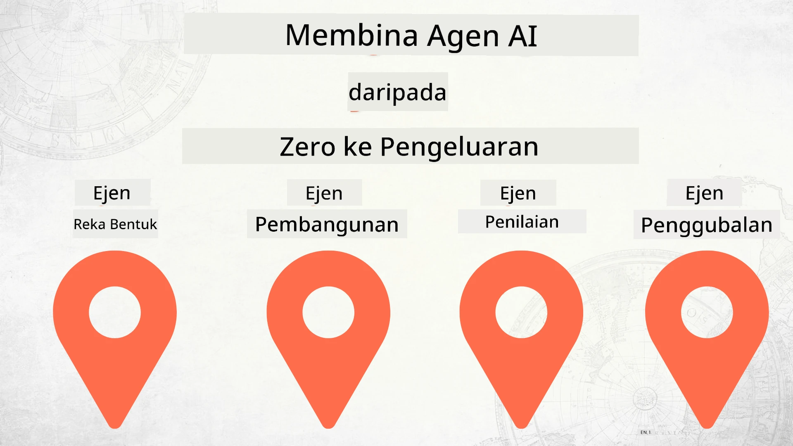

# Membina Ejen AI dari Kosong ke Pengeluaran



### 🌐 Sokongan Pelbagai Bahasa

#### Disokong melalui GitHub Action (Automatik & Sentiasa Dikemas Kini)

<!-- CO-OP TRANSLATOR LANGUAGES TABLE START -->
[Arabic](../ar/README.md) | [Bengali](../bn/README.md) | [Bulgarian](../bg/README.md) | [Burmese (Myanmar)](../my/README.md) | [Chinese (Simplified)](../zh-CN/README.md) | [Chinese (Traditional, Hong Kong)](../zh-HK/README.md) | [Chinese (Traditional, Macau)](../zh-MO/README.md) | [Chinese (Traditional, Taiwan)](../zh-TW/README.md) | [Croatian](../hr/README.md) | [Czech](../cs/README.md) | [Danish](../da/README.md) | [Dutch](../nl/README.md) | [Estonian](../et/README.md) | [Finnish](../fi/README.md) | [French](../fr/README.md) | [German](../de/README.md) | [Greek](../el/README.md) | [Hebrew](../he/README.md) | [Hindi](../hi/README.md) | [Hungarian](../hu/README.md) | [Indonesian](../id/README.md) | [Italian](../it/README.md) | [Japanese](../ja/README.md) | [Kannada](../kn/README.md) | [Korean](../ko/README.md) | [Lithuanian](../lt/README.md) | [Malay](./README.md) | [Malayalam](../ml/README.md) | [Marathi](../mr/README.md) | [Nepali](../ne/README.md) | [Nigerian Pidgin](../pcm/README.md) | [Norwegian](../no/README.md) | [Persian (Farsi)](../fa/README.md) | [Polish](../pl/README.md) | [Portuguese (Brazil)](../pt-BR/README.md) | [Portuguese (Portugal)](../pt-PT/README.md) | [Punjabi (Gurmukhi)](../pa/README.md) | [Romanian](../ro/README.md) | [Russian](../ru/README.md) | [Serbian (Cyrillic)](../sr/README.md) | [Slovak](../sk/README.md) | [Slovenian](../sl/README.md) | [Spanish](../es/README.md) | [Swahili](../sw/README.md) | [Swedish](../sv/README.md) | [Tagalog (Filipino)](../tl/README.md) | [Tamil](../ta/README.md) | [Telugu](../te/README.md) | [Thai](../th/README.md) | [Turkish](../tr/README.md) | [Ukrainian](../uk/README.md) | [Urdu](../ur/README.md) | [Vietnamese](../vi/README.md)

> **Lebih suka Klon Secara Tempatan?**
>
> Repositori ini merangkumi lebih 50 terjemahan bahasa yang secara signifikan meningkatkan saiz muat turun. Untuk klon tanpa terjemahan, gunakan sparse checkout:
>
> **Bash / macOS / Linux:**
> ```bash
> git clone --filter=blob:none --sparse https://github.com/microsoft/Building-AI-Agents-From-Zero-To-Production.git
> cd Building-AI-Agents-From-Zero-To-Production
> git sparse-checkout set --no-cone '/*' '!translations' '!translated_images'
> ```
>
> **CMD (Windows):**
> ```cmd
> git clone --filter=blob:none --sparse https://github.com/microsoft/Building-AI-Agents-From-Zero-To-Production.git
> cd Building-AI-Agents-From-Zero-To-Production
> git sparse-checkout set --no-cone "/*" "!translations" "!translated_images"
> ```
>
> Ini memberikan anda segala yang anda perlukan untuk menyelesaikan kursus dengan muat turun yang jauh lebih pantas.
<!-- CO-OP TRANSLATOR LANGUAGES TABLE END -->

## Kursus yang mengajar asas-asas Kitaran Hayat Pembangunan Ejen AI

[](https://github.com/microsoft/Building-AI-Agents-From-Zero-To-Production/blob/master/LICENSE?WT.mc_id=academic-105485-koreyst)
[](https://GitHub.com/microsoft/Building-AI-Agents-From-Zero-To-Production/graphs/contributors/?WT.mc_id=academic-105485-koreyst)
[](https://GitHub.com/microsoft/Building-AI-Agents-From-Zero-To-Production/issues/?WT.mc_id=academic-105485-koreyst)
[](https://GitHub.com/microsoft/Building-AI-Agents-From-Zero-To-Production/pulls/?WT.mc_id=academic-105485-koreyst)
[](http://makeapullrequest.com?WT.mc_id=academic-105485-koreyst)

[](https://discord.gg/Kuaw3ktsu6)

## 🌱 Mula

Kursus ini mempunyai pelajaran yang merangkumi asas-asas membina dan menerapkan Ejen AI.

Setiap pelajaran dibina berdasarkan pelajaran sebelumnya, jadi kami mengesyorkan bermula dari awal dan teruskan hingga tamat.

Jika anda ingin meneroka lebih banyak tentang topik Ejen AI, anda boleh melihat [Kursus Ejen AI untuk Pemula](https://aka.ms/ai-agents-beginners).

### Berjumpa Dengan Pelajar Lain, Dapatkan Jawapan Untuk Soalan Anda

Jika anda tersekat atau mempunyai sebarang soalan tentang membina Ejen AI, sertai Saluran Discord khusus kami dalam [Microsoft Foundry Discord](https://discord.gg/Kuaw3ktsu6).

### Apa Yang Anda Perlukan

Setiap Pelajaran mempunyai contoh kodnya sendiri yang boleh anda jalankan secara tempatan. Anda boleh [fork repositori ini](https://github.com/microsoft/Building-AI-Agents-From-Zero-To-Production/fork) untuk mencipta salinan anda sendiri.

Kursus ini kini menggunakan yang berikut:

- [Microsoft Agent Framework (MAF)](https://aka.ms/ai-agents-beginners/agent-framework)
- [Microsoft Foundry](https://azure.microsoft.com/products/ai-foundry)
- [Azure OpenAI Service](https://azure.microsoft.com/products/ai-foundry/models/openai)
- [Azure CLI](https://learn.microsoft.com/cli/azure/authenticate-azure-cli?view=azure-cli-latest)

Sila pastikan anda mempunyai akses kepada perkhidmatan ini sebelum memulakan.

Pilihan lebih lanjut berkaitan hosting model dan perkhidmatan akan datang tidak lama lagi.

## 🗃️ Pelajaran

| **Pelajaran**         | **Penerangan**                                                                                  |
|--------------------|--------------------------------------------------------------------------------------------------|
| [Reka Bentuk Ejen](./lesson-1-agent-design/README.md)       | Pengenalan kepada Kes Penggunaan Ejen "Onboarding Pembangun" kami dan cara mereka bentuk ejen yang berkesan  |
| [Pembangunan Ejen](./lesson-2-agent-development/README.md)  | Menggunakan Microsoft Agent Framework (MAF), cipta 3 ejen untuk membantu pembangun baru onboarding.       |
| [Penilaian Ejen](./lesson-3-agent-evals/README.md)  | Menggunakan Microsoft Foundry, ketahui sejauh mana prestasi Ejen AI kami dan cara meningkatkannya. |
| [Pengeluaran Ejen](./lesson-4-agent-deployment/README.md)   | Menggunakan Hosted Agents dan OpenAI Chatkit, lihat cara mengeluarkan Ejen AI ke dalam pengeluaran.       |


## 🎒 Kursus Lain

Pasukan kami menghasilkan kursus lain! Lihat:

<!-- CO-OP TRANSLATOR OTHER COURSES START -->
### LangChain
[](https://aka.ms/langchain4j-for-beginners)
[](https://aka.ms/langchainjs-for-beginners?WT.mc_id=m365-94501-dwahlin)
[](https://github.com/microsoft/langchain-for-beginners?WT.mc_id=m365-94501-dwahlin)
---

### Azure / Edge / MCP / Agen
[](https://github.com/microsoft/AZD-for-beginners?WT.mc_id=academic-105485-koreyst)
[](https://github.com/microsoft/edgeai-for-beginners?WT.mc_id=academic-105485-koreyst)
[](https://github.com/microsoft/mcp-for-beginners?WT.mc_id=academic-105485-koreyst)
[](https://github.com/microsoft/ai-agents-for-beginners?WT.mc_id=academic-105485-koreyst)

---
 
### Siri AI Generatif
[](https://github.com/microsoft/generative-ai-for-beginners?WT.mc_id=academic-105485-koreyst)
[-9333EA?style=for-the-badge&labelColor=E5E7EB&color=9333EA)](https://github.com/microsoft/Generative-AI-for-beginners-dotnet?WT.mc_id=academic-105485-koreyst)
[-C084FC?style=for-the-badge&labelColor=E5E7EB&color=C084FC)](https://github.com/microsoft/generative-ai-for-beginners-java?WT.mc_id=academic-105485-koreyst)
[-E879F9?style=for-the-badge&labelColor=E5E7EB&color=E879F9)](https://github.com/microsoft/generative-ai-with-javascript?WT.mc_id=academic-105485-koreyst)

---
 
### Pembelajaran Teras
[](https://aka.ms/ml-beginners?WT.mc_id=academic-105485-koreyst)
[](https://aka.ms/datascience-beginners?WT.mc_id=academic-105485-koreyst)
[](https://aka.ms/ai-beginners?WT.mc_id=academic-105485-koreyst)
[](https://github.com/microsoft/Security-101?WT.mc_id=academic-96948-sayoung)
[](https://aka.ms/webdev-beginners?WT.mc_id=academic-105485-koreyst)
[](https://aka.ms/iot-beginners?WT.mc_id=academic-105485-koreyst)
[](https://github.com/microsoft/xr-development-for-beginners?WT.mc_id=academic-105485-koreyst)

---
 
### Siri Copilot
[](https://aka.ms/GitHubCopilotAI?WT.mc_id=academic-105485-koreyst)
[](https://github.com/microsoft/mastering-github-copilot-for-dotnet-csharp-developers?WT.mc_id=academic-105485-koreyst)
[](https://github.com/microsoft/CopilotAdventures?WT.mc_id=academic-105485-koreyst)
<!-- CO-OP TRANSLATOR OTHER COURSES END -->

## Menyumbang

Projek ini mengalu-alukan sumbangan dan cadangan. Kebanyakan sumbangan menghendaki anda bersetuju dengan
Perjanjian Lesen Penyumbang (CLA) yang menyatakan bahawa anda mempunyai hak untuk, dan benar-benar,
memberi kami hak untuk menggunakan sumbangan anda. Untuk maklumat lanjut, lawati <https://cla.opensource.microsoft.com>.

Apabila anda menghantar pull request, bot CLA akan secara automatik menentukan sama ada anda perlu menyediakan
CLA dan menghias PR sesuai (contohnya, pemeriksaan status, komen). Cukup ikut arahan
yang diberikan oleh bot. Anda hanya perlu melakukannya sekali sahaja di semua repositori yang menggunakan CLA kami.

Projek ini telah mengamalkan [Microsoft Open Source Code of Conduct](https://opensource.microsoft.com/codeofconduct/).
Untuk maklumat lanjut, lihat [Soalan Lazim Kod Etika](https://opensource.microsoft.com/codeofconduct/faq/) atau
hubungi [opencode@microsoft.com](mailto:opencode@microsoft.com) untuk sebarang soalan atau komen tambahan.

## Tanda Dagangan

Projek ini mungkin mengandungi tanda dagangan atau logo untuk projek, produk, atau perkhidmatan. Penggunaan sah
tanda dagangan atau logo Microsoft tertakluk kepada dan mesti mengikut
[Garispanduan Tanda Dagangan & Jenama Microsoft](https://www.microsoft.com/legal/intellectualproperty/trademarks/usage/general).
Penggunaan tanda dagangan atau logo Microsoft dalam versi projek yang diubah suai tidak boleh menyebabkan kekeliruan atau memberi maksud tajaan Microsoft.
Sebarang penggunaan tanda dagangan atau logo pihak ketiga tertakluk kepada polisi pihak ketiga tersebut.

## Mendapatkan Bantuan

Jika anda tersekat atau mempunyai sebarang soalan tentang membina aplikasi AI, sertai:

[](https://discord.gg/Kuaw3ktsu6)

Jika anda mempunyai maklum balas produk atau ralat semasa membina lawati:

[](https://aka.ms/foundry/forum)

---

<!-- CO-OP TRANSLATOR DISCLAIMER START -->
**Penafian**:
Dokumen ini telah diterjemahkan menggunakan perkhidmatan terjemahan AI [Co-op Translator](https://github.com/Azure/co-op-translator). Walaupun kami berusaha untuk ketepatan, sila ambil maklum bahawa terjemahan automatik mungkin mengandungi ralat atau ketidaktepatan. Dokumen asal dalam bahasa asalnya harus dianggap sebagai sumber yang sahih. Untuk maklumat penting, terjemahan profesional oleh manusia adalah disyorkan. Kami tidak bertanggungjawab atas sebarang salah faham atau salah tafsir yang timbul daripada penggunaan terjemahan ini.
<!-- CO-OP TRANSLATOR DISCLAIMER END -->