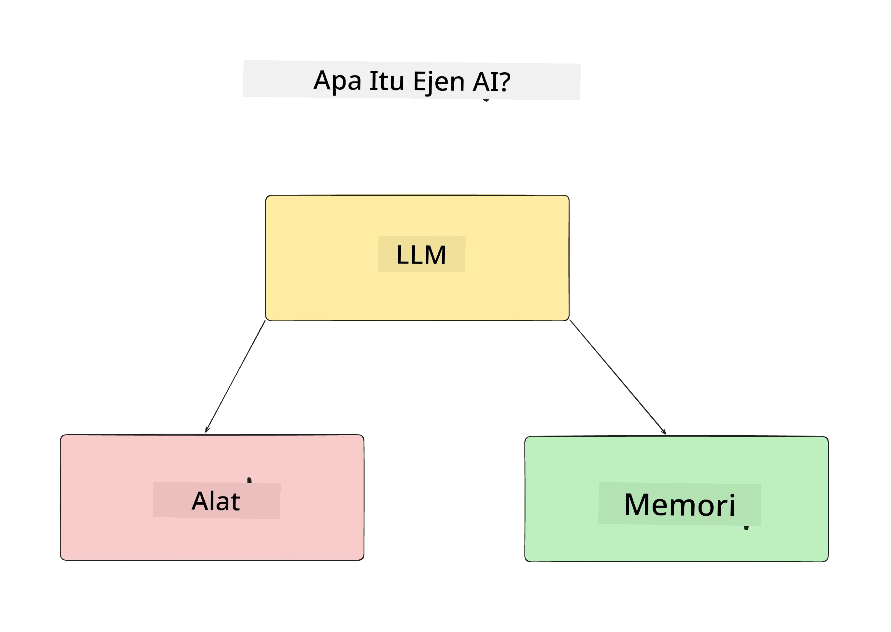
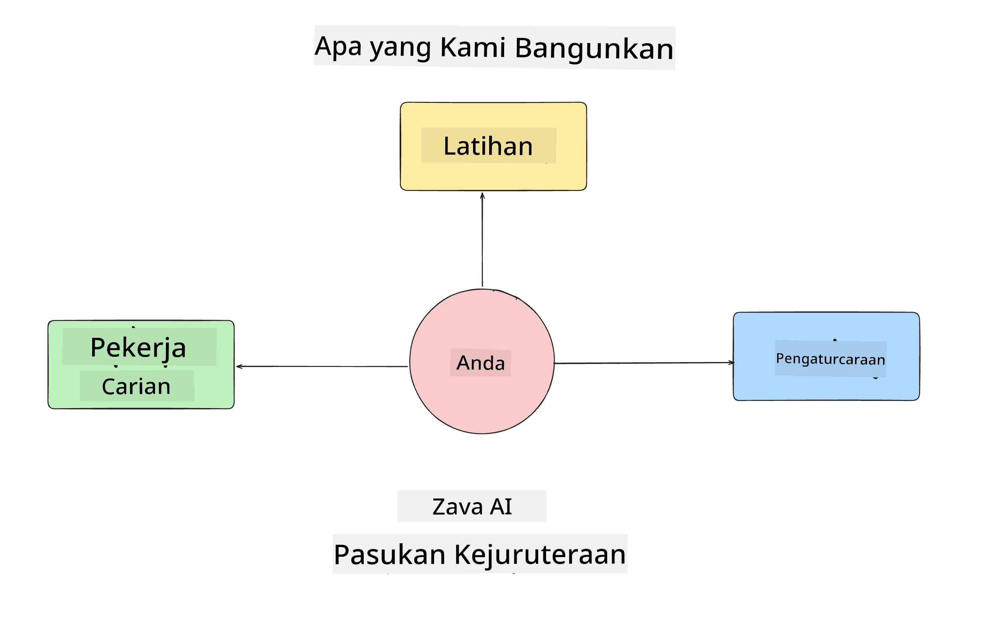
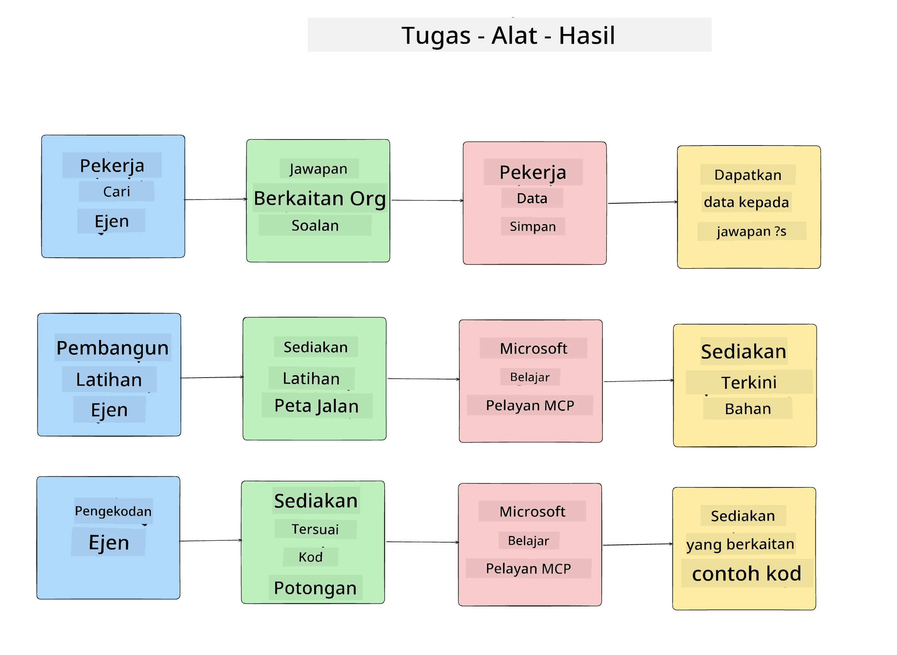
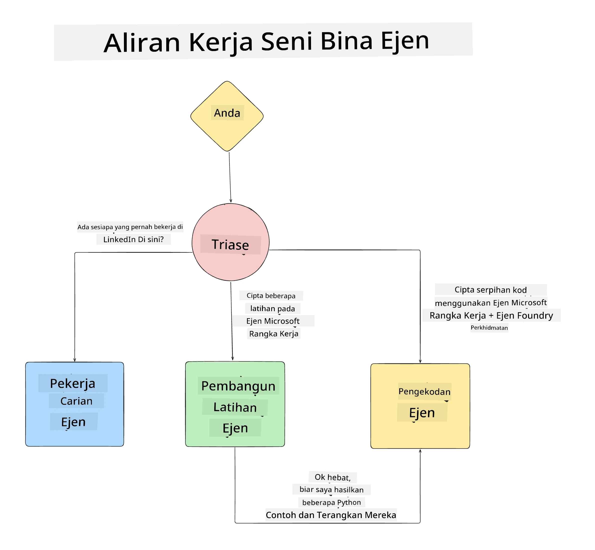

# Pelajaran 1: Reka Bentuk Ejen AI

Selamat datang ke pelajaran pertama "Kursus Membangun Ejen AI dari Zero ke Pengeluaran"!

Dalam pelajaran ini kita akan membincangkan:

- Mendefinisikan apa itu Ejen AI
  
- Membincangkan Aplikasi Ejen AI yang kita bina  

- Mengenal pasti alat dan perkhidmatan yang diperlukan untuk setiap ejen
  
- Merekabentuk Aplikasi Ejen kita
  
Mari kita mulakan dengan mendefinisikan apa itu ejen dan mengapa kita menggunakannya di dalam aplikasi.

> **Sebelum anda memulakan kursus.** Pelajaran pertama ini adalah konsep — tiada kod untuk dijalankan.
> Dari [Pelajaran 2](../lesson-2-agent-development/README.md) dan seterusnya anda akan memerlukan: **langganan Azure**
> dengan akses kepada **Microsoft Foundry**, model **GPT-5 siri** yang telah dikerahkan (contoh `gpt-5.1` — elakkan GPT-4o / GPT-4.1 yang telah ditamatkan),
> **Python 3.12+**, dan **Azure CLI** (`az login`). Lihat [Apa Yang Anda Perlukan](../README.md#what-you-need) dalam README kursus untuk senarai penuh dan pautan.

## Apa Itu Ejen AI?

Jika ini kali pertama anda menerokai cara membina Ejen AI, anda mungkin mempunyai soalan tentang cara yang tepat untuk mendefinisikan apa itu Ejen AI.

Cara mudah untuk mendefinisikan apa itu Ejen AI adalah melalui komponen yang membinanya:

**Model Bahasa Besar** - LLM akan menggerakkan kedua-dua kebolehan untuk memproses bahasa semula jadi daripada pengguna untuk mentafsirkan tugas yang mereka ingin selesaikan serta mentafsirkan penerangan tentang alat yang ada untuk menyelesaikan tugas tersebut.

**Alat** - Ini akan menjadi fungsi, API, stor data dan perkhidmatan lain yang LLM boleh pilih untuk digunakan bagi menyelesaikan tugas yang diminta oleh pengguna.

**Memori** - Ini adalah bagaimana kita menyimpan interaksi jangka pendek dan jangka panjang antara Ejen AI dan pengguna. Menyimpan dan mendapatkan kembali maklumat ini penting untuk membuat penambahbaikan dan menyimpan keutamaan pengguna dari masa ke masa.

## Kes Penggunaan Ejen AI Kami

Untuk kursus ini, kita akan membina aplikasi Ejen AI yang membantu pemaju baru untuk menyertai Pasukan Pembangunan Ejen AI kami!

Sebelum kita melakukan kerja pembangunan, langkah pertama untuk mencipta aplikasi Ejen AI yang berjaya adalah dengan mendefinisikan senario yang jelas tentang bagaimana kita menjangkakan pengguna bekerjasama dengan Ejen AI kita.

Untuk aplikasi ini, kita akan bekerja dengan senario berikut:

**Senario 1**: Seorang pekerja baru menyertai organisasi kami dan ingin tahu lebih lanjut tentang pasukan yang mereka sertai serta cara untuk berhubung dengan mereka.

**Senario 2:** Seorang pekerja baru ingin tahu apa tugasan pertama terbaik untuk mereka mula bekerja.

**Senario 3:** Seorang pekerja baru ingin mengumpul sumber pembelajaran dan contoh kod untuk membantu mereka memulakan penyelesaian tugasan ini.

## Mengenal Pasti Alat dan Perkhidmatan

Kini bahawa kita telah mencipta senario ini, langkah seterusnya adalah untuk memetakan mereka kepada alat dan perkhidmatan yang ejen AI kita perlukan untuk menyelesaikan tugasan ini.

Proses ini jatuh di bawah kategori Kejuruteraan Konteks kerana kita akan memberi tumpuan untuk memastikan bahawa Ejen AI kita mempunyai konteks yang betul pada masa yang betul untuk menyelesaikan tugasan.

Mari lakukan ini satu persatu mengikut senario dan lakukan reka bentuk ejen yang baik dengan menyenaraikan setiap tugasan ejen, alat dan hasil yang dikehendaki.

### Senario 1 - Ejen Cari Pekerja

**Tugasan** - Menjawab soalan mengenai pekerja dalam organisasi seperti tarikh penyertaan, pasukan semasa, lokasi dan jawatan terakhir.

**Alat** - Pangkalan data senarai pekerja semasa dan carta organisasi

**Hasil** - Mampu mendapatkan maklumat dari pangkalan data untuk menjawab soalan umum organisasi dan soalan khusus tentang pekerja.

### Senario 2 - Ejen Cadangan Tugasan

**Tugasan** - Berdasarkan pengalaman pemaju pekerja baru, mencadangkan 1-3 isu yang boleh diselesaikan oleh pekerja baru tersebut.

**Alat** - Pelayan GitHub MCP untuk mendapatkan isu terbuka dan membina profil pemaju

**Hasil** - Mampu membaca 5 komit terakhir pada Profil GitHub dan isu terbuka pada projek GitHub dan membuat cadangan berdasarkan padanan

### Senario 3 - Ejen Pembantu Kod

**Tugasan** - Berdasarkan Isu Terbuka yang dicadangkan oleh "Ejen Cadangan Tugasan", membuat kajian dan menyediakan sumber serta menjana petikan kod untuk membantu pekerja.

**Alat** - Microsoft Learn MCP untuk mencari sumber dan Penafsir Kod untuk menjana petikan kod khusus.

**Hasil** - Jika pengguna meminta bantuan tambahan, aliran kerja harus menggunakan Pelayan Learn MCP untuk menyediakan pautan dan petikan kepada sumber dan kemudian menyerahkan kepada ejen Penafsir Kod untuk menjana petikan kod kecil dengan penjelasan.

## Merekabentuk Aplikasi Ejen Kita

Kini kita telah mentakrifkan setiap Ejen kita, mari kita cipta rajah seni bina yang akan membantu kita memahami bagaimana setiap ejen akan bekerja bersama dan secara berasingan bergantung pada tugasan:

## Langkah Seterusnya

Kini kita telah mereka bentuk setiap ejen dan sistem ejen kita, mari beralih ke pelajaran seterusnya di mana kita akan membangunkan setiap ejen ini!

---

<!-- CO-OP TRANSLATOR DISCLAIMER START -->
**Penafian**:
Dokumen ini telah diterjemahkan menggunakan perkhidmatan terjemahan AI [Co-op Translator](https://github.com/Azure/co-op-translator). Walaupun kami berusaha untuk ketepatan, sila ambil maklum bahawa terjemahan automatik mungkin mengandungi kesilapan atau ketidaktepatan. Dokumen asal dalam bahasa asalnya harus dianggap sebagai sumber yang sahih. Untuk maklumat penting, terjemahan oleh manusia profesional adalah disyorkan. Kami tidak bertanggungjawab terhadap sebarang salah faham atau salah tafsir yang timbul daripada penggunaan terjemahan ini.
<!-- CO-OP TRANSLATOR DISCLAIMER END -->