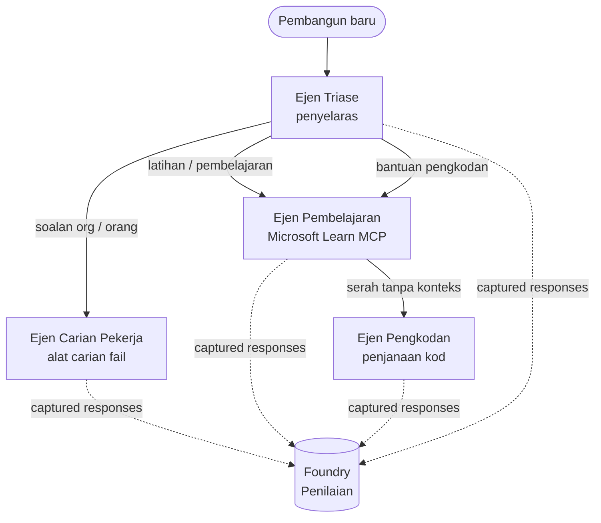

# Pelajaran 3: Penilaian Ejen dengan Microsoft Foundry

Selamat datang ke pelajaran ketiga kursus **"Membina Ejen AI dari Nol ke Pengeluaran"**!

Dalam [Pelajaran 2](../lesson-2-agent-development/README.md) anda membina ejen. Dalam pelajaran ini anda
akan belajar bagaimana untuk menjawab soalan yang lebih sukar: **adakah mereka bagus?** Menghantar ejen yang
berjalan adalah mudah; mengetahui sama ada ia menghala dengan betul, kekal berasaskan data anda, dan menggunakan
alatnya dengan betul adalah apa yang membezakan demo dari sistem pengeluaran.

Dalam pelajaran ini kita akan membincangkan:

- Mengapa penilaian ejen penting dan bagaimana ia berbeza daripada ujian tradisional
- Perbezaan antara **observability**, **ujian asap**, dan **penilaian**
- Aliran kerja multi-ejen yang akan kita ukur
- Penilai terbina dalam **Microsoft Foundry** (relevansi, berasaskan data, ketepatan panggilan alat, penggunaan output alat)
- Panduan langkah demi langkah saluran penilaian dalam [`agent-evals.py`](../../../lesson-3-agent-evals/agent-evals.py)
- Cara menjalankannya dan membaca keputusan

---

## Mengapa menilai ejen?

Ujian unit tradisional menegaskan bahawa `add(2, 2) == 4`. Ejen tidak berfungsi sedemikian — arahan yang sama
boleh menghasilkan ayat yang berbeza setiap kali, alat boleh dipanggil dalam susunan yang berbeza, dan
"betul" sering kali perkara tahap dan bukan boolean. Anda tidak boleh menegaskan pada rentetan tepat.

Sebaliknya, anda menilai ejen berdasarkan **dimensi kualiti** menggunakan *penilai* berasaskan model (juga
dipanggil "LLM-sebagai-hakim") ditambah pemeriksaan deterministik terhadap penggunaan alat. Ini memberitahu anda perkara seperti:

- Adakah jawapan benar-benar menjawab soalan? (**relevansi**)
- Adakah jawapan disokong oleh data yang diambil, atau adakah ejen berhalusinasi? (**berasaskan data**)
- Adakah ejen memanggil alat yang betul dengan argumen yang betul? (**ketepatan panggilan alat**)
- Adakah ejen benar-benar menggunakan apa yang dikembalikan oleh alat? (**penggunaan output alat**)

### Tiga lapisan kualiti yang melengkapi

Ini bukan teknik yang bersaing — ejen pengeluaran menggunakan ketiga-tiganya:

| Lapisan | Soalan yang dijawab | Kos | Bila ia dijalankan | Diliputi dalam |
|-------|--------------------|------|--------------|------------|
| **Observability / penjejakan** | *Apa yang ejen lakukan, langkah demi langkah?* | Percuma (sentiasa aktif) | Berterusan dalam pengeluaran | Pelajaran ini |
| **Ujian asap** | *Adakah ejen boleh dicapai dan mengikut arahan asasnya?* | Murah, beberapa saat | Setiap pelepasan | [Pelajaran 4](../lesson-4-agentdeployment/README.md#smoke-testing-the-hosted-agent-ci-gate) |
| **Penilaian** | *Sejauh mana **bagus** jawapan?* | Lebih perlahan, diukur model | Atas permintaan / malam / pra-lepasan | Pelajaran ini |

Ujian asap menjawab "adakah ia rosak?"; penilaian menjawab "adakah ia bagus?". Anda mahukan kedua-duanya.

---

## Prasyarat

1. Selesai [Pelajaran 2](../lesson-2-agent-development/README.md) (ejen + stor vektor).
2. Projek **Microsoft Foundry**.
3. **Azure CLI** diauthentikasi: `az login`.
4. **Python 3.12+** dan pergantungan kursus dipasang:

   ```bash
   pip install -r ../requirements.txt
   ```


5. Pembolehubah persekitaran (buat fail `.env` dalam folder ini atau eksport mereka):

   | Pembolehubah | Tujuan |
   |-------------|--------|
   | `FOUNDRY_PROJECT_ENDPOINT` | Titik akhir projek Foundry anda (`https://<account>.services.ai.azure.com/api/projects/<project>`). Dibaca oleh `FoundryChatClient` agen **dan** pembantu penilaian. |
   | `FOUNDRY_MODEL` | Penempatan model yang **agen** jalankan (contoh `gpt-5.1`). |
   | `VECTOR_STORE_ID` | Kedai vektor direktori pekerja yang dibuat dalam Pelajaran 2 |
   | `AZURE_AI_MODEL_DEPLOYMENT_NAME` | Penempatan model yang digunakan **oleh penilai** (secara lalai kepada `FOUNDRY_MODEL`, kemudian `gpt-5.1`) |

> Agen menggunakan `FoundryChatClient`, yang membaca konfigurasi dari pembolehubah yang mempunyai awalan `FOUNDRY_`
> (`FOUNDRY_PROJECT_ENDPOINT`, `FOUNDRY_MODEL`). Pembantu penilaian awan
> menggunakan SDK `azure-ai-projects` dan akan menggunakan `FOUNDRY_PROJECT_ENDPOINT` jika
> `AZURE_AI_PROJECT_ENDPOINT` tidak ditetapkan — jadi dua pembolehubah `FOUNDRY_` mencukupi untuk
> menjalankan keseluruhan pelajaran.
>
> Penilai pula dikuasakan oleh model, jadi `AZURE_AI_MODEL_DEPLOYMENT_NAME`
> mengawal penempatan mana yang melakukan penilaian — ia tidak mesti model yang sama yang digunakan oleh
> agen anda.

---

## Aliran kerja yang kita nilaikan

Untuk menilai sesuatu, anda perlu jalankannya dahulu. Pelajaran ini menggunakan semula aliran kerja **Penempatan Pembangun**
multi-agen: seorang penyelaras **triage** menyerahkan tugas kepada tiga pakar.



Aliran kerja dibina dengan orkestrasi **handoff** Rangka Kerja Agen Microsoft. Idea utama
untuk penilaian ialah **setiap giliran agen disimpan di pelayan** dan dikenal pasti dengan
`response_id`. ID itu yang kita serahkan kepada perkhidmatan penilaian.

---

## Jalur penilaian, langkah demi langkah

[`agent-evals.py`](../../../lesson-3-agent-evals/agent-evals.py) melaksanakan jalur enam langkah. Berikut adalah apa yang setiap langkah lakukan
dan mengapa.

### Langkah 1 — Jalankan aliran kerja dan jejak ID respons

Aliran kerja dijalankan dengan `run_stream(...)`, dan semasa acara disiarkan balik, kod merakam
`response_id` dan `conversation_id` yang dihasilkan oleh setiap agen. Respons yang disimpan adalah bahan mentah
untuk penilaian — anda menilai respons yang *benar-benar* berbentuk pengeluaran, bukan yang dihasilkan semula.


### Langkah 2 — Rumuskan apa yang dirakam

Ringkasan cepat mencetak berapa banyak respons yang dihasilkan oleh setiap agen, supaya anda dapat mengesahkan aliran kerja
benar-benar menggunakan agen yang anda ingin nilai.

### Langkah 3 — Dapatkan respons terakhir

Bagi setiap agen, `response_id` terakhir diambil melalui klien OpenAI yang serasi projek
(`project_client.get_openai_client().responses.retrieve(...)`) supaya anda boleh pratonton
teks yang akan dinilai.

### Langkah 4 — Buat penilaian

Penilaian dibuat dengan empat **penilai terbina dalam Foundry**:

| Penilai | `evaluator_name` | Apa yang diukur |
|---------|------------------|------------------|

| Kepentingan | `builtin.relevance` | Adakah jawapan memenuhi permintaan pengguna? |

| Ketepatan Berasas | `builtin.groundedness` | Adakah respons disokong oleh data yang diperoleh/dari alat (bukan halusinasi)? |
| Ketepatan panggilan alat | `builtin.tool_call_accuracy` | Adakah alat yang betul dipanggil dengan hujah yang betul? |
| Penggunaan output alat | `builtin.tool_output_utilization` | Adakah ejen benar-benar menggunakan keputusan alat dalam jawapannya? |

Setiap penilai dimulakan dengan penerapan bernama oleh `AZURE_AI_MODEL_DEPLOYMENT_NAME`.

> **Mengapa empat ini?** Relevan dan ketepatan berasas mengukur *kualiti jawapan*; dua penilai alat
> mengukur *tingkah laku ejen* — bahagian yang metrik NLP tradisional tidak ambil kira langsung. Untuk sistem
> multi-ejen yang menggunakan alat, metrik alat sering menjadi tempat regresi sebenar tersembunyi.

### Langkah 5 — Jalankan penilaian

`response_id` yang dikumpul dihantar ke `evals.runs.create(...)` sebagai sumber data. Perkhidmatan
memainkan semula setiap respons yang disimpan melalui setiap penilai.

### Langkah 6 — Pantau dan baca keputusan

Kod akan menggilir sehingga status menjadi `completed` atau `failed`, kemudian mencetak bilangan keputusan dan satu
**`report_url`** — pautan mendalam ke portal Foundry di mana anda boleh memeriksa skor setiap metrik,
kiraan lulus/gagal, dan respons individu yang dinilai.

---

## Jalankan ia

```bash
cd lesson-3-agent-evals
python agent-evals.py
```

Secara lalai ia menilai pertanyaan contoh pertama
(`"Saya baru di sini! Ada sesiapa pernah bekerja di Microsoft di sini?"`). Dua lagi pertanyaan contoh multi-niat
termasuk dalam `run_evaluation_workflow()` — tukar pembolehubah `query` untuk mencuba senario penghalaan
yang melibatkan lebih banyak ejen dalam satu masa jalan.

Aliran konsol yang dijangka:

```
Step 1: Running Developer Onboarding Workflow
Step 2: Response Data Summary
Step 3: Fetching Agent Responses
Step 4: Creating Evaluation
Step 5: Running Evaluation
Step 6: Monitoring Evaluation
  Status: running ...
  Evaluation completed successfully
  Report URL: https://...   <-- open this in the Foundry portal
```

---

## Kebolehamatan dan penjejakan

Penilaian memberitahu anda *betapa baiknya* respons; **kebolehamatan** memberitahu anda *apa yang berlaku*
untuk menghasilkan mereka — setiap lompatan ejen, panggilan alat, kiraan token, dan kelewatan. Dalam Microsoft Foundry,
jalanan ejen menghasilkan jejak OpenTelemetry yang boleh anda lihat dalam portal, dan Rangka Kerja Ejen boleh
mengeksportnya ke Azure Monitor / Application Insights dengan satu panggilan:

```python
from agent_framework.foundry import FoundryChatClient

client = FoundryChatClient()
client.configure_azure_monitor()   # eksport jejak + metrik ke Application Insights
```

Gunakan penjejakan untuk **membetulkan** skor penilaian yang buruk: apabila ketepatan berasas menurun, jejak menunjukkan
sama ada alat pencarian fail tidak mengembalikan apa-apa, atau mengembalikan data yang kemudian diabaikan oleh ejen (yang
adalah tepat apa yang dinilai oleh penggunaan output alat).

---

## Dari "jalan" ke "baik": cara menggunakan ini dalam amalan

- **Gerbang pra-siaran.** Jalankan penilaian ke atas set pertanyaan wakilan yang tetap sebelum
  mempromosikan arahan atau model baru. Bandingkan skor dengan versi sebelumnya — anggap penurunan sebagai
  regresi.
- **Isyarat kualiti malam.** Jadualkan penilaian untuk mengesan pergeseran dari data atau perubahan
  kebergantungan.
- **Padankan dengan ujian asap.** [Ujian asap Pelajaran 4](../lesson-4-agentdeployment/README.md#smoke-testing-the-hosted-agent-ci-gate)
  ialah gerbang cepat untuk setiap penerapan; penilaian adalah gerbang kualiti yang lebih lambat dan mendalam. Jalankan yang murah
  pada setiap penyatuan dan yang mahal mengikut jadual atau sebelum pelepasan.

---

## Nota pemodenan

Contoh ini sedang dipindahkan ke permukaan API Microsoft Agent Framework Foundry terkini
(`agent_framework.foundry`). Jika anda mengemas kini kod, lihat repositori akar
[`MIGRATION-GUIDE.md`](../MIGRATION-GUIDE.md) untuk pemetaan import dan klien sebelum/selepas yang disahkan (contohnya
`AzureAIClient` -> `FoundryChatClient`, dan pembinaan alat dihoskan melalui
`client.get_file_search_tool(...)` / `client.get_mcp_tool(...)`). Konsep penilaian dan
saluran enam langkah di atas tidak berubah oleh pemindahan tersebut.

---

## Sumber

- [Nilai model dan aplikasi AI generatif (Microsoft Learn)](https://learn.microsoft.com/en-us/azure/ai-foundry/concepts/evaluation-approach-gen-ai)
- [Penilai terbina dalam untuk AI generatif](https://learn.microsoft.com/en-us/azure/ai-foundry/concepts/evaluation-evaluators/agent-evaluators)
- [Kebolehamatan dalam Microsoft Foundry](https://learn.microsoft.com/en-us/azure/ai-foundry/concepts/observability)
- [Microsoft Agent Framework](https://github.com/microsoft/agent-framework)
- [Orkestrasi penyerahan ejen](https://learn.microsoft.com/en-us/agent-framework/workflows/orchestrations/handoff)

---

<!-- CO-OP TRANSLATOR DISCLAIMER START -->
**Penafian**:
Dokumen ini telah diterjemahkan menggunakan perkhidmatan terjemahan AI [Co-op Translator](https://github.com/Azure/co-op-translator). Walaupun kami berusaha untuk ketepatan, sila ambil maklum bahawa terjemahan automatik mungkin mengandungi kesilapan atau ketidaktepatan. Dokumen asal dalam bahasa asalnya harus dianggap sebagai sumber yang sahih. Untuk maklumat penting, terjemahan oleh manusia profesional adalah disyorkan. Kami tidak bertanggungjawab terhadap sebarang salah faham atau salah tafsir yang timbul daripada penggunaan terjemahan ini.
<!-- CO-OP TRANSLATOR DISCLAIMER END -->