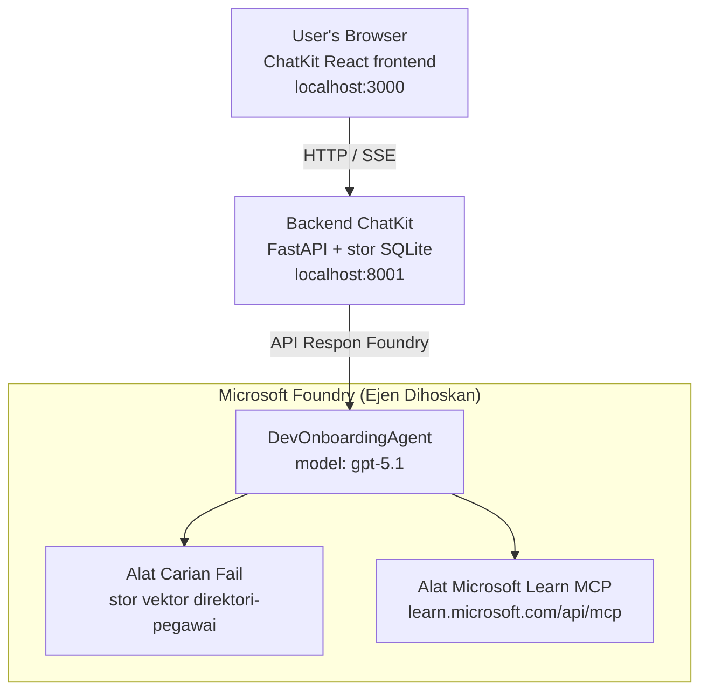

# Pelajaran 4: Penggubahan Ejen dengan Ejen Tuan Rumah Microsoft Foundry + ChatKit

Pelajaran ini menunjukkan cara menggubah ejen menggunakan alat ke Microsoft Foundry sebagai ejen tuan rumah dan mencipta frontend berasaskan ChatKit untuk berinteraksi dengannya.

## Seni Bina

Ejen tuan rumah adalah **satu `DevOnboardingAgent`** (berjalan pada `gpt-5.1`) yang menjawab soalan onboarding pembangun menggunakan dua alat tuan rumah: alat **Carian Fail** di atas stor vektor direktori pekerja, dan alat **Microsoft Learn MCP**. Frontend React ChatKit bercakap dengan backend FastAPI, yang memanggil ejen melalui Foundry **API Tindak Balas**.



## Prasyarat

1. **Projek Microsoft Foundry** di rantau North Central US
2. **Azure CLI** disahkan (`az login`)
3. **Azure Developer CLI** (`azd`) dipasang
4. **Python 3.12+** dan **Node.js 18+**
5. **Stor Vektor** dicipta dengan data pekerja

## Mula dengan Pantas

### 1. Tetapkan Pembolehubah Persekitaran

```bash
cd lesson-4-agentdeployment
cp .env.example .env
# Sunting .env dengan butiran projek Microsoft Foundry anda
```

### 2. Gubah Ejen Tuan Rumah

**Pilihan A: Menggunakan Azure Developer CLI (Disyorkan)**

```bash
cd hosted-agent
azd auth login
azd agent deploy
```

**Pilihan B: Menggunakan Docker + Azure Container Registry**

```bash
cd hosted-agent

# Bina bekas
docker build -t developer-onboarding-agent:latest .

# Tag untuk ACR
docker tag developer-onboarding-agent:latest <your-acr>.azurecr.io/developer-onboarding-agent:latest

# Tolak ke ACR
az acr login --name <your-acr>
docker push <your-acr>.azurecr.io/developer-onboarding-agent:latest

# Sebarkan melalui portal Microsoft Foundry atau SDK
```

### 3. Mulakan Backend ChatKit

```bash
cd chatkit-server
python -m venv .venv
source .venv/bin/activate  # Pada Windows: .venv\Scripts\activate
pip install -r requirements.txt
python app.py
```

Server akan bermula pada `http://localhost:8001`

### 4. Mulakan Frontend ChatKit

```bash
cd chatkit-server/frontend
npm install
npm run dev
```

Frontend akan bermula pada `http://localhost:3000`

### 5. Uji Aplikasi

Buka `http://localhost:3000` dalam pelayar anda dan cuba soalan-soalan ini:

**Carian Pekerja:**
- "Saya baru di sini! Ada siapa pernah bekerja di Microsoft?"
- "Siapa yang mempunyai pengalaman dengan Azure Functions?"

**Sumber Pembelajaran:**
- "Cipta laluan pembelajaran untuk Kubernetes"
- "Sijil apa yang patut saya kejar untuk seni bina awan?"

**Bantuan Penulisan Kod:**
- "Bantu saya tulis kod Python untuk sambung ke CosmosDB"
- "Tunjukkan cara buat Azure Function"

**Soalan Pelbagai Ejen:**
- "Saya mula sebagai jurutera awan. Siapa yang patut saya hubungi dan apa patut saya pelajari?"

## Struktur Projek

```
lesson-4-agentdeployment/
├── .env.example                 # Environment variables template
├── implementation-plan.md       # Detailed implementation guide
├── README.md                    # This file
├── hosted-agent/               # Microsoft Foundry hosted agent
│   ├── main.py                 # Multi-agent workflow implementation
│   ├── requirements.txt        # Python dependencies
│   ├── Dockerfile              # Container definition
│   └── agent.yaml              # Agent deployment configuration
└── chatkit-server/             # ChatKit server application
    ├── app.py                  # FastAPI backend
    ├── store.py                # SQLite persistence layer
    ├── requirements.txt        # Python dependencies
    └── frontend/               # React frontend
        ├── package.json
        ├── vite.config.ts
        ├── tsconfig.json
        ├── index.html
        └── src/
            ├── main.tsx
            ├── App.tsx
            ├── App.css
            └── index.css
```

## Ejen dan Alatnya

Ejen tuan rumah adalah **ejen tunggal** (`DevOnboardingAgent`, ditakrifkan dalam `hosted-agent/main.py`) yang mengendalikan tiga domain onboarding. Daripada mengatur sub-ejen berasingan, ia mendedahkan setiap keupayaan sebagai alat (atau bergantung terus pada model):

| Keupayaan | Cara ia dikendalikan | Alat |
|-----------|---------------------|------|
| **Carian & sambungan pekerja** | Carian Fail tuan rumah Foundry di atas stor vektor direktori pekerja | `client.get_file_search_tool(vector_store_ids=[...])` |
| **Pembelajaran & latihan** | Pelayan Microsoft Learn MCP (alat MCP tuan rumah) | `client.get_mcp_tool(url="https://learn.microsoft.com/api/mcp")` |
| **Bantuan pengekodan** | Dikendalikan secara langsung oleh model `gpt-5.1` — tiada alat luar | — |

Ejen dicipta dengan `client.as_agent(name="DevOnboardingAgent", instructions=..., tools=[file_search_tool, learn_mcp_tool])` dan dihidangkan dengan `from_agent_framework(agent).run()`.

> **Nota reka bentuk.** Draf awal pelajaran ini menggunakan aliran kerja berbilang ejen `HandoffBuilder` (Triage → pakar). Ejen yang dihantar adalah ejen menggunakan alat tunggal, yang lebih mudah untuk digubah dan difahami untuk Q&A gaya onboarding. Untuk contoh pengatan orchestrasi berbilang ejen dan penyerahan, lihat Pelajaran 2 dan Pelajaran 3.

## Ujian Asap Ejen Tuan Rumah (Pintu CI)

Menggubah ejen tuan rumah dengan "berjaya" hanya membuktikan pesawat kawalan menerima
definisi — ia **tidak** membuktikan ejen benar-benar menjawab. Pergantungan hilang,
laluan model buruk, atau sambungan tamat boleh meninggalkan ejen hijau tapi senyap.

Pelajaran ini menghantar **ujian asap** ringan yang bertindak sebagai pintu rungu yang cepat dan murah selepas gubahan.
Ia menggunakan GitHub Action [AI Smoke Test](https://github.com/marketplace/actions/ai-smoke-test)
untuk POST arahan ke titik akhir **Tindak Balas** Foundry ejen
(`POST {project_endpoint}/agents/{agent_name}/endpoint/protocols/openai/responses`)
dan membuat asersi pada teks yang dikembalikan. Ia mengesan gubahan rosak, regressi kebenaran,
drift arahan sistem, dan gangguan berbahasa dalam beberapa saat.

> Ujian asap **bukan** pengganti untuk penilaian penuh dalam
> [Pelajaran 3](../lesson-3-agent-evals/README.md) — ia pelengkap. Ujian asap
> menjawab *"adakah ejen boleh dicapai, memberi tindak balas, dan mengikut jangkaan asas arahan?"*;
> penilaian menjawab *"betapa baiknya tindak balas itu?"*. Jalankan pintu murah ini pada setiap gubahan.

### Apa yang diuji

Katalog berada di [`hosted-agent/tests/smoke-tests.json`](../../../lesson-4-agentdeployment/hosted-agent/tests/smoke-tests.json)
dan menguji tiga domain ejen serta kesetiaan arahan dan pemeliharaan keadaan perbualan berbilang giliran:

| Ujian | Apa yang disahkan |
|-------|------------------|
| `reachability` | Ejen memberi tindak balas teks bukan kosong yang dalam skop |
| `employee-search` | Domain carian fail mengembalikan `200` sihat (jawapan bergantung data) |
| `learning-path` | Domain pembelajaran mengulangi topik dan menghasilkan jawapan bergaya laluan |
| `coding-assistance` | Domain pengekodan mengembalikan jawapan Python berbentuk kod |
| `prompt-adherence-offtopic` | Permintaan luar topik dialihkan, tidak dijawab secara terperinci |
| `threading-turn-1/2` | Keadaan perbualan dikekalkan merentasi giliran melalui `previous_response_id` |

### Jalankan dalam CI

Aliran kerja di [`.github/workflows/smoke-test-hosted-agent.yml`](../../../.github/workflows/smoke-test-hosted-agent.yml)
mempunyai dua tugasan:

- **`static`** — pintu pantas tanpa Azure yang dijalankan pada setiap permintaan seretan dan push:
  ia menyusun semua kod Python (`py_compile`) dan memeriksa pautan Markdown. Tiada rahsia
  diperlukan, jadi ia berfungsi pada PR fork.
- **`smoke`** — ujian asap disambungkan Azure di bawah. Ia dijalankan atas permintaan
  (Actions → **Agent CI (static + smoke)** → Run workflow) dan boleh dirangka selepas
  aliran kerja gubahan anda.

Konfigurasikan **pembolehubah** dan **rahsia** repositori berikut untuk tugasan asap:

| Jenis | Nama | Nilai |
|------|------|-------|
| Pembolehubah | `FOUNDRY_PROJECT_ENDPOINT` | `https://<account>.services.ai.azure.com/api/projects/<project>` |
| Pembolehubah | `HOSTED_AGENT_NAME` | Nama ejen yang digubah (contoh `dev-onboarding` — mesti sama dengan gubahan anda) |
| Rahsia | `AZURE_CLIENT_ID` / `AZURE_TENANT_ID` / `AZURE_SUBSCRIPTION_ID` | Identiti gabungan OIDC untuk `azure/login` |

Identiti pelari perlu peranan **`Azure AI User`** pada **skop projek Foundry** supaya boleh
memanggil titik akhir data-plane Tindak Balas (dan perbualan). Berikan dengan:

```bash
az role assignment create \
  --assignee <object-id-or-appId-of-runner-identity> \
  --role "Azure AI User" \
  --scope "/subscriptions/<sub>/resourceGroups/<rg>/providers/Microsoft.CognitiveServices/accounts/<account>/projects/<project>"
```

### Jalankan secara tempatan

Anda boleh menjalankan katalog yang sama sebelum menolak. Dapatkan token data-plane dengan skop
`https://ai.azure.com/` dan arahkan pelari ke gubahan anda:

```bash
# Penonton MESTI https://ai.azure.com/ (token cognitiveservices.azure.com ditolak)
export FOUNDRY_TOKEN=$(az account get-access-token --resource https://ai.azure.com/ --query accessToken -o tsv)

git clone https://github.com/JFolberth/ai-smoketest && cd ai-smoketest
python runner.py \
  --project-endpoint "https://<account>.services.ai.azure.com/api/projects/<project>" \
  --agent-name dev-onboarding \
  --tests-file ../lesson-4-agentdeployment/hosted-agent/tests/smoke-tests.json
```

Kod keluar: `0` semua lulus, `1` asersi gagal, `2` ralat pelari (katalog/token salah).

## Penyelesaian Masalah

### Ejen tidak memberi tindak balas
- Sahkan ejen tuan rumah digubah dan berjalan di Microsoft Foundry
- Periksa `HOSTED_AGENT_NAME` dan `HOSTED_AGENT_VERSION` sama dengan gubahan anda

### Ralat stor vektor
- Pastikan `VECTOR_STORE_ID` ditetapkan dengan betul
- Sahkan stor vektor mengandungi data pekerja

### Ralat pengesahan
- Jalankan `az login` untuk segar semula kelayakan
- Pastikan anda mempunyai akses ke projek Microsoft Foundry

## Sumber

- [Dokumentasi Ejen Tuan Rumah Microsoft Foundry](https://learn.microsoft.com/en-us/azure/ai-foundry/agents/concepts/hosted-agents)
- [Rangka Kerja Ejen Microsoft](https://github.com/microsoft/agent-framework)
- [Contoh Integrasi ChatKit](https://github.com/microsoft/agent-framework/tree/main/python/samples/demos/chatkit-integration)
- [Azure Developer CLI](https://learn.microsoft.com/en-us/azure/developer/azure-developer-cli/overview)
- [Tindakan GitHub AI Smoke Test](https://github.com/marketplace/actions/ai-smoke-test)
- [Ujian Asap Ejen Microsoft Foundry dengan Tindakan GitHub (blog)](https://techcommunity.microsoft.com/blog/azuredevcommunityblog/smoke-test-microsoft-foundry-agents-with-github-actions/4531912)

---

## Langkah Seterusnya

Ejen anda berjalan pada infrastruktur yang diurus Microsoft. Untuk membawanya ke pengeluaran perusahaan —
mengawal di mana data itu berada (kedaulatan data, rangkaian persendirian, membawa Azure
Cosmos DB / Storage / AI Search anda sendiri) dan menguruskan alatnya — teruskan ke
**[Pelajaran 5: Ejen Tuan Rumah Pengeluaran](../lesson-5-hosted-agents-production/README.md)**, yang
menerangkan bezanya penting antara **Ejen Tuan Rumah** dan **Hos Keupayaan**.

---

<!-- CO-OP TRANSLATOR DISCLAIMER START -->
**Penafian**:
Dokumen ini telah diterjemahkan menggunakan perkhidmatan terjemahan AI [Co-op Translator](https://github.com/Azure/co-op-translator). Walaupun kami berusaha untuk ketepatan, sila ambil maklum bahawa terjemahan automatik mungkin mengandungi kesilapan atau ketidaktepatan. Dokumen asal dalam bahasa asalnya harus dianggap sebagai sumber yang sahih. Untuk maklumat penting, terjemahan oleh manusia profesional adalah disyorkan. Kami tidak bertanggungjawab terhadap sebarang salah faham atau salah tafsir yang timbul daripada penggunaan terjemahan ini.
<!-- CO-OP TRANSLATOR DISCLAIMER END -->