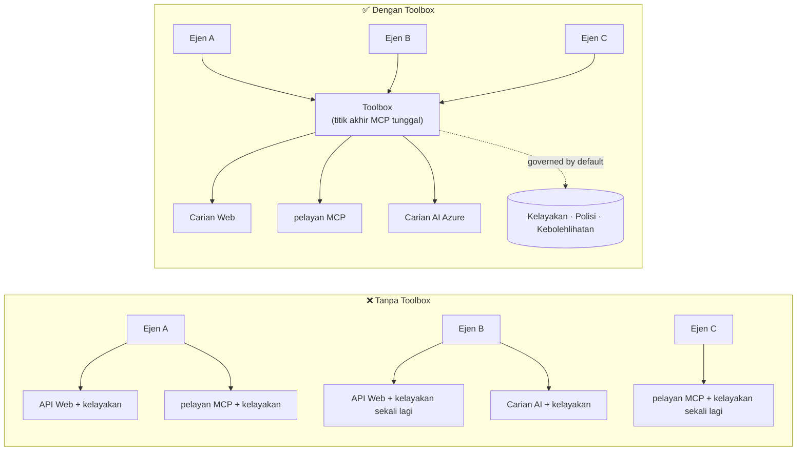

# Pelajaran 6: Microsoft Toolbox — Alat Berpentadbiran untuk Ejen

Menurut [Pelajaran 5](../lesson-5-hosted-agents-production/README.md) ejen hos anda berjalan dalam
pengeluaran dengan penyimpanan dan postur pentadbiran yang organisasi anda perlukan. Tetapi lihat kembali kepada
ejen Pelajaran 4: setiap alat adalah **terkod keras** dalam `main.py` — URL MCP Microsoft Learn,
stor vektor carian fail, dan sebagainya. Itu berfungsi untuk satu ejen. Ia **tidak** boleh diskalakan kepada
sebuah organisasi dengan berpuluh-puluh ejen dan pasukan.

Pelajaran ini memperkenalkan **Microsoft Toolbox**: cara Foundry membolehkan anda mentakrif satu set alat yang dikurasi
**sekali**, mengurusnya **secara pusat**, dan dipaparkan kepada mana-mana ejen melalui **satu,
titik akhir yang berpentadbiran**.

## Objektif Pembelajaran

Pada akhir pelajaran ini anda akan dapat:

- Jelaskan masalah penyebaran alat yang Toolbox selesaikan.
- Terangkan tiang **Build** dan **Consume** serta jenis alat yang boleh dimuatkan dalam toolbox.
- **Bina** versi toolbox dengan Foundry SDK.
- **Gunakan** toolbox dari agen Microsoft Agent Framework yang dihoskan melalui satu titik akhir MCP.
- Gunakan **penversian** untuk menghantar perubahan alat tanpa sebarang perubahan kod ejen atau penyebaran semula.
- Terapkan **pentadbiran**: RBAC, suntikan kelayakan, dan dasar guardrail (RAI).

---

## Prasyarat

1. Selesai [Pelajaran 4](../lesson-4-agentdeployment/README.md) dan sebaik-baiknya
   [Pelajaran 5](../lesson-5-hosted-agents-production/README.md).
2. Projek **Microsoft Foundry** dengan kebenaran untuk mencipta dan mengurus sumber toolbox.
3. **Azure CLI** disahkan: `az login`. API toolbox Foundry memerlukan
   skop token `https://ai.azure.com/.default` (dipaparkan di kod di bawah).
4. **Python 3.12+** dengan pergantungan kursus dipasang (`pip install -r ../requirements.txt`).
5. Penyebaran model semasa dan belum bersara (contohnya `gpt-5.1`). Elakkan GPT-4o / GPT-4.1 yang sudah bersara.

---

## 1. Masalah: penyebaran alat

Satu ejen boleh bergantung pada banyak alat — REST API, pelayan MCP, penyambung, dan aliran — setiap satu
dengan model pengesahan dan pasukan pemiliknya sendiri. Apabila anda berkembang merentas organisasi:

- Pasukan **mengimplementasikan semula alat yang sama** secara berdikari.
- **Kelayakan digandakan** di antara ejen dan repositori.
- **Pentadbiran menjadi tidak konsisten** — setiap ejen menguatkuasa (atau terlupa) dasar dengan sendiri.
- Terdapat **sedikit keterlihatan** terhadap alat yang ada atau siapa yang menggunakannya.

Pembangun tersangkut — bukan kerana model tidak mampu, tetapi kerana **integrasi alat menjadi
halangan utama**.



Perusahaan sudah mempunyai infrastruktur — pintu masuk, peti keselamatan kelayakan, dasar, kebolehlihatan.
Apa yang kurang ialah pengalaman pembangun yang mengumpulkan ia menjadi sesuatu yang **boleh digunakan semula,
dapat ditemui, dan dipentadbiran secara default**. Itulah Toolbox.

---

## 2. Apa itu Toolbox

**Toolbox** adalah **sumber Foundry yang diurus**. Anda mentakrif satu set alat yang dikurasi sekali, mengurusnya
secara pusat dalam Foundry, dan mendedahkannya melalui **satu titik akhir yang serasi MCP** yang mana-mana
ejen boleh gunakan. Pada masa jalan platform mengendalikan **suntikan kelayakan, penyegaran token, dan
penguatkuasaan dasar perusahaan**.

Oleh kerana toolbox adalah sumber yang diurus, anda boleh menambah, membuang, atau mengkonfigurasi semula alat **tanpa
menukar kod dalam ejen anda** — ejen sentiasa menyambung ke titik akhir yang sama.

Toolbox merangkumi kitar hidup alat melalui empat tiang; **Build** dan **Consume** tersedia
hari ini:

| Tiang | Status | Apa yang dibolehkan |
|--------|--------|-----------------|
| **Build** | Tersedia hari ini | Pilih alat, konfigurasi pengesahan secara pusat, terbitkan toolbox guna semula yang boleh digunakan mana-mana pasukan. |
| **Consume** | Tersedia hari ini | Sambungkan mana-mana ejen ke satu titik akhir serasi MCP untuk menemui dan memanggil semua alat dalam toolbox secara dinamik. |

Permukaan penggunaan adalah **terbuka**: mana-mana runtime atau klien serasi MCP boleh menggunakan toolbox —
Microsoft Agent Framework, LangGraph, GitHub Copilot, Claude Code, Microsoft Copilot Studio, atau
kod tersuai.

### Jenis alat yang boleh dimuatkan dalam toolbox

Carian Web · MCP · Azure AI Search · Code Interpreter · Carian Fail · OpenAPI · **Agent-ke-Ejen
(A2A)** · Fabric IQ · Carian Alat · Work IQ · Automasi Pelayar · rujukan Kemahiran, serta
**dasar Guardrail (RAI)** yang dikenakan pada lapisan toolbox.

> **Petua:** Tambah `description` untuk **setiap** alat supaya model dapat memilih yang tepat. Toolbox
> membenarkan paling banyak **satu alat tanpa nama setiap jenis** — berikan setiap contoh tambahan jenis yang sama
> `name` unik, atau anda akan mendapat ralat `invalid_payload`.

---

## 3. Bina toolbox

Toolbox diurus dengan Foundry SDKs (Python/.NET/JavaScript), REST API, `azd`, dan
**Microsoft Foundry Toolkit untuk VS Code**. Berikut adalah pola Python (`azure-ai-projects`):

```python
from azure.identity import DefaultAzureCredential
from azure.ai.projects import AIProjectClient
from azure.ai.projects.models import MCPTool, ToolboxSearchPreviewTool, WebSearchTool

endpoint = "https://<your-foundry-account>.services.ai.azure.com/api/projects/<your-project>"
project = AIProjectClient(endpoint=endpoint, credential=DefaultAzureCredential())

toolbox_version = project.toolboxes.create_toolbox_version(
    name="agent-tools",
    description="Web search + an MCP server + tool search",
    tools=[
        WebSearchTool(),
        MCPTool(
            server_label="myserver",
            server_url="https://your-mcp-server.example.com",
            require_approval="never",
            project_connection_id="my-key-auth-connection",  # kelayakan tinggal di Foundry
        ),
        ToolboxSearchPreviewTool(),
    ],
)
print(f"Created toolbox: {toolbox_version.name}, version: {toolbox_version.version}")
```

Perhatikan apa yang anda **tidak** lakukan: tiada rahsia dalam ejen. Kelayakan dipegang oleh sebuah
**hubungan** Foundry (`project_connection_id`) dan disuntik oleh platform semasa panggilan.

> **Nota pratonton.** Pengurusan Toolbox (cipta/kemas kini versi) adalah keupayaan pratonton.
> Operasi `project.toolboxes.*` yang dipaparkan di atas terdapat dalam binaan SDK pratonton, REST API, `azd`,
> dan **Foundry Toolkit untuk VS Code** — ia **tidak** ada dalam `azure-ai-projects` bertanda pin yang
> digunakan di tempat lain dalam kursus ini. Anggap petikan di atas sebagai bentuk langkah Build; untuk
> laluan klik-lalui, cipta toolbox dalam **portal Foundry** atau **Foundry Toolkit**. Langkah
> **Consume** di bawah berfungsi dengan SDK bertanda pin kursus hari ini.

---

## 4. Gunakan toolbox dari ejen anda

Toolbox mendedahkan **titik akhir MCP**. Terdapat dua pola:

| Peranan | Titik Akhir | Bila digunakan |
|------|----------|-------------|
| **Pengguna toolbox** | `{project_endpoint}/toolboxes/{name}/mcp?api-version=v1` | Sambungkan ejen. Sentiasa hidangkan **versi lalai**. |
| **Pembangun toolbox** | `{project_endpoint}/toolboxes/{name}/versions/{version}/mcp?api-version=v1` | Uji versi tertentu sebelum mempromosikannya. |

> **Sambungkan ejen ke titik akhir *pengguna*.** Kerana sentiasa menghidangkan versi lalai, anda

> boleh mempromosikan versi baru **tanpa menukar kod agen atau menyebarkan semula**.

### Mengintegrasikan dengan agen Microsoft Agent Framework yang dihoskan

Ingatkan agen Pelajaran 4 menambah satu alat MCP yang dikod keras dengan `client.get_mcp_tool(...)`. Dengan
Toolbox, anda sebaliknya menunjuk pada **satu** `MCPStreamableHTTPTool` ke titik hujung toolbox — dan agen
mendapat **setiap** alat dalam toolbox, dikawal secara pusat:

```python
import httpx
from azure.identity import DefaultAzureCredential, get_bearer_token_provider
from agent_framework import MCPStreamableHTTPTool

# Auth: Kotak alat Foundry memerlukan skop https://ai.azure.com/.default
credential = DefaultAzureCredential()
token_provider = get_bearer_token_provider(credential, "https://ai.azure.com/.default")
http_client = httpx.AsyncClient(auth=_ToolboxAuth(token_provider), timeout=120.0)

TOOLBOX_ENDPOINT = os.environ["TOOLBOX_ENDPOINT"]  # disuntik platform semasa masa jalan

mcp_tool = MCPStreamableHTTPTool(
    name="toolbox",
    url=TOOLBOX_ENDPOINT,
    http_client=http_client,
    load_prompts=False,
)

agent = chat_client.as_agent(
    name="my-toolbox-agent",
    instructions="You are a helpful assistant with access to Foundry toolbox tools.",
    tools=[mcp_tool],
)
```

`.env` yang sepadan (nota: gunakan model **terkini** seperti `gpt-5.1`, **bukan** yang sudah dipensiunkan
`gpt-4o`):

```env
FOUNDRY_PROJECT_ENDPOINT=https://<account>.services.ai.azure.com/api/projects/<project>
TOOLBOX_ENDPOINT=https://<account>.services.ai.azure.com/api/projects/<project>/toolboxes/agent-tools/mcp?api-version=v1
AZURE_AI_MODEL_DEPLOYMENT_NAME=gpt-5.1
```

> **Sahkan terlebih dahulu.** Sebelum menyambungkan agen sepenuhnya, sambungkan SDK klien MCP (`pip install mcp`) ke
> titik hujung **versi-spesifik** dan senaraikan alat untuk mengesahkan mereka dimuat seperti yang dijangkakan.

### Jalankan contoh consume

Pelajaran ini menyediakan contoh sisi consume yang boleh dijalankan, [`toolbox_agent.py`](../../../lesson-6-toolbox/toolbox_agent.py). Ia menggunakan
corak yang sama `FoundryChatClient.get_mcp_tool(...)` yang anda pelajari dalam Pelajaran 2, tetapi menunjuk satu
alat MCP ke titik hujung **toolbox** anda — supaya agen mendapat setiap alat yang dikawal dalam toolbox:

```bash
# Dalam .env anda, tetapkan TOOLBOX_ENDPOINT ke titik akhir pengguna toolbox anda, kemudian:
python lesson-6-toolbox/toolbox_agent.py
```

Buka URL `http://localhost:8096` yang dicetak dan tanya soalan yang menggunakan salah satu alat
toolbox anda. Tambah atau naik taraf alat dalam toolbox dan tanya sekali lagi — **tanpa menukar
kod ini** — untuk melihat kawalan pusat dan pengurusan versi berfungsi.

---

## 5. Pengurusan Versi: menghantar perubahan alat dengan selamat

Pengurusan versi Toolbox memberi anda kawalan yang jelas mengenai bila perubahan berkuatkuasa:

1. **Buat** versi baru toolbox dengan set alat yang dikemas kini.
2. **Uji** ia di titik hujung versi-spesifik (pembangun).
3. **Promosi** ia ke `default_version` apabila anda bersedia.

Setiap agen yang menunjuk ke titik hujung **pengguna** secara automatik mengambil versi yang dipromosikan — **tiada
perubahan kod, tiada penyebaran semula**. (Versi pertama yang anda buat secara automatik dipromosikan sebagai lalai.)

Ini adalah setara pengawalan alat dengan penyebaran biru/hijau: anda mengesahkan perubahan secara terpencil,
kemudian tukar lalai untuk setiap pengguna serentak.

---

## 6. Tadbir Urus: bagaimana Toolbox meningkatkan kawalan

Toolbox adalah **dikawal secara lalai**. Tuil tadbir urus yang anda harus tahu:

- **RBAC.** Berikan peranan **Foundry User** pada projek kepada setiap entiti: **pembangun** yang
  mengurus versi toolbox, **identiti yang diuruskan agen** (untuk agen yang dihoskan memanggil alat pada
  masa jalan), dan, untuk aliran OAuth, **pengguna akhir** yang identitinya diproksikan.
- **Kelayakan berpusat.** Kelayakan alat disimpan dalam **sambungan** Foundry, bukan dalam kod agen
  atau fail `.env`. Platform menyuntik dan menyegar token semasa waktu jalan.
- **Tempat pengawasan (polisi RAI).** Lampirkan polisi AI bertanggungjawab bernama ke versi toolbox melalui
  `policies.rai_config.rai_policy_name`. Ia berjalan pada **lapisan toolbox**, berasingan daripada
  penapis kandungan peringkat model, menapis input dan output alat.
- **Kelulusan MCP.** Kawalan `require_approval` setiap alat MCP menentukan sama ada panggilan alat MCP perlu mendapat kelulusan —
  konsep aliran kerja kelulusan yang sama yang anda lihat dalam [Pelajaran 5 §7](../lesson-5-hosted-agents-production/README.md#7-hosted-mcp-tools--approval-workflows).
- **Rangkaian peribadi.** Toolbox menyokong konfigurasi rangkaian maya untuk perusahaan yang
  mengekalkan trafik dalam rangkaian mereka.
- **Keterlihatan.** Oleh kerana alat dikatalogkan secara pusat, anda akhirnya mendapat inventori apa yang
  wujud dan siapa yang menggunakannya.

---

## Latihan praktikal

1. **Susun semula Pelajaran 4.** Agen Pelajaran 4 mengkod keras alat Microsoft Learn MCP. Rangka bagaimana anda
   akan memindahkan alat itu ke dalam toolbox `agent-tools` dan menunjuk semula `main.py` ke titik hujung pengguna
   toolbox. Apa yang berubah dalam `main.py`? Apa yang tidak lagi ada di situ?
2. **Reka lonjakan versi.** Anda perlu menambah alat Pencarian Web ke toolbox hidup yang digunakan oleh lima
   agen. Huraikan urutan buat → uji → promosi dan jelaskan mengapa tidak satu pun dari lima agen
   perlu disebarkan semula.
3. **Pilih identiti pengesahan.** Untuk agen yang dihoskan yang memanggil alat MCP berasaskan OAuth melalui
   toolbox, senaraikan identiti mana yang memerlukan peranan **Foundry User** dan mengapa.
4. **Penempatan tembok pelindung.** Terangkan perbezaan antara penapis kandungan peringkat model dan tembok pelindung
   toolbox, dan berikan satu senario di mana anda memerlukan tembok pelindung toolbox secara spesifik.

---

## Sumber

- [Buat, uji, dan sebarkan toolbox dalam Foundry](https://learn.microsoft.com/azure/foundry/agents/how-to/tools/toolbox)
- [Katalog alat — Perkhidmatan Agen Foundry](https://learn.microsoft.com/azure/foundry/agents/concepts/tool-catalog)
- [Microsoft Agent Framework — Penyedia Microsoft Foundry (alat)](https://learn.microsoft.com/agent-framework/agents/providers/microsoft-foundry)
- [Tinjauan tembok pelindung](https://learn.microsoft.com/azure/foundry/guardrails/guardrails-overview)
- [Mulakan dengan Foundry di VS Code (Toolkit Foundry)](https://learn.microsoft.com/azure/ai-foundry/how-to/develop/get-started-projects-vs-code)
- [Model Context Protocol](https://modelcontextprotocol.io/)

---

**Sebelumnya:** [Pelajaran 5 — Agen Di Hoskan untuk Pengeluaran](../lesson-5-hosted-agents-production/README.md)
&nbsp;·&nbsp; **Seterusnya:** [Pelajaran 7 — Multi-Agen & A2A](../lesson-7-multi-agent-a2a/README.md)

---

<!-- CO-OP TRANSLATOR DISCLAIMER START -->
**Penafian**:
Dokumen ini telah diterjemahkan menggunakan perkhidmatan terjemahan AI [Co-op Translator](https://github.com/Azure/co-op-translator). Walaupun kami berusaha untuk ketepatan, sila ambil maklum bahawa terjemahan automatik mungkin mengandungi kesilapan atau ketidaktepatan. Dokumen asal dalam bahasa asalnya harus dianggap sebagai sumber yang sahih. Untuk maklumat penting, terjemahan oleh manusia profesional adalah disyorkan. Kami tidak bertanggungjawab terhadap sebarang salah faham atau salah tafsir yang timbul daripada penggunaan terjemahan ini.
<!-- CO-OP TRANSLATOR DISCLAIMER END -->