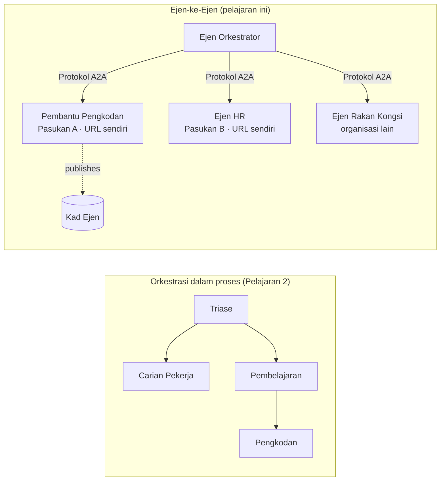

# Pelajaran 7: Orkestrasi Multi-Ejen & Ejen-ke-Ejen (A2A)

Pada [Pelajaran 6](../lesson-6-toolbox/README.md) anda boleh membina alat yang diperintah dan ejen yang dihoskan.
Tetapi sistem sebenar jarang menggunakan **satu** ejen. Apabila anda skala, anda menggabungkan **banyak** ejen — ada yang
anda miliki, ada yang dimiliki oleh pasukan lain, ada yang dijalankan sepenuhnya oleh organisasi lain. Pelajaran ini adalah tentang
bagaimana ejen bekerja **bersama**.

Anda sudah bertemu satu bentuk reka bentuk multi-ejen dalam
[‘agent-orchestration.py’ Pelajaran 2](../lesson-2-agent-development/README.md): corak **handoff**
di mana ejen triage menghala ke pakar **dalam satu proses tunggal**. Pelajaran ini melangkah
satu tahap lebih tinggi — ke **Ejen-ke-Ejen (A2A)**, protokol terbuka untuk ejen yang berjalan sebagai
perkhidmatan **rangkaian bebas** dan memanggil antara satu sama lain merentasi sempadan proses, pasukan, dan organisasi.

## Objektif Pembelajaran

Menjelang akhir pelajaran ini, anda akan dapat:

- Jelaskan perbezaan antara **orkestrasi dalam proses** (handoff/aliran kerja) dan
  komunikasi **Ejen-ke-Ejen (A2A)**, dan memilih yang sesuai.
- Terangkan blok binaan A2A: **Kad Ejen**, **kemahiran**, **tugas**, dan **penemuan**.
- **Dedahkan** ejen Microsoft Agent Framework sebagai perkhidmatan A2A dengan `A2AExecutor`.
- **Guna** ejen jauh sebagai rakan rangkaian dengan `A2AAgent`.
- Terapkan kebimbangan perusahaan kepada A2A: **keselamatan, identiti, tadbir urus, kebolehpantauan, dan kos**.

---

## Prasyarat

1. Selesai [Pelajaran 2](../lesson-2-agent-development/README.md) (pembangunan ejen & orkestrasi).
2. Projek **Microsoft Foundry** dengan penyebaran model terkini (contohnya `gpt-5.1`, dan
   `gpt-5-codex` untuk contoh pengkodan). Elakkan GPT-4o / GPT-4.1 yang sudah ditamatkan.
3. **Azure CLI** telah di-autentikasi: `az login`.
4. **Python 3.12+** dengan kebergantungan kursus dipasang (`pip install -r ../requirements.txt`).
   Pelajaran 7 menambah pakej pratonton `agent-framework-a2a`, `a2a-sdk`, dan `uvicorn`.
5. `FOUNDRY_PROJECT_ENDPOINT` dan `FOUNDRY_MODEL` diset dalam `.env` anda (rujuk README kursus).

---

## 1. Dua cara ejen bekerjasama

Tiada corak "multi-ejen" tunggal. Pilih satu yang sepadan dengan **sempadan** anda:

| Corak | Di mana ejen berjalan | Bagaimana mereka bersambung | Gunakan bila |
|---------|------------------|------------------|----------|
| **Handoff / Aliran Kerja** (Pelajaran 2) | Satu proses, satu kod asas | Graf dalam ingatan (`HandoffBuilder`, `WorkflowBuilder`) | Anda memiliki semua ejen dan mengedarkannya bersama. |
| **Ejen-ke-Ejen (A2A)** (pelajaran ini) | Perkhidmatan berasingan, kitaran hidup berasingan | Protokol **A2A terbuka** melalui HTTP, ditemui melalui **Kad Ejen** | Ejen dimiliki oleh pasukan/org berbeza, skala secara berdikari, atau ditulis dalam rangka kerja berbeza. |

Handoff adalah tentang **penyaluran dalam aplikasi**. A2A adalah tentang **menggabungkan ejen sebagai
perkhidmatan berdikari** — setara ejen untuk beralih dari panggilan fungsi ke mikroperkhidmatan.



> **Mereka bergabung.** Pengorkestra yang anda bina dengan `HandoffBuilder` boleh mempunyai **ejen A2A jauh**
> sebagai peserta — penyaluran dalam proses ke perkhidmatan yang berjalan di mana-mana sahaja.

---

## 2. Blok binaan A2A

A2A adalah **protokol terbuka** (bukan khusus Microsoft), jadi ejen A2A boleh digunakan oleh Microsoft
Agent Framework, LangGraph, kod tersuai, atau tumpukan syarikat lain. Empat konsep penting:

- **Kad Ejen** — dokumen JSON kecil, diterbitkan pada
  `/.well-known/agent-card.json`, yang mengiklankan **nama, deskripsi, URL, versi,
  kemahiran, dan keupayaan** ejen. Ini cara klien **menemui** apa yang boleh dilakukan ejen jauh.
- **Kemahiran** — perkara yang diisytiharkan boleh dilakukan oleh ejen (`id`, `nama`, `deskripsi`, `tag`,
  `contoh`). Klien (dan model) gunakan ini untuk memutuskan sama ada hendak memanggilnya.
- **Tugas** — panggilan kepada ejen A2A adalah **tugas** dengan kitaran hidup (dihantar → sedang bekerja →
  lengkap/gagal). Pelayan mengesan tugasan dalam **penyimpanan tugas**; kemaskini penstriman disokong.
- **Penemuan** — klien yang hanya diberi URL memuat turun Kad Ejen dan tahu bagaimana memanggil ejen.

---

## 3. Dedahkan ejen sebagai perkhidmatan A2A — `a2a_server.py`

Bahagian **Bina/sajikan** membalut mana-mana ejen Microsoft Agent Framework dengan `A2AExecutor` dan memasangnya
pada aplikasi HTTP A2A. Lihat [`a2a_server.py`](../../../lesson-7-multi-agent-a2a/a2a_server.py). Penyambungan utama:

```python
from agent_framework.a2a import A2AExecutor
from a2a.server.apps import A2AStarletteApplication
from a2a.server.request_handlers import DefaultRequestHandler
from a2a.server.tasks import InMemoryTaskStore
from a2a.types import AgentCapabilities, AgentCard, AgentSkill

agent = client.as_agent(name="coding-assistant", instructions="...")

agent_card = AgentCard(
    name="Coding Assistant",
    description="Generates runnable code samples...",
    url="http://localhost:9000/",
    version="1.0.0",
    capabilities=AgentCapabilities(streaming=True),
    default_input_modes=["text"],
    default_output_modes=["text"],
    skills=[AgentSkill(id="generate-code", name="Generate code",
                       description="Write a runnable code snippet.", tags=["code"])],
)

request_handler = DefaultRequestHandler(
    agent_executor=A2AExecutor(agent),
    task_store=InMemoryTaskStore(),
)
app = A2AStarletteApplication(agent_card=agent_card, http_handler=request_handler).build()
# dihidangkan dengan uvicorn pada port 9000
```

Perhatikan kod ejen **tidak berubah** — `A2AExecutor` menyesuaikan ejen anda yang sedia ada kepada protokol.
Kad Ejen adalah apa yang menjadikannya **boleh ditemui** oleh mana-mana klien A2A.

---

## 4. Guna ejen jauh — `a2a_client.py`

Bahagian **Guna** menyambung ke ejen jauh **mengikut URL**, memuat turun Kad Ejen, dan memanggilnya
tepat seperti ejen tempatan. Lihat [`a2a_client.py`](../../../lesson-7-multi-agent-a2a/a2a_client.py):

```python
from agent_framework.a2a import A2AAgent

remote_agent = A2AAgent(name="remote-coding-assistant", url="http://localhost:9000")
result = await remote_agent.run("Write a Python function that reverses a string.")
print(result.text)
```

Itu inti pati A2A: dari sisi pemanggil ejen jauh berkelakuan seperti mana-mana
ejen `agent_framework` lain, jadi anda boleh masukkannya ke dalam aliran kerja atau menyerahkan tugasan kepadanya — walaupun ia berjalan
dalam proses berlainan, pada mesin berbeza, dimiliki oleh pasukan berlainan.

### Jalankan dari awal hingga akhir

```bash
# Terminal 1 — mulakan perkhidmatan A2A
python a2a_server.py

# Terminal 2 — panggil ia
python a2a_client.py "Write a Python function that reverses a string."
```

Anda akan melihat respons pembantu pengkodan tiba melalui protokol A2A. Buka
`http://localhost:9000/.well-known/agent-card.json` dalam pelayar untuk melihat Kad Ejen yang diterbitkan.

---

## 5. Kebimbangan perusahaan

Mengubah ejen menjadi perkhidmatan rangkaian memperkenalkan kebimbangan yang sama seperti mana-mana sistem teragih —
ditambah beberapa kebimbangan khusus AI:


- **Identiti & pengesahan.** Jangan sesekali dedahkan agen A2A tanpa pengesahan. Kad Agen membawa
  `security` / `security_schemes`, dan `A2AAgent` menerima `auth_interceptor` supaya pemanggil melampirkan
  kelayakan (token pembawa OAuth, kunci API). Gunakan Entra ID / identiti terurus untuk
  pengesahan servis-ke-servis dalam produksi; letakkan servis di belakang pintu gerbang.
- **Tadbir urus.** Gabungkan A2A dengan [Kotak Alat Pelajaran 6](../lesson-6-toolbox/README.md): agen jauh
  boleh diterbitkan sebagai **alat A2A** di dalam kotak alat yang ditadbir supaya RBAC, suntikan kelayakan,
  dan polisi perlindungan dikenakan secara berpusat.
- **Pengamatan.** Permintaan kini melintasi sempadan proses, jadi sampaikan jejak merentas panggilan.
  Hidupkan [Foundry Observability / OpenTelemetry](../lesson-3-agent-evals/README.md) pada **kedua-dua** 
  pengatur cara dan setiap agen jauh supaya anda mendapat satu jejak hujung-ke-hujung.
- **Pengurusan versi.** Kad Agen mempunyai `version`. Perlakukan ia seperti API: perubahan tambahan adalah selamat;
  melanggar kontrak kemahiran memerlukan versi baru dan tempoh migrasi untuk pengguna.
- **Kebolehpercayaan.** Agen jauh gagal secara bebas. Tetapkan tamat masa (`A2AAgent(timeout=...)`), tangani
  kegagalan separa, dan jangan biarkan satu rakan perlahan menghalang keseluruhan aturan.
- **Kos.** Setiap panggilan agen jauh adalah panggilan model sendiri. Penyebaran berlipat ganda perbelanjaan token —
  bajetkan untuk ini, dan utamakan penghantaran ke **satu** agen terbaik daripada siaran ke ramai.

---

## Latihan amali

1. **Tambah servis kedua.** Salin `a2a_server.py` untuk dedahkan agen **employee-search** pada port
   9001 dengan Kad Agen dan kemahiran tersendiri. Jalankan kedua-duanya, dan buat klien panggil masing-masing.
2. **Atur rakan jauh.** Bina `HandoffBuilder` kecil (atau penghala biasa) yang pesertanya
   termasuk dua `A2AAgent` yang menunjuk ke dua servis anda. Hantarkan pertanyaan ke yang betul.
3. **Amankan ia.** Tambah `auth_interceptor` ke klien dan perlukan token pembawa pada pelayan.
   Apa yang rosak jika token hilang? Di mana anda akan simpan token dalam produksi?
4. **Handoff vs A2A.** Tulis dua perenggan pendek: bila anda akan simpan handoff dalam proses
   Pelajaran 2, dan bila kerumitan tambahan A2A dibenarkan? Berikan contoh konkrit untuk setiap satu.

---

## Sumber

- [Agent-to-Agent (A2A) — Microsoft Agent Framework](https://learn.microsoft.com/agent-framework/user-guide/agent-orchestration/a2a)
- [Orkestrasi pelbagai agen — Microsoft Agent Framework](https://learn.microsoft.com/agent-framework/user-guide/agent-orchestration/)
- [Spesifikasi protokol A2A](https://a2a-protocol.org/)
- [SDK Python A2A (`a2a-sdk`)](https://github.com/a2aproject/a2a-python)
- [Servis Agen Foundry — corak multi-agen](https://learn.microsoft.com/azure/ai-foundry/agents/concepts/connected-agents)

---

**Sebelumnya:** [Pelajaran 6 — Kotak Alat Microsoft](../lesson-6-toolbox/README.md)

---

<!-- CO-OP TRANSLATOR DISCLAIMER START -->
**Penafian**:
Dokumen ini telah diterjemahkan menggunakan perkhidmatan terjemahan AI [Co-op Translator](https://github.com/Azure/co-op-translator). Walaupun kami berusaha untuk ketepatan, sila ambil maklum bahawa terjemahan automatik mungkin mengandungi kesilapan atau ketidaktepatan. Dokumen asal dalam bahasa asalnya harus dianggap sebagai sumber yang sahih. Untuk maklumat penting, terjemahan oleh manusia profesional adalah disyorkan. Kami tidak bertanggungjawab terhadap sebarang salah faham atau salah tafsir yang timbul daripada penggunaan terjemahan ini.
<!-- CO-OP TRANSLATOR DISCLAIMER END -->