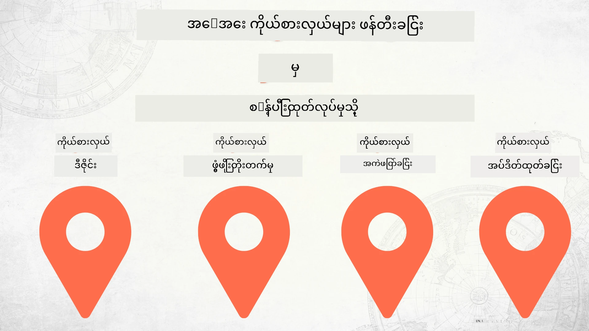

# Zero မှ စတင်၍ အလုပ်အမှုဆောင် အဆင့် သို့ AI ကိုယ်စားလှယ်များ ဖန်တီးခြင်း



### 🌐 ဘာသာစကားများစွာ รองรับမှု

#### GitHub Action မှ တဆင့် အလိုအလျောက် ပြုလုပ်ပြီး အမြဲပြောင်းလဲနေမှု

<!-- CO-OP TRANSLATOR LANGUAGES TABLE START -->
[Arabic](../ar/README.md) | [Bengali](../bn/README.md) | [Bulgarian](../bg/README.md) | [Burmese (Myanmar)](./README.md) | [Chinese (Simplified)](../zh-CN/README.md) | [Chinese (Traditional, Hong Kong)](../zh-HK/README.md) | [Chinese (Traditional, Macau)](../zh-MO/README.md) | [Chinese (Traditional, Taiwan)](../zh-TW/README.md) | [Croatian](../hr/README.md) | [Czech](../cs/README.md) | [Danish](../da/README.md) | [Dutch](../nl/README.md) | [Estonian](../et/README.md) | [Finnish](../fi/README.md) | [French](../fr/README.md) | [German](../de/README.md) | [Greek](../el/README.md) | [Hebrew](../he/README.md) | [Hindi](../hi/README.md) | [Hungarian](../hu/README.md) | [Indonesian](../id/README.md) | [Italian](../it/README.md) | [Japanese](../ja/README.md) | [Kannada](../kn/README.md) | [Khmer](../km/README.md) | [Korean](../ko/README.md) | [Lithuanian](../lt/README.md) | [Malay](../ms/README.md) | [Malayalam](../ml/README.md) | [Marathi](../mr/README.md) | [Nepali](../ne/README.md) | [Nigerian Pidgin](../pcm/README.md) | [Norwegian](../no/README.md) | [Persian (Farsi)](../fa/README.md) | [Polish](../pl/README.md) | [Portuguese (Brazil)](../pt-BR/README.md) | [Portuguese (Portugal)](../pt-PT/README.md) | [Punjabi (Gurmukhi)](../pa/README.md) | [Romanian](../ro/README.md) | [Russian](../ru/README.md) | [Serbian (Cyrillic)](../sr/README.md) | [Slovak](../sk/README.md) | [Slovenian](../sl/README.md) | [Spanish](../es/README.md) | [Swahili](../sw/README.md) | [Swedish](../sv/README.md) | [Tagalog (Filipino)](../tl/README.md) | [Tamil](../ta/README.md) | [Telugu](../te/README.md) | [Thai](../th/README.md) | [Turkish](../tr/README.md) | [Ukrainian](../uk/README.md) | [Urdu](../ur/README.md) | [Vietnamese](../vi/README.md)

> **ဒေသတွင်းသိမ်းဆည်းလိုပါသလား?**
>
> ဤ repository တွင် ဘာသာစကား ၅၀ ကျော် ထည့်သွင်းထားပြီး ဒါကြောင့် ဒေါင်းလုပ်အရွယ်အစား ကြီးမားလာသည်။ ဘာသာပြန်မှုမပါဘဲ clone လုပ်လိုပါက sparse checkout ကို အသုံးပြုပါ။
>
> **Bash / macOS / Linux:**
> ```bash
> git clone --filter=blob:none --sparse https://github.com/microsoft/Building-AI-Agents-From-Zero-To-Production.git
> cd Building-AI-Agents-From-Zero-To-Production
> git sparse-checkout set --no-cone '/*' '!translations' '!translated_images'
> ```
>
> **CMD (Windows):**
> ```cmd
> git clone --filter=blob:none --sparse https://github.com/microsoft/Building-AI-Agents-From-Zero-To-Production.git
> cd Building-AI-Agents-From-Zero-To-Production
> git sparse-checkout set --no-cone "/*" "!translations" "!translated_images"
> ```
>
>  ဒါက အတန်းကို အပြီးသတ်ရန် လိုအပ်သော အရာအားလုံးကို ပိုမိုလျင်မြန်စွာ ဒေါင်းလုပ်ဆွဲပေးပါမည်။
<!-- CO-OP TRANSLATOR LANGUAGES TABLE END -->

## AI ကိုယ်စားလှယ် ဖန်တီးခြင်းနေ့ရက်ဘဝ အခြေခံများ သင်ကြားပေးသည့် သင်ခန်းစာ

[](https://github.com/microsoft/Building-AI-Agents-From-Zero-To-Production/blob/master/LICENSE?WT.mc_id=academic-105485-koreyst)
[](https://GitHub.com/microsoft/Building-AI-Agents-From-Zero-To-Production/graphs/contributors/?WT.mc_id=academic-105485-koreyst)
[](https://GitHub.com/microsoft/Building-AI-Agents-From-Zero-To-Production/issues/?WT.mc_id=academic-105485-koreyst)
[](https://GitHub.com/microsoft/Building-AI-Agents-From-Zero-To-Production/pulls/?WT.mc_id=academic-105485-koreyst)
[](http://makeapullrequest.com?WT.mc_id=academic-105485-koreyst)

[](https://discord.gg/Kuaw3ktsu6)

## 🌱 စတင်လိုက်ပါ

ဤသင်တန်းတွင် AI ကိုယ်စားလှယ်များ ဖန်တီးခြင်းနှင့် အလုပ်လုပ်ရန် အခြေခံအဆင့်များ ပါဝင်သည်။

သင်ခန်းစာတိုင်းသည် မတိုင်မှီ သင်ခန်းစာအပေါ် အခြေတည်ပြီး ဆက်လက်တိုးတက်သွားသည်၊ ထို့ကြောင့် ဆက်လက်လေ့လာရန် အစမှ စတင်သင့်ပါသည်။

AI ကိုယ်စားလှယ်အကြောင်း ပိုမိုလေ့လာလိုလျှင် [AI Agents For Beginners Course](https://aka.ms/ai-agents-beginners) ကို စစ်ဆေးနိုင်ပါသည်။

### ကလပ်ဖွဲ့ မိတ်ဆက်ပါ၊ မေးခွန်းများ လိုအပ်ပါက ဖြေကြားပါ

AI ကိုယ်စားလှယ် ဖန်တီးရာတွင် အခက်အခဲ ဖြစ်လျှင် သို့မဟုတ် မေးခွန်းရှိပါက [Microsoft Foundry Discord](https://discord.gg/Kuaw3ktsu6) ၏ သီးသန့် Discord ချန်နယ်ကို ဝင်ရောက်ဖို့ အကြံပြုပါသည်။

### လိုအပ်သောအရာများ

သင်ခန်းစာတိုင်းမှာ ကိုယ့်ရဲ့ စက်တွင် လည်ပတ်နိုင်သော သက်မှတ်ထားသော ကိုဒ်နမူနာ ရှိသည်။ ကိုယ်ပိုင်အကူးအတွက် [ဤ repo ကို fork လုပ်ပါ](https://github.com/microsoft/Building-AI-Agents-From-Zero-To-Production/fork)။

ဤသင်တန်းမှာ လောလောဆယ် အသုံးပြုထားသည်မှာ -

- [Microsoft Agent Framework (MAF)](https://aka.ms/ai-agents-beginners/agent-framework)
- [Microsoft Foundry](https://azure.microsoft.com/products/ai-foundry)
- [Azure OpenAI Service](https://azure.microsoft.com/products/ai-foundry/models/openai)
- [Azure CLI](https://learn.microsoft.com/cli/azure/authenticate-azure-cli?view=azure-cli-latest)

စတင်ရန်မတိုင်မီ ဒီဝန်ဆောင်မှုများ အားလုံးရှိကြောင်း သေချာပါစေ။

မကြာခင် မော်ဒယ်တည်ဆောက်ခြင်းနှင့် ဝန်ဆောင်မှုများ အတွက် ဘာသာပြန်ရွေးချယ်မှုများ ပိုမိုထည့်သွင်းသွားမည်။

## 🗃️ သင်ခန်းစာများ

| **သင်ခန်းစာ**       | **ဖော်ပြချက်**                                                                                    |
|--------------------|--------------------------------------------------------------------------------------------------|
| [Agent Design](./lesson-1-agent-design/README.md)       | "Developer Onboarding" AI ကိုယ်စားလှယ် တည်ဆောက်ခြင်းနှင့် အကျိုးရှိစေမည့် ကိုယ်စားလှယ် ဒီဇိုင်း ဖန်တီးခြင်း အကြောင်း သွားရောက်လေ့လာခြင်း |
| [Agent Development](./lesson-2-agent-development/README.md)  | Microsoft Agent Framework (MAF) ကို အသုံးပြု၍ Developer အသစ်များ အတွက် အသုံးပြုနိုင်သော AI ကိုယ်စားလှယ် ၃ ခု တည်ဆောက်ခြင်း           |
| [Agent Evaluations](./lesson-3-agent-evals/README.md)  | Microsoft Foundry အသုံးပြုပြီး AI ကိုယ်စားလှယ်များ၏ စွမ်းဆောင်ရည် လိုအပ်ချက်များအား ရှာဖွေပြီး တိုးတက်အောင် ကြိုးပမ်းခြင်း               |
| [Agent Deployment](./lesson-4-agent-deployment/README.md)   | Hosted Agents နှင့် OpenAI Chatkit အသုံးပြုပြီး AI ကိုယ်စားလှယ်တစ်ခုကို ပရော်ဒတ်ရှင်းတွင် ထည့်သွင်းအသုံးပြုခြင်း              |

## 🎒 အခြားသင်တန်းများ

ကျွန်ုပ်တို့အဖွဲ့ အခြားသင်တန်းများကို တည်ဆောက်ပေးပါသည်။ စစ်ဆေးကြည့်ပါ -

<!-- CO-OP TRANSLATOR OTHER COURSES START -->
### LangChain
[](https://aka.ms/langchain4j-for-beginners)
[](https://aka.ms/langchainjs-for-beginners?WT.mc_id=m365-94501-dwahlin)
[](https://github.com/microsoft/langchain-for-beginners?WT.mc_id=m365-94501-dwahlin)
---

### Azure / Edge / MCP / Agents
[](https://github.com/microsoft/AZD-for-beginners?WT.mc_id=academic-105485-koreyst)
[](https://github.com/microsoft/edgeai-for-beginners?WT.mc_id=academic-105485-koreyst)
[](https://github.com/microsoft/mcp-for-beginners?WT.mc_id=academic-105485-koreyst)
[](https://github.com/microsoft/ai-agents-for-beginners?WT.mc_id=academic-105485-koreyst)

---
 
### Generative AI Series
[](https://github.com/microsoft/generative-ai-for-beginners?WT.mc_id=academic-105485-koreyst)
[-9333EA?style=for-the-badge&labelColor=E5E7EB&color=9333EA)](https://github.com/microsoft/Generative-AI-for-beginners-dotnet?WT.mc_id=academic-105485-koreyst)
[-C084FC?style=for-the-badge&labelColor=E5E7EB&color=C084FC)](https://github.com/microsoft/generative-ai-for-beginners-java?WT.mc_id=academic-105485-koreyst)
[-E879F9?style=for-the-badge&labelColor=E5E7EB&color=E879F9)](https://github.com/microsoft/generative-ai-with-javascript?WT.mc_id=academic-105485-koreyst)

---
 
### အခြေခံ သင်ယူမှု
[](https://aka.ms/ml-beginners?WT.mc_id=academic-105485-koreyst)
[](https://aka.ms/datascience-beginners?WT.mc_id=academic-105485-koreyst)
[](https://aka.ms/ai-beginners?WT.mc_id=academic-105485-koreyst)
[](https://github.com/microsoft/Security-101?WT.mc_id=academic-96948-sayoung)
[](https://aka.ms/webdev-beginners?WT.mc_id=academic-105485-koreyst)
[](https://aka.ms/iot-beginners?WT.mc_id=academic-105485-koreyst)
[](https://github.com/microsoft/xr-development-for-beginners?WT.mc_id=academic-105485-koreyst)

---
 
### Copilot စီးရီးများ
[](https://aka.ms/GitHubCopilotAI?WT.mc_id=academic-105485-koreyst)
[](https://github.com/microsoft/mastering-github-copilot-for-dotnet-csharp-developers?WT.mc_id=academic-105485-koreyst)
[](https://github.com/microsoft/CopilotAdventures?WT.mc_id=academic-105485-koreyst)
<!-- CO-OP TRANSLATOR OTHER COURSES END -->

## ထောက်ပံ့မှု ပံ့ပိုးခြင်း

ဤပရောဂျက်တွင် ဆောင်ရွက်မှုများနှင့် အကြံပြုချက်များကို ကြိုဆိုပါသည်။ ဆောင်ရွက်မှု အများစုအတွက် သင်သည် ရယူခွင့်ရှိပြီး အမှန်တကယ် ဆောင်ရွက်ခွင့်ပေးသည်ဟု ကြေညာ하는 Contributor License Agreement (CLA) တစ်ခုအား သဘောတူရပါမည်။ အသေးစိတ်အချက်အလက်များအတွက် <https://cla.opensource.microsoft.com> သို့ သွားရောက်ကြည့်ရှုနိုင်ပါသည်။

သင် Pull Request တင်သွင်းသောအခါ၊ CLA bot သည် သင့်အား CLA လိုအပ်မည်ကို သုံးသပ်ပြီး PR ကို သင့်တော်သည့်ပုံစံဖြင့် ဖော်ပြပေးမည် (ဥပမာ- အခြေအနေစစ်ဆေးမှု၊ မှတ်ချက်) ဖြစ်သည်။ bot က ပေးသွားသော ညွှန်ကြားချက်များကို အယောင်လိုက်နာလိုက်ပါ။ ဤလုပ်ဆောင်ချက်ကို ကြိုတင် လုပ်ဆောင်ရမည့် အကြိမ်တစ်ခါသာလိုအပ်ပါသည်။

ဤပရောဂျက်သည် [Microsoft Open Source Code of Conduct](https://opensource.microsoft.com/codeofconduct/) ကို လက်ခံအသုံးပြုထားပါသည်။ အသေးစိတ်အချက်အလက်များအတွက် [Code of Conduct FAQ](https://opensource.microsoft.com/codeofconduct/faq/) ကို ကြည့်ရှုပါ သို့မဟုတ် [opencode@microsoft.com](mailto:opencode@microsoft.com) သို့ အခြားမေးမြန်းလိုသည်များ သို့မဟုတ် မှတ်ချက်များကို ပို့နိုင်ပါသည်။

## အမှတ်တံဆိပ်များ

ဤပရောဂျက်တွင် ပရောဂျက်များ၊ ထုတ်ကုန်များ သို့မဟုတ် ၀န်ဆောင်မှုများ အတွက် အမှတ်တံဆိပ်များ သို့မဟုတ် ရုပ်ပုံများ ပါဝင်နိုင်သည်။ Microsoft ၏ အမှတ်တံဆိပ်များ သို့မဟုတ် ရုပ်ပုံများကို အတည်ပြုခွင့်ပြုချက်ဖြင့်သာ အသုံးပြုရမည်ဖြစ်ပြီး၊ [Microsoft's Trademark & Brand Guidelines](https://www.microsoft.com/legal/intellectualproperty/trademarks/usage/general) အတိုင်း လိုက်နာရပါမည်။ Microsoft ၏ အမှတ်တံဆိပ်များ သို့မဟုတ် ရုပ်ပုံများကို ဤပရောဂျက်၏ ပြင်ပြီးသော ဗားရှင်းများတွင် အသုံးပြုရာတွင် မတူညီမှုများ ဖြစ်ပေါ်စေခြင်း သို့မဟုတ် Microsoft ၏ ကြီးမှူးမှုရှိခြင်းကို ဆိုလိုခြင်း မဖြစ်စေရပါ။ တတိယပါတီ အမှတ်တံဆိပ်များ သို့မဟုတ် ရုပ်ပုံများကို အသုံးပြုနိုင်ရန် သက်ဆိုင်ရာ တတိယပါတီ စည်းမျဉ်းစည်းကမ်းများကို လိုက်နာရပါမည်။

## ကူညီကောင်းချင်ပါသလား

AI အက်ပလီကေးရှင်းများ ဖန်တီးတဲ့ အခါမှာ အခက်အခဲ ရင်ဆိုင်ခဲ့ရပါက၊ အောက်ပါမှာ ပါဝင်ရောက်ဆွေးနွေးနိုင်ပါသည်။

[](https://discord.gg/Kuaw3ktsu6)

ထုတ်ကုန် အကြံပြုချက်များ သို့မဟုတ် အမှားအယွင်းများရှိပါက အောက်ပါကို ပစ်သို့ကြည့်ရှုနိုင်ပါသည်-

[](https://aka.ms/foundry/forum)

---

<!-- CO-OP TRANSLATOR DISCLAIMER START -->
**အချက်ပြချက်**:
ဤစာတမ်းကို AI ဘာသာပြန်မှုဝန်ဆောင်မှုဖြစ်သော [Co-op Translator](https://github.com/Azure/co-op-translator) ကို အသုံးပြု၍ ဘာသာပြန်ထားပါသည်။ ကျွန်ုပ်တို့သည် တိကျမှုအတွက် ကြိုးစားပါသော်လည်း၊ အလိုအလျောက် ဘာသာပြန်မှုများတွင် အမှားများ သို့မဟုတ် အနည်းငယ်သော မြင့်မားမှုများ ဖြစ်နိုင်ကြောင်း သတိပြုကြပါရန်။ မူလစာတမ်းကို မူလဘာသာဖြင့်သာ တရားဝင် အချက်အလက်အနေဖြင့် ယူဆရန် လိုအပ်ပါသည်။ အရေးကြီးသော အချက်အလက်များအတွက် လူကြီးမင်းတို့အနေဖြင့် အတွေ့အကြုံရှိသူ ဘာသာပြန်သူမှ ဘာသာပြန်ခြင်းကို အကြံပြုပါသည်။ ဤဘာသာပြန်မှုကို အသုံးပြုခြင်းမှ ဖြစ်ပေါ်လာသည့် မျက်မမှန် ဆန့်ကျင်မှုများ သို့မဟုတ် အဓိပ္ပါယ်မမှန်ခြင်းများအတွက် ကျွန်ုပ်တို့သည် တာဝန်ခံမရှိပါ။
<!-- CO-OP TRANSLATOR DISCLAIMER END -->