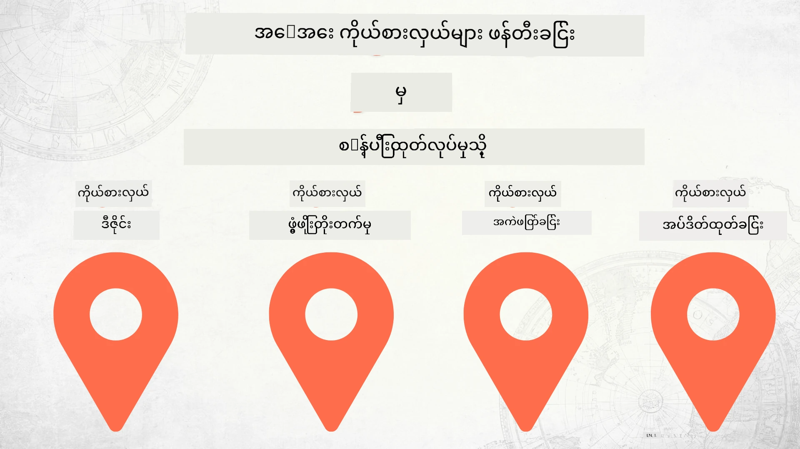

# ခေါင်းစဥ် AI အေးဂျင့်များကို စုစုပေါင်းမှ ထုတ်လုပ်မှုအထိ တည်ဆောက်ခြင်း



### 🌐 ဘာသာစကားများစွာအတွက် ထောက်ပံ့မှု

#### GitHub Action မှ တိုက်ရိုက် ထောက်ပံ့ခြင်း (အလိုအလျောက် နှင့် အမြဲအသစ်ဖြစ်နေ)

<!-- CO-OP TRANSLATOR LANGUAGES TABLE START -->
[Arabic](../ar/README.md) | [Bengali](../bn/README.md) | [Bulgarian](../bg/README.md) | [Burmese (Myanmar)](./README.md) | [Chinese (Simplified)](../zh-CN/README.md) | [Chinese (Traditional, Hong Kong)](../zh-HK/README.md) | [Chinese (Traditional, Macau)](../zh-MO/README.md) | [Chinese (Traditional, Taiwan)](../zh-TW/README.md) | [Croatian](../hr/README.md) | [Czech](../cs/README.md) | [Danish](../da/README.md) | [Dutch](../nl/README.md) | [Estonian](../et/README.md) | [Finnish](../fi/README.md) | [French](../fr/README.md) | [German](../de/README.md) | [Greek](../el/README.md) | [Hebrew](../he/README.md) | [Hindi](../hi/README.md) | [Hungarian](../hu/README.md) | [Indonesian](../id/README.md) | [Italian](../it/README.md) | [Japanese](../ja/README.md) | [Kannada](../kn/README.md) | [Khmer](../km/README.md) | [Korean](../ko/README.md) | [Lithuanian](../lt/README.md) | [Malay](../ms/README.md) | [Malayalam](../ml/README.md) | [Marathi](../mr/README.md) | [Nepali](../ne/README.md) | [Nigerian Pidgin](../pcm/README.md) | [Norwegian](../no/README.md) | [Persian (Farsi)](../fa/README.md) | [Polish](../pl/README.md) | [Portuguese (Brazil)](../pt-BR/README.md) | [Portuguese (Portugal)](../pt-PT/README.md) | [Punjabi (Gurmukhi)](../pa/README.md) | [Romanian](../ro/README.md) | [Russian](../ru/README.md) | [Serbian (Cyrillic)](../sr/README.md) | [Slovak](../sk/README.md) | [Slovenian](../sl/README.md) | [Spanish](../es/README.md) | [Swahili](../sw/README.md) | [Swedish](../sv/README.md) | [Tagalog (Filipino)](../tl/README.md) | [Tamil](../ta/README.md) | [Telugu](../te/README.md) | [Thai](../th/README.md) | [Turkish](../tr/README.md) | [Ukrainian](../uk/README.md) | [Urdu](../ur/README.md) | [Vietnamese](../vi/README.md)

> **ဒေသတွင်းမှာ ကလွန်လုပ်ချင်ပါသလား?**
>
> ဒီ repository တွင် ဘာသာစကား ၅၀ ကျော်အတွက် ဘာသာပြန်လိုင်းများပါဝင်ပြီး ဒေတာဒေါင်းလုဒ်အရွယ်အစားကို အလွန်တိုးမြှင့်သည်။ ဘာသာပြန်ချက်များမပါရှိဘဲ ကလွန်လုပ်ရန် sparse checkout ကို အသုံးပြုပါ။
>
> **Bash / macOS / Linux:**
> ```bash
> git clone --filter=blob:none --sparse https://github.com/microsoft/Building-AI-Agents-From-Zero-To-Production.git
> cd Building-AI-Agents-From-Zero-To-Production
> git sparse-checkout set --no-cone '/*' '!translations' '!translated_images'
> ```
>
> **CMD (Windows):**
> ```cmd
> git clone --filter=blob:none --sparse https://github.com/microsoft/Building-AI-Agents-From-Zero-To-Production.git
> cd Building-AI-Agents-From-Zero-To-Production
> git sparse-checkout set --no-cone "/*" "!translations" "!translated_images"
> ```
>
> သင်အတန်းကို အပြီးသတ်ရန် လိုအပ်သည့် အရာအားလုံးကို အလျင်အမြန် ဒေါင်းလုဒ် လုပ်နိုင်ပါသည်။
<!-- CO-OP TRANSLATOR LANGUAGES TABLE END -->

## AI အေးဂျင့်ဖွံ့ဖြိုးတိုးတက်မှု လိုက်စင်အသစ်များ၏ အခြေခံအကြောင်းအရာများကို သင်ကြားပေးသော သင်တန်းတစ်ခု

[](https://github.com/microsoft/Building-AI-Agents-From-Zero-To-Production/blob/master/LICENSE?WT.mc_id=academic-105485-koreyst)
[](https://GitHub.com/microsoft/Building-AI-Agents-From-Zero-To-Production/graphs/contributors/?WT.mc_id=academic-105485-koreyst)
[](https://GitHub.com/microsoft/Building-AI-Agents-From-Zero-To-Production/issues/?WT.mc_id=academic-105485-koreyst)
[](https://GitHub.com/microsoft/Building-AI-Agents-From-Zero-To-Production/pulls/?WT.mc_id=academic-105485-koreyst)
[](http://makeapullrequest.com?WT.mc_id=academic-105485-koreyst)

[](https://discord.gg/Kuaw3ktsu6)

## 🌱 စတင်ခြင်း

ဒီသင်တန်းတွင် AI အေးဂျင့်များ တည်ဆောက်ခြင်းနှင့် ထုတ်လုပ်ခြင်း အခြေခံများကို သင်ကြားပေးသည်။

အတန်းတစ်ခုနှင့်တစ်ခုချင်း ဆက်သွယ် သင်ကြားမည် ဖြစ်သောကြောင့် အစမှ စတင် ဖတ်ရှုရန် နှင့် အဆုံးထိ လုပ်ဆောင်ရန် အကြံပြုပါသည်။

AI အေးဂျင့် အကြောင်းများကို ပိုမိုလေ့လာလိုပါက [AI Agents For Beginners Course](https://aka.ms/ai-agents-beginners) ကို ကြည့်ရှုနိုင်ပါသည်။

### အခြား သင်ကြားသူများနှင့် တွေ့ဆုံ၊ မေးခွန်းများကို ဖြေကြားစေပါ

AI အေးဂျင့်များ တည်ဆောက်ရာတွင် အခက်အခဲများ ရှိပါက သို့မဟုတ် မေးခွန်းများ ရှိပါက [Microsoft Foundry Discord](https://discord.gg/Kuaw3ktsu6) တွင် ရည်ညွှန်းထားသော Discord ချန်နယ်တွင် ပူးပေါင်းပါ။

### မည်သို့လိုအပ်သနည်း

တစ်ခုချင်းတည်း သင်ခန်းစာများတွင် ကိုယ်ပိုင်ကုဒ်နမူနာများ ပါရှိသည်။ [ဒီ repo ကို fork](https://github.com/microsoft/Building-AI-Agents-From-Zero-To-Production/fork) ပြုလုပ်၍ ကိုယ်ပိုင် မိတ္တူတစ်ခုဖန်တီးနိုင်ပါသည်။

လောလောဆယ် ဒီသင်တန်းတွင် အောက်ပါ အရာများကို အသုံးပြုသည်။

- [Microsoft Agent Framework (MAF)](https://aka.ms/ai-agents-beginners/agent-framework)
- [Microsoft Foundry](https://azure.microsoft.com/products/ai-foundry) — **GPT-5 စီးရီး** မော်ဒယ်တစ်ခု (ဥပမာ `gpt-5.1`) ပါရှိသော ပရောဂျက်တစ်ခု။ ကျန်သုံးမည့် GPT-4o / GPT-4.1 မော်ဒယ်များကို သုံးမထားပါနှင့်။
- [Azure OpenAI Service](https://azure.microsoft.com/products/ai-foundry/models/openai)
- [Azure CLI](https://learn.microsoft.com/cli/azure/authenticate-azure-cli?view=azure-cli-latest) — နမူနာ မည်သည့်ဝေါဟာရ မရှိမှ ကြိုတင် `az login` ဖြင့် လက်မှတ်ထိုးဝင်ပါ
- **Python 3.12 သို့မဟုတ်  အထက်**

စတင်မတိုင်မီ ဒီဝန်ဆောင်မှုများ၏ လက်ဟောင်းရှိမှုကို သေချာစေရန်။

> **💰 ကုန်ကျစရိတ်နှင့် သန့်ရှင်းရေး။** အသက်သုံးသက်သာ သင့်လက်တွေ့သင်ခန်းစာများတွင် သီးသန့် Azure အရင်းအခြေများ - Microsoft Foundry
> ပရောဂျက်၊ မော်ဒယ် တပ်ဆင်ခြင်း၊ ဗက်တာစတိုးနှင့် (သင်ခန်းစာ ၄-၆ တွင်) ဟိုက်ကျိုး အေးဂျင့်များနှင့် ကိရိယာအိတ်များ ပါဝင်သည်။
> ဤအားလုံးသည် ရှိနေစဉ် ကုန်ကျစရိတ် ဖြစ်တတ်သည်။ သင် သင်ခန်းစာသို့မဟုတ် သင်တန်းကို အဆုံးသတ်သောအခါ
> မလိုအပ်တော့သော အရင်းအမြစ်များကို ဖျက်ပါ။ အလွယ်ကူဆုံး နည်းလမ်းမှာ အသီးသီး အရင်းအမြစ်
> ဂရုတစ်ခုထဲသို့ ထည့်၍ ကိုယ်တိုင် ဖျက်ပစ်ခြင်းဖြင့် ကြောင်းဖြစ်ပါသည်။
>
> ```bash
> az group delete --name <your-resource-group> --yes --no-wait
> ```
>
> Foundry ပေါ်က ကိရိယာအိတ်များ၊ ဗက်တာစတိုးများ၊ မှတ်ဉာဏ်များကိုလည်း ဖျက်နိုင်ပါသည်။

> **မော်ဒယ်အကြောင်း မှတ်ချက်။** ဒီသင်တန်းသည် မော်ဒယ်အားလုံးကို **Microsoft Foundry** မှတဆင့် ပေးသည်။ ထိုသို့
> မဟုတ်သော *GitHub Models* များကို သုံးထားခြင်းမရှိပါ၊ ဤသည်ကို **2026 ခုနှစ်၊ ဇူလိုင်လ ၃၀** တွင် ပုပ်သိမ်းမည်။ Microsoft Foundry သည်
> တရားဝင် ပြောင်းရွှေ့သည့် လမ်းကြောင်း ဖြစ်ပါသည်။ အဟောင်းသော ကုဒ်များသည် GitHub Models ကို ခေါ်ဆိုနေပါက Foundry
> မော်ဒယ် တပ်ဆင်ရေးတစ်ခုအား ဦးတည် အားပေးပါ။

မော်ဒယ် တင်ဆက်ပေးမှုနှင့် ဝန်ဆောင်မှုများ အကြောင်း နောက်ပိုင်းတွင် ပိုမိုဆွေးနွေးပေးမည်။

## 🗃️ သင်ခန်းစာများ

| **သင်ခန်းစာ**         | **ဖော်ပြချက်**                                                                                  |
|--------------------|--------------------------------------------------------------------------------------------------|
| [Agent Design](./lesson-1-agent-design/README.md)       | ကျွန်ုပ်တို့၏ "Developer Onboarding" အေးဂျင့် အသုံးချမှု ကို မိတ်ဆက်ခြင်းနှင့် ထိရောက်သော အေးဂျင့်ဒီဇိုင်းရေးခြင်း။  |
| [Agent Development](./lesson-2-agent-development/README.md)  | Microsoft Agent Framework (MAF) ကို အသုံးပြုပြီး အသစ်အလုပ်သမားများ အဆင့်မြှင့်ရန် အထူးပြု အေးဂျင့်အစုတစ်စု တည်ဆောက်ခြင်း။       |
| [Agent Evaluations](./lesson-3-agent-evals/README.md)  | Microsoft Foundry များ အသုံးပြုပြီး ကျွန်ုပ်တို့၏ AI အေးဂျင့်များ စွမ်းဆောင်ချက်အဆင့်နှင့် တိုးတက်မှုများ ရှာဖွေခြင်း။ |
| [Agent Deployment](./lesson-4-agentdeployment/README.md)   | Microsoft Foundry မှ ဟိုက်ကျိုးအေးဂျင့်များနှင့် OpenAI ChatKit ကို အသုံးပြုပြီး AI အေးဂျင့်ကို ထုတ်လုပ်မှုတွင် တပ်ဆင်ခြင်း။       |
| [Production Hosted Agents](./lesson-5-hosted-agents-production/README.md)   | ဟိုက်ကျိုးအေးဂျင့်တစ်ခုကို စီးပွားရေးထုတ်လုပ်မှုသို့ မြှင့်တင်ခြင်း - Hosted Agents နှင့် Capability Hosts, ကိုယ်ပိုင်သိုလှောင်မှု၊ မှတ်ဉာဏ်နှင့် အုပ်ချုပ်မှုများဖြင့်။       |
| [Microsoft Toolbox](./lesson-6-toolbox/README.md)   | ကိရိယာများကို တစ်ကြိမ် သတ်မှတ်ပြီး အလယ်ဗဟိုမှ အုပ်ချုပ်ခြင်း - တစ်ခုတည်း MCP endpoint မှတဆင့် အေးဂျင့်မှ အသုံးပြုခြင်း၊ ကိရိယာများကို version များရုပ်သိမ်းထားခြင်း။       |
| [Multi-Agent & A2A](./lesson-7-multi-agent-a2a/README.md)   | အေးဂျင့်များကို နက်ဝက်ဝက် ဝန်ဆောင်မှုအဖြစ် ဖွဲ့စည်းခြင်း - Agent-to-Agent (A2A) protocol ဖြင့် အေးဂျင့်တစ်ခုကို ပေးပို့နိုင်ရန်နှင့် အခြား အေးဂျင့်တစ်ခုအား မိတ်ဆွေတစ်ဦးအဖြစ် အသုံးပြုခြင်း။       |


## 🎒 အခြားသင်တန်းများ

ကျွန်ုပ်တို့အဖွဲ့သည် အခြားသင်တန်းများကို ထုတ်လုပ်သည်။ ကြည့်ရန် -

<!-- CO-OP TRANSLATOR OTHER COURSES START -->
### LangChain
[](https://aka.ms/langchain4j-for-beginners)
[](https://aka.ms/langchainjs-for-beginners?WT.mc_id=m365-94501-dwahlin)
[](https://github.com/microsoft/langchain-for-beginners?WT.mc_id=m365-94501-dwahlin)
---

### Azure / Edge / MCP / Agents
[](https://github.com/microsoft/AZD-for-beginners?WT.mc_id=academic-105485-koreyst)
[](https://github.com/microsoft/edgeai-for-beginners?WT.mc_id=academic-105485-koreyst)
[](https://github.com/microsoft/mcp-for-beginners?WT.mc_id=academic-105485-koreyst)
[](https://github.com/microsoft/ai-agents-for-beginners?WT.mc_id=academic-105485-koreyst)

---
 
### Generative AI Series

[](https://github.com/microsoft/generative-ai-for-beginners?WT.mc_id=academic-105485-koreyst)
[-9333EA?style=for-the-badge&labelColor=E5E7EB&color=9333EA)](https://github.com/microsoft/Generative-AI-for-beginners-dotnet?WT.mc_id=academic-105485-koreyst)
[-C084FC?style=for-the-badge&labelColor=E5E7EB&color=C084FC)](https://github.com/microsoft/generative-ai-for-beginners-java?WT.mc_id=academic-105485-koreyst)
[-E879F9?style=for-the-badge&labelColor=E5E7EB&color=E879F9)](https://github.com/microsoft/generative-ai-with-javascript?WT.mc_id=academic-105485-koreyst)

---
 
### အခြေခံသင်ယူမှု
[](https://aka.ms/ml-beginners?WT.mc_id=academic-105485-koreyst)
[](https://aka.ms/datascience-beginners?WT.mc_id=academic-105485-koreyst)
[](https://aka.ms/ai-beginners?WT.mc_id=academic-105485-koreyst)
[](https://github.com/microsoft/Security-101?WT.mc_id=academic-96948-sayoung)
[](https://aka.ms/webdev-beginners?WT.mc_id=academic-105485-koreyst)
[](https://aka.ms/iot-beginners?WT.mc_id=academic-105485-koreyst)
[](https://github.com/microsoft/xr-development-for-beginners?WT.mc_id=academic-105485-koreyst)

---
 
### Copilot စီးရီး
[](https://aka.ms/GitHubCopilotAI?WT.mc_id=academic-105485-koreyst)
[](https://github.com/microsoft/mastering-github-copilot-for-dotnet-csharp-developers?WT.mc_id=academic-105485-koreyst)
[](https://github.com/microsoft/CopilotAdventures?WT.mc_id=academic-105485-koreyst)
<!-- CO-OP TRANSLATOR OTHER COURSES END -->

## ပံ့ပိုးမှု

ဒီပရောဂျက်မှာ ပံ့ပိုးမှုနဲ့ အကြံပြုချက်တွေကို ဆက်ခံပါတယ်။ အများဆုံး ပံ့ပိုးမှုတွေမှာ သင်က
ခြုံငုံပေးနဲ့ သက်ဆိုင်ရာ Contributor License Agreement (CLA) ကို သင့်အနေနဲ့ သဘောတူမှသာ လုပ်ဆောင်နိုင်ပါတယ်။
အသေးစိတ်အချက်အလက်အတွက် <https://cla.opensource.microsoft.com> ကို ဝင်ကြည့်နိုင်ပါတယ်။

သင် pull request တင်တဲ့အခါမှာ CLA bot က သင့်မှာ CLA တင်သွင်းဖို့ လိုအပ်မရှိမရှိကို အလိုအလျောက်စစ်ဆေးပြီး
PR ကို သင့်တော်အောင် စစ်ဆေးပေးပါလိမ့်မယ် (ဥပမာ status check, comment)။ bot ရဲ့ လမ်းညွှန်ချက်တွေကို လိုက်နာပေးရုံပါ။
ဒီလုပ်ငန်းကို မည်သည့် repo မဆို၊ တစ်ကြိမ်တည်းသာ လိုအပ်ပါတယ်။

ဒီပရောဂျက်တွင် [Microsoft Open Source Code of Conduct](https://opensource.microsoft.com/codeofconduct/) ကို လက်ခံအသုံးပြုထားပါသည်။
အပြည့်အစုံသိရှိလိုပါက [Code of Conduct FAQ](https://opensource.microsoft.com/codeofconduct/faq/) ကို ကြည့်ရှုပါ သို့မဟုတ်
[opencode@microsoft.com](mailto:opencode@microsoft.com) ကို မေးမြန်းစကားများ ပို့ပေးနိုင်ပါသည်။

## ကုန်အမှတ်တံဆိပ်များ

ဒီပရောဂျက်မှာ ပရောဂျက်များ၊ ထုတ်ကုန်များ သို့မဟုတ် ဝန်ဆောင်မှုပေါ်သို့ သက်ဆိုင်တဲ့ ကုန်အမှတ်တံဆိပ်များ သို့မဟုတ် လိုဂိုများ ပါဝင်နိုင်ပါတယ်။
Microsoft ၏ ကုန်အမှတ်တံဆိပ် သို့မဟုတ် လိုဂိုများကို ပြန်လည်အသုံးပြုရာတွင်
[Microsoft's Trademark & Brand Guidelines](https://www.microsoft.com/legal/intellectualproperty/trademarks/usage/general) အတိုင်း လိုက်နာရပါမည်။
ဒီပရောဂျက်၏ ပြုပြင်ပြောင်းလဲထားသည့် ဗားရှင်းများတွင် Microsoft ကုန်အမှတ်တံဆိပ်များ သို့မဟုတ် လိုဂိုများကို အသုံးပြုမှုသည် အကြားပျက်ခွင့်မပေးသင့်၊ သို့မဟုတ် Microsoft ၏ ပံ့ပိုးမှု ရှိကြောင်း မှတ်သားစေနိုင်မှု မရှိသင့်ပါ။

တတိယပါတီအမှတ်တံဆိပ်များ သို့မဟုတ် အထင်အရှားများကို အသုံးပြုခြင်းသည် အဆိုပါ တတိယပါတီများ၏ မူဝါဒများအပေါ် မူတည်သည်။

## အကူအညီရယူခြင်း

AI အက်ပ်များ တည်ဆောက်ရာတွင် အခက်အခဲရှိပါက သို့မဟုတ် မေးခွန်းများရှိပါက၊ ပူးပေါင်းဆောင်ရွက်ရန်:

[](https://discord.gg/Kuaw3ktsu6)

ထုတ်ကုန်အကြံပြုချက်များ သို့မဟုတ် အမှားများရှိပါက မသွားရောက်စရာ:

[](https://aka.ms/foundry/forum)

---

<!-- CO-OP TRANSLATOR DISCLAIMER START -->
**ပြောကြားချက်**
ဤစာတမ်းကို AI ဘာသာပြန်ဝန်ဆောင်မှု [Co-op Translator](https://github.com/Azure/co-op-translator) အသုံးပြု၍ ဘာသာပြန်ထားပါသည်။ ကျွန်ုပ်တို့သည် တိကျမှန်ကန်မှုအတွက် ကြိုးပမ်းနေသော်လည်း၊ စက်ကိရိယာဘာသာပြန်ခြင်းများတွင် အမှားများ သို့မဟုတ် မှားယွင်းချက်များ ပါဝင်နိုင်ကြောင်း သတိပြုပါရန် လိုအပ်ပါသည်။ မူလစာတမ်းကို မူရင်းဘာသာဖြင့်သာ ယုံကြည်စိတ်ချရသော အချက်အလက်အဖြစ် သတ်မှတ်သင့်သည်။ အရေးကြီးသည့် သတင်းအချက်အလက်များအတွက် ပရော်ဖက်ရှင်နယ် လူသားဘာသာပြန်သူဝန်ဆောင်မှုကို အကြံပြုပါသည်။ ဤဘာသာပြန်ချက်ကို အသုံးပြုခြင်းမှ ဖြစ်ပေါ်လာသော နားလည်မှုကွာခြားမှုများ သို့မဟုတ် မမှန်ကန်သော အသုံးပြုမှုများအတွက် ကျွန်ုပ်တို့ တာဝန်မခံပါ။
<!-- CO-OP TRANSLATOR DISCLAIMER END -->