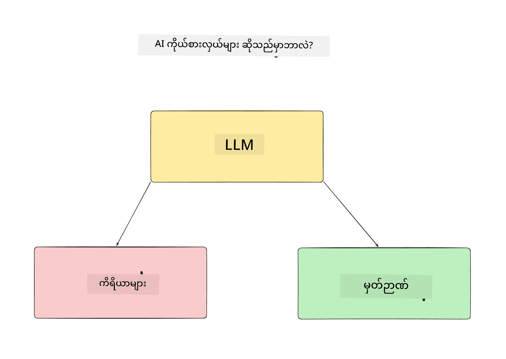
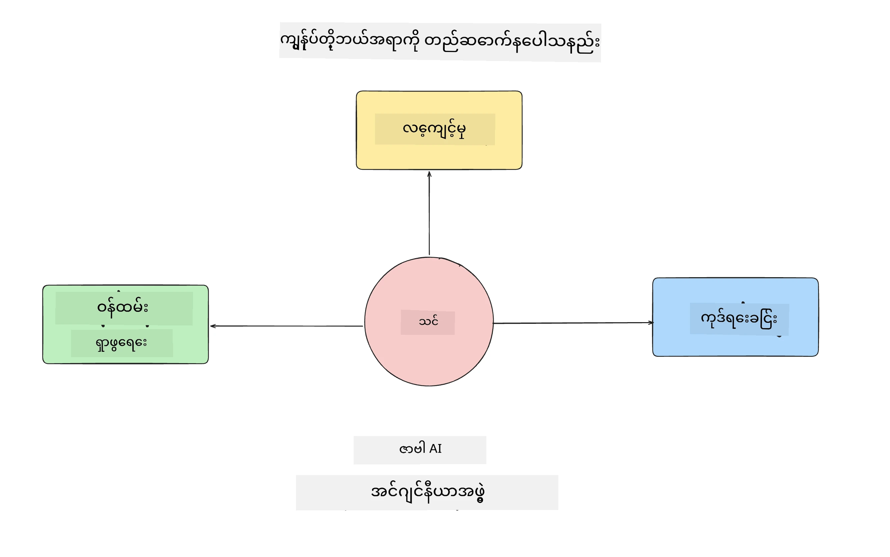
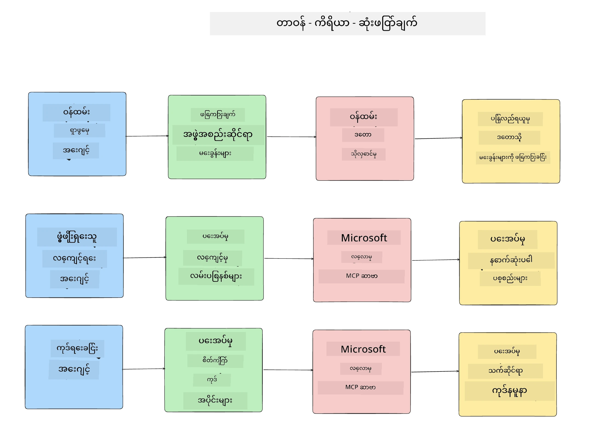
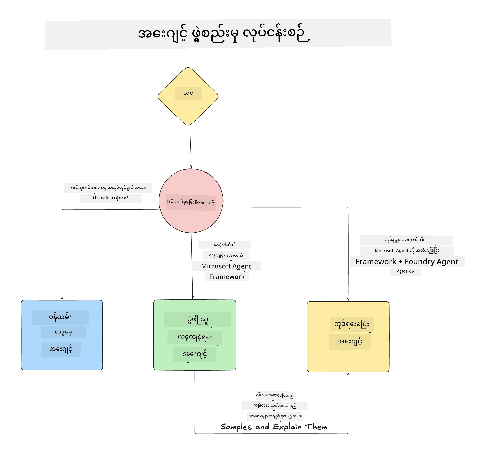

# သင်ခန်းစာ ၁: AI အေးဂျင့်ပုံစံရေးဆွဲခြင်း

"စတင်ကနေ ထုတ်လုပ်မှုသို့ AI အေးဂျင့် တည်ဆောက်ခြင်း သင်တန်း" ၏ ပထမဆုံးသင်ခန်းစာမှ ကြိုဆိုပါသည်!

ဤသင်ခန်းစာတွင် ကျွန်တော်တို့အောက်ပါအကြောင်းအရာများကို ဖော်ပြပါမည်။

- AI အေးဂျင့်များ ဆိုတာ ဘာလဲ ဆိုတာ ဖော်ပြခြင်း
  
- ကျွန်တော်တို့ တည်ဆောက်မည့် AI အေးဂျင့်လျှောက်လွှာကို ဆွေးနွေးခြင်း  

- တစ်ခုချင်းစီသော အေးဂျင့်အတွက် လိုအပ်သော ကိရိယာများနှင့် ဝန်ဆောင်မှုများကို သတ်မှတ်ခြင်း
  
- ကျွန်တော်တို့၏ အေးဂျင့် လျှောက်လွှာကို ဆောက်လုပ်ပုံရေးဆွဲခြင်း
  
စတင်ကြည့်ရအောင် အေးဂျင့်ဆိုတာဘာလဲ၊ ဘာကြောင့်လျှောက်လွှာအတွင်းသုံးမလဲဆိုတာ သတ်မှတ်ခြင်းဖြင့် စတင်ကြပါစို့။

> **သင်တန်းစတင်မတိုင်မှီ။** ပထမဆုံးသင်ခန်းစာသည် အတွေးအခေါ်ဆိုင်ရာဖြစ်ပြီး၊ ကုဒ်မရှိပါ။
> [သင်ခန်းစာ ၂](../lesson-2-agent-development/README.md) မှစ၍ သင့်အား လိုအပ်မည့် အရာများမှာ- **Azure
> subscription** တစ်ခုဖြင့် **Microsoft Foundry** ဝင်ရောက်ခွင့်ရှိပြီး၊ တပ်ဆင်ထားသော **GPT-5 စီးရီး မော်ဒယ်** (ဥပမာ `gpt-5.1` - ရုပ်သိမ်းပြီးသည့် GPT-4o / GPT-4.1 မသုံးရန်), **Python 3.12+**, နှင့် **Azure CLI**
> (`az login`) ဖြစ်ပါသည်။ သင်တန်း README မှာ ဖော်ပြထားသည့် [လိုအပ်ချက်များ](../README.md#what-you-need) နှင့် လင့်ခ်များကို ကြည့်ပါ။

## AI အေးဂျင့်များ ဆိုတာဘာလဲ?

AI အေးဂျင့်တစ်ခုကို ဘယ်လိုသတ်မှတ်ရမလဲဆိုတာ စတင်လေ့လာသည့်အခါ သင်ကိုယ်တိုင်တွင် မေးခွန်းများဖြစ်ပေါ်နိုင်သည်။

AI အေးဂျင့်ဆိုတာကို ပါဝင်ပစၥည္းများအရ ရိုးရှင်းစွာသတ်မှတ်သည်မှာ-

**ကြီးမားသောဘာသာစကားမော်ဒယ်** - LLM သည် အသုံးပြုသူထံမှ သဘာဝဘာသာစကားကို အလုပ်များကို နားလည်ဖွင့်ဆိုရန်နှင့် အဆိုပါအသုံး leverage လုပ်နိုင်သော ကိရိယာများ၏ ဖေါ်ပြချက်များကိုလည်း နားလည်ရန် စွမ်းအားပေးသည်။

**ကိရိယာများ** - ၎င်းတို့သည် လုပ်ဆောင်ချက်များ၊ APIs, ဒေတာသိုလှောင်မှုများနှင့် LLM သုံး၍ အသုံးပြုနိုင်သော အခြားဝန်ဆောင်မှုများ ဖြစ်သည်။

**မှတ်ဉာဏ်** - AI အေးဂျင့်နှင့် အသုံးပြုသူတို့အကြား ဖြစ်သော တိုတောင်းသော ကာလနှင့် ရေရှည် ကာလ ဆက်ဆံမှုများကို သိမ်းဆည်းသည်။ ဤသတင်းအချက်အလက်များကို သိမ်းဆည်းခြင်းနှင့် ရယူခြင်းမှာ တိုးတက်မှုများဆောင်ရန်နှင့် အသုံးပြုသူစိတ်ကြိုက်မှုများကို သိမ်းဆည်းရန် အရေးကြီးသည်။

## ကျွန်တော်တို့၏ AI အေးဂျင့် အသုံးပြုမှုကိစ္စ

ဤသင်တန်းအတွက် ကျွန်တော်တို့သည် နယူးဒီဗယ်လူပါများအား ကျွန်တော်တို့ AI အေးဂျင့် ဖွံ့ဖြိုးတိုးတက်ရေးအဖွဲ့သို့ လာရောက်ပူးပေါင်းနိုင်စေရန် ကူညီပေးမည့် AI အေးဂျင့် လျှောက်လွှာတစ်ခုကို တည်ဆောက်မည်ဖြစ်သည်။

ဖွံ့ဖြိုးရေးအလုပ်များ မလုပ်မီ AI အေးဂျင့်လျှောက်လွှာ အောင်မြင်ဖို့ ရှင်းလင်းထားသော အသုံးပြုသူ အခြေအနေများကို သတ်မှတ်ရခြင်း သည် ပထမဆုံးအဆင့်ဖြစ်သည်။

ဤလျှောက်လွှာအတွက် ကျွန်တော်တို့ အောက်ပါသဘောထားများနှင့် အလုပ်လုပ်မည်။

**အခြေအနေ ၁**: ကုမ္ပဏီအသစ်ဝင်မည့် ဝန်ထမ်းအသစ်သည် ဝန်ထမ်းစည်းရုံးမှုအဖွဲ့နှင့် ဘယ်လို ဆက်သွယ်ရမည်၊ မည်သူများနှင့် ပတ်သက်နေသည်ကို သိလိုသည်။

**အခြေအနေ ၂:** ဝန်ထမ်းအသစ်သည် အလုပ်စတင်ရန် အကောင်းဆုံးတစ်ခုမှတ်တမ်းကို သိလိုသည်။

**အခြေအနေ ၃:** ဝန်ထမ်းအသစ်သည် ဤအလုပ်ကို ပြီးမြောက်ရန် လေ့လာမှုရင်းမြစ်များနှင့် ကုဒ်နမူနာများ စုစည်းလိုသည်။

## ကိရိယာများနှင့် ဝန်ဆောင်မှုများ ထောက်လှမ်းခြင်း

ယခု သဘောထားများကို ရရှိထားပြီးနောက် AI အေးဂျင့်များသည် ဤအလုပ်များကို ပြီးမြောက်ရန် လိုအပ်သည့် ကိရိယာများနှင့် ဝန်ဆောင်မှုများကို အတည်ပြုရမည်။

ဤလုပ်ငန်းစဉ်ကို Context Engineering အပိုင်းအစအဖြစ် ဖြည့်ဆည်းကာ AI အေးဂျင့်များ အလုပ်တတ်မှုကို သတ်မှတ်ပေးရန် အခြေအနေကိုမှန်ကန်စွာ ထားရှိပေးပါမည်။

အခြေအနေတစ်ခုချင်းစီဖြင့် သွားပြီး ကိုယ်စားလှယ်ရေးဆွဲမေးချက်များကို လုပ်ဆောင်ခြင်းဖြင့် အေးဂျင့်တစ်ဦးချင်း စီ၏ တာဝန်၊ ကိရိယာများနှင့် မျှော်မှန်းထားသော အကျိုးအသက်များကို စာရင်းပြုစုပါမည်။

### အခြေအနေ ၁ - ဝန်ထမ်းရှာဖွေမှုပေးသော အေးဂျင့်

**တာဝန်** - ဝန်ထမ်းအသေးစိတ်များ၊ သုံးသပ်ရေးကာလ၊ လက်ရှိအဖွဲ့အစည်း၊ တည်နေရာနှင့် နောက်ဆုံးအလုပ်ရာထူးများနှင့် ပတ်သက်သည့်မေးခွန်းများကို ဖြေကြားပေးခြင်း။

**ကိရိယာများ** - လက်ရှိဝန်ထမ်းစာရင်းနှင့် အဖွဲ့အစည်းဇယား ဒေတာသိုလှောင်မှု

**ရလဒ်များ** - ဒေတာသိုလှောင်မှုမှ အချက်အလက်များ ရယူကာ အဖွဲ့အစည်းပေါ် မေးခွန်းများနှင့် ဝန်ထမ်း ပတ်သက်သော အချက်များကို ဖြေကြားနိုင်စေရန်။

### အခြေအနေ ၂ - လုပ်ငန်းပြင်ဆင် အကြံပေးအေးဂျင့်

**တာဝန်** - ဝန်ထမ်းအသစ်၏ ဖွံ့ဖြိုးသူ အတွေ့အကြုံအပေါ် အခြေခံ၍ ကြိုတင်ဝင်ရောက်လေ့လာနိုင်သည့် ၁-၃ ပြဿနာများကို ရွေးချယ်ပေးခြင်း။

**ကိရိယာများ** - GitHub MCP Server သို့ ဝင်ရောက်ချက်များ ရယူခြင်းနှင့် ဖွံ့ဖြိုးသူ ပရိုဖိုင် ဖန်တီးခြင်း။

**ရလဒ်များ** - GitHub ပရိုဖိုင်၏ နောက်ဆုံး စာရိုက်မှု ၅ ခုကို ဖတ်ခြင်းနှင့် GitHub ပရိုဂရမ်ပေါ်ရှိ ဖွင့်ထားသော ပြဿနာများကို ဖတ်ပြီး ထိုအချက်အလက်များအပေါ် အခြေခံ၍ အကြံပြုနိုင်ခြင်း။

### အခြေအနေ ၃ - ကုဒ်အကူအညီအေးဂျင့်

**တာဝန်** - "လုပ်ငန်းပြင်ဆင် အကြံပေး" အေးဂျင့်အကြံပြုထားသော ဖွင့်ထားသော ပြဿနာများအပေါ် အခြေခံ၍ သုတေသနပြုလုပ်ကာ အရင်းအမြစ်များပေးပြီး ကုဒ်နမူနာများ ထုတ်ပေးခြင်း။

**ကိရိယာများ** - Microsoft Learn MCP ကို သုတေသနအရင်းအမြစ်များ ရှာဖွေရန်နှင့် Code Interpreter ကို ရွေးချယ်သည့် ကုဒ်နမူနာ ဇာတ်ညွှန်းများ ဖန်တီးရန် အသုံးပြုခြင်း။

**ရလဒ်များ** - အသုံးပြုသူ အကူအညီထပ်မံ တောင်းဆိုပါက ဤလုပ်ငန်းစဉ်သည် Learn MCP Server ထံမှ လင့်ခ်များနှင့် နမူနာများပေးပြီး ထို့နောက် Code Interpreter အေးဂျင့်ထံ လက်ခံ၍ အသေးစား ကုဒ်နမူနာများကို ဖန်တီးပေးရန် ရှိရမည်။

## ကျွန်တော်တို့၏ အေးဂျင့်လျှောက်လွှာ ပုံစံရေးဆွဲခြင်း

ယခုအခါ ကျွန်တော်တို့ အေးဂျင့်တိုင်းကို သတ်မှတ်ထားပြီးဖြစ်သောကြောင့် ဤအေးဂျင့်တစ်ခုချင်းစီသည် အလုပ်တူညီမှုအပေါ် အခြေခံ၍ ဘယ်လို လုပ်ဆောင်မည်ကို နားလည်နိုင်ရန် ပုံစံရေးဆွဲသောဆွဲချက်တစ်ခု ဖန်တီးပါမည်။

## နောက်တိုးတက်မှုများ

ယခု အေးဂျင့်များအားလုံးနှင့် အေးဂျင့်စနစ်ကို ပုံစံရေးဆွဲပြီးနောက် နောက်ဦးသင်ခန်းစာသို့ ရှေ့ပြေးဦးစွာ သွားပါမည်၊ ဤအေးဂျင့်များအား တစ်ခုချင်းစီ တိုးတက် ဖွံ့ဖြိုးပါမည်။

---

<!-- CO-OP TRANSLATOR DISCLAIMER START -->
**ပြောကြားချက်**
ဤစာတမ်းကို AI ဘာသာပြန်ဝန်ဆောင်မှု [Co-op Translator](https://github.com/Azure/co-op-translator) အသုံးပြု၍ ဘာသာပြန်ထားပါသည်။ ကျွန်ုပ်တို့သည် တိကျမှန်ကန်မှုအတွက် ကြိုးပမ်းနေသော်လည်း၊ စက်ကိရိယာဘာသာပြန်ခြင်းများတွင် အမှားများ သို့မဟုတ် မှားယွင်းချက်များ ပါဝင်နိုင်ကြောင်း သတိပြုပါရန် လိုအပ်ပါသည်။ မူလစာတမ်းကို မူရင်းဘာသာဖြင့်သာ ယုံကြည်စိတ်ချရသော အချက်အလက်အဖြစ် သတ်မှတ်သင့်သည်။ အရေးကြီးသည့် သတင်းအချက်အလက်များအတွက် ပရော်ဖက်ရှင်နယ် လူသားဘာသာပြန်သူဝန်ဆောင်မှုကို အကြံပြုပါသည်။ ဤဘာသာပြန်ချက်ကို အသုံးပြုခြင်းမှ ဖြစ်ပေါ်လာသော နားလည်မှုကွာခြားမှုများ သို့မဟုတ် မမှန်ကန်သော အသုံးပြုမှုများအတွက် ကျွန်ုပ်တို့ တာဝန်မခံပါ။
<!-- CO-OP TRANSLATOR DISCLAIMER END -->