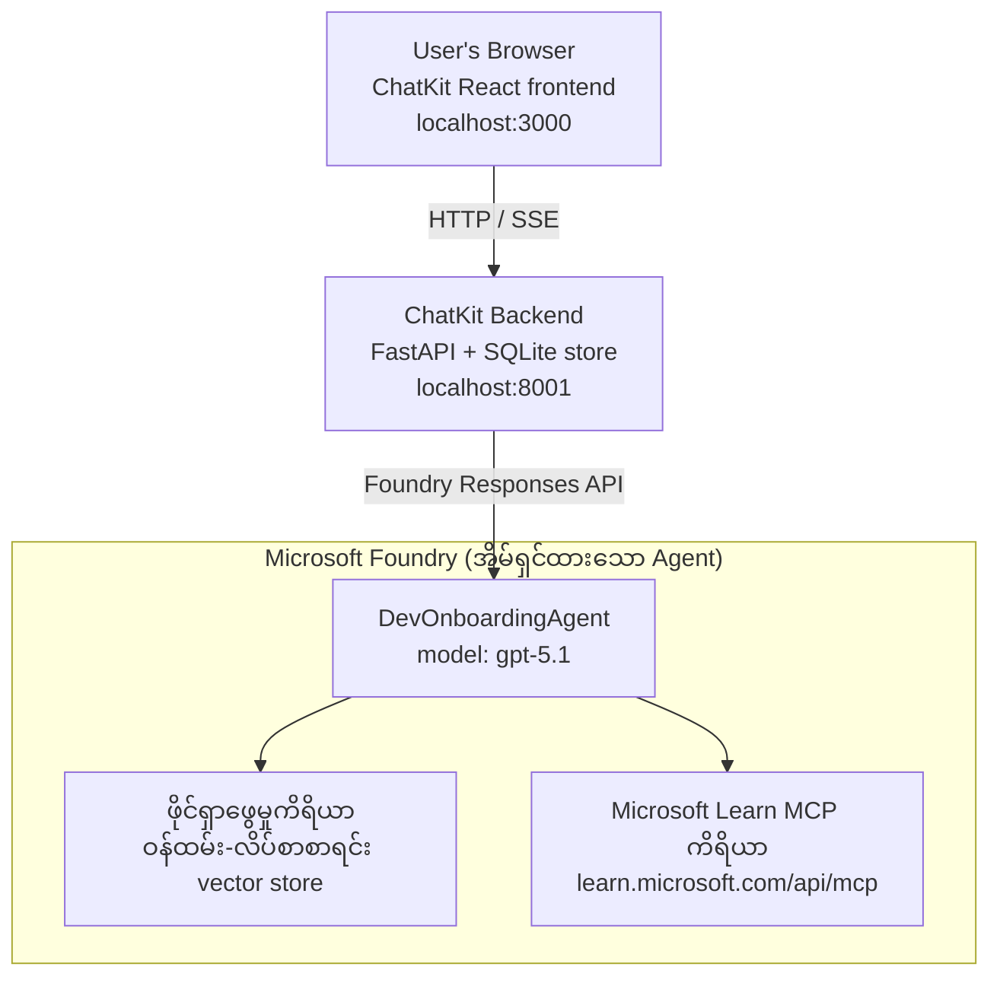

# မသင်ခန်းစာ ၄: Microsoft Foundry Hosted Agents + ChatKit နှင့် Agent တပ်ဆင်ခြင်း

သင်ခန်းစာនេះသည် tool အသုံးပြုသော agent ကို Microsoft Foundry တွင် hosted agent အဖြစ် တပ်ဆင်ပြီး၊ ChatKit-based frontend တစ်ခု ဖန်တီး၍ ၎င်းနှင့် ဆက်သွယ်ပြောဆိုနည်းကို ပြသသည်။

## သဘာဝပုံစံ

Hosted agent သည် **single `DevOnboardingAgent`** တစ်ခုဖြစ်ပြီး (`gpt-5.1` ဖြင့် ထမ်းဆောင်) developer-onboarding မေးခွန်းများကို employee-directory vector store ပေါ်ရှိ **File Search** tool နှင့် **Microsoft Learn MCP** tool ဆိုသော hosted tools နှစ်ခုကို အသုံးပြု၍ ဖြေဆိုသည်။ ChatKit React frontend မှ FastAPI backend နှင့် တွဲဖက်ကာ Foundry **Responses API** ဖြင့် agent ကို ခေါ်ဆိုသည်။



## လိုအပ်ချက်များ

1. North Central US နယ်ပယ်ရှိ **Microsoft Foundry Project**
2. **Azure CLI** သက်ဆိုင်ရာ အကောင့်ဖြင့် လက်မှတ်ရယူပြီး (`az login`)
3. **Azure Developer CLI** (`azd`) ထည့်သွင်းပြီးဖြစ်ရန်
4. **Python 3.12+** နှင့် **Node.js 18+**
5. ဝန်ထမ်း ဒေတာဖြင့် ဖန်တီးထားသော **Vector Store**

## အရင်နှစ်ချက် စတင်လုပ်ဆောင်ခြင်း

### 1. ပတ်ဝန်းကျင် များသော Variable များ သတ်မှတ်ခြင်း

```bash
cd lesson-4-agentdeployment
cp .env.example .env
# သင့် Microsoft Foundry ပရောဂျက်အသေးစိတ်များနှင့် .env ကိုတည်းဖြတ်ပါ
```

### 2. Hosted Agent ကို တပ်ဆင်ခြင်း

**ရွေးချယ်စရာ A: Azure Developer CLI ဖြင့် (အကြံပြု)**

```bash
cd hosted-agent
azd auth login
azd agent deploy
```

**ရွေးချယ်စရာ B: Docker + Azure Container Registry ဖြင့်**

```bash
cd hosted-agent

# ကွန်တိန်နာတည်ဆောက်ပါ
docker build -t developer-onboarding-agent:latest .

# ACR အတွက် တံဆိပ်ကပ်ပါ
docker tag developer-onboarding-agent:latest <your-acr>.azurecr.io/developer-onboarding-agent:latest

# ACR သို့ ဖိပြီးတင်ပါ
az acr login --name <your-acr>
docker push <your-acr>.azurecr.io/developer-onboarding-agent:latest

# Microsoft Foundry ပေါ်တယ် သို့မဟုတ် SDK ဖြင့် ထည့်သွင်းပါ
```

### 3. ChatKit Backend ကို စတင်ခြင်း

```bash
cd chatkit-server
python -m venv .venv
source .venv/bin/activate  # Windows ပေါ်တွင်: .venv\Scripts\activate
pip install -r requirements.txt
python app.py
```

ဆာဗာကို `http://localhost:8001` တွင် စတင်မှုပေးမည်

### 4. ChatKit Frontend ကို စတင်ခြင်း

```bash
cd chatkit-server/frontend
npm install
npm run dev
```

Frontend ကို `http://localhost:3000` တွင် စတင်မှုပေးမည်

### 5. အပလီကေးရှင်းကို စမ်းသပ်ခြင်း

ကိုယ့်အရည်အတွက် `http://localhost:3000` ကို browser တွင် ဖွင့်ပြီး အောက်ပါ မေးခွန်းများကို စမ်းကြည့်ပါ။

**ဝန်ထမ်း ရှာဖွေရေး:**
- "ကျွန်တော်/ကျွန်မ ဒီမှာအသစ်ပါ။ Microsoft မှာ ဘယ်သူလုပ်ခဲ့ဖူးလဲ?"
- "ဘယ်သူ Azure Functions တွေကောင်းကြီး ခံစားမှုရှိလဲ?"

**သင်ကြားမှု အရင်းအမြစ်များ:**
- "Kubernetes အတွက် သင်ကြားမှုလမ်းကြောင်း တစ်ခု ဖန်တီးပါ"
- "cloud architecture အတွက် ဘာ certification တွေ လိုအပ်သလဲ?"

**အပိုင်းလိုက် ကူညီမှု:**
- "CosmosDB နှင့် ချိတ်ဆက်ရင်း Python code ရေးရာ ကူညီပါ"
- "Azure Function ဖန်တီးနည်း ပြပါ"

**မလွဲမှန် Multi-Agent မေးခွန်းများ:**
- "ကျွန်တော်/ကျွန်မ cloud engineer အနေနှင့် စတင်တော့မယ်။ ဘယ်သူနဲ့ဆက်သွယ်ရမလဲ၊ ဘာတွေ သင်ယူသင့်လဲ?"

## Project ဖွဲ့စည်းမှု

```
lesson-4-agentdeployment/
├── .env.example                 # Environment variables template
├── implementation-plan.md       # Detailed implementation guide
├── README.md                    # This file
├── hosted-agent/               # Microsoft Foundry hosted agent
│   ├── main.py                 # Multi-agent workflow implementation
│   ├── requirements.txt        # Python dependencies
│   ├── Dockerfile              # Container definition
│   └── agent.yaml              # Agent deployment configuration
└── chatkit-server/             # ChatKit server application
    ├── app.py                  # FastAPI backend
    ├── store.py                # SQLite persistence layer
    ├── requirements.txt        # Python dependencies
    └── frontend/               # React frontend
        ├── package.json
        ├── vite.config.ts
        ├── tsconfig.json
        ├── index.html
        └── src/
            ├── main.tsx
            ├── App.tsx
            ├── App.css
            └── index.css
```

## Agent နှင့် ၎င်း၏ Tools များ

Hosted agent သည် **single agent** (`DevOnboardingAgent`, `hosted-agent/main.py` ထဲတွင် သတ်မှတ်ထားသော) ဖြစ်ပြီး onboarding domain သုံးခုကို ကိုင်တွယ်သည်။ ထို agent သည် sub-agents များကို ထိန်းချုပ်ခြင်း မပြုဘဲ ၎င်း၏ စွမ်းဆောင်ရည် တစ်ခုချင်းစီကို tool အနေနှင့် ဖော်ပြပေးသည် (သို့မဟုတ် စနစ်အားဖြင့် တိုက်ရိုက် ရည်ညွှန်းသည်)။

| စွမ်းဆောင်ရည် | ပုံစံချထားပုံ | Tool |
|-----------|------------------|------|
| **ဝန်ထမ်း ရှာဖွေရေး & ဆက်သွယ်မှု** | employee-directory vector store ပေါ်ရှိ Foundry hosted File Search | `client.get_file_search_tool(vector_store_ids=[...])` |
| **သင်ယူမှု & လေ့ကျင့်မှု** | Microsoft Learn MCP ဆာဗာ (hosted MCP tool) | `client.get_mcp_tool(url="https://learn.microsoft.com/api/mcp")` |
| **ကုဒ်ရေးခြင်း ကူညီမှု** | `gpt-5.1` model ဖြင့် တိုက်ရိုက် ကိုင်တွယ်သည် — အပြင် tool မရှိ | — |


agent ကို `client.as_agent(name="DevOnboardingAgent", instructions=..., tools=[file_search_tool, learn_mcp_tool])` ဖြင့်ဖန်တီးပြီး `from_agent_framework(agent).run()` ဖြင့်ပေးဆောင်သည်။

> **ဒီဇိုင်းမှတ်စု။** ဤသင်ခန်းစာ၏ မူရင်းပုံစံများတွင် `HandoffBuilder` multi-agent workflow (Triage → specialists) ကို အသုံးပြုခဲ့သည်။ ပို့ဆောင်လိုက်သော agent သည် tool တစ်ခုသာအသုံးပြုသော agent ဖြစ်ပြီး onboarding စတိုင် Q&A များအတွက် ထုတ်လွှင့်ခြင်းနှင့် အတွေးအခေါ်ပိုမိုလွယ်ကူသည်။ multi-agent ကိုယ်စားပြုခြင်းနှင့် handoffs ရလဒ်အတွက် Lesson 2 နှင့် Lesson 3 ကိုကြည့်ပါ။

## Hosted Agent အတွက် Smoke Testing (CI Gate)

Hosted agent ကို "အောင်မြင်စွာ" တပ်ဆင်ခြင်းသည် control plane ၌
ကိန်းသတ်မှတ်ချက်ကိုလက်ခံပြုလုပ် ပြီးဖြစ်သည်ကိုသာ သက်သေပြသည် — agent သည် လက်จริงအဖြေများပေးသည်ဟု **မသက်သေပြပါ။** အကူအညီမရှိခြင်း၊
မကောင်းသောမော်ဒယ်လမ်းညွှန်မှု သို့မဟုတ် ပြီးဆုံးသွားသော ချိတ်ဆက်မှုကြောင့် အဆင်ပြေသော်လည်း အသံမထွက်သော agent ဖြစ်နိုင်သည်။

ဤသင်ခန်းစာသည် အလင်းပေးသောအဆင့်မြင့် **smoke test** တစ်ခုကို ပေးဆောင်ပြီး မြန်မြန်၊ သက်သာသော post-deploy
gate အဖြစ် လုပ်ဆောင်သည်။ ၎င်းသည် [AI Smoke Test](https://github.com/marketplace/actions/ai-smoke-test)
GitHub Action ကို အသုံးပြုကာ agent ၏ Foundry **Responses** endpoint သို့ prompt များကို POST လုပ်သည်
(`POST {project_endpoint}/agents/{agent_name}/endpoint/protocols/openai/responses`)
ပြန်ရရှိသည့်စာသားကို မှန်ကန်မှုစစ်ဆေးသည်။ သက်ဆိုင်ရာတပ်ဆင်ခြင်းပျက်ယွင်းမှုများ၊ auth ပြင်ဆင်မှုများ၊
system-prompt ရွှေ့ပြောင်းမှုနှင့် thread ပျက်ယွင်းမှုများကို စက္ကန့်အတွင်း ဖမ်းဆီးနိုင်သည်။

> Smoke test များသည် [Lesson 3](../lesson-3-agent-evals/README.md) တွင်ရှိသော အပြည့်စုံသုံးသပ်ချက်များကို
> အစားမပြုပါ — ထောက်ပံ့ပစ္စည်းတစ်ခုသာဖြစ်သည်။ Smoke test များမှာ
> *"agent ကိုရောက်ရှိနိုင်ပြီး၊ အဖြေပြန်နိုင်ပြီး၊ အခြေခံ prompt များကိုလိုက်နာနေပါသလား?"* ဆိုသော
> မေးခွန်းကို ဖြေဆိုသည်။ သုံးသပ်ချက်များမှာ *"အဖြေကဘယ်လိုကောင်းသနည်း?"* ဆိုသည်ကိုဖြေဆိုသည်။ နိုင်ငံတကာရှိ


ကတ်ချက်ပုံစံသည် [`hosted-agent/tests/smoke-tests.json`](../../../lesson-4-agentdeployment/hosted-agent/tests/smoke-tests.json) တွင်ရှိပြီး


| စမ်းသပ်မှု | ဘာကို အတည်ပြုသည် |
|------|------------------|
| `reachability` | Agent အား မဝင်ကြွားသော၊ scope အတွင်းစာသားဖြင့် ပြန်ကြားသည် |
| `employee-search` | File-search domain သည် ကျန်းမာသော `200` မှတစ်ခု ပြန်ဆိုသည် (တုံ့ပြန်မှုသည် data ကိုအခြေခံသည်) |
| `learning-path` | Learning domain သည် ခေါင်းစဉ်ကို ပြန်ဆိုပြီး လမ်းကြောင်းပုံစံဖြေရှင်းချက် ထုတ်ပေးသည် |
| `coding-assistance` | Coding domain သည် Python code ပုံစံဖြစ်သောအဖြေ ပြန်ပေးသည် |
| `prompt-adherence-offtopic` | အကြောင်းမဆိုင်သော တောင်းဆိုမှုကို နှိုင်းယှဉ်လိုက်ပြီး အသေးစိတ်ဖြေမပေးပါ |


[`.github/workflows/smoke-test-hosted-agent.yml`](../../../.github/workflows/smoke-test-hosted-agent.yml) တွင် workflow သည် အလုပ်နှစ်ခုပါရှိသည် -

- **`static`** — မြန်ဆန်ပြီး Azure မလိုအပ်သော gate ဖြစ်ပြီး pull request နှင့် push တစ်ခုချင်းစီတွင် ပြေးဆွဲသည် -
  Python source ဖိုင်များအားလုံးကို `py_compile` ဖြင့် ဖွဲ့စည်းပြီး Markdown link များကို စစ်ဆေးသည်။ လျှို့ဝှက်ချက်လိုအပ်မှုမရှိပါ,
  ထို့ကြောင့် fork PR များတွင်လည်း လုပ်ဆောင်နိုင်သည်။
- **`smoke`** — အောက်ပါ Azure ဆက်သွယ်ထားသော smoke test ဖြစ်သည်၊ လိုက်လံလိုက်နာ၍
  (Actions → **Agent CI (static + smoke)** → Run workflow) သို့ ပြေးနိုင်ပြီး သင့် deploy workflow
  ပြီးနောက် ဆက်လက် လက်တွဲနိုင်သည်။

Smoke job အတွက် သိုလှောင်တိုက် **variables** နှင့် **secrets** များကို ပြင်ဆင်ပါ -


| အမျိုးအစား | အမည် | တန်ဖိုး |
|------|------|-------|

| Variable | `FOUNDRY_PROJECT_ENDPOINT` | `https://<account>.services.ai.azure.com/api/projects/<project>` |
| Variable | `HOSTED_AGENT_NAME` | တပ်ဆင်ထားသော အေးဂျင့်အမည် (ဥပမာ `dev-onboarding` — သင့်တပ်ဆင်မှုနှင့် ကိုက်ညီရမည်) |
| Secret | `AZURE_CLIENT_ID` / `AZURE_TENANT_ID` / `AZURE_SUBSCRIPTION_ID` | `azure/login` အတွက် OIDC ပေါင်းစည်းသော အထောက်အထား |

Runner identity သည် **Foundry project scope** အတွင်း **`Azure AI User`** အခန်းကဏ္ဍ ရရှိထားသင့်သည်၊
ထို့ကြောင့် Responses (နှင့် ဆွေးနွေးပွဲများ) data-plane endpoints ကို ခေါ်နိုင်သည်။ အောက်ပါအတိုင်း အခွင့်အရေးပေးပါ။

```bash
az role assignment create \
  --assignee <object-id-or-appId-of-runner-identity> \
  --role "Azure AI User" \
  --scope "/subscriptions/<sub>/resourceGroups/<rg>/providers/Microsoft.CognitiveServices/accounts/<account>/projects/<project>"
```

### ဒါကို ကိုယ့်ကွန်ပြူတာပေါ်မှာ ပြေးဆွဲပါ

အဲ့ဒီ catalog ကို စနစ်တက်မြှုပ်မတင်မီ ကိုယ်တိုင်ပြေးနိုင်ပါတယ်။ `https://ai.azure.com/` ထဲမှာ 
data-plane token ကို ရယူပြီး သင့်တပ်ဆင်မှုထံ runner ကို ဦးတည်ပါ။

```bash
# Audience သည် https://ai.azure.com/ ဖြစ်ရမည် (cognitiveservices.azure.com tokens များကို ငြင်းပယ်ထားသည်)
export FOUNDRY_TOKEN=$(az account get-access-token --resource https://ai.azure.com/ --query accessToken -o tsv)

git clone https://github.com/JFolberth/ai-smoketest && cd ai-smoketest
python runner.py \
  --project-endpoint "https://<account>.services.ai.azure.com/api/projects/<project>" \
  --agent-name dev-onboarding \
  --tests-file ../lesson-4-agentdeployment/hosted-agent/tests/smoke-tests.json
```

ထွက်ခွာကုဒ်များ - `0` အားလုံးအောင်မြင်သည်၊ `1` လုပ်ဆောင်မှုတစ်ခုခု မအောင်မြင်ပါ၊ `2` runner အမှား (catalog မမှန်/ token မမှန်)။

## ပြဿနာဖြေရှင်းခြင်း

### အေးဂျင့် မတုံ့ပြန်ခြင်း
- Hosted agent သည် Microsoft Foundry မှာ တပ်ဆင်ထားပြီး ပြေးနေကြောင်း စစ်ဆေးပါ
- `HOSTED_AGENT_NAME` နဲ့ `HOSTED_AGENT_VERSION` သည် သင့်တပ်ဆင်မှုနှင့် ကိုက်ညီကြောင်း စစ်ဆေးပါ

### Vector store အမှားများ
- `VECTOR_STORE_ID` ကို မှန်ကန်စွာ သတ်မှတ်ထားကြောင်း သေချာပါစေ
- Vector store တစ်ခုတွင် ဝန်ထမ်း ဒေတာ ပါဝင်ကြောင်း သေချာစစ်ဆေးပါ

### အတည်ပြုမှု အမှားများ
- `az login` ကို ပြေးပြီးလက်မှတ်များ ပြန်လည်အသစ်လုပ်ပါ
- Microsoft Foundry project ကို အကွောင့္ပြုခွင့် ရှိကြောင်း သေချာပါစေ

## အရင်းအမြစ်များ

- [Microsoft Foundry Hosted Agents Documentation](https://learn.microsoft.com/en-us/azure/ai-foundry/agents/concepts/hosted-agents)
- [Microsoft Agent Framework](https://github.com/microsoft/agent-framework)
- [ChatKit Integration Sample](https://github.com/microsoft/agent-framework/tree/main/python/samples/demos/chatkit-integration)
- [Azure Developer CLI](https://learn.microsoft.com/en-us/azure/developer/azure-developer-cli/overview)
- [AI Smoke Test GitHub Action](https://github.com/marketplace/actions/ai-smoke-test)
- [Smoke Test Microsoft Foundry Agents with GitHub Actions (blog)](https://techcommunity.microsoft.com/blog/azuredevcommunityblog/smoke-test-microsoft-foundry-agents-with-github-actions/4531912)

---

## နောက်တစ်ဆင့်များ

သင့် အေးဂျင့်သည် Microsoft စီမံအုပ်ချုပ်သော အင်ဖရာပလက်ဖောင်းပေါ်တွင် ပြေးဆဲဖြစ်သည်။ အမှုစစ်ထုတ်လိုပါက—
၎င်း၏ ဒေတာ လွှဲပြောင်းရာနေရာကို ထိန်းချုပ်ခြင်း (ဒေတာအိမ်မြှောင်ခြင်း၊ ပုန်းထားကွန်ရက်၊ ကိုယ်ပိုင် Azure
Cosmos DB / Storage / AI Search ကို တပ်ဆင်ခြင်း) နှင့် ၎င်း၏ကိရိယာများကို အုပ်ချုပ်ခြင်း အတွက်
**[အတန်း ၅: ထုတ်ကုန်အဆင့် Hosted Agents](../lesson-5-hosted-agents-production/README.md)** ကို ဆက်လက်ပါ၊
**Hosted Agents** နှင့် **Capability Hosts** ၏ အရေးကြီးသော ကွာခြားချက်များကို ရှင်းလင်းပြထားသည်။

---

<!-- CO-OP TRANSLATOR DISCLAIMER START -->
**ပြောကြားချက်**
ဤစာတမ်းကို AI ဘာသာပြန်ဝန်ဆောင်မှု [Co-op Translator](https://github.com/Azure/co-op-translator) အသုံးပြု၍ ဘာသာပြန်ထားပါသည်။ ကျွန်ုပ်တို့သည် တိကျမှန်ကန်မှုအတွက် ကြိုးပမ်းနေသော်လည်း၊ စက်ကိရိယာဘာသာပြန်ခြင်းများတွင် အမှားများ သို့မဟုတ် မှားယွင်းချက်များ ပါဝင်နိုင်ကြောင်း သတိပြုပါရန် လိုအပ်ပါသည်။ မူလစာတမ်းကို မူရင်းဘာသာဖြင့်သာ ယုံကြည်စိတ်ချရသော အချက်အလက်အဖြစ် သတ်မှတ်သင့်သည်။ အရေးကြီးသည့် သတင်းအချက်အလက်များအတွက် ပရော်ဖက်ရှင်နယ် လူသားဘာသာပြန်သူဝန်ဆောင်မှုကို အကြံပြုပါသည်။ ဤဘာသာပြန်ချက်ကို အသုံးပြုခြင်းမှ ဖြစ်ပေါ်လာသော နားလည်မှုကွာခြားမှုများ သို့မဟုတ် မမှန်ကန်သော အသုံးပြုမှုများအတွက် ကျွန်ုပ်တို့ တာဝန်မခံပါ။
<!-- CO-OP TRANSLATOR DISCLAIMER END -->