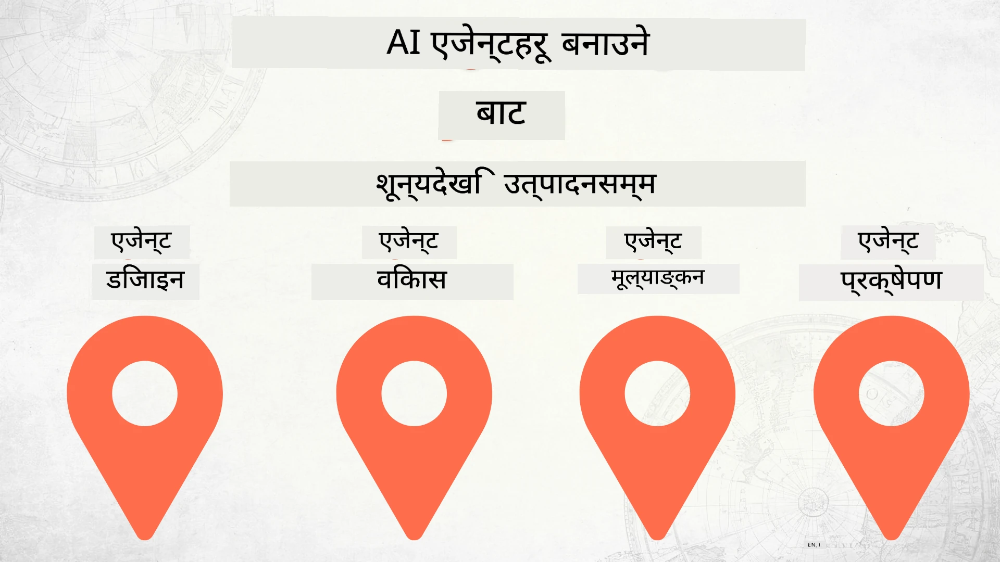

# शून्यबाट उत्पादनसम्म AI एजेन्टहरू निर्माण गर्नुहोस्



### 🌐 बहुभाषीय समर्थन

#### GitHub Action मार्फत समर्थित (स्वचालित र सधैं अद्यावधिक)

<!-- CO-OP TRANSLATOR LANGUAGES TABLE START -->
[अरेबिक](../ar/README.md) | [बंगाली](../bn/README.md) | [बुल्गेरियन](../bg/README.md) | [बर्मी (म्यानमार)](../my/README.md) | [चिनियाँ (सरलीकृत)](../zh-CN/README.md) | [चिनियाँ (परम्परागत, हङ कङ)](../zh-HK/README.md) | [चिनियाँ (परम्परागत, मकाओ)](../zh-MO/README.md) | [चिनियाँ (परम्परागत, ताइवान)](../zh-TW/README.md) | [क्रोशियाई](../hr/README.md) | [चेक](../cs/README.md) | [डेनिश](../da/README.md) | [डच](../nl/README.md) | [एस्टोनियाली](../et/README.md) | [फिनिश](../fi/README.md) | [फ्रेन्च](../fr/README.md) | [जर्मन](../de/README.md) | [ग्रीक](../el/README.md) | [हेब्रू](../he/README.md) | [हिन्दी](../hi/README.md) | [हंगेरीयन](../hu/README.md) | [इन्डोनेसियन](../id/README.md) | [इटालियन](../it/README.md) | [जापानी](../ja/README.md) | [कन्नड](../kn/README.md) | [खमेर](../km/README.md) | [कोरियन](../ko/README.md) | [लिथुआनियाली](../lt/README.md) | [मलय](../ms/README.md) | [मलयालम](../ml/README.md) | [मराठी](../mr/README.md) | [नेपाली](./README.md) | [नाइजेरियन पिजिन](../pcm/README.md) | [नर्वेजियन](../no/README.md) | [फारसी (पर्शियन)](../fa/README.md) | [पोलिश](../pl/README.md) | [पोर्तुगाली (ब्राजिल)](../pt-BR/README.md) | [पोर्तुगाली (पोर्तुगल)](../pt-PT/README.md) | [पंजाबी (गुरुमुखी)](../pa/README.md) | [रोमानियन](../ro/README.md) | [रूसी](../ru/README.md) | [सर्बियाली (सिरिलिक)](../sr/README.md) | [स्लोभाक](../sk/README.md) | [स्लोभेनियाली](../sl/README.md) | [स्पेनी](../es/README.md) | [स्वाहिली](../sw/README.md) | [स्विडिश](../sv/README.md) | [टागालोग (फिलिपिनो)](../tl/README.md) | [तमिल](../ta/README.md) | [तेलुगु](../te/README.md) | [थाई](../th/README.md) | [टर्किश](../tr/README.md) | [युक्रेनी](../uk/README.md) | [उर्दू](../ur/README.md) | [भियतनामी](../vi/README.md)

> **स्थानीय रूपमा क्लोन गर्न प्राथमिकता दिनुहुन्छ?**
>
> यस रिपोजिटरीमा ५०+ भाषा अनुवादहरू समावेश छन् जसले डाउनलोड साइजलाई धेरै बढाउँछ। अनुवादहरू बिना क्लोन गर्न, sparse checkout प्रयोग गर्नुहोस्:
>
> **Bash / macOS / Linux:**
> ```bash
> git clone --filter=blob:none --sparse https://github.com/microsoft/Building-AI-Agents-From-Zero-To-Production.git
> cd Building-AI-Agents-From-Zero-To-Production
> git sparse-checkout set --no-cone '/*' '!translations' '!translated_images'
> ```
>
> **CMD (Windows):**
> ```cmd
> git clone --filter=blob:none --sparse https://github.com/microsoft/Building-AI-Agents-From-Zero-To-Production.git
> cd Building-AI-Agents-From-Zero-To-Production
> git sparse-checkout set --no-cone "/*" "!translations" "!translated_images"
> ```
>
> यसले तपाईलाई छिटो डाउनलोडको साथ पाठ्यक्रम पूरा गर्न आवश्यक सबै सामग्री प्रदान गर्दछ।
<!-- CO-OP TRANSLATOR LANGUAGES TABLE END -->

## एआई एजेन्ट विकास जीवनचक्रका आधारभूत सिद्धान्तहरू सिकाउने कोर्स

[](https://github.com/microsoft/Building-AI-Agents-From-Zero-To-Production/blob/master/LICENSE?WT.mc_id=academic-105485-koreyst)
[](https://GitHub.com/microsoft/Building-AI-Agents-From-Zero-To-Production/graphs/contributors/?WT.mc_id=academic-105485-koreyst)
[](https://GitHub.com/microsoft/Building-AI-Agents-From-Zero-To-Production/issues/?WT.mc_id=academic-105485-koreyst)
[](https://GitHub.com/microsoft/Building-AI-Agents-From-Zero-To-Production/pulls/?WT.mc_id=academic-105485-koreyst)
[](http://makeapullrequest.com?WT.mc_id=academic-105485-koreyst)

[](https://discord.gg/Kuaw3ktsu6)

## 🌱 सुरु गर्न

यस कोर्समा AI एजेन्टहरू निर्माण र परिनियोजन गर्ने आधारभूत कुरा सिकाइन्छ।

प्रत्येक पाठले अघिल्लो पाठमा आधारित हुन्छ, त्यसैले हामी सुरुबाटै सुरु गरी अन्त्यसम्म जान सिफारिस गर्दछौं।

यदि तपाईं AI एजेन्ट विषयहरूमा धेरै जान्न चाहनुहुन्छ भने, तपाईं [AI एजेन्टहरूका लागि शुरुआत गर्ने कोर्स](https://aka.ms/ai-agents-beginners) जाँच्न सक्नुहुन्छ।

### अन्य सिक्नेहरु भेट्नुहोस्, तपाईंका प्रश्नहरूको उत्तर प्राप्त गर्नुहोस्

यदि तपाईं आलमल्लिनु भयो वा AI एजेन्टहरू निर्माण बारे कुनै प्रश्न छ भने, हाम्रो विशेष Discord च्यानल [Microsoft Foundry Discord](https://discord.gg/Kuaw3ktsu6) मा सामेल हुनुहोस्।

### के तपाईंलाई चाहिन्छ

प्रत्येक पाठसँग आफ्नो कोड नमूना छ जुन तपाईं स्थानीय रूपमा चलाउन सक्नुहुन्छ। तपाईं [यस रिपो फोर्क](https://github.com/microsoft/Building-AI-Agents-From-Zero-To-Production/fork) गरेर आफ्नो प्रतिलिपि बनाउन सक्नुहुन्छ।

यस कोर्सले हाल निम्न प्रयोग गर्दछ:

- [Microsoft एजेन्ट फ्रेमवर्क (MAF)](https://aka.ms/ai-agents-beginners/agent-framework)
- [Microsoft Foundry](https://azure.microsoft.com/products/ai-foundry)
- [Azure OpenAI सेवा](https://azure.microsoft.com/products/ai-foundry/models/openai)
- [Azure CLI](https://learn.microsoft.com/cli/azure/authenticate-azure-cli?view=azure-cli-latest)

कृपया सुरु गर्नु अघि यी सेवाहरूको पहुँच सुनिश्चित गर्नुहोस्।

मोडेल होस्टिंग र सेवाहरू सम्बन्धि थप विकल्पहरू चाँडै आउनेछन्।

## 🗃️ पाठहरू

| **पाठ**             | **विवरण**                                                                                             |
|--------------------|-------------------------------------------------------------------------------------------------------|
| [एजेन्ट डिजाइन](./lesson-1-agent-design/README.md)       | हाम्रो "डेभलपर अनबोर्डिङ" एजेन्ट प्रयोग मामिला र प्रभावकारी एजेन्टहरू डिजाइन कसरी गर्ने बारे परिचय  |
| [एजेन्ट विकास](./lesson-2-agent-development/README.md)  | माइक्रोसफ्ट एजेन्ट फ्रेमवर्क (MAF) प्रयोग गरी नयाँ विकासकर्ताहरूको लागि ३ एजेन्टहरू सिर्जना गर्नुहोस्।  |
| [एजेन्ट मूल्याङ्कन](./lesson-3-agent-evals/README.md)  | Microsoft Foundry प्रयोग गरेर हाम्रा AI एजेन्टहरू कति राम्रो प्रदर्शन गर्दैछन् र कसरी सुधार गर्ने।          |
| [एजेन्ट परिनियोजन](./lesson-4-agent-deployment/README.md)   | होस्टेड एजेन्ट र OpenAI Chatkit प्रयोग गरेर AI एजेन्टलाई उत्पादनमा कसरी परिनियोजन गर्ने।               |


## 🎒 अन्य कोर्सहरू

हाम्रो टोलीले अन्य कोर्सहरू पनि उत्पादन गर्छ! जाँच गर्नुस्:

<!-- CO-OP TRANSLATOR OTHER COURSES START -->
### LangChain
[](https://aka.ms/langchain4j-for-beginners)
[](https://aka.ms/langchainjs-for-beginners?WT.mc_id=m365-94501-dwahlin)
[](https://github.com/microsoft/langchain-for-beginners?WT.mc_id=m365-94501-dwahlin)
---

### Azure / Edge / MCP / Agents
[](https://github.com/microsoft/AZD-for-beginners?WT.mc_id=academic-105485-koreyst)
[](https://github.com/microsoft/edgeai-for-beginners?WT.mc_id=academic-105485-koreyst)
[](https://github.com/microsoft/mcp-for-beginners?WT.mc_id=academic-105485-koreyst)
[](https://github.com/microsoft/ai-agents-for-beginners?WT.mc_id=academic-105485-koreyst)

---
 
### Generative AI Series
[](https://github.com/microsoft/generative-ai-for-beginners?WT.mc_id=academic-105485-koreyst)
[-9333EA?style=for-the-badge&labelColor=E5E7EB&color=9333EA)](https://github.com/microsoft/Generative-AI-for-beginners-dotnet?WT.mc_id=academic-105485-koreyst)
[-C084FC?style=for-the-badge&labelColor=E5E7EB&color=C084FC)](https://github.com/microsoft/generative-ai-for-beginners-java?WT.mc_id=academic-105485-koreyst)
[-E879F9?style=for-the-badge&labelColor=E5E7EB&color=E879F9)](https://github.com/microsoft/generative-ai-with-javascript?WT.mc_id=academic-105485-koreyst)

---
 
### कोर शिक्षा
[](https://aka.ms/ml-beginners?WT.mc_id=academic-105485-koreyst)
[](https://aka.ms/datascience-beginners?WT.mc_id=academic-105485-koreyst)
[](https://aka.ms/ai-beginners?WT.mc_id=academic-105485-koreyst)
[](https://github.com/microsoft/Security-101?WT.mc_id=academic-96948-sayoung)
[](https://aka.ms/webdev-beginners?WT.mc_id=academic-105485-koreyst)
[](https://aka.ms/iot-beginners?WT.mc_id=academic-105485-koreyst)
[](https://github.com/microsoft/xr-development-for-beginners?WT.mc_id=academic-105485-koreyst)

---
 
### Copilot श्रृंखला
[](https://aka.ms/GitHubCopilotAI?WT.mc_id=academic-105485-koreyst)
[](https://github.com/microsoft/mastering-github-copilot-for-dotnet-csharp-developers?WT.mc_id=academic-105485-koreyst)
[](https://github.com/microsoft/CopilotAdventures?WT.mc_id=academic-105485-koreyst)
<!-- CO-OP TRANSLATOR OTHER COURSES END -->

## योगदान

यो परियोजनाले योगदान र सुझावहरूलाई स्वागत गर्दछ। अधिकांश योगदानहरूका लागि तपाईंले योगदानकर्ताको लाइसेन्स सम्झौता (CLA) मा सहमति जनाउनुपर्छ जुन तपाईंलाई तपाईंको योगदान प्रयोग गर्ने अधिकार दिने कुरा पुष्टि गर्छ। थप जानकारीका लागि भ्रमण गर्नुहोस् <https://cla.opensource.microsoft.com>।

जब तपाईंले पुल अनुरोध पेश गर्नुहुन्छ, CLA बोटले स्वचालित रूपमा निर्धारण गर्दछ कि तपाईंलाई CLA आवश्यक छ वा छैन र PR लाई उपयुक्त रूपमा चिन्हित गर्दछ (जस्तै, स्थिति जाँच, टिप्पणी)। बोटले दिएको निर्देशनहरूलाई पालना गर्नुहोस्। तपाईंले हाम्रो CLA प्रयोग गर्ने सबै रिपोजहरूमा एकपटक मात्र यो गर्नुपर्छ।

यस परियोजनाले [Microsoft Open Source Code of Conduct](https://opensource.microsoft.com/codeofconduct/) अपनाएको छ। थप जानकारीका लागि हेर्नुहोस् [Code of Conduct FAQ](https://opensource.microsoft.com/codeofconduct/faq/) वा कुनै अतिरिक्त प्रश्न वा टिप्पणीहरूको लागि [opencode@microsoft.com](mailto:opencode@microsoft.com) मा सम्पर्क गर्नुहोस्।

## ट्रेडमार्कहरू

यस परियोजनामा परियोजनाहरू, उत्पादनहरू, वा सेवाहरूका ट्रेडमार्कहरू वा लोगोहरू हुन सक्छन्। Microsoft ट्रेडमार्क वा लोगोहरूको आधिकारिक प्रयोग यसमा उल्लेखित र पालन गर्नुपर्नेछ
[Microsoft's Trademark & Brand Guidelines](https://www.microsoft.com/legal/intellectualproperty/trademarks/usage/general) अनुसार।
यस परियोजनाका परिवर्तित संस्करणहरूमा Microsoft ट्रेडमार्क वा लोगोहरूको प्रयोगले भ्रम उत्पन्न गर्नु वा Microsoft प्रायोजन संकेत गर्नु हुँदैन।
तेस्रो पक्षका ट्रेडमार्क वा लोगोहरूको कुनै पनि प्रयोग तिनका नीति अनुसार हुनुपर्छ।

## मद्दत लिनुहोस्

यदि तपाईं अड्कनु भएको छ वा AI अनुप्रयोगहरू निर्माण बारे कुनै प्रश्न छ भने, सामेल हुनुहोस्:

[](https://discord.gg/Kuaw3ktsu6)

यदि तपाईंलाई उत्पादन प्रतिक्रिया वा निर्माणका क्रममा त्रुटि भएमा भ्रमण गर्नुहोस्:

[](https://aka.ms/foundry/forum)

---

<!-- CO-OP TRANSLATOR DISCLAIMER START -->
**अस्वीकरण**:  
यस दस्तावेजलाई AI अनुवाद सेवा [Co-op Translator](https://github.com/Azure/co-op-translator) प्रयोग गरी अनुवाद गरिएको हो। हामी सटीकताको प्रयास गर्छौं, तर कृपया सम्झनुहोस् कि स्वचालित अनुवादमा त्रुटि वा अशुद्धता हुन सक्छ। मूल दस्तावेज यसको मूल भाषामा आधिकारिक स्रोत मानिनुपर्छ। महत्वपूर्ण जानकारीको लागि व्यावसायिक मानव अनुवाद सुझाइएको छ। यस अनुवादको प्रयोगबाट उत्पन्न कुनै पनि गलतफहमी वा गलत व्याख्याको लागि हामी जिम्मेवार छैनौं।
<!-- CO-OP TRANSLATOR DISCLAIMER END -->