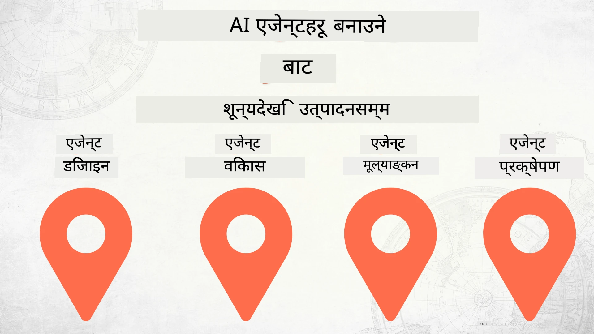

# शून्यदेखि उत्पादनसम्म एआई एजेन्टहरू बनाउने



### 🌐 बहुभाषी समर्थन

#### GitHub Action मार्फत समर्थित (स्वचालित र सँधै अद्यावधिक)

<!-- CO-OP TRANSLATOR LANGUAGES TABLE START -->
[Arabic](../ar/README.md) | [Bengali](../bn/README.md) | [Bulgarian](../bg/README.md) | [Burmese (Myanmar)](../my/README.md) | [Chinese (Simplified)](../zh-CN/README.md) | [Chinese (Traditional, Hong Kong)](../zh-HK/README.md) | [Chinese (Traditional, Macau)](../zh-MO/README.md) | [Chinese (Traditional, Taiwan)](../zh-TW/README.md) | [Croatian](../hr/README.md) | [Czech](../cs/README.md) | [Danish](../da/README.md) | [Dutch](../nl/README.md) | [Estonian](../et/README.md) | [Finnish](../fi/README.md) | [French](../fr/README.md) | [German](../de/README.md) | [Greek](../el/README.md) | [Hebrew](../he/README.md) | [Hindi](../hi/README.md) | [Hungarian](../hu/README.md) | [Indonesian](../id/README.md) | [Italian](../it/README.md) | [Japanese](../ja/README.md) | [Kannada](../kn/README.md) | [Khmer](../km/README.md) | [Korean](../ko/README.md) | [Lithuanian](../lt/README.md) | [Malay](../ms/README.md) | [Malayalam](../ml/README.md) | [Marathi](../mr/README.md) | [Nepali](./README.md) | [Nigerian Pidgin](../pcm/README.md) | [Norwegian](../no/README.md) | [Persian (Farsi)](../fa/README.md) | [Polish](../pl/README.md) | [Portuguese (Brazil)](../pt-BR/README.md) | [Portuguese (Portugal)](../pt-PT/README.md) | [Punjabi (Gurmukhi)](../pa/README.md) | [Romanian](../ro/README.md) | [Russian](../ru/README.md) | [Serbian (Cyrillic)](../sr/README.md) | [Slovak](../sk/README.md) | [Slovenian](../sl/README.md) | [Spanish](../es/README.md) | [Swahili](../sw/README.md) | [Swedish](../sv/README.md) | [Tagalog (Filipino)](../tl/README.md) | [Tamil](../ta/README.md) | [Telugu](../te/README.md) | [Thai](../th/README.md) | [Turkish](../tr/README.md) | [Ukrainian](../uk/README.md) | [Urdu](../ur/README.md) | [Vietnamese](../vi/README.md)

> **स्थानीय रूपमा क्लोन गर्न चाहनुहुन्छ?**
>
> यस रिपोजिटरीमा ५० भन्दा बढी भाषा अनुवादहरू समावेश गरिएको छ जसले डाउनलोड आकारमा उल्लेखनीय वृद्धि गर्छ। अनुवाद बिना क्लोन गर्न, sparse checkout प्रयोग गर्नुहोस्:
>
> **Bash / macOS / Linux:**
> ```bash
> git clone --filter=blob:none --sparse https://github.com/microsoft/Building-AI-Agents-From-Zero-To-Production.git
> cd Building-AI-Agents-From-Zero-To-Production
> git sparse-checkout set --no-cone '/*' '!translations' '!translated_images'
> ```
>
> **CMD (Windows):**
> ```cmd
> git clone --filter=blob:none --sparse https://github.com/microsoft/Building-AI-Agents-From-Zero-To-Production.git
> cd Building-AI-Agents-From-Zero-To-Production
> git sparse-checkout set --no-cone "/*" "!translations" "!translated_images"
> ```
>
> यसले तपाईंलाई कोर्स पूरा गर्न आवश्यक सबै कुरा छिटो डाउनलोडसहित प्रदान गर्छ।
<!-- CO-OP TRANSLATOR LANGUAGES TABLE END -->

## एआई एजेन्ट विकास जीवनचक्रका आधारहरू सिकाउने कोर्स

[](https://github.com/microsoft/Building-AI-Agents-From-Zero-To-Production/blob/master/LICENSE?WT.mc_id=academic-105485-koreyst)
[](https://GitHub.com/microsoft/Building-AI-Agents-From-Zero-To-Production/graphs/contributors/?WT.mc_id=academic-105485-koreyst)
[](https://GitHub.com/microsoft/Building-AI-Agents-From-Zero-To-Production/issues/?WT.mc_id=academic-105485-koreyst)
[](https://GitHub.com/microsoft/Building-AI-Agents-From-Zero-To-Production/pulls/?WT.mc_id=academic-105485-koreyst)
[](http://makeapullrequest.com?WT.mc_id=academic-105485-koreyst)

[](https://discord.gg/Kuaw3ktsu6)

## 🌱 आरम्भ कसरी गर्ने

यो कोर्सले AI एजेन्टहरू निर्माण र विकास गर्ने आधारभूत अवधारणाहरू समेट्छ।

हरेक पाठले अघिल्लो पाठलाई आधार मान्छ, त्यसैले हामी सिफारिस गर्छौं कि तपाईं सुरुबाट सुरु गरेर अन्तसम्म पढ्नुहोस्।

यदि तपाईं AI एजेन्ट विषयहरूमा अझ बढी खोजी गर्न चाहनुहुन्छ भने, तपाईं [AI एजेन्टहरूका लागि शुरुआतीहरूको कोर्स](https://aka.ms/ai-agents-beginners) हेर्न सक्नुहुन्छ।

### अन्य सिक्नेहरूलाई भेट्नुहोस्, तपाईंका प्रश्नहरूको उत्तर पाउनुहोस्

यदि तपाईं फसेका हुनुहुन्छ वा AI एजेन्टहरू बनाउने बारे कुनै प्रश्न छ भने, हाम्रो समर्पित Discord च्यानल [Microsoft Foundry Discord](https://discord.gg/Kuaw3ktsu6) मा सामेल हुनुहोस्।

### तपाईंलाई के आवश्यक छ


प्रत्येक पाठसँग आफ्नै कोड नमुना हुन्छ जुन तपाईं स्थानीय रूपमा चलाउन सक्नुहुन्छ। तपाईं आफ्नो प्रतिलिपि बनाउन [यस रिपोfork गर्नुहोस्](https://github.com/microsoft/Building-AI-Agents-From-Zero-To-Production/fork)।

यो कोर्स हाल निम्नलिखित प्रयोग गर्दछ:

- [Microsoft Agent Framework (MAF)](https://aka.ms/ai-agents-beginners/agent-framework)
- [Microsoft Foundry](https://azure.microsoft.com/products/ai-foundry) — एक प्रोजेक्ट जसमा **GPT-5 श्रेणी** मोडेल (जस्तै `gpt-5.1`) लागू गरिएको छ। कृपया सेवानिवृत्त GPT-4o / GPT-4.1 मोडेलहरू प्रयोग नगर्नुहोस्।
- [Azure OpenAI Service](https://azure.microsoft.com/products/ai-foundry/models/openai)
- [Azure CLI](https://learn.microsoft.com/cli/azure/authenticate-azure-cli?view=azure-cli-latest) — कुनै पनि नमुना चलाउनु अघि `az login` सँग साइन इन गर्नुहोस्
- **Python 3.12 वा पछि**

कृपया सुरु गर्नु अघि यी सेवाहरूमा तपाईंको पहुँच सुनिश्चित गर्नुहोस्।

> **💰 लागत र सफाई।** व्यावहारिक पाठहरूले वास्तविक Azure संसाधनहरू सिर्जना गर्छन् — एउटा Microsoft Foundry
> प्रोजेक्ट, मोडेल डिप्लोयमेन्ट, भेक्टर स्टोर, र (पाठहरू ४–६ मा) होस्ट गरिएका एजेन्टहरू र उपकरण बक्सहरू।
> यी अस्तित्वमा हुँदा लागत लाग्न सक्छ। जब तपाईंले पाठ — वा कोर्स — समाप्त गर्नुहुन्छ भने,
> तपाईलाई आवश्यक नहुने संसाधनहरू मेटाउनुहोस्। सबै कुरा एक समर्पित स्रोत समूहमा राखेर
> पूरा समूह मेटाउने सबैभन्दा सरल उपाय हो:
>
> ```bash
> az group delete --name <your-resource-group> --yes --no-wait
> ```
>
> तपाईं फाउन्ड्री पोर्टलबाट व्यक्तिगत एजेन्टहरू, भेक्टर स्टोरहरू, र उपकरण बक्सहरू पनि मेटाउन सक्नुहुन्छ।

> **मोडेलहरूमा टिप्पणी।** यो कोर्स सबै मोडेलहरू **Microsoft Foundry** मार्फत सेवा दिन्छ। यसले *GitHub Models* प्रयोग गर्दैन,
> जुन **जुलाई ३०, २०२६** मा सेवानिवृत्त हुँदैछ — Microsoft Foundry आधिकारिक माइग्रेशन मार्ग हो।
> यदि तपाईं संग पुरानो कोड छ जसले GitHub Models लाई कल गर्छ, त्यसलाई Foundry
> मोडेल डिप्लोयमेन्टतर्फ संकेत गर्नुहोस्।

मोडेल होस्टिङ र सेवाहरूका लागि थप विकल्पहरू चाँडै आउँँदै छन्।

## 🗃️ पाठहरू

| **पाठ**         | **विवरण**                                                                                      |
|--------------------|--------------------------------------------------------------------------------------------------|
| [Agent Design](./lesson-1-agent-design/README.md)       | हाम्रो "डेभलपर अनबोर्डिङ" एजेन्ट प्रयोग केस र प्रभावकारी एजेन्टहरू डिजाइन गर्ने तरिका परिचय  |
| [Agent Development](./lesson-2-agent-development/README.md)  | Microsoft Agent Framework (MAF) प्रयोग गरी नयाँ डेवेलपरहरूलाई सहयोग गर्ने विशेष एजेन्टहरू बनाउने।       |
| [Agent Evaluations](./lesson-3-agent-evals/README.md)  | Microsoft Foundry प्रयोग गरी हाम्रा AI एजेन्टहरू कत्तिको राम्रो प्रदर्शन गर्दैछन् र सुधार कसरी गर्ने। |
| [Agent Deployment](./lesson-4-agentdeployment/README.md)   | Microsoft Foundry होस्ट गरिएका एजेन्टहरू र OpenAI ChatKit प्रयोग गरी AI एजेन्ट उत्पादनमा कसरी तैनाथ गर्ने।       |
| [Production Hosted Agents](./lesson-5-hosted-agents-production/README.md)   | एक होस्ट गरिएको एजेन्टलाई उद्यम उत्पादनमा लैजाने: होस्टेड एजेन्टहरू बनाम क्षमता होस्टहरू, ल्याउनुहोस् आफ्नो संग्रह, मेमोरी, र शासन।       |

| [Microsoft Toolbox](./lesson-6-toolbox/README.md)   | उपकरणहरू एक पटक परिभाषित गर्नुहोस् र तिनीहरूलाई केन्द्रिय रूपमा नियन्त्रित गर्नुहोस्: एउटा टुलबक्स बनाउनुहोस्, एजेन्टबाट एक MCP अन्तबिन्दु मार्फत यसलाई उपभोग गर्नुहोस्, र उपकरणहरूलाई सुरक्षित रूपमा संस्करण गर्नुहोस्।       |
| [Multi-Agent & A2A](./lesson-7-multi-agent-a2a/README.md)   | एजेन्टहरूलाई नेटवर्क सेवाहरूको रूपमा संयोजन गर्नुहोस्: खुल्ला एजेन्ट-देखि-एजेन्ट (A2A) प्रोटोकल मार्फत एजेन्टलाई प्रदर्शन गर्नुहोस् र एक रिमोट एजेन्टलाई सहकर्मीको रूपमा उपभोग गर्नुहोस्।       |


## 🎒 अन्य पाठ्यक्रमहरू

हाम्रो टोलीले अन्य पाठ्यक्रमहरू उत्पादन गर्दछ! जाँच गर्नुहोस्:

<!-- CO-OP TRANSLATOR OTHER COURSES START -->
### LangChain
[](https://aka.ms/langchain4j-for-beginners)
[](https://aka.ms/langchainjs-for-beginners?WT.mc_id=m365-94501-dwahlin)
[](https://github.com/microsoft/langchain-for-beginners?WT.mc_id=m365-94501-dwahlin)
---

### Azure / Edge / MCP / एजेन्टहरू
[](https://github.com/microsoft/AZD-for-beginners?WT.mc_id=academic-105485-koreyst)
[](https://github.com/microsoft/edgeai-for-beginners?WT.mc_id=academic-105485-koreyst)
[](https://github.com/microsoft/mcp-for-beginners?WT.mc_id=academic-105485-koreyst)
[](https://github.com/microsoft/ai-agents-for-beginners?WT.mc_id=academic-105485-koreyst)

---
 
### जेनेरेटिभ AI श्रृंखला

[](https://github.com/microsoft/generative-ai-for-beginners?WT.mc_id=academic-105485-koreyst)
[-9333EA?style=for-the-badge&labelColor=E5E7EB&color=9333EA)](https://github.com/microsoft/Generative-AI-for-beginners-dotnet?WT.mc_id=academic-105485-koreyst)
[-C084FC?style=for-the-badge&labelColor=E5E7EB&color=C084FC)](https://github.com/microsoft/generative-ai-for-beginners-java?WT.mc_id=academic-105485-koreyst)
[-E879F9?style=for-the-badge&labelColor=E5E7EB&color=E879F9)](https://github.com/microsoft/generative-ai-with-javascript?WT.mc_id=academic-105485-koreyst)

---
 
### मुख्य सिकाइ
[](https://aka.ms/ml-beginners?WT.mc_id=academic-105485-koreyst)
[](https://aka.ms/datascience-beginners?WT.mc_id=academic-105485-koreyst)
[](https://aka.ms/ai-beginners?WT.mc_id=academic-105485-koreyst)
[](https://github.com/microsoft/Security-101?WT.mc_id=academic-96948-sayoung)
[](https://aka.ms/webdev-beginners?WT.mc_id=academic-105485-koreyst)
[](https://aka.ms/iot-beginners?WT.mc_id=academic-105485-koreyst)
[](https://github.com/microsoft/xr-development-for-beginners?WT.mc_id=academic-105485-koreyst)

---
 
### कोपिलट श्रृंखला
[](https://aka.ms/GitHubCopilotAI?WT.mc_id=academic-105485-koreyst)
[](https://github.com/microsoft/mastering-github-copilot-for-dotnet-csharp-developers?WT.mc_id=academic-105485-koreyst)
[](https://github.com/microsoft/CopilotAdventures?WT.mc_id=academic-105485-koreyst)
<!-- CO-OP TRANSLATOR OTHER COURSES END -->

## योगदान गर्ने

यस परियोजनाले योगदानहरू र सुझावहरूलाई स्वागत गर्दछ। अधिकांश योगदानहरूका लागि तपाईँले
Contributor License Agreement (CLA) सँग सहमत हुनुपर्ने हुन्छ जसले तपाईँसँग अधिकार छ भनेर घोषणा गर्दछ,
र वास्तवमै हामीलाई तपाईँको योगदान प्रयोग गर्ने अधिकार दिनुहुन्छ। विस्तृत जानकारीको लागि <https://cla.opensource.microsoft.com> मा जानुहोस्।

जब तपाईँ पुल अनुरोध पेश गर्नुहुन्छ, CLA बोटले स्वचालित रूपमा निर्धारण गर्नेछ कि तपाईँले CLA प्रदान गर्न आवश्यक छ वा छैन
र उपयुक्त रूपमा PR लाई सजाउनेछ (जस्तै, स्थिति जाँच, टिप्पणी)। दिइएका निर्देशहरू पालना गर्नुहोस्।
तपाईँलाई हाम्रा सबै रिपोजहरूमा यो एक पटक मात्र गर्नुपर्नेछ जसले हाम्रो CLA प्रयोग गर्दछ।

यस परियोजनाले [Microsoft Open Source Code of Conduct](https://opensource.microsoft.com/codeofconduct/) अपनाएको छ।
थप जानकारीको लागि [Code of Conduct FAQ](https://opensource.microsoft.com/codeofconduct/faq/) हेर्नुहोस् वा
थप प्रश्न वा टिप्पणीहरूको लागि [opencode@microsoft.com](mailto:opencode@microsoft.com) मा सम्पर्क गर्नुहोस्।

## ट्रेडमार्कहरू

यस परियोजनामा परियोजना, उत्पादन, वा सेवाहरूका ट्रेडमार्क वा लोगोहरू समावेश हुन सक्छन्।
Microsoft ट्रेडमार्क वा लोगोहरूको अधिकृत प्रयोग
[Microsoft's Trademark & Brand Guidelines](https://www.microsoft.com/legal/intellectualproperty/trademarks/usage/general) अनुसरण गर्नुपर्छ।
यस परियोजनाको परिमार्जित संस्करणहरूमा Microsoft ट्रेडमार्क वा लोगोहरूको प्रयोगले भ्रम नपरोस् वा Microsoft प्रायोजनको संकेत नदिनुहोस्।
तेस्रो पक्षका ट्रेडमार्क वा लोगोहरूको कुनै पनि प्रयोग तिनका नीतिहरूमा आधारित हुनेछ।

## सहायता प्राप्त गर्ने

यदि तपाईँ अड्कनुभयो वा AI एपहरू निर्माण गर्दा कुनै प्रश्न छ भने, यो समूहमा सामेल हुनुहोस्:

[](https://discord.gg/Kuaw3ktsu6)

यदि तपाईँसँग उत्पादन प्रतिक्रियाहरू वा निर्माण गर्दा त्रुटिहरू छन् भने, भ्रमण गर्नुहोस्:

[](https://aka.ms/foundry/forum)

---

<!-- CO-OP TRANSLATOR DISCLAIMER START -->
**अस्वीकरण**:
यो दस्तावेज़ AI अनुवाद सेवा [Co-op Translator](https://github.com/Azure/co-op-translator) प्रयोग गरेर अनुवाद गरिएको हो। हामी सही हुन प्रयास गर्छौं, तर कृपया जानकार हुनुस् कि स्वचालित अनुवादमा त्रुटिहरू वा अशुद्धताहरू हुन सक्छन्। मूल दस्तावेज़ यसको मूल भाषामा आधिकारिक स्रोत मानिनुपर्छ। महत्वपूर्ण जानकारीका लागि व्यावसायिक मानव अनुवाद सिफारिस गरिन्छ। यस अनुवादको प्रयोगबाट उत्पन्न कुनै पनि गलत बुझाइ वा त्रुटिको लागि हामी जिम्मेवार छैनौं।
<!-- CO-OP TRANSLATOR DISCLAIMER END -->