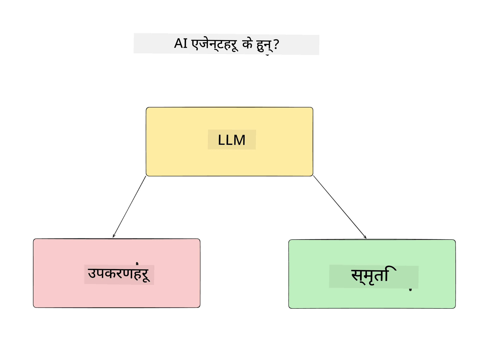
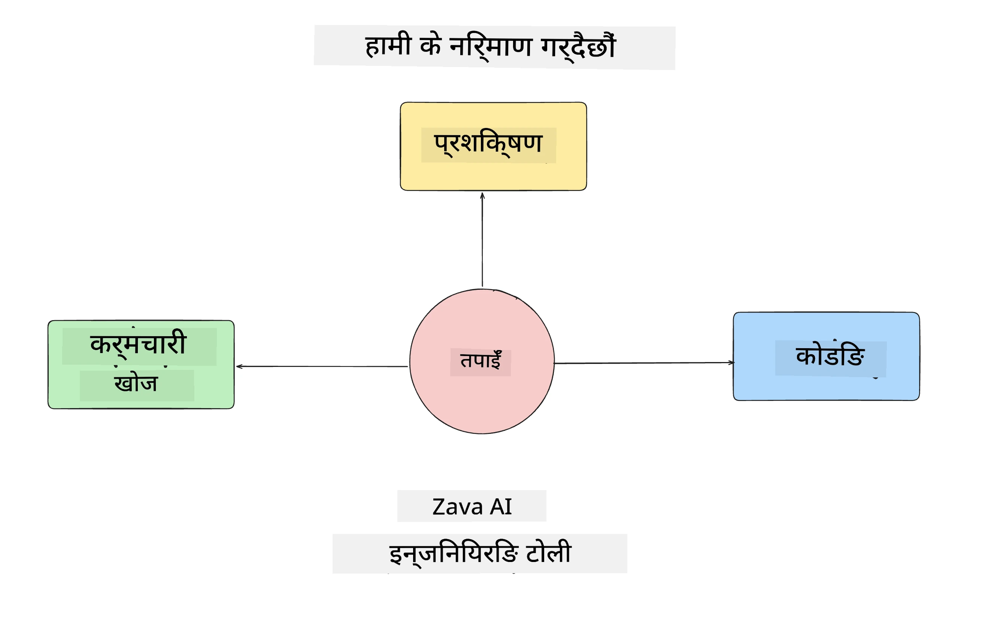
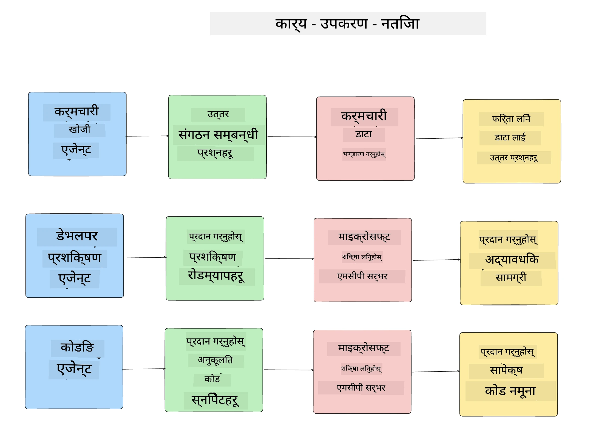
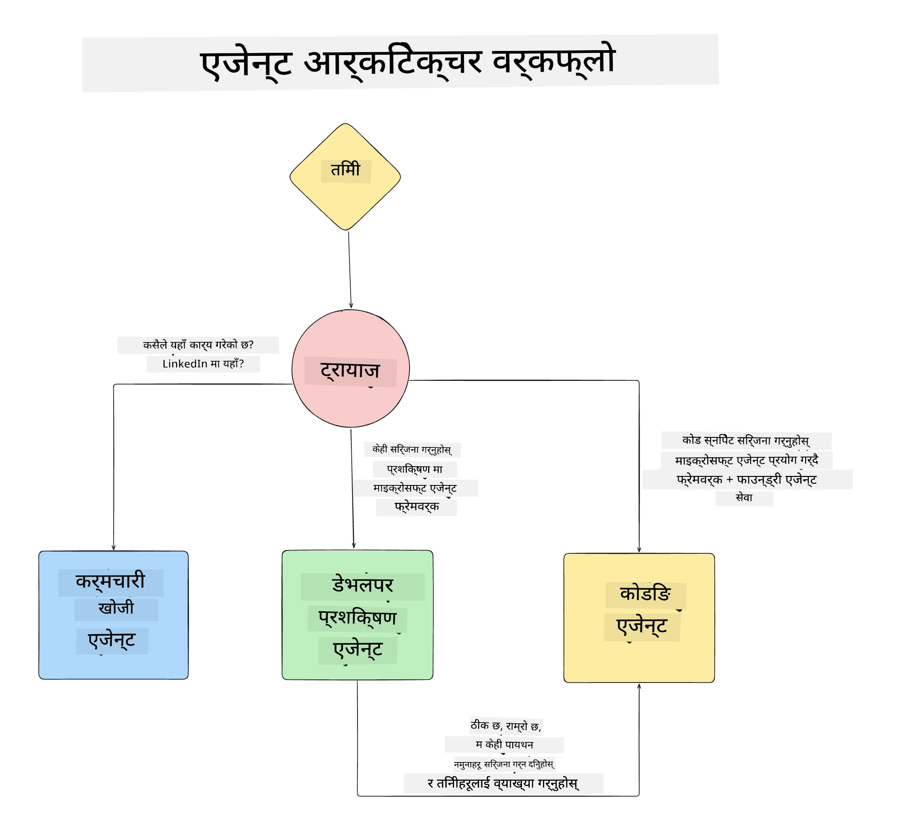

# पाठ १: एआई एजेन्ट डिजाइन

"शून्यदेखि उत्पादनसम्म एआई एजेन्ट निर्माण कोर्स" को पहिलो पाठमा स्वागत छ!

यस पाठमा हामीले समेट्नेछौं:

- एआई एजेन्ट के हुन् भनेर परिभाषित गर्ने
  
- हामीले बनाउँदै गरेको एआई एजेन्ट एप्लिकेसनबारे छलफल गर्ने  

- प्रत्येक एजेन्टको लागि आवश्यक उपकरण र सेवा पहिचान गर्ने
  
- हाम्रो एजेन्ट एप्लिकेसनलाई वास्तुकला गर्ने
  
एजेन्ट के हुन् र हामी किन एप्लिकेसनमा उनीहरूलाई प्रयोग गर्नेछौं भनेर परिभाषित गरेर सुरु गरौं।

> **कोर्स सुरु गर्नु अघि।** यो पहिलो पाठ वैचारिक छ — चलाउन कुनै कोड छैन।
> [पाठ २](../lesson-2-agent-development/README.md) बाट तपाइँलाई आवश्यक पर्छ: **Azure सदस्यता**
> जुनसँग **Microsoft Foundry** को पहुँच छ, तैनाथ गरिएको **GPT-5 श्रृंखला मोडेल** (जस्तै `gpt-5.1` — अवसान भएका GPT-4o / GPT-4.1 बाट बच्न), **Python 3.12+**, र **Azure CLI**
> (`az login`)। कोर्स README मा [तपाइँलाई के चाहिन्छ](../README.md#what-you-need) हेर्नुहोस् पूर्ण सूची र लिंकहरूका लागि।

## एआई एजेन्ट के हुन्?

यदि यो तपाईको पहिलो पटक हो कसरी एआई एजेन्ट बनाउने भनी अन्वेषण गर्ने, तपाईंसँग एआई एजेन्टलाई कसरी परिभाषित गर्ने भन्नेबारे प्रश्न हुन सक्छ।

एआई एजेन्टलाई यसका कम्पोनेन्टहरूद्वारा सरल तरिकाले परिभाषित गर्ने:

**ठूलो भाषा मोडेल (LLM)** - LLM ले प्रयोगकर्ताबाट प्राकृतिक भाषा प्रक्रिया गर्ने क्षमता र कार्य पूरा गर्न उपलब्ध उपकरणहरूको वर्णन व्याख्या गर्ने दुवै शक्ति दिनेछ।

**उपकरणहरू** - यी फंक्शनहरू, API हरू, डेटा स्टोरहरू र अन्य सेवाहरू हुनेछन् जसलाई LLM ले प्रयोगकर्ताले मागेका कार्य पूरा गर्न छनोट गर्न सक्छ।

**स्मृति** - यो हो जसले एआई एजेन्ट र प्रयोगकर्ताबीच छोटो समय र लामो समयको अन्तरक्रियालाई संग्रह गर्छ। यस जानकारीको भण्डारण र पुनःप्राप्ति सुधार गर्न र प्रयोगकर्ताका प्राथमिकताहरू समयसँगै बचत गर्न महत्वपूर्ण हुन्छ।

## हाम्रो एआई एजेन्ट प्रयोग मामला

यस कोर्सका लागि, हामी एआई एजेन्ट एप्लिकेसन बनाउनेछौं जसले नयाँ विकासकर्ताहरूलाई हाम्रो एआई एजेन्ट विकास टोलीमा सामेल हुन मद्दत गर्छ!

कुनै पनि विकास कार्य सुरु गर्नु अघि, सफल एआई एजेन्ट एप्लिकेसन सिर्जना गर्ने पहिलो चरण हो हाम्रो प्रयोगकर्ताहरूले कसरी एआई एजेन्टहरूसँग काम गर्ने आशा गर्छौं भन्ने स्पष्ट परिदृश्यों परिभाषित गर्नु।

यस एप्लिकेसनका लागि, हामी यी परिदृश्यहरूसँग काम गर्नेछौं:

**परिदृश्य १**: नयाँ कर्मचारी हाम्रो संस्थामा सामेल हुन्छन् र उनीहरूले सामेल गरेको टोली र कसरी उनीहरूसँग सम्पर्क गर्ने बारे जान्न चाहन्छन्।

**परिदृश्य २:** नयाँ कर्मचारीलाई थाहा पाउन चाहिन्छ कुन पहिलो कार्य उनीहरूले सुरु गर्न उपयुक्त हुन्छ।

**परिदृश्य ३:** नयाँ कर्मचारीलाई सिक्ने स्रोतहरू र कोड नमूनाहरू संकलन गर्न चाहिन्छ जसले उनीहरूलाई कार्य पूरा गर्न मद्दत गर्छ।

## उपकरणहरू र सेवाहरू पहिचान गर्दै

अब यी परिदृश्यहरू निर्माण भएपछि, अर्को चरण ती उपकरण र सेवाहरूलाई मैप गर्ने हो जुन हाम्रो एआई एजेन्टहरूले यी कार्यहरू पूरा गर्न आवश्यक पर्नेछन्।

यो प्रक्रिया सन्दर्भ अभियांत्रणको श्रेणीमा पर्दछ किनभने हामी हाम्रो एआई एजेन्टहरूलाई सही समयमा सही सन्दर्भ सुनिश्चित गर्न केन्द्रित हुनेछौं।

यसलाई परिदृश्य अनुसार गरौं र प्रत्येक एजेन्टको कार्य, उपकरणहरू र इच्छित परिणामहरूको सूची बनाएर राम्रो एजेन्टिक डिजाइन प्रदर्शन गरौं।

### परिदृश्य १ - कर्मचारी खोज एजेन्ट

**कार्य** - संस्थाका कर्मचारीहरूका बारे प्रश्नहरूको जवाफ दिने जस्तै लगइन मिति, वर्तमान टोली, स्थान र अन्तिम पद।

**उपकरणहरू** - वर्तमान कर्मचारी सूची र संगठन चार्टको डेटा स्टोर

**परिणामहरू** - डेटा स्टोरबाट जानकारी पुनःप्राप्ति गर्न सक्षम भएर सामान्य संगठनात्मक प्रश्नहरू र कर्मचारीहरूसँग सम्बन्धित विशेष प्रश्नहरूको उत्तर दिने।

### परिदृश्य २ - कार्य सिफारिस एजेन्ट

**कार्य** - नयाँ कर्मचारीको विकासकर्ता अनुभवका आधारमा, नयाँ कर्मचारीले काम गर्न सक्ने १-३ मुद्दाहरू सुझाउने।

**उपकरणहरू** - खुला मुद्दाहरू पाउन र विकासकर्ता प्रोफाइल बनाउन GitHub MCP सर्भर

**परिणामहरू** - GitHub प्रोफाइलका अन्तिम ५ कमिटहरू र GitHub परियोजनाका खुला मुद्दाहरू पढ्न सक्षम भएर मेल खाने आधारमा सिफारिसहरू गर्ने।

### परिदृश्य ३ - कोड सहायक एजेन्ट

**कार्य** - "कार्य सिफारिस" एजेन्टले सिफारिस गरेका खुला मुद्दाहरूको आधारमा अनुसन्धान गर्ने र स्रोतहरू प्रदान गर्ने तथा कर्मचारीलाई सहयोग गर्न कस्टम कोड स्निपेटहरू सिर्जना गर्ने।

**उपकरणहरू** - स्रोतहरू पाउन Microsoft Learn MCP र कस्टम कोड स्निपेटहरू उत्पन्न गर्न Code Interpreter।

**परिणामहरू** - यदि प्रयोगकर्ताले थप सहायता मागेमा, कार्यप्रवाहले Learn MCP सर्भर प्रयोग गरेर स्रोतहरूका लिंकहरू र स्निपेटहरू प्रदान गर्ने र त्यसपछि Code Interpreter एजेन्टलाई स-साना कोड स्निपेटहरू व्याख्या सहित सिर्जना गर्न सुम्पने।

## हाम्रो एजेन्ट एप्लिकेसनको वास्तुकला बनाउँदै

अब हामीले हरेक एजेन्ट परिभाषित गरिसकेकाले, यसले प्रत्येक एजेन्टले कार्य अनुसार कसरी सँगै र अलग काम गर्ने बुझ्न मद्दत गर्ने वास्तुकला चित्र बनाउन सकौं:

## आगामी कदमहरू

अब हामीले प्रत्येक एजेन्ट र हाम्रो एजेन्टिक सिस्टम डिजाइन गरिसकेकाले, अर्को पाठमा गएर यी सबै एजेन्टहरू विकास गरौं!

---

<!-- CO-OP TRANSLATOR DISCLAIMER START -->
**अस्वीकरण**:
यो दस्तावेज़ AI अनुवाद सेवा [Co-op Translator](https://github.com/Azure/co-op-translator) प्रयोग गरेर अनुवाद गरिएको हो। हामी सही हुन प्रयास गर्छौं, तर कृपया जानकार हुनुस् कि स्वचालित अनुवादमा त्रुटिहरू वा अशुद्धताहरू हुन सक्छन्। मूल दस्तावेज़ यसको मूल भाषामा आधिकारिक स्रोत मानिनुपर्छ। महत्वपूर्ण जानकारीका लागि व्यावसायिक मानव अनुवाद सिफारिस गरिन्छ। यस अनुवादको प्रयोगबाट उत्पन्न कुनै पनि गलत बुझाइ वा त्रुटिको लागि हामी जिम्मेवार छैनौं।
<!-- CO-OP TRANSLATOR DISCLAIMER END -->