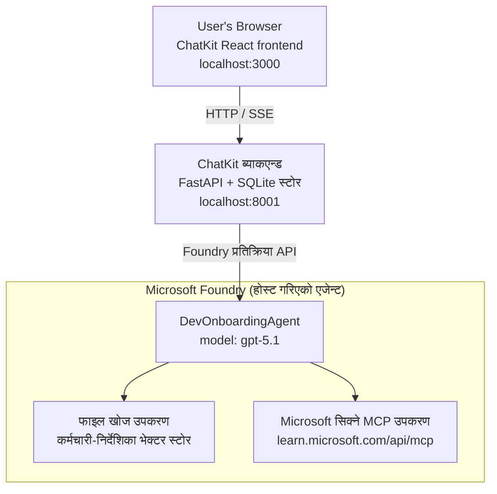

# पाठ ४: Microsoft Foundry होस्ट गरिएको एजेन्टहरू + ChatKit द्वारा एजेन्ट परिनियोजन

यो पाठले कसरी उपकरण-प्रयोग गर्ने एजेन्टलाई Microsoft Foundry मा होस्ट गरिएको एजेन्टको रूपमा परिनियोजन गर्ने र यसको साथ अन्तरक्रिया गर्न ChatKit-आधारित फ्रन्टएन्ड सिर्जना गर्ने तरीकाको प्रदर्शन गर्छ।

## वास्तुकला

होस्ट गरिएको एजेन्ट एक **एकल `DevOnboardingAgent`** हो (जेनेर `gpt-5.1` मा चलिरहेको छ) जुन दुई होस्ट गरिएको उपकरणहरू प्रयोग गरेर विकासकर्ता-ओनबोर्डिङ प्रश्नहरूको उत्तर दिन्छ: कर्मचारी-डायरेक्टरी भेक्टर स्टोरमा आधारित **फाइल खोज** उपकरण, र **Microsoft Learn MCP** उपकरण। एक ChatKit React फ्रन्टएन्डले FastAPI ब्याकएन्डसँग कुरा गर्छ, जसले Foundry को **Responses API** मार्फत एजेन्टलाई कल गर्छ।



## पूर्वापेक्षित

१. **Microsoft Foundry प्रोजेक्ट** North Central US क्षेत्रमा
२. **Azure CLI** प्रमाणीकृत (`az login`)
३. **Azure Developer CLI** (`azd`) स्थापना गरिएको
४. **Python 3.12+** र **Node.js 18+**
५. **वेक्टर स्टोर** कर्मचारी डाटासँग सिर्जना गरिएको

## छिटो सुरु

### १. वातावरण चरहरू सेटअप गर्नुहोस्

```bash
cd lesson-4-agentdeployment
cp .env.example .env
# तपाईंको Microsoft Foundry परियोजना विवरणहरू सहित .env सम्पादन गर्नुहोस्
```

### २. होस्ट गरिएको एजेन्ट परिनियोजन गर्नुहोस्

**विकल्प A: Azure Developer CLI प्रयोग गरेर (सिफारिस गरिएको)**

```bash
cd hosted-agent
azd auth login
azd agent deploy
```

**विकल्प B: Docker + Azure Container Registry प्रयोग गरेर**

```bash
cd hosted-agent

# कन्टेनर निर्माण गर्नुहोस्
docker build -t developer-onboarding-agent:latest .

# ACR का लागि ट्याग
docker tag developer-onboarding-agent:latest <your-acr>.azurecr.io/developer-onboarding-agent:latest

# ACR मा धकेल्नुहोस्
az acr login --name <your-acr>
docker push <your-acr>.azurecr.io/developer-onboarding-agent:latest

# Microsoft Foundry पोर्टल वा SDK मार्फत तैनात गर्नुहोस्
```

### ३. ChatKit ब्याकएन्ड सुरु गर्नुहोस्

```bash
cd chatkit-server
python -m venv .venv
source .venv/bin/activate  # विन्डोजमा: .venv\Scripts\activate
pip install -r requirements.txt
python app.py
```

सर्भर `http://localhost:8001` मा सुरु हुनेछ

### ४. ChatKit फ्रन्टएन्ड सुरु गर्नुहोस्

```bash
cd chatkit-server/frontend
npm install
npm run dev
```

फ्रन्टएन्ड `http://localhost:3000` मा सुरु हुनेछ

### ५. अनुप्रयोग परीक्षा गर्नुहोस्

आफ्नो ब्राउजरमा `http://localhost:3000` खोल्नुहोस् र यी क्वेरीहरू प्रयास गर्नुहोस्:

**कर्मचारी खोज:**
- "म नयाँ छु! के कसैले Microsoft मा काम गरेको छ?"
- "कसलाई Azure Functions को अनुभव छ?"

**शिक्षण स्रोतहरू:**
- "Kubernetes को लागि सिकाइ पाथ सिर्जना गर्नुहोस्"
- "क्लाउड आर्किटेक्चरका लागि कुन प्रमाणपत्रहरू लिनु पर्छ?"

**कोडिङ सहयोग:**
- "CosmosDB सँग जडान गर्न Python कोड लेख्न मद्दत गर्नुहोस्"
- "Azure Function कसरी सिर्जना गर्ने देखाउनुहोस्"

**बहु-एजेन्ट क्वेरीहरू:**
- "म क्लाउड इन्जिनियरको रूपमा सुरु गर्दैछु। म कससँग जडान हुनु पर्छ र के सिक्नु पर्छ?"

## परियोजना संरचना

```
lesson-4-agentdeployment/
├── .env.example                 # Environment variables template
├── implementation-plan.md       # Detailed implementation guide
├── README.md                    # This file
├── hosted-agent/               # Microsoft Foundry hosted agent
│   ├── main.py                 # Multi-agent workflow implementation
│   ├── requirements.txt        # Python dependencies
│   ├── Dockerfile              # Container definition
│   └── agent.yaml              # Agent deployment configuration
└── chatkit-server/             # ChatKit server application
    ├── app.py                  # FastAPI backend
    ├── store.py                # SQLite persistence layer
    ├── requirements.txt        # Python dependencies
    └── frontend/               # React frontend
        ├── package.json
        ├── vite.config.ts
        ├── tsconfig.json
        ├── index.html
        └── src/
            ├── main.tsx
            ├── App.tsx
            ├── App.css
            └── index.css
```

## एजेन्ट र यसको उपकरणहरू

होस्ट गरिएको एजेन्ट एक **एकल एजेन्ट** हो (`DevOnboardingAgent`, जसलाई `hosted-agent/main.py` मा परिभाषित गरिएको छ) जुन तीन ओनबोर्डिङ क्षेत्रहरू सम्हाल्छ। अलग-अलग उप-एजेन्टहरू संचालित गर्नुको सट्टा, यसले प्रत्येक क्षमता एक उपकरणको रूपमा उपलब्ध गराउँछ (वा मोडेलमा प्रत्यक्ष निर्भर हुन्छ):

| क्षमता | कसरी सम्हालिन्छ | उपकरण |
|-----------|------------------|------|
| **कर्मचारी खोज र जडानहरू** | कर्मचारी-डायरेक्टरी भेक्टर स्टोरमा Foundry होस्ट गरिएको फाइल खोज | `client.get_file_search_tool(vector_store_ids=[...])` |
| **शिक्षण र तालिम** | Microsoft Learn MCP सर्भर (होस्ट गरिएको MCP उपकरण) | `client.get_mcp_tool(url="https://learn.microsoft.com/api/mcp")` |
| **कोडिङ सहायता** | `gpt-5.1` मोडेलले प्रत्यक्ष सम्हाल्छ — कुनै बाह्य उपकरण छैन | — |

एजेन्ट `client.as_agent(name="DevOnboardingAgent", instructions=..., tools=[file_search_tool, learn_mcp_tool])` को साथ सिर्जना गरिएको छ र `from_agent_framework(agent).run()` बाट सेवा गरिएको छ।

> **डिजाइन नोट।** यस पाठका प्रारम्भिक मस्यौदाहरूले `HandoffBuilder` बहु-एजेन्ट कार्यप्रवाह (Triage → विशेषज्ञहरू) प्रयोग गरेका थिए। जहाज गरिएको एजेन्ट एकल उपकरण-प्रयोग गर्ने एजेन्ट हो, जुन ओनबोर्डिङ शैलीका प्रश्नोत्तरका लागि सजिलो र तैनाथ गर्न सरल छ। बहु-एजेन्ट व्यवस्थापन र ह्यान्डअफको उदाहरणका लागि, पाठ २ र पाठ ३ हेर्नुहोस्।

## होस्ट गरिएको एजेन्टको स्मोक परीक्षण (CI गेट)

सफलतापूर्वक होस्ट गरिएको एजेन्ट परिनियोजनले मात्र नियन्त्रण तहले परिभाषा स्वीकार गरेको प्रमाणित गर्छ — यसले एजेन्टले साँच्चै उत्तर दिन्छ भनेर प्रमाणित गर्दैन। हराएको निर्भरता,
खराब मोडेल मार्गनिर्देशन, वा समाप्त भएको जडानले हरियो तर मौन एजेन्ट रहन सक्छ।


यो पाठले हल्का **स्मोक परीक्षण** आपूर्ति गर्दछ जुन छिटो, सस्तो पोस्ट-डिप्लॉय गेटको रूपमा काम गर्छ। यसले [AI Smoke Test](https://github.com/marketplace/actions/ai-smoke-test)
GitHub कार्यलाई एजेन्टको Foundry **Responses** अन्तिम बिन्दुमा POST प्रम्प्टहरू पठाउन प्रयोग गर्छ
(`POST {project_endpoint}/agents/{agent_name}/endpoint/protocols/openai/responses`)
र फर्केको पाठमा दाबी गर्दछ। यसले क्षतिग्रस्त परिनियोजनहरू, प्रमाणीकरण रिग्रेसनहरू,
प्रणाली-प्रम्प्ट भङ्ग, र थ्रेडिङ टूटफूटलाई सेकेन्डमै पत्ता लगाउँछ।


> स्मोक परीक्षणहरू पूर्ण मूल्याङ्कनहरूको प्रतिस्थापन **होइनन्**,
> [पाठ ३](../lesson-3-agent-evals/README.md) मा — तिनीहरू पूरक हुन्। स्मोक परीक्षणहरूले
> जवाफ दिन्छन् *"एजेन्ट पहुँच योग्य छ, प्रतिक्रिया दिइरहेको छ, र आधारभूत प्रम्प्ट अपेक्षाहरू अनुसरण गरिरहेको छ?"*;
> मूल्याङ्कनहरूले जवाफ दिन्छन् *"प्रतिक्रिया कति राम्रो छ?"*। प्रत्येक परिनियोजनमा सस्तो गेट चलाउनुहोस्।

### के परीक्षण गरिन्छ

सूची [ `hosted-agent/tests/smoke-tests.json`](../../../lesson-4-agentdeployment/hosted-agent/tests/smoke-tests.json) मा छ
र एजेन्टका तीन क्षेत्रहरू साथै प्रम्प्ट पालना र बहु-पल्ट थ्रेडिङ प्रयोग गर्दछ:

| परीक्षण | के प्रमाणित गर्छ |
|------|------------------|
| `reachability` | एजेन्टले खाली नभएको, सान्दर्भिक पाठसहित प्रतिक्रिया दिन्छ |
| `employee-search` | फाइल-खोज क्षेत्रले स्वस्थ `200` फर्काउँछ (उत्तर डाटा-निर्भर हुन्छ) |
| `learning-path` | सिकाइ क्षेत्रले विषय दोहोर्याउँछ र पथ-शैलीको उत्तर दिन्छ |
| `coding-assistance` | कोडिङ क्षेत्रले कोड-जस्तो Python उत्तर दिन्छ |
| `prompt-adherence-offtopic` | अफ-टोपिक अनुरोध पुनर्निर्देशित हुन्छ, विस्तृत जवाफ दिइँदैन |
| `threading-turn-1/2` | वार्तालाप अवस्था `previous_response_id` मार्फत पल्टहरूमा कायम राखिन्छ |

### CI मा चलाउनुहोस्

कार्यप्रवाह [`.github/workflows/smoke-test-hosted-agent.yml`](../../../.github/workflows/smoke-test-hosted-agent.yml)
मा दुई कामहरू छन्:

- **`static`** — छिटो, कुनै Azure आवश्यक नभएको गेट जसले हरेक पुल अनुरोध र पुशमा चल्छ:
  यसले सबै Python स्रोतहरू (`py_compile`) कम्पाइल गर्छ र Markdown लिंक जाँच्छ। कुनै गोप्य जानकारी आवश्यक पर्दैन,
  त्यसैले यो फोर्क PR मा पनि काम गर्छ।
- **`smoke`** — तलको Azure-संलग्न स्मोक परीक्षण। यो मागअनुसार चल्छ
  (Actions → **Agent CI (static + smoke)** → Run workflow) र तपाईंको परिनियोजन कार्यप्रवाह पछि जोड्न सकिन्छ।


स्मोक कामका लागि यी रिपोजिटरी **चरहरू** र **गोप्यहरू** कन्फिगर गर्नुहोस्:

| प्रकार | नाम | मान |
|------|------|-------|

| परिवर्तनशिल | `FOUNDRY_PROJECT_ENDPOINT` | `https://<account>.services.ai.azure.com/api/projects/<project>` |
| परिवर्तनशिल | `HOSTED_AGENT_NAME` | परिनियोजित एजेन्ट नाम (जस्तै `dev-onboarding` — तपाइँको परिनियोजनसँग मेल खानुपर्छ) |
| गोप्य | `AZURE_CLIENT_ID` / `AZURE_TENANT_ID` / `AZURE_SUBSCRIPTION_ID` | `azure/login` का लागि OIDC संघीय पहिचान |

रनर पहिचानलाई Responses (र कुराकानीहरू) डेटा-प्लेन एन्डपोइन्टहरू कल गर्न **`Azure AI User`** भूमिका
**Foundry प्रोजेक्ट स्कोप** मा आवश्यक छ। यसलाई यसरी अनुमति दिनुहोस्:

```bash
az role assignment create \
  --assignee <object-id-or-appId-of-runner-identity> \
  --role "Azure AI User" \
  --scope "/subscriptions/<sub>/resourceGroups/<rg>/providers/Microsoft.CognitiveServices/accounts/<account>/projects/<project>"
```

### यसलाई स्थानीय रूपमा चलाउनुहोस्

तपाईं सोही क्याटलगलाई धकेल्नु अघि चलाउन सक्नुहुन्छ। `https://ai.azure.com/` स्कोप गरिएको डेटा-प्लेन टोकन प्राप्त
गर्दै तपाइँको परिनियोजनमा रनरलाई लक्षित गर्नुहोस्:

```bash
# दर्शक हुनु पर्छ https://ai.azure.com/ (cognitiveservices.azure.com टोकनहरू अस्वीकार गरिन्छ)
export FOUNDRY_TOKEN=$(az account get-access-token --resource https://ai.azure.com/ --query accessToken -o tsv)

git clone https://github.com/JFolberth/ai-smoketest && cd ai-smoketest
python runner.py \
  --project-endpoint "https://<account>.services.ai.azure.com/api/projects/<project>" \
  --agent-name dev-onboarding \
  --tests-file ../lesson-4-agentdeployment/hosted-agent/tests/smoke-tests.json
```

निकास कोडहरू: `0` सबै सफल, `1` एक असर्शन असफल भयो, `2` रनर त्रुटि (खराब क्याटलग / टोकन)।

## समस्या समाधान

### एजेन्ट प्रतिक्रिया दिँदैन
- होस्टेड एजेन्ट Microsoft Foundry मा तैनाथ र चलिरहेको छ भनि जाँच गर्नुहोस्
- `HOSTED_AGENT_NAME` र `HOSTED_AGENT_VERSION` तपाइँको परिनियोजनसँग मेल खान्छ कि छैन जाँच्नुहोस्

### भेक्टर स्टोर त्रुटिहरू
- `VECTOR_STORE_ID` ठीकसँग सेट गरिएको छ कि छैन सुनिश्चित गर्नुहोस्
- भेक्टर स्टोरमा कर्मचारी डेटा छ कि छैन जाँच्नुहोस्

### प्रमाणिकरण त्रुटिहरू
- प्रमाणपत्र पुनः ताज़ा गर्न `az login` चलाउनुहोस्
- तपाइँलाई Microsoft Foundry प्रोजेक्ट पहुँच छ कि छैन सुनिश्चित गर्नुहोस्

## स्रोतहरू

- [Microsoft Foundry Hosted Agents Documentation](https://learn.microsoft.com/en-us/azure/ai-foundry/agents/concepts/hosted-agents)
- [Microsoft Agent Framework](https://github.com/microsoft/agent-framework)
- [ChatKit Integration Sample](https://github.com/microsoft/agent-framework/tree/main/python/samples/demos/chatkit-integration)
- [Azure Developer CLI](https://learn.microsoft.com/en-us/azure/developer/azure-developer-cli/overview)
- [AI Smoke Test GitHub Action](https://github.com/marketplace/actions/ai-smoke-test)
- [Smoke Test Microsoft Foundry Agents with GitHub Actions (blog)](https://techcommunity.microsoft.com/blog/azuredevcommunityblog/smoke-test-microsoft-foundry-agents-with-github-actions/4531912)

---

## आगामी चरणहरू

तपाइँको एजेन्ट Microsoft व्यवस्थापन गरिएका पूर्वाधारमा चल्दछ। यसलाई उद्यम उत्पादनमा लैजान —
जहाँ यसको डेटा अवस्थित हुन्छ (डेटा सार्वभौमिकता, निजी नेटवर्किङ, आफ्नो Azure Cosmos DB /
Storage / AI Search ल्याउनुहोस्) र यसको उपकरणहरूलाई नियन्त्रण गर्ने — जारी राख्नुहोस्
**[पाठ 5: उत्पादन होस्टेड एजेन्टहरू](../lesson-5-hosted-agents-production/README.md)**, जसले
**होस्टेड एजेन्टहरू** र **क्षमता होस्टहरू** बीचको महत्त्वपूर्ण फरक स्पष्ट पार्छ।

---

<!-- CO-OP TRANSLATOR DISCLAIMER START -->
**अस्वीकरण**:
यो दस्तावेज़ AI अनुवाद सेवा [Co-op Translator](https://github.com/Azure/co-op-translator) प्रयोग गरेर अनुवाद गरिएको हो। हामी सही हुन प्रयास गर्छौं, तर कृपया जानकार हुनुस् कि स्वचालित अनुवादमा त्रुटिहरू वा अशुद्धताहरू हुन सक्छन्। मूल दस्तावेज़ यसको मूल भाषामा आधिकारिक स्रोत मानिनुपर्छ। महत्वपूर्ण जानकारीका लागि व्यावसायिक मानव अनुवाद सिफारिस गरिन्छ। यस अनुवादको प्रयोगबाट उत्पन्न कुनै पनि गलत बुझाइ वा त्रुटिको लागि हामी जिम्मेवार छैनौं।
<!-- CO-OP TRANSLATOR DISCLAIMER END -->