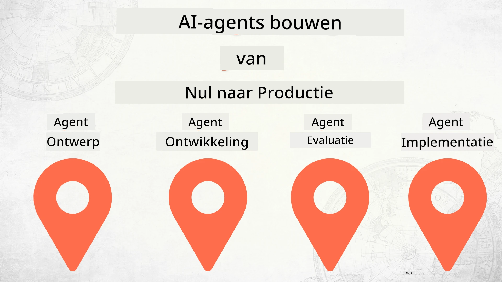

# AI-agenten bouwen van nul tot productie



### 🌐 Meertalige ondersteuning

#### Ondersteund via GitHub Action (Geautomatiseerd & Altijd Up-to-date)

<!-- CO-OP TRANSLATOR LANGUAGES TABLE START -->
[Arabisch](../ar/README.md) | [Bengaals](../bn/README.md) | [Bulgaars](../bg/README.md) | [Birmaans (Myanmar)](../my/README.md) | [Chinees (Vereenvoudigd)](../zh-CN/README.md) | [Chinees (Traditioneel, Hong Kong)](../zh-HK/README.md) | [Chinees (Traditioneel, Macau)](../zh-MO/README.md) | [Chinees (Traditioneel, Taiwan)](../zh-TW/README.md) | [Kroatisch](../hr/README.md) | [Tsjechisch](../cs/README.md) | [Deens](../da/README.md) | [Nederlands](./README.md) | [Ests](../et/README.md) | [Fins](../fi/README.md) | [Frans](../fr/README.md) | [Duits](../de/README.md) | [Grieks](../el/README.md) | [Hebreeuws](../he/README.md) | [Hindi](../hi/README.md) | [Hongaars](../hu/README.md) | [Indonesisch](../id/README.md) | [Italiaans](../it/README.md) | [Japans](../ja/README.md) | [Kannada](../kn/README.md) | [Koreaans](../ko/README.md) | [Litouws](../lt/README.md) | [Maleis](../ms/README.md) | [Malayalam](../ml/README.md) | [Marathi](../mr/README.md) | [Nepalees](../ne/README.md) | [Nigeriaans Pidgin](../pcm/README.md) | [Noors](../no/README.md) | [Perzisch (Farsi)](../fa/README.md) | [Pools](../pl/README.md) | [Portugees (Brazilië)](../pt-BR/README.md) | [Portugees (Portugal)](../pt-PT/README.md) | [Punjabi (Gurmukhi)](../pa/README.md) | [Roemeens](../ro/README.md) | [Russisch](../ru/README.md) | [Servisch (Cyrillisch)](../sr/README.md) | [Slowaaks](../sk/README.md) | [Sloveens](../sl/README.md) | [Spaans](../es/README.md) | [Swahili](../sw/README.md) | [Zweeds](../sv/README.md) | [Tagalog (Filipijns)](../tl/README.md) | [Tamil](../ta/README.md) | [Telugu](../te/README.md) | [Thais](../th/README.md) | [Turks](../tr/README.md) | [Oekraïens](../uk/README.md) | [Urdu](../ur/README.md) | [Vietnamees](../vi/README.md)

> **Lievere lokaal klonen?**

> Deze repository bevat meer dan 50 taalvertalingen, wat de downloadgrootte aanzienlijk vergroot. Om te klonen zonder vertalingen, gebruik sparse checkout:
> ```bash
> git clone --filter=blob:none --sparse https://github.com/microsoft/Building-AI-Agents-From-Zero-To-Production.git
> cd Building-AI-Agents-From-Zero-To-Production
> git sparse-checkout set --no-cone '/*' '!translations' '!translated_images'
> ```
> Dit geeft je alles wat je nodig hebt om de cursus te voltooien met een veel snellere download.
<!-- CO-OP TRANSLATOR LANGUAGES TABLE END -->

## Een cursus die je de basisprincipes leert van de AI-agent ontwikkelingslevenscyclus

[](https://github.com/microsoft/Building-AI-Agents-From-Zero-To-Production/blob/master/LICENSE?WT.mc_id=academic-105485-koreyst)
[](https://GitHub.com/microsoft/Building-AI-Agents-From-Zero-To-Production/graphs/contributors/?WT.mc_id=academic-105485-koreyst)
[](https://GitHub.com/microsoft/Building-AI-Agents-From-Zero-To-Production/issues/?WT.mc_id=academic-105485-koreyst)
[](https://GitHub.com/microsoft/Building-AI-Agents-From-Zero-To-Production/pulls/?WT.mc_id=academic-105485-koreyst)
[](http://makeapullrequest.com?WT.mc_id=academic-105485-koreyst)

[](https://discord.gg/Kuaw3ktsu6)

## 🌱 Aan de slag

Deze cursus bevat lessen over de basis van het bouwen en inzetten van AI-agenten.

Elke les bouwt voort op de vorige, dus we raden aan om bij het begin te beginnen en door te werken tot het einde.

Als je meer wilt ontdekken over AI-agentonderwerpen, kun je de [AI Agents For Beginners Course](https://aka.ms/ai-agents-beginners) bekijken.

### Ontmoet andere leerlingen, krijg antwoord op je vragen

Als je vastloopt of vragen hebt over het bouwen van AI-agenten, sluit je aan bij ons speciale Discord-kanaal in de [Microsoft Foundry Discord](https://discord.gg/Kuaw3ktsu6).

### Wat je nodig hebt

Elke les heeft zijn eigen codevoorbeeld dat je lokaal kunt draaien. Je kunt [deze repo forken](https://github.com/microsoft/Building-AI-Agents-From-Zero-To-Production/fork) om je eigen kopie te maken.

Deze cursus gebruikt momenteel het volgende:

- [Microsoft Agent Framework (MAF)](https://aka.ms/ai-agents-beginners/agent-framework)
- [Microsoft Foundry](https://azure.microsoft.com/products/ai-foundry)
- [Azure OpenAI Service](https://azure.microsoft.com/products/ai-foundry/models/openai)
- [Azure CLI](https://learn.microsoft.com/cli/azure/authenticate-azure-cli?view=azure-cli-latest)

Zorg ervoor dat je toegang hebt tot deze services voordat je begint.

Meer opties rond modelhosting en services komen binnenkort.

## 🗃️ Lessen

| **Les**                  | **Beschrijving**                                                                                |
|--------------------------|------------------------------------------------------------------------------------------------|
| [Agentontwerp](./lesson-1-agent-design/README.md)          | Een introductie tot onze "Developer Onboarding" Agent Use Case en hoe je effectieve agenten ontwerpt |
| [Agentontwikkeling](./lesson-2-agent-development/README.md) | Gebruikmakend van het Microsoft Agent Framework (MAF), maak 3 agenten die nieuwe ontwikkelaars helpen aan boord te komen. |
| [Agentbeoordelingen](./lesson-3-agent-evals/README.md)     | Gebruik Microsoft Foundry, ontdek hoe goed onze AI-agenten presteren en hoe ze te verbeteren.   |
| [Agentinzet](./lesson-4-agent-deployment/README.md)        | Gebruikmakend van de gehoste agenten en OpenAI Chatkit, zie hoe je een AI-agent in productie inzet.  |


## 🎒 Andere cursussen

Ons team ontwikkelt ook andere cursussen! Bekijk:

<!-- CO-OP TRANSLATOR OTHER COURSES START -->
### LangChain
[](https://aka.ms/langchain4j-for-beginners)
[](https://aka.ms/langchainjs-for-beginners?WT.mc_id=m365-94501-dwahlin)
[](https://github.com/microsoft/langchain-for-beginners?WT.mc_id=m365-94501-dwahlin)
---

### Azure / Edge / MCP / Agents
[](https://github.com/microsoft/AZD-for-beginners?WT.mc_id=academic-105485-koreyst)
[](https://github.com/microsoft/edgeai-for-beginners?WT.mc_id=academic-105485-koreyst)
[](https://github.com/microsoft/mcp-for-beginners?WT.mc_id=academic-105485-koreyst)
[](https://github.com/microsoft/ai-agents-for-beginners?WT.mc_id=academic-105485-koreyst)

---
 
### Generatieve AI Serie
[](https://github.com/microsoft/generative-ai-for-beginners?WT.mc_id=academic-105485-koreyst)
[-9333EA?style=for-the-badge&labelColor=E5E7EB&color=9333EA)](https://github.com/microsoft/Generative-AI-for-beginners-dotnet?WT.mc_id=academic-105485-koreyst)
[-C084FC?style=for-the-badge&labelColor=E5E7EB&color=C084FC)](https://github.com/microsoft/generative-ai-for-beginners-java?WT.mc_id=academic-105485-koreyst)
[-E879F9?style=for-the-badge&labelColor=E5E7EB&color=E879F9)](https://github.com/microsoft/generative-ai-with-javascript?WT.mc_id=academic-105485-koreyst)

---
 
### Kernleren
[](https://aka.ms/ml-beginners?WT.mc_id=academic-105485-koreyst)
[](https://aka.ms/datascience-beginners?WT.mc_id=academic-105485-koreyst)
[](https://aka.ms/ai-beginners?WT.mc_id=academic-105485-koreyst)
[](https://github.com/microsoft/Security-101?WT.mc_id=academic-96948-sayoung)
[](https://aka.ms/webdev-beginners?WT.mc_id=academic-105485-koreyst)
[](https://aka.ms/iot-beginners?WT.mc_id=academic-105485-koreyst)
[](https://github.com/microsoft/xr-development-for-beginners?WT.mc_id=academic-105485-koreyst)

---
 
### Copilot Serie
[](https://aka.ms/GitHubCopilotAI?WT.mc_id=academic-105485-koreyst)
[](https://github.com/microsoft/mastering-github-copilot-for-dotnet-csharp-developers?WT.mc_id=academic-105485-koreyst)
[](https://github.com/microsoft/CopilotAdventures?WT.mc_id=academic-105485-koreyst)
<!-- CO-OP TRANSLATOR OTHER COURSES END -->

## Bijdragen

Dit project verwelkomt bijdragen en suggesties. De meeste bijdragen vereisen dat je akkoord gaat met een
Contributor License Agreement (CLA) waarin verklaard wordt dat je het recht hebt en daadwerkelijk verleent
dat wij je bijdrage mogen gebruiken. Voor details, bezoek <https://cla.opensource.microsoft.com>.

Wanneer je een pull request indient, bepaalt een CLA-bot automatisch of je een
CLA moet verstrekken en markeert het PR dienovereenkomstig (bijv. statuscontrole, commentaar). Volg eenvoudig de instructies
van de bot. Je hoeft dit slechts één keer te doen voor alle repositories die onze CLA gebruiken.

Dit project heeft de [Microsoft Open Source Code of Conduct](https://opensource.microsoft.com/codeofconduct/) aangenomen.
Voor meer informatie, zie de [Code of Conduct FAQ](https://opensource.microsoft.com/codeofconduct/faq/) of
neem contact op met [opencode@microsoft.com](mailto:opencode@microsoft.com) bij aanvullende vragen of opmerkingen.

## Handelsmerken

Dit project kan handelsmerken of logo's bevatten van projecten, producten of diensten. Het geautoriseerd gebruik van Microsoft
handelsmerken of logo's is gebonden aan en moet voldoen aan
[Microsoft's Trademark & Brand Guidelines](https://www.microsoft.com/legal/intellectualproperty/trademarks/usage/general).
Gebruik van Microsoft-handelsmerken of logo's in gewijzigde versies van dit project mag geen verwarring veroorzaken of impliceren dat Microsoft sponsor is.
Elk gebruik van handelsmerken of logo's van derden is onderhevig aan het beleid van die derden.

## Hulp Krijgen

Als je vastloopt of vragen hebt over het bouwen van AI-apps, sluit je aan bij:

[](https://discord.gg/Kuaw3ktsu6)

Als je productfeedback hebt of fouten tegenkomt tijdens het bouwen, bezoek:

[](https://aka.ms/foundry/forum)

---

<!-- CO-OP TRANSLATOR DISCLAIMER START -->
**Disclaimer**:
Dit document is vertaald met behulp van de AI-vertalingsservice [Co-op Translator](https://github.com/Azure/co-op-translator). Hoewel we streven naar nauwkeurigheid, dient u er rekening mee te houden dat geautomatiseerde vertalingen fouten of onnauwkeurigheden kunnen bevatten. Het originele document in de oorspronkelijke taal moet worden beschouwd als de gezaghebbende bron. Voor cruciale informatie wordt professionele menselijke vertaling aanbevolen. Wij zijn niet aansprakelijk voor misverstanden of verkeerde interpretaties die voortvloeien uit het gebruik van deze vertaling.
<!-- CO-OP TRANSLATOR DISCLAIMER END -->